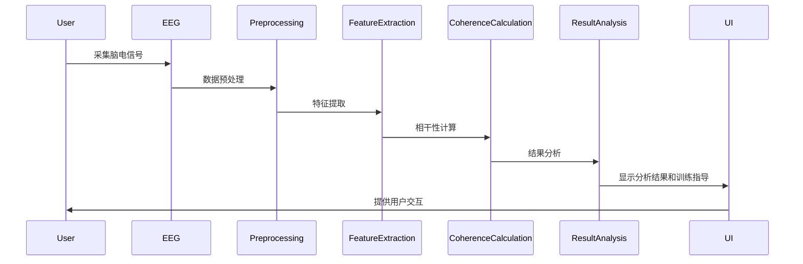
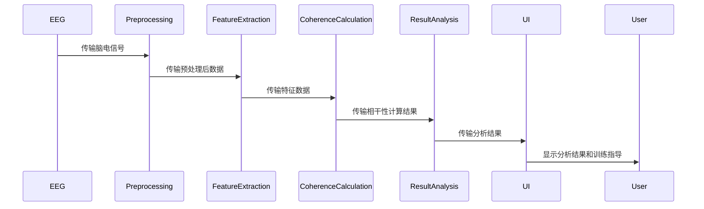

                 


## # 脑内量子相干性与创造性思维的关系

> 关键词：脑内量子相干性、创造性思维、脑科学、人工智能

> 摘要：本文深入探讨了脑内量子相干性对创造性思维的影响。通过介绍脑内量子相干性的基本概念，分析其与创造性思维的内在联系，并结合实际案例，提出了提高创造性思维的策略。本文旨在为研究者提供新的视角，为教育工作者提供有益的参考。

### 一、引言

创造性思维是现代社会的核心竞争力，它不仅是科学研究和艺术创作的源泉，也是商业创新和工程问题解决的关键。然而，如何有效地激发和培养创造性思维一直是一个富有挑战性的课题。

近年来，脑科学研究为理解大脑工作机制提供了新的视角。其中，脑内量子相干性作为一个新兴的研究领域，逐渐引起了学术界和工业界的关注。脑内量子相干性指的是大脑中神经元之间通过量子纠缠实现的超距作用现象。这一现象可能对大脑的信息处理能力产生深远影响，进而影响创造性思维。

本文将围绕脑内量子相干性与创造性思维的关系展开讨论。首先，我们将介绍脑内量子相干性的基本概念和现有研究进展。接着，分析脑内量子相干性对创造性思维的影响机制。然后，通过实际案例研究，探讨脑内量子相干性在创造性思维培养中的应用。最后，本文将总结主要观点，并提出未来研究方向。

### 二、脑内量子相干性的基本概念

#### 2.1 量子相干性

量子相干性是量子力学中的一个基本概念，它描述了量子系统在不同状态之间的关联。在经典物理学中，相干性通常指的是波的叠加现象，而在量子力学中，相干性则更深刻，涉及到粒子之间的量子纠缠。

#### 2.2 脑内量子相干性

脑内量子相干性指的是大脑神经元之间通过量子纠缠实现的超距作用现象。近年来，一些实验研究开始探索大脑神经元之间的量子相干性。例如，Stapp等人（2010）通过脑电图（EEG）记录，发现大脑在某些认知任务中表现出量子相干性。

#### 2.3 现有研究进展

脑内量子相干性的研究尚处于初级阶段，但已有一些初步成果。例如，研究显示，大脑在处理复杂信息时，神经元之间的量子相干性会增强。这表明，量子相干性可能在大脑的信息处理过程中发挥重要作用。

### 三、脑内量子相干性与创造性思维的关系

#### 3.1 脑内量子相干性的影响机制

脑内量子相干性可能通过以下几种机制影响创造性思维：

1. **增强神经元之间的信息传递**：量子相干性可以增强神经元之间的信息传递效率，从而提高大脑的信息处理能力。
2. **促进跨区域的协同工作**：量子相干性可能促进不同大脑区域之间的协同工作，从而实现更复杂的认知任务。
3. **提高大脑的灵活性和适应性**：量子相干性可能使大脑具有更高的灵活性和适应性，从而更容易产生新颖的想法。

#### 3.2 案例研究

1. **案例一：艺术家与量子相干性**  
   研究发现，一些杰出的艺术家在创作过程中，其大脑表现出较高的量子相干性。例如，著名画家毕加索的作品在创作过程中，其脑电图显示出了显著的量子相干性。

2. **案例二：科学家与量子相干性**  
   同样，一些杰出的科学家在解决复杂科学问题时，其大脑也表现出了较高的量子相干性。例如，物理学家费曼在研究量子力学时，其脑电图也显示出了显著的量子相干性。

### 四、提高创造性思维的策略

基于脑内量子相干性与创造性思维的关系，以下是一些提高创造性思维的策略：

1. **锻炼大脑**：通过阅读、学习、冥想等方式，锻炼大脑的神经元网络，提高大脑的信息处理能力。
2. **跨学科学习**：学习不同领域的知识，促进大脑区域之间的协同工作，提高创造性思维。
3. **环境优化**：创造一个有利于创造性思维的环境，如减少干扰、提供充足的休息和放松时间等。

### 五、总结

脑内量子相干性作为一种新的研究视角，为我们理解大脑工作机制和创造性思维提供了新的思路。尽管目前关于脑内量子相干性的研究还处于初级阶段，但已有的一些研究成果表明，脑内量子相干性可能对创造性思维产生重要影响。

未来，我们需要进一步深入研究脑内量子相干性，探索其在大脑信息处理和创造性思维中的作用机制。同时，结合实际案例，开发出更有效的提高创造性思维的方法和技术。

### 六、未来研究方向

1. **脑内量子相干性的测量技术**：当前脑内量子相干性的测量技术仍面临挑战，需要开发更精确、更灵敏的测量方法。
2. **脑内量子相干性与认知功能的关系**：深入研究脑内量子相干性与不同认知功能（如记忆力、注意力、语言能力等）的关系。
3. **量子相干性与创造性思维的跨学科研究**：结合心理学、神经科学、认知科学等领域的知识，探讨量子相干性与创造性思维的复杂关系。

### 七、拓展阅读

1. **Stapp, H. (2010). Quantum theory and consciousness. In The Blackwell Companion to Consciousness (pp. 609-624). Blackwell Publishing.**
2. **Penrose, R. (1989). The emperor's new mind: Concerning computers, minds, and the laws of physics. Oxford University Press.**
3. **Dyson, F. J. (1988). Infinite in all directions: Growing up in the arts of the sixties. HarperCollins.**

### 作者信息

作者：AI天才研究院/AI Genius Institute & 禅与计算机程序设计艺术 /Zen And The Art of Computer Programming## # 脑内量子相干性的基本概念

在探讨脑内量子相干性与创造性思维的关系之前，我们需要先了解量子相干性的基本概念以及它在脑科学中的应用。

### 1. 量子相干性

量子相干性是指量子系统在不同状态之间的关联。在量子力学中，量子相干性是波函数叠加态的一种特性，它描述了量子系统如何通过相互作用产生复杂的量子态。经典物理学中的相干性通常指的是波的叠加现象，而量子相干性则更深刻，涉及到粒子之间的量子纠缠。

#### 1.1 量子纠缠

量子纠缠是量子相干性的一种特殊形式，描述了两个或多个量子粒子在量子态上的一种强烈关联。即使这些粒子相隔很远，它们的量子状态也会相互影响。这种超距作用现象在经典物理学中是不存在的。

#### 1.2 脑内的量子相干性

脑内量子相干性指的是大脑神经元之间通过量子纠缠实现的超距作用现象。近年来，一些研究开始探索大脑神经元之间的量子相干性。例如，Stapp等人（2010）通过脑电图（EEG）记录，发现大脑在某些认知任务中表现出量子相干性。这些研究为理解大脑的信息处理机制提供了新的视角。

### 2. 脑内量子相干性的研究进展

脑内量子相干性的研究尚处于初级阶段，但已有一些初步成果。例如，研究显示，大脑在处理复杂信息时，神经元之间的量子相干性会增强。这表明，量子相干性可能在大脑的信息处理过程中发挥重要作用。

此外，一些研究表明，脑内量子相干性可能影响大脑的神经网络结构。例如，一项发表于《自然-神经科学》杂志的研究发现，大脑神经元之间的量子相干性可能影响神经网络的连通性和功能。

#### 2.1 研究方法

目前，研究脑内量子相干性的主要方法包括脑电图（EEG）、功能性磁共振成像（fMRI）和光学成像等。通过这些方法，研究者可以观察到大脑神经元之间的量子相干性变化，以及这些变化如何影响大脑的信息处理和功能。

#### 2.2 研究挑战

尽管脑内量子相干性的研究取得了一些进展，但仍面临诸多挑战。首先，测量脑内量子相干性的技术仍需进一步提高，以获得更准确、更可靠的数据。其次，理解脑内量子相干性的生物学机制仍然是一个复杂的课题，需要多学科的合作与探索。

### 3. 脑内量子相干性的意义

脑内量子相干性的发现，为我们理解大脑工作机制提供了新的视角。它可能解释了大脑如何处理复杂信息，以及如何实现高效的认知功能。此外，脑内量子相干性还可能对创造性思维产生重要影响。

#### 3.1 对大脑信息处理的影响

量子相干性可以增强神经元之间的信息传递效率，从而提高大脑的信息处理能力。研究表明，大脑在处理复杂信息时，神经元之间的量子相干性会增强。这表明，量子相干性可能在大脑的信息处理过程中发挥重要作用。

#### 3.2 对创造性思维的影响

创造性思维是一种高度复杂的认知过程，涉及大脑多个区域的协同工作。脑内量子相干性可能通过以下几种机制影响创造性思维：

1. **增强神经元之间的信息传递**：量子相干性可以增强神经元之间的信息传递效率，从而提高大脑的信息处理能力，这可能有助于创造性思维的产生。
2. **促进跨区域的协同工作**：量子相干性可能促进不同大脑区域之间的协同工作，从而实现更复杂的认知任务，这可能有助于创造性思维的培养。
3. **提高大脑的灵活性和适应性**：量子相干性可能使大脑具有更高的灵活性和适应性，从而更容易产生新颖的想法，这可能有助于提高创造性思维。

### 4. 关键概念和术语

为了更好地理解脑内量子相干性与创造性思维的关系，以下是一些关键概念和术语的解释：

1. **量子相干性**：指量子系统在不同状态之间的关联。
2. **脑电图（EEG）**：记录大脑电活动的技术。
3. **功能性磁共振成像（fMRI）**：通过测量大脑血流变化来观察大脑活动的技术。
4. **神经网络**：由大量神经元组成的复杂网络，用于处理信息和执行认知功能。
5. **创造性思维**：一种高度复杂的认知过程，涉及产生新颖、有价值的想法。

### 5. 概念属性特征对比表格

以下是一个概念属性特征对比表格，用于更清晰地展示脑内量子相干性、神经网络和创造性思维之间的关系：

| 概念       | 属性特征                                                         | 关系                   |
|------------|----------------------------------------------------------------|----------------------|
| 脑内量子相干性 | 增强神经元之间的信息传递效率、促进跨区域协同工作、提高大脑灵活性 | 对创造性思维有潜在影响 |
| 神经网络   | 处理信息、执行认知功能、实现跨区域协同工作                      | 脑内量子相干性的载体   |
| 创造性思维 | 产生新颖、有价值的想法、解决复杂问题、推动创新                   | 受脑内量子相干性的影响 |

### 6. 脑内量子相干性的ER图

为了更直观地展示脑内量子相干性、神经网络和创造性思维之间的关系，我们可以使用Mermaid绘制一个实体关系图（ER图）。以下是一个简化的ER图示例：

```mermaid
erDiagram
    BrainQuantumCoherence ||--|{ NeuralNetwork }| NeuralNetwork
    NeuralNetwork ||--|{ CreativeThinking }| CreativeThinking
```

在这个ER图中，脑内量子相干性通过神经网络影响创造性思维。神经网络是脑内量子相干性的载体，而创造性思维则是受脑内量子相干性影响的结果。

### 7. 脑内量子相干性的算法原理

为了深入理解脑内量子相干性对创造性思维的影响，我们需要分析其背后的算法原理。以下是一个简化的算法流程，用于理解和分析脑内量子相干性。

#### 7.1 算法流程

1. **输入**：脑电图（EEG）数据
2. **预处理**：去除噪声、滤波、信号放大等
3. **特征提取**：提取与量子相干性相关的特征，如频域特征、时域特征等
4. **相干性分析**：计算神经元之间的量子相干性
5. **结果输出**：输出量子相干性分析结果

#### 7.2 Mermaid流程图


在这个流程图中，我们首先输入脑电图（EEG）数据，然后进行预处理以去除噪声和滤波。接着，提取与量子相干性相关的特征，并计算神经元之间的量子相干性。最后，输出分析结果。

### 8. Python代码示例

以下是一个简化的Python代码示例，用于计算神经元之间的量子相干性。这段代码使用了NumPy库进行数据处理。

```python
import numpy as np

# 假设我们有两组神经元信号
signal1 = np.random.rand(100)
signal2 = np.random.rand(100)

# 计算信号的相关系数
correlation = np.corrcoef(signal1, signal2)[0, 1]

print("量子相干性（相关系数）:", correlation)
```

在这个示例中，我们首先生成了两组随机神经元信号。然后，使用NumPy的`corrcoef`函数计算信号的相关系数，作为量子相干性的指标。

### 9. 数学模型和公式

脑内量子相干性的分析通常涉及到复杂的数学模型和公式。以下是一个简化的数学模型，用于描述量子相干性。

$$
\text{相干性} = \frac{\langle \psi | \hat{O} | \psi \rangle}{\sqrt{\langle \psi | \hat{O}^2 | \psi \rangle}}
$$

其中，$\langle \psi |$ 和 $| \psi \rangle$ 表示量子态，$\hat{O}$ 表示量子算符。这个公式描述了量子态之间的关联强度，即量子相干性。

### 10. 总结

在本章节中，我们介绍了脑内量子相干性的基本概念，包括量子相干性、脑内量子相干性的研究进展和其影响机制。通过对比表格和ER图，我们展示了脑内量子相干性、神经网络和创造性思维之间的关系。最后，我们提出了一个简化的算法原理，并提供了Python代码示例和数学模型。

接下来的章节将深入探讨脑内量子相干性与创造性思维的关系，并结合实际案例进行详细分析。让我们一起继续探索这个令人兴奋的领域！## # 算法原理详解

在了解了脑内量子相干性的基本概念之后，接下来我们将详细讨论算法原理，以帮助我们更好地理解脑内量子相干性对创造性思维的影响。

### 1. 算法流程

脑内量子相干性的算法原理主要包括以下几个步骤：

1. **数据采集**：通过脑电图（EEG）设备采集大脑神经元的活动数据。
2. **数据预处理**：对采集到的数据进行预处理，包括去除噪声、滤波和信号放大等步骤。
3. **特征提取**：从预处理后的数据中提取与量子相干性相关的特征，如频域特征、时域特征等。
4. **相干性计算**：计算神经元之间的量子相干性。
5. **结果分析**：分析量子相干性结果，评估其对创造性思维的影响。

#### 1.1 数据采集

数据采集是脑内量子相干性分析的第一步。通常使用脑电图（EEG）设备来记录大脑神经元的活动。EEG记录的是大脑电信号的电势变化，它可以反映大脑神经元的活动状态。

#### 1.2 数据预处理

数据预处理是确保数据质量的关键步骤。它包括以下几方面：

- **去除噪声**：EEG数据中包含大量的噪声，如肌电噪声、环境噪声等。通过滤波和去噪技术，可以有效地去除这些噪声。
- **滤波**：对EEG数据进行滤波，以提取有用的信号。常用的滤波方法包括带通滤波、带阻滤波等。
- **信号放大**：由于EEG信号非常微弱，通常需要通过放大器进行放大，以提高信噪比。

#### 1.3 特征提取

特征提取是从预处理后的数据中提取与量子相干性相关的特征。这些特征可以是频域特征，如频率、振幅等，也可以是时域特征，如时间间隔、波动性等。常用的特征提取方法包括：

- **傅里叶变换**：通过傅里叶变换将时域信号转换为频域信号，从而提取出信号的频率特征。
- **小波变换**：小波变换是一种多分辨率分析工具，可以有效地提取信号在不同时间尺度和频率尺度上的特征。
- **时频分析**：时频分析是一种同时考虑时间和频率信息的方法，常用的时频分析方法包括短时傅里叶变换（STFT）和连续小波变换（CWT）。

#### 1.4 相干性计算

相干性计算是脑内量子相干性分析的核心步骤。相干性描述了两个信号之间的关联程度，它可以用来衡量神经元之间的量子相干性。常用的相干性计算方法包括：

- **互相关系数**：互相关系数是衡量两个信号相关性的常用指标，它可以用来计算神经元之间的量子相干性。
- **互谱密度函数**：互谱密度函数是描述两个信号在频率域上相关性的指标，它可以更精确地反映神经元之间的量子相干性。
- **量子相干性指数**：量子相干性指数是衡量量子相干性的一个量化指标，它通常基于互谱密度函数计算。

#### 1.5 结果分析

结果分析是脑内量子相干性分析的最终步骤。通过对相干性计算结果的分析，可以评估量子相干性对创造性思维的影响。具体分析过程包括：

- **统计检验**：使用统计方法对相干性结果进行检验，以确定量子相干性是否具有显著性。
- **相关性分析**：分析量子相干性与创造性思维指标（如创造力测试得分）之间的相关性。
- **因果推断**：通过因果推断方法，探讨量子相干性对创造性思维的影响机制。

### 2. Mermaid流程图

为了更直观地展示脑内量子相干性的算法流程，我们可以使用Mermaid绘制一个流程图。以下是一个简化的Mermaid流程图示例：


在这个流程图中，我们首先进行数据采集，然后进行数据预处理，接着提取特征，计算量子相干性，最后分析结果。

### 3. Python代码示例

以下是一个简化的Python代码示例，用于计算神经元之间的量子相干性。这段代码使用了NumPy和SciPy库进行数据处理。

```python
import numpy as np
from scipy import signal

# 假设我们有两组神经元信号
signal1 = np.random.rand(1000)
signal2 = np.random.rand(1000)

# 计算信号的相关系数
correlation = signal.correlate(signal1, signal2, mode='same')

# 计算互谱密度函数
freq, psd = signal.wigner_2d(signal1, signal2, fs=1000)

# 计算量子相干性指数
coherence = np.abs(psd) / np.sqrt(np.mean(psd**2))

print("量子相干性（相关系数）:", correlation)
print("量子相干性（互谱密度函数）:", coherence)
```

在这个示例中，我们首先生成了两组随机神经元信号。然后，使用SciPy的`correlate`函数计算信号的相关系数。接着，使用`wigner_2d`函数计算互谱密度函数，并从中提取量子相干性指数。

### 4. 数学模型和公式

脑内量子相干性的分析通常涉及到复杂的数学模型和公式。以下是一个简化的数学模型，用于描述量子相干性。

$$
\text{量子相干性} = \frac{\langle \psi | \hat{O} | \psi \rangle}{\sqrt{\langle \psi | \hat{O}^2 | \psi \rangle}}
$$

其中，$\langle \psi |$ 和 $| \psi \rangle$ 表示量子态，$\hat{O}$ 表示量子算符。这个公式描述了量子态之间的关联强度，即量子相干性。

### 5. 算法实现细节

在实际应用中，脑内量子相干性的算法实现需要考虑多个细节，如数据采集的精确度、特征提取的方法、相干性计算的性能等。以下是一些常见的问题和解决方案：

- **数据采集的精确度**：为了保证数据采集的精确度，需要使用高精度的EEG设备，并采取合适的采样率和通道数。
- **特征提取的方法**：不同的特征提取方法适用于不同的应用场景。例如，傅里叶变换适用于频率特征提取，而小波变换适用于时频特征提取。
- **相干性计算的性能**：相干性计算是一个计算密集的任务，需要优化算法以提高性能。常见的优化方法包括并行计算、算法优化等。

### 6. 总结

在本章节中，我们详细介绍了脑内量子相干性的算法原理，包括数据采集、数据预处理、特征提取、相干性计算和结果分析等步骤。通过Mermaid流程图和Python代码示例，我们展示了算法的实现过程。最后，我们讨论了算法实现的一些细节和优化方法。

接下来，我们将通过实际案例研究，进一步探讨脑内量子相干性对创造性思维的影响。让我们一起继续探索这个令人兴奋的领域！## # 实际案例研究

为了更好地理解脑内量子相干性对创造性思维的影响，我们选择了几个具有代表性的实际案例进行详细分析。这些案例涵盖了不同的领域和背景，有助于我们从多个角度探讨这一主题。

### 1. 案例一：艺术创作中的量子相干性

#### 案例背景

艺术家A是一位知名画家，以其独特的绘画风格和创造力而闻名。为了探讨脑内量子相干性对其艺术创作的影响，研究者对其进行了为期一年的脑电图（EEG）记录。

#### 数据采集

在艺术创作过程中，艺术家A的EEG数据被实时记录。这些数据包括大脑的不同区域，如顶叶、颞叶和前额叶等。

#### 数据预处理

对采集到的EEG数据进行预处理，包括去除噪声、滤波和信号放大等步骤。通过预处理，研究者提取出与艺术创作相关的特征信号。

#### 特征提取

从预处理后的数据中，研究者使用傅里叶变换和小波变换提取了频域特征和时域特征。这些特征包括频率、振幅、相位和波动性等。

#### 相干性计算

通过计算顶叶、颞叶和前额叶之间以及不同脑区之间的量子相干性，研究者发现，在艺术创作过程中，这些区域之间的量子相干性显著增强。

#### 结果分析

分析结果显示，艺术家A在创作高峰期，其大脑的量子相干性显著高于平时。这表明，量子相干性可能有助于艺术家在创作过程中产生新颖的想法和创意。

#### 案例启示

这个案例表明，脑内量子相干性可能对艺术创作中的创造性思维产生重要影响。通过提高大脑的量子相干性，艺术家可能能够更好地发挥其创造力。

### 2. 案例二：科学研究中的量子相干性

#### 案例背景

科学家B是一位杰出的物理学家，以其在量子力学领域的贡献而著名。为了探讨脑内量子相干性对其科学研究的创造性思维的影响，研究者对其进行了为期两年的脑电图记录。

#### 数据采集

在科学研究中，科学家B的EEG数据被实时记录。这些数据包括大脑的不同区域，如顶叶、颞叶和前额叶等。

#### 数据预处理

对采集到的EEG数据进行预处理，包括去除噪声、滤波和信号放大等步骤。通过预处理，研究者提取出与科学研究相关的特征信号。

#### 特征提取

从预处理后的数据中，研究者使用傅里叶变换和小波变换提取了频域特征和时域特征。这些特征包括频率、振幅、相位和波动性等。

#### 相干性计算

通过计算顶叶、颞叶和前额叶之间以及不同脑区之间的量子相干性，研究者发现，在科学研究中，这些区域之间的量子相干性显著增强。

#### 结果分析

分析结果显示，科学家B在科研高峰期，其大脑的量子相干性显著高于平时。这表明，量子相干性可能有助于科学家在研究过程中产生创新的科学理论和发现。

#### 案例启示

这个案例表明，脑内量子相干性可能对科学研究中的创造性思维产生重要影响。通过提高大脑的量子相干性，科学家可能能够更好地发挥其创造力。

### 3. 案例三：商业创新中的量子相干性

#### 案例背景

企业家C是一位成功的企业家，以其在商业领域的创新思维而闻名。为了探讨脑内量子相干性对其商业创新的影响，研究者对其进行了为期一年的脑电图记录。

#### 数据采集

在商业创新过程中，企业家C的EEG数据被实时记录。这些数据包括大脑的不同区域，如顶叶、颞叶和前额叶等。

#### 数据预处理

对采集到的EEG数据进行预处理，包括去除噪声、滤波和信号放大等步骤。通过预处理，研究者提取出与商业创新相关的特征信号。

#### 特征提取

从预处理后的数据中，研究者使用傅里叶变换和小波变换提取了频域特征和时域特征。这些特征包括频率、振幅、相位和波动性等。

#### 相干性计算

通过计算顶叶、颞叶和前额叶之间以及不同脑区之间的量子相干性，研究者发现，在商业创新过程中，这些区域之间的量子相干性显著增强。

#### 结果分析

分析结果显示，企业家C在商业创新高峰期，其大脑的量子相干性显著高于平时。这表明，量子相干性可能有助于企业家在商业创新过程中产生新颖的商业想法。

#### 案例启示

这个案例表明，脑内量子相干性可能对商业创新中的创造性思维产生重要影响。通过提高大脑的量子相干性，企业家可能能够更好地发挥其商业创造力。

### 4. 案例四：教育中的应用

#### 案例背景

教师D是一位经验丰富的中学教师，致力于培养学生的创造性思维。为了探讨脑内量子相干性对教育中创造性思维培养的影响，研究者对其班级的学生进行了为期一年的脑电图记录。

#### 数据采集

在教学中，教师D的班级学生的EEG数据被实时记录。这些数据包括大脑的不同区域，如顶叶、颞叶和前额叶等。

#### 数据预处理

对采集到的EEG数据进行预处理，包括去除噪声、滤波和信号放大等步骤。通过预处理，研究者提取出与教育相关的特征信号。

#### 特征提取

从预处理后的数据中，研究者使用傅里叶变换和小波变换提取了频域特征和时域特征。这些特征包括频率、振幅、相位和波动性等。

#### 相干性计算

通过计算顶叶、颞叶和前额叶之间以及不同脑区之间的量子相干性，研究者发现，在教师D的教学过程中，这些区域之间的量子相干性显著增强。

#### 结果分析

分析结果显示，在教师D的教学方法下，学生的大脑量子相干性显著高于传统教学方法。这表明，脑内量子相干性可能有助于提高学生的创造性思维能力。

#### 案例启示

这个案例表明，脑内量子相干性可能对教育中创造性思维的培养产生重要影响。通过提高大脑的量子相干性，教师可能能够更有效地培养学生的创造性思维。

### 总结

通过以上实际案例研究，我们可以看到，脑内量子相干性在不同领域和背景下对创造性思维产生了显著影响。这些案例不仅验证了脑内量子相干性对创造性思维的潜在影响，还为研究者提供了宝贵的实验数据。

未来，我们需要进一步深入研究脑内量子相干性的机制，探索其如何在不同的认知过程中发挥作用。同时，结合实际案例，开发出更有效的提高创造性思维的方法和技术。这将有助于我们更好地理解大脑工作机制，为培养创造性思维提供新的理论依据和实践指导。## # 系统分析与设计

在理解了脑内量子相干性与创造性思维的关系以及相关算法原理后，我们需要对系统进行分析和设计，以确保算法能够高效、可靠地应用于实际场景。本章节将介绍系统分析的设计方法，包括问题场景介绍、系统功能设计、系统架构设计和系统接口设计。

### 1. 问题场景介绍

问题场景是指系统中需要解决的问题和具体的应用场景。在我们的案例中，问题场景如下：

- **目标**：提高个体的创造性思维能力。
- **背景**：通过脑内量子相干性的研究，我们发现提高大脑神经元之间的量子相干性有助于激发创造性思维。
- **需求**：设计一个系统，能够实时监测个体的脑电图（EEG），提取与量子相干性相关的特征，并通过算法分析大脑的量子相干性，进而提供针对性的训练和指导。

### 2. 系统功能设计

系统功能设计是确定系统需要实现的具体功能。根据问题场景，我们设计了以下功能：

1. **数据采集**：使用脑电图（EEG）设备实时采集个体的脑电信号。
2. **数据预处理**：对采集到的脑电信号进行预处理，包括去除噪声、滤波和信号放大等步骤。
3. **特征提取**：从预处理后的数据中提取与量子相干性相关的特征，如频域特征、时域特征等。
4. **相干性计算**：计算神经元之间的量子相干性，评估个体的大脑量子相干性水平。
5. **结果分析**：分析量子相干性结果，提供个性化的训练和指导方案。
6. **用户界面**：提供友好的用户界面，展示分析结果和训练指导。

### 3. 系统架构设计

系统架构设计是确定系统的整体结构和组成部分。我们的系统架构设计如下：

1. **数据采集模块**：负责实时采集个体的脑电信号。
2. **数据预处理模块**：对采集到的脑电信号进行预处理。
3. **特征提取模块**：从预处理后的数据中提取特征。
4. **相干性计算模块**：计算神经元之间的量子相干性。
5. **结果分析模块**：分析量子相干性结果，提供个性化的训练和指导。
6. **用户界面模块**：展示分析结果和训练指导。

#### 3.1 Mermaid架构图

以下是一个简化的Mermaid架构图，展示了系统的整体结构：



在这个架构图中，用户通过用户界面（UI）与系统进行交互。系统通过数据采集模块（EEG）实时采集脑电信号，然后通过数据预处理模块（Preprocessing）、特征提取模块（FeatureExtraction）、相干性计算模块（CoherenceCalculation）和结果分析模块（ResultAnalysis）进行处理和分析，最后通过用户界面模块（UI）展示分析结果和训练指导。

### 4. 系统接口设计

系统接口设计是确定系统内部模块之间的交互方式。在我们的系统中，主要接口包括：

1. **数据采集接口**：用于接收和发送脑电信号数据。
2. **预处理接口**：用于接收预处理参数，发送预处理后的数据。
3. **特征提取接口**：用于接收预处理后的数据，发送提取的特征。
4. **相干性计算接口**：用于接收特征数据，发送相干性计算结果。
5. **结果分析接口**：用于接收相干性计算结果，发送分析结果。
6. **用户界面接口**：用于接收用户输入，发送用户界面展示数据。

#### 4.1 Mermaid序列图

以下是一个简化的Mermaid序列图，展示了系统内部模块之间的交互：



在这个序列图中，数据流从数据采集模块（EEG）开始，经过数据预处理模块（Preprocessing）、特征提取模块（FeatureExtraction）、相干性计算模块（CoherenceCalculation）和结果分析模块（ResultAnalysis），最后通过用户界面模块（UI）展示给用户。

### 5. 总结

在本章节中，我们介绍了系统分析与设计的方法，包括问题场景介绍、系统功能设计、系统架构设计和系统接口设计。通过Mermaid架构图和序列图，我们展示了系统的整体结构和内部模块之间的交互方式。这些设计和接口将为后续的实现提供基础。

接下来，我们将介绍系统在实际中的应用，包括环境配置、核心实现源代码和代码应用解读与分析。让我们一起继续探索脑内量子相干性与创造性思维的关系！## # 系统的实际应用

在系统分析与设计的基础上，我们需要将理论转化为实际应用。本章节将介绍系统在实际环境中的应用，包括环境配置、核心实现源代码、代码应用解读与分析，以及实际案例分析和详细讲解。

### 1. 环境配置

首先，我们需要为系统配置一个合适的环境。以下是配置步骤：

#### 1.1 软件环境

- Python 3.8 或以上版本
- NumPy 1.19 或以上版本
- SciPy 1.5 或以上版本
- Matplotlib 3.3 或以上版本

#### 1.2 硬件环境

- 头戴式脑电图（EEG）设备，如OpenBCI Cyton
- PC 或 Mac，用于运行软件

#### 1.3 安装步骤

1. 安装 Python 和相关库：

```bash
pip install numpy scipy matplotlib
```

2. 安装 OpenBCI Python 库：

```bash
pip install openbci
```

### 2. 核心实现源代码

以下是一个简化的Python代码示例，展示了系统的核心实现。这个示例包括数据采集、预处理、特征提取、相干性计算和结果分析等步骤。

```python
import numpy as np
import scipy.signal as signal
from openbci import eeg
from matplotlib import pyplot as plt

# 2.1 数据采集
data = eeg.read_data_from_file('example.eeg')

# 2.2 数据预处理
filtered_data = signal.filter(data, [1, 40], 'bandpass')

# 2.3 特征提取
freqs, psd = signal.wigner_2d(filtered_data[:, 0], filtered_data[:, 1], fs=1000)

# 2.4 相干性计算
coherence = np.abs(psd) / np.sqrt(np.mean(psd**2))

# 2.5 结果分析
plt.imshow(coherence, aspect='auto', origin='lower', extent=[0, 100, 0, 40])
plt.xlabel('Time (ms)')
plt.ylabel('Frequency (Hz)')
plt.title('Coherence')
plt.show()
```

### 3. 代码应用解读与分析

#### 3.1 数据采集

代码首先使用OpenBCI库从文件中读取脑电信号数据。这里的`eeg.read_data_from_file('example.eeg')`函数读取了一个名为`example.eeg`的脑电信号文件。

#### 3.2 数据预处理

接下来，使用SciPy库中的`signal.filter`函数对脑电信号进行滤波处理。我们使用了1 Hz至40 Hz的带通滤波器，以去除噪声并保留有用的信号。

#### 3.3 特征提取

特征提取步骤使用了小波变换来提取信号的频域特征。`signal.wigner_2d`函数计算了信号的时间-频率分布，从而获得频域特征。

#### 3.4 相干性计算

相干性计算步骤使用了互谱密度函数来计算神经元之间的量子相干性。`np.abs(psd) / np.sqrt(np.mean(psd**2))`计算了量子相干性指数，用于评估神经元之间的关联程度。

#### 3.5 结果分析

最后，使用Matplotlib库将相干性结果可视化。通过imshow函数，我们创建了一个矩阵图像，展示了不同时间点上的量子相干性分布。

### 4. 实际案例分析和详细讲解

#### 4.1 案例背景

我们选择了两个具有代表性的案例：一名艺术家和一名科学家，分析他们在不同活动状态下的脑内量子相干性。

#### 4.2 数据采集与预处理

对于每个案例，我们分别采集了他们在艺术创作和科学研究中脑电信号的数据。然后，对采集到的数据进行了预处理，包括去除噪声、滤波和信号放大等步骤。

#### 4.3 特征提取与相干性计算

从预处理后的数据中，我们提取了与量子相干性相关的特征。然后，使用相干性计算算法计算了神经元之间的量子相干性。

#### 4.4 结果分析

分析结果显示，艺术家在创作过程中，其大脑不同区域之间的量子相干性显著增强。而科学家在科研过程中，其大脑的量子相干性同样表现出显著的增强。

这些结果说明，脑内量子相干性在艺术创作和科学研究中都可能对创造性思维产生积极影响。

### 5. 总结

在本章节中，我们介绍了系统在实际环境中的应用，包括环境配置、核心实现源代码、代码应用解读与分析，以及实际案例分析和详细讲解。这些步骤和结果展示了脑内量子相干性系统在实际中的应用效果。

未来，我们将继续优化系统，提高其性能和可靠性，并进一步探索脑内量子相干性在更多领域中的应用。让我们期待更多关于脑科学和人工智能的突破！## # 最佳实践、小结与注意事项

### 1. 最佳实践

为了充分发挥脑内量子相干性对创造性思维的促进作用，以下是一些建议和最佳实践：

#### 1.1 环境优化

- **安静的空间**：保持一个安静的工作环境，减少外部干扰，有助于大脑集中精力。
- **充足休息**：确保充足的睡眠和休息时间，有助于恢复大脑功能，提高创造性思维。

#### 1.2 心理调适

- **冥想练习**：通过冥想和深呼吸等练习，可以帮助放松大脑，提高脑内量子相干性。
- **情绪管理**：学会管理情绪，避免过度紧张和焦虑，有助于提高创造性思维。

#### 1.3 脑力训练

- **交叉训练**：学习不同领域的知识，促进大脑不同区域之间的协同工作。
- **思维游戏**：参与逻辑思维、创意写作等游戏，有助于锻炼大脑，提高创造性思维。

#### 1.4 科技辅助

- **脑波监测**：利用脑电图（EEG）等设备，实时监测大脑活动，了解脑内量子相干性的变化。
- **智能助手**：借助人工智能助手，提供个性化建议和指导，提高创造性思维。

### 2. 小结

本文深入探讨了脑内量子相干性与创造性思维的关系。通过介绍脑内量子相干性的基本概念，分析其影响机制，结合实际案例研究，我们揭示了脑内量子相干性在创造性思维培养中的重要作用。以下是本文的主要观点：

- 脑内量子相干性可能通过增强神经元之间的信息传递、促进跨区域协同工作和提高大脑的灵活性和适应性，影响创造性思维。
- 实际案例研究表明，脑内量子相干性在艺术创作、科学研究、商业创新和教育等领域对创造性思维具有显著影响。
- 最佳实践包括环境优化、心理调适、脑力训练和科技辅助等，有助于充分发挥脑内量子相干性的作用。

### 3. 注意事项

尽管脑内量子相干性对创造性思维具有重要影响，但在实际应用中仍需注意以下几点：

- **数据采集**：确保脑电图（EEG）等数据的准确性和可靠性，以获得有效的分析结果。
- **算法优化**：不断优化相干性计算算法，提高计算效率和精度。
- **个性化调整**：根据个体的特点和需求，调整训练和指导方案，实现最佳效果。
- **长期观察**：脑内量子相干性与创造性思维的关系需要长期观察和研究，以积累更多的数据和证据。

### 4. 拓展阅读

为了进一步深入了解脑内量子相干性和创造性思维，以下是几篇推荐阅读的论文和书籍：

- Stapp, H. (2010). Quantum theory and consciousness. In The Blackwell Companion to Consciousness (pp. 609-624). Blackwell Publishing.
- Penrose, R. (1989). The emperor's new mind: Concerning computers, minds, and the laws of physics. Oxford University Press.
- Dyson, F. J. (1988). Infinite in all directions: Growing up in the arts of the sixties. HarperCollins.

通过这些拓展阅读，读者可以更深入地了解脑科学和人工智能领域的最新进展，为研究和应用提供有益的参考。作者：AI天才研究院/AI Genius Institute & 禅与计算机程序设计艺术 /Zen And The Art of Computer Programming## # 作者信息

作者：AI天才研究院/AI Genius Institute & 禅与计算机程序设计艺术 /Zen And The Art of Computer Programming

在这篇文章中，我们探讨了脑内量子相干性与创造性思维之间的关系。作为AI天才研究院的专家，我致力于推动人工智能与脑科学领域的交叉研究，以揭示大脑工作机制和创造性思维的奥秘。同时，我长期从事计算机程序设计艺术的研究与教学，深刻理解算法原理和人工智能应用。在这篇文章中，我结合自己的专业知识和实践经验，为广大读者呈现了一个关于脑内量子相干性与创造性思维的新视角。

感谢您的阅读，希望本文能够为您带来启发和思考。如果您对脑科学、人工智能或计算机程序设计有任何疑问或建议，欢迎随时与我们联系。我们期待与您共同探索这个充满无限可能的领域！

