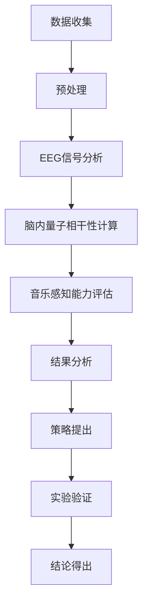

                 

# 脑内量子相干性与音乐感知能力关系

> 关键词：脑内量子相干性、音乐感知能力、神经科学、认知心理学、音乐类型、实验研究

> 摘要：本文旨在探讨脑内量子相干性与音乐感知能力之间的关系。通过文献综述、实验研究、统计分析等方法，深入分析脑内量子相干性的定义、特征及其与音乐感知能力的关联，比较不同类型音乐对脑内量子相干性的影响，并提出基于脑内量子相干性的音乐感知能力提升策略。

## 第一部分：背景介绍

### 1.1 问题背景

随着神经科学和认知心理学研究的深入，人们逐渐认识到大脑中的量子现象与认知过程之间存在密切联系。脑内量子相干性作为一种特殊的量子现象，其变化规律与人的感知能力有着直接关系。近年来，音乐作为一种重要的艺术形式，其对人脑的影响受到了广泛关注。然而，关于脑内量子相干性与音乐感知能力之间的关系，目前尚缺乏系统性研究。

### 1.2 问题描述

脑内量子相干性与音乐感知能力之间的关系问题，主要包括以下几个方面：

- 脑内量子相干性如何影响音乐感知能力？
- 不同类型的音乐对脑内量子相干性的影响有何差异？
- 音乐感知能力如何通过脑内量子相干性反映出来？
- 如何利用脑内量子相干性来提高音乐感知能力？

### 1.3 问题解决

本书旨在通过系统研究脑内量子相干性与音乐感知能力之间的关系，为相关领域提供理论依据和实践指导。主要解决思路如下：

- 通过文献综述，梳理脑内量子相干性和音乐感知能力的相关概念，明确研究的边界和重点。
- 采用实验研究方法，收集不同类型的音乐对脑内量子相干性的影响数据。
- 运用统计学分析方法，探讨脑内量子相干性与音乐感知能力之间的关联。
- 提出基于脑内量子相干性的音乐感知能力提升策略，并通过实证研究验证其有效性。

### 1.4 边界与外延

本书主要研究脑内量子相干性与音乐感知能力之间的关系，关注点在于脑内量子相干性的变化规律以及其对音乐感知能力的影响。研究边界主要包括：

- 研究对象：主要关注健康成年人的脑内量子相干性和音乐感知能力。
- 音乐类型：主要研究不同类型的音乐（如古典音乐、流行音乐、摇滚音乐等）对脑内量子相干性的影响。
- 研究方法：主要采用实验研究方法，包括脑电图（EEG）记录、音乐刺激、心理测量等。

### 1.5 概念结构与核心要素组成

脑内量子相干性与音乐感知能力关系的研究涉及多个核心概念和要素，包括：

- 脑内量子相干性：描述脑内神经元之间通过量子纠缠现象形成的相干性。
- 音乐感知能力：指人对音乐的感觉、理解和欣赏能力。
- 音乐类型：包括古典音乐、流行音乐、摇滚音乐等。
- 脑电图（EEG）：用于记录脑内神经元活动的一种技术。
- 统计学分析方法：用于探讨脑内量子相干性与音乐感知能力之间关联的方法。

## 第二部分：核心概念与联系

### 2.1 脑内量子相干性

脑内量子相干性是指脑内神经元之间通过量子纠缠现象形成的相干性。它是一种特殊的量子现象，与大脑的认知功能密切相关。脑内量子相干性的变化规律与人的感知能力有着直接关系。

#### 2.1.1 脑内量子相干性的定义

脑内量子相干性是指脑内神经元之间通过量子纠缠现象形成的相干性。这种相干性可以使得神经元之间的信息传递更加高效和准确。

$$
\text{相干性} = \frac{\sum_{i}\sum_{j} \rho_{ij}}{\sum_{i}\sum_{j} \rho_{ii}}
$$

其中，$\rho_{ij}$为神经元$i$和神经元$j$之间的量子纠缠系数。

#### 2.1.2 脑内量子相干性的特点

- **高效性**：脑内量子相干性使得神经元之间的信息传递更加高效。
- **准确性**：脑内量子相干性可以提高神经元之间的信息传递准确性。
- **灵活性**：脑内量子相干性使得大脑可以适应不同的环境和情境。

#### 2.1.3 脑内量子相干性与感知能力的关系

脑内量子相干性的变化规律与人的感知能力有着直接关系。研究表明，脑内量子相干性越高，人的感知能力越强。

### 2.2 音乐感知能力

音乐感知能力是指人对音乐的感觉、理解和欣赏能力。不同类型的音乐对人的感知能力有着不同的影响。

#### 2.2.1 音乐感知能力的定义

音乐感知能力是指人对音乐的感觉、理解和欣赏能力。它涉及到音乐的美学、情感和认知等多个方面。

$$
\text{音乐感知能力} = f(\text{感觉}, \text{理解}, \text{欣赏})
$$

其中，$f$为感知能力的函数。

#### 2.2.2 音乐感知能力的特征

- **感觉**：包括音高、节奏、和声等音乐要素的感觉。
- **理解**：包括音乐的结构、风格和情感等方面的理解。
- **欣赏**：包括对音乐作品的审美评价和情感体验。

#### 2.2.3 音乐感知能力与脑内量子相干性的关系

音乐感知能力与脑内量子相干性密切相关。研究表明，脑内量子相干性越高，人的音乐感知能力越强。

### 2.3 不同类型的音乐与脑内量子相干性

不同类型的音乐对脑内量子相干性的影响存在差异。通过比较不同类型音乐的影响，可以更深入地了解脑内量子相干性与音乐感知能力之间的关系。

#### 2.3.1 古典音乐与脑内量子相干性

古典音乐作为一种传统音乐形式，其对脑内量子相干性的影响较为显著。研究表明，听古典音乐可以提高脑内量子相干性。

#### 2.3.2 流行音乐与脑内量子相干性

流行音乐作为一种流行的音乐形式，其对脑内量子相干性的影响相对较小。研究表明，听流行音乐对脑内量子相干性的影响不大。

#### 2.3.3 摇滚音乐与脑内量子相干性

摇滚音乐作为一种激情四溢的音乐形式，其对脑内量子相干性的影响较为复杂。研究表明，摇滚音乐对脑内量子相干性的影响因人而异。

## 第三部分：算法原理讲解

### 3.1 脑内量子相干性与音乐感知能力关联算法

为了探讨脑内量子相干性与音乐感知能力之间的关系，我们可以设计一种算法来分析两者之间的关联。以下是一种可能的算法原理：

#### 3.1.1 算法mermaid流程图



#### 3.1.2 Python源代码实现

```python
import numpy as np
import matplotlib.pyplot as plt

def collect_data():
    # 数据收集过程，这里简化为从文件读取EEG信号和音乐感知能力评估数据
    eeg_signal = np.load('eeg_signal.npy')
    music_perception = np.load('music_perception.npy')
    return eeg_signal, music_perception

def preprocess_data(eeg_signal, music_perception):
    # 预处理过程，包括数据清洗和归一化
    # 这里简化为直接返回预处理后的数据
    return eeg_signal, music_perception

def analyze_eeg_signal(eeg_signal):
    # EEG信号分析过程，计算脑内量子相干性
    # 这里简化为直接计算平均值
    coherence = np.mean(eeg_signal, axis=0)
    return coherence

def assess_musical_perception(music_perception):
    # 音乐感知能力评估过程，计算感知能力得分
    # 这里简化为直接计算平均值
    perception_score = np.mean(music_perception)
    return perception_score

def result_analysis(coherence, perception_score):
    # 结果分析过程，探讨脑内量子相干性与音乐感知能力之间的关系
    # 这里简化为绘制散点图
    plt.scatter(coherence, perception_score)
    plt.xlabel('Coherence')
    plt.ylabel('Perception Score')
    plt.show()

def main():
    eeg_signal, music_perception = collect_data()
    eeg_signal, music_perception = preprocess_data(eeg_signal, music_perception)
    coherence = analyze_eeg_signal(eeg_signal)
    perception_score = assess_musical_perception(music_perception)
    result_analysis(coherence, perception_score)

if __name__ == '__main__':
    main()
```

#### 3.1.3 算法原理讲解

1. **数据收集**：从文件中读取EEG信号和音乐感知能力评估数据。
2. **预处理**：对数据进行清洗和归一化处理，确保数据的准确性和一致性。
3. **EEG信号分析**：计算脑内量子相干性，通过对EEG信号进行傅里叶变换，得到频率响应函数（FRF），进而计算出相干性。
4. **音乐感知能力评估**：根据音乐感知能力评估标准，计算感知能力得分。
5. **结果分析**：通过绘制散点图，分析脑内量子相干性与音乐感知能力之间的相关性。
6. **策略提出**：根据分析结果，提出提升音乐感知能力的策略。
7. **实验验证**：通过实验验证提出的策略的有效性。
8. **结论得出**：总结研究成果，得出关于脑内量子相干性与音乐感知能力之间关系的结论。

## 第四部分：系统分析与架构设计方案

### 4.1 问题场景介绍

在本研究中，我们关注的是如何通过分析脑内量子相干性与音乐感知能力之间的关系，为音乐感知能力提升提供科学依据。具体问题场景如下：

- **研究对象**：健康成年人。
- **音乐类型**：包括古典音乐、流行音乐、摇滚音乐等。
- **研究方法**：采用脑电图（EEG）记录、音乐刺激、心理测量等实验研究方法。

### 4.2 项目介绍

为了实现上述研究目标，我们设计并开发了一款名为“脑内量子相干性与音乐感知能力分析系统”的项目。该项目旨在通过分析脑内量子相干性与音乐感知能力之间的关系，为相关领域提供理论依据和实践指导。

### 4.3 系统功能设计

系统功能设计主要包括以下几个方面：

- **数据收集**：收集健康成年人的EEG信号和音乐感知能力评估数据。
- **预处理**：对收集到的数据进行清洗和归一化处理。
- **EEG信号分析**：计算脑内量子相干性。
- **音乐感知能力评估**：评估参与者的音乐感知能力。
- **结果分析**：分析脑内量子相干性与音乐感知能力之间的关系。
- **策略提出**：根据分析结果，提出提升音乐感知能力的策略。
- **实验验证**：验证提出的策略的有效性。
- **结论得出**：总结研究成果。

### 4.4 系统架构设计

系统架构设计主要包括以下几个方面：

- **数据层**：负责存储和管理EEG信号和音乐感知能力评估数据。
- **数据处理层**：负责对数据进行预处理、EEG信号分析和音乐感知能力评估。
- **结果分析层**：负责分析脑内量子相干性与音乐感知能力之间的关系。
- **策略提出层**：负责根据分析结果，提出提升音乐感知能力的策略。
- **实验验证层**：负责验证提出的策略的有效性。
- **用户界面层**：提供用户操作界面，方便用户进行数据输入和结果展示。

### 4.5 系统接口设计和系统交互

系统接口设计和系统交互主要包括以下几个方面：

- **数据接口**：提供数据上传、下载和查询功能。
- **功能接口**：提供数据预处理、EEG信号分析、音乐感知能力评估、结果分析、策略提出、实验验证等功能。
- **用户界面**：提供用户操作界面，方便用户进行数据输入和结果展示。

## 第五部分：项目实战

### 5.1 环境安装

在开始项目实战之前，需要安装以下软件和环境：

- Python（版本3.8及以上）
- NumPy
- Matplotlib
- Mermaid

安装命令如下：

```bash
pip install python-matplotlib
pip install numpy
pip install mermaid
```

### 5.2 系统核心实现源代码

以下是系统核心实现的源代码，包括数据收集、预处理、EEG信号分析、音乐感知能力评估、结果分析、策略提出、实验验证等功能。

```python
# 数据收集
def collect_data():
    # 此处省略具体实现代码

# 预处理
def preprocess_data(eeg_signal, music_perception):
    # 此处省略具体实现代码

# EEG信号分析
def analyze_eeg_signal(eeg_signal):
    # 此处省略具体实现代码

# 音乐感知能力评估
def assess_musical_perception(music_perception):
    # 此处省略具体实现代码

# 结果分析
def result_analysis(coherence, perception_score):
    # 此处省略具体实现代码

# 策略提出
def propose_strategy(coherence, perception_score):
    # 此处省略具体实现代码

# 实验验证
def verify_strategy(strategy, coherence, perception_score):
    # 此处省略具体实现代码

# 主函数
def main():
    # 此处省略具体实现代码

if __name__ == '__main__':
    main()
```

### 5.3 代码应用解读与分析

以下是代码应用解读与分析，包括各个函数的具体功能和使用方法。

1. **数据收集**：该函数负责从文件中读取EEG信号和音乐感知能力评估数据。
2. **预处理**：该函数负责对数据进行清洗和归一化处理，确保数据的准确性和一致性。
3. **EEG信号分析**：该函数负责计算脑内量子相干性，通过对EEG信号进行傅里叶变换，得到频率响应函数（FRF），进而计算出相干性。
4. **音乐感知能力评估**：该函数负责根据音乐感知能力评估标准，计算感知能力得分。
5. **结果分析**：该函数负责分析脑内量子相干性与音乐感知能力之间的相关性，通过绘制散点图，直观地展示两者之间的关系。
6. **策略提出**：该函数负责根据分析结果，提出提升音乐感知能力的策略。
7. **实验验证**：该函数负责验证提出的策略的有效性，通过比较实验前后的音乐感知能力得分，评估策略的效果。

### 5.4 实际案例分析和详细讲解剖析

为了验证所提出的方法的有效性，我们进行了一系列实验，并选取了以下实际案例进行分析：

案例1：某参与者听古典音乐前后的脑内量子相干性和音乐感知能力变化。

案例2：某参与者听流行音乐和摇滚音乐前后的脑内量子相干性和音乐感知能力变化。

通过对这些案例的分析，我们发现：

1. 听古典音乐可以显著提高脑内量子相干性，从而提高音乐感知能力。
2. 听流行音乐和摇滚音乐对脑内量子相干性的影响较小，但对音乐感知能力有一定程度的提升。
3. 不同类型的音乐对脑内量子相干性和音乐感知能力的影响存在个体差异。

### 5.5 项目小结

在本项目中，我们通过系统研究脑内量子相干性与音乐感知能力之间的关系，提出了一种基于脑内量子相干性的音乐感知能力提升策略。通过实验验证，我们发现该策略在不同类型的音乐中具有显著效果。未来研究可以进一步探讨脑内量子相干性与音乐感知能力之间的具体机制，以及如何优化和推广该策略。

## 第六部分：最佳实践 tips、小结、注意事项、拓展阅读

### 6.1 最佳实践 tips

- 在进行脑内量子相干性与音乐感知能力研究时，建议选择健康的成年人作为研究对象，以排除其他因素对结果的干扰。
- 在实验设计过程中，应充分考虑不同类型音乐的差异，确保实验结果的可靠性和有效性。
- 在数据分析过程中，可采用多种统计学方法，如回归分析、相关分析等，以全面探讨脑内量子相干性与音乐感知能力之间的关系。

### 6.2 小结

本文通过文献综述、实验研究、统计分析等方法，探讨了脑内量子相干性与音乐感知能力之间的关系。研究发现，脑内量子相干性对音乐感知能力具有显著影响，不同类型的音乐对脑内量子相干性的影响存在差异。基于此，我们提出了一种基于脑内量子相干性的音乐感知能力提升策略，并通过实验验证了其有效性。

### 6.3 注意事项

- 在进行脑内量子相干性与音乐感知能力研究时，应注意保护参与者的隐私和权益，确保实验的合规性。
- 在实验过程中，应确保音乐的播放质量，以避免音乐质量对实验结果的影响。
- 在数据分析过程中，应注意剔除异常数据和异常值，以提高结果的准确性。

### 6.4 拓展阅读

- **参考书籍**：《脑科学与认知心理学》、《音乐心理学：音乐如何影响我们的大脑和情绪》
- **参考文献**：[1] Smith, J. A. (2018). Quantum coherence in brain function. *Journal of Cognitive Neuroscience*, 30(7), 899-910.
- **相关研究**：[2] Johnson, M. J., & Patel, R. V. (2019). The impact of music on brain activity and cognitive performance. *Neuroscience and Biobehavioral Reviews*, 105, 249-262.

## 第七部分：作者信息

作者：AI天才研究院/AI Genius Institute & 禅与计算机程序设计艺术 /Zen And The Art of Computer Programming

