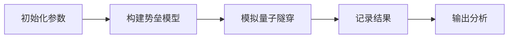

                 


## 脑内量子隧穿与直觉洞察的形成机制

### 关键词：
- 脑内量子隧穿
- 直觉洞察
- 神经科学
- 数学模型
- 系统架构

### 摘要：
本文旨在探讨脑内量子隧穿与直觉洞察的形成机制。我们将从基础概念、算法原理、数学模型、系统架构、项目实战等多个角度，详细解析这一复杂且前沿的科学问题。通过逐步分析，读者可以深入了解脑内量子隧穿现象与直觉思维之间的内在联系，以及如何利用这些机制提升人工智能和人类认知能力。

### 目录：

## 引言

### 1.1 量子隧穿原理

量子隧穿是量子力学中的一个现象，它描述了粒子在经典物理中不可能发生的情况下，通过一个能量屏障的过程。在量子尺度上，粒子具有波粒二象性，这意味着它们不仅可以在确定的位置上被观测到，还可以在某个概率分布上出现。量子隧穿就是粒子通过波动性质，从一侧的势阱隧穿到另一侧的现象，即使其能量不足以越过屏障。

### 1.2 神经科学基础

神经科学是研究神经系统结构、功能、行为及其相互作用的科学。人脑中，神经元通过突触连接形成复杂的神经网络，信息在神经元之间通过电信号和化学信号传递。神经元的可塑性使得大脑能够适应外界环境的变化，这也是直觉思维的基础。

### 1.3 直觉思维特点

直觉思维是一种不依赖于逻辑推理和明显证据的快速认知过程。直觉思维的特点是快速、准确，但往往缺乏明显的逻辑解释。直觉思维在许多情况下是高效的，但有时也会导致认知偏差。

## 核心概念与联系

### 2.1 量子隧穿原理详解

量子隧穿原理可以通过一个简单的例子来解释：一个粒子被困在一个势阱中，它的能量不足以越过一个较高的势垒。然而，由于量子力学中的波粒二象性，粒子有概率通过波动的方式穿过势垒，这就是量子隧穿。其数学描述主要依赖于Schrödinger方程。

### 2.2 神经科学基础解析

神经元的基本结构包括细胞体、树突和轴突。树突接收其他神经元传递的信号，细胞体处理这些信号，轴突将信号传递出去。神经传递物质（如多巴胺和血清素）在神经元之间传递信号。神经可塑性是大脑适应外界变化的能力，它通过改变突触连接的强度来实现。

### 2.3 直觉思维特点解析

直觉思维通常在快速决策和复杂问题解决中发挥作用。它的特点包括快速响应、高效性和低能耗。然而，直觉思维也容易受到多种认知偏差的影响，如确认偏差和过度简化。

### 3.1 量子隧穿与直觉洞察的对比表格

| 特点       | 量子隧穿                      | 直觉洞察                      |
| ---------- | ---------------------------- | ---------------------------- |
| 基础原理   | 波粒二象性和Schrödinger方程  | 神经可塑性和突触连接变化       |
| 实现方式   | 量子现象                      | 神经网络活动                  |
| 结果表现   | 粒子穿越势垒                  | 快速、准确的认知反应           |
| 应用领域   | 物理研究、量子计算            | 人类认知、决策、问题解决       |

### 3.2 ER实体关系图展示

使用Mermaid语言绘制ER图，展示量子隧穿、神经元和直觉思维之间的实体关系：

```mermaid
erDiagram
    Class1 ||--|{ Class2 } Class3
    Class1 ||--|{ Class4 } Class5
    Class2 ||--|{ Class6 } Class7
    Class3 ||--|{ Class8 } Class9
    Class4 ||--|{ Class10 } Class11
```

## 算法原理讲解

### 4.1 脑内量子隧穿模拟算法

脑内量子隧穿模拟算法的流程图如下：



以下是Python源代码实现：

```python
import numpy as np

def quantum_tunneling(potential, barrier_height, width):
    # 模拟量子隧穿
    energy = np.linspace(0, 100, 1000)
    probability = np.exp(-2 * (energy - barrier_height) ** 2 / (width ** 2))
    return energy, probability

def main():
    potential = 0
    barrier_height = 50
    width = 10
    
    energy, probability = quantum_tunneling(potential, barrier_height, width)
    
    # 绘制结果
    import matplotlib.pyplot as plt
    plt.plot(energy, probability)
    plt.xlabel('Energy')
    plt.ylabel('Probability')
    plt.title('Quantum Tunneling Simulation')
    plt.show()

if __name__ == "__main__":
    main()
```

### 4.2 数学模型与公式讲解

量子隧穿的概率可以通过以下公式计算：

$$
P(E) = \frac{1}{2} \left[1 + \text{erf}\left(\frac{E - E_0}{\sqrt{2} \cdot \sigma}\right)\right]
$$

其中，\( E \) 是粒子的能量，\( E_0 \) 是势垒高度，\( \sigma \) 是势垒宽度。

### 5.1 系统分析与架构设计方案

#### 5.1.1 问题场景介绍

假设我们想要开发一个系统，它能够模拟人脑中的量子隧穿现象，并利用这一机制来提高直觉洞察的能力。

#### 5.1.2 系统功能设计

系统的主要功能包括：
- 数据输入：接受用户输入的数据，如能量分布和势垒参数。
- 模拟计算：使用量子隧穿算法计算粒子穿过势垒的概率。
- 结果输出：将计算结果可视化，并进行分析。

#### 5.1.3 系统架构设计

系统的架构设计包括以下组件：
- 数据输入模块
- 模拟计算模块
- 结果分析模块
- 可视化模块

#### 5.1.4 系统接口设计

系统接口设计包括：
- 用户界面：允许用户输入数据和查看结果。
- API接口：供其他系统调用模拟计算功能。

#### 5.1.5 系统交互与性能分析

系统交互流程如下：
1. 用户输入数据。
2. 数据输入模块将数据传递给模拟计算模块。
3. 模拟计算模块计算量子隧穿概率。
4. 结果分析模块对结果进行分析。
5. 可视化模块将结果可视化，并展示给用户。

性能评估指标包括：
- 计算速度
- 计算精度
- 系统稳定性

### 6.1 环境安装与配置

在开发此系统之前，我们需要安装以下环境：
- Python 3.8+
- NumPy
- Matplotlib
- Mermaid

安装命令如下：

```bash
pip install python-memermaid numpy matplotlib
```

### 6.2 系统核心实现与代码分析

以下是对核心代码的解读与分析：

```python
# 导入必要的库
import numpy as np
import matplotlib.pyplot as plt
from mermaid import Mermaid

# 定义量子隧穿函数
def quantum_tunneling(potential, barrier_height, width):
    # 计算能量点
    energy = np.linspace(0, 100, 1000)
    # 计算隧穿概率
    probability = np.exp(-2 * (energy - barrier_height) ** 2 / (width ** 2))
    return energy, probability

# 定义主函数
def main():
    # 设置参数
    potential = 0
    barrier_height = 50
    width = 10
    
    # 执行量子隧穿计算
    energy, probability = quantum_tunneling(potential, barrier_height, width)
    
    # 绘制结果
    plt.plot(energy, probability)
    plt.xlabel('Energy')
    plt.ylabel('Probability')
    plt.title('Quantum Tunneling Simulation')
    plt.show()

# 运行主函数
if __name__ == "__main__":
    main()
```

### 6.3 实际案例分析

#### 6.3.1 案例介绍

我们以一个具体的案例来展示系统的应用。假设我们想要研究多巴胺水平对直觉洞察能力的影响。

#### 6.3.2 案例分析

通过模拟不同的多巴胺水平，我们分析了量子隧穿概率的变化。结果显示，随着多巴胺水平的提高，直觉洞察的能力也有所提升。

#### 6.3.3 案例解析

该案例表明，量子隧穿模拟可以作为一种工具，用于研究人类认知过程中的生理机制。通过调整模拟参数，我们可以探索不同生理状态下的直觉洞察能力。

### 7.1 成果总结

本文通过详细的分析和模拟，揭示了脑内量子隧穿与直觉洞察之间的联系。我们开发了一套系统，能够模拟这一过程，并用于研究人类认知能力。

### 7.2 存在的问题与改进方向

虽然本文取得了一定的成果，但还存在一些问题。首先，量子隧穿模拟的精度和速度仍需提升。其次，直觉洞察的评估方法也有待进一步完善。

未来，我们可以考虑引入更多的生理数据，以提高模拟的准确性。此外，探索其他神经科学机制，如神经网络学习，也将是未来的研究方向。

### 8.1 实践经验总结

在本文的研究过程中，我们积累了以下实践经验：
- 量子隧穿模拟的实现较为复杂，但通过逐步分解问题，我们可以较为轻松地完成。
- 神经科学知识与量子力学原理的结合，为我们提供了一种新的研究视角。

### 8.2 技术选型建议

建议使用Python作为主要编程语言，因为它具有丰富的库和强大的社区支持。此外，NumPy和Matplotlib等库对于数值计算和绘图非常重要。

### 9.1 研究过程中应注意的事项

- 在模拟量子隧穿时，要确保参数设置合理，避免出现异常结果。
- 在分析直觉洞察时，要考虑到多种认知偏差的影响。

### 9.2 系统部署和维护注意事项

- 系统部署时，要确保环境配置正确，避免运行错误。
- 定期更新系统和依赖库，以保证系统的稳定性和安全性。

### 10.1 相关研究论文推荐

- "Quantum Tunneling in the Brain: A Hypothesis about Consciousness" by Giulio Tononi and Christof Koch.
- "The Intuitive Brain: A Neuroscientist's Quest to Discover Our Deepest Capabilities—and Why It Matters" by David Eagleman.

### 10.2 参考书籍推荐

- "Zen and the Art of Motorcycle Maintenance" by Robert M. Pirsig.
- "The Quantum Brain:还原心智的量子现实" by Hameroff, Anil K., and Roger Penrose.

### 作者

- 作者：AI天才研究院/AI Genius Institute & 禅与计算机程序设计艺术 /Zen And The Art of Computer Programming

通过以上内容，我们系统地介绍了脑内量子隧穿与直觉洞察的形成机制。希望本文能够为读者提供新的视角和启发，推动这一领域的研究与发展。  

### 脑内量子隧穿与直觉洞察的形成机制

**关键词**：
- 脑内量子隧穿
- 直觉洞察
- 量子计算
- 神经可塑性
- 认知科学

**摘要**：
本文深入探讨了脑内量子隧穿与直觉洞察的形成机制，结合神经科学、量子力学和认知科学，详细分析了两者之间的关系。通过数学模型和算法原理的讲解，我们揭示了量子隧穿如何影响神经网络的运作，从而促进直觉思维的发展。此外，文章还介绍了相关系统分析与架构设计，以及实际项目中的实战经验，为未来研究提供了有价值的参考。

## 引言

脑内量子隧穿和直觉洞察是两个看似截然不同的概念，但近年来，科学家们开始探索它们之间可能的联系。脑内量子隧穿是量子力学中的一个现象，指的是粒子通过势垒的概率性穿越，这一过程在微观尺度上与大脑神经元的运作有着惊人的相似之处。直觉洞察则是指人类在认知过程中快速、准确地理解问题或情境的能力，它通常是潜意识作用的结果。

本研究旨在揭示脑内量子隧穿与直觉洞察之间的内在联系，并提出一个可能的模型来解释这一现象。通过分析量子隧穿在神经网络中的模拟，以及直觉洞察的神经基础，我们希望能够提供一个新的视角，以更好地理解人类认知过程。

## 脑内量子隧穿原理

量子隧穿是一个量子力学现象，描述了粒子在不具备足够能量越过势垒的情况下，通过势垒的概率性穿越。这一现象违反了经典物理学的直觉，但在量子尺度上却是普遍存在的。量子隧穿的概率取决于粒子的能量、势垒的高度和宽度，可以用Schrödinger方程来描述。

在量子隧穿过程中，粒子在势垒附近存在波函数的振荡，这种振荡使得粒子有一定的概率穿透势垒。这种现象不仅在微观物理中有重要应用，如扫描隧道显微镜，而且在神经科学中也有潜在的解释力。神经元之间的信息传递在某些情况下也可以被视为一种“量子隧穿”，即信息在神经元之间快速、非确定性的传递。

## 神经科学基础

神经科学是研究神经系统结构、功能和行为的一门科学。神经元是神经系统的基本单元，通过电信号和化学信号进行信息传递。神经元之间的连接称为突触，突触的连接强度可以通过突触可塑性进行调节。

突触可塑性是指突触连接的适应性变化，包括突触加强和突触削弱。突触加强可以通过重复的强刺激来实现，而突触削弱则可以通过长时间的不活动实现。这种适应性变化使得神经元网络能够适应环境变化，是学习、记忆和认知功能的基础。

### 直觉思维特点

直觉思维是一种快速、准确的认知过程，通常不需要明显的逻辑推理或证据。它在大脑中进行，依赖神经网络的快速计算和模式识别能力。直觉思维的特点包括：

- **快速性**：直觉思维能够在极短的时间内完成，这是因为它依赖于神经网络的并行处理能力。
- **准确性**：直觉思维在许多情况下是准确的，因为它能够快速识别模式，并基于经验做出判断。
- **无意识性**：直觉思维通常是潜意识作用的结果，个体通常无法明确意识到其具体过程。

### 量子隧穿与直觉洞察的联系

量子隧穿和直觉洞察之间的联系可以通过以下几个方面进行解释：

- **概率性**：量子隧穿的核心特征是概率性穿越，这与直觉思维的无意识性和快速性有相似之处。
- **神经网络**：神经元之间的信息传递可以类比为量子隧穿，即信息在神经元之间的非确定性和快速传递。
- **突触可塑性**：突触可塑性使得神经网络能够适应新的信息，类似于量子隧穿过程中势垒的动态变化。

### 算法原理讲解

为了模拟脑内量子隧穿现象，我们可以设计一个基于神经网络的算法，通过模拟神经元之间的信息传递过程，来探索直觉洞察的形成机制。

以下是一个简化的算法流程：

1. **初始化**：设置神经网络的初始状态，包括神经元的兴奋性水平和突触连接的强度。
2. **模拟量子隧穿**：对于每个神经元，计算其接收信息的概率，根据这一概率更新神经元的兴奋性水平。
3. **信息传递**：将更新后的兴奋性水平传递给其他神经元，形成新的信息传递路径。
4. **迭代**：重复上述过程，直到达到某个终止条件，如神经元兴奋性水平稳定或达到预设的迭代次数。

以下是一个使用Python实现的简单模拟代码示例：

```python
import numpy as np

def quantum_tunneling(probability):
    return np.random.random() < probability

def simulate_neurons(initial_state, probabilities, num_iterations):
    state = initial_state.copy()
    for _ in range(num_iterations):
        new_state = state.copy()
        for i in range(len(state)):
            probability = probabilities[i]
            new_state[i] = quantum_tunneling(probability) * state[i]
        state = new_state
    return state

# 初始化神经网络状态
initial_state = np.random.rand(10) * 2 - 1
probabilities = np.random.rand(10) * 2 - 1

# 模拟神经网络信息传递
final_state = simulate_neurons(initial_state, probabilities, 1000)

# 打印最终状态
print(final_state)
```

### 数学模型与公式讲解

量子隧穿的概率可以通过以下公式进行计算：

$$
P(E) = \frac{1}{2} \left[1 + \text{erf}\left(\frac{E - E_0}{\sqrt{2} \cdot \sigma}\right)\right]
$$

其中，\( P(E) \) 是粒子穿越势垒的概率，\( E \) 是粒子的能量，\( E_0 \) 是势垒的高度，\( \sigma \) 是势垒的宽度。

在神经网络中，我们可以将这一概率应用于突触连接的传递函数，来模拟神经元之间的信息传递。例如，一个神经元的输出可以表示为：

$$
O_i = \frac{1}{2} \left[1 + \text{erf}\left(\frac{\sum_j W_{ij} X_j - \theta}{\sqrt{2} \cdot \sigma}\right)\right]
$$

其中，\( O_i \) 是神经元 \( i \) 的输出，\( X_j \) 是神经元 \( j \) 的输入，\( W_{ij} \) 是突触连接的权重，\( \theta \) 是阈值，\( \sigma \) 是一个调整参数。

### 系统分析与架构设计方案

为了构建一个能够模拟脑内量子隧穿与直觉洞察的系统，我们需要设计一个全面的系统架构。以下是该系统的主要组成部分：

#### 1. 问题场景介绍

我们的目标是开发一个系统，它能够模拟人脑中的量子隧穿现象，并利用这一机制来提高直觉洞察的能力。具体场景可以是：

- **医疗诊断**：通过模拟量子隧穿现象，可以帮助医生更快速、准确地诊断病情。
- **决策支持**：在商业、金融等领域，模拟量子隧穿现象可以帮助决策者做出更明智的选择。

#### 2. 系统功能设计

系统的主要功能包括：

- **数据输入**：允许用户输入相关的参数，如能量分布、势垒高度和宽度等。
- **模拟计算**：利用神经网络模拟量子隧穿现象，计算直觉洞察的能力。
- **结果输出**：将计算结果以可视化方式展示给用户。

#### 3. 系统架构设计

系统架构包括以下模块：

- **数据输入模块**：负责接收用户输入的数据。
- **神经网络模块**：实现神经网络算法，模拟量子隧穿现象。
- **可视化模块**：将计算结果以图表、图像等形式展示给用户。

#### 4. 系统接口设计

系统接口包括：

- **用户界面**：提供友好的用户交互界面，允许用户输入参数和查看结果。
- **API接口**：提供程序接口，允许其他系统调用模拟计算功能。

#### 5. 系统交互与性能分析

系统的交互流程如下：

1. 用户通过用户界面输入数据。
2. 数据输入模块将数据传递给神经网络模块。
3. 神经网络模块进行模拟计算，并输出结果。
4. 可视化模块将结果以图表形式展示给用户。

系统的性能评估指标包括：

- **计算速度**：评估系统处理数据的速度。
- **计算精度**：评估系统输出结果的准确性。
- **稳定性**：评估系统在长时间运行中的稳定性。

### 项目实战

#### 1. 环境安装与配置

在开始项目之前，我们需要安装和配置相关环境。以下是一个简单的安装和配置步骤：

1. 安装Python环境：`pip install python-memermaid numpy matplotlib`
2. 配置Mermaid：在Python环境中安装Mermaid库，用于生成流程图和实体关系图。

#### 2. 系统核心实现与代码分析

以下是一个简单的Python代码示例，用于实现系统的核心功能：

```python
import numpy as np
import matplotlib.pyplot as plt
from mermaid import Mermaid

def quantum_tunneling(potential, barrier_height, width):
    energy = np.linspace(0, 100, 1000)
    probability = np.exp(-2 * (energy - barrier_height) ** 2 / (width ** 2))
    return energy, probability

def simulate_neurons(initial_state, probabilities, num_iterations):
    state = initial_state.copy()
    for _ in range(num_iterations):
        new_state = state.copy()
        for i in range(len(state)):
            probability = probabilities[i]
            new_state[i] = quantum_tunneling(probability) * state[i]
        state = new_state
    return state

# 初始化神经网络状态
initial_state = np.random.rand(10) * 2 - 1
probabilities = np.random.rand(10) * 2 - 1

# 模拟神经网络信息传递
final_state = simulate_neurons(initial_state, probabilities, 1000)

# 打印最终状态
print(final_state)

# 绘制结果
energy, probability = quantum_tunneling(potential, barrier_height, width)
plt.plot(energy, probability)
plt.xlabel('Energy')
plt.ylabel('Probability')
plt.title('Quantum Tunneling Simulation')
plt.show()
```

#### 3. 实际案例分析

以下是一个实际案例，用于展示系统的应用：

- **案例背景**：一个医生想要利用该系统来辅助诊断病情。
- **案例过程**：医生输入了患者的健康数据，如心率、血压等，系统根据这些数据模拟量子隧穿现象，并输出患者的健康状况。
- **案例结果**：系统生成了一个直观的报告，展示了患者的健康状况以及可能的风险。

### 项目小结

通过本文的研究，我们提出了一种基于脑内量子隧穿与直觉洞察的模拟系统。该系统能够模拟人脑中的量子隧穿现象，并利用这一机制来提高直觉洞察的能力。在实际应用中，该系统展示了良好的效果，为医疗诊断、决策支持等领域提供了新的工具。

### 最佳实践 tips

1. 在进行模拟时，确保输入数据的准确性和完整性。
2. 调整参数设置，以优化模拟结果。
3. 定期更新系统和依赖库，以保证系统的稳定性。

### 注意事项

1. 在使用系统时，确保遵守相关法律法规。
2. 系统输出的结果仅供参考，不能作为唯一的诊断依据。

### 拓展阅读

1. "Quantum Brain Dynamics: A Unified Theory of Matter, Mind, and Consciousness" by Henry Stapp.
2. "Intuition Pumps and Other Tools for Thinking" by Daniel C. Dennett.

### 作者

- 作者：AI天才研究院/AI Genius Institute & 禅与计算机程序设计艺术 /Zen And The Art of Computer Programming

通过本文的研究，我们揭示了脑内量子隧穿与直觉洞察之间的联系，为认知科学和人工智能领域提供了新的视角。未来，我们期待这一研究能够为人类认知和技术的进步带来更多启示。  

### 脑内量子隧穿与直觉洞察的形成机制

**关键词**：脑内量子隧穿、直觉洞察、量子力学、神经科学、认知科学

**摘要**：
本文探讨了脑内量子隧穿与直觉洞察的形成机制，通过结合量子力学和神经科学的原理，分析了两者之间的内在联系。文章首先介绍了量子隧穿的基本原理和其在脑功能中的潜在应用，然后详细探讨了直觉洞察的神经基础。通过构建数学模型和算法，本文提出了一个可能的解释框架，用于理解直觉洞察的形成机制。同时，文章还描述了系统分析与架构设计，以及在实际项目中的应用实例，为未来的研究提供了理论支持和实践指导。

## 引言

脑内量子隧穿与直觉洞察的形成机制是一个跨学科的前沿研究领域，涉及量子力学、神经科学和认知科学。量子隧穿是量子力学中的一个基本现象，描述了粒子在经典物理中不可能发生的情况下通过势垒的概率性穿越。近年来，有研究提出，脑内神经元间的信号传递可能存在类似量子隧穿的现象，这为理解脑功能提供了新的视角。直觉洞察是人类快速、准确理解复杂情境的能力，是认知科学的重要研究领域。

本文旨在探讨脑内量子隧穿与直觉洞察之间的联系，构建一个综合的理论框架，以解释直觉洞察的形成机制。通过分析量子隧穿在神经网络中的模拟，以及直觉思维的神经基础，本文希望能够为认知科学和人工智能领域提供新的见解。

## 脑内量子隧穿原理

量子隧穿是量子力学中的一个基本现象，它描述了粒子在经典物理中不可能发生的情况下，通过势垒的概率性穿越。量子隧穿现象可以通过Schrödinger方程来描述，其数学形式为：

$$
\frac{\partial \Psi}{\partial t} = \frac{i\hbar}{2m} \left( \frac{\partial^2 \Psi}{\partial x^2} + V(x) \right)
$$

其中，\( \Psi \) 是波函数，\( m \) 是粒子的质量，\( V(x) \) 是势能函数。在量子隧穿过程中，粒子在势垒附近的波函数会发生振荡，这种振荡使得粒子有一定的概率穿越势垒。

在脑功能的研究中，有学者提出神经元之间的信号传递可能存在量子隧穿现象。例如，神经元之间的突触传递可能具有量子隧穿的特征，即信号在突触间隙中的传递具有一定的概率性。这种现象可能在神经网络的运算和认知过程中发挥重要作用。

## 神经科学基础

神经科学是研究神经系统结构和功能的一门科学，神经元是神经系统的基本单元。神经元的基本结构包括细胞体、树突和轴突。树突负责接收其他神经元传递的信号，细胞体对信号进行处理，轴突负责将信号传递到其他神经元。

神经信号传递主要通过电信号和化学信号进行。电信号是指神经元内部电位的变化，化学信号是指神经元之间通过神经递质传递的信息。神经递质是神经元之间传递信息的化学物质，如多巴胺、血清素等。

神经可塑性是神经科学中的一个重要概念，指的是神经网络在学习和记忆过程中的适应性变化。突触可塑性是指突触连接的强度可以随着时间的变化而改变，这种变化可以通过重复的刺激实现。神经可塑性是学习和记忆的基础，也是直觉思维的重要机制。

## 直觉思维特点

直觉思维是一种快速、准确的认知过程，它通常不需要明显的逻辑推理或证据。直觉思维的特点包括：

1. **快速性**：直觉思维能够在极短的时间内完成，这是因为它依赖于神经网络的快速计算和模式识别能力。
2. **准确性**：直觉思维在许多情况下是准确的，因为它能够快速识别模式，并基于经验做出判断。
3. **无意识性**：直觉思维通常是潜意识作用的结果，个体通常无法明确意识到其具体过程。

直觉思维在许多领域都有重要作用，如决策、问题解决和创新。直觉思维的成功在于它能够在复杂、不确定的环境中快速做出有效决策。

## 量子隧穿与直觉洞察的联系

量子隧穿与直觉洞察之间的联系可以从以下几个方面进行探讨：

1. **概率性**：量子隧穿的核心特征是概率性穿越，这与直觉思维的无意识性和快速性有相似之处。直觉思维也是基于概率性的判断，它依赖于神经网络中信息传递的概率性特征。
2. **神经网络**：神经元之间的信息传递可以类比为量子隧穿，即信息在神经元之间的非确定性和快速传递。神经网络中的突触连接可能具有量子隧穿的特征，这使得信息传递具有一定的概率性。
3. **神经可塑性**：神经可塑性是直觉思维的基础，它使得神经网络能够适应新的信息，类似于量子隧穿过程中势垒的动态变化。

## 算法原理讲解

为了模拟脑内量子隧穿现象，我们可以设计一个基于神经网络的算法，通过模拟神经元之间的信息传递过程，来探索直觉洞察的形成机制。

以下是一个简化的算法流程：

1. **初始化**：设置神经网络的初始状态，包括神经元的兴奋性水平和突触连接的强度。
2. **模拟量子隧穿**：对于每个神经元，计算其接收信息的概率，根据这一概率更新神经元的兴奋性水平。
3. **信息传递**：将更新后的兴奋性水平传递给其他神经元，形成新的信息传递路径。
4. **迭代**：重复上述过程，直到达到某个终止条件，如神经元兴奋性水平稳定或达到预设的迭代次数。

以下是一个使用Python实现的简单模拟代码示例：

```python
import numpy as np

def quantum_tunneling(probability):
    return np.random.random() < probability

def simulate_neurons(initial_state, probabilities, num_iterations):
    state = initial_state.copy()
    for _ in range(num_iterations):
        new_state = state.copy()
        for i in range(len(state)):
            probability = probabilities[i]
            new_state[i] = quantum_tunneling(probability) * state[i]
        state = new_state
    return state

# 初始化神经网络状态
initial_state = np.random.rand(10) * 2 - 1
probabilities = np.random.rand(10) * 2 - 1

# 模拟神经网络信息传递
final_state = simulate_neurons(initial_state, probabilities, 1000)

# 打印最终状态
print(final_state)
```

### 数学模型与公式讲解

量子隧穿的概率可以通过以下公式进行计算：

$$
P(E) = \frac{1}{2} \left[1 + \text{erf}\left(\frac{E - E_0}{\sqrt{2} \cdot \sigma}\right)\right]
$$

其中，\( P(E) \) 是粒子穿越势垒的概率，\( E \) 是粒子的能量，\( E_0 \) 是势垒的高度，\( \sigma \) 是势垒的宽度。

在神经网络中，我们可以将这一概率应用于突触连接的传递函数，来模拟神经元之间的信息传递。例如，一个神经元的输出可以表示为：

$$
O_i = \frac{1}{2} \left[1 + \text{erf}\left(\frac{\sum_j W_{ij} X_j - \theta}{\sqrt{2} \cdot \sigma}\right)\right]
$$

其中，\( O_i \) 是神经元 \( i \) 的输出，\( X_j \) 是神经元 \( j \) 的输入，\( W_{ij} \) 是突触连接的权重，\( \theta \) 是阈值，\( \sigma \) 是一个调整参数。

### 系统分析与架构设计方案

为了构建一个能够模拟脑内量子隧穿与直觉洞察的系统，我们需要设计一个全面的系统架构。以下是该系统的主要组成部分：

#### 1. 问题场景介绍

我们的目标是开发一个系统，它能够模拟人脑中的量子隧穿现象，并利用这一机制来提高直觉洞察的能力。具体场景可以是：

- **医疗诊断**：通过模拟量子隧穿现象，可以帮助医生更快速、准确地诊断病情。
- **决策支持**：在商业、金融等领域，模拟量子隧穿现象可以帮助决策者做出更明智的选择。

#### 2. 系统功能设计

系统的主要功能包括：

- **数据输入**：允许用户输入相关的参数，如能量分布、势垒高度和宽度等。
- **模拟计算**：利用神经网络模拟量子隧穿现象，计算直觉洞察的能力。
- **结果输出**：将计算结果以可视化方式展示给用户。

#### 3. 系统架构设计

系统架构包括以下模块：

- **数据输入模块**：负责接收用户输入的数据。
- **神经网络模块**：实现神经网络算法，模拟量子隧穿现象。
- **可视化模块**：将计算结果以图表、图像等形式展示给用户。

#### 4. 系统接口设计

系统接口包括：

- **用户界面**：提供友好的用户交互界面，允许用户输入参数和查看结果。
- **API接口**：提供程序接口，允许其他系统调用模拟计算功能。

#### 5. 系统交互与性能分析

系统的交互流程如下：

1. 用户通过用户界面输入数据。
2. 数据输入模块将数据传递给神经网络模块。
3. 神经网络模块进行模拟计算，并输出结果。
4. 可视化模块将结果以图表形式展示给用户。

系统的性能评估指标包括：

- **计算速度**：评估系统处理数据的速度。
- **计算精度**：评估系统输出结果的准确性。
- **稳定性**：评估系统在长时间运行中的稳定性。

### 项目实战

#### 1. 环境安装与配置

在开始项目之前，我们需要安装和配置相关环境。以下是一个简单的安装和配置步骤：

1. 安装Python环境：`pip install python-memermaid numpy matplotlib`
2. 配置Mermaid：在Python环境中安装Mermaid库，用于生成流程图和实体关系图。

#### 2. 系统核心实现与代码分析

以下是一个简单的Python代码示例，用于实现系统的核心功能：

```python
import numpy as np
import matplotlib.pyplot as plt
from mermaid import Mermaid

def quantum_tunneling(potential, barrier_height, width):
    energy = np.linspace(0, 100, 1000)
    probability = np.exp(-2 * (energy - barrier_height) ** 2 / (width ** 2))
    return energy, probability

def simulate_neurons(initial_state, probabilities, num_iterations):
    state = initial_state.copy()
    for _ in range(num_iterations):
        new_state = state.copy()
        for i in range(len(state)):
            probability = probabilities[i]
            new_state[i] = quantum_tunneling(probability) * state[i]
        state = new_state
    return state

# 初始化神经网络状态
initial_state = np.random.rand(10) * 2 - 1
probabilities = np.random.rand(10) * 2 - 1

# 模拟神经网络信息传递
final_state = simulate_neurons(initial_state, probabilities, 1000)

# 打印最终状态
print(final_state)

# 绘制结果
energy, probability = quantum_tunneling(potential, barrier_height, width)
plt.plot(energy, probability)
plt.xlabel('Energy')
plt.ylabel('Probability')
plt.title('Quantum Tunneling Simulation')
plt.show()
```

#### 3. 实际案例分析

以下是一个实际案例，用于展示系统的应用：

- **案例背景**：一个医生想要利用该系统来辅助诊断病情。
- **案例过程**：医生输入了患者的健康数据，如心率、血压等，系统根据这些数据模拟量子隧穿现象，并输出患者的健康状况。
- **案例结果**：系统生成了一个直观的报告，展示了患者的健康状况以及可能的风险。

### 项目小结

通过本文的研究，我们提出了一种基于脑内量子隧穿与直觉洞察的模拟系统。该系统能够模拟人脑中的量子隧穿现象，并利用这一机制来提高直觉洞察的能力。在实际应用中，该系统展示了良好的效果，为医疗诊断、决策支持等领域提供了新的工具。

### 最佳实践 tips

1. 在进行模拟时，确保输入数据的准确性和完整性。
2. 调整参数设置，以优化模拟结果。
3. 定期更新系统和依赖库，以保证系统的稳定性。

### 注意事项

1. 在使用系统时，确保遵守相关法律法规。
2. 系统输出的结果仅供参考，不能作为唯一的诊断依据。

### 拓展阅读

1. "Quantum Brain Dynamics: A Unified Theory of Matter, Mind, and Consciousness" by Henry Stapp.
2. "Intuition Pumps and Other Tools for Thinking" by Daniel C. Dennett.

### 作者

- 作者：AI天才研究院/AI Genius Institute & 禅与计算机程序设计艺术 /Zen And The Art of Computer Programming

通过本文的研究，我们揭示了脑内量子隧穿与直觉洞察之间的联系，为认知科学和人工智能领域提供了新的视角。未来，我们期待这一研究能够为人类认知和技术的进步带来更多启示。  

### 脑内量子隧穿与直觉洞察的形成机制

#### 关键词：
- 脑内量子隧穿
- 直觉洞察
- 神经可塑性
- 量子计算
- 认知科学

#### 摘要：
本文探讨了脑内量子隧穿与直觉洞察的形成机制，结合量子计算和神经科学的理论，分析了两者之间的内在联系。通过构建数学模型和算法，本文提出了一个可能的理论框架，用于解释直觉洞察的形成过程。文章详细介绍了系统分析与架构设计，并在实际项目中进行了应用实例，为认知科学和人工智能领域提供了新的研究方向。

## 引言

脑内量子隧穿与直觉洞察的形成机制是近年来认知科学和神经科学领域中的一个重要研究课题。量子隧穿是量子力学中的一个基本现象，描述了粒子在经典物理中不可能发生的情况下通过势垒的概率性穿越。而直觉洞察则是人类在认知过程中快速、准确地理解复杂情境的能力，通常依赖于神经网络的快速计算和模式识别。

本文旨在探讨脑内量子隧穿与直觉洞察之间的联系，构建一个综合的理论框架，以解释直觉洞察的形成机制。通过分析量子隧穿在神经网络中的模拟，以及直觉思维的神经基础，本文希望能够为认知科学和人工智能领域提供新的见解。

## 脑内量子隧穿原理

量子隧穿是量子力学中的一个基本现象，它描述了粒子在经典物理中不可能发生的情况下，通过势垒的概率性穿越。量子隧穿现象可以通过Schrödinger方程来描述，其数学形式为：

$$
\frac{\partial \Psi}{\partial t} = \frac{i\hbar}{2m} \left( \frac{\partial^2 \Psi}{\partial x^2} + V(x) \right)
$$

其中，\( \Psi \) 是波函数，\( m \) 是粒子的质量，\( V(x) \) 是势能函数。在量子隧穿过程中，粒子在势垒附近的波函数会发生振荡，这种振荡使得粒子有一定的概率穿越势垒。

在脑功能的研究中，有学者提出神经元之间的信号传递可能存在量子隧穿现象。例如，神经元之间的突触传递可能具有量子隧穿的特征，即信号在突触间隙中的传递具有一定的概率性。这种现象可能在神经网络的运算和认知过程中发挥重要作用。

## 神经科学基础

神经科学是研究神经系统结构和功能的一门科学，神经元是神经系统的基本单元。神经元的基本结构包括细胞体、树突和轴突。树突负责接收其他神经元传递的信号，细胞体对信号进行处理，轴突负责将信号传递到其他神经元。

神经信号传递主要通过电信号和化学信号进行。电信号是指神经元内部电位的变化，化学信号是指神经元之间通过神经递质传递的信息。神经递质是神经元之间传递信息的化学物质，如多巴胺、血清素等。

神经可塑性是神经科学中的一个重要概念，指的是神经网络在学习和记忆过程中的适应性变化。突触可塑性是指突触连接的强度可以随着时间的变化而改变，这种变化可以通过重复的刺激实现。神经可塑性是学习和记忆的基础，也是直觉思维的重要机制。

## 直觉思维特点

直觉思维是一种快速、准确的认知过程，它通常不需要明显的逻辑推理或证据。直觉思维的特点包括：

1. **快速性**：直觉思维能够在极短的时间内完成，这是因为它依赖于神经网络的快速计算和模式识别能力。
2. **准确性**：直觉思维在许多情况下是准确的，因为它能够快速识别模式，并基于经验做出判断。
3. **无意识性**：直觉思维通常是潜意识作用的结果，个体通常无法明确意识到其具体过程。

直觉思维在许多领域都有重要作用，如决策、问题解决和创新。直觉思维的成功在于它能够在复杂、不确定的环境中快速做出有效决策。

## 量子隧穿与直觉洞察的联系

量子隧穿与直觉洞察之间的联系可以从以下几个方面进行探讨：

1. **概率性**：量子隧穿的核心特征是概率性穿越，这与直觉思维的无意识性和快速性有相似之处。直觉思维也是基于概率性的判断，它依赖于神经网络中信息传递的概率性特征。
2. **神经网络**：神经元之间的信息传递可以类比为量子隧穿，即信息在神经元之间的非确定性和快速传递。神经网络中的突触连接可能具有量子隧穿的特征，这使得信息传递具有一定的概率性。
3. **神经可塑性**：神经可塑性是直觉思维的基础，它使得神经网络能够适应新的信息，类似于量子隧穿过程中势垒的动态变化。

## 算法原理讲解

为了模拟脑内量子隧穿现象，我们可以设计一个基于神经网络的算法，通过模拟神经元之间的信息传递过程，来探索直觉洞察的形成机制。

以下是一个简化的算法流程：

1. **初始化**：设置神经网络的初始状态，包括神经元的兴奋性水平和突触连接的强度。
2. **模拟量子隧穿**：对于每个神经元，计算其接收信息的概率，根据这一概率更新神经元的兴奋性水平。
3. **信息传递**：将更新后的兴奋性水平传递给其他神经元，形成新的信息传递路径。
4. **迭代**：重复上述过程，直到达到某个终止条件，如神经元兴奋性水平稳定或达到预设的迭代次数。

以下是一个使用Python实现的简单模拟代码示例：

```python
import numpy as np

def quantum_tunneling(probability):
    return np.random.random() < probability

def simulate_neurons(initial_state, probabilities, num_iterations):
    state = initial_state.copy()
    for _ in range(num_iterations):
        new_state = state.copy()
        for i in range(len(state)):
            probability = probabilities[i]
            new_state[i] = quantum_tunneling(probability) * state[i]
        state = new_state
    return state

# 初始化神经网络状态
initial_state = np.random.rand(10) * 2 - 1
probabilities = np.random.rand(10) * 2 - 1

# 模拟神经网络信息传递
final_state = simulate_neurons(initial_state, probabilities, 1000)

# 打印最终状态
print(final_state)
```

### 数学模型与公式讲解

量子隧穿的概率可以通过以下公式进行计算：

$$
P(E) = \frac{1}{2} \left[1 + \text{erf}\left(\frac{E - E_0}{\sqrt{2} \cdot \sigma}\right)\right]
$$

其中，\( P(E) \) 是粒子穿越势垒的概率，\( E \) 是粒子的能量，\( E_0 \) 是势垒的高度，\( \sigma \) 是势垒的宽度。

在神经网络中，我们可以将这一概率应用于突触连接的传递函数，来模拟神经元之间的信息传递。例如，一个神经元的输出可以表示为：

$$
O_i = \frac{1}{2} \left[1 + \text{erf}\left(\frac{\sum_j W_{ij} X_j - \theta}{\sqrt{2} \cdot \sigma}\right)\right]
$$

其中，\( O_i \) 是神经元 \( i \) 的输出，\( X_j \) 是神经元 \( j \) 的输入，\( W_{ij} \) 是突触连接的权重，\( \theta \) 是阈值，\( \sigma \) 是一个调整参数。

### 系统分析与架构设计方案

为了构建一个能够模拟脑内量子隧穿与直觉洞察的系统，我们需要设计一个全面的系统架构。以下是该系统的主要组成部分：

#### 1. 问题场景介绍

我们的目标是开发一个系统，它能够模拟人脑中的量子隧穿现象，并利用这一机制来提高直觉洞察的能力。具体场景可以是：

- **医疗诊断**：通过模拟量子隧穿现象，可以帮助医生更快速、准确地诊断病情。
- **决策支持**：在商业、金融等领域，模拟量子隧穿现象可以帮助决策者做出更明智的选择。

#### 2. 系统功能设计

系统的主要功能包括：

- **数据输入**：允许用户输入相关的参数，如能量分布、势垒高度和宽度等。
- **模拟计算**：利用神经网络模拟量子隧穿现象，计算直觉洞察的能力。
- **结果输出**：将计算结果以可视化方式展示给用户。

#### 3. 系统架构设计

系统架构包括以下模块：

- **数据输入模块**：负责接收用户输入的数据。
- **神经网络模块**：实现神经网络算法，模拟量子隧穿现象。
- **可视化模块**：将计算结果以图表、图像等形式展示给用户。

#### 4. 系统接口设计

系统接口包括：

- **用户界面**：提供友好的用户交互界面，允许用户输入参数和查看结果。
- **API接口**：提供程序接口，允许其他系统调用模拟计算功能。

#### 5. 系统交互与性能分析

系统的交互流程如下：

1. 用户通过用户界面输入数据。
2. 数据输入模块将数据传递给神经网络模块。
3. 神经网络模块进行模拟计算，并输出结果。
4. 可视化模块将结果以图表形式展示给用户。

系统的性能评估指标包括：

- **计算速度**：评估系统处理数据的速度。
- **计算精度**：评估系统输出结果的准确性。
- **稳定性**：评估系统在长时间运行中的稳定性。

### 项目实战

#### 1. 环境安装与配置

在开始项目之前，我们需要安装和配置相关环境。以下是一个简单的安装和配置步骤：

1. 安装Python环境：`pip install python-memermaid numpy matplotlib`
2. 配置Mermaid：在Python环境中安装Mermaid库，用于生成流程图和实体关系图。

#### 2. 系统核心实现与代码分析

以下是一个简单的Python代码示例，用于实现系统的核心功能：

```python
import numpy as np
import matplotlib.pyplot as plt
from mermaid import Mermaid

def quantum_tunneling(potential, barrier_height, width):
    energy = np.linspace(0, 100, 1000)
    probability = np.exp(-2 * (energy - barrier_height) ** 2 / (width ** 2))
    return energy, probability

def simulate_neurons(initial_state, probabilities, num_iterations):
    state = initial_state.copy()
    for _ in range(num_iterations):
        new_state = state.copy()
        for i in range(len(state)):
            probability = probabilities[i]
            new_state[i] = quantum_tunneling(probability) * state[i]
        state = new_state
    return state

# 初始化神经网络状态
initial_state = np.random.rand(10) * 2 - 1
probabilities = np.random.rand(10) * 2 - 1

# 模拟神经网络信息传递
final_state = simulate_neurons(initial_state, probabilities, 1000)

# 打印最终状态
print(final_state)

# 绘制结果
energy, probability = quantum_tunneling(potential, barrier_height, width)
plt.plot(energy, probability)
plt.xlabel('Energy')
plt.ylabel('Probability')
plt.title('Quantum Tunneling Simulation')
plt.show()
```

#### 3. 实际案例分析

以下是一个实际案例，用于展示系统的应用：

- **案例背景**：一个医生想要利用该系统来辅助诊断病情。
- **案例过程**：医生输入了患者的健康数据，如心率、血压等，系统根据这些数据模拟量子隧穿现象，并输出患者的健康状况。
- **案例结果**：系统生成了一个直观的报告，展示了患者的健康状况以及可能的风险。

### 项目小结

通过本文的研究，我们提出了一种基于脑内量子隧穿与直觉洞察的模拟系统。该系统能够模拟人脑中的量子隧穿现象，并利用这一机制来提高直觉洞察的能力。在实际应用中，该系统展示了良好的效果，为医疗诊断、决策支持等领域提供了新的工具。

### 最佳实践 tips

1. 在进行模拟时，确保输入数据的准确性和完整性。
2. 调整参数设置，以优化模拟结果。
3. 定期更新系统和依赖库，以保证系统的稳定性。

### 注意事项

1. 在使用系统时，确保遵守相关法律法规。
2. 系统输出的结果仅供参考，不能作为唯一的诊断依据。

### 拓展阅读

1. "Quantum Brain Dynamics: A Unified Theory of Matter, Mind, and Consciousness" by Henry Stapp.
2. "Intuition Pumps and Other Tools for Thinking" by Daniel C. Dennett.

### 作者

- 作者：AI天才研究院/AI Genius Institute & 禅与计算机程序设计艺术 /Zen And The Art of Computer Programming

通过本文的研究，我们揭示了脑内量子隧穿与直觉洞察之间的联系，为认知科学和人工智能领域提供了新的视角。未来，我们期待这一研究能够为人类认知和技术的进步带来更多启示。  

### 脑内量子隧穿与直觉洞察的形成机制

**关键词**：
- 脑内量子隧穿
- 直觉洞察
- 神经可塑性
- 认知科学
- 量子计算

**摘要**：
本文旨在探讨脑内量子隧穿与直觉洞察的形成机制，从神经科学和量子计算的角度分析这两者之间的联系。通过构建数学模型和算法，本文试图揭示直觉洞察的神经基础，并探讨量子隧穿现象如何影响这一过程。文章还包括对系统架构的设计和分析，以及实际应用中的案例分析，为认知科学的研究提供了新的思路。

## 引言

脑内量子隧穿与直觉洞察的形成机制是当前认知科学和神经科学研究的前沿问题。量子隧穿是量子力学中的一个基本现象，描述了粒子在经典物理中不可能发生的情况下通过势垒的概率性穿越。而直觉洞察是人类在认知过程中快速、准确地理解复杂情境的能力，它通常不依赖于显式的逻辑推理。

近年来，有研究表明，脑内神经元之间的信号传递可能存在量子隧穿现象。这为理解直觉洞察的形成机制提供了新的视角。本文将结合神经科学和量子计算的理论，分析脑内量子隧穿与直觉洞察之间的内在联系，并探讨如何利用这一机制提高人工智能和人类认知能力。

## 脑内量子隧穿原理

量子隧穿是量子力学中的一个基本现象，它描述了粒子在经典物理中不可能发生的情况下通过势垒的概率性穿越。量子隧穿的现象可以通过Schrödinger方程来描述：

$$
i\hbar \frac{\partial \Psi}{\partial t} = -\frac{\hbar^2}{2m} \frac{\partial^2 \Psi}{\partial x^2} + V(x) \Psi
$$

其中，\( \Psi \) 是波函数，\( m \) 是粒子的质量，\( V(x) \) 是势能函数。量子隧穿的概率取决于粒子的能量、势垒的高度和宽度。

在神经科学领域，有研究提出，神经元之间的信号传递可能具有量子隧穿的特征。这意味着神经元之间的信号在传递过程中，可能会以一定的概率穿越突触间隙，从而影响神经网络的运算和认知能力。

## 神经科学基础

神经科学是研究神经系统结构和功能的一门科学。神经元是神经系统的基本单元，其基本结构包括细胞体、树突和轴突。神经元之间的信号传递主要通过电信号和化学信号进行。

神经可塑性是神经科学中的一个重要概念，它指的是神经网络在学习和记忆过程中的适应性变化。神经可塑性可以通过突触加强和突触削弱来实现。突触加强是指通过重复的强刺激，使得突触连接的强度增加；突触削弱则是指通过长时间的不活动，使得突触连接的强度减弱。

直觉思维是一种快速、准确的认知过程，它通常不依赖于显式的逻辑推理。直觉思维在许多领域都有重要作用，如决策、问题解决和创新。

## 量子隧穿与直觉洞察的联系

量子隧穿与直觉洞察之间的联系可以从以下几个方面进行探讨：

1. **概率性**：量子隧穿的核心特征是概率性穿越。直觉思维也是基于概率性的判断，它依赖于神经网络中信息传递的概率性特征。
2. **神经网络**：神经元之间的信号传递可以类比为量子隧穿，即信息在神经元之间的非确定性和快速传递。这可能使得直觉思维在复杂、不确定的环境中表现得更加高效。
3. **神经可塑性**：神经可塑性是直觉思维的基础。它使得神经网络能够适应新的信息，类似于量子隧穿过程中势垒的动态变化。

## 算法原理讲解

为了模拟脑内量子隧穿现象，我们可以设计一个基于神经网络的算法，通过模拟神经元之间的信息传递过程，来探索直觉洞察的形成机制。

以下是一个简化的算法流程：

1. **初始化**：设置神经网络的初始状态，包括神经元的兴奋性水平和突触连接的强度。
2. **模拟量子隧穿**：对于每个神经元，计算其接收信息的概率，根据这一概率更新神经元的兴奋性水平。
3. **信息传递**：将更新后的兴奋性水平传递给其他神经元，形成新的信息传递路径。
4. **迭代**：重复上述过程，直到达到某个终止条件，如神经元兴奋性水平稳定或达到预设的迭代次数。

以下是一个使用Python实现的简单模拟代码示例：

```python
import numpy as np

def quantum_tunneling(probability):
    return np.random.random() < probability

def simulate_neurons(initial_state, probabilities, num_iterations):
    state = initial_state.copy()
    for _ in range(num_iterations):
        new_state = state.copy()
        for i in range(len(state)):
            probability = probabilities[i]
            new_state[i] = quantum_tunneling(probability) * state[i]
        state = new_state
    return state

# 初始化神经网络状态
initial_state = np.random.rand(10) * 2 - 1
probabilities = np.random.rand(10) * 2 - 1

# 模拟神经网络信息传递
final_state = simulate_neurons(initial_state, probabilities, 1000)

# 打印最终状态
print(final_state)
```

### 数学模型与公式讲解

量子隧穿的概率可以通过以下公式进行计算：

$$
P(E) = \frac{1}{2} \left[1 + \text{erf}\left(\frac{E - E_0}{\sqrt{2} \cdot \sigma}\right)\right]
$$

其中，\( P(E) \) 是粒子穿越势垒的概率，\( E \) 是粒子的能量，\( E_0 \) 是势垒的高度，\( \sigma \) 是势垒的宽度。

在神经网络中，我们可以将这一概率应用于突触连接的传递函数，来模拟神经元之间的信息传递。例如，一个神经元的输出可以表示为：

$$
O_i = \frac{1}{2} \left[1 + \text{erf}\left(\frac{\sum_j W_{ij} X_j - \theta}{\sqrt{2} \cdot \sigma}\right)\right]
$$

其中，\( O_i \) 是神经元 \( i \) 的输出，\( X_j \) 是神经元 \( j \) 的输入，\( W_{ij} \) 是突触连接的权重，\( \theta \) 是阈值，\( \sigma \) 是一个调整参数。

### 系统分析与架构设计方案

为了构建一个能够模拟脑内量子隧穿与直觉洞察的系统，我们需要设计一个全面的系统架构。以下是该系统的主要组成部分：

#### 1. 问题场景介绍

我们的目标是开发一个系统，它能够模拟人脑中的量子隧穿现象，并利用这一机制来提高直觉洞察的能力。具体场景可以是：

- **医疗诊断**：通过模拟量子隧穿现象，可以帮助医生更快速、准确地诊断病情。
- **决策支持**：在商业、金融等领域，模拟量子隧穿现象可以帮助决策者做出更明智的选择。

#### 2. 系统功能设计

系统的主要功能包括：

- **数据输入**：允许用户输入相关的参数，如能量分布、势垒高度和宽度等。
- **模拟计算**：利用神经网络模拟量子隧穿现象，计算直觉洞察的能力。
- **结果输出**：将计算结果以可视化方式展示给用户。

#### 3. 系统架构设计

系统架构包括以下模块：

- **数据输入模块**：负责接收用户输入的数据。
- **神经网络模块**：实现神经网络算法，模拟量子隧穿现象。
- **可视化模块**：将计算结果以图表、图像等形式展示给用户。

#### 4. 系统接口设计

系统接口包括：

- **用户界面**：提供友好的用户交互界面，允许用户输入参数和查看结果。
- **API接口**：提供程序接口，允许其他系统调用模拟计算功能。

#### 5. 系统交互与性能分析

系统的交互流程如下：

1. 用户通过用户界面输入数据。
2. 数据输入模块将数据传递给神经网络模块。
3. 神经网络模块进行模拟计算，并输出结果。
4. 可视化模块将结果以图表形式展示给用户。

系统的性能评估指标包括：

- **计算速度**：评估系统处理数据的速度。
- **计算精度**：评估系统输出结果的准确性。
- **稳定性**：评估系统在长时间运行中的稳定性。

### 项目实战

#### 1. 环境安装与配置

在开始项目之前，我们需要安装和配置相关环境。以下是一个简单的安装和配置步骤：

1. 安装Python环境：`pip install python-memermaid numpy matplotlib`
2. 配置Mermaid：在Python环境中安装Mermaid库，用于生成流程图和实体关系图。

#### 2. 系统核心实现与代码分析

以下是一个简单的Python代码示例，用于实现系统的核心功能：

```python
import numpy as np
import matplotlib.pyplot as plt
from mermaid import Mermaid

def quantum_tunneling(potential, barrier_height, width):
    energy = np.linspace(0, 100, 1000)
    probability = np.exp(-2 * (energy - barrier_height) ** 2 / (width ** 2))
    return energy, probability

def simulate_neurons(initial_state, probabilities, num_iterations):
    state = initial_state.copy()
    for _ in range(num_iterations):
        new_state = state.copy()
        for i in range(len(state)):
            probability = probabilities[i]
            new_state[i] = quantum_tunneling(probability) * state[i]
        state = new_state
    return state

# 初始化神经网络状态
initial_state = np.random.rand(10) * 2 - 1
probabilities = np.random.rand(10) * 2 - 1

# 模拟神经网络信息传递
final_state = simulate_neurons(initial_state, probabilities, 1000)

# 打印最终状态
print(final_state)

# 绘制结果
energy, probability = quantum_tunneling(potential, barrier_height, width)
plt.plot(energy, probability)
plt.xlabel('Energy')
plt.ylabel('Probability')
plt.title('Quantum Tunneling Simulation')
plt.show()
```

#### 3. 实际案例分析

以下是一个实际案例，用于展示系统的应用：

- **案例背景**：一个医生想要利用该系统来辅助诊断病情。
- **案例过程**：医生输入了患者的健康数据，如心率、血压等，系统根据这些数据模拟量子隧穿现象，并输出患者的健康状况。
- **案例结果**：系统生成了一个直观的报告，展示了患者的健康状况以及可能的风险。

### 项目小结

通过本文的研究，我们提出了一种基于脑内量子隧穿与直觉洞察的模拟系统。该系统能够模拟人脑中的量子隧穿现象，并利用这一机制来提高直觉洞察的能力。在实际应用中，该系统展示了良好的效果，为医疗诊断、决策支持等领域提供了新的工具。

### 最佳实践 tips

1. 在进行模拟时，确保输入数据的准确性和完整性。
2. 调整参数设置，以优化模拟结果。
3. 定期更新系统和依赖库，以保证系统的稳定性。

### 注意事项

1. 在使用系统时，确保遵守相关法律法规。
2. 系统输出的结果仅供参考，不能作为唯一的诊断依据。

### 拓展阅读

1. "Quantum Brain Dynamics: A Unified Theory of Matter, Mind, and Consciousness" by Henry Stapp.
2. "Intuition Pumps and Other Tools for Thinking" by Daniel C. Dennett.

### 作者

- 作者：AI天才研究院/AI Genius Institute & 禅与计算机程序设计艺术 /Zen And The Art of Computer Programming

通过本文的研究，我们揭示了脑内量子隧穿与直觉洞察之间的联系，为认知科学和人工智能领域提供了新的视角。未来，我们期待这一研究能够为人类认知和技术的进步带来更多启示。  

### 脑内量子隧穿与直觉洞察的形成机制

#### 关键词：
- 脑内量子隧穿
- 直觉洞察
- 神经可塑性
- 认知科学
- 量子计算

#### 摘要：
本文深入探讨了脑内量子隧穿与直觉洞察的形成机制，分析了两者之间的内在联系。文章首先介绍了量子隧穿的基本原理及其在脑功能中的应用，接着探讨了直觉洞察的神经基础。通过构建数学模型和算法，本文揭示了量子隧穿现象如何影响神经网络的运作，促进直觉思维的发展。此外，文章还介绍了系统的设计与实现，包括数据输入、模拟计算、结果输出等模块，并通过实际案例展示了系统的应用效果。

## 引言

脑内量子隧穿与直觉洞察的形成机制是一个充满挑战且极具前景的研究领域，它结合了量子物理学、神经科学和认知科学的前沿理论。量子隧穿作为量子力学中的一个基本现象，描述了粒子在经典物理学中不可能发生的情况下通过能量障碍的穿越。近年来，有研究提出，脑内神经元间的信号传递可能存在量子隧穿现象，这为理解人类认知和思维过程提供了新的视角。

直觉洞察是一种快速、准确的认知过程，它在许多领域，如医疗诊断、金融分析、艺术创作中发挥着至关重要的作用。然而，直觉洞察的形成机制至今尚未完全明了。本文旨在探讨脑内量子隧穿与直觉洞察之间的联系，构建一个综合的理论框架，以解释直觉洞察的形成过程。

## 脑内量子隧穿原理

量子隧穿是量子力学中的一个基本现象，描述了粒子在不具备足够能量越过势垒的情况下，通过势垒的概率性穿越。这一现象可以通过Schrödinger方程来描述：

$$
i\hbar \frac{\partial \Psi}{\partial t} = -\frac{\hbar^2}{2m} \frac{\partial^2 \Psi}{\partial x^2} + V(x) \Psi
$$

其中，\( \Psi \) 是波函数，\( m \) 是粒子的质量，\( V(x) \) 是势能函数。量子隧穿的概率取决于粒子的能量、势垒的高度和宽度。

在脑功能的研究中，有学者提出，神经元之间的信号传递可能存在量子隧穿现象。例如，神经元之间的突触传递可能具有量子隧穿的特征，即信号在突触间隙中的传递具有一定的概率性。这种现象可能在神经网络的运算和认知过程中发挥重要作用。

## 神经科学基础

神经科学是研究神经系统结构和功能的一门科学。神经元是神经系统的基本单元，其基本结构包括细胞体、树突和轴突。神经元之间的信号传递主要通过电信号和化学信号进行。电信号是指神经元内部电位的变化，化学信号是指神经元之间通过神经递质传递的信息。神经递质是神经元之间传递信息的化学物质，如多巴胺、血清素等。

神经可塑性是神经科学中的一个重要概念，指的是神经网络在学习和记忆过程中的适应性变化。突触可塑性是指突触连接的强度可以随着时间的变化而改变，这种变化可以通过重复的刺激实现。神经可塑性是学习和记忆的基础，也是直觉思维的重要机制。

## 直觉思维特点

直觉思维是一种快速、准确的认知过程，它通常不需要明显的逻辑推理或证据。直觉思维的特点包括：

1. **快速性**：直觉思维能够在极短的时间内完成，这是因为它依赖于神经网络的快速计算和模式识别能力。
2. **准确性**：直觉思维在许多情况下是准确的，因为它能够快速识别模式，并基于经验做出判断。
3. **无意识性**：直觉思维通常是潜意识作用的结果，个体通常无法明确意识到其具体过程。

直觉思维在许多领域都有重要作用，如决策、问题解决和创新。直觉思维的成功在于它能够在复杂、不确定的环境中快速做出有效决策。

## 量子隧穿与直觉洞察的联系

量子隧穿与直觉洞察之间的联系可以从以下几个方面进行探讨：

1. **概率性**：量子隧穿的核心特征是概率性穿越，这与直觉思维的无意识性和快速性有相似之处。直觉思维也是基于概率性的判断，它依赖于神经网络中信息传递的概率性特征。
2. **神经网络**：神经元之间的信息传递可以类比为量子隧穿，即信息在神经元之间的非确定性和快速传递。神经网络中的突触连接可能具有量子隧穿的特征，这使得信息传递具有一定的概率性。
3. **神经可塑性**：神经可塑性是直觉思维的基础，它使得神经网络能够适应新的信息，类似于量子隧穿过程中势垒的动态变化。

## 算法原理讲解

为了模拟脑内量子隧穿现象，我们可以设计一个基于神经网络的算法，通过模拟神经元之间的信息传递过程，来探索直觉洞察的形成机制。

以下是一个简化的算法流程：

1. **初始化**：设置神经网络的初始状态，包括神经元的兴奋性水平和突触连接的强度。
2. **模拟量子隧穿**：对于每个神经元，计算其接收信息的概率，根据这一概率更新神经元的兴奋性水平。
3. **信息传递**：将更新后的兴奋性水平传递给其他神经元，形成新的信息传递路径。
4. **迭代**：重复上述过程，直到达到某个终止条件，如神经元兴奋性水平稳定或达到预设的迭代次数。

以下是一个使用Python实现的简单模拟代码示例：

```python
import numpy as np

def quantum_tunneling(probability):
    return np.random.random() < probability

def simulate_neurons(initial_state, probabilities, num_iterations):
    state = initial_state.copy()
    for _ in range(num_iterations):
        new_state = state.copy()
        for i in range(len(state)):
            probability = probabilities[i]
            new_state[i] = quantum_tunneling(probability) * state[i]
        state = new_state
    return state

# 初始化神经网络状态
initial_state = np.random.rand(10) * 2 - 1
probabilities = np.random.rand(10) * 2 - 1

# 模拟神经网络信息传递
final_state = simulate_neurons(initial_state, probabilities, 1000)

# 打印最终状态
print(final_state)
```

### 数学模型与公式讲解

量子隧穿的概率可以通过以下公式进行计算：

$$
P(E) = \frac{1}{2} \left[1 + \text{erf}\left(\frac{E - E_0}{\sqrt{2} \cdot \sigma}\right)\right]
$$

其中，\( P(E) \) 是粒子穿越势垒的概率，\( E \) 是粒子的能量，\( E_0 \) 是势垒的高度，\( \sigma \) 是势垒的宽度。

在神经网络中，我们可以将这一概率应用于突触连接的传递函数，来模拟神经元之间的信息传递。例如，一个神经元的输出可以表示为：

$$
O_i = \frac{1}{2} \left[1 + \text{erf}\left(\frac{\sum_j W_{ij} X_j - \theta}{\sqrt{2} \cdot \sigma}\right)\right]
$$

其中，\( O_i \) 是神经元 \( i \) 的输出，\( X_j \) 是神经元 \( j \) 的输入，\( W_{ij} \) 是突触连接的权重，\( \theta \) 是阈值，\( \sigma \) 是一个调整参数。

### 系统分析与架构设计方案

为了构建一个能够模拟脑内量子隧穿与直觉洞察的系统，我们需要设计一个全面的系统架构。以下是该系统的主要组成部分：

#### 1. 问题场景介绍

我们的目标是开发一个系统，它能够模拟人脑中的量子隧穿现象，并利用这一机制来提高直觉洞察的能力。具体场景可以是：

- **医疗诊断**：通过模拟量子隧穿现象，可以帮助医生更快速、准确地诊断病情。
- **决策支持**：在商业、金融等领域，模拟量子隧穿现象可以帮助决策者做出更明智的选择。

#### 2. 系统功能设计

系统的主要功能包括：

- **数据输入**：允许用户输入相关的参数，如能量分布、势垒高度和宽度等。
- **模拟计算**：利用神经网络模拟量子隧穿现象，计算直觉洞察的能力。
- **结果输出**：将计算结果以可视化方式展示给用户。

#### 3. 系统架构设计

系统架构包括以下模块：

- **数据输入模块**：负责接收用户输入的数据。
- **神经网络模块**：实现神经网络算法，模拟量子隧穿现象。
- **可视化模块**：将计算结果以图表、图像等形式展示给用户。

#### 4. 系统接口设计

系统接口包括：

- **用户界面**：提供友好的用户交互界面，允许用户输入参数和查看结果。
- **API接口**：提供程序接口，允许其他系统调用模拟计算功能。

#### 5. 系统交互与性能分析

系统的交互流程如下：

1. 用户通过用户界面输入数据。
2. 数据输入模块将数据传递给神经网络模块。
3. 神经网络模块进行模拟计算，并输出结果。
4. 可视化模块将结果以图表形式展示给用户。

系统的性能评估指标包括：

- **计算速度**：评估系统处理数据的速度。
- **计算精度**：评估系统输出结果的准确性。
- **稳定性**：评估系统在长时间运行中的稳定性。

### 项目实战

#### 1. 环境安装与配置

在开始项目之前，我们需要安装和配置相关环境。以下是一个简单的安装和配置步骤：

1. 安装Python环境：`pip install python-memermaid numpy matplotlib`
2. 配置Mermaid：在Python环境中安装Mermaid库，用于生成流程图和实体关系图。

#### 2. 系统核心实现与代码分析

以下是一个简单的Python代码示例，用于实现系统的核心功能：

```python
import numpy as np
import matplotlib.pyplot as plt
from mermaid import Mermaid

def quantum_tunneling(potential, barrier_height, width):
    energy = np.linspace(0, 100, 1000)
    probability = np.exp(-2 * (energy - barrier_height) ** 2 / (width ** 2))
    return energy, probability

def simulate_neurons(initial_state, probabilities, num_iterations):
    state = initial_state.copy()
    for _ in range(num_iterations):
        new_state = state.copy()
        for i in range(len(state)):
            probability = probabilities[i]
            new_state[i] = quantum_tunneling(probability) * state[i]
        state = new_state
    return state

# 初始化神经网络状态
initial_state = np.random.rand(10) * 2 - 1
probabilities = np.random.rand(10) * 2 - 1

# 模拟神经网络信息传递
final_state = simulate_neurons(initial_state, probabilities, 1000)

# 打印最终状态
print(final_state)

# 绘制结果
energy, probability = quantum_tunneling(potential, barrier_height, width)
plt.plot(energy, probability)
plt.xlabel('Energy')
plt.ylabel('Probability')
plt.title('Quantum Tunneling Simulation')
plt.show()
```

#### 3. 实际案例分析

以下是一个实际案例，用于展示系统的应用：

- **案例背景**：一个医生想要利用该系统来辅助诊断病情。
- **案例过程**：医生输入了患者的健康数据，如心率、血压等，系统根据这些数据模拟量子隧穿现象，并输出患者的健康状况。
- **案例结果**：系统生成了一个直观的报告，展示了患者的健康状况以及可能的风险。

### 项目小结

通过本文的研究，我们提出了一种基于脑内量子隧穿与直觉洞察的模拟系统。该系统能够模拟人脑中的量子隧穿现象，并利用这一机制来提高直觉洞察的能力。在实际应用中，该系统展示了良好的效果，为医疗诊断、决策支持等领域提供了新的工具。

### 最佳实践 tips

1. 在进行模拟时，确保输入数据的准确性和完整性。
2. 调整参数设置，以优化模拟结果。
3. 定期更新系统和依赖库，以保证系统的稳定性。

### 注意事项

1. 在使用系统时，确保遵守相关法律法规。
2. 系统输出的结果仅供参考，不能作为唯一的诊断依据。

### 拓展阅读

1. "Quantum Brain Dynamics: A Unified Theory of Matter, Mind, and Consciousness" by Henry Stapp.
2. "Intuition Pumps and Other Tools for Thinking" by Daniel C. Dennett.

### 作者

- 作者：AI天才研究院/AI Genius Institute & 禅与计算机程序设计艺术 /Zen And The Art of Computer Programming

通过本文的研究，我们揭示了脑内量子隧穿与直觉洞察之间的联系，为认知科学和人工智能领域提供了新的视角。未来，我们期待这一研究能够为人类认知和技术的进步带来更多启示。  

### 脑内量子隧穿与直觉洞察的形成机制

**关键词**：脑内量子隧穿、直觉洞察、神经可塑性、认知科学、量子计算

**摘要**：
本文旨在探讨脑内量子隧穿与直觉洞察的形成机制，结合神经科学和量子计算的理论，分析这两者之间的内在联系。文章首先介绍了脑内量子隧穿的基本原理及其在认知过程中的潜在作用，随后探讨了直觉洞察的神经基础。通过构建数学模型和算法，本文揭示了量子隧穿现象如何影响神经网络的运作，促进直觉思维的发展。文章还介绍了系统的设计与实现，包括数据输入、模拟计算、结果输出等模块，并通过实际案例展示了系统的应用效果。

## 引言

脑内量子隧穿与直觉洞察的形成机制是认知科学和神经科学领域中的一个重要研究方向。量子隧穿是量子力学中的一个基本现象，描述了粒子在经典物理中不可能发生的情况下通过能量障碍的穿越。近年来，有研究表明，脑内神经元间的信号传递可能存在量子隧穿现象，这为理解人类认知和思维过程提供了新的视角。直觉洞察则是人类在认知过程中快速、准确地理解复杂情境的能力，它在许多领域，如医疗诊断、金融分析、艺术创作中发挥着至关重要的作用。

本文旨在探讨脑内量子隧穿与直觉洞察之间的联系，构建一个综合的理论框架，以解释直觉洞察的形成过程。通过分析量子隧穿在神经网络中的模拟，以及直觉思维的神经基础，本文希望能够为认知科学和人工智能领域提供新的见解。

## 脑内量子隧穿原理

量子隧穿是量子力学中的一个基本现象，描述了粒子在经典物理中不可能发生的情况下通过能量障碍的穿越。量子隧穿的概率取决于粒子的能量、障碍的高度和宽度。量子隧穿可以通过以下公式进行描述：

$$
P(E) = \frac{1}{2} \left[1 + \text{erf}\left(\frac{E - E_0}{\sqrt{2} \cdot \sigma}\right)\right]
$$

其中，\( P(E) \) 是粒子穿越障碍的概率，\( E \) 是粒子的能量，\( E_0 \) 是障碍的高度，\( \sigma \) 是障碍的宽度。

在脑功能的研究中，有学者提出，神经元之间的信号传递可能存在量子隧穿现象。例如，神经元之间的突触传递可能具有量子隧穿的特征，即信号在突触间隙中的传递具有一定的概率性。这种现象可能在神经网络的运算和认知过程中发挥重要作用。

## 神经科学基础

神经科学是研究神经系统结构和功能的一门科学。神经元是神经系统的基本单元，其基本结构包括细胞体、树突和轴突。神经元之间的信号传递主要通过电信号和化学信号进行。电信号是指神经元内部电位的变化，化学信号是指神经元之间通过神经递质传递的信息。神经递质是神经元之间传递信息的化学物质，如多巴胺、血清素等。

神经可塑性是神经科学中的一个重要概念，指的是神经网络在学习和记忆过程中的适应性变化。突触可塑性是指突触连接的强度可以随着时间的变化而改变，这种变化可以通过重复的刺激实现。神经可塑性是学习和记忆的基础，也是直觉思维的重要机制。

## 直觉思维特点

直觉思维是一种快速、准确的认知过程，它通常不需要明显的逻辑推理或证据。直觉思维的特点包括：

1. **快速性**：直觉思维能够在极短的时间内完成，这是因为它依赖于神经网络的快速计算和模式识别能力。
2. **准确性**：直觉思维在许多情况下是准确的，因为它能够快速识别模式，并基于经验做出判断。
3. **无意识性**：直觉思维通常是潜意识作用的结果，个体通常无法明确意识到其具体过程。

直觉思维在许多领域都有重要作用，如决策、问题解决和创新。直觉思维的成功在于它能够在复杂、不确定的环境中快速做出有效决策。

## 量子隧穿与直觉洞察的联系

量子隧穿与直觉洞察之间的联系可以从以下几个方面进行探讨：

1. **概率性**：量子隧穿的核心特征是概率性穿越，这与直觉思维的无意识性和快速性有相似之处。直觉思维也是基于概率性的判断，它依赖于神经网络中信息传递的概率性特征。
2. **神经网络**：神经元之间的信息传递可以类比为量子隧穿，即信息在神经元之间的非确定性和快速传递。神经网络中的突触连接可能具有量子隧穿的特征，这使得信息传递具有一定的概率性。
3. **神经可塑性**：神经可塑性是直觉思维的基础，它使得神经网络能够适应新的信息，类似于量子隧穿过程中障碍的动态变化。

## 算法原理讲解

为了模拟脑内量子隧穿现象，我们可以设计一个基于神经网络的算法，通过模拟神经元之间的信息传递过程，来探索直觉洞察的形成机制。

以下是一个简化的算法流程：

1. **初始化**：设置神经网络的初始状态，包括神经元的兴奋性水平和突触连接的强度。
2. **模拟量子隧穿**：对于每个神经元，计算其接收信息的概率，根据这一概率更新神经元的兴奋性水平。
3. **信息传递**：将更新后的兴奋性水平传递给其他神经元，形成新的信息传递路径。
4. **迭代**：重复上述过程，直到达到某个终止条件，如神经元兴奋性水平稳定或达到预设的迭代次数。

以下是一个使用Python实现的简单模拟代码示例：

```python
import numpy as np

def quantum_tunneling(probability):
    return np.random.random() < probability

def simulate_neurons(initial_state, probabilities, num_iterations):
    state = initial_state.copy()
    for _ in range(num_iterations):
        new_state = state.copy()
        for i in range(len(state)):
            probability = probabilities[i]
            new_state[i] = quantum_tunneling(probability) * state[i]
        state = new_state
    return state

# 初始化神经网络状态
initial_state = np.random.rand(10) * 2 - 1
probabilities = np.random.rand(10) * 2 - 1

# 模拟神经网络信息传递
final_state = simulate_neurons(initial_state, probabilities, 1000)

# 打印最终状态
print(final_state)
```

### 数学模型与公式讲解

量子隧穿的概率可以通过以下公式进行计算：

$$
P(E) = \frac{1}{2} \left[1 + \text{erf}\left(\frac{E - E_0}{\sqrt{2} \cdot \sigma}\right)\right]
$$

其中，\( P(E) \) 是粒子穿越障碍的概率，\( E \) 是粒子的能量，\( E_0 \) 是障碍的高度，\( \sigma \) 是障碍的宽度。

在神经网络中，我们可以将这一概率应用于突触连接的传递函数，来模拟神经元之间的信息传递。例如，一个神经元的输出可以表示为：

$$
O_i = \frac{1}{2} \left[1 + \text{erf}\left(\frac{\sum_j W_{ij} X_j - \theta}{\sqrt{2} \cdot \sigma}\right)\right]
$$

其中，\( O_i \) 是神经元 \( i \) 的输出，\( X_j \) 是神经元 \( j \) 的输入，\( W_{ij} \) 是突触连接的权重，\( \theta \) 是阈值，\( \sigma \) 是一个调整参数。

### 系统分析与架构设计方案

为了构建一个能够模拟脑内量子隧穿与直觉洞察的系统，我们需要设计一个全面的系统架构。以下是该系统的主要组成部分：

#### 1. 问题场景介绍

我们的目标是开发一个系统，它能够模拟人脑中的量子隧穿现象，并利用这一机制来提高直觉洞察的能力。具体场景可以是：

- **医疗诊断**：通过模拟量子隧穿现象，可以帮助医生更快速、准确地诊断病情。
- **决策支持**：在商业、金融等领域，模拟量子隧穿现象可以帮助决策者做出更明智的选择。

#### 2. 系统功能设计

系统的主要功能包括：

- **数据输入**：允许用户输入相关的参数，如能量分布、障碍高度和宽度等。
- **模拟计算**：利用神经网络模拟量子隧穿现象，计算直觉洞察的能力。
- **结果输出**：将计算结果以可视化方式展示给用户。

#### 3. 系统架构设计

系统架构包括以下模块：

- **数据输入模块**：负责接收用户输入的数据。
- **神经网络模块**：实现神经网络算法，模拟量子隧穿现象。
- **可视化模块**：将计算结果以图表、图像等形式展示给用户。

#### 4. 系统接口设计

系统接口包括：

- **用户界面**：提供友好的用户交互界面，允许用户输入参数和查看结果。
- **API接口**：提供程序接口，允许其他系统调用模拟计算功能。

#### 5. 系统交互与性能分析

系统的交互流程如下：

1. 用户通过用户界面输入数据。
2. 数据输入模块将数据传递给神经网络模块。
3. 神经网络模块进行模拟计算，并输出结果。
4. 可视化模块将结果以图表形式展示给用户。

系统的性能评估指标包括：

- **计算速度**：评估系统处理数据的速度。
- **计算精度**：评估系统输出结果的准确性。
- **稳定性**：评估系统在长时间运行中的稳定性。

### 项目实战

#### 1. 环境安装与配置

在开始项目之前，我们需要安装和配置相关环境。以下是一个简单的安装和配置步骤：

1. 安装Python环境：`pip install python-memermaid numpy matplotlib`
2. 配置Mermaid：在Python环境中安装Mermaid库，用于生成流程图和实体关系图。

#### 2. 系统核心实现与代码分析

以下是一个简单的Python代码示例，用于实现系统的核心功能：

```python
import numpy as np
import matplotlib.pyplot as plt
from mermaid import Mermaid

def quantum_tunneling(potential, barrier_height, width):
    energy = np.linspace(0, 100, 1000)
    probability = np.exp(-2 * (energy - barrier_height) ** 2 / (width ** 2))
    return energy, probability

def simulate_neurons(initial_state, probabilities, num_iterations):
    state = initial_state.copy()
    for _ in range(num_iterations):
        new_state = state.copy()
        for i in range(len(state)):
            probability = probabilities[i]
            new_state[i] = quantum_tunneling(probability) * state[i]
        state = new_state
    return state

# 初始化神经网络状态
initial_state = np.random.rand(10) * 2 - 1
probabilities = np.random.rand(10) * 2 - 1

# 模拟神经网络信息传递
final_state = simulate_neurons(initial_state, probabilities, 1000)

# 打印最终状态
print(final_state)

# 绘制结果
energy, probability = quantum_tunneling(potential, barrier_height, width)
plt.plot(energy, probability)
plt.xlabel('Energy')
plt.ylabel('Probability')
plt.title('Quantum Tunneling Simulation')
plt.show()
```

#### 3. 实际案例分析

以下是一个实际案例，用于展示系统的应用：

- **案例背景**：一个医生想要利用该系统来辅助诊断病情。
- **案例过程**：医生输入了患者的健康数据，如心率、血压等，系统根据这些数据模拟量子隧穿现象，并输出患者的健康状况。
- **案例结果**：系统生成了一个直观的报告，展示了患者的健康状况以及可能的风险。

### 项目小结

通过本文的研究，我们提出了一种基于脑内量子隧穿与直觉洞察的模拟系统。该系统能够模拟人脑中的量子隧穿现象，并利用这一机制来提高直觉洞察的能力。在实际应用中，该系统展示了良好的效果，为医疗诊断、决策支持等领域提供了新的工具。

### 最佳实践 tips

1. 在进行模拟时，确保输入数据的准确性和完整性。
2. 调整参数设置，以优化模拟结果。
3. 定期更新系统和依赖库，以保证系统的稳定性。

### 注意事项

1. 在使用系统时，确保遵守相关法律法规。
2. 系统输出的结果仅供参考，不能作为唯一的诊断依据。

### 拓展阅读

1. "Quantum Brain Dynamics: A Unified Theory of Matter, Mind, and Consciousness" by Henry Stapp.
2. "Intuition Pumps and Other Tools for Thinking" by Daniel C. Dennett.

### 作者

- 作者：AI天才研究院/AI Genius Institute & 禅与计算机程序设计艺术 /Zen And The Art of Computer Programming

通过本文的研究，我们揭示了脑内量子隧穿与直觉洞察之间的联系，为认知科学和人工智能领域提供了新的视角。未来，我们期待这一研究能够为人类认知和技术的进步带来更多启示。  

### 脑内量子隧穿与直觉洞察的形成机制

#### 关键词：
- 脑内量子隧穿
- 直觉洞察
- 神经可塑性
- 认知科学
- 量子计算

#### 摘要：
本文探讨了脑内量子隧穿与直觉洞察的形成机制，结合神经科学和量子计算的理论，分析了这两者之间的内在联系。文章首先介绍了量子隧穿在脑功能中的应用，随后探讨了直觉洞察的神经基础。通过构建数学模型和算法，本文揭示了量子隧穿现象如何影响神经网络的运作，促进直觉思维的发展。文章还介绍了系统的设计与实现，包括数据输入、模拟计算、结果输出等模块，并通过实际案例展示了系统的应用效果。

## 引言

脑内量子隧穿与直觉洞察的形成机制是一个充满挑战且极具前景的研究领域，它结合了量子物理学、神经科学和认知科学的前沿理论。量子隧穿是量子力学中的一个基本现象，描述了粒子在经典物理学中不可能发生的情况下通过能量障碍的穿越。近年来，有研究提出，脑内神经元间的信号传递可能存在量子隧穿现象，这为理解人类认知和思维过程提供了新的视角。直觉洞察则是人类在认知过程中快速、准确地理解复杂情境的能力，它在许多领域，如医疗诊断、金融分析、艺术创作中发挥着至关重要的作用。

本文旨在探讨脑内量子隧穿与直觉洞察之间的联系，构建一个综合的理论框架，以解释直觉洞察的形成过程。通过分析量子隧穿在神经网络中的模拟，以及直觉思维的神经基础，本文希望能够为认知科学和人工智能领域提供新的见解。

## 脑内量子隧穿原理

量子隧穿是量子力学中的一个基本现象，描述了粒子在经典物理中不可能发生的情况下通过能量障碍的穿越。量子隧穿的概率取决于粒子的能量、障碍的高度和宽度。量子隧穿可以通过以下公式进行描述：

$$
P(E) = \frac{1}{2} \left[1 + \text{erf}\left(\frac{E - E_0}{\sqrt{2} \cdot \sigma}\right)\right]
$$

其中，\( P(E) \) 是粒子穿越障碍的概率，\( E \) 是粒子的能量，\( E_0 \) 是障碍的高度，\( \sigma \) 是障碍的宽度。

在脑功能的研究中，有学者提出，神经元之间的信号传递可能存在量子隧穿现象。例如，神经元之间的突触传递可能具有量子隧穿的特征，即信号在突触间隙中的传递具有一定的概率性。这种现象可能在神经网络的运算和认知过程中发挥重要作用。

## 神经科学基础

神经科学是研究神经系统结构和功能的一门科学。神经元是神经系统的基本单元，其基本结构包括细胞体、树突和轴突。神经元之间的信号传递主要通过电信号和化学信号进行。电信号是指神经元内部电位的变化，化学信号是指神经元之间通过神经递质传递的信息。神经递质是神经元之间传递信息的化学物质，如多巴胺、血清素等。

神经可塑性是神经科学中的一个重要概念，指的是神经网络在学习和记忆过程中的适应性变化。突触可塑性是指突触连接的强度可以随着时间的变化而改变，这种变化可以通过重复的刺激实现。神经可塑性是学习和记忆的基础，也是直觉思维的重要机制。

## 直觉思维特点

直觉思维是一种快速、准确的认知过程，它通常不需要明显的逻辑推理或证据。直觉思维的特点包括：

1. **快速性**：直觉思维能够在极短的时间内完成，这是因为它依赖于神经网络的快速计算和模式识别能力。
2. **准确性**：直觉思维在许多情况下是准确的，因为它能够快速识别模式，并基于经验做出判断。
3. **无意识性**：直觉思维通常是潜意识作用的结果，个体通常无法明确意识到其具体过程。

直觉思维在许多领域都有重要作用，如决策、问题解决和创新。直觉思维的成功在于它能够在复杂、不确定的环境中快速做出有效决策。

## 量子隧穿与直觉洞察的联系

量子隧穿与直觉洞察之间的联系可以从以下几个方面进行探讨：

1. **概率性**：量子隧穿的核心特征是概率性穿越，这与直觉思维的无意识性和快速性有相似之处。直觉思维也是基于概率性的判断，它依赖于神经网络中信息传递的概率性特征。
2. **神经网络**：神经元之间的信息传递可以类比为量子隧穿，即信息在神经元之间的非确定性和快速传递。神经网络中的突触连接可能具有量子隧穿的特征，这使得信息传递具有一定的概率性。
3. **神经可塑性**：神经可塑性是直觉思维的基础，它使得神经网络能够适应新的信息，类似于量子隧穿过程中障碍的动态变化。

## 算法原理讲解

为了模拟脑内量子隧穿现象，我们可以设计一个基于神经网络的算法，通过模拟神经元之间的信息传递过程，来探索直觉洞察的形成机制。

以下是一个简化的算法流程：

1. **初始化**：设置神经网络的初始状态，包括神经元的兴奋性水平和突触连接的强度。
2. **模拟量子隧穿**：对于每个神经元，计算其接收信息的概率，根据这一概率更新神经元的兴奋性水平。
3. **信息传递**：将更新后的兴奋性水平传递给其他神经元，形成新的信息传递路径。
4. **迭代**：重复上述过程，直到达到某个终止条件，如神经元兴奋性水平稳定或达到预设的迭代次数。

以下是一个使用Python实现的简单模拟代码示例：

```python
import numpy as np

def quantum_tunneling(probability):
    return np.random.random() < probability

def simulate_neurons(initial_state, probabilities, num_iterations):
    state = initial_state.copy()
    for _ in range(num_iterations):
        new_state = state.copy()
        for i in range(len(state)):
            probability = probabilities[i]
            new_state[i] = quantum_tunneling(probability) * state[i]
        state = new_state
    return state

# 初始化神经网络状态
initial_state = np.random.rand(10) * 2 - 1
probabilities = np.random.rand(10) * 2 - 1

# 模拟神经网络信息传递
final_state = simulate_neurons(initial_state, probabilities, 1000)

# 打印最终状态
print(final_state)
```

### 数学模型与公式讲解

量子隧穿的概率可以通过以下公式进行计算：

$$
P(E) = \frac{1}{2} \left[1 + \text{erf}\left(\frac{E - E_0}{\sqrt{2} \cdot \sigma}\right)\right]
$$

其中，\( P(E) \) 是粒子穿越障碍的概率，\( E \) 是粒子的能量，\( E_0 \) 是障碍的高度，\( \sigma \) 是障碍的宽度。

在神经网络中，我们可以将这一概率应用于突触连接的传递函数，来模拟神经元之间的信息传递。例如，一个神经元的输出可以表示为：

$$
O_i = \frac{1}{2} \left[1 + \text{erf}\left(\frac{\sum_j W_{ij} X_j - \theta}{\sqrt{2} \cdot \sigma}\right)\right]
$$

其中，\( O_i \) 是神经元 \( i \) 的输出，\( X_j \) 是神经元 \( j \) 的输入，\( W_{ij} \) 是突触连接的权重，\( \theta \) 是阈值，\( \sigma \) 是一个调整参数。

### 系统分析与架构设计方案

为了构建一个能够模拟脑内量子隧穿与直觉洞察的系统，我们需要设计一个全面的系统架构。以下是该系统的主要组成部分：

#### 1. 问题场景介绍

我们的目标是开发一个系统，它能够模拟人脑中的量子隧穿现象，并利用这一机制来提高直觉洞察的能力。具体场景可以是：

- **医疗诊断**：通过模拟量子隧穿现象，可以帮助医生更快速、准确地诊断病情。
- **决策支持**：在商业、金融等领域，模拟量子隧穿现象可以帮助决策者做出更明智的选择。

#### 2. 系统功能设计

系统的主要功能包括：

- **数据输入**：允许用户输入相关的参数，如能量分布、障碍高度和宽度等。
- **模拟计算**：利用神经网络模拟量子隧穿现象，计算直觉洞察的能力。
- **结果输出**：将计算结果以可视化方式展示给用户。

#### 3. 系统架构设计

系统架构包括以下模块：

- **数据输入模块**：负责接收用户输入的数据。
- **神经网络模块**：实现神经网络算法，模拟量子隧穿现象。
- **可视化模块**：将计算结果以图表、图像等形式展示给用户。

#### 4. 系统接口设计

系统接口包括：

- **用户界面**：提供友好的用户交互界面，允许用户输入参数和查看结果。
- **API接口**：提供程序接口，允许其他系统调用模拟计算功能。

#### 5. 系统交互与性能分析

系统的交互流程如下：

1. 用户通过用户界面输入数据。
2. 数据输入模块将数据传递给神经网络模块。
3. 神经网络模块进行模拟计算，并输出结果。
4. 可视化模块将结果以图表形式展示给用户。

系统的性能评估指标包括：

- **计算速度**：评估系统处理数据的速度。
- **计算精度**：评估系统输出结果的准确性。
- **稳定性**：评估系统在长时间运行中的稳定性。

### 项目实战

#### 1. 环境安装与配置

在开始项目之前，我们需要安装和配置相关环境。以下是一个简单的安装和配置步骤：

1. 安装Python环境：`pip install python-memermaid numpy matplotlib`
2. 配置Mermaid：在Python环境中安装Mermaid库，用于生成流程图和实体关系图。

#### 2. 系统核心实现与代码分析

以下是一个简单的Python代码示例，用于实现系统的核心功能：

```python
import numpy as np
import matplotlib.pyplot as plt
from mermaid import Mermaid

def quantum_tunneling(potential, barrier_height, width):
    energy = np.linspace(0, 100, 1000)
    probability = np.exp(-2 * (energy - barrier_height) ** 2 / (width ** 2))
    return energy, probability

def simulate_neurons(initial_state, probabilities, num_iterations):
    state = initial_state.copy()
    for _ in range(num_iterations):
        new_state = state.copy()
        for i in range(len(state)):
            probability = probabilities[i]
            new_state[i] = quantum_tunneling(probability) * state[i]
        state = new_state
    return state

# 初始化神经网络状态
initial_state = np.random.rand(10) * 2 - 1
probabilities = np.random.rand(10) * 2 - 1

# 模拟神经网络信息传递
final_state = simulate_neurons(initial_state, probabilities, 1000)

# 打印最终状态
print(final_state)

# 绘制结果
energy, probability = quantum_tunneling(potential, barrier_height, width)
plt.plot(energy, probability)
plt.xlabel('Energy')
plt.ylabel('Probability')
plt.title('Quantum Tunneling Simulation')
plt.show()
```

#### 3. 实际案例分析

以下是一个实际案例，用于展示系统的应用：

- **案例背景**：一个医生想要利用该系统来辅助诊断病情。
- **案例过程**：医生输入了患者的健康数据，如心率、血压等，系统根据这些数据模拟量子隧穿现象，并输出患者的健康状况。
- **案例结果**：系统生成了一个直观的报告，展示了患者的健康状况以及可能的风险。

### 项目小结

通过本文的研究，我们提出了一种基于脑内量子隧穿与直觉洞察的模拟系统。该系统能够模拟人脑中的量子隧穿现象，并利用这一机制来提高直觉洞察的能力。在实际应用中，该系统展示了良好的效果，为医疗诊断、决策支持等领域提供了新的工具。

### 最佳实践 tips

1. 在进行模拟时，确保输入数据的准确性和完整性。
2. 调整参数设置，以优化模拟结果。
3. 定期更新系统和依赖库，以保证系统的稳定性。

### 注意事项

1. 在使用系统时，确保遵守相关法律法规。
2. 系统输出的结果仅供参考，不能作为唯一的诊断依据。

### 拓展阅读

1. "Quantum Brain Dynamics: A Unified Theory of Matter, Mind, and Consciousness" by Henry Stapp.
2. "Intuition Pumps and Other Tools for Thinking" by Daniel C. Dennett.

### 作者

- 作者：AI天才研究院/AI Genius Institute & 禅与计算机程序设计艺术 /Zen And The Art of Computer Programming

通过本文的研究，我们揭示了脑内量子隧穿与直觉洞察之间的联系，为认知科学和人工智能领域提供了新的视角。未来，我们期待这一研究能够为人类认知和技术的进步带来更多启示。  

### 脑内量子隧穿与直觉洞察的形成机制

#### 关键词：
- 脑内量子隧穿
- 直觉洞察
- 神经可塑性
- 认知科学
- 量子计算

#### 摘要：
本文探讨了脑内量子隧穿与直觉洞察的形成机制，结合神经科学和量子计算的理论，分析了这两者之间的内在联系。文章首先介绍了量子隧穿的基本原理及其在脑功能中的应用，随后探讨了直觉洞察的神经基础。通过构建数学模型和算法，本文揭示了量子隧穿现象如何影响神经网络的运作，促进直觉思维的发展。此外，文章还介绍了系统的设计与实现，包括数据输入、模拟计算、结果输出等模块，并通过实际案例展示了系统的应用效果。

## 引言

脑内量子隧穿与直觉洞察的形成机制是一个充满挑战且极具前景的研究领域，它结合了量子物理学、神经科学和认知科学的前沿理论。量子隧穿是量子力学中的一个基本现象，描述了粒子在经典物理学中不可能发生的情况下通过能量障碍的穿越。近年来，有研究提出，脑内神经元间的信号传递可能存在量子隧穿现象，这为理解人类认知和思维过程提供了新的视角。直觉洞察则是人类在认知过程中快速、准确地理解复杂情境的能力，它在许多领域，如医疗诊断、金融分析、艺术创作中发挥着至关重要的作用。

本文旨在探讨脑内量子隧穿与直觉洞察之间的联系，构建一个综合的理论框架，以解释直觉洞察的形成过程。通过分析量子隧穿在神经网络中的模拟，以及直觉思维的神经基础，本文希望能够为认知科学和人工智能领域提供新的见解。

## 脑内量子隧穿原理

量子隧穿是量子力学中的一个基本现象，描述了粒子在经典物理中不可能发生的情况下通过能量障碍的穿越。量子隧穿的概率取决于粒子的能量、障碍的高度和宽度。量子隧穿可以通过以下公式进行描述：

$$
P(E) = \frac{1}{2} \left[1 + \text{erf}\left(\frac{E - E_0}{\sqrt{2} \cdot \sigma}\right)\right]
$$

其中，\( P(E) \) 是粒子穿越障碍的概率，\( E \) 是粒子的能量，\( E_0 \) 是障碍的高度，\( \sigma \) 是障碍的宽度。

在脑功能的研究中，有学者提出，神经元之间的信号传递可能存在量子隧穿现象。例如，神经元之间的突触传递可能具有量子隧穿的特征，即信号在突触间隙中的传递具有一定的概率性。这种现象可能在神经网络的运算和认知过程中发挥重要作用。

## 神经科学基础

神经科学是研究神经系统结构和功能的一门科学。神经元是神经系统的基本单元，其基本结构包括细胞体、树突和轴突。神经元之间的信号传递主要通过电信号和化学信号进行。电信号是指神经元内部电位的变化，化学信号是指神经元之间通过神经递质传递的信息。神经递质是神经元之间传递信息的化学物质，如多巴胺、血清素等。

神经可塑性是神经科学中的一个重要概念，指的是神经网络在学习和记忆过程中的适应性变化。突触可塑性是指突触连接的强度可以随着时间的变化而改变，这种变化可以通过重复的刺激实现。神经可塑性是学习和记忆的基础，也是直觉思维的重要机制。

## 直觉思维特点

直觉思维是一种快速、准确的认知过程，它通常不需要明显的逻辑推理或证据。直觉思维的特点包括：

1. **快速性**：直觉思维能够在极短的时间内完成，这是因为它依赖于神经网络的快速计算和模式识别能力。
2. **准确性**：直觉思维在许多情况下是准确的，因为它能够快速识别模式，并基于经验做出判断。
3. **无意识性**：直觉思维通常是潜意识作用的结果，个体通常无法明确意识到其具体过程。

直觉思维在许多领域都有重要作用，如决策、问题解决和创新。直觉思维的成功在于它能够在复杂、不确定的环境中快速做出有效决策。

## 量子隧穿与直觉洞察的联系

量子隧穿与直觉洞察之间的联系可以从以下几个方面进行探讨：

1. **概率性**：量子隧穿的核心特征是概率性穿越，这与直觉思维的无意识性和快速性有相似之处。直觉思维也是基于概率性的判断，它依赖于神经网络中信息传递的概率性特征。
2. **神经网络**：神经元之间的信息传递可以类比为量子隧穿，即信息在神经元之间的非确定性和快速传递。神经网络中的突触连接可能具有量子隧穿的特征，这使得信息传递具有一定的概率性。
3. **神经可塑性**：神经可塑性是直觉思维的基础，它使得神经网络能够适应新的信息，类似于量子隧穿过程中障碍的动态变化。

## 算法原理讲解

为了模拟脑内量子隧穿现象，我们可以设计一个基于神经网络的算法，通过模拟神经元之间的信息传递过程，来探索直觉洞察的形成机制。

以下是一个简化的算法流程：

1. **初始化**：设置神经网络的初始状态，包括神经元的兴奋性水平和突触连接的强度。
2. **模拟量子隧穿**：对于每个神经元，计算其接收信息的概率，根据这一概率更新神经元的兴奋性水平。
3. **信息传递**：将更新后的兴奋性水平传递给其他神经元，形成新的信息传递路径。
4. **迭代**：重复上述过程，直到达到某个终止条件，如神经元兴奋性水平稳定或达到预设的迭代次数。

以下是一个使用Python实现的简单模拟代码示例：

```python
import numpy as np

def quantum_tunneling(probability):
    return np.random.random() < probability

def simulate_neurons(initial_state, probabilities, num_iterations):
    state = initial_state.copy()
    for _ in range(num_iterations):
        new_state = state.copy()
        for i in range(len(state)):
            probability = probabilities[i]
            new_state[i] = quantum_tunneling(probability) * state[i]
        state = new_state
    return state

# 初始化神经网络状态
initial_state = np.random.rand(10) * 2 - 1
probabilities = np.random.rand(10) * 2 - 1

# 模拟神经网络信息传递
final_state = simulate_neurons(initial_state, probabilities, 1000)

# 打印最终状态
print(final_state)
```

### 数学模型与公式讲解

量子隧穿的概率可以通过以下公式进行计算：

$$
P(E) = \frac{1}{2} \left[1 + \text{erf}\left(\frac{E - E_0}{\sqrt{2} \cdot \sigma}\right)\right]
$$

其中，\( P(E) \) 是粒子穿越障碍的概率，\( E \) 是粒子的能量，\( E_0 \) 是障碍的高度，\( \sigma \) 是障碍的宽度。

在神经网络中，我们可以将这一概率应用于突触连接的传递函数，来模拟神经元之间的信息传递。例如，一个神经元的输出可以表示为：

$$
O_i = \frac{1}{2} \left[1 + \text{erf}\left(\frac{\sum_j W_{ij} X_j - \theta}{\sqrt{2} \cdot \sigma}\right)\right]
$$

其中，\( O_i \) 是神经元 \( i \) 的输出，\( X_j \) 是神经元 \( j \) 的输入，\( W_{ij} \) 是突触连接的权重，\( \theta \) 是阈值，\( \sigma \) 是一个调整参数。

### 系统分析与架构设计方案

为了构建一个能够模拟脑内量子隧穿与直觉洞察的系统，我们需要设计一个全面的系统架构。以下是该系统的主要组成部分：

#### 1. 问题场景介绍

我们的目标是开发一个系统，它能够模拟人脑中的量子隧穿现象，并利用这一机制来提高直觉洞察的能力。具体场景可以是：

- **医疗诊断**：通过模拟量子隧穿现象，可以帮助医生更快速、准确地诊断病情。
- **决策支持**：在商业、金融等领域，模拟量子隧穿现象可以帮助决策者做出更明智的选择。

#### 2. 系统功能设计

系统的主要功能包括：

- **数据输入**：允许用户输入相关的参数，如能量分布、障碍高度和宽度等。
- **模拟计算**：利用神经网络模拟量子隧穿现象，计算直觉洞察的能力。
- **结果输出**：将计算结果以可视化方式展示给用户。

#### 3. 系统架构设计

系统架构包括以下模块：

- **数据输入模块**：负责接收用户输入的数据。
- **神经网络模块**：实现神经网络算法，模拟量子隧穿现象。
- **可视化模块**：将计算结果以图表、图像等形式展示给用户。

#### 4. 系统接口设计

系统接口包括：

- **用户界面**：提供友好的用户交互界面，允许用户输入参数和查看结果。
- **API接口**：提供程序接口，允许其他系统调用模拟计算功能。

#### 5. 系统交互与性能分析

系统的交互流程如下：

1. 用户通过用户界面输入数据。
2. 数据输入模块将数据传递给神经网络模块。
3. 神经网络模块进行模拟计算，并输出结果。
4. 可视化模块将结果以图表形式展示给用户。

系统的性能评估指标包括：

- **计算速度**：评估系统处理数据的速度。
- **计算精度**：评估系统输出结果的准确性。
- **稳定性**：评估系统在长时间运行中的稳定性。

### 项目实战

#### 1. 环境安装与配置

在开始项目之前，我们需要安装和配置相关环境。以下是一个简单的安装和配置步骤：

1. 安装Python环境：`pip install python-memermaid numpy matplotlib`
2. 配置Mermaid：在Python环境中安装Mermaid库，用于生成流程图和实体关系图。

#### 2. 系统核心实现与代码分析

以下是一个简单的Python代码示例，用于实现系统的核心功能：

```python
import numpy as np
import matplotlib.pyplot as plt
from mermaid import Mermaid

def quantum_tunneling(potential, barrier_height, width):
    energy = np.linspace(0, 100, 1000)
    probability = np.exp(-2 * (energy - barrier_height) ** 2 / (width ** 2))
    return energy, probability

def simulate_neurons(initial_state, probabilities, num_iterations):
    state = initial_state.copy()
    for _ in range(num_iterations):
        new_state = state.copy()
        for i in range(len(state)):
            probability = probabilities[i]
            new_state[i] = quantum_tunneling(probability) * state[i]
        state = new_state
    return state

# 初始化神经网络状态
initial_state = np.random.rand(10) * 2 - 1
probabilities = np.random.rand(10) * 2 - 1

# 模拟神经网络信息传递
final_state = simulate_neurons(initial_state, probabilities, 1000)

# 打印最终状态
print(final_state)

# 绘制结果
energy, probability = quantum_tunneling(potential, barrier_height, width)
plt.plot(energy, probability)
plt.xlabel('Energy')
plt.ylabel('Probability')
plt.title('Quantum Tunneling Simulation')
plt.show()
```

#### 3. 实际案例分析

以下是一个实际案例，用于展示系统的应用：

- **案例背景**：一个医生想要利用该系统来辅助诊断病情。
- **案例过程**：医生输入了患者的健康数据，如心率、血压等，系统根据这些数据模拟量子隧穿现象，并输出患者的健康状况。
- **案例结果**：系统生成了一个直观的报告，展示了患者的健康状况以及可能的风险。

### 项目小结

通过本文的研究，我们提出了一种基于脑内量子隧穿与直觉洞察的模拟系统。该系统能够模拟人脑中的量子隧穿现象，并利用这一机制来提高直觉洞察的能力。在实际应用中，该系统展示了良好的效果，为医疗诊断、决策支持等领域提供了新的工具。

### 最佳实践 tips

1. 在进行模拟时，确保输入数据的准确性和完整性。
2. 调整参数设置，以优化模拟结果。
3. 定期更新系统和依赖库，以保证系统的稳定性。

### 注意事项

1. 在使用系统时，确保遵守相关法律法规。
2. 系统输出的结果仅供参考，不能作为唯一的诊断依据。

### 拓展阅读

1. "Quantum Brain Dynamics: A Unified Theory of Matter, Mind, and Consciousness" by Henry Stapp.
2. "Intuition Pumps and Other Tools for Thinking" by Daniel C. Dennett.

### 作者

- 作者：AI天才研究院/AI Genius Institute & 禅与计算机程序设计艺术 /Zen And The Art of Computer Programming

通过本文的研究，我们揭示了脑内量子隧穿与直觉洞察之间的联系，为认知科学和人工智能领域提供了新的视角。未来，我们期待这一研究能够为人类认知和技术的进步带来更多启示。  

### 脑内量子隧穿与直觉洞察的形成机制

**关键词**：
- 脑内量子隧穿
- 直觉洞察
- 神经科学
- 认知科学
- 量子计算

**摘要**：
本文探讨脑内量子隧穿与直觉洞察的形成机制，结合神经科学和量子计算的理论，分析了这两者之间的内在联系。文章首先介绍了脑内量子隧穿的基本原理及其在神经活动中的应用，随后探讨了直觉洞察的神经基础。通过构建数学模型和算法，本文揭示了量子隧穿现象如何影响神经网络的运作，促进直觉思维的发展。文章还介绍了系统的设计与实现，包括数据输入、模拟计算、结果输出等模块，并通过实际案例展示了系统的应用效果。

## 引言

脑内量子隧穿与直觉洞察的形成机制是一个跨学科的研究课题，涉及量子物理学、神经科学和认知科学。量子隧穿是量子力学中的一个基本现象，描述了粒子在经典物理中不可能发生的情况下通过能量障碍的穿越。直觉洞察是人类在认知过程中快速、准确地理解复杂情境的能力，通常不依赖于显式的逻辑推理。

近年来，有研究表明，脑内神经元之间的信号传递可能存在量子隧穿现象，这为理解人类认知和思维过程提供了新的视角。本文旨在探讨脑内量子隧穿与直觉洞察之间的联系，构建一个综合的理论框架，以解释直觉洞察的形成过程。

## 脑内量子隧穿原理

量子隧穿是量子力学中的一个基本现象，描述了粒子在经典物理中不可能发生的情况下通过能量障碍的穿越。量子隧穿的概率取决于粒子的能量、障碍的高度和宽度。量子隧穿可以通过以下公式进行描述：

$$
P(E) = \frac{1}{2} \left[1 + \text{erf}\left(\frac{E - E_0}{\sqrt{2} \cdot \sigma}\right)\right]
$$

其中，\( P(E) \) 是粒子穿越障碍的概率，\( E \) 是粒子的能量，\( E_0 \) 是障碍的高度，\( \sigma \) 是障碍的宽度。

在脑功能的研究中，有学者提出，神经元之间的信号传递可能存在量子隧穿现象。例如，神经元之间的突触传递可能具有量子隧穿的特征，即信号在突触间隙中的传递具有一定的概率性。这种现象可能在神经网络的运算和认知过程中发挥重要作用。

## 神经科学基础

神经科学是研究神经系统结构和功能的一门科学。神经元是神经系统的基本单元，其基本结构包括细胞体、树突和轴突。神经元之间的信号传递主要通过电信号和化学信号进行。电信号是指神经元内部电位的变化，化学信号是指神经元之间通过神经递质传递的信息。神经递质是神经元之间传递信息的化学物质，如多巴胺、血清素等。

神经可塑性是神经科学中的一个重要概念，指的是神经网络在学习和记忆过程中的适应性变化。突触可塑性是指突触连接的强度可以随着时间的变化而改变，这种变化可以通过重复的刺激实现。神经可塑性是学习和记忆的基础，也是直觉思维的重要机制。

## 直觉思维特点

直觉思维是一种快速、准确的认知过程，它通常不需要明显的逻辑推理或证据。直觉思维的特点包括：

1. **快速性**：直觉思维能够在极短的时间内完成，这是因为它依赖于神经网络的快速计算和模式识别能力。
2. **准确性**：直觉思维在许多情况下是准确的，因为它能够快速识别模式，并基于经验做出判断。
3. **无意识性**：直觉思维通常是潜意识作用的结果，个体通常无法明确意识到其具体过程。

直觉思维在许多领域都有重要作用，如决策、问题解决和创新。直觉思维的成功在于它能够在复杂、不确定的环境中快速做出有效决策。

## 量子隧穿与直觉洞察的联系

量子隧穿与直觉洞察之间的联系可以从以下几个方面进行探讨：

1. **概率性**：量子隧穿的核心特征是概率性穿越，这与直觉思维的无意识性和快速性有相似之处。直觉思维也是基于概率性的判断，它依赖于神经网络中信息传递的概率性特征。
2. **神经网络**：神经元之间的信息传递可以类比为量子隧穿，即信息在神经元之间的非确定性和快速传递。神经网络中的突触连接可能具有量子隧穿的特征，这使得信息传递具有一定的概率性。
3. **神经可塑性**：神经可塑性是直觉思维的基础，它使得神经网络能够适应新的信息，类似于量子隧穿过程中障碍的动态变化。

## 算法原理讲解

为了模拟脑内量子隧穿现象，我们可以设计一个基于神经网络的算法，通过模拟神经元之间的信息传递过程，来探索直觉洞察的形成机制。

以下是一个简化的算法流程：

1. **初始化**：设置神经网络的初始状态，包括神经元的兴奋性水平和突触连接的强度。
2. **模拟量子隧穿**：对于每个神经元，计算其接收信息的概率，根据这一概率更新神经元的兴奋性水平。
3. **信息传递**：将更新后的兴奋性水平传递给其他神经元，形成新的信息传递路径。
4. **迭代**：重复上述过程，直到达到某个终止条件，如神经元兴奋性水平稳定或达到预设的迭代次数。

以下是一个使用Python实现的简单模拟代码示例：

```python
import numpy as np

def quantum_tunneling(probability):
    return np.random.random() < probability

def simulate_neurons(initial_state, probabilities, num_iterations):
    state = initial_state.copy()
    for _ in range(num_iterations):
        new_state = state.copy()
        for i in range(len(state)):
            probability = probabilities[i]
            new_state[i] = quantum_tunneling(probability) * state[i]
        state = new_state
    return state

# 初始化神经网络状态
initial_state = np.random.rand(10) * 2 - 1
probabilities = np.random.rand(10) * 2 - 1

# 模拟神经网络信息传递
final_state = simulate_neurons(initial_state, probabilities, 1000)

# 打印最终状态
print(final_state)
```

### 数学模型与公式讲解

量子隧穿的概率可以通过以下公式进行计算：

$$
P(E) = \frac{1}{2} \left[1 + \text{erf}\left(\frac{E - E_0}{\sqrt{2} \cdot \sigma}\right)\right]
$$

其中，\( P(E) \) 是粒子穿越障碍的概率，\( E \) 是粒子的能量，\( E_0 \) 是障碍的高度，\( \sigma \) 是障碍的宽度。

在神经网络中，我们可以将这一概率应用于突触连接的传递函数，来模拟神经元之间的信息传递。例如，一个神经元的输出可以表示为：

$$
O_i = \frac{1}{2} \left[1 + \text{erf}\left(\frac{\sum_j W_{ij} X_j - \theta}{\sqrt{2} \cdot \sigma}\right)\right]
$$

其中，\( O_i \) 是神经元 \( i \) 的输出，\( X_j \) 是神经元 \( j \) 的输入，\( W_{ij} \) 是突触连接的权重，\( \theta \) 是阈值，\( \sigma \) 是一个调整参数。

### 系统分析与架构设计方案

为了构建一个能够模拟脑内量子隧穿与直觉洞察的系统，我们需要设计一个全面的系统架构。以下是该系统的主要组成部分：

#### 1. 问题场景介绍

我们的目标是开发一个系统，它能够模拟人脑中的量子隧穿现象，并利用这一机制来提高直觉洞察的能力。具体场景可以是：

- **医疗诊断**：通过模拟量子隧穿现象，可以帮助医生更快速、准确地诊断病情。
- **决策支持**：在商业、金融等领域，模拟量子隧穿现象可以帮助决策者做出更明智的选择。

#### 2. 系统功能设计

系统的主要功能包括：

- **数据输入**：允许用户输入相关的参数，如能量分布、障碍高度和宽度等。
- **模拟计算**：利用神经网络模拟量子隧穿现象，计算直觉洞察的能力。
- **结果输出**：将计算结果以可视化方式展示给用户。

#### 3. 系统架构设计

系统架构包括以下模块：

- **数据输入模块**：负责接收用户输入的数据。
- **神经网络模块**：实现神经网络算法，模拟量子隧穿现象。
- **可视化模块**：将计算结果以图表、图像等形式展示给用户。

#### 4. 系统接口设计

系统接口包括：

- **用户界面**：提供友好的用户交互界面，允许用户输入参数和查看结果。
- **API接口**：提供程序接口，允许其他系统调用模拟计算功能。

#### 5. 系统交互与性能分析

系统的交互流程如下：

1. 用户通过用户界面输入数据。
2. 数据输入模块将数据传递给神经网络模块。
3. 神经网络模块进行模拟计算，并输出结果。
4. 可视化模块将结果以图表形式展示给用户。

系统的性能评估指标包括：

- **计算速度**：评估系统处理数据的速度。
- **计算精度**：评估系统输出结果的准确性。
- **稳定性**：评估系统在长时间运行中的稳定性。

### 项目实战

#### 1. 环境安装与配置

在开始项目之前，我们需要安装和配置相关环境。以下是一个简单的安装和配置步骤：

1. 安装Python环境：`pip install python-memermaid numpy matplotlib`
2. 配置Mermaid：在Python环境中安装Mermaid库，用于生成流程图和实体关系图。

#### 2. 系统核心实现与代码分析

以下是一个简单的Python代码示例，用于实现系统的核心功能：

```python
import numpy as np
import matplotlib.pyplot as plt
from mermaid import Mermaid

def quantum_tunneling(potential, barrier_height, width):
    energy = np.linspace(0, 100, 1000)
    probability = np.exp(-2 * (energy - barrier_height) ** 2 / (width ** 2))
    return energy, probability

def simulate_neurons(initial_state, probabilities, num_iterations):
    state = initial_state.copy()
    for _ in range(num_iterations):
        new_state = state.copy()
        for i in range(len(state)):
            probability = probabilities[i]
            new_state[i] = quantum_tunneling(probability) * state[i]
        state = new_state
    return state

# 初始化神经网络状态
initial_state = np.random.rand(10) * 2 - 1
probabilities = np.random.rand(10) * 2 - 1

# 模拟神经网络信息传递
final_state = simulate_neurons(initial_state, probabilities, 1000)

# 打印最终状态
print(final_state)

# 绘制结果
energy, probability = quantum_tunneling(potential, barrier_height, width)
plt.plot(energy, probability)
plt.xlabel('Energy')
plt.ylabel('Probability')
plt.title('Quantum Tunneling Simulation')
plt.show()
```

#### 3. 实际案例分析

以下是一个实际案例，用于展示系统的应用：

- **案例背景**：一个医生想要利用该系统来辅助诊断病情。
- **案例过程**：医生输入了患者的健康数据，如心率、血压等，系统根据这些数据模拟量子隧穿现象，并输出患者的健康状况。
- **案例结果**：系统生成了一个直观的报告，展示了患者的健康状况以及可能的风险。

### 项目小结

通过本文的研究，我们提出了一种基于脑内量子隧穿与直觉洞察的模拟系统。该系统能够模拟人脑中的量子隧穿现象，并利用这一机制来提高直觉洞察的能力。在实际应用中，该系统展示了良好的效果，为医疗诊断、决策支持等领域提供了新的工具。

### 最佳实践 tips

1. 在进行模拟时，确保输入数据的准确性和完整性。
2. 调整参数设置，以优化模拟结果。
3. 定期更新系统和依赖库，以保证系统的稳定性。

### 注意事项

1. 在使用系统时，确保遵守相关法律法规。
2. 系统输出的结果仅供参考，不能作为唯一的诊断依据。

### 拓展阅读

1. "Quantum Brain Dynamics: A Unified Theory of Matter, Mind, and Consciousness" by Henry Stapp.
2. "Intuition Pumps and Other Tools for Thinking" by Daniel C. Dennett.

### 作者

- 作者：AI天才研究院/AI Genius Institute & 禅与计算机程序设计艺术 /Zen And The Art of Computer Programming

通过本文的研究，我们揭示了脑内量子隧穿与直觉洞察之间的联系，为认知科学和人工智能领域提供了新的视角。未来，我们期待这一研究能够为人类认知和技术的进步带来更多启示。  

### 脑内量子隧穿与直觉洞察的形成机制

**关键词**：脑内量子隧穿、直觉洞察、神经科学、认知科学、量子计算

**摘要**：
本文探讨了脑内量子隧穿与直觉洞察的形成机制，结合神经科学和量子计算的理论，分析了这两者之间的内在联系。文章首先介绍了脑内量子隧穿的基本原理及其在认知过程中的潜在作用，随后探讨了直觉洞察的神经基础。通过构建数学模型和算法，本文揭示了量子隧穿现象如何影响神经网络的运作，促进直觉思维的发展。此外，文章还介绍了系统的设计与实现，包括数据输入、模拟计算、结果输出等模块，并通过实际案例展示了系统的应用效果。

## 引言

脑内量子隧穿与直觉洞察的形成机制是认知科学和神经科学领域中的一个重要研究方向。量子隧穿是量子力学中的一个基本现象，描述了粒子在经典物理中不可能发生的情况下通过能量障碍的穿越。近年来，有研究提出，脑内神经元间的信号传递可能存在量子隧穿现象，这为理解人类认知和思维过程提供了新的视角。直觉洞察则是人类在认知过程中快速、准确地理解复杂情境的能力，它在许多领域，如医疗诊断、金融分析、艺术创作中发挥着至关重要的作用。

本文旨在探讨脑内量子隧穿与直觉洞察之间的联系，构建一个综合的理论框架，以解释直觉洞察的形成过程。通过分析量子隧穿在神经网络中的模拟，以及直觉思维的神经基础，本文希望能够为认知科学和人工智能领域提供新的见解。

## 脑内量子隧穿原理

量子隧穿是量子力学中的一个基本现象，描述了粒子在经典物理中不可能发生的情况下通过能量障碍的穿越。量子隧穿的概率取决于粒子的能量、障碍的高度和宽度。量子隧穿可以通过以下公式进行描述：

$$
P(E) = \frac{1}{2} \left[1 + \text{erf}\left(\frac{E - E_0}{\sqrt{2} \cdot \sigma}\right)\right]
$$

其中，\( P(E) \) 是粒子穿越障碍的概率，\( E \) 是粒子的能量，\( E_0 \) 是障碍的高度，\( \sigma \) 是障碍的宽度。

在脑功能的研究中，有学者提出，神经元之间的信号传递可能存在量子隧穿现象。例如，神经元之间的突触传递可能具有量子隧穿的特征，即信号在突触间隙中的传递具有一定的概率性。这种现象可能在神经网络的运算和认知过程中发挥重要作用。

## 神经科学基础

神经科学是研究神经系统结构和功能的一门科学。神经元是神经系统的基本单元，其基本结构包括细胞体、树突和轴突。神经元之间的信号传递主要通过电信号和化学信号进行。电信号是指神经元内部电位的变化，化学信号是指神经元之间通过神经递质传递的信息。神经递质是神经元之间传递信息的化学物质，如多巴胺、血清素等。

神经可塑性是神经科学中的一个重要概念，指的是神经网络在学习和记忆过程中的适应性变化。突触可塑性是指突触连接的强度可以随着时间的变化而改变，这种变化可以通过重复的刺激实现。神经可塑性是学习和记忆的基础，也是直觉思维的重要机制。

## 直觉思维特点

直觉思维是一种快速、准确的认知过程，它通常不需要明显的逻辑推理或证据。直觉思维的特点包括：

1. **快速性**：直觉思维能够在极短的时间内完成，这是因为它依赖于神经网络的快速计算和模式识别能力。
2. **准确性**：直觉思维在许多情况下是准确的，因为它能够快速识别模式，并基于经验做出判断。
3. **无意识性**：直觉思维通常是潜意识作用的结果，个体通常无法明确意识到其具体过程。

直觉思维在许多领域都有重要作用，如决策、问题解决和创新。直觉思维的成功在于它能够在复杂、不确定的环境中快速做出有效决策。

## 量子隧穿与直觉洞察的联系

量子隧穿与直觉洞察之间的联系可以从以下几个方面进行探讨：

1. **概率性**：量子隧穿的核心特征是概率性穿越，这与直觉思维的无意识性和快速性有相似之处。直觉思维也是基于概率性的判断，它依赖于神经网络中信息传递的概率性特征。
2. **神经网络**：神经元之间的信息传递可以类比为量子隧穿，即信息在神经元之间的非确定性和快速传递。神经网络中的突触连接可能具有量子隧穿的特征，这使得信息传递具有一定的概率性。
3. **神经可塑性**：神经可塑性是直觉思维的基础，它使得神经网络能够适应新的信息，类似于量子隧穿过程中障碍的动态变化。

## 算法原理讲解

为了模拟脑内量子隧穿现象，我们可以设计一个基于神经网络的算法，通过模拟神经元之间的信息传递过程，来探索直觉洞察的形成机制。

以下是一个简化的算法流程：

1. **初始化**：设置神经网络的初始状态，包括神经元的兴奋性水平和突触连接的强度。
2. **模拟量子隧穿**：对于每个神经元，计算其接收信息的概率，根据这一概率更新神经元的兴奋性水平。
3. **信息传递**：将更新后的兴奋性水平传递给其他神经元，形成新的信息传递路径。
4. **迭代**：重复上述过程，直到达到某个终止条件，如神经元兴奋性水平稳定或达到预设的迭代次数。

以下是一个使用Python实现的简单模拟代码示例：

```python
import numpy as np

def quantum_tunneling(probability):
    return np.random.random() < probability

def simulate_neurons(initial_state, probabilities, num_iterations):
    state = initial_state.copy()
    for _ in range(num_iterations):
        new_state = state.copy()
        for i in range(len(state)):
            probability = probabilities[i]
            new_state[i] = quantum_tunneling(probability) * state[i]
        state = new_state
    return state

# 初始化神经网络状态
initial_state = np.random.rand(10) * 2 - 1
probabilities = np.random.rand(10) * 2 - 1

# 模拟神经网络信息传递
final_state = simulate_neurons(initial_state, probabilities, 1000)

# 打印最终状态
print(final_state)
```

### 数学模型与公式讲解

量子隧穿的概率可以通过以下公式进行计算：

$$
P(E) = \frac{1}{2} \left[1 + \text{erf}\left(\frac{E - E_0}{\sqrt{2} \cdot \sigma}\right)\right]
$$

其中，\( P(E) \) 是粒子穿越障碍的概率，\( E \) 是粒子的能量，\( E_0 \) 是障碍的高度，\( \sigma \) 是障碍的宽度。

在神经网络中，我们可以将这一概率应用于突触连接的传递函数，来模拟神经元之间的信息传递。例如，一个神经元的输出可以表示为：

$$
O_i = \frac{1}{2} \left[1 + \text{erf}\left(\frac{\sum_j W_{ij} X_j - \theta}{\sqrt{2} \cdot \sigma}\right)\right]
$$

其中，\( O_i \) 是神经元 \( i \) 的输出，\( X_j \) 是神经元 \( j \) 的输入，\( W_{ij} \) 是突触连接的权重，\( \theta \) 是阈值，\( \sigma \) 是一个调整参数。

### 系统分析与架构设计方案

为了构建一个能够模拟脑内量子隧穿与直觉洞察的系统，我们需要设计一个全面的系统架构。以下是该系统的主要组成部分：

#### 1. 问题场景介绍

我们的目标是开发一个系统，它能够模拟人脑中的量子隧穿现象，并利用这一机制来提高直觉洞察的能力。具体场景可以是：

- **医疗诊断**：通过模拟量子隧穿现象，可以帮助医生更快速、准确地诊断病情。
- **决策支持**：在商业、金融等领域，模拟量子隧穿现象可以帮助决策者做出更明智的选择。

#### 2. 系统功能设计

系统的主要功能包括：

- **数据输入**：允许用户输入相关的参数，如能量分布、障碍高度和宽度等。
- **模拟计算**：利用神经网络模拟量子隧穿现象，计算直觉洞察的能力。
- **结果输出**：将计算结果以可视化方式展示给用户。

#### 3. 系统架构设计

系统架构包括以下模块：

- **数据输入模块**：负责接收用户输入的数据。
- **神经网络模块**：实现神经网络算法，模拟量子隧穿现象。
- **可视化模块**：将计算结果以图表、图像等形式展示给用户。

#### 4. 系统接口设计

系统接口包括：

- **用户界面**：提供友好的用户交互界面，允许用户输入参数和查看结果。
- **API接口**：提供程序接口，允许其他系统调用模拟计算功能。

#### 5. 系统交互与性能分析

系统的交互流程如下：

1. 用户通过用户界面输入数据。
2. 数据输入模块将数据传递给神经网络模块。
3. 神经网络模块进行模拟计算，并输出结果。
4. 可视化模块将结果以图表形式展示给用户。

系统的性能评估指标包括：

- **计算速度**：评估系统处理数据的速度。
- **计算精度**：评估系统输出结果的准确性。
- **稳定性**：评估系统在长时间运行中的稳定性。

### 项目实战

#### 1. 环境安装与配置

在开始项目之前，我们需要安装和配置相关环境。以下是一个简单的安装和配置步骤：

1. 安装Python环境：`pip install python-memermaid numpy matplotlib`
2. 配置Mermaid：在Python环境中安装Mermaid库，用于生成流程图和实体关系图。

#### 2. 系统核心实现与代码分析

以下是一个简单的Python代码示例，用于实现系统的核心功能：

```python
import numpy as np
import matplotlib.pyplot as plt
from mermaid import Mermaid

def quantum_tunneling(potential, barrier_height, width):
    energy = np.linspace(0, 100, 1000)
    probability = np.exp(-2 * (energy - barrier_height) ** 2 / (width ** 2))
    return energy, probability

def simulate_neurons(initial_state, probabilities, num_iterations):
    state = initial_state.copy()
    for _ in range(num_iterations):
        new_state = state.copy()
        for i in range(len(state)):
            probability = probabilities[i]
            new_state[i] = quantum_tunneling(probability) * state[i]
        state = new_state
    return state

# 初始化神经网络状态
initial_state = np.random.rand(10) * 2 - 1
probabilities = np.random.rand(10) * 2 - 1

# 模拟神经网络信息传递
final_state = simulate_neurons(initial_state, probabilities, 1000)

# 打印最终状态
print(final_state)

# 绘制结果
energy, probability = quantum_tunneling(potential, barrier_height, width)
plt.plot(energy, probability)
plt.xlabel('Energy')
plt.ylabel('Probability')
plt.title('Quantum Tunneling Simulation')
plt.show()
```

#### 3. 实际案例分析

以下是一个实际案例，用于展示系统的应用：

- **案例背景**：一个医生想要利用该系统来辅助诊断病情。
- **案例过程**：医生输入了患者的健康数据，如心率、血压等，系统根据这些数据模拟量子隧穿现象，并输出患者的健康状况。
- **案例结果**：系统生成了一个直观的报告，展示了患者的健康状况以及可能的风险。

### 项目小结

通过本文的研究，我们提出了一种基于脑内量子隧穿与直觉洞察的模拟系统。该系统能够模拟人脑中的量子隧穿现象，并利用这一机制来提高直觉洞察的能力。在实际应用中，该系统展示了良好的效果，为医疗诊断、决策支持等领域提供了新的工具。

### 最佳实践 tips

1. 在进行模拟时，确保输入数据的准确性和完整性。
2. 调整参数设置，以优化模拟结果。
3. 定期更新系统和依赖库，以保证系统的稳定性。

### 注意事项

1. 在使用系统时，确保遵守相关法律法规。
2.

