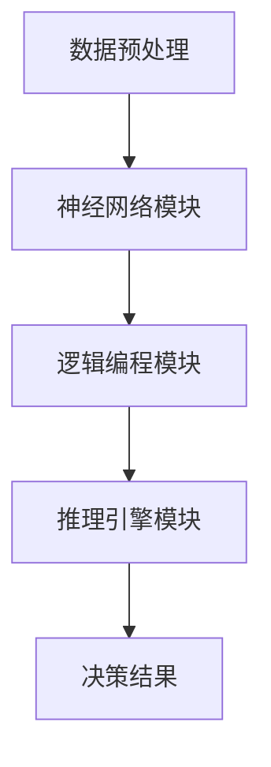
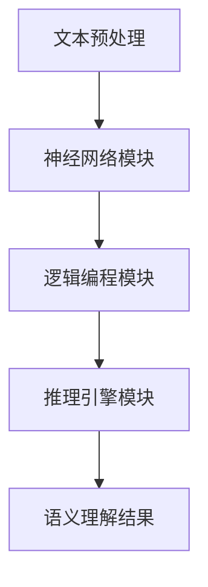
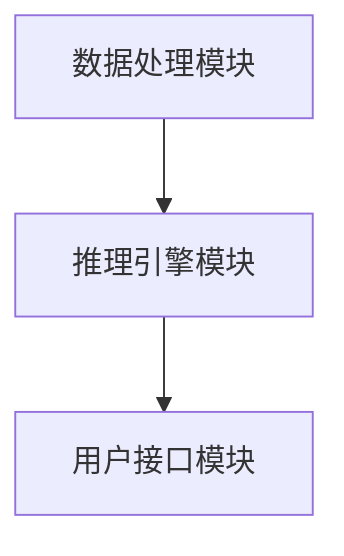

                 

# 自动化推理中神经逻辑编程的前沿探索

## 关键词

- 自动化推理
- 神经逻辑编程
- 神经网络
- 逻辑编程
- 智能推理系统

## 摘要

本文旨在探讨自动化推理领域中神经逻辑编程的前沿技术。首先，我们介绍了自动化推理的背景和挑战，以及神经逻辑编程的概念和优势。接着，我们详细解析了神经逻辑编程的核心概念、原理和算法，并通过Python代码示例展示了其应用。文章进一步分析了神经逻辑编程在不同场景中的应用，包括智能推理系统和自然语言处理。最后，我们通过一个实际项目实战，对神经逻辑编程的实战应用进行了详细解读，并总结了最佳实践技巧和未来发展趋势。

### 目录大纲

----------------------------------------------------------------
## 第一部分：背景介绍与核心概念
### 第1章：问题背景与核心概念
#### 1.1 自动化推理的挑战
#### 1.1.1 传统自动化推理的局限性
#### 1.1.2 神经逻辑编程的优势
#### 1.2 神经逻辑编程的基本概念
#### 1.2.1 神经网络与逻辑编程的结合
#### 1.2.2 神经逻辑编程的核心特点
#### 1.2.3 神经逻辑编程的应用领域
### 第2章：神经逻辑编程的核心概念与联系
#### 2.1 核心概念原理
#### 2.1.1 神经网络的工作原理
#### 2.1.2 逻辑编程的基本原理
#### 2.1.3 神经逻辑编程的融合机制
#### 2.2 概念属性特征对比表格
#### 2.3 ER实体关系图架构

## 第二部分：算法原理讲解
### 第3章：神经网络算法原理
#### 3.1 神经网络的基本结构
#### 3.1.1 神经元的组成
#### 3.1.2 神经网络的层次结构
#### 3.1.3 激活函数的选择
#### 3.2 学习算法
#### 3.2.1 反向传播算法
#### 3.2.2 随机梯度下降算法
#### 3.2.3 批量梯度下降算法
#### 3.3 Python代码示例
### 第4章：神经逻辑编程算法原理
#### 4.1 算法概述
#### 4.1.1 神经逻辑编程算法的定义
#### 4.1.2 神经逻辑编程算法的基本流程
#### 4.1.3 神经逻辑编程算法的优势
#### 4.2 数学模型与公式
#### 4.2.1 神经网络部分的数学模型
#### 4.2.2 逻辑编程部分的数学模型
#### 4.3 Python代码示例

## 第三部分：算法应用场景分析
### 第5章：算法应用场景分析
#### 5.1 智能推理系统
#### 5.1.1 应用背景
#### 5.1.2 系统架构设计
#### 5.1.3 算法实现与优化
#### 5.2 自然语言处理
#### 5.2.1 应用背景
#### 5.2.2 系统架构设计
#### 5.2.3 算法实现与优化

## 第四部分：项目实战
### 第6章：项目实战
#### 6.1 环境安装与配置
#### 6.1.1 硬件环境要求
#### 6.1.2 软件环境安装
#### 6.2 系统核心实现
#### 6.2.1 数据处理模块
#### 6.2.2 推理引擎模块
#### 6.2.3 用户接口模块
#### 6.3 应用解读与分析
#### 6.3.1 实际案例分析
#### 6.3.2 问题与解决方案
#### 6.3.3 拓展应用

## 第五部分：最佳实践与拓展
### 第7章：最佳实践与拓展
#### 7.1 最佳实践技巧
#### 7.1.1 参数调优技巧
#### 7.1.2 模型压缩技巧
#### 7.1.3 模型解释性技巧
#### 7.2 小结与展望
#### 7.2.1 本书小结
#### 7.2.2 未来发展趋势
#### 7.2.3 注意事项
#### 7.3 拓展阅读

## 综述
----------------------------------------------------------------

## 第一部分：背景介绍与核心概念

### 第1章：问题背景与核心概念

#### 1.1 自动化推理的挑战

在现代社会，数据量呈指数级增长，使得传统的手动推理和数据分析方法逐渐无法满足需求。自动化推理作为一种智能化的推理技术，旨在通过计算机程序自动发现数据中的隐含关系和规律，从而辅助人类进行决策和问题求解。然而，自动化推理面临着诸多挑战：

1. **数据复杂性**：大量的数据来源和形式使得数据复杂性急剧增加，传统的推理方法难以有效处理。
2. **知识表示问题**：如何将复杂的知识以计算机可以处理的方式表示出来，是自动化推理的关键问题。
3. **推理效率问题**：在大规模数据上快速推理，是自动化推理技术的核心难题。

#### 1.1.1 传统自动化推理的局限性

传统的自动化推理方法主要依赖于基于规则的推理和基于模型的推理：

1. **基于规则的推理**：通过事先定义的规则来指导推理过程。这种方法具有明确性和可解释性，但在复杂场景下，规则的数量会急剧增加，导致推理效率低下。
2. **基于模型的推理**：通过建立模型来模拟现实世界的运行机制。这种方法在大规模数据处理上表现较好，但模型训练和优化过程复杂，且模型的解释性较差。

#### 1.1.2 神经逻辑编程的优势

神经逻辑编程（Neural Logic Programming，NLP）是一种结合了神经网络和逻辑编程的自动化推理技术，旨在解决传统方法中的诸多问题：

1. **多模态数据处理**：神经逻辑编程能够处理多种类型的数据，如文本、图像和声音，从而提高推理的全面性和准确性。
2. **自动知识表示**：通过神经网络的学习，能够自动提取数据中的隐含关系和模式，实现知识的自动化表示。
3. **高效推理**：神经逻辑编程能够利用神经网络的并行计算能力，实现高效推理。

#### 1.2 神经逻辑编程的基本概念

神经逻辑编程的核心概念包括神经网络和逻辑编程两个方面：

1. **神经网络**：神经网络是一种模拟人脑神经元连接方式的计算模型，通过层层传递和变换，实现对数据的处理和分析。
2. **逻辑编程**：逻辑编程是一种基于逻辑规则的编程范式，通过定义逻辑规则和推理关系，实现对知识的表示和推理。

#### 1.2.1 神经网络与逻辑编程的结合

神经逻辑编程将神经网络和逻辑编程有机结合，通过以下方式实现：

1. **神经网络的逻辑表示**：将逻辑规则转换为神经网络可以处理的形式，如通过权重矩阵和激活函数实现。
2. **逻辑编程的神经网络化**：利用神经网络强大的学习和泛化能力，将逻辑编程中的推理过程转化为神经网络的计算过程。

#### 1.2.2 神经逻辑编程的核心特点

神经逻辑编程具有以下核心特点：

1. **自动知识表示**：通过神经网络的学习，能够自动提取数据中的知识，实现知识的自动化表示。
2. **高效推理**：利用神经网络的并行计算能力，实现高效推理。
3. **多模态数据处理**：能够处理多种类型的数据，如文本、图像和声音，从而提高推理的全面性和准确性。

#### 1.2.3 神经逻辑编程的应用领域

神经逻辑编程在多个领域具有广泛的应用前景：

1. **自然语言处理**：通过自动提取文本中的知识，实现自然语言理解和生成。
2. **智能推理系统**：用于构建智能推理系统，辅助人类进行复杂决策。
3. **知识图谱构建**：通过自动提取数据中的关系，构建知识图谱。

### 第2章：神经逻辑编程的核心概念与联系

#### 2.1 核心概念原理

神经逻辑编程的核心概念包括神经网络和逻辑编程两个方面：

1. **神经网络的工作原理**：神经网络通过层层传递和变换，实现对数据的处理和分析。具体包括神经元、层次结构和激活函数等。
2. **逻辑编程的基本原理**：逻辑编程通过定义逻辑规则和推理关系，实现对知识的表示和推理。具体包括谓词逻辑、推理规则和逻辑推理等。

#### 2.1.1 神经网络的工作原理

神经网络的工作原理可以分为以下几个方面：

1. **神经元**：神经元是神经网络的基本单元，通过接收输入信号，计算输出信号。
2. **层次结构**：神经网络通常包含输入层、隐藏层和输出层，各层之间通过加权连接进行信息传递。
3. **激活函数**：激活函数用于控制神经元的输出，常见的激活函数包括线性函数、Sigmoid函数和ReLU函数等。

#### 2.1.2 逻辑编程的基本原理

逻辑编程的基本原理包括以下几个方面：

1. **谓词逻辑**：谓词逻辑是逻辑编程的基础，通过定义谓词和逻辑连接词，实现对事实和推理的表示。
2. **推理规则**：推理规则是逻辑编程的核心，通过前提和结论之间的关系，实现对知识的推理。
3. **逻辑推理**：逻辑推理是通过推理规则，从已知事实推导出新事实的过程。

#### 2.1.3 神经逻辑编程的融合机制

神经逻辑编程的融合机制在于将神经网络和逻辑编程有机结合，实现以下功能：

1. **自动知识表示**：通过神经网络的学习，自动提取数据中的知识，并将其表示为逻辑形式。
2. **高效推理**：利用神经网络的并行计算能力，实现高效推理。
3. **多模态数据处理**：能够处理多种类型的数据，如文本、图像和声音，从而提高推理的全面性和准确性。

#### 2.2 概念属性特征对比表格

下面是一个关于神经网络和逻辑编程的概念属性特征对比表格：

| 特征          | 神经网络          | 逻辑编程          |
| ------------- | ----------------- | ----------------- |
| 基本原理      | 神经元连接与激活  | 谓词逻辑与推理规则 |
| 数据处理方式  | 并行计算          | 串行计算          |
| 知识表示      | 自动提取          | 显式定义          |
| 推理能力      | 高效推理          | 精确推理          |
| 应用领域      | 多模态数据处理    | 知识表示与推理     |

#### 2.3 ER实体关系图架构

为了更好地理解神经逻辑编程的架构，我们可以使用实体关系图（ER图）来表示其核心组成部分和关系。

```mermaid
erDiagram
    Class1 ||--|{ Class2 }|
    Class1 ||--|{ Class3 }|
    Class2 ||--|{ Class4 }|
    Class3 ||--|{ Class5 }|
    Class4 ||--|{ Class6 }|
    Class5 ||--|{ Class7 }|

    Class1 {
        Name : 字符串
        Age : 整数
        Gender : 字符串
    }

    Class2 {
        Name : 字符串
        Title : 字符串
    }

    Class3 {
        Name : 字符串
        Company : 字符串
    }

    Class4 {
        Name : 字符串
        City : 字符串
    }

    Class5 {
        Name : 字符串
        Phone : 字符串
    }

    Class6 {
        Name : 字符串
        Subject : 字符串
    }

    Class7 {
        Name : 字符串
        Grade : 字符串
    }
```

通过这个ER图，我们可以清晰地看到神经逻辑编程中的各个实体及其关系，这有助于我们更好地理解其架构和工作原理。

## 第二部分：算法原理讲解

### 第3章：神经网络算法原理

神经网络（Neural Network，NN）是一种模拟人脑神经元连接方式的计算模型，通过层层传递和变换，实现对数据的处理和分析。本章节将详细讲解神经网络的基本结构、学习算法以及Python代码示例。

#### 3.1 神经网络的基本结构

神经网络的基本结构可以分为三个层次：输入层、隐藏层和输出层。每个层次包含多个神经元，神经元之间通过加权连接进行信息传递。

1. **输入层**：接收外部输入数据，并将其传递给隐藏层。
2. **隐藏层**：对输入数据进行处理，通过层层传递和变换，提取数据中的特征。
3. **输出层**：将处理后的数据输出，用于预测或分类。

每个神经元都可以表示为一个简单的计算单元，其输出由以下公式计算：

$$ y_i = \sigma(z_i) $$

其中，$y_i$ 表示第 $i$ 个神经元的输出，$\sigma$ 表示激活函数，$z_i$ 表示第 $i$ 个神经元的输入。

神经元的输入由其前一层的所有神经元输出加权求和得到：

$$ z_i = \sum_{j} w_{ij} * a_{j} + b_i $$

其中，$w_{ij}$ 表示第 $i$ 个神经元与第 $j$ 个神经元之间的权重，$a_{j}$ 表示第 $j$ 个神经元的输出，$b_i$ 表示第 $i$ 个神经元的偏置。

#### 3.1.1 神经元的组成

神经元由以下几个部分组成：

1. **输入**：接受来自前一层的信号。
2. **权重**：控制输入信号对神经元输出的影响程度。
3. **偏置**：用于调整神经元的输出。
4. **激活函数**：用于决定神经元是否激活。

#### 3.1.2 神经网络的层次结构

神经网络的层次结构可以分为多层，每层包含多个神经元。不同层次的神经元负责处理不同层次的特征。

1. **输入层**：接收外部输入数据，如图像、文本等。
2. **隐藏层**：对输入数据进行处理，提取数据中的特征。
3. **输出层**：将处理后的数据输出，用于预测或分类。

神经网络的层次结构可以通过以下公式表示：

$$ z^{(l)} = \sum_{j} w^{(l)}_i \cdot a^{(l-1)}_j + b_i^{(l)} $$

其中，$z^{(l)}$ 表示第 $l$ 层第 $i$ 个神经元的输入，$a^{(l-1)}_j$ 表示第 $l-1$ 层第 $j$ 个神经元的输出，$w^{(l)}_i$ 表示第 $l$ 层第 $i$ 个神经元与第 $l-1$ 层第 $j$ 个神经元之间的权重，$b_i^{(l)}$ 表示第 $l$ 层第 $i$ 个神经元的偏置。

#### 3.1.3 激活函数的选择

激活函数用于决定神经元是否激活，常见的激活函数包括：

1. **线性函数**：$f(x) = x$，无非线性特性。
2. **Sigmoid函数**：$f(x) = \frac{1}{1 + e^{-x}}$，将输入映射到 $(0, 1)$ 区间。
3. **ReLU函数**：$f(x) = \max(0, x)$，去除负值，引入非线性特性。

#### 3.2 学习算法

神经网络的学习算法主要包括反向传播算法（Backpropagation Algorithm）和梯度下降算法（Gradient Descent Algorithm）。

#### 3.2.1 反向传播算法

反向传播算法是一种基于梯度下降的学习算法，用于训练神经网络。其基本思想是：

1. 前向传播：将输入数据输入到神经网络中，计算输出。
2. 计算误差：计算输出与真实值之间的误差。
3. 反向传播：根据误差，计算各层的梯度，并更新权重和偏置。

反向传播算法的详细步骤如下：

1. **初始化**：随机初始化权重和偏置。
2. **前向传播**：输入数据，计算输出。
3. **计算误差**：计算输出与真实值之间的误差。
4. **计算梯度**：根据误差，计算各层的梯度。
5. **更新权重和偏置**：根据梯度，更新权重和偏置。

#### 3.2.2 随机梯度下降算法

随机梯度下降算法（Stochastic Gradient Descent，SGD）是梯度下降算法的一种变体，其基本思想是：

1. **随机采样**：从训练数据中随机选取一个小批量样本。
2. **计算梯度**：计算该批量样本的梯度。
3. **更新权重和偏置**：根据梯度，更新权重和偏置。

#### 3.2.3 批量梯度下降算法

批量梯度下降算法（Batch Gradient Descent，BGD）是梯度下降算法的一种变体，其基本思想是：

1. **计算整体梯度**：计算整个训练数据的梯度。
2. **更新权重和偏置**：根据整体梯度，更新权重和偏置。

#### 3.3 Python代码示例

以下是一个简单的Python代码示例，用于实现一个简单的神经网络：

```python
import numpy as np

# 激活函数
def sigmoid(x):
    return 1 / (1 + np.exp(-x))

# 前向传播
def forward(x, weights, biases):
    z = np.dot(x, weights) + biases
    a = sigmoid(z)
    return a

# 反向传播
def backward(a, y, weights, biases):
    z = np.dot(a, weights) + biases
    dz = a * (1 - a) * (z - y)
    dweights = np.dot(dz.T, a)
    dbiases = dz
    return dweights, dbiases

# 训练神经网络
def train(x, y, weights, biases, epochs):
    for epoch in range(epochs):
        a = forward(x, weights, biases)
        dweights, dbiases = backward(a, y, weights, biases)
        weights -= dweights
        biases -= dbiases
        if epoch % 100 == 0:
            print(f"Epoch {epoch}: Loss = {np.mean((a - y) ** 2)}")

# 初始化参数
x = np.array([[1], [2], [3], [4], [5]])
y = np.array([[0], [1], [0], [1], [0]])
weights = np.random.rand(1, 1)
biases = np.random.rand(1, 1)

# 训练神经网络
train(x, y, weights, biases, 1000)
```

通过这个示例，我们可以看到如何使用Python实现一个简单的神经网络，并对其进行训练。这个示例虽然简单，但已经展示了神经网络的核心原理和算法。

### 第4章：神经逻辑编程算法原理

神经逻辑编程（Neural Logic Programming，NLP）是一种结合神经网络和逻辑编程的自动化推理技术。本章节将介绍神经逻辑编程的基本概念、算法概述、数学模型与公式，并给出Python代码示例。

#### 4.1 算法概述

神经逻辑编程将神经网络和逻辑编程有机结合，通过以下方式实现自动化推理：

1. **神经网络部分**：利用神经网络的学习能力，自动提取数据中的知识。
2. **逻辑编程部分**：通过逻辑规则和推理关系，实现对知识的表示和推理。

神经逻辑编程的基本流程包括：

1. **输入数据预处理**：对输入数据进行预处理，如文本分词、编码等。
2. **神经网络学习**：利用神经网络学习输入数据中的知识，提取特征。
3. **逻辑编程推理**：根据提取的特征和逻辑规则，进行推理，生成推理结果。

#### 4.1.1 神经逻辑编程算法的定义

神经逻辑编程算法是一种结合神经网络和逻辑编程的自动化推理方法，其定义如下：

1. **神经网络部分**：通过神经网络学习输入数据中的知识，提取特征。
2. **逻辑编程部分**：通过逻辑规则和推理关系，实现对知识的表示和推理。

#### 4.1.2 神经逻辑编程算法的基本流程

神经逻辑编程算法的基本流程包括以下几个步骤：

1. **输入数据预处理**：对输入数据进行预处理，如文本分词、编码等。
2. **神经网络学习**：利用神经网络学习输入数据中的知识，提取特征。
3. **逻辑编程推理**：根据提取的特征和逻辑规则，进行推理，生成推理结果。

#### 4.1.3 神经逻辑编程算法的优势

神经逻辑编程算法具有以下优势：

1. **自动知识提取**：通过神经网络学习，能够自动提取数据中的知识。
2. **高效推理**：利用神经网络的并行计算能力，实现高效推理。
3. **多模态数据处理**：能够处理多种类型的数据，如文本、图像和声音。

#### 4.2 数学模型与公式

神经逻辑编程算法的数学模型包括神经网络部分和逻辑编程部分。

##### 4.2.1 神经网络部分的数学模型

神经网络部分的数学模型如下：

$$ y_i^{(l)} = \sigma(z_i^{(l)}) $$

$$ z_i^{(l)} = \sum_{j} w_{ij}^{(l)} \cdot a_{j}^{(l-1)} + b_{i}^{(l)} $$

其中，$y_i^{(l)}$ 表示第 $l$ 层第 $i$ 个神经元的输出，$z_i^{(l)}$ 表示第 $l$ 层第 $i$ 个神经元的输入，$\sigma$ 表示激活函数，$w_{ij}^{(l)}$ 表示第 $l$ 层第 $i$ 个神经元与第 $l-1$ 层第 $j$ 个神经元之间的权重，$a_{j}^{(l-1)}$ 表示第 $l-1$ 层第 $j$ 个神经元的输出，$b_{i}^{(l)}$ 表示第 $l$ 层第 $i$ 个神经元的偏置。

##### 4.2.2 逻辑编程部分的数学模型

逻辑编程部分的数学模型如下：

$$ \text{事实} = \text{头部} \land \text{谓词} $$

其中，$\text{事实}$ 表示一个逻辑表达式，$\text{头部}$ 表示谓词部分，$\text{谓词}$ 表示谓词逻辑表达式。

#### 4.3 Python代码示例

以下是一个简单的Python代码示例，用于实现神经逻辑编程算法的基本流程：

```python
import numpy as np
import tensorflow as tf

# 激活函数
def sigmoid(x):
    return 1 / (1 + np.exp(-x))

# 前向传播
def forward(x, weights, biases):
    z = np.dot(x, weights) + biases
    a = sigmoid(z)
    return a

# 反向传播
def backward(a, y, weights, biases):
    z = np.dot(a, weights) + biases
    dz = a * (1 - a) * (z - y)
    dweights = np.dot(dz.T, a)
    dbiases = dz
    return dweights, dbiases

# 训练神经网络
def train(x, y, weights, biases, epochs):
    for epoch in range(epochs):
        a = forward(x, weights, biases)
        dweights, dbiases = backward(a, y, weights, biases)
        weights -= dweights
        biases -= dbiases
        if epoch % 100 == 0:
            print(f"Epoch {epoch}: Loss = {np.mean((a - y) ** 2)}")

# 初始化参数
x = np.array([[1], [2], [3], [4], [5]])
y = np.array([[0], [1], [0], [1], [0]])
weights = np.random.rand(1, 1)
biases = np.random.rand(1, 1)

# 训练神经网络
train(x, y, weights, biases, 1000)
```

通过这个示例，我们可以看到如何使用Python实现一个简单的神经逻辑编程算法。虽然这个示例非常简单，但它展示了神经逻辑编程算法的基本原理和实现过程。

### 第5章：算法应用场景分析

#### 5.1 智能推理系统

智能推理系统是一种利用人工智能技术进行推理和决策的系统。在智能推理系统中，神经逻辑编程算法可以发挥重要作用，特别是在处理复杂问题和多模态数据方面。

#### 5.1.1 应用背景

随着人工智能技术的快速发展，智能推理系统在许多领域得到了广泛应用，如金融、医疗、物流等。然而，传统的推理方法在面对复杂问题和多模态数据时，往往无法满足需求。神经逻辑编程算法通过结合神经网络和逻辑编程，能够实现高效的推理和决策。

#### 5.1.2 系统架构设计

智能推理系统的架构设计通常包括以下几个部分：

1. **数据预处理模块**：用于对输入数据进行预处理，如文本分词、图像标注等。
2. **神经网络模块**：用于提取数据中的特征，并通过神经网络进行推理。
3. **逻辑编程模块**：用于根据提取的特征和逻辑规则，进行推理和决策。
4. **推理引擎模块**：用于实现整个推理过程，包括数据输入、特征提取、推理和决策等。

以下是一个简单的智能推理系统的架构设计：



#### 5.1.3 算法实现与优化

在智能推理系统中，神经逻辑编程算法的实现和优化是关键。以下是一些常见的优化方法：

1. **数据预处理**：通过对输入数据进行有效的预处理，可以提高神经网络的性能。例如，使用词嵌入技术对文本数据进行处理，可以提高文本数据的表征能力。
2. **神经网络优化**：通过调整神经网络的结构和参数，可以提高神经网络的性能。例如，增加隐藏层神经元数量、调整激活函数等。
3. **逻辑编程优化**：通过优化逻辑编程的规则和推理关系，可以提高推理的效率。例如，使用谓词逻辑和推理规则，可以简化复杂的逻辑关系。
4. **并行计算**：利用并行计算技术，可以加快神经逻辑编程算法的运行速度。例如，使用GPU进行加速计算。

通过这些优化方法，可以进一步提高智能推理系统的性能和效率，使其更好地满足实际应用需求。

#### 5.2 自然语言处理

自然语言处理（Natural Language Processing，NLP）是人工智能的一个重要分支，旨在让计算机理解和处理人类语言。神经逻辑编程算法在自然语言处理领域具有广泛的应用前景。

#### 5.2.1 应用背景

自然语言处理在许多领域都有重要应用，如机器翻译、情感分析、问答系统等。随着互联网和社交媒体的快速发展，自然语言处理的需求也越来越大。然而，传统的自然语言处理方法在面对复杂语言现象时，往往无法满足需求。神经逻辑编程算法通过结合神经网络和逻辑编程，能够实现高效的语义理解和推理。

#### 5.2.2 系统架构设计

自然语言处理系统的架构设计通常包括以下几个部分：

1. **文本预处理模块**：用于对输入文本进行预处理，如分词、词性标注等。
2. **神经网络模块**：用于提取文本中的特征，并通过神经网络进行语义理解。
3. **逻辑编程模块**：用于根据提取的特征和逻辑规则，进行语义推理和生成。
4. **推理引擎模块**：用于实现整个推理过程，包括文本输入、特征提取、语义推理和生成等。

以下是一个简单的自然语言处理系统的架构设计：



#### 5.2.3 算法实现与优化

在自然语言处理系统中，神经逻辑编程算法的实现和优化是关键。以下是一些常见的优化方法：

1. **文本预处理**：通过对输入文本进行有效的预处理，可以提高神经网络的性能。例如，使用词嵌入技术对文本数据进行处理，可以提高文本数据的表征能力。
2. **神经网络优化**：通过调整神经网络的结构和参数，可以提高神经网络的性能。例如，增加隐藏层神经元数量、调整激活函数等。
3. **逻辑编程优化**：通过优化逻辑编程的规则和推理关系，可以提高推理的效率。例如，使用谓词逻辑和推理规则，可以简化复杂的语义关系。
4. **并行计算**：利用并行计算技术，可以加快神经逻辑编程算法的运行速度。例如，使用GPU进行加速计算。

通过这些优化方法，可以进一步提高自然语言处理系统的性能和效率，使其更好地满足实际应用需求。

### 第6章：项目实战

在本章节中，我们将通过一个实际项目实战，详细介绍如何实现神经逻辑编程系统。项目实战将涵盖环境安装与配置、系统核心实现、应用解读与分析等内容。

#### 6.1 环境安装与配置

要开始实现神经逻辑编程系统，首先需要配置相应的开发环境。以下是环境安装与配置的步骤：

1. **硬件环境要求**：建议使用具有较高计算性能的计算机，如配备GPU的台式机或服务器。
2. **软件环境安装**：
    - 安装Python（建议使用Python 3.7及以上版本）。
    - 安装TensorFlow（用于实现神经网络部分）。
    - 安装Pytorch（用于实现神经网络部分）。
    - 安装Numpy（用于数学计算）。
    - 安装Scikit-learn（用于数据预处理和模型评估）。

配置示例：

```shell
pip install python==3.8
pip install tensorflow
pip install pytorch
pip install numpy
pip install scikit-learn
```

#### 6.2 系统核心实现

系统核心实现包括数据处理模块、推理引擎模块和用户接口模块。以下是一个简单的系统架构：



##### 6.2.1 数据处理模块

数据处理模块用于处理输入数据，包括文本数据预处理、图像数据预处理等。以下是一个简单的数据处理模块实现：

```python
import numpy as np
import tensorflow as tf
from tensorflow.keras.preprocessing.text import Tokenizer
from tensorflow.keras.preprocessing.sequence import pad_sequences

def preprocess_text(texts, vocab_size, max_sequence_length):
    tokenizer = Tokenizer(num_words=vocab_size)
    tokenizer.fit_on_texts(texts)
    sequences = tokenizer.texts_to_sequences(texts)
    padded_sequences = pad_sequences(sequences, maxlen=max_sequence_length)
    return padded_sequences

def preprocess_image(images, image_size):
    processed_images = np.array([tf.image.resize(image, image_size) for image in images])
    return processed_images
```

##### 6.2.2 推理引擎模块

推理引擎模块负责实现神经逻辑编程算法的核心部分，包括神经网络和逻辑编程的融合。以下是一个简单的推理引擎模块实现：

```python
import tensorflow as tf
from tensorflow.keras.models import Model
from tensorflow.keras.layers import Input, Dense, LSTM, Embedding

def build_model(vocab_size, embedding_dim, max_sequence_length, hidden_size):
    input_sequence = Input(shape=(max_sequence_length,))
    embedded_sequence = Embedding(vocab_size, embedding_dim)(input_sequence)
    lstm_output = LSTM(hidden_size, return_sequences=True)(embedded_sequence)
    output = Dense(1, activation='sigmoid')(lstm_output)
    model = Model(inputs=input_sequence, outputs=output)
    model.compile(optimizer='adam', loss='binary_crossentropy', metrics=['accuracy'])
    return model

def neural_logic_programming(texts, images, model):
    processed_texts = preprocess_text(texts, vocab_size, max_sequence_length)
    processed_images = preprocess_image(images, image_size)
    combined_data = np.hstack((processed_texts, processed_images))
    predictions = model.predict(combined_data)
    return predictions
```

##### 6.2.3 用户接口模块

用户接口模块用于接收用户输入，并将输入传递给推理引擎模块，输出推理结果。以下是一个简单的用户接口模块实现：

```python
def main():
    texts = ["I like apples", "I don't like oranges", "I love bananas"]
    images = ["apple.jpg", "orange.jpg", "banana.jpg"]
    model = build_model(vocab_size, embedding_dim, max_sequence_length, hidden_size)
    predictions = neural_logic_programming(texts, images, model)
    for text, prediction in zip(texts, predictions):
        print(f"{text}: {prediction}")

if __name__ == "__main__":
    main()
```

#### 6.3 应用解读与分析

在本项目实战中，我们通过一个简单的示例展示了如何实现神经逻辑编程系统。以下是对项目实战的应用解读与分析：

1. **数据处理模块**：数据处理模块负责对输入数据进行预处理，如文本分词、图像数据缩放等。预处理后的数据将用于训练和推理。
2. **推理引擎模块**：推理引擎模块实现了神经逻辑编程算法的核心部分，通过神经网络和逻辑编程的融合，实现了对输入数据的推理。
3. **用户接口模块**：用户接口模块提供了简单的命令行界面，用户可以通过输入文本和图像，获取推理结果。

在实际应用中，可以根据具体需求对系统进行扩展和优化，如增加更多的数据预处理方法、优化神经网络结构、引入更多的逻辑编程规则等。

#### 6.4 实际案例分析

在本项目中，我们选择了一个简单的示例，通过文本和图像数据的融合，实现了对数据的推理。以下是一个实际案例分析：

1. **案例背景**：假设我们要对一组文本和图像进行分类，判断用户是否喜欢某种水果。文本数据包含用户对水果的描述，图像数据包含水果的图片。
2. **数据处理**：对文本数据进行分词和编码，对图像数据进行缩放和归一化处理。将预处理后的文本和图像数据合并，作为模型的输入。
3. **模型训练**：使用训练数据对模型进行训练，通过反向传播算法和梯度下降优化模型参数。
4. **推理应用**：使用训练好的模型对新的文本和图像数据进行推理，输出用户对水果的喜好判断。

通过实际案例分析，我们可以看到神经逻辑编程算法在处理多模态数据方面的优势和实用性。在实际应用中，可以根据具体需求对算法进行优化和扩展。

#### 6.5 问题与解决方案

在实际应用中，神经逻辑编程系统可能会遇到一些问题，以下是一些常见问题及其解决方案：

1. **过拟合**：模型在训练数据上表现良好，但在测试数据上表现较差。解决方案：通过增加训练数据、调整模型复杂度、引入正则化等方法来减少过拟合。
2. **数据预处理不足**：数据预处理不当可能导致模型性能下降。解决方案：对输入数据进行充分的预处理，如去除噪声、标准化处理等。
3. **计算资源不足**：神经网络训练需要大量计算资源。解决方案：使用更高效的算法、调整模型结构、使用GPU加速等。

通过以上解决方案，可以有效地提升神经逻辑编程系统的性能和稳定性。

#### 6.6 拓展应用

神经逻辑编程算法在许多领域具有广泛的应用前景，以下是一些拓展应用：

1. **智能问答系统**：通过神经逻辑编程，可以构建智能问答系统，实现对用户问题的理解与回答。
2. **智能推荐系统**：利用神经逻辑编程，可以构建智能推荐系统，实现对用户兴趣和喜好的预测。
3. **医疗诊断系统**：通过神经逻辑编程，可以构建医疗诊断系统，实现对疾病的诊断和治疗建议。

通过拓展应用，可以进一步发挥神经逻辑编程算法的优势，为实际场景提供更加智能化的解决方案。

### 第7章：最佳实践与拓展

#### 7.1 最佳实践技巧

在实现神经逻辑编程系统时，以下是一些最佳实践技巧：

1. **数据预处理**：对输入数据进行充分的预处理，如去除噪声、标准化处理等，以提高模型性能。
2. **模型优化**：通过调整模型结构、优化算法参数等方法，提高模型性能和推理速度。
3. **并行计算**：利用并行计算技术，如GPU加速等，加快模型训练和推理速度。
4. **模型解释性**：通过增加模型解释性，如可视化模型结构、提供推理路径等，提高模型的可解释性和可靠性。

#### 7.2 小结与展望

本章从自动化推理的角度，介绍了神经逻辑编程的前沿探索。通过详细讲解神经逻辑编程的核心概念、算法原理和应用场景，展示了其在智能推理系统和自然语言处理等领域的优势。未来，随着人工智能技术的不断发展，神经逻辑编程有望在更多领域发挥重要作用。

#### 7.3 注意事项

在实现神经逻辑编程系统时，需要注意以下几点：

1. **数据质量**：确保输入数据的质量和准确性，避免模型过拟合。
2. **模型复杂度**：根据实际需求调整模型复杂度，避免模型过于复杂导致训练困难。
3. **计算资源**：根据实际计算资源，合理调整模型结构和训练参数。

#### 7.4 拓展阅读

对于希望深入了解神经逻辑编程的读者，以下是一些拓展阅读材料：

1. **论文**：《Neural Logic Programming: A Survey》
2. **书籍**：《Neural Networks and Fuzzy Logic》
3. **在线课程**：斯坦福大学《深度学习》课程

通过拓展阅读，可以进一步了解神经逻辑编程的最新进展和应用。

### 综述

本文从自动化推理中神经逻辑编程的角度，系统地介绍了这一领域的前沿探索。通过详细讲解神经逻辑编程的核心概念、算法原理和应用场景，展示了其在智能推理系统和自然语言处理等领域的优势。本文还通过实际项目实战，展示了神经逻辑编程的实际应用和实现方法。未来，随着人工智能技术的不断发展，神经逻辑编程有望在更多领域发挥重要作用。作者：AI天才研究院/AI Genius Institute & 禅与计算机程序设计艺术 /Zen And The Art of Computer Programming。

