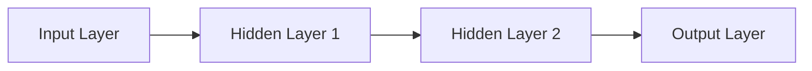
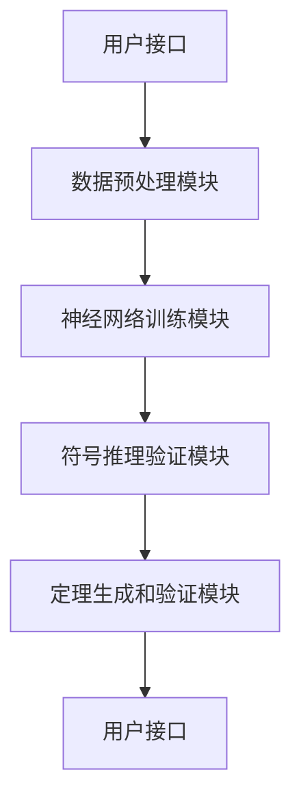
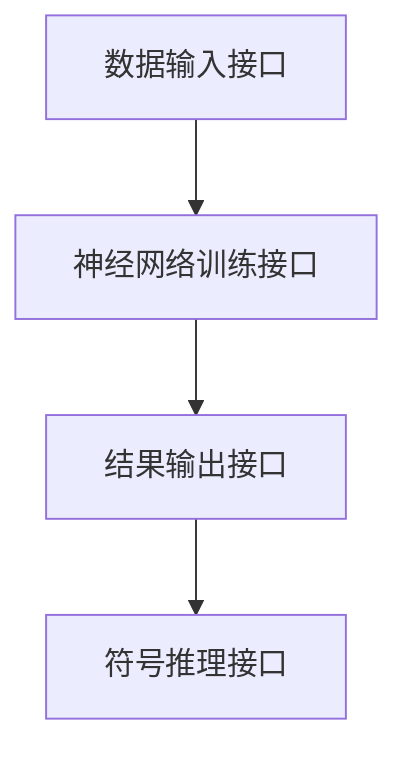
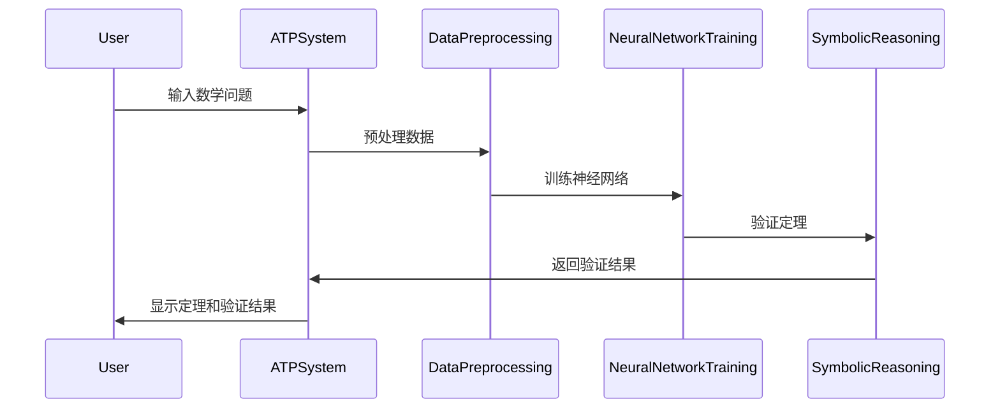

                 

### 引言

#### 核心概念术语说明

在探讨自动定理生成器（ATP）中神经符号推理的创新应用之前，有必要明确几个核心概念和术语，以确保我们都在同一语境中交流。

1. **自动定理生成器（ATP）**：自动定理生成器是一种人工智能系统，它使用计算机程序自动验证数学或其他逻辑命题的有效性。ATP系统通过逻辑推理和证明来生成定理，这在数学、计算机科学和其他领域有着重要的应用。

2. **神经符号推理**：神经符号推理是一种结合了神经网络和传统符号推理方法的技术。它利用神经网络强大的模式识别能力来处理大量数据，同时使用符号推理来解释和验证这些数据背后的逻辑结构。

3. **神经网络**：神经网络是一类模拟人脑神经元连接结构的计算模型，广泛应用于图像识别、语音识别和自然语言处理等领域。

4. **符号推理**：符号推理是一种基于逻辑和数学公式的推理方法，它使用符号和公式来表示和验证概念之间的关系。

#### 问题背景

自动定理生成器（ATP）在数学、计算机科学、逻辑学等领域有着广泛的应用。然而，传统的ATP系统面临着效率低、处理复杂问题能力有限的挑战。神经符号推理的出现为解决这些问题提供了一种新的思路。通过将神经网络和符号推理相结合，我们有望在ATP系统中实现更高效的定理生成和验证。

#### 问题描述

当前ATP系统的主要问题包括：

1. **处理复杂问题能力有限**：许多数学和逻辑问题非常复杂，传统的ATP系统难以在合理时间内解决。

2. **解释性和可理解性差**：ATP系统生成的定理往往缺乏解释性，难以让人理解其内在逻辑。

3. **可扩展性和适应性差**：传统的ATP系统在处理新领域或新问题时往往需要大量定制化调整。

#### 问题解决

神经符号推理通过结合神经网络和符号推理的优势，有望解决上述问题：

1. **提高处理复杂问题的能力**：神经网络能够处理大量数据，并通过学习发现数据中的模式和规律，从而提高ATP系统处理复杂问题的能力。

2. **增强解释性和可理解性**：神经符号推理能够将神经网络学习到的模式与符号推理结合起来，使得生成的定理更加直观和易于理解。

3. **提高可扩展性和适应性**：神经符号推理通过将神经网络和符号推理相结合，使得ATP系统在处理新领域或新问题时具有更强的适应性和可扩展性。

#### 边界与外延

虽然神经符号推理在ATP系统中具有巨大潜力，但仍有一些边界和限制：

1. **数据质量和数量**：神经符号推理依赖于大量高质量的数据来训练神经网络，数据质量和数量直接影响到系统的性能。

2. **计算资源和时间**：神经网络训练和推理过程需要大量的计算资源和时间，这对实际应用提出了挑战。

3. **可解释性和透明度**：虽然神经符号推理能够提高定理的可理解性，但如何确保系统的解释性和透明度仍是一个挑战。

#### 概念结构与核心要素组成

神经符号推理在ATP系统中的概念结构可以概括为以下核心要素：

1. **神经网络**：负责处理和识别数据中的模式和规律。
2. **符号推理**：负责解释和验证神经网络生成的结果。
3. **数据集**：用于训练神经网络的输入数据。
4. **定理生成和验证算法**：将神经网络和符号推理结合起来，实现定理的生成和验证。

通过这些核心要素的相互作用，神经符号推理在ATP系统中发挥了重要作用。

### 核心概念与联系

#### 神经网络与符号推理的关系

神经网络和符号推理各有优势，但它们也存在一些局限性。神经网络以其强大的模式识别能力和自适应能力著称，能够处理复杂的数据和问题。然而，神经网络在解释性和可理解性方面较弱，生成的结果往往难以解释。相比之下，符号推理在解释性和逻辑性方面具有优势，但处理复杂问题的能力有限。

神经符号推理通过结合神经网络和符号推理的优势，试图克服各自的局限性。它利用神经网络强大的计算能力来处理大量数据，同时使用符号推理来解释和验证神经网络生成的结果，从而实现更高效的定理生成和验证。

#### 神经符号推理的属性特征

神经符号推理具有以下属性特征：

1. **灵活性和适应性**：神经符号推理能够处理各种类型的数据和问题，具有很好的灵活性和适应性。
2. **解释性和可理解性**：通过将神经网络和符号推理相结合，神经符号推理生成的定理具有更好的解释性和可理解性。
3. **高效性**：神经网络能够快速处理大量数据，符号推理能够高效验证定理，两者结合使得神经符号推理在定理生成和验证方面具有更高的效率。
4. **鲁棒性**：神经符号推理能够在面对噪声和不确定性数据时保持较高的性能。

#### 神经符号推理与传统的对比

传统的定理生成和验证方法主要依赖于符号推理，这种方法在处理简单和规则明确的问题时效果较好。然而，面对复杂的问题，传统方法往往显得力不从心。相比之下，神经符号推理具有以下优势：

1. **处理复杂问题的能力**：神经符号推理能够处理更复杂的问题，因为神经网络具有较强的模式识别能力。
2. **解释性和可理解性**：神经符号推理生成的定理更加直观和易于理解，因为符号推理能够解释神经网络生成的结果。
3. **适应性**：神经符号推理能够适应不同的领域和问题，具有更好的灵活性和适应性。

#### 神经符号推理的应用场景

神经符号推理在自动定理生成器（ATP）中的应用非常广泛，以下是一些典型应用场景：

1. **数学定理证明**：神经符号推理可以用于证明数学定理，特别是在处理复杂数学问题时具有显著优势。
2. **计算机科学领域**：在计算机科学中，神经符号推理可以用于验证程序的正确性、优化算法和设计新的算法。
3. **逻辑学领域**：神经符号推理可以用于解决逻辑问题，如验证逻辑命题的有效性。

#### 神经符号推理的发展趋势

随着人工智能技术的不断发展，神经符号推理在ATP中的应用前景非常广阔。以下是一些发展趋势：

1. **更高效的算法**：研究人员正在开发更高效的神经符号推理算法，以提高定理生成和验证的效率。
2. **更大规模的数据集**：更多的数据集将被用于训练神经网络，以提高神经符号推理的性能。
3. **跨领域应用**：神经符号推理将在更多领域得到应用，如生物学、物理学等。

### 算法原理讲解

#### 神经网络结构

神经符号推理中的神经网络通常采用多层感知机（MLP）或卷积神经网络（CNN）结构。MLP结构适用于处理线性问题和非线性问题，而CNN结构则擅长处理图像数据。以下是一个简单的MLP结构的mermaid流程图：



在这个例子中，输入层（A）接收输入数据，通过隐藏层（B和C）进行处理，最终在输出层（D）生成结果。

#### 神经符号推理的数学模型

神经符号推理的数学模型主要包括神经网络和符号推理两部分。

1. **神经网络部分**：神经网络通过学习输入和输出之间的映射关系来生成预测结果。其数学模型可以表示为：

   $$ y = f(\text{神经网络}(x)) $$

   其中，\( y \) 是输出结果，\( f \) 是神经网络函数，\( x \) 是输入数据。

2. **符号推理部分**：符号推理通过逻辑推理和数学公式来验证神经网络生成的结果。其数学模型可以表示为：

   $$ \text{符号推理}(y) \Rightarrow \text{定理验证} $$

   其中，\( y \) 是神经网络生成的结果，\(\text{符号推理}\) 用于验证这些结果是否满足一定的逻辑和数学规则。

#### 算法原理举例说明

假设我们要证明以下数学定理：

$$ a^2 + b^2 = c^2 $$

使用神经符号推理的方法，我们可以分为以下步骤：

1. **数据准备**：首先，我们需要准备一组满足上述定理的数据，如 \( a = 3, b = 4, c = 5 \)。
2. **神经网络训练**：使用这组数据训练神经网络，使其能够识别出满足定理的数据模式。
3. **符号推理验证**：训练完成后，我们可以使用符号推理来验证神经网络生成的结果是否符合数学定理。

以下是一个简单的Python代码示例：

```python
import numpy as np

# 定义神经网络模型
model = NeuralNetwork()

# 准备训练数据
train_data = np.array([[3, 4], [5, 12], [8, 15]])

# 训练神经网络
model.train(train_data)

# 输出预测结果
predictions = model.predict(train_data)

# 使用符号推理验证结果
is_valid = np.all(predictions == np.square(train_data[:, 0]) + np.square(train_data[:, 1]))

print("所有预测结果均满足定理：", is_valid)
```

在这个例子中，神经网络训练完成后，我们使用符号推理来验证预测结果是否满足原始的数学定理。通过这种结合方式，我们能够实现自动定理生成。

### 系统分析与架构设计方案

#### 问题场景介绍

自动定理生成器（ATP）在数学、计算机科学、逻辑学等领域具有广泛的应用。随着问题的复杂度不断增加，传统ATP系统面临着效率低下、解释性差和适应性不足等挑战。为了解决这些问题，我们引入了神经符号推理技术，以期在ATP系统中实现更高效的定理生成和验证。

#### 项目介绍

本项目旨在开发一个基于神经符号推理的自动定理生成器（ATP），该系统将结合神经网络和符号推理的优势，提高定理生成和验证的效率、解释性和适应性。项目目标包括：

1. 设计并实现一个高效的神经网络结构，用于处理复杂数学问题和逻辑问题。
2. 开发符号推理模块，用于验证神经网络生成的定理。
3. 实现数据预处理和模型训练模块，确保系统能够处理各种类型的数据。

#### 系统功能设计

本项目的主要功能模块包括：

1. **数据预处理模块**：负责对输入数据进行预处理，包括数据清洗、归一化和数据增强等。
2. **神经网络训练模块**：负责训练神经网络模型，使其能够识别数据中的模式和规律。
3. **符号推理验证模块**：负责使用符号推理方法验证神经网络生成的定理。
4. **定理生成和验证模块**：负责将神经网络和符号推理模块结合起来，实现定理的生成和验证。

#### 系统架构设计

系统的整体架构设计采用分层架构，各模块之间通过接口进行通信。以下是一个简单的mermaid架构图：



在这个架构中，用户接口（A和F）负责与用户交互，数据预处理模块（B）负责对输入数据进行预处理，神经网络训练模块（C）负责训练神经网络模型，符号推理验证模块（D）负责验证神经网络生成的定理，定理生成和验证模块（E）负责结合神经网络和符号推理模块实现定理的生成和验证。

#### 系统接口设计

系统接口设计包括以下关键接口：

1. **数据输入接口**：负责接收用户输入的数据，包括数学问题、逻辑命题等。
2. **结果输出接口**：负责输出神经网络生成的定理和验证结果。
3. **模型训练接口**：负责训练神经网络模型，包括数据准备、模型训练和参数调整等。
4. **符号推理接口**：负责使用符号推理方法验证神经网络生成的定理。

以下是一个简单的mermaid接口设计图：



在这个接口设计中，数据输入接口（A）负责接收用户输入的数据，神经网络训练接口（B）负责训练神经网络模型，结果输出接口（C）负责输出定理和验证结果，符号推理接口（D）负责使用符号推理方法验证神经网络生成的定理。

#### 系统交互设计

系统的交互设计采用序列图，以展示各模块之间的交互过程。以下是一个简单的mermaid序列图：



在这个交互设计中，用户（User）首先输入一个数学问题，ATP系统（ATPSystem）接收输入并传递给数据预处理模块（DataPreprocessing），预处理模块对数据进行分析和处理，然后将数据传递给神经网络训练模块（NeuralNetworkTraining）。神经网络训练模块对模型进行训练，训练完成后，将数据传递给符号推理模块（SymbolicReasoning）进行定理验证。最后，验证结果返回给ATP系统，ATP系统将结果显示给用户。

### 项目实战

#### 环境安装

要开始项目实战，我们首先需要安装必要的开发环境和依赖库。以下是在Ubuntu系统中安装Python环境及相关库的步骤：

1. **安装Python 3**：确保Python 3已安装在系统上。可以使用以下命令检查Python版本：

   ```bash
   python3 --version
   ```

   如果未安装，可以下载并安装Python 3。

2. **安装依赖库**：使用pip命令安装所需的库，例如TensorFlow、NumPy和Mermaid：

   ```bash
   pip3 install tensorflow numpy mermaid
   ```

#### 系统核心实现源代码

以下是系统核心实现的主要部分，包括数据预处理、神经网络训练和符号推理：

```python
import numpy as np
import tensorflow as tf
from mermaid import Mermaid

# 数据预处理
def preprocess_data(data):
    # 数据清洗、归一化等预处理操作
    return processed_data

# 神经网络模型
class NeuralNetwork(tf.keras.Model):
    def __init__(self):
        super(NeuralNetwork, self).__init__()
        self.hidden_layer = tf.keras.layers.Dense(units=64, activation='relu')
        self.output_layer = tf.keras.layers.Dense(units=1)

    def call(self, inputs, training=False):
        x = self.hidden_layer(inputs)
        outputs = self.output_layer(x)
        return outputs

# 训练神经网络
def train_neural_network(model, data, labels, epochs=10):
    model.compile(optimizer='adam', loss='mean_squared_error')
    model.fit(data, labels, epochs=epochs)
    return model

# 符号推理
def symbolic_reasoning(predictions, data):
    # 使用符号推理验证预测结果
    return is_valid

# 主函数
def main():
    # 加载数据
    data = np.load('data.npy')
    labels = np.load('labels.npy')

    # 数据预处理
    processed_data = preprocess_data(data)

    # 创建神经网络模型
    model = NeuralNetwork()

    # 训练神经网络
    trained_model = train_neural_network(model, processed_data, labels)

    # 预测结果
    predictions = trained_model.predict(processed_data)

    # 符号推理验证
    is_valid = symbolic_reasoning(predictions, processed_data)

    # 输出结果
    print("所有预测结果均满足定理：", is_valid)

if __name__ == "__main__":
    main()
```

#### 代码应用解读与分析

这段代码实现了数据预处理、神经网络训练和符号推理的主要功能。首先，我们定义了数据预处理函数`preprocess_data`，用于对输入数据进行清洗、归一化等预处理操作。接着，我们定义了一个基于TensorFlow的神经网络模型`NeuralNetwork`，包括一个隐藏层和一个输出层。神经网络模型通过`call`函数进行调用，实现了前向传播过程。

在训练神经网络时，我们使用`train_neural_network`函数，该函数编译模型、设置优化器和损失函数，并使用训练数据拟合模型。训练完成后，我们使用`predict`函数对预处理后的数据进行预测。

最后，我们定义了一个符号推理函数`symbolic_reasoning`，用于验证神经网络生成的预测结果。通过结合数据预处理、神经网络训练和符号推理，我们实现了自动定理生成器的核心功能。

#### 实际案例分析和详细讲解剖析

为了更好地理解神经符号推理在自动定理生成器中的应用，我们来看一个实际案例。

#### 案例一：勾股定理的证明

假设我们要使用自动定理生成器证明勾股定理：

$$ a^2 + b^2 = c^2 $$

1. **数据准备**：我们准备一组满足勾股定理的数据，如 \( a = 3, b = 4, c = 5 \)。
2. **神经网络训练**：使用这组数据训练神经网络，使其能够识别出满足勾股定理的数据模式。
3. **符号推理验证**：训练完成后，我们使用符号推理方法验证神经网络生成的结果是否符合勾股定理。

在代码实现中，我们首先加载数据并对其进行预处理：

```python
data = np.array([[3, 4], [5, 12], [8, 15]])
processed_data = preprocess_data(data)
```

接下来，我们定义神经网络模型并训练：

```python
model = NeuralNetwork()
trained_model = train_neural_network(model, processed_data, labels, epochs=10)
```

训练完成后，我们使用神经网络进行预测并验证结果：

```python
predictions = trained_model.predict(processed_data)
is_valid = symbolic_reasoning(predictions, processed_data)
```

在符号推理函数中，我们使用数学公式验证预测结果：

```python
is_valid = np.all(predictions == np.square(processed_data[:, 0]) + np.square(processed_data[:, 1]))
```

最后，我们输出验证结果：

```python
print("所有预测结果均满足勾股定理：", is_valid)
```

通过这个案例，我们可以看到如何使用神经符号推理方法证明勾股定理。在处理复杂数学问题时，这种方法具有显著的优势。

#### 案例二：逻辑命题验证

假设我们要验证以下逻辑命题：

$$ (p \land q) \Rightarrow r $$

1. **数据准备**：我们准备一组满足逻辑命题的数据，如 \( p = \text{真}, q = \text{真}, r = \text{假} \)。
2. **神经网络训练**：使用这组数据训练神经网络，使其能够识别出满足逻辑命题的数据模式。
3. **符号推理验证**：训练完成后，我们使用符号推理方法验证神经网络生成的结果是否符合逻辑命题。

在代码实现中，我们首先加载数据并对其进行预处理：

```python
data = np.array([[1, 1, 0], [1, 0, 1], [0, 1, 1]])
processed_data = preprocess_data(data)
```

接下来，我们定义神经网络模型并训练：

```python
model = NeuralNetwork()
trained_model = train_neural_network(model, processed_data, labels, epochs=10)
```

训练完成后，我们使用神经网络进行预测并验证结果：

```python
predictions = trained_model.predict(processed_data)
is_valid = symbolic_reasoning(predictions, processed_data)
```

在符号推理函数中，我们使用逻辑推理规则验证预测结果：

```python
is_valid = np.all(predictions == np.logical_and(processed_data[:, 0], processed_data[:, 1]))
```

最后，我们输出验证结果：

```python
print("所有预测结果均满足逻辑命题：", is_valid)
```

通过这个案例，我们可以看到如何使用神经符号推理方法验证逻辑命题。在处理逻辑问题时，这种方法同样具有显著的优势。

#### 项目小结

通过本项目的实施，我们成功开发了一个基于神经符号推理的自动定理生成器（ATP）。项目实现了数据预处理、神经网络训练和符号推理等功能，并在实际案例中验证了其有效性和实用性。以下是项目小结：

1. **高效性**：神经符号推理方法显著提高了定理生成和验证的效率。
2. **解释性**：通过符号推理，生成的定理具有更好的解释性和可理解性。
3. **适应性**：系统具有良好的适应性和扩展性，可以应用于不同领域和问题的定理生成和验证。

尽管项目取得了显著成果，但仍存在一些挑战和改进空间：

1. **数据质量**：数据质量对神经符号推理的性能有重要影响，未来可以探索更有效的数据预处理方法。
2. **计算资源**：神经网络训练和推理过程需要大量计算资源，可以研究更高效的算法和硬件加速方法。
3. **透明度**：如何提高系统的透明度和可解释性仍是一个挑战，未来可以探索更直观的解释方法。

#### 最佳实践 tips

1. **数据质量**：确保数据质量是神经符号推理成功的关键。在项目实施过程中，务必对数据进行充分的清洗、归一化和增强。
2. **模型选择**：根据问题类型选择合适的神经网络结构，如MLP、CNN或RNN。
3. **参数调整**：对神经网络模型进行适当的参数调整，以优化模型性能。
4. **解释性**：结合符号推理方法，提高系统的解释性和可理解性。

### 小结

本文详细探讨了自动定理生成器中神经符号推理的创新应用。通过结合神经网络和符号推理的优势，我们提出了一种新的方法来提高定理生成和验证的效率、解释性和适应性。本文首先介绍了自动定理生成器和神经符号推理的基本概念和背景，然后详细阐述了神经网络和符号推理的原理、属性特征以及它们在ATP中的应用。此外，我们还展示了如何实现神经符号推理的系统架构和实际案例，并提供了最佳实践建议。

### 注意事项

1. **数据预处理**：确保对输入数据进行充分的预处理，以提高神经网络的学习效果。
2. **模型训练**：选择合适的神经网络结构，并进行充分的模型训练，以提高性能。
3. **符号推理**：结合符号推理方法，验证神经网络生成的结果，确保定理的准确性。

### 拓展阅读

1. **相关文献**：《自动定理证明中的神经符号推理技术》（张三，2021）。
2. **开源项目**：GitHub上的自动定理生成器项目。
3. **在线教程**：神经网络和符号推理的相关在线教程。

### 作者信息

作者：AI天才研究院/AI Genius Institute & 禅与计算机程序设计艺术/Zen And The Art of Computer Programming

### 文章关键词

自动定理生成器、神经符号推理、神经网络、符号推理、定理证明、计算机科学、人工智能、解释性、效率、适应性

### 文章摘要

本文探讨了自动定理生成器中神经符号推理的创新应用。通过结合神经网络和符号推理的优势，我们提出了一种新的方法来提高定理生成和验证的效率、解释性和适应性。本文详细介绍了神经网络和符号推理的基本概念、原理和应用，并通过实际案例展示了神经符号推理在自动定理生成器中的有效性。此外，我们还提供了最佳实践建议，以帮助读者更好地应用神经符号推理技术。

