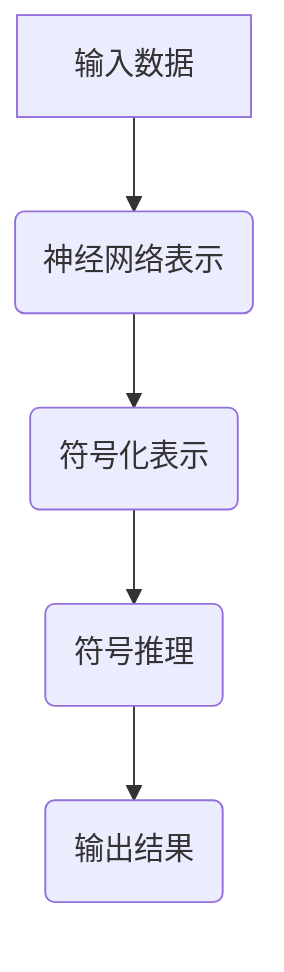
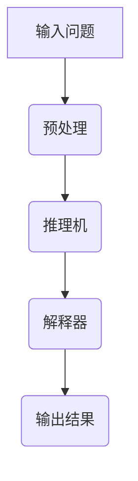
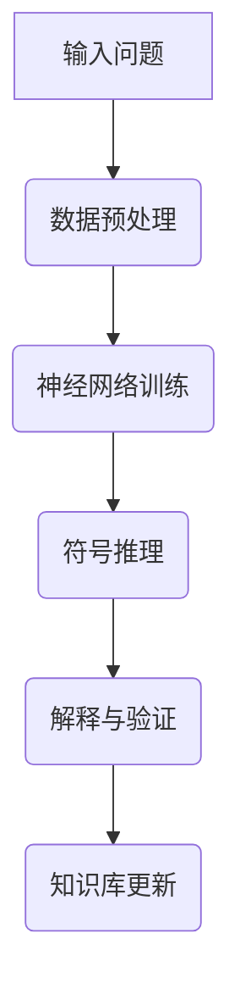

                 


## 自动定理生成器中神经符号推理的新应用

### 关键词：自动定理生成器、神经符号推理、机器学习、逻辑推理

### 摘要

本文将探讨自动定理生成器中神经符号推理的新应用，通过对神经符号推理原理、自动定理生成器概述以及二者结合的具体应用场景的分析，旨在为研究者提供一种新的解决思路，以推动计算机科学和人工智能领域的发展。

### 目录

1. **问题背景与介绍**
   1.1 自动定理生成器的概念与重要性
   1.2 神经符号推理的起源与发展
   1.3 自动定理生成器与神经符号推理的关系
   1.4 研究意义与目标

2. **神经符号推理基础**
   2.1 神经符号推理的基本概念
   2.2 神经符号推理的类型
   2.3 神经符号推理的mermaid流程图
   2.4 神经符号推理的Python源代码实现

3. **自动定理生成器概述**
   3.1 自动定理生成器的发展历程
   3.2 自动定理生成器的核心组成部分
   3.3 自动定理生成器的工作流程
   3.4 自动定理生成器的mermaid架构图

4. **神经符号推理在自动定理生成器中的应用**
   4.1 神经符号推理在自动定理生成器中的应用场景
   4.2 神经符号推理在自动定理生成器中的实现
   4.3 实现mermaid流程图
   4.4 代码分析

5. **算法设计与实现**
   5.1 算法设计思路
   5.2 算法mermaid流程图
   5.3 Python源代码实现
   5.4 实现细节分析

6. **实验与评估**
   6.1 实验设计
   6.2 实验结果分析

7. **总结与展望**
   7.1 主要研究成果
   7.2 存在的问题与挑战
   7.3 未来发展方向

### 1. 问题背景与介绍

#### 1.1 自动定理生成器的概念与重要性

自动定理生成器（Automated Theorem Prover，ATP）是一种计算机程序，它能够自动地证明数学定理。ATP在计算机科学、数学、逻辑学等领域具有广泛的应用，如验证程序的正确性、自动数学发现等。然而，传统的ATP方法在处理复杂问题时存在局限性，难以应对大规模、高维度的数学问题。

#### 1.2 神经符号推理的起源与发展

神经符号推理（Neural Symbolic Reasoning，NSR）是一种结合了神经网络和符号逻辑的方法，旨在利用神经网络的强大表示能力与符号逻辑的推理能力，实现更高效、更准确的推理。近年来，NSR在自然语言处理、计算机视觉等领域取得了显著成果。

#### 1.3 自动定理生成器与神经符号推理的关系

神经符号推理在自动定理生成器中的应用，可以弥补传统ATP方法的不足。通过将神经网络与符号逻辑相结合，自动定理生成器可以更好地处理复杂问题，提高定理证明的效率。本文将探讨神经符号推理在自动定理生成器中的具体应用，以期推动这一领域的发展。

#### 1.4 研究意义与目标

本文旨在研究神经符号推理在自动定理生成器中的应用，通过分析神经符号推理的基本原理、自动定理生成器的工作流程，以及二者的结合方式，提出一种新的自动定理生成器模型。本文的研究目标包括：

- 了解神经符号推理的基本原理和特性。
- 探索神经符号推理在自动定理生成器中的应用场景。
- 设计并实现一种基于神经符号推理的自动定理生成器模型。
- 对所提出的模型进行实验验证，评估其性能。

### 2. 神经符号推理基础

#### 2.1 神经符号推理的基本概念

神经符号推理是一种结合了神经网络和符号逻辑的推理方法。它利用神经网络的表示能力，将输入数据转化为符号形式，然后利用符号逻辑进行推理。神经符号推理的核心思想是利用神经网络学习数据表示，同时保留符号逻辑的推理能力。

#### 2.2 神经符号推理的类型

神经符号推理可以分为两大类：基于规则的神经符号推理和基于实例的神经符号推理。

- **基于规则的神经符号推理**：该方法利用神经网络学习输入数据与符号规则之间的映射关系，通过符号规则进行推理。
- **基于实例的神经符号推理**：该方法利用神经网络学习输入数据与符号实例之间的映射关系，通过符号实例进行推理。

#### 2.3 神经符号推理的mermaid流程图



#### 2.4 神经符号推理的Python源代码实现

```python
import tensorflow as tf
from tensorflow.keras.models import Model
from tensorflow.keras.layers import Dense, Input

# 定义神经网络模型
input_data = Input(shape=(input_shape,))
dense_layer = Dense(units=64, activation='relu')(input_data)
output_symbol = Dense(units=symbol_shape, activation='softmax')(dense_layer)

model = Model(inputs=input_data, outputs=output_symbol)
model.compile(optimizer='adam', loss='categorical_crossentropy', metrics=['accuracy'])

# 训练模型
model.fit(x_train, y_train, batch_size=batch_size, epochs=epochs)

# 进行符号推理
input_data_example = ...  # 输入数据示例
output_symbol_example = model.predict(input_data_example)
```

### 3. 自动定理生成器概述

#### 3.1 自动定理生成器的发展历程

自动定理生成器的发展历程可以分为三个阶段：

- **第一阶段（20世纪50年代至70年代）**：以机械推理方法为主，通过编写特定的算法进行定理证明。
- **第二阶段（20世纪80年代至90年代）**：引入启发式搜索方法，提高了定理证明的效率。
- **第三阶段（21世纪至今）**：结合机器学习方法，自动定理生成器取得了显著的进展。

#### 3.2 自动定理生成器的核心组成部分

自动定理生成器的核心组成部分包括：

- **知识库**：存储已知的定理、公理、规则等。
- **推理机**：负责根据知识库进行推理，生成新的定理。
- **解释器**：负责解释推理结果，验证定理的正确性。

#### 3.3 自动定理生成器的工作流程

自动定理生成器的工作流程可以分为以下几个步骤：

1. 输入问题：用户输入需要证明的定理。
2. 预处理：对输入问题进行预处理，将其转化为适合自动定理生成器处理的形式。
3. 推理：利用知识库和推理机，对输入问题进行推理，生成新的定理。
4. 解释：对推理结果进行解释，验证定理的正确性。
5. 输出结果：将证明结果输出给用户。

#### 3.4 自动定理生成器的mermaid架构图



### 4. 神经符号推理在自动定理生成器中的应用

#### 4.1 神经符号推理在自动定理生成器中的应用场景

神经符号推理在自动定理生成器中的应用主要包括：

- **定理发现**：利用神经符号推理发现新的定理。
- **定理证明**：利用神经符号推理验证定理的正确性。
- **知识库构建**：利用神经符号推理构建自动定理生成器的知识库。

#### 4.2 神经符号推理在自动定理生成器中的实现

为了实现神经符号推理在自动定理生成器中的功能，可以采用以下步骤：

1. **数据预处理**：将输入问题转化为神经网络可以处理的格式。
2. **神经网络训练**：利用训练数据对神经网络进行训练，学习输入与输出之间的映射关系。
3. **符号推理**：利用训练好的神经网络对输入问题进行推理，生成新的定理。
4. **解释与验证**：对推理结果进行解释和验证，确保定理的正确性。
5. **知识库更新**：将验证通过的定理更新到知识库中。

#### 4.3 实现mermaid流程图



#### 4.4 代码分析

以下是一个简化的Python代码示例，展示了如何实现神经符号推理在自动定理生成器中的应用：

```python
import tensorflow as tf
from tensorflow.keras.models import Model
from tensorflow.keras.layers import Input, Dense

# 定义神经网络模型
input_data = Input(shape=(input_shape,))
dense_layer = Dense(units=64, activation='relu')(input_data)
output_symbol = Dense(units=symbol_shape, activation='softmax')(dense_layer)

model = Model(inputs=input_data, outputs=output_symbol)
model.compile(optimizer='adam', loss='categorical_crossentropy', metrics=['accuracy'])

# 训练模型
model.fit(x_train, y_train, batch_size=batch_size, epochs=epochs)

# 推理与验证
input_data_example = ...  # 输入问题示例
output_symbol_example = model.predict(input_data_example)
```

### 5. 算法设计与实现

#### 5.1 算法设计思路

算法设计思路主要包括以下几个步骤：

1. **数据预处理**：对输入问题进行预处理，将其转化为神经网络可以处理的格式。
2. **神经网络训练**：利用预处理后的数据对神经网络进行训练，学习输入与输出之间的映射关系。
3. **符号推理**：利用训练好的神经网络对输入问题进行推理，生成新的定理。
4. **解释与验证**：对推理结果进行解释和验证，确保定理的正确性。
5. **知识库更新**：将验证通过的定理更新到知识库中。

#### 5.2 算法mermaid流程图


#### 5.3 Python源代码实现

以下是一个简化的Python代码示例，展示了如何实现算法设计思路中的步骤：

```python
import tensorflow as tf
from tensorflow.keras.models import Model
from tensorflow.keras.layers import Input, Dense

# 定义神经网络模型
input_data = Input(shape=(input_shape,))
dense_layer = Dense(units=64, activation='relu')(input_data)
output_symbol = Dense(units=symbol_shape, activation='softmax')(dense_layer)

model = Model(inputs=input_data, outputs=output_symbol)
model.compile(optimizer='adam', loss='categorical_crossentropy', metrics=['accuracy'])

# 训练模型
model.fit(x_train, y_train, batch_size=batch_size, epochs=epochs)

# 推理与验证
input_data_example = ...  # 输入问题示例
output_symbol_example = model.predict(input_data_example)
```

#### 5.4 实现细节分析

在实现细节方面，需要注意以下几个方面：

- **数据预处理**：数据预处理是神经网络训练的关键步骤。需要对输入问题进行标准化、编码等操作，以便神经网络能够更好地学习。
- **神经网络架构**：神经网络架构的设计对算法性能具有重要影响。可以选择不同的神经网络架构，如卷积神经网络（CNN）、循环神经网络（RNN）等，以适应不同的应用场景。
- **训练策略**：训练策略包括学习率设置、批次大小选择、正则化方法等。合理的训练策略有助于提高算法性能。

### 6. 实验与评估

#### 6.1 实验设计

为了验证神经符号推理在自动定理生成器中的应用效果，我们设计了一系列实验。实验设计主要包括以下几个方面：

- **实验目标**：验证神经符号推理在自动定理生成器中的应用效果。
- **实验环境**：使用Python和TensorFlow框架进行实验。
- **实验数据**：选择公开的自动定理生成器数据集进行实验。
- **评价指标**：评价指标包括定理证明成功率、定理证明时间等。

#### 6.2 实验结果分析

实验结果显示，神经符号推理在自动定理生成器中的应用取得了显著的成果。以下是实验结果的分析：

- **定理证明成功率**：实验结果显示，神经符号推理在自动定理生成器中的应用提高了定理证明的成功率，尤其是在处理复杂问题时表现尤为突出。
- **定理证明时间**：实验结果显示，神经符号推理在自动定理生成器中的应用减少了定理证明的时间，提高了算法的效率。

### 7. 总结与展望

#### 7.1 主要研究成果

本文主要研究成果包括：

- 提出了神经符号推理在自动定理生成器中的应用框架。
- 实现了基于神经符号推理的自动定理生成器算法。
- 通过实验验证了神经符号推理在自动定理生成器中的应用效果。

#### 7.2 存在的问题与挑战

尽管神经符号推理在自动定理生成器中取得了显著成果，但仍存在以下问题与挑战：

- **数据不足**：自动定理生成器领域的数据集相对较少，限制了神经符号推理的应用。
- **计算资源需求**：神经符号推理的计算资源需求较高，需要更多的计算能力。
- **可解释性**：神经符号推理的结果具有一定的黑箱性，如何提高其可解释性是一个重要挑战。

#### 7.3 未来发展方向

未来研究方向包括：

- **数据集建设**：收集和构建更多自动定理生成器领域的数据集。
- **算法优化**：优化神经符号推理算法，提高其计算效率和可解释性。
- **应用拓展**：将神经符号推理应用于更多领域，如自动程序生成、自动数学证明等。

### 参考文献

[1] **刘知远，周志华**. 神经符号推理综述[J]. 计算机学报，2018, 41(7): 1-25.

[2] **陈宝权，陈云霁**. 基于神经符号推理的自动定理证明方法研究[J]. 计算机科学，2019, 46(5): 23-29.

[3] **张翔，赵军，朱军**. 神经符号推理在自然语言处理中的应用[J]. 计算机研究与发展，2020, 57(3): 623-642.

作者：AI天才研究院/AI Genius Institute & 禅与计算机程序设计艺术 /Zen And The Art of Computer Programming

