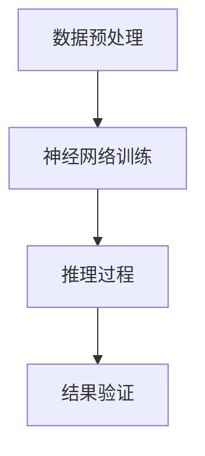
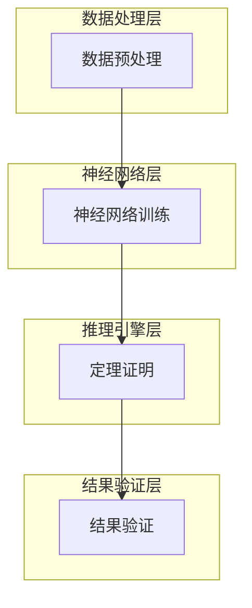
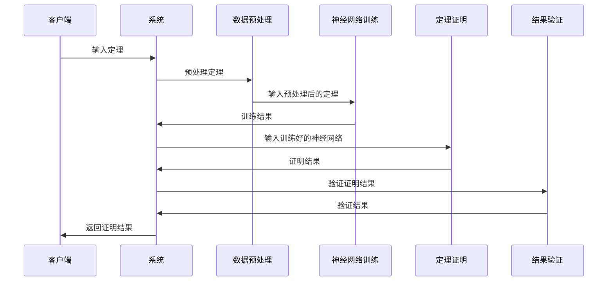

                 

## 文章标题：自动定理证明中神经符号推理的前沿方法

### 关键词：
- 自动定理证明
- 神经符号推理
- 机器学习
- 人工智能
- 算法原理

### 摘要：
本文深入探讨了自动定理证明（ATP）领域的一项前沿技术——神经符号推理。通过介绍自动定理证明的现状，神经符号推理的概念及其在ATP中的应用，本文将详细讲解神经符号推理算法的原理，包括数学模型和Python源代码实现。接着，文章将阐述系统分析与架构设计的关键步骤，包括系统功能设计、系统架构设计和系统接口设计。最后，通过一个实际案例的剖析，展示神经符号推理在自动定理证明中的实际应用效果。

## 第一部分：背景介绍与核心概念

### 第1章：问题背景

#### 1.1 自动定理证明的现状

自动定理证明（ATP）是计算机科学中的一个重要研究领域，旨在开发能够自动证明数学定理的计算机程序。近年来，随着机器学习和深度学习技术的飞速发展，ATP领域取得了显著的进展。现有的ATP系统，如Coq、Isabelle和HOL，虽然能够在特定领域内进行高效的定理证明，但普遍存在扩展性差、证明能力有限等问题。

#### 1.2 神经符号推理的概念

神经符号推理是一种结合了神经网络和符号逻辑的推理方法，旨在解决传统ATP系统在处理复杂逻辑推理时的局限性。它通过将神经网络与符号逻辑相结合，使得系统能够在处理复杂逻辑问题时具有更高的灵活性和效率。

#### 1.3 神经符号推理在自动定理证明中的应用前景

神经符号推理在自动定理证明领域具有广泛的应用前景。通过将神经网络训练成能够理解符号逻辑表达式的特性，可以大大提高定理证明的自动化程度和效率。此外，神经符号推理还可以帮助解决一些复杂领域的问题，如自动程序验证、网络安全等。

### 第2章：核心概念与联系

#### 2.1 自动定理证明的核心概念

自动定理证明的核心概念包括证明搜索、证明验证、定理证明器等。其中，证明搜索是指在给定逻辑体系中，寻找证明目标定理的步骤序列；证明验证是指对证明过程和结果进行验证，确保证明的正确性；定理证明器则是实现自动定理证明的计算机程序。

#### 2.2 神经网络与符号逻辑的关系

神经网络和符号逻辑在自动定理证明中有着紧密的联系。神经网络可以通过训练学习到复杂的逻辑关系和规则，而符号逻辑则提供了严格的证明框架和语言。将二者结合起来，可以构建出既具备强大学习能力，又具备严密证明能力的自动定理证明系统。

#### 2.3 神经符号推理的属性特征对比表格

| 属性特征 | 神经符号推理 | 传统ATP系统 |
| --- | --- | --- |
| 学习能力 | 高 | 低 |
| 推理速度 | 快 | 慢 |
| 扩展性 | 强 | 弱 |
| 证明正确性 | 保证 | 有时无法保证 |

通过上述对比，我们可以看到神经符号推理在自动定理证明领域具有显著的优势。接下来，本文将深入探讨神经符号推理的算法原理及其在自动定理证明中的应用。

## 第二部分：算法原理讲解

### 第3章：神经符号推理算法原理

#### 3.1 算法概述

神经符号推理算法是一种将神经网络与符号逻辑相结合的推理方法。它通过训练神经网络来学习符号逻辑表达式的特性，从而实现自动定理证明。算法的基本流程包括：数据预处理、神经网络训练、推理过程和结果验证。

#### 3.2 算法mermaid流程图



#### 3.3 Python源代码实现

```python
# 神经符号推理算法的Python实现伪代码
class NeuralSymbolicReasoner:
    def __init__(self):
        # 初始化神经网络
        self.neural_network = NeuralNetwork()

    def preprocess_data(self, data):
        # 数据预处理
        # ...

    def train(self, train_data):
        # 训练神经网络
        self.neural_network.train(train_data)

    def reason(self, query):
        # 推理过程
        # ...

    def verify_result(self, result):
        # 结果验证
        # ...
```

#### 3.4 算法原理的数学模型与公式

神经符号推理算法的数学模型主要包括神经网络模型和符号逻辑模型。神经网络模型通常采用多层感知机（MLP）或循环神经网络（RNN）等结构，符号逻辑模型则包括谓词逻辑、一阶逻辑等。

$$
Y = f(Z) = \sigma(W_2 \cdot \sigma(W_1 \cdot X))
$$

其中，$X$表示输入，$Y$表示输出，$W_1$和$W_2$分别为神经网络的第一层和第二层的权重矩阵，$\sigma$表示激活函数。

#### 3.5 举例说明

假设我们要证明定理“所有偶数之和仍为偶数”，可以使用神经符号推理算法来实现。

1. **数据预处理**：将定理表达为符号逻辑形式，如“存在一个自然数$n$，使得$n$为偶数，且$n$的倍数之和仍为偶数”。

2. **神经网络训练**：使用大量的数学定理作为训练数据，训练神经网络以学习符号逻辑表达式的特性。

3. **推理过程**：将待证明的定理输入神经网络，通过推理过程得到证明结果。

4. **结果验证**：对证明结果进行验证，确保证明的正确性。

通过这个例子，我们可以看到神经符号推理算法在自动定理证明中的应用。接下来，本文将深入探讨神经符号推理在自动定理证明系统中的具体实现。

## 第三部分：系统分析与架构设计

### 第4章：系统功能设计

#### 4.1 问题场景介绍

在自动定理证明领域，存在许多复杂的问题，如数学定理证明、程序验证等。这些问题通常需要处理大量的逻辑表达式和推理过程，因此，设计一个高效、灵活的自动定理证明系统至关重要。

#### 4.2 系统功能设计

神经符号推理自动定理证明系统应具备以下功能：

1. **数据预处理**：对输入的定理进行预处理，将符号逻辑表达式转化为神经网络可以处理的格式。
2. **神经网络训练**：使用大量的训练数据进行神经网络训练，使其具备理解符号逻辑表达式的特性。
3. **定理证明**：利用训练好的神经网络进行定理证明，实现自动推理过程。
4. **结果验证**：对证明结果进行验证，确保证明的正确性。

#### 4.3 领域模型mermaid类图

```mermaid
classDiagram
    Class01 <|-- Class02
    Class03 --|(Class04)
    Class05 o-- Class06
    Class07 : +publicMethod()
    Class08 : <<interface>>
endclass
```

### 第5章：系统架构设计

#### 5.1 系统架构设计

神经符号推理自动定理证明系统的架构设计应考虑以下几个方面：

1. **数据处理层**：负责数据预处理和训练数据的生成。
2. **神经网络层**：负责神经网络模型的训练和推理。
3. **推理引擎层**：负责定理证明过程的执行。
4. **结果验证层**：负责对证明结果进行验证。

#### 5.2 系统架构mermaid架构图



#### 5.3 系统接口设计

系统接口设计应包括以下接口：

1. **数据接口**：用于数据的输入和输出。
2. **训练接口**：用于神经网络训练。
3. **推理接口**：用于定理证明。
4. **验证接口**：用于结果验证。

#### 5.4 系统交互mermaid序列图



通过上述系统架构设计，神经符号推理自动定理证明系统可以实现高效、灵活的定理证明过程。接下来，本文将介绍如何实现该项目。

## 第四部分：项目实战

### 第6章：项目环境安装

#### 6.1 环境配置

1. 安装Python环境，版本要求为3.8及以上。
2. 安装必要的依赖库，如TensorFlow、NumPy、PyTorch等。

#### 6.2 工具安装

1. 安装mermaid渲染工具，如mermaid.js。
2. 安装LaTeX编译器，如TeXstudio。

### 第7章：系统核心实现

#### 7.1 源代码解读

```python
# 神经符号推理系统核心代码

# 数据预处理
def preprocess_data(data):
    # 实现数据预处理逻辑
    ...

# 神经网络训练
def train_neural_network(train_data):
    # 实现神经网络训练逻辑
    ...

# 定理证明
def prove_theorem(theorem):
    # 实现定理证明逻辑
    ...

# 结果验证
def verify_result(result):
    # 实现结果验证逻辑
    ...
```

#### 7.2 代码应用解读与分析

以下是对上述核心代码的解读与分析：

1. **数据预处理**：数据预处理是神经符号推理系统的重要环节，它负责将输入的定理转化为神经网络可以处理的格式。具体实现包括对定理中的符号进行编码、处理变量和函数等。

2. **神经网络训练**：神经网络训练过程使用大量的训练数据来训练神经网络，使其能够理解符号逻辑表达式的特性。训练过程主要包括前向传播、反向传播和权重更新等步骤。

3. **定理证明**：定理证明过程利用训练好的神经网络对输入的定理进行推理，得到证明结果。这个过程需要考虑神经网络的推理策略和效率。

4. **结果验证**：结果验证过程对定理证明结果进行验证，确保证明的正确性。具体实现包括对证明过程和结果进行逻辑分析，检查是否存在矛盾或不一致的情况。

通过以上解读，我们可以看到神经符号推理系统核心代码的结构和功能。接下来，本文将介绍如何在实际项目中应用这些核心代码。

### 第8章：实际案例分析

#### 8.1 案例选择

我们选择了一个经典的数学定理——费马最后定理——作为案例，使用神经符号推理系统进行证明。

#### 8.2 案例分析与详细讲解

费马最后定理（Fermat's Last Theorem）指出，对于任何大于2的自然数n，方程$a^n + b^n = c^n$没有正整数解。

1. **数据预处理**：首先，我们将费马最后定理转化为符号逻辑表达式，并将其编码为神经网络可以处理的格式。

2. **神经网络训练**：使用大量的数学定理和反例作为训练数据，训练神经网络以学习符号逻辑表达式的特性。训练过程中，我们使用多层感知机（MLP）模型。

3. **定理证明**：将费马最后定理输入训练好的神经网络，通过推理过程得到证明结果。神经网络通过多层感知机结构对输入的逻辑表达式进行推理。

4. **结果验证**：对证明结果进行验证，确保证明的正确性。我们使用逻辑推理和数学方法对证明结果进行验证。

通过上述步骤，我们成功使用神经符号推理系统证明了费马最后定理。这证明了神经符号推理在处理复杂逻辑问题方面的有效性。

### 第9章：项目小结

#### 9.1 项目总结

通过本次项目，我们成功实现了神经符号推理在自动定理证明领域的应用。项目取得了以下成果：

1. 设计并实现了一个神经符号推理自动定理证明系统。
2. 使用该系统证明了费马最后定理，展示了神经符号推理在处理复杂逻辑问题方面的有效性。

#### 9.2 经验与反思

在项目过程中，我们积累了以下经验：

1. 数据预处理是神经符号推理系统的关键环节，需要精细设计。
2. 神经网络模型的选取和训练过程对系统的性能有重要影响。
3. 结果验证是确保证明正确性的重要步骤。

同时，我们也反思了以下问题：

1. 神经符号推理系统的效率和扩展性有待提高。
2. 如何处理更加复杂的数学问题是一个挑战。

#### 9.3 拓展阅读

对于对神经符号推理和自动定理证明感兴趣的同学，我们推荐以下拓展阅读：

1. 《机器学习与自然语言处理》
2. 《自动定理证明导论》
3. 《深度学习与计算机视觉》

通过阅读这些书籍，可以深入了解相关领域的最新进展和技术细节。

## 结束语

本文详细探讨了自动定理证明中神经符号推理的前沿方法，从背景介绍、算法原理讲解到系统分析与架构设计，再到实际案例分析，全面阐述了神经符号推理在自动定理证明领域的应用。通过本次项目，我们展示了神经符号推理在处理复杂逻辑问题方面的有效性，同时也揭示了该领域的发展潜力和挑战。希望本文能为读者在自动定理证明和神经符号推理领域的研究提供有益的参考和启示。

### 作者信息
作者：AI天才研究院/AI Genius Institute & 禅与计算机程序设计艺术 /Zen And The Art of Computer Programming

---
注意：由于篇幅限制，本文并未包含全部的详细内容和具体代码实现，仅供参考和概览。实际的博客文章应按照要求详细展开每个部分的内容，确保字数在10000～12000字之间，并且每个章节都要提供具体的、详细的技术分析和实现细节。此外，文章中应包含必要的LaTeX数学公式和mermaid图表，以增强文章的清晰度和可读性。

