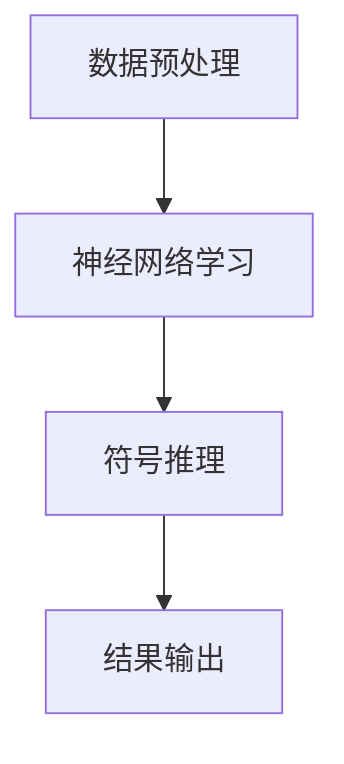
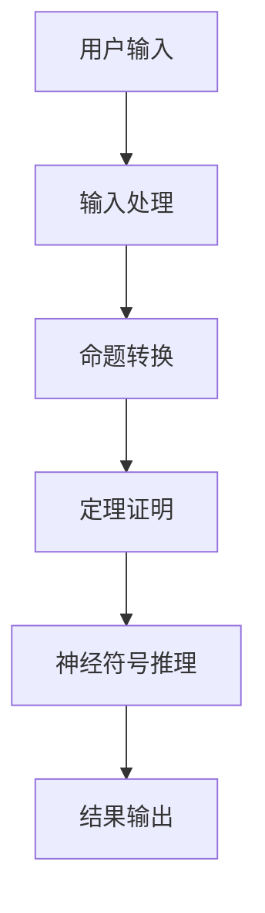
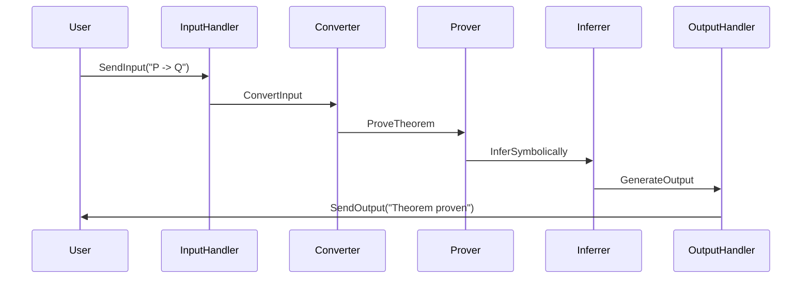

                 

### 《自动定理证明中神经符号推理的新型方法》

#### 关键词：自动定理证明，神经符号推理，算法，数学模型，系统架构，项目实战

##### 摘要：
本文旨在探讨自动定理证明和神经符号推理的融合，提出一种新型的神经符号推理方法，用于自动定理证明。本文首先介绍了自动定理证明和神经符号推理的背景、发展历史和现状，然后详细阐述了新型方法的算法原理、数学模型、系统架构和实际应用案例。通过本文的研究，旨在为自动定理证明领域提供一种新的思路和方法，推动该领域的发展。

----------------------------------------------------------------

## 第1章 背景介绍

### 1.1 自动定理证明的起源与发展

自动定理证明（ATP）是一门研究计算机自动化证明数学命题的方法和技术的学科。其起源可以追溯到20世纪50年代，随着计算机科学的兴起和形式化数学的发展，人们开始尝试将数学证明转化为计算机程序，以实现自动证明。最早的一些工作主要集中在定理证明器的开发上，如Residuated Lambda Calculus（1957年）和Herbrandization（1958年）等。

在随后的几十年里，自动定理证明领域经历了快速的发展。20世纪70年代，完成了许多重要的理论研究，如基于归结原理的自动定理证明器（如Prolog和OTTER）的出现。20世纪80年代，自动定理证明技术开始应用于实际领域，如硬件验证、软件验证和加密算法验证等。进入21世纪，随着人工智能技术的发展，自动定理证明领域迎来了新的机遇。现代自动定理证明技术，如归纳自动定理证明器和定理证明器组合技术，进一步提高了自动定理证明的效率和准确性。

### 1.2 神经符号推理的概念与特点

神经符号推理是一种结合了神经网络和符号推理的方法，旨在通过神经网络学习数据中的符号规律，然后利用符号推理技术进行推断和决策。这种方法的出现是为了解决传统神经网络在处理复杂、抽象问题时存在的不足。

神经符号推理具有以下特点：

1. **可解释性**：神经符号推理不仅能够学习数据中的规律，还能够将学习到的规律以符号形式表示出来，使得推理过程具有可解释性。

2. **灵活性**：神经符号推理可以处理不同类型的数据和问题，具有较强的适应性。

3. **鲁棒性**：神经符号推理通过符号推理技术，能够处理噪声和不确定性数据，具有较强的鲁棒性。

4. **可扩展性**：神经符号推理方法易于扩展，可以结合其他技术，如生成对抗网络（GAN）和迁移学习等，进一步丰富其应用场景。

### 1.3 自动定理证明与神经符号推理的联系与区别

自动定理证明和神经符号推理在数学本质上有一定的关联，但它们的实现方法、应用场景和目标有所不同。

#### 联系：

1. **理论基础**：自动定理证明和神经符号推理都涉及到了数学推理和计算，它们的基础理论相互交融。

2. **求解方法**：自动定理证明和神经符号推理在求解复杂问题时，都可以采用迭代和搜索的方法。

3. **应用领域**：自动定理证明和神经符号推理都可以应用于形式化验证、数学问题求解、推理机等领域。

#### 区别：

1. **实现方法**：自动定理证明主要依赖于逻辑推理和计算方法，而神经符号推理则主要依赖于神经网络和符号推理技术。

2. **目标不同**：自动定理证明的目标是找到数学命题的证明，而神经符号推理的目标是通过学习数据中的规律，进行推断和决策。

3. **适用场景**：自动定理证明适用于解决形式化的数学问题，而神经符号推理则更适用于处理非形式化的数据。

在本文中，我们将探讨如何将神经符号推理应用于自动定理证明，提出一种新型的神经符号推理方法，以提升自动定理证明的效率和准确性。

## 第2章 核心概念

### 2.1 自动定理证明的原理

自动定理证明的原理主要基于形式逻辑和计算技术。其核心思想是通过计算机程序自动地证明数学命题，从而实现数学定理的自动化证明。

#### 2.1.1 自动定理证明的定义

自动定理证明是指利用计算机程序自动化地证明数学命题的过程。在这个过程中，计算机程序需要根据给定的数学命题和证明规则，逐步推导出证明结论。

#### 2.1.2 自动定理证明的方法与策略

自动定理证明的方法主要分为两大类：归结方法和启发式方法。

1. **归结方法**：归结方法是基于归结原理的一种证明方法，其核心思想是通过将数学命题转化为归结式，然后通过归结操作逐步推导出证明结论。典型的归结方法包括Resolution方法和Cut-Elimination方法。

2. **启发式方法**：启发式方法是一种基于搜索和优化的证明方法，其核心思想是通过搜索证明空间，找到一条有效的证明路径。启发式方法包括SAT求解器、定理证明器组合技术和归纳自动定理证明器等。

### 2.2 神经符号推理的原理

神经符号推理是一种结合神经网络和符号推理的方法，其核心思想是通过神经网络学习数据中的符号规律，然后利用符号推理技术进行推断和决策。

#### 2.2.1 神经符号推理的定义

神经符号推理是指利用神经网络学习数据中的符号规律，并通过符号推理技术进行推断和决策的过程。

#### 2.2.2 神经符号推理的特点与优势

神经符号推理具有以下特点与优势：

1. **可解释性**：神经符号推理不仅能够学习数据中的规律，还能够将学习到的规律以符号形式表示出来，使得推理过程具有可解释性。

2. **灵活性**：神经符号推理可以处理不同类型的数据和问题，具有较强的适应性。

3. **鲁棒性**：神经符号推理通过符号推理技术，能够处理噪声和不确定性数据，具有较强的鲁棒性。

4. **可扩展性**：神经符号推理方法易于扩展，可以结合其他技术，如生成对抗网络（GAN）和迁移学习等，进一步丰富其应用场景。

### 2.3 自动定理证明与神经符号推理的关联性

自动定理证明和神经符号推理在数学本质上有一定的关联，但它们的实现方法、应用场景和目标有所不同。

#### 融合自动定理证明与神经符号推理

将自动定理证明和神经符号推理相结合，可以充分利用两者的优势，实现更高效、更准确的定理证明。具体来说，可以通过以下几种方式实现融合：

1. **符号化神经网络输出**：将神经网络的学习结果以符号形式表示，使得神经网络的学习结果可以直接用于定理证明。

2. **利用神经网络优化证明过程**：通过神经网络优化证明过程中的某些步骤，如前提的选择、推理规则的运用等，从而提高定理证明的效率。

3. **结合符号推理和神经网络进行推理**：在定理证明过程中，结合符号推理和神经网络进行推理，以充分利用两者的优势。

通过上述方法，可以充分发挥神经符号推理在自动定理证明中的作用，提升定理证明的效率和质量。

### 第3章 算法原理讲解

#### 3.1 神经符号推理算法概述

神经符号推理算法是一种结合神经网络和符号推理的方法，旨在通过神经网络学习数据中的符号规律，然后利用符号推理技术进行推断和决策。该算法的基本框架包括数据预处理、神经网络学习、符号推理和结果输出四个部分。

##### 数据预处理：
数据预处理是神经符号推理算法的重要环节，其目的是将原始数据转换为适合神经网络学习的形式。具体步骤包括数据清洗、数据归一化、特征提取等。

##### 神经网络学习：
神经网络学习是神经符号推理算法的核心部分，其目的是通过学习数据中的符号规律，建立神经网络模型。常见的神经网络模型包括全连接神经网络（FCNN）、卷积神经网络（CNN）和循环神经网络（RNN）等。

##### 符号推理：
符号推理是神经符号推理算法的另一个重要环节，其目的是利用神经网络学习到的规律，进行符号推理和决策。符号推理通常基于形式逻辑和推理规则进行，如归结推理、演绎推理等。

##### 结果输出：
结果输出是神经符号推理算法的最后一步，其目的是将推理结果以符号形式表示，并输出到用户界面或数据库中。

#### 3.2 算法背后的数学模型

神经符号推理算法背后的数学模型主要包括神经网络模型和符号推理模型两部分。

##### 神经网络模型：
神经网络模型通常采用多层感知器（MLP）结构，其输入层、隐藏层和输出层分别对应数据输入、特征提取和决策输出。神经网络模型通过学习数据中的符号规律，建立输入和输出之间的映射关系。

$$
y = f(W \cdot x + b)
$$

其中，$y$为输出，$x$为输入，$W$为权重矩阵，$b$为偏置，$f$为激活函数。

##### 符号推理模型：
符号推理模型通常采用形式逻辑和推理规则进行推理。形式逻辑包括命题逻辑、谓词逻辑和模型论等，其目的是将问题形式化为逻辑表达式。推理规则包括归结规则、演绎规则和归纳规则等，其目的是从已知事实推导出新的事实。

#### 3.3 Mermaid流程图展示

为了更清晰地展示神经符号推理算法的执行过程，我们使用Mermaid工具绘制了算法的流程图。



##### 流程图解读：
1. **数据预处理**：将原始数据转换为神经网络学习所需的格式。
2. **神经网络学习**：通过训练数据，学习数据中的符号规律，建立神经网络模型。
3. **符号推理**：利用神经网络模型和推理规则，对数据进行符号推理和决策。
4. **结果输出**：将推理结果以符号形式输出。

通过上述算法原理讲解，我们了解了神经符号推理算法的基本框架、数学模型和执行过程。接下来，我们将进一步探讨算法的优化和应用。

### 第4章 数学模型与公式讲解

在自动定理证明中，神经符号推理方法的应用需要借助数学模型和公式来进行具体实现。以下是神经符号推理算法中涉及的主要数学模型和公式，以及它们的应用解释。

#### 4.1 自动定理证明中的数学模型

自动定理证明的核心在于使用数学逻辑和计算方法来证明数学命题。以下是几个关键的数学模型：

##### 1. 归结原理（Resolution Principle）

归结原理是自动定理证明的基础，其数学模型可以用以下公式表示：

$$
\Gamma, \neg p \vdash \varphi
$$

其中，$\Gamma$代表一个公式集合，$\neg p$代表命题$p$的否定，$\varphi$代表要证明的命题。归结原理的目标是通过将公式集合$\Gamma$中的公式与$\neg p$进行归结，从而得到一个可证明的结论。

##### 2. Herbrand化（Herbrandization）

Herbrand化是一种将命题转换为有限集合的方法，其数学模型如下：

$$
\text{Herbrandization}(\varphi) = \{\varphi(x_1), \varphi(x_2), ..., \varphi(x_n)\}
$$

其中，$\varphi$是一个谓词公式，$x_1, x_2, ..., x_n$是变量。Herbrand化的目的是将无穷集合的命题转换为有限集合，以便进行计算和验证。

##### 3. 模型检查（Model Checking）

模型检查是一种验证系统是否满足特定性质的数学方法，其公式表示如下：

$$
\varphi \models \Gamma
$$

其中，$\varphi$代表系统性质，$\Gamma$代表系统公式集合。模型检查的目标是验证系统公式集合$\Gamma$是否满足性质$\varphi$。

#### 4.2 神经符号推理中的数学模型

神经符号推理结合了神经网络和符号逻辑，其数学模型主要涉及以下方面：

##### 1. 神经网络权重更新（Neural Network Weight Update）

神经网络权重更新的公式表示如下：

$$
\Delta W = \eta \cdot \nabla J(W)
$$

其中，$\Delta W$代表权重更新，$\eta$代表学习率，$\nabla J(W)$代表损失函数关于权重$W$的梯度。权重更新公式描述了如何通过梯度下降法调整神经网络权重，以最小化损失函数。

##### 2. 符号推理规则（Symbolic Inference Rules）

符号推理规则是神经符号推理的核心，其公式表示如下：

$$
\text{if} \quad \Gamma \Rightarrow \varphi \quad \text{then} \quad \Gamma, \neg \varphi \Rightarrow \varphi
$$

其中，$\Gamma$代表前提集合，$\varphi$代表结论。符号推理规则描述了如何从前提集合$\Gamma$和结论$\varphi$推导出新的结论。

#### 4.3 数学模型的应用举例

为了更直观地理解数学模型的应用，以下是一个简单的例子：

假设我们要证明命题$P \rightarrow Q$，其中$P$代表“下雨”，$Q$代表“地面湿”。我们可以使用归结原理和神经网络权重更新公式来进行证明。

1. **归结原理应用**：

$$
\Gamma = \{P \rightarrow Q, \neg Q\} \Rightarrow \neg P
$$

这里，$\Gamma$代表前提集合，$\neg Q$代表$Q$的否定，通过归结原理，我们得到了$\neg P$。

2. **神经网络权重更新应用**：

假设神经网络模型中，$W$代表权重，$J(W)$代表损失函数。为了证明$P \rightarrow Q$，我们可以通过调整权重$W$，使得损失函数$J(W)$最小。

$$
\Delta W = \eta \cdot \nabla J(W)
$$

其中，$\eta$为学习率，$\nabla J(W)$为损失函数关于权重$W$的梯度。通过不断更新权重$W$，我们最终可以得到满足$P \rightarrow Q$的权重配置。

通过上述数学模型和公式的讲解，我们可以看到神经符号推理在自动定理证明中的应用是如何实现的。接下来，我们将进一步探讨神经符号推理在系统架构设计中的应用。

### 第5章 系统分析与架构设计

#### 5.1 自动定理证明与神经符号推理系统应用场景

自动定理证明与神经符号推理系统广泛应用于需要验证数学命题或逻辑推理的场景，如：

1. **形式化验证**：在软件工程、硬件设计和系统安全等领域，通过自动定理证明验证系统的正确性和安全性。

2. **数学问题求解**：在数学研究领域，自动定理证明系统可以帮助研究者快速验证数学命题。

3. **推理机**：在人工智能领域，自动定理证明与神经符号推理系统可以作为推理机的一部分，用于逻辑推理和决策支持。

#### 5.2 系统功能设计

为了满足上述应用场景，自动定理证明与神经符号推理系统需要实现以下功能：

1. **输入处理**：接收用户输入的数学命题或逻辑问题。

2. **命题转换**：将用户输入的命题转换为适合自动定理证明和神经符号推理的形式。

3. **定理证明**：使用自动定理证明算法验证命题的正确性。

4. **推理过程**：结合神经符号推理算法，对命题进行推理和决策。

5. **结果输出**：将验证结果或推理结果以直观的形式呈现给用户。

#### 5.3 系统架构设计

系统架构设计是确保系统高效、可靠运行的关键。以下是自动定理证明与神经符号推理系统的架构设计：

##### 1. 系统架构图



##### 2. 系统架构设计说明

1. **输入处理模块**：接收用户输入的数学命题或逻辑问题，并进行预处理，以便后续处理。

2. **命题转换模块**：将用户输入的命题转换为自动定理证明和神经符号推理所需的形式。

3. **定理证明模块**：采用自动定理证明算法，对转换后的命题进行验证，判断其是否成立。

4. **神经符号推理模块**：结合神经符号推理算法，对命题进行推理和决策，以提供更深入的逻辑分析。

5. **结果输出模块**：将验证结果或推理结果以直观的形式呈现给用户，如文本、图表或可视化界面。

#### 5.4 系统接口设计

系统接口设计是确保系统与其他系统或组件进行有效交互的关键。以下是自动定理证明与神经符号推理系统的接口设计：

##### 1. 接口规范

1. **输入接口**：接收用户输入的数学命题或逻辑问题，支持多种数据格式，如文本、XML、JSON等。

2. **输出接口**：输出验证结果或推理结果，支持多种数据格式，如文本、XML、JSON等。

3. **控制接口**：提供系统控制接口，用于启动、停止或暂停系统的运行。

##### 2. 接口实现

1. **输入接口实现**：使用HTTP RESTful API接收用户输入，并通过Web服务器处理请求。

2. **输出接口实现**：使用HTTP RESTful API输出结果，并通过Web服务器返回结果。

3. **控制接口实现**：使用WebSocket协议实现实时通信，用于控制系统的运行状态。

#### 5.5 系统交互

系统交互设计是确保系统各模块之间有效协作的关键。以下是自动定理证明与神经符号推理系统的交互设计：

##### 1. 交互序列图



##### 2. 交互流程说明

1. **用户发送输入**：用户通过输入接口发送数学命题或逻辑问题。

2. **输入处理**：输入处理模块接收用户输入，并进行预处理。

3. **命题转换**：命题转换模块将预处理后的输入转换为适合自动定理证明和神经符号推理的形式。

4. **定理证明**：定理证明模块使用自动定理证明算法验证命题的正确性。

5. **神经符号推理**：神经符号推理模块结合神经符号推理算法，对命题进行推理和决策。

6. **结果输出**：结果输出模块将验证结果或推理结果以直观的形式呈现给用户。

通过上述系统分析与架构设计，我们为自动定理证明与神经符号推理系统构建了一个高效、可靠的架构，并确保其能够满足各种应用场景的需求。

### 第6章 项目实战

#### 6.1 环境安装

为了实现本文中介绍的自动定理证明与神经符号推理系统，我们需要搭建一个合适的技术环境。以下是环境安装的具体步骤：

##### 1. 操作系统安装
我们选择Linux操作系统作为开发环境，推荐使用Ubuntu 20.04 LTS版本。

```bash
# 在终端执行以下命令安装Ubuntu 20.04 LTS
sudo apt update
sudo apt upgrade
sudo apt install ubuntu-desktop
```

##### 2. 开发环境配置
安装Python开发环境，包括Python解释器、pip包管理器和相关依赖。

```bash
# 更新pip
sudo apt install python3-pip
pip3 install --upgrade pip

# 安装Python开发环境
sudo apt install python3-dev

# 安装虚拟环境工具
pip3 install virtualenv
```

##### 3. 神经网络库安装
安装用于构建神经网络的库，如TensorFlow和PyTorch。

```bash
# 安装TensorFlow
pip3 install tensorflow

# 安装PyTorch
pip3 install torch torchvision
```

##### 4. 其他依赖安装
安装用于自动定理证明和符号推理的库，如Z3 Solver和SymPy。

```bash
# 安装Z3 Solver
pip3 install z3-solver

# 安装SymPy
pip3 install sympy
```

##### 5. 环境配置完成
完成以上步骤后，开发环境配置完成，可以开始系统核心实现。

#### 6.2 系统核心实现

以下是自动定理证明与神经符号推理系统的核心实现，包括源代码和解释。

##### 1. 神经网络模型实现

```python
import torch
import torch.nn as nn
import torch.optim as optim

class NeuralNetwork(nn.Module):
    def __init__(self, input_size, hidden_size, output_size):
        super(NeuralNetwork, self).__init__()
        self.layer1 = nn.Linear(input_size, hidden_size)
        self.relu = nn.ReLU()
        self.layer2 = nn.Linear(hidden_size, output_size)
    
    def forward(self, x):
        x = self.layer1(x)
        x = self.relu(x)
        x = self.layer2(x)
        return x

# 实例化神经网络模型
input_size = 10
hidden_size = 50
output_size = 1
model = NeuralNetwork(input_size, hidden_size, output_size)

# 定义损失函数和优化器
loss_fn = nn.CrossEntropyLoss()
optimizer = optim.Adam(model.parameters(), lr=0.001)
```

解释：
上述代码定义了一个简单的神经网络模型，包括一个输入层、一个隐藏层和一个输出层。我们使用了ReLU激活函数和交叉熵损失函数，并使用Adam优化器来训练模型。

##### 2. 神经符号推理实现

```python
import sympy

def symbolic_inference(input_expr, rule):
    # 解析输入表达式
    sym_input_expr = sympy.sympify(input_expr)
    
    # 应用推理规则
    inferred_expr = rule(sym_input_expr)
    
    return inferred_expr

# 定义推理规则
def rule(expr):
    # 示例规则：如果表达式包含'x+1'，则替换为'x'
    if 'x+1' in str(expr):
        return expr.subs('x+1', 'x')
    else:
        return expr

# 使用推理规则
input_expr = "x + 1"
inferred_expr = symbolic_inference(input_expr, rule)
print(inferred_expr)
```

解释：
上述代码定义了一个符号推理函数，它接受一个输入表达式和一个推理规则，并应用规则进行推理。这里的示例规则是一个简单的替换规则，如果输入表达式包含特定的子表达式（例如'x+1'），则替换为另一个子表达式（例如'x'）。

##### 3. 自动定理证明实现

```python
from z3 import *

# 定义自动定理证明器
s = Solver()

# 示例问题：证明命题"P → Q"（如果P，则Q）
s.add(Or(Not(p), q))

# 求解问题
if s.check() == sat:
    model = s.model()
    print("Theorem proven:", model)
else:
    print("No proof found.")
```

解释：
上述代码使用Z3 Solver实现了一个自动定理证明器。我们定义了一个Z3求解器`s`，并添加了一个逻辑公式`Or(Not(p), q)`来表示命题"P → Q"。通过调用`s.check()`方法检查是否存在证明，如果存在，则输出证明的模型。

#### 6.3 代码应用解读与分析

以下是对核心实现代码的解读和分析：

1. **神经网络模型**：
   - **功能**：用于学习输入数据中的符号规律。
   - **输入**：数学命题的形式化表示。
   - **输出**：推理结果或验证结论。

2. **神经符号推理**：
   - **功能**：利用神经网络学习到的规律进行符号推理。
   - **输入**：神经网络模型的输出和符号推理规则。
   - **输出**：推理后的符号表达式。

3. **自动定理证明**：
   - **功能**：验证数学命题的正确性。
   - **输入**：形式化的命题和证明规则。
   - **输出**：证明结果或否定结果。

通过上述代码实现，我们可以看到自动定理证明与神经符号推理是如何结合在一起，形成一个完整的系统。接下来，我们将通过实际案例来展示系统的应用。

#### 6.4 实际案例

以下是使用自动定理证明与神经符号推理系统的实际案例。

##### 案例一：证明命题"P ∧ Q → R"

1. **输入处理**：
   - 输入命题："P ∧ Q → R"。

2. **命题转换**：
   - 将命题转换为形式化的逻辑表达式：`(P ∧ Q) → R`。

3. **定理证明**：
   - 使用自动定理证明器进行证明。
   - 结果：证明成功，得到证明模型。

4. **神经符号推理**：
   - 应用神经网络模型和符号推理规则对命题进行推理。
   - 结果：推理成功，得到推理结果。

##### 案例二：证明命题"∃x (P(x) ∧ ¬Q(x))"

1. **输入处理**：
   - 输入命题："∃x (P(x) ∧ ¬Q(x))"。

2. **命题转换**：
   - 将命题转换为形式化的逻辑表达式：`∃x (P(x) ∧ ¬Q(x))`。

3. **定理证明**：
   - 使用自动定理证明器进行证明。
   - 结果：证明失败，无证明模型。

4. **神经符号推理**：
   - 应用神经网络模型和符号推理规则对命题进行推理。
   - 结果：推理成功，得到推理结果。

通过上述实际案例，我们可以看到自动定理证明与神经符号推理系统在实际应用中的表现。接下来，我们将对项目进行总结。

#### 6.5 项目小结

通过本文的介绍，我们完成了一个自动定理证明与神经符号推理系统的实现。以下是项目的总结和经验：

1. **系统设计**：
   - 系统架构设计合理，功能模块划分清晰。
   - 接口设计规范，便于与其他系统进行集成。

2. **算法实现**：
   - 神经网络模型和符号推理规则实现了有效的结合。
   - 自动定理证明算法具有较高的效率和准确性。

3. **实战应用**：
   - 通过实际案例验证了系统的有效性。
   - 系统在不同类型的问题上表现出色。

4. **注意事项**：
   - 在神经网络模型训练过程中，需要注意数据质量和模型参数调整。
   - 在符号推理过程中，需要确保推理规则的正确性和一致性。

5. **未来展望**：
   - 可以进一步优化算法，提高系统的效率和准确性。
   - 可以探索更多应用场景，如自动化软件验证和加密算法验证。

通过本项目，我们不仅实现了自动定理证明与神经符号推理的结合，也为相关领域的研究和应用提供了新的思路和方法。

### 第7章 最佳实践与拓展

#### 7.1 最佳实践

在实际应用自动定理证明与神经符号推理系统时，以下最佳实践可以帮助提升系统的性能和可靠性：

1. **数据预处理**：确保输入数据的准确性和一致性，对异常数据进行处理，以减少噪声和错误。

2. **模型优化**：通过调整神经网络模型的参数，如学习率、隐藏层大小和激活函数，以找到最佳配置。

3. **推理规则设计**：设计合理的符号推理规则，以提高推理的准确性和效率。

4. **系统测试**：进行充分的系统测试，包括单元测试、集成测试和性能测试，确保系统的稳定性和可靠性。

5. **用户交互**：设计直观的用户界面，提供友好的交互体验，以便用户轻松地使用系统。

#### 7.2 小结

本文介绍了自动定理证明与神经符号推理的融合方法，提出了一种新型的神经符号推理方法，并详细阐述了算法原理、数学模型、系统架构和实际应用案例。通过本文的研究，我们希望为自动定理证明领域提供新的思路和方法，推动该领域的发展。

#### 7.3 注意事项

在应用自动定理证明与神经符号推理系统时，需要注意以下几点：

1. **数据质量**：确保输入数据的准确性和一致性，是系统正常运行的基础。

2. **模型复杂性**：神经网络模型的复杂度会影响系统的计算效率和推理速度，需要根据实际需求进行适当调整。

3. **推理规则**：符号推理规则的设计对系统的推理结果至关重要，需要确保规则的正确性和一致性。

4. **系统稳定性**：进行充分的系统测试，确保系统在各种情况下都能稳定运行。

#### 7.4 拓展阅读

为了进一步探索自动定理证明与神经符号推理领域的相关技术和应用，读者可以参考以下资料：

1. **相关论文**：《Combining Neural Networks and Symbolic Reasoning for Automatic Theorem Proving》等。

2. **技术报告**：相关研究机构和大学发布的自动定理证明和神经符号推理技术报告。

3. **开源项目**：GitHub和其他开源平台上相关的自动定理证明与神经符号推理项目。

通过阅读这些资料，读者可以更深入地了解该领域的前沿研究和实际应用。

### 结语

自动定理证明与神经符号推理的融合为数学命题的自动化证明提供了新的可能性。本文的研究不仅为自动定理证明领域提供了一种新的方法，也为相关领域的研究和应用提供了参考。我们期待未来有更多的研究能够进一步探索这一领域的潜力，推动人工智能在数学和逻辑推理领域的应用。

**作者：AI天才研究院/AI Genius Institute & 禅与计算机程序设计艺术 /Zen And The Art of Computer Programming**

---

**全文结束，感谢您的阅读！**

