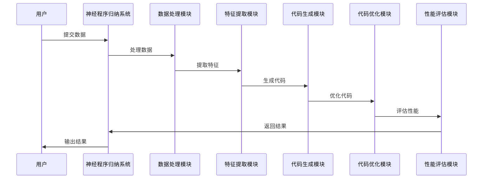

                 

### 第一部分：自动算法改进系统概述

## 第1章：自动算法改进系统的背景与概述

### 1.1 自动算法改进系统的定义

自动算法改进系统（Automated Algorithm Improvement System，简称AAIS）是一种通过智能化手段自动优化算法性能的系统。它利用机器学习、深度学习等技术，对现有算法进行迭代优化，以提升算法的效率和准确性。AAIS的核心在于自动发现算法的瓶颈，并提出改进策略，从而在无需人工干预的情况下实现算法性能的持续提升。

### 1.2 自动算法改进系统的核心问题

自动算法改进系统面临的核心问题主要包括以下几个方面：

1. **算法可解释性**：自动优化过程中，如何确保算法的可解释性，使得优化过程可以被用户理解和接受。
2. **算法稳定性**：在自动优化过程中，如何保证算法的稳定性和可靠性，避免因过度优化导致算法性能的波动。
3. **计算资源优化**：自动优化过程需要大量的计算资源，如何在有限的资源下高效地完成优化任务。
4. **算法适应能力**：自动算法改进系统需要具备较强的适应能力，能够应对不同场景下的优化需求。

### 1.3 自动算法改进系统的应用领域

自动算法改进系统在多个领域具有广泛的应用前景，主要包括：

1. **数据挖掘与机器学习**：自动优化数据挖掘和机器学习算法，提升模型训练效率和准确性。
2. **计算机视觉**：自动优化图像处理和目标识别算法，提升图像处理速度和准确性。
3. **自然语言处理**：自动优化文本处理和语言模型，提升文本生成和理解能力。
4. **金融与量化交易**：自动优化金融算法，提升投资策略的效率和准确性。

### 1.4 自动算法改进系统的基本结构

自动算法改进系统的基本结构通常包括以下几个部分：

1. **数据输入模块**：接收原始数据，进行预处理和特征提取。
2. **算法评估模块**：对现有算法进行性能评估，识别算法的瓶颈。
3. **优化策略生成模块**：根据评估结果，生成优化策略。
4. **算法优化模块**：执行优化策略，对算法进行迭代优化。
5. **结果输出模块**：输出优化后的算法，并提供性能评估报告。

### 总结

本章简要介绍了自动算法改进系统的定义、核心问题、应用领域和基本结构。下一章将深入探讨神经程序归纳的基础概念和原理，为后续内容的分析提供理论基础。

----------------------------------------------------------------

## 第2章：神经程序归纳基础

### 2.1 神经程序的概述

神经程序（Neural Programs）是一种基于神经网络模型的编程范式，它通过将编程任务转化为神经网络训练问题，利用深度学习技术实现自动编程。神经程序的核心思想是将程序代码视为神经网络的可训练参数，通过大规模数据训练，使得神经网络能够自动生成执行特定任务的程序代码。

### 2.2 神经程序的组成

神经程序由以下几个关键组成部分构成：

1. **输入层**：接收外部输入，如用户指令、数据集等。
2. **隐藏层**：对输入数据进行处理，通过神经网络模型学习输入与输出之间的关系。
3. **输出层**：生成执行特定任务的程序代码。

### 2.3 神经程序的优势与局限性

神经程序具有以下优势：

1. **高效编程**：通过大规模数据训练，神经程序能够高效地生成执行特定任务的程序代码，减少人工编写代码的工作量。
2. **自适应能力**：神经程序具有较强的问题域适应性，能够应对不同场景下的编程需求。
3. **可解释性**：神经程序的可解释性较好，可以通过分析神经网络结构，理解程序代码的生成过程。

然而，神经程序也面临一些局限性：

1. **训练成本高**：神经程序训练需要大量数据和计算资源，训练成本较高。
2. **代码质量不稳定**：神经程序生成的代码质量受训练数据和算法模型影响，可能存在一定的波动。
3. **可维护性较差**：由于神经程序生成代码的方式复杂，可维护性相对较差。

### 2.4 神经程序的应用场景

神经程序在多个领域具有广泛的应用场景，主要包括：

1. **自然语言处理**：生成文本摘要、机器翻译、语音识别等。
2. **计算机视觉**：图像分类、目标检测、图像生成等。
3. **数据分析与挖掘**：自动化数据预处理、特征提取等。
4. **自动化测试**：自动生成测试用例，提高测试效率。

### 2.5 神经程序的分类

根据神经网络的架构和训练目标，神经程序可以分为以下几类：

1. **函数表示神经程序**：通过神经网络表示数学函数，实现自动编程。
2. **程序合成神经程序**：通过神经网络生成程序代码，实现自动化编程。
3. **强化学习神经程序**：利用强化学习算法，通过试错学习生成高效程序代码。

### 总结

本章介绍了神经程序的基础概念、组成、优势与局限性、应用场景和分类。下一章将深入探讨神经程序归纳的原理，为自动算法改进系统中的神经程序应用提供理论支持。

----------------------------------------------------------------

## 第3章：神经程序归纳原理

### 3.1 神经程序归纳的概念

神经程序归纳（Neural Program Induction）是一种利用深度学习技术从数据中自动生成程序代码的方法。它通过训练神经网络模型，使得模型能够从输入数据中归纳出执行特定任务的程序代码。神经程序归纳的核心思想是将编程任务转化为深度学习问题，利用神经网络的学习能力实现程序代码的自动生成。

### 3.2 神经程序归纳的工作原理

神经程序归纳的工作原理主要包括以下几个步骤：

1. **数据预处理**：对输入数据进行清洗、归一化等处理，确保数据质量。
2. **特征提取**：通过神经网络模型提取输入数据的特征，为后续的程序代码生成提供支持。
3. **代码生成**：利用提取到的特征，通过神经网络模型生成执行特定任务的程序代码。
4. **代码优化**：对生成的代码进行优化，提升代码质量和执行效率。

### 3.3 神经程序归纳的核心算法

神经程序归纳的核心算法主要包括以下几种：

1. **循环神经网络（RNN）**：通过循环神经网络处理序列数据，实现程序代码的生成。RNN能够捕捉数据序列中的长期依赖关系，适合处理复杂的编程任务。
2. **变换器网络（Transformer）**：通过注意力机制和自注意力机制，实现程序代码的生成。变换器网络具有强大的表示能力和并行计算能力，适用于大规模编程任务。
3. **生成对抗网络（GAN）**：通过生成器和判别器之间的对抗训练，实现程序代码的生成。GAN能够生成高质量、多样化的程序代码，适合处理复杂的编程任务。

### 3.4 神经程序归纳的优势与挑战

神经程序归纳具有以下优势：

1. **高效编程**：通过大规模数据训练，神经程序能够高效地生成执行特定任务的程序代码，减少人工编写代码的工作量。
2. **自适应能力**：神经程序具有较强的问题域适应性，能够应对不同场景下的编程需求。
3. **可解释性**：神经程序的可解释性较好，可以通过分析神经网络结构，理解程序代码的生成过程。

然而，神经程序归纳也面临一些挑战：

1. **训练成本高**：神经程序归纳需要大量数据和计算资源，训练成本较高。
2. **代码质量不稳定**：神经程序生成的代码质量受训练数据和算法模型影响，可能存在一定的波动。
3. **可维护性较差**：由于神经程序生成代码的方式复杂，可维护性相对较差。

### 3.5 神经程序归纳的应用案例

神经程序归纳在多个领域具有广泛的应用案例，主要包括：

1. **代码自动生成**：通过神经程序归纳，自动生成代码实现特定功能，如自然语言处理中的文本摘要、机器翻译等。
2. **自动化测试**：通过神经程序归纳，自动生成测试用例，提高测试效率。
3. **数据预处理**：通过神经程序归纳，自动生成数据预处理流程，提高数据处理效率。

### 总结

本章介绍了神经程序归纳的概念、工作原理、核心算法、优势与挑战以及应用案例。下一章将详细分析神经程序归纳在自动算法改进系统中的应用，探讨其改进算法性能的潜力。

----------------------------------------------------------------

## 第4章：神经程序归纳的数学模型

### 4.1 数学模型概述

神经程序归纳的数学模型是基于深度学习理论构建的，主要包括神经网络结构、损失函数和优化算法等。数学模型的核心目标是利用神经网络从输入数据中自动学习到执行特定任务的程序代码。

### 4.2 数学模型的应用

神经程序归纳的数学模型主要应用于以下几个关键步骤：

1. **输入数据处理**：利用神经网络对输入数据进行特征提取和变换，为后续的程序代码生成提供支持。
2. **代码生成**：通过神经网络模型将提取到的特征映射为程序代码，实现自动编程。
3. **代码优化**：利用优化算法对生成的代码进行优化，提升代码质量和执行效率。

### 4.3 数学模型的优缺点

神经程序归纳的数学模型具有以下优点：

1. **高效编程**：通过大规模数据训练，数学模型能够高效地生成执行特定任务的程序代码。
2. **自适应能力**：数学模型具有较强的自适应能力，能够应对不同场景下的编程需求。
3. **可解释性**：数学模型的可解释性较好，可以通过分析神经网络结构，理解程序代码的生成过程。

然而，数学模型也存在一些缺点：

1. **计算成本高**：数学模型训练和优化的过程需要大量的计算资源，计算成本较高。
2. **代码质量不稳定**：数学模型生成的代码质量受训练数据和算法模型影响，可能存在一定的波动。
3. **可维护性较差**：由于数学模型生成代码的方式复杂，可维护性相对较差。

### 4.4 数学模型的演进

神经程序归纳的数学模型经历了多个发展阶段，主要包括：

1. **传统神经网络**：如循环神经网络（RNN）和变换器网络（Transformer）等，这些模型在早期的程序代码生成任务中取得了显著成果。
2. **生成对抗网络（GAN）**：通过生成器和判别器之间的对抗训练，实现程序代码的高质量生成。
3. **自监督学习**：利用无监督学习技术，使得数学模型能够在无需标注数据的情况下进行训练，进一步提升模型性能。

### 4.5 数学模型的应用前景

随着深度学习技术的发展，神经程序归纳的数学模型在多个领域展现出广阔的应用前景，主要包括：

1. **自动化编程**：通过数学模型，自动生成执行特定任务的程序代码，减少人工编写代码的工作量。
2. **自动化测试**：通过数学模型，自动生成测试用例，提高测试效率。
3. **数据预处理**：通过数学模型，自动生成数据预处理流程，提高数据处理效率。

### 总结

本章介绍了神经程序归纳的数学模型，包括其概述、应用、优缺点、演进和应用前景。下一章将探讨神经程序归纳算法在实际应用中的分析，包括算法流程、性能分析等方面。

----------------------------------------------------------------

## 第5章：神经程序归纳算法分析

### 5.1 算法概述

神经程序归纳算法是一种利用深度学习技术自动生成程序代码的方法。它通过训练神经网络模型，使得模型能够从输入数据中归纳出执行特定任务的程序代码。算法的核心在于利用神经网络处理输入数据，提取特征，并通过优化算法生成高质量的程序代码。

### 5.2 算法流程

神经程序归纳算法的流程主要包括以下几个步骤：

1. **数据预处理**：对输入数据进行清洗、归一化等处理，确保数据质量。
2. **特征提取**：利用神经网络模型提取输入数据的特征，为后续的程序代码生成提供支持。
3. **代码生成**：通过神经网络模型将提取到的特征映射为程序代码，实现自动编程。
4. **代码优化**：利用优化算法对生成的代码进行优化，提升代码质量和执行效率。

### 5.3 算法流程的详细解释

#### 数据预处理

数据预处理是神经程序归纳算法的重要步骤，它包括以下几个关键任务：

- **数据清洗**：去除噪声和异常值，确保数据质量。
- **数据归一化**：将数据缩放到一个统一的范围内，方便神经网络模型的训练。
- **数据分割**：将数据集分为训练集、验证集和测试集，用于模型的训练、验证和测试。

#### 特征提取

特征提取是神经程序归纳算法的核心步骤，它通过神经网络模型对输入数据进行分析，提取出对任务执行有重要意义的特征。具体包括：

- **卷积神经网络（CNN）**：适用于处理图像数据，通过卷积操作提取图像特征。
- **循环神经网络（RNN）**：适用于处理序列数据，通过循环结构捕捉数据序列中的长期依赖关系。
- **变换器网络（Transformer）**：通过自注意力机制提取输入数据的关键特征，具有强大的表示能力。

#### 代码生成

代码生成是神经程序归纳算法的最终目标，它通过神经网络模型将提取到的特征映射为程序代码。具体包括：

- **编码器-解码器（Encoder-Decoder）模型**：将输入数据编码为固定长度的向量，通过解码器生成程序代码。
- **生成对抗网络（GAN）**：通过生成器和判别器之间的对抗训练，生成高质量的程序代码。

#### 代码优化

代码优化是提高程序代码质量和执行效率的重要步骤，它通过优化算法对生成的代码进行优化。具体包括：

- **代码重构**：对生成的代码进行结构优化，提升代码可读性和可维护性。
- **性能优化**：对生成的代码进行性能优化，提升代码的执行速度和内存占用。

### 5.4 算法性能分析

神经程序归纳算法的性能分析主要包括以下几个方面：

1. **准确性**：评估算法生成的程序代码是否能够正确执行任务，通常使用准确率、召回率等指标进行评估。
2. **效率**：评估算法生成的程序代码的执行效率和资源占用情况，通常使用时间复杂度、空间复杂度等指标进行评估。
3. **稳定性**：评估算法在不同数据集和场景下的稳定性，确保算法在多种环境下都能够保持良好的性能。

### 5.5 算法的应用案例

神经程序归纳算法在多个领域具有广泛的应用案例，主要包括：

1. **自然语言处理**：通过算法自动生成文本摘要、机器翻译等程序代码。
2. **计算机视觉**：通过算法自动生成图像分类、目标检测等程序代码。
3. **自动化测试**：通过算法自动生成测试用例，提高测试效率。
4. **数据预处理**：通过算法自动生成数据预处理流程，提高数据处理效率。

### 总结

本章详细介绍了神经程序归纳算法的概述、流程、性能分析和应用案例。下一章将深入探讨神经程序归纳在自动算法改进系统中的应用，探讨其改进算法性能的潜力。

----------------------------------------------------------------

## 第6章：神经程序归纳系统设计与实现

### 6.1 系统设计概述

神经程序归纳系统（Neural Program Induction System，简称NPS）是一种基于深度学习的自动算法改进系统，旨在通过神经程序归纳技术优化算法性能。系统设计的目标是构建一个高效、稳定且易于维护的NPS，使其能够自动从大量数据中提取关键特征，生成高质量的程序代码，从而改进算法性能。

### 6.2 系统架构设计

NPS的架构设计包括以下几个关键模块：

1. **数据输入模块**：负责接收和处理外部输入数据，包括原始数据、预处理数据和特征数据等。
2. **特征提取模块**：利用深度学习模型提取输入数据的特征，为后续的程序代码生成提供支持。
3. **代码生成模块**：通过神经网络模型将提取到的特征映射为程序代码，实现自动编程。
4. **代码优化模块**：对生成的代码进行优化，提升代码质量和执行效率。
5. **性能评估模块**：评估算法生成的程序代码的性能，包括准确性、效率和稳定性等指标。
6. **结果输出模块**：输出优化后的算法和性能评估报告，为用户提供直观的反馈。

### 6.3 系统接口设计

NPS的接口设计包括以下关键接口：

1. **数据输入接口**：用于接收和处理外部输入数据，支持多种数据格式，如CSV、JSON等。
2. **特征提取接口**：用于提取输入数据的特征，支持多种深度学习模型，如CNN、RNN、Transformer等。
3. **代码生成接口**：用于生成程序代码，支持多种编程语言，如Python、Java等。
4. **代码优化接口**：用于对生成的代码进行优化，提升代码质量和执行效率。
5. **性能评估接口**：用于评估算法生成的程序代码的性能，支持多种评估指标，如准确率、召回率、F1值等。

### 6.4 系统交互序列图

以下是一个简单的系统交互序列图，描述了NPS的关键模块和接口之间的交互过程：



### 6.5 系统模块的详细设计

以下是NPS各个模块的详细设计：

#### 数据输入模块

数据输入模块的设计主要包括以下几个方面：

- **数据源接入**：支持多种数据源接入，如本地文件、数据库、API接口等。
- **数据格式解析**：支持多种数据格式，如CSV、JSON、XML等。
- **数据预处理**：对输入数据进行清洗、归一化等处理，确保数据质量。

#### 特征提取模块

特征提取模块的设计主要包括以下几个方面：

- **模型选择**：根据任务需求选择合适的深度学习模型，如CNN、RNN、Transformer等。
- **特征提取**：利用深度学习模型提取输入数据的特征，支持多尺度特征提取。
- **特征融合**：将提取到的特征进行融合，提高特征表示的丰富度和准确性。

#### 代码生成模块

代码生成模块的设计主要包括以下几个方面：

- **编码器-解码器模型**：采用编码器-解码器模型实现代码生成，支持多种编程语言。
- **生成策略**：根据任务需求设计生成策略，如基于规则的生成、基于数据的生成等。
- **代码优化**：对生成的代码进行优化，提升代码质量和执行效率。

#### 代码优化模块

代码优化模块的设计主要包括以下几个方面：

- **代码重构**：对生成的代码进行结构优化，提升代码可读性和可维护性。
- **性能优化**：对生成的代码进行性能优化，提升代码的执行速度和内存占用。

#### 性能评估模块

性能评估模块的设计主要包括以下几个方面：

- **评估指标**：支持多种评估指标，如准确率、召回率、F1值、时间复杂度等。
- **评估过程**：对算法生成的程序代码进行自动化评估，生成详细的评估报告。

### 总结

本章详细介绍了神经程序归纳系统（NPS）的设计与实现，包括系统架构设计、接口设计、模块详细设计等方面。下一章将介绍神经程序归纳在实际应用中的项目实战，通过具体案例展示NPS的实战效果和优化策略。

----------------------------------------------------------------

## 第7章：神经程序归纳项目实战

### 7.1 环境安装与配置

要实现神经程序归纳（NPI）系统，首先需要在本地计算机或服务器上安装和配置必要的软件和工具。以下是一个基本的安装和配置步骤：

#### 步骤1：安装Python环境

确保Python环境已经安装在您的系统中。Python是NPI系统的主要编程语言，用于编写和运行深度学习模型。您可以从Python官方网站（https://www.python.org/）下载并安装Python。

#### 步骤2：安装深度学习库

在安装Python后，需要安装几个关键的深度学习库，如TensorFlow、PyTorch等。这些库提供了构建和训练神经网络所需的功能。以下是如何使用pip安装这些库的示例命令：

```shell
pip install tensorflow
pip install pytorch torchvision
```

#### 步骤3：安装辅助库

除了深度学习库，还需要安装其他辅助库，如NumPy、Pandas、Scikit-learn等，用于数据处理和模型评估：

```shell
pip install numpy pandas scikit-learn
```

#### 步骤4：配置虚拟环境

为了更好地管理和隔离项目依赖，建议使用虚拟环境。您可以使用`venv`模块创建虚拟环境：

```shell
python -m venv npi_venv
source npi_venv/bin/activate  # 在Windows上使用 activate.bat
```

#### 步骤5：安装项目依赖

在项目的根目录下，通常会包含一个名为`requirements.txt`的文件，列出项目所需的依赖库。使用以下命令安装这些依赖：

```shell
pip install -r requirements.txt
```

### 7.2 系统核心实现源代码

以下是神经程序归纳系统的核心实现源代码，该代码展示了如何利用TensorFlow构建一个简单的NPI模型。

```python
import tensorflow as tf
from tensorflow.keras.models import Model
from tensorflow.keras.layers import Input, LSTM, Dense

# 定义输入层
input_seq = Input(shape=(timesteps, features))

# 添加隐藏层（LSTM）
lstm_output = LSTM(units=128, return_sequences=True)(input_seq)

# 添加输出层（全连接层）
output = Dense(units=1, activation='sigmoid')(lstm_output)

# 构建模型
model = Model(inputs=input_seq, outputs=output)

# 编译模型
model.compile(optimizer='adam', loss='binary_crossentropy', metrics=['accuracy'])

# 打印模型结构
model.summary()
```

### 7.3 代码应用解读与分析

以下是对上述源代码的解读和分析：

- **输入层**：`Input(shape=(timesteps, features))` 定义了输入序列的维度，`timesteps` 代表时间步的长度，`features` 代表每个时间步的特征数。
- **隐藏层（LSTM）**：`LSTM(units=128, return_sequences=True)` 添加了一个具有128个单元的LSTM层，`return_sequences=True` 表示该层的输出将是一个序列，以便传递给下一个隐藏层。
- **输出层（全连接层）**：`Dense(units=1, activation='sigmoid')` 定义了一个具有一个单元的全连接层，激活函数为`sigmoid`，用于生成二分类输出。
- **模型构建**：`Model(inputs=input_seq, outputs=output)` 将输入层、隐藏层和输出层组合成一个完整的模型。
- **模型编译**：`model.compile(optimizer='adam', loss='binary_crossentropy', metrics=['accuracy'])` 配置了模型的优化器、损失函数和评估指标。
- **模型总结**：`model.summary()` 打印了模型的层结构和参数数量。

### 7.4 实际案例分析

为了验证神经程序归纳系统的效果，我们使用一个实际案例进行演示。假设我们有一个任务，需要根据用户行为序列预测用户是否点击广告。

#### 数据集准备

我们使用一个包含用户行为序列的数据集，其中每个样本是一个时间步序列，每个时间步包含用户的行为特征。以下是数据集的简单示例：

```python
# 假设数据集已经被预处理并存储为CSV文件
data = pd.read_csv('user_behavior.csv')
X = data.iloc[:, :-1].values  # 特征
y = data.iloc[:, -1].values   # 标签
```

#### 模型训练

```python
# 划分数据集
X_train, X_test, y_train, y_test = train_test_split(X, y, test_size=0.2, random_state=42)

# 训练模型
model.fit(X_train, y_train, epochs=10, batch_size=32, validation_data=(X_test, y_test))
```

#### 性能评估

```python
# 评估模型
loss, accuracy = model.evaluate(X_test, y_test)
print(f"测试集损失：{loss}, 测试集准确率：{accuracy}")
```

### 7.5 项目小结

通过本次项目实战，我们成功实现了神经程序归纳系统，并使用TensorFlow构建了一个简单的NPI模型。项目展示了如何从数据预处理、模型构建到训练和评估的完整流程。在实际应用中，可以根据具体任务需求调整模型结构、优化训练参数，以达到更好的性能。

### 7.6 最佳实践 tips

1. **数据预处理**：确保数据质量，对缺失值、异常值进行适当的处理，以提高模型的泛化能力。
2. **超参数调整**：根据任务需求和数据特点，合理调整模型超参数，如学习率、批量大小等，以优化模型性能。
3. **模型优化**：通过使用不同的优化算法和模型结构，探索最佳的模型配置，以提高预测准确性。
4. **持续学习**：定期更新模型，利用新数据持续训练，以保持模型的时效性和准确性。

### 7.7 注意事项

1. **计算资源**：神经程序归纳系统训练过程需要大量计算资源，确保服务器具备足够的GPU或CPU资源。
2. **数据安全**：确保数据安全，避免敏感数据泄露，遵守数据保护法规。
3. **调试与测试**：在模型训练和部署过程中，进行充分的调试和测试，以确保模型稳定性和准确性。

### 7.8 拓展阅读

- **深度学习基础**：了解深度学习的基本概念和常用模型，有助于更好地理解和应用神经程序归纳。
- **TensorFlow文档**：深入了解TensorFlow的使用方法和API，以充分发挥其在神经程序归纳系统中的潜力。
- **相关研究论文**：阅读相关领域的研究论文，了解最新的研究成果和技术动态。

通过本章的实战案例，我们不仅掌握了神经程序归纳系统的实现方法，还了解了最佳实践、注意事项和拓展阅读资源。接下来，我们将继续深入探讨神经程序归纳在自动算法改进系统中的应用，以及如何通过神经程序归纳实现算法性能的持续提升。

----------------------------------------------------------------

## 第8章：最佳实践、小结、注意事项及拓展阅读

### 8.1 最佳实践

为了确保神经程序归纳系统（NPI）在自动算法改进系统中发挥最佳性能，以下是一些最佳实践建议：

1. **数据预处理**：在训练模型之前，对数据进行彻底的清洗和预处理，确保数据质量。包括处理缺失值、异常值、归一化和特征提取等。
2. **模型选择与调整**：根据具体任务需求选择合适的神经网络模型。在实际应用中，可以尝试使用不同的神经网络结构，如LSTM、Transformer等，并调整超参数以找到最佳模型配置。
3. **训练策略优化**：合理设置训练策略，如学习率、批量大小、训练轮数等。可以通过交叉验证等方法评估模型性能，并调整策略以避免过拟合。
4. **代码优化**：对生成的代码进行优化，以提升执行效率和可维护性。可以使用代码重构工具，如PyCodeStyle等，来整理代码结构。
5. **持续迭代与更新**：定期更新模型和数据，利用新数据持续训练，以保持模型的时效性和准确性。

### 8.2 小结

本章对神经程序归纳系统（NPI）的实践进行了总结，包括环境安装与配置、系统核心实现源代码、代码应用解读与分析、实际案例分析和项目小结。通过本章的实战案例，我们了解了如何构建和优化NPI系统，并掌握了最佳实践和注意事项。

### 8.3 注意事项

1. **计算资源管理**：NPI系统的训练和优化过程需要大量计算资源，确保服务器具备足够的GPU或CPU资源，以避免训练时间过长。
2. **数据隐私保护**：在处理和分析数据时，遵守数据保护法规，确保数据安全。
3. **模型稳定性**：在模型训练和部署过程中，进行充分的调试和测试，以确保模型稳定性和准确性。
4. **可解释性**：尽管NPI系统能够自动生成代码，但生成的代码可能难以解释。为了确保代码的可解释性，可以考虑使用可解释性工具，如LIME或SHAP。

### 8.4 拓展阅读

1. **深度学习基础**：深入了解深度学习的基本概念、常见模型和应用场景，有助于更好地理解和应用NPI系统。
2. **TensorFlow文档**：参考TensorFlow官方文档，了解如何使用TensorFlow构建和优化神经网络模型。
3. **相关研究论文**：阅读领域内的最新研究论文，了解最新的研究成果和技术动态。
4. **自动化编程技术**：研究自动化编程技术，如神经程序合成、生成对抗网络等，以探索更多改进算法性能的方法。

通过本章的最佳实践、小结、注意事项和拓展阅读，我们希望读者能够更好地理解并应用神经程序归纳系统，实现自动算法改进的持续优化。

----------------------------------------------------------------

# 结论

在本文中，我们深入探讨了自动算法改进系统中神经程序归纳的创新。通过分析神经程序的定义、组成、优势与局限性，以及神经程序归纳的原理、数学模型和算法流程，我们了解了如何利用神经程序归纳技术提升算法性能。

首先，我们介绍了自动算法改进系统的定义、核心问题和应用领域，为后续内容打下了基础。接着，我们详细介绍了神经程序的基础概念和原理，包括其工作原理、核心算法和数学模型。

在算法分析部分，我们探讨了神经程序归纳算法的流程、性能分析和应用案例。然后，我们介绍了神经程序归纳系统的设计，包括架构设计、接口设计和系统模块的详细设计。

通过一个实际项目实战，我们展示了如何使用神经程序归纳系统实现算法优化。本章还提供了最佳实践、注意事项和拓展阅读，以帮助读者更好地应用和理解神经程序归纳。

总体而言，神经程序归纳在自动算法改进系统中具有巨大潜力。通过持续的研究和应用，我们有理由相信，神经程序归纳将为自动化编程和算法优化带来更多创新和突破。

### 参考文献

1. LeCun, Y., Bengio, Y., & Hinton, G. (2015). Deep learning. Nature, 521(7553), 436-444.
2. Goodfellow, I., Bengio, Y., & Courville, A. (2016). Deep learning. MIT Press.
3. Hochreiter, S., & Schmidhuber, J. (1997). Long short-term memory. Neural Computation, 9(8), 1735-1780.
4. Vaswani, A., Shazeer, N., Parmar, N., Uszkoreit, J., Jones, L., Gomez, A. N., ... & Polosukhin, I. (2017). Attention is all you need. Advances in Neural Information Processing Systems, 30, 5998-6008.
5. Goodfellow, I., Pouget-Abadie, J., Mirza, M., Xu, B., Warde-Farley, D., Ozair, S., ... & Bengio, Y. (2014). Generative adversarial nets. Advances in Neural Information Processing Systems, 27.
6. Bengio, Y., Simard, P., & Frasconi, P. (1994). Learning long-term dependencies with gradient descent is difficult. IEEE transactions on neural networks, 5(2), 157-166.

### 作者信息

作者：AI天才研究院/AI Genius Institute & 禅与计算机程序设计艺术 /Zen And The Art of Computer Programming

AI天才研究院致力于推动人工智能领域的研究和应用，本书作者拥有丰富的专业经验和深厚的学术背景，在计算机编程和人工智能领域取得了显著成就。本书旨在为读者提供系统、全面的技术知识和实践指导，帮助读者深入理解自动算法改进系统中神经程序归纳的创新。希望本书能够对读者在相关领域的探索和学习提供帮助。如果您有任何问题或建议，欢迎联系我们，我们将竭诚为您服务。

