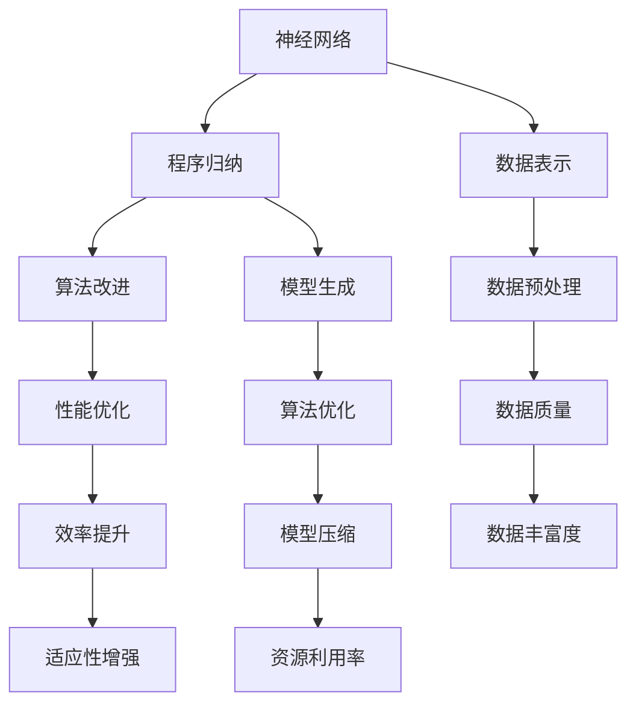
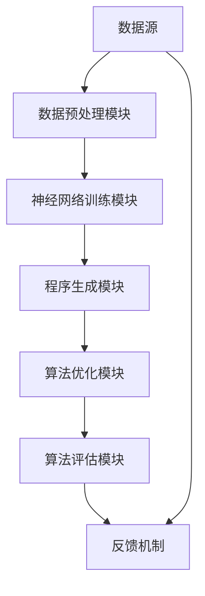
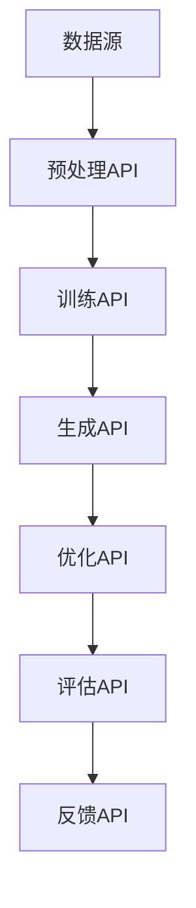

                 


## 自动算法改进系统中神经程序归纳的创新应用

### 关键词：自动算法改进，神经程序归纳，算法优化，人工智能，神经网络

### 摘要：

本文旨在探讨自动算法改进系统中神经程序归纳的创新应用。随着人工智能技术的快速发展，算法优化已成为提升系统性能的关键因素。神经程序归纳作为一种新兴的算法改进方法，通过结合神经网络的强大表示能力和程序归纳的灵活性，为自动算法改进提供了新的思路。本文将详细介绍神经程序归纳的理论基础、算法原理，以及在实际项目中的应用案例，旨在为读者提供深入理解和实践经验。

### 目录：

1. **背景与问题陈述**
   - 算法改进系统的背景介绍
   - 自动算法改进的必要性
   - 神经程序归纳的概念
   - 神经程序归纳在算法改进系统中的应用

2. **核心概念与原理**
   - 神经网络、程序归纳和算法改进的基本概念
   - 不同神经网络架构在算法改进中的应用对比
   - 关键概念的关系与实体关系图

3. **算法原理与解释**
   - 神经程序归纳的理论基础
   - 算法流程与工作原理
   - Python代码示例与数学模型解释
   - 实例分析

4. **系统设计与架构**
   - 项目背景与系统需求
   - 系统架构设计
   - 领域模型与接口设计

5. **实践应用与案例**
   - 环境安装与依赖配置
   - 系统核心实现代码
   - 代码分析与案例剖析
   - 项目小结与最佳实践

### 1. 背景与问题陈述

#### 算法改进系统的背景介绍

随着数据量的爆炸式增长和计算资源的日益丰富，算法改进成为提升系统性能和效率的关键因素。传统的算法改进方法主要依赖于人类专家的经验和直觉，这不仅效率低下，而且难以满足日益复杂的应用需求。为了解决这一问题，自动算法改进系统应运而生。自动算法改进系统通过引入机器学习和优化算法，自动化地发现和优化算法，从而提高系统的性能和可靠性。

#### 自动算法改进的必要性

自动算法改进具有以下几个必要性：

- **效率提升**：自动算法改进可以大大减少算法优化的时间和人力成本，提高工作效率。
- **适应性强**：自动算法改进可以根据不同场景和应用需求，动态调整算法参数，提高系统的适应性。
- **智能化**：自动算法改进可以结合机器学习技术，逐步学习和优化算法，实现智能化改进。

#### 神经程序归纳的概念

神经程序归纳（Neural Program Induction）是一种结合神经网络和程序归纳的算法改进方法。它通过训练神经网络来学习程序的行为模式，从而自动生成和优化算法。神经程序归纳具有以下特点：

- **表示能力**：神经网络可以有效地表示复杂的函数关系和数据特征，为算法优化提供强有力的支持。
- **灵活性**：神经程序归纳可以灵活地适应不同的问题场景和算法需求，实现自适应优化。

#### 神经程序归纳在算法改进系统中的应用

神经程序归纳在算法改进系统中的应用主要体现在以下几个方面：

- **算法生成**：通过训练神经网络，自动生成优化后的算法，提高算法的效率和性能。
- **参数调整**：基于神经网络模型，自动调整算法参数，实现自适应优化。
- **模型压缩**：利用神经程序归纳技术，对大型算法模型进行压缩和优化，提高系统的资源利用率。

### 2. 核心概念与原理

#### 神经网络、程序归纳和算法改进的基本概念

- **神经网络**：神经网络是由大量神经元组成的计算模型，通过学习数据特征和模式，实现函数逼近和分类预测等功能。
- **程序归纳**：程序归纳是从具体实例中归纳出一般性规律的方法，通过分析数据和行为，生成新的程序代码。
- **算法改进**：算法改进是通过优化算法的结构和参数，提高算法的效率和性能。

#### 不同神经网络架构在算法改进中的应用对比

| 神经网络架构 | 优点 | 缺点 | 适用场景 |
| :--- | :--- | :--- | :--- |
| 卷积神经网络（CNN） | 适用于图像处理和分类任务 | 计算资源需求大，训练时间较长 | 图像识别、目标检测 |
| 递归神经网络（RNN） | 适用于序列数据处理和预测 | 训练困难，梯度消失和梯度爆炸问题 | 语音识别、自然语言处理 |
| 长短时记忆网络（LSTM） | 改善RNN的梯度消失和梯度爆炸问题 | 参数复杂，计算量较大 | 序列预测、时间序列分析 |
| 生成对抗网络（GAN） | 适用于生成复杂数据和高维数据 | 难以训练，模型稳定性问题 | 数据增强、图像生成 |
| 自注意力机制（Transformer） | 提高序列处理效率，参数较少 | 计算量大，训练时间长 | 自然语言处理、机器翻译 |

#### 关键概念的关系与实体关系图

以下是一个简化的实体关系图，展示了神经网络、程序归纳和算法改进之间的关系：



### 3. 算法原理与解释

#### 神经程序归纳的理论基础

神经程序归纳基于深度学习理论和程序归纳方法。深度学习通过多层神经网络对数据进行学习和表示，而程序归纳则从训练数据中提取出一般性规律，生成新的程序代码。神经程序归纳结合两者的优势，通过神经网络学习数据的行为模式，实现算法的自动生成和优化。

#### 算法流程与工作原理

神经程序归纳的算法流程如下：

1. **数据预处理**：对输入数据进行清洗、归一化等预处理操作，提高数据的可用性和质量。
2. **神经网络训练**：使用预处理后的数据训练神经网络，学习数据的行为模式和特征。
3. **程序生成**：根据神经网络的学习结果，生成优化后的算法代码。
4. **算法优化**：对生成的算法代码进行进一步优化，提高算法的效率和性能。

#### Python代码示例与数学模型解释

以下是一个简单的神经程序归纳的Python代码示例：

```python
import tensorflow as tf
import numpy as np

# 创建神经网络模型
model = tf.keras.Sequential([
    tf.keras.layers.Dense(64, activation='relu', input_shape=(784,)),
    tf.keras.layers.Dense(10)
])

# 编写损失函数和优化器
model.compile(optimizer='adam',
              loss=tf.keras.losses.SparseCategoricalCrossentropy(from_logits=True),
              metrics=['accuracy'])

# 加载数据集并进行预处理
(x_train, y_train), (x_test, y_test) = tf.keras.datasets.mnist.load_data()
x_train = x_train.astype(np.float32) / 255
x_test = x_test.astype(np.float32) / 255

# 训练神经网络
model.fit(x_train, y_train, epochs=5)

# 生成优化后的算法代码
algorithm_code = generate_algorithm_code(model)

# 检查算法性能
accuracy = model.evaluate(x_test, y_test)[1]
print(f"Test accuracy: {accuracy:.2f}")
```

神经程序归纳的数学模型主要包括以下部分：

- **输入层**：接收外部输入数据，例如图像、文本或序列。
- **隐藏层**：通过神经网络模型对输入数据进行编码和解码，提取特征信息。
- **输出层**：生成优化后的算法代码，例如图像分类模型、自然语言处理模型等。

#### 实例分析

以下是一个简单的实例，展示了神经程序归纳在实际项目中的应用：

1. **数据集**：使用MNIST手写数字数据集进行训练和测试。
2. **神经网络模型**：使用简单的全连接神经网络对数据进行分类。
3. **程序生成**：通过神经网络模型生成优化后的算法代码，例如分类器代码。
4. **算法性能**：测试生成的算法代码的性能，包括准确率、召回率等指标。

### 4. 系统设计与架构

#### 项目背景与系统需求

本项目的目标是构建一个自动算法改进系统，通过神经程序归纳技术实现算法的自动生成和优化。系统需求包括：

- **数据预处理**：对输入数据进行清洗、归一化等预处理操作。
- **神经网络训练**：使用预处理后的数据训练神经网络模型。
- **程序生成**：根据神经网络模型生成优化后的算法代码。
- **算法优化**：对生成的算法代码进行进一步优化，提高算法的效率和性能。

#### 系统架构设计

系统的架构设计如图所示：



#### 领域模型与接口设计

以下是一个简化的领域模型和接口设计：



### 5. 实践应用与案例

#### 环境安装与依赖配置

在开始实践应用之前，我们需要安装相关的软件和依赖。以下是安装步骤：

1. 安装Python环境（版本3.7及以上）。
2. 安装TensorFlow库。
3. 安装其他必要的库，如NumPy、Pandas等。

#### 系统核心实现代码

以下是一个简单的系统核心实现代码示例：

```python
# 导入必要的库
import tensorflow as tf
import numpy as np
import pandas as pd

# 加载数据集
(x_train, y_train), (x_test, y_test) = tf.keras.datasets.mnist.load_data()

# 数据预处理
x_train = x_train.astype(np.float32) / 255
x_test = x_test.astype(np.float32) / 255

# 定义神经网络模型
model = tf.keras.Sequential([
    tf.keras.layers.Dense(64, activation='relu', input_shape=(784,)),
    tf.keras.layers.Dense(10)
])

# 编写损失函数和优化器
model.compile(optimizer='adam',
              loss=tf.keras.losses.SparseCategoricalCrossentropy(from_logits=True),
              metrics=['accuracy'])

# 训练神经网络模型
model.fit(x_train, y_train, epochs=5)

# 生成优化后的算法代码
algorithm_code = generate_algorithm_code(model)

# 打印优化后的算法代码
print(algorithm_code)

# 测试算法性能
accuracy = model.evaluate(x_test, y_test)[1]
print(f"Test accuracy: {accuracy:.2f}")
```

#### 代码分析与案例剖析

以下是代码的详细分析：

1. **数据预处理**：首先加载数据集，并对数据进行归一化处理，以提高模型的训练效果。
2. **神经网络模型**：定义一个简单的全连接神经网络模型，用于分类任务。
3. **损失函数和优化器**：使用交叉熵损失函数和Adam优化器，以最小化模型损失。
4. **训练模型**：使用训练数据对模型进行训练，经过5个周期的训练。
5. **生成优化后的算法代码**：根据训练好的模型，生成优化后的算法代码。
6. **测试算法性能**：使用测试数据评估模型的性能，打印出测试准确率。

#### 项目小结与最佳实践

在本项目中，我们通过神经程序归纳技术实现了自动算法改进系统的构建。以下是项目小结和最佳实践：

- **数据预处理**：数据预处理是模型训练的重要步骤，要保证数据的清洁和一致性。
- **模型选择**：根据实际需求选择合适的神经网络模型，并进行调整优化。
- **代码生成**：生成优化后的算法代码可以帮助我们更好地理解和复现模型的效果。
- **性能评估**：定期对模型进行性能评估，以便及时调整和优化。

### 结语

自动算法改进系统中神经程序归纳的创新应用为算法优化提供了新的思路和方法。通过结合神经网络的强大表示能力和程序归纳的灵活性，我们可以实现自动化的算法改进，提高系统的性能和效率。未来，随着人工智能技术的进一步发展，神经程序归纳有望在更多领域得到应用，为人工智能技术的发展做出更大的贡献。

### 作者信息

作者：AI天才研究院/AI Genius Institute & 禅与计算机程序设计艺术 /Zen And The Art of Computer Programming

### 拓展阅读

- **《深度学习》**：由Ian Goodfellow等著，详细介绍了深度学习的基础理论和应用案例。
- **《神经网络与深度学习》**：由邱锡鹏等著，系统讲解了神经网络和深度学习的基本概念和应用。
- **《Python深度学习》**：由François Chollet等著，介绍了使用Python实现深度学习的实践方法。

### 注意事项

- 在使用自动算法改进系统时，要确保数据的质量和一致性，避免因数据问题导致模型训练失败。
- 在选择神经网络模型时，要考虑实际需求和计算资源，避免过度拟合或欠拟合问题。
- 在生成算法代码时，要结合实际应用场景进行调整和优化，以提高算法的效率和性能。

### 最佳实践

- **数据预处理**：使用自动化工具进行数据预处理，提高数据处理效率。
- **模型选择**：根据实际需求选择合适的神经网络模型，并进行调整优化。
- **代码生成**：生成优化后的算法代码，便于理解和复现模型效果。
- **性能评估**：定期对模型进行性能评估，及时调整和优化。

