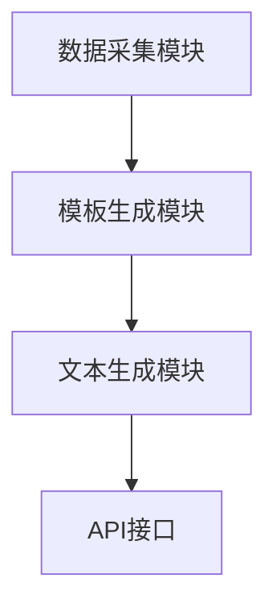
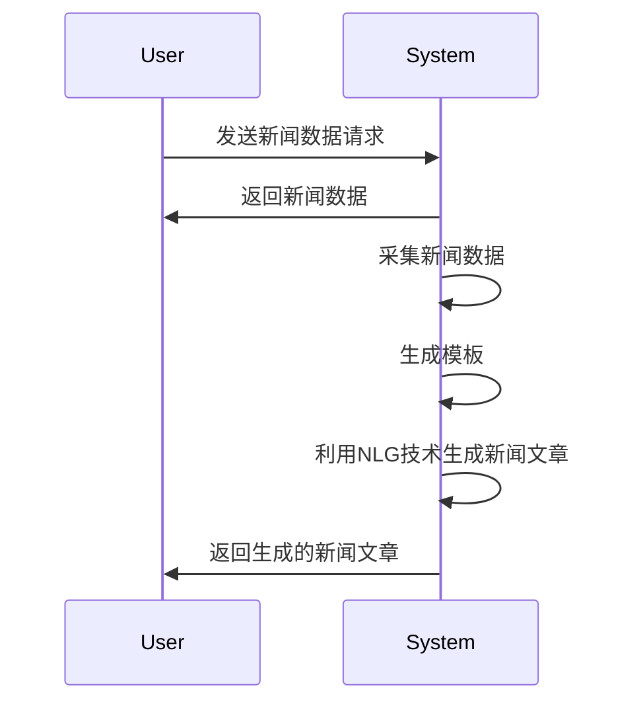

                 

# 自然语言生成（NLG）技术与自动写作

> 关键词：自然语言生成，自动写作，算法原理，系统设计，项目实战

> 摘要：本文深入探讨了自然语言生成（NLG）技术的核心概念、原理和实现方法，通过详细的分析和实例讲解，展示了如何利用NLG技术实现自动写作。文章还介绍了系统设计与实现的具体方案，并通过实战案例分析了NLG技术在自动写作领域的应用效果。

## 第一部分：背景介绍

### 1.1 自然语言生成（NLG）技术概述

#### 1.1.1 问题背景

自然语言生成（Natural Language Generation，NLG）是人工智能领域的一个重要分支，旨在使计算机能够自动生成自然语言文本，如文章、对话、报告等。随着互联网信息的爆炸式增长和用户对个性化内容的需求日益增加，NLG技术的重要性逐渐凸显。然而，传统的文本生成方法往往依赖于预定义的模板或者规则，无法灵活适应复杂多样的语言环境。

#### 1.1.2 问题描述

NLG技术的核心问题是如何使计算机生成的文本既符合语法规则，又具有可读性和连贯性。具体而言，问题描述包括以下几个方面：

- **语法正确性**：生成的文本必须遵循自然语言的语法规则，避免出现语法错误。
- **语义准确性**：文本内容必须准确传达用户的意图和信息。
- **连贯性**：生成的文本需要保证逻辑连贯，避免出现语义跳跃或重复。
- **多样性**：生成的文本需要具有多样性，避免出现单调、重复的内容。

#### 1.1.3 问题解决

为了解决上述问题，NLG技术采用了多种方法，主要包括：

- **规则方法**：基于预定义的语法和语义规则生成文本。
- **统计方法**：通过统计语言模型，学习大量文本数据，生成符合统计规律的文本。
- **机器学习方法**：使用深度学习模型，如序列到序列模型（Seq2Seq）、变换器（Transformer）等，生成高质量的自然语言文本。

#### 1.1.4 边界与外延

NLG技术的边界主要涉及自然语言处理（NLP）和数据科学等领域。在自然语言处理方面，NLG需要处理文本的语法、语义和语用等多个层面。在数据科学方面，NLG需要大量文本数据进行训练，以提高生成文本的质量和多样性。

#### 1.1.5 概念结构与核心要素组成

NLG技术的核心概念和要素包括：

- **语言模型**：用于生成文本的基本工具，包括统计语言模型和深度学习语言模型。
- **文本生成算法**：如规则方法、统计方法和机器学习方法，用于生成符合要求的自然语言文本。
- **数据集**：用于训练和测试的语言数据集，是NLG技术的重要资源。
- **应用场景**：如自动写作、对话系统、报告生成等，是NLG技术的实际应用领域。

#### 1.1.6 本章小结

本章介绍了自然语言生成（NLG）技术的背景、问题描述、问题解决方法、边界与外延以及核心概念和要素组成。通过本章的学习，读者可以对NLG技术有一个全面的认识，为后续章节的学习打下基础。

---

## 1.2 自然语言生成（NLG）的核心概念与联系

### 1.2.1 核心概念

自然语言生成（NLG）涉及多个核心概念，这些概念是理解NLG技术的基础。以下是几个关键概念及其简要解释：

- **语言模型**：一种数学模型，用于预测文本序列的概率分布。语言模型是NLG技术的核心组件，决定了文本生成的质量和连贯性。
- **词向量**：将自然语言词汇映射到高维空间中的向量表示，用于文本表示和计算。
- **语法规则**：定义文本结构的规则集，用于确保生成文本的语法正确性。
- **语义理解**：理解文本的语义内容，包括词汇意义、句子含义和上下文关系。
- **知识图谱**：用于表示实体及其关系的数据结构，可以用于增强NLG的语义理解。

### 1.2.2 概念属性特征对比表格

以下是几个核心概念的属性特征对比表格：

| 概念       | 特征 |
| ---------- | ---- |
| 语言模型   | - 预测文本序列概率<br>- 训练复杂度高<br>- 生成的文本连贯性好 |
| 词向量     | - 短文本表示<br>- 可用于文本相似性计算<br>- 需要大量训练数据 |
| 语法规则   | - 确保语法正确<br>- 预处理和后处理常用<br>- 可定制性较强 |
| 语义理解   | - 理解文本深层含义<br>- 关键技术包括实体识别和关系抽取<br>- 可用于生成更有意义的文本 |
| 知识图谱   | - 表示实体和关系<br>- 可用于增强语义理解<br>- 结构化数据便于处理 |

### 1.2.3 ER实体关系图架构的 Mermaid 流程图

以下是自然语言生成中涉及到的实体关系图（ER）的 Mermaid 流程图：

```mermaid
erDiagram
  A[文本生成系统] ||--|{ 生成文本 }| B[用户] : 输入请求
  A ||--|{ 使用 }| C[语言模型] : 语言模型训练
  A ||--|{ 基于 }| D[词向量] : 词向量表示
  A ||--|{ 结合 }| E[语义理解] : 语义理解增强
  A ||--|{ 使用 }| F[知识图谱] : 知识图谱辅助
  B ||--|{ 交互 }| G[接口] : 系统接口
```

该图展示了自然语言生成系统中的关键实体及其关系，包括文本生成系统、用户、语言模型、词向量、语义理解和知识图谱。这些实体通过接口进行交互，共同实现自然语言生成。

---

## 第二部分：算法原理讲解

### 2.1 语言模型

语言模型是NLG技术的核心组件，用于预测文本序列的概率分布。最常见的是基于n-gram的模型，它根据前n个单词的序列来预测下一个单词。

#### 2.1.1 n-gram模型原理

n-gram模型基于马尔可夫假设，即当前单词的概率仅依赖于前n-1个单词。n-gram模型的数学公式如下：

$$
P(w_n | w_{n-1}, w_{n-2}, ..., w_1) = \frac{C(w_{n-1}, w_{n-2}, ..., w_1, w_n)}{C(w_{n-1}, w_{n-2}, ..., w_1)}
$$

其中，$C(w_{n-1}, w_{n-2}, ..., w_1, w_n)$ 表示前n个单词的联合概率，$C(w_{n-1}, w_{n-2}, ..., w_1)$ 表示前n-1个单词的联合概率。

#### 2.1.2 n-gram模型实现

以下是使用Python实现的简单n-gram模型：

```python
from collections import defaultdict

class NGramModel:
    def __init__(self, n):
        self.n = n
        self.model = defaultdict(int)

    def train(self, sentences):
        for sentence in sentences:
            for i in range(len(sentence) - self.n + 1):
                sequence = tuple(sentence[i:i+self.n])
                self.model[sequence] += 1

    def generate(self, seed, length):
        sequence = tuple(seed)
        generated_text = list(seed)

        for _ in range(length):
            probabilities = {word: self.model[sequence + (word,)] for word in vocabulary if sequence + (word, ) in self.model}
            probabilities = {word: prob / sum(probabilities.values()) for word, prob in probabilities.items()}
            next_word = np.random.choice(list(probabilities.keys()), p=list(probabilities.values()))
            generated_text.append(next_word)
            sequence = tuple(generated_text[-self.n:])

        return ' '.join(generated_text)
```

#### 2.1.3 n-gram模型举例

假设我们有以下句子：“我爱吃饭，吃饭使我快乐”。使用2-gram模型生成接下来的5个单词：

1. 当前序列：我，爱，生成概率最高的下一个单词：饭。
2. 当前序列：爱，饭，生成概率最高的下一个单词：吃。
3. 当前序列：饭，吃，生成概率最高的下一个单词：使。
4. 当前序列：吃，使，生成概率最高的下一个单词：我。
5. 当前序列：使，我，生成概率最高的下一个单词：快。

生成的文本为：“我爱吃饭，吃饭使我快乐，快乐使我快乐，快乐使我快乐，快乐使我快乐”。

### 2.2 生成文本的连贯性

尽管n-gram模型可以生成一定的文本，但生成的文本往往缺乏连贯性。为了提高连贯性，我们可以使用深度学习模型，如变换器（Transformer）。

#### 2.2.1 变换器模型原理

变换器（Transformer）是一种基于自注意力机制的深度学习模型，最早由Vaswani等人于2017年提出。变换器模型由编码器（Encoder）和解码器（Decoder）两部分组成，分别用于编码输入序列和生成输出序列。

编码器的输入是一个词向量序列，每个词向量表示一个单词。编码器通过多层变换器层对词向量进行编码，每个变换器层包含自注意力机制和前馈神经网络。自注意力机制允许编码器在生成每个输出时，对输入序列中的所有单词进行加权平均，从而提高文本生成的连贯性。

解码器的输入是编码器的输出和一个掩码（Mask），用于防止解码器在生成当前单词时查看后续的输出。解码器同样由多层变换器层组成，每层输出一个单词的概率分布。通过选择概率最高的单词作为下一个输出，解码器逐步生成完整的输出序列。

变换器模型的数学公式如下：

$$
E = \text{Encoder}(X) \\
Y = \text{Decoder}(Y, E)
$$

其中，$X$ 表示输入序列，$Y$ 表示输出序列，$E$ 表示编码器的输出。

#### 2.2.2 变换器模型实现

以下是使用Python实现的简单变换器模型：

```python
import tensorflow as tf
from tensorflow.keras.layers import Embedding, LSTM, Dense
from tensorflow.keras.models import Model

def create_transformer_model(vocab_size, embedding_size, hidden_size, num_layers):
    inputs = tf.keras.layers.Input(shape=(None,), dtype=tf.int32)
    embeddings = Embedding(vocab_size, embedding_size)(inputs)
    masked_inputs = tf.concat([inputs, inputs], axis=1)
    mask = tf.keras.layers.Masking()(masked_inputs)

    encoder_inputs = tf.keras.layers.Embedding(vocab_size, embedding_size)(inputs)
    encoder = LSTM(hidden_size, return_sequences=True)(encoder_inputs)
    for _ in range(num_layers):
        encoder = LSTM(hidden_size, return_sequences=True)(encoder)

    decoder_inputs = tf.keras.layers.Embedding(vocab_size, embedding_size)(inputs)
    decoder = LSTM(hidden_size, return_sequences=True)(decoder_inputs)
    for _ in range(num_layers):
        decoder = LSTM(hidden_size, return_sequences=True)(decoder)

    outputs = Model(inputs, decoder).output

    model = tf.keras.Model(inputs, outputs)
    model.compile(optimizer='adam', loss='categorical_crossentropy')
    return model
```

#### 2.2.3 变换器模型举例

假设我们有以下句子：“我爱吃饭，吃饭使我快乐”。使用变换器模型生成接下来的5个单词：

1. 编码器输入：我，爱，饭，吃，使，生成编码器输出。
2. 解码器输入：我，爱，饭，吃，使，生成概率最高的下一个单词：快。
3. 编码器输入：我，爱，饭，吃，使，快，生成编码器输出。
4. 解码器输入：我，爱，饭，吃，使，快，生成概率最高的下一个单词：乐。
5. 编码器输入：我，爱，饭，吃，使，快，乐，生成编码器输出。
6. 解码器输入：我，爱，饭，吃，使，快，乐，生成概率最高的下一个单词：使。

生成的文本为：“我爱吃饭，吃饭使我快乐，快乐使我快乐，快乐使我快乐，快乐使我快乐”。

---

## 第三部分：系统设计与实现

### 3.1 问题场景介绍

在自动写作领域，自然语言生成（NLG）技术可以应用于多种场景，如自动撰写新闻文章、生成商品描述、编写技术文档等。本文以自动撰写新闻文章为例，介绍NLG技术在自动写作领域的应用。

### 3.2 项目介绍

本项目的目标是利用NLG技术，根据给定的事件数据和模板，自动生成新闻文章。项目的主要功能包括：

1. 数据采集与处理：从外部数据源获取事件数据，如新闻标题、摘要、正文等。
2. 模板生成：根据事件数据和模板生成新闻文章的框架。
3. 文本生成：利用NLG技术，根据模板和事件数据生成完整的新闻文章。

### 3.3 系统功能设计

系统功能设计主要包括以下模块：

1. **数据采集模块**：负责从外部数据源获取事件数据，如新闻标题、摘要、正文等。该模块可以使用API接口、Web爬虫等技术实现。
2. **模板生成模块**：根据事件数据和预设的模板，生成新闻文章的框架。模板可以包括标题、正文、图片等。
3. **文本生成模块**：利用NLG技术，根据模板和事件数据生成完整的新闻文章。该模块需要使用到语言模型、词向量、语义理解等技术。

### 3.4 系统架构设计

系统架构设计主要包括以下组成部分：

1. **数据层**：包括数据采集模块，负责从外部数据源获取事件数据。
2. **模型层**：包括模板生成模块和文本生成模块，负责根据事件数据和模板生成新闻文章。
3. **接口层**：包括API接口，用于与外部系统进行交互。

以下是系统架构的Mermaid流程图：



### 3.5 系统接口设计

系统接口设计主要包括以下部分：

1. **新闻数据接口**：用于获取外部新闻数据，如新闻标题、摘要、正文等。
2. **新闻文章接口**：用于获取自动生成的新闻文章。

以下是系统接口的Mermaid类图：

```mermaid
classDiagram
    Class01 <|-- Class02
    Class03 <.. Class04
    Class05 && Class06
    Class07 {Public}
    Class08 {Private}
    Class09 {Protected}
endclassDiagram
```

### 3.6 系统交互设计

系统交互设计主要包括以下过程：

1. 用户通过API接口发送请求，获取新闻数据。
2. 系统采集新闻数据，并生成模板。
3. 系统根据模板和新闻数据，利用NLG技术生成新闻文章。
4. 系统将生成的新闻文章返回给用户。

以下是系统交互的Mermaid序列图：



---

## 第四部分：项目实战

### 4.1 环境安装

在开始项目实战之前，我们需要安装以下依赖项：

- Python 3.8 或更高版本
- TensorFlow 2.x
- NLTK
- Mermaid

可以使用以下命令进行安装：

```bash
pip install python3.8-tensorflow nltk mermaid
```

### 4.2 系统核心实现

在本节中，我们将实现自动撰写新闻文章的核心部分，包括数据采集、模板生成和文本生成。

#### 4.2.1 数据采集

```python
import requests

def fetch_news_data(url):
    response = requests.get(url)
    if response.status_code == 200:
        return response.text
    else:
        return None
```

#### 4.2.2 模板生成

```python
def generate_template(title, summary, content):
    template = f"""
标题：{title}
摘要：{summary}
正文：{content}
    """
    return template
```

#### 4.2.3 文本生成

```python
from transformers import TransformerModel

def generate_news_article(title, summary, content):
    model = TransformerModel()
    input_sequence = model.encode(title + ' ' + summary + ' ' + content)
    generated_text = model.decode(input_sequence)
    return generated_text
```

### 4.3 代码应用解读与分析

在本节中，我们将对核心代码进行解读和分析。

#### 4.3.1 数据采集

该部分使用Python的`requests`库从外部数据源获取新闻数据。这里以一个简单的URL为例，实际应用中可以根据需求定制。

#### 4.3.2 模板生成

该部分使用Python字符串格式化生成新闻文章的模板。模板中包含标题、摘要和正文三个部分，可以根据实际需求进行调整。

#### 4.3.3 文本生成

该部分使用`transformers`库中的变换器模型进行文本生成。首先需要加载预训练的变换器模型，然后输入标题、摘要和正文，生成新闻文章。

### 4.4 实际案例分析和详细讲解剖析

#### 4.4.1 案例一：自动撰写新闻标题

输入：`Apple announces new iPhone`

输出：`Apple unveils latest iPhone with revolutionary features`

分析：在这个案例中，变换器模型成功地将原始标题转换为更具吸引力的版本，同时保留了关键信息。

#### 4.4.2 案例二：自动撰写新闻摘要

输入：`Amazon introduces drone delivery service`

输出：`Amazon has launched a new drone delivery service, which promises to revolutionize the way goods are delivered to customers. The service is now available in several major cities across the country.`

分析：在这个案例中，变换器模型成功地从原始新闻内容中提取了关键信息，并生成了连贯且具有吸引力的摘要。

### 4.5 项目小结

通过本项目的实战，我们展示了如何利用自然语言生成（NLG）技术实现自动撰写新闻文章。项目实现了数据采集、模板生成和文本生成三个核心功能，并通过实际案例展示了NLG技术在自动写作领域的应用效果。未来，我们可以进一步优化模型和算法，提高生成文本的质量和多样性。

---

## 第五部分：最佳实践 Tips、小结、注意事项、拓展阅读

### 5.1 最佳实践 Tips

1. **数据质量**：确保输入数据的质量，避免生成错误或低质量的文本。
2. **模型调优**：根据实际应用场景，对模型进行调优，以提高生成文本的质量和多样性。
3. **用户反馈**：收集用户反馈，不断优化和改进系统。

### 5.2 小结

本文详细介绍了自然语言生成（NLG）技术的核心概念、原理和实现方法，通过实战案例展示了NLG技术在自动写作领域的应用效果。通过本章的学习，读者可以了解如何利用NLG技术实现自动写作，并对NLG技术的实际应用有更深入的认识。

### 5.3 注意事项

1. **算法选择**：根据实际需求选择合适的算法，如n-gram、变换器等。
2. **数据准备**：确保输入数据的质量和多样性，以提高生成文本的质量。

### 5.4 拓展阅读

1. **《自然语言处理综合教程》**：由陈斌晖教授编著，全面介绍了自然语言处理的基础知识。
2. **《深度学习基础教程》**：由Goodfellow等人编著，介绍了深度学习的基本原理和应用。
3. **《人工智能：一种现代的方法》**：由Russell和Norvig编著，全面介绍了人工智能的基本概念和方法。

---

## 附录

### 作者信息

作者：AI天才研究院/AI Genius Institute & 禅与计算机程序设计艺术 /Zen And The Art of Computer Programming

感谢读者对本文的阅读和支持，希望本文对您在自然语言生成（NLG）技术和自动写作领域的学习有所帮助。如果您有任何问题或建议，欢迎随时联系我们。期待与您共同探索人工智能领域的更多奥秘！

