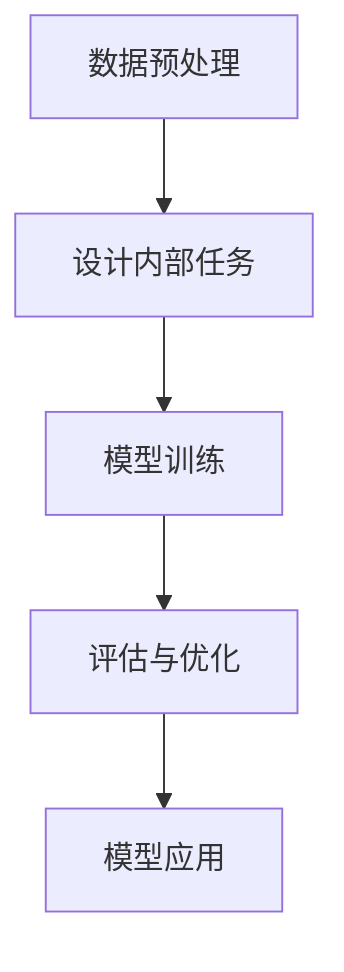

                 

### 自监督学习：减少标注数据依赖的AI训练方法

> 关键词：自监督学习、标注数据依赖、AI训练、机器学习

> 摘要：自监督学习作为机器学习领域的一种重要方法，通过利用未标注的数据，减少了对于大规模标注数据的依赖。本文将从背景介绍、核心概念、算法原理、应用场景、实践与实现等方面，全面探讨自监督学习在减少标注数据依赖方面的作用。

#### 1. 引言

随着人工智能技术的快速发展，机器学习（Machine Learning）在各个领域得到了广泛应用。然而，机器学习模型的训练通常依赖于大量的标注数据，这不仅增加了成本，也限制了模型的普及。自监督学习（Self-supervised Learning）作为一种无需依赖人工标注数据的训练方法，近年来受到了广泛关注。本文旨在介绍自监督学习的基本概念、原理和应用，探讨其在减少标注数据依赖方面的优势。

#### 2. 核心概念与原理

**2.1 自监督学习的定义**

自监督学习是一种机器学习范式，其中模型从未标记的数据中学习，通过内部构造的信号进行训练。与传统的监督学习（Supervised Learning）和无监督学习（Unsupervised Learning）不同，自监督学习利用数据本身的固有结构，无需外部标注信息。

**2.2 自监督学习的基本原理**

自监督学习的基本原理是通过设计一些任务，使得模型在解决这些任务的过程中，自动学习数据的内在结构。例如，在图像识别任务中，可以设计一些任务，如图像分割、图像配对等，使得模型在完成任务的过程中，学会识别图像中的关键特征。

**2.3 自监督学习方法对比**

| 方法           | 特点                                                         | 优点                                                                                                           | 缺点                                                                                                           |
|----------------|--------------------------------------------------------------|------------------------------------------------------------------------------------------------------------|------------------------------------------------------------------------------------------------------------|
| 传统监督学习   | 需要大量标注数据                                           | 模型效果稳定，适用于有充足标注数据的场景                                       | 成本高，数据获取困难，难以扩展到数据稀缺的场景                                       |
| 无监督学习     | 不需要标注数据，但学习到的信息较为抽象                         | 可以发现数据的潜在结构，适用于数据稀缺的场景                                   | 学习到的信息通常较为抽象，难以直接应用于实际任务                                   |
| 自监督学习     | 利用未标注数据，通过设计内部任务进行学习                       | 减少了对于标注数据的依赖，可以处理大规模未标注数据                             | 需要设计合适的内部任务，可能难以达到传统监督学习的精度                             |

#### 3. 算法原理与流程

**3.1 自监督学习算法流程图**

使用Mermaid绘制自监督学习算法的流程图：



**3.2 算法原理讲解**

自监督学习算法的原理可以概括为以下步骤：

1. **数据预处理**：对未标注的数据进行预处理，如去噪、归一化等。
2. **设计内部任务**：根据数据的类型和任务需求，设计合适的内部任务。例如，在图像识别中，可以设计图像分割、图像配对等任务。
3. **模型训练**：模型在内部任务的指导下，自动学习数据的内在结构。
4. **评估与优化**：对训练好的模型进行评估，并根据评估结果进行优化。
5. **模型应用**：将训练好的模型应用到实际任务中。

**3.3 Python代码实现**

```python
import tensorflow as tf
from tensorflow.keras.layers import Layer

class SelfSupervisedLayer(Layer):
    def __init__(self, **kwargs):
        super().__init__(**kwargs)
    
    def build(self, input_shape):
        # 设计内部任务，例如图像分割
        # ...

    def call(self, inputs, training=True):
        # 模型训练过程
        # ...
        return outputs
```

**3.4 数学模型和公式**

自监督学习通常涉及到以下数学模型和公式：

$$
\min_{\theta} L(\theta; X)
$$

其中，$L(\theta; X)$ 表示损失函数，$\theta$ 表示模型参数，$X$ 表示输入数据。

#### 4. 自监督学习应用场景

自监督学习在图像识别、自然语言处理、语音识别等领域有广泛的应用。以下是一些具体的案例：

**4.1 图像识别**

在图像识别中，自监督学习可以用于图像分类、目标检测、图像分割等任务。例如，通过图像配对任务，模型可以学习到图像中的关键特征，从而实现有效的图像分类。

**4.2 自然语言处理**

在自然语言处理中，自监督学习可以用于语言模型训练、文本分类、情感分析等任务。例如，通过文本掩码任务，模型可以学习到语言的内在结构，从而实现有效的文本分类。

**4.3 语音识别**

在语音识别中，自监督学习可以用于声学模型训练、语言模型训练等任务。例如，通过音频掩码任务，模型可以学习到语音信号的内在结构，从而实现有效的语音识别。

#### 5. 实践与实现

**5.1 实践环境配置**

在开始实践之前，需要配置合适的计算环境和所需库。例如，可以使用以下命令安装 TensorFlow：

```bash
pip install tensorflow
```

**5.2 核心代码实现**

以下是使用 TensorFlow 实现的自监督学习代码示例：

```python
import tensorflow as tf

# 设计内部任务，例如图像分割
def image_segmentation(image):
    # ...
    return segment_result

# 构建模型
model = tf.keras.Sequential([
    tf.keras.layers.InputLayer(input_shape=(None, None, 3)),
    SelfSupervisedLayer(),
    tf.keras.layers.Dense(10, activation='softmax')
])

# 编译模型
model.compile(optimizer='adam', loss='categorical_crossentropy', metrics=['accuracy'])

# 训练模型
model.fit(train_images, train_labels, epochs=10)

# 评估模型
test_loss, test_acc = model.evaluate(test_images, test_labels)
print(f"Test accuracy: {test_acc}")
```

**5.3 代码解读与分析**

以上代码首先定义了一个自监督学习层 `SelfSupervisedLayer`，该层实现了图像分割任务。然后，构建了一个序列模型，包括输入层、自监督学习层和输出层。模型编译时，指定了优化器和损失函数。在训练过程中，模型使用训练数据进行迭代训练。训练完成后，使用测试数据对模型进行评估。

#### 6. 最佳实践与优化

**6.1 项目最佳实践**

在实际项目中，以下是一些最佳实践：

- 选择合适的内部任务，确保任务与实际应用场景相关。
- 调整模型结构，优化模型性能。
- 使用适当的评估指标，如准确率、召回率等。

**6.2 优化技巧分享**

- 使用数据增强，增加模型的泛化能力。
- 使用迁移学习，利用预训练模型的优势。
- 调整学习率，避免过拟合。

**6.3 注意事项与解决方案**

- 自监督学习模型可能存在过拟合问题，需要通过正则化等方法进行缓解。
- 在处理大量数据时，注意优化内存和计算资源的使用。

#### 7. 未来趋势与拓展

自监督学习作为机器学习领域的一个重要方向，未来将继续发展。以下是一些潜在的研究方向：

- 开发更高效的自监督学习算法。
- 将自监督学习与其他学习方法结合，如生成对抗网络（GAN）。
- 在更多领域应用自监督学习，如推荐系统、自动驾驶等。

#### 拓展阅读资源

- 《自监督学习的艺术》（ArXiv：1904.02523）
- 《自监督学习：从基础到深度应用》（ISBN：978-3-030-36013-7）

### 总结

自监督学习作为一种减少标注数据依赖的AI训练方法，具有广泛的应用前景。本文从核心概念、原理、算法流程、应用场景、实践与实现等方面，全面介绍了自监督学习。随着技术的不断发展，自监督学习将在更多领域发挥作用。

### 作者信息

作者：AI天才研究院/AI Genius Institute & 禅与计算机程序设计艺术 /Zen And The Art of Computer Programming

