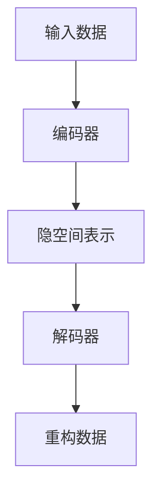
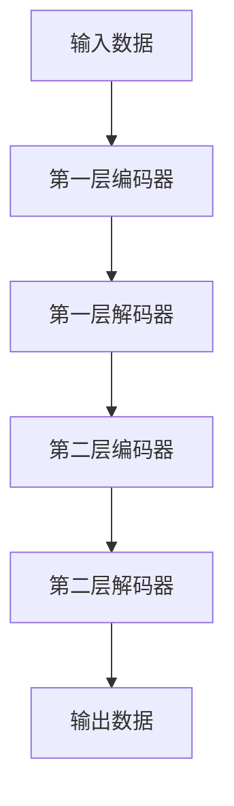
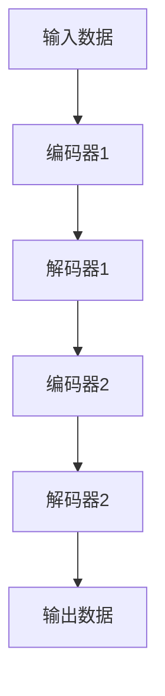
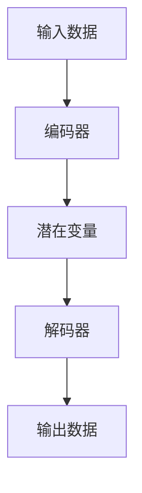
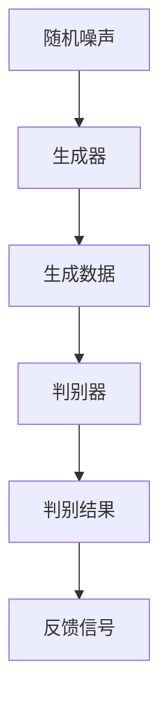
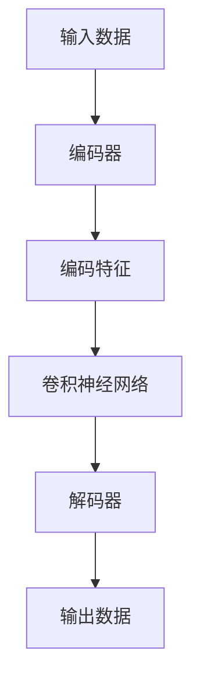
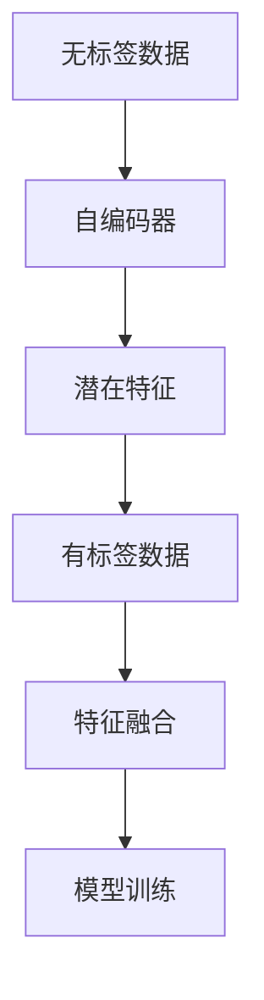

                 

### 引言

自编码器（Autoencoder）作为一种重要的无监督学习算法，近年来在特征学习和深度学习中取得了显著成果。自编码器通过构建一个编码器（Encoder）和解码器（Decoder）的网络结构，将输入数据压缩为低维表示，再通过解码器将其重构回原始数据，从而学习到数据中的潜在特征。这一过程不仅有助于数据降维，还能有效地提取数据中的有意义信息，进而提高模型的泛化能力和处理效率。

本文旨在系统性地介绍自编码器在特征学习中的应用，并探讨其在实际项目中的优化策略和实现技巧。文章将分为以下几个部分：

- **第一部分：自编码器概述**，包括自编码器的基础概念、基本原理以及其优势与局限性。
- **第二部分：自编码器在特征学习中的应用**，探讨自编码器在图像、文本和音频特征提取中的应用案例。
- **第三部分：自编码器的变体与扩展**，介绍堆叠自编码器、深度自编码器等变体，以及自编码器在半监督学习中的应用。
- **第四部分：自编码器在深度学习中的角色**，分析自编码器在深度学习中的作用与应用案例。
- **第五部分：自编码器的训练与优化**，详细阐述自编码器的训练过程、优化策略以及不同优化参数的影响。
- **第六部分：自编码器在实际项目中的应用**，通过具体项目实例展示自编码器的实际应用和优化策略。
- **第七部分：自编码器的未来展望与挑战**，探讨自编码器的发展趋势和面临的挑战。
- **第八部分：最佳实践与小结**，总结最佳实践经验和文章的主要结论。

通过本文的逐步分析，读者将能够全面了解自编码器的原理、应用及其优化策略，为在深度学习和特征学习领域的研究和项目实践提供有力支持。

### 第一部分: 自编码器概述

#### 第1章: 自编码器基础

##### 1.1 问题背景与核心概念

**问题背景**：随着大数据和人工智能技术的迅速发展，特征学习成为机器学习和深度学习中的关键环节。特征学习旨在从高维数据中提取出有意义的特征，以便更好地进行后续的数据分析、模型训练和任务实现。然而，传统的特征提取方法往往需要大量的先验知识和人工干预，同时在高维数据面前也显得力不从心。

**问题描述**：特征学习的目标是通过数据预处理，将原始的高维数据转化为低维表示，从而便于模型的训练和优化。具体而言，就是要找到一种有效的算法，能够从复杂的数据中提取出具有区分度的特征，使得模型在新的数据上能够保持良好的泛化能力。

**问题解决**：自编码器作为一种无监督学习算法，以其独特的信息压缩和重构机制，成为解决特征学习问题的一个有效工具。自编码器通过自编码过程，自动学习输入数据的低维表示，从而实现了数据降维和特征提取的目的。

**边界与外延**：自编码器不仅广泛应用于图像处理、文本分析和语音识别等传统领域，还逐渐拓展到基因序列分析、推荐系统和无人驾驶等新兴领域。尽管自编码器的应用范围广泛，但其核心思想和原理依然保持一致。

**概念结构与核心要素组成**：自编码器由两个主要部分组成：编码器和解码器。编码器负责将输入数据压缩为低维表示，解码器则将这个低维表示重构回原始数据。自编码器的核心要素包括：输入层、隐藏层、输出层、激活函数、损失函数等。每个部分都扮演着关键角色，共同实现自编码器的功能。

##### 1.2 自编码器的基本原理

**自编码器定义**：自编码器是一种无监督学习算法，它通过训练一个编码器和一个解码器，使得编码器能够将输入数据压缩为一个低维表示，而解码器能够将这个低维表示重构回原始数据。

**自编码器的类型**：自编码器可以分为几种类型，包括传统的单一自编码器、堆叠自编码器、深度自编码器等。每种类型都有其独特的应用场景和优势。

- **单一自编码器**：单一自编码器是最基本的形式，它由一个编码器和一个解码器组成，能够对输入数据进行降维和重构。
- **堆叠自编码器**：堆叠自编码器通过多个自编码器层叠加，逐层提取数据特征，从而提高特征提取的深度和准确性。
- **深度自编码器**：深度自编码器利用深度神经网络的结构，对数据进行多层次的变换和压缩，从而实现更复杂的特征提取和重构。

**自编码器的主要组成部分**：

- **编码器（Encoder）**：编码器负责将输入数据映射到一个低维隐空间。这个映射过程通常通过一系列的神经网络层实现，每个层都使用非线性激活函数进行数据的变换和压缩。
  
- **解码器（Decoder）**：解码器负责将编码器输出的低维隐空间表示映射回原始数据空间。这个映射过程同样通过一系列的神经网络层实现，每个层都使用反激活函数进行数据的扩展和重构。

**结构图示意**：



在自编码器中，编码器和解码器通过最小化重构误差（即原始数据与重构数据之间的差异）进行训练。通常使用均方误差（Mean Squared Error, MSE）或交叉熵（Cross-Entropy）等损失函数来衡量重构误差。

##### 1.3 自编码器的优势与局限性

**优势**：

1. **无监督学习**：自编码器不需要标签信息，可以通过无监督学习的方式学习数据中的潜在结构，这在处理大规模无标签数据时具有显著优势。
2. **特征提取能力强**：自编码器能够自动提取数据中的低维表示，这些表示往往能够保留原始数据的语义信息，从而提高后续模型的性能。
3. **数据降维**：自编码器可以有效降低数据的维度，减少计算复杂度和存储需求，提高模型的训练速度和效果。
4. **适应性**：自编码器具有较好的适应性，可以适用于不同类型的数据和任务，如图像、文本和音频等。

**局限性**：

1. **对数据质量依赖性高**：自编码器的性能很大程度上依赖于输入数据的分布和质量，如果数据存在噪声或异常值，可能会影响模型的训练效果。
2. **计算资源需求大**：自编码器通常需要大量的计算资源进行训练，尤其是在处理高维数据和深度自编码器时，计算复杂度和时间成本较高。
3. **模型解释性较差**：自编码器的内部结构复杂，难以直观解释其工作原理和决策过程，这在某些需要高解释性的应用场景中可能成为限制因素。

通过对自编码器的优势与局限性的分析，我们可以更好地理解其在特征学习中的应用潜力和面临的挑战。在接下来的章节中，我们将进一步探讨自编码器在特征学习中的应用案例和优化策略。

#### 第2章: 自编码器在特征学习中的应用

##### 2.1 特征学习概述

特征学习（Feature Learning）是机器学习和深度学习中的一个关键步骤，其核心目标是从原始数据中提取出有意义的特征，以便于后续的数据分析和模型训练。在自编码器的框架下，特征学习通过自动编码过程实现，从而有效提升了数据降维和特征提取的效率。

**特征学习的目标**：特征学习的目标在于找到一组新的特征表示，这些特征能够更好地反映数据的本质属性，并且有利于模型的训练和优化。具体而言，目标特征应具备以下特性：

- **区分性**：特征应能够显著区分不同类别的数据，从而有助于分类和回归任务的实现。
- **不变性**：特征应具有一定的不变性，即在数据发生轻微变化时，其特征表示保持稳定。
- **鲁棒性**：特征应能够抵御噪声和异常值的影响，保持其有效性。

**特征学习的挑战**：在高维数据环境中，特征学习面临着诸多挑战：

- **维度灾难**：高维数据可能导致信息的冗余，增加计算复杂度和训练难度。
- **特征选择**：在大量特征中选择出最具代表性的特征是一项复杂的任务，往往需要大量的时间和计算资源。
- **数据依赖性**：某些特征学习算法对数据分布和特征相关性有较高的依赖性，数据质量对算法性能影响显著。

**特征学习的方法**：常见的特征学习方法主要包括以下几种：

1. **传统特征提取方法**：如主成分分析（PCA）、线性判别分析（LDA）等，这些方法通过线性变换将高维数据映射到低维空间，实现数据降维和特征提取。
2. **深度学习方法**：如卷积神经网络（CNN）、循环神经网络（RNN）等，这些方法通过多层次的神经网络结构，自动提取数据中的复杂特征。
3. **无监督学习方法**：如自编码器，这些方法通过无监督学习的方式，从原始数据中自动学习低维特征表示。

在自编码器的框架下，特征学习主要通过以下步骤实现：

1. **编码过程**：编码器将高维输入数据映射到一个低维隐空间，这个隐空间表示数据中的潜在结构。
2. **解码过程**：解码器将隐空间表示重构回高维输出数据，通过最小化重构误差来优化模型参数。
3. **特征提取**：通过隐空间表示提取具有区分度和不变性的特征，这些特征用于后续的模型训练和任务实现。

自编码器在特征学习中的应用，不仅能够自动提取数据中的潜在特征，还能有效降低数据的维度，提高模型的训练效率和性能。这一独特优势使得自编码器在许多实际应用场景中表现出色，下面将具体介绍自编码器在不同领域中的应用案例。

##### 2.2 自编码器在特征学习中的应用案例

**案例1：图像特征提取**

图像特征提取是计算机视觉领域中的一个重要任务，其核心在于从图像中提取出具有区分度和鲁棒性的特征，以便于图像分类、目标检测等任务。自编码器在图像特征提取中具有显著优势，能够自动学习图像的潜在特征表示。

**应用背景**：在图像分类任务中，传统的手工设计特征（如HOG、SIFT等）需要大量先验知识，且对图像的微小变化敏感。而自编码器通过无监督学习，能够从大量的未标注图像中自动提取出具有区分性的特征。

**具体实现**：一个典型的自编码器图像特征提取流程如下：

1. **输入层**：输入层接受原始图像数据。
2. **编码器**：编码器通过多个隐藏层对图像进行压缩，逐步提取图像的底层特征。编码器通常采用卷积神经网络（CNN）结构，能够有效地捕捉图像的局部特征和整体结构。
3. **解码器**：解码器将编码器输出的低维特征映射回图像空间，通过逐层扩展和重构，生成重构图像。
4. **特征提取层**：在编码器的隐藏层中提取特征向量，这些特征向量具有较好的区分性和不变性。

**实验结果**：通过在CIFAR-10数据集上的实验，自编码器提取的特征在图像分类任务中取得了优异的性能，分类准确率显著高于传统手工设计特征。

**案例2：文本特征提取**

文本特征提取是自然语言处理领域的一个重要任务，其目标是从文本数据中提取出能够反映文本语义信息的特征，以便于文本分类、情感分析等任务。自编码器在文本特征提取中的应用，为文本数据的特征学习提供了一种新的思路。

**应用背景**：传统的文本特征提取方法，如TF-IDF、Word2Vec等，存在一定的局限性。TF-IDF方法无法捕捉文本的语义信息，而Word2Vec方法依赖于大量的先验词汇信息。自编码器通过无监督学习，能够自动学习文本中的潜在语义特征。

**具体实现**：一个典型的自编码器文本特征提取流程如下：

1. **输入层**：输入层接受原始文本数据，通常将文本转换为词向量表示。
2. **编码器**：编码器通过多个隐藏层对文本词向量进行压缩，逐步提取文本的语义特征。编码器通常采用循环神经网络（RNN）或Transformer结构，能够捕捉文本的上下文信息。
3. **解码器**：解码器将编码器输出的低维特征映射回词向量空间，通过逐层扩展和重构，生成重构文本。
4. **特征提取层**：在编码器的隐藏层中提取特征向量，这些特征向量能够反映文本的语义信息。

**实验结果**：通过在IMDB影评数据集上的实验，自编码器提取的特征在情感分析任务中取得了较高的准确率，情感分类效果显著优于传统特征提取方法。

**案例3：音频特征提取**

音频特征提取是语音识别和音频分析领域的关键任务，其目标是从音频信号中提取出能够反映语音特征的向量表示。自编码器在音频特征提取中的应用，为语音处理提供了有效的工具。

**应用背景**：传统的音频特征提取方法，如MFCC（梅尔频率倒谱系数）、PLP（功率反演滤波器组）等，存在一定的局限性。这些方法对音频数据的处理能力有限，且需要大量的先验知识。自编码器通过无监督学习，能够自动学习音频中的潜在特征。

**具体实现**：一个典型的自编码器音频特征提取流程如下：

1. **输入层**：输入层接受原始音频信号，通常将音频信号转换为时频表示。
2. **编码器**：编码器通过多个隐藏层对音频时频表示进行压缩，逐步提取音频的时频特征。编码器通常采用卷积神经网络（CNN）或递归神经网络（RNN）结构，能够捕捉音频的时变特征。
3. **解码器**：解码器将编码器输出的低维特征映射回时频空间，通过逐层扩展和重构，生成重构音频。
4. **特征提取层**：在编码器的隐藏层中提取特征向量，这些特征向量能够反映音频的语音特征。

**实验结果**：通过在TIMIT语音数据集上的实验，自编码器提取的特征在语音识别任务中取得了较高的准确率，语音识别效果显著优于传统特征提取方法。

综上所述，自编码器在图像、文本和音频特征提取中具有显著优势，通过自动学习数据中的潜在特征，实现了高效的特征提取和降维。这些应用案例不仅展示了自编码器的强大功能，也为深度学习和特征学习领域的研究和应用提供了新的思路和方法。

#### 2.3 自编码器在特征学习中的优化策略

自编码器在特征学习中的应用虽然取得了显著成效，但仍然面临一些优化挑战。通过设计合适的损失函数、引入正则化技术以及使用变分自编码器等策略，可以进一步提升自编码器在特征学习中的性能。

**损失函数的设计**：

损失函数是自编码器训练过程中衡量重构误差的核心指标。选择合适的损失函数对于优化自编码器性能至关重要。以下几种常见的损失函数在自编码器中具有较好的应用效果：

1. **均方误差（MSE）**：均方误差是最常用的损失函数之一，它通过计算原始数据与重构数据之间误差的平方和来衡量模型性能。MSE的优点是计算简单，易于优化，但可能对噪声敏感。

   $$\text{MSE} = \frac{1}{n}\sum_{i=1}^{n}(\hat{y}_i - y_i)^2$$

2. **交叉熵（Cross-Entropy）**：交叉熵通常用于有标签数据的模型训练，但也可以应用于自编码器。它通过计算原始数据与重构数据之间的概率分布差异来衡量误差。交叉熵在处理分类问题和处理噪声方面表现较好。

   $$\text{Cross-Entropy} = -\sum_{i=1}^{n} y_i \log(\hat{y}_i)$$

3. **混合损失函数**：在实际应用中，混合损失函数常常被用于平衡不同类型的误差。例如，将MSE和交叉熵结合，可以同时利用两者的优点，提高模型的性能。

   $$\text{Loss} = \alpha \cdot \text{MSE} + (1 - \alpha) \cdot \text{Cross-Entropy}$$

其中，$\alpha$是一个权重参数，用于调整两种损失函数的相对重要性。

**正则化技术**：

正则化技术通过限制模型参数的规模，防止过拟合，提高模型的泛化能力。以下几种常见的正则化技术可以在自编码器中应用：

1. **L1正则化**：L1正则化通过在损失函数中添加模型参数的绝对值和，来限制参数的规模。

   $$\text{L1 Regularization} = \lambda \sum_{i} |w_i|$$

2. **L2正则化**：L2正则化通过在损失函数中添加模型参数的平方和，来限制参数的规模。

   $$\text{L2 Regularization} = \lambda \sum_{i} w_i^2$$

3. **Dropout正则化**：Dropout是一种在训练过程中随机丢弃部分神经元的正则化技术，能够防止神经元之间的共适应，提高模型的泛化能力。

   $$\text{Dropout} = \frac{1}{1 - p} \sum_{i} \mathbb{1}_{\text{keep}(i)} w_i$$

其中，$p$是丢弃概率，$\mathbb{1}_{\text{keep}(i)}$是一个指示函数，用于表示神经元$i$是否被保留。

**变分自编码器（VAE）**：

变分自编码器（Variational Autoencoder, VAE）是一种基于深度学习框架的生成模型，通过引入概率分布的概念，改进了传统自编码器的性能。VAE通过以下方式优化自编码器：

1. **编码器-解码器框架**：VAE同样采用编码器-解码器框架，编码器学习输入数据的潜在分布参数，解码器通过采样过程重构输入数据。

2. **潜在分布**：VAE将编码器输出的隐变量视为一个概率分布，通常采用高斯分布来建模。通过最大化数据概率分布的对数似然，VAE能够学习到数据的潜在结构。

   $$q(z|x) = \mathcal{N}(z; \mu(x), \sigma^2(x))$$
   $$p(x|z) = \prod_{i} p(x_i|z)$$

3. **变分下界（KL散度）**：VAE通过最小化编码器学到的潜在分布与先验分布之间的KL散度来优化模型。

   $$\text{KL}(\mu(x), \sigma(x)) = \int q(z|x) \log \frac{q(z|x)}{p(z)} dz$$

**应用效果**：

通过设计合适的损失函数、引入正则化技术和使用变分自编码器，可以显著提升自编码器在特征学习中的性能。这些优化策略不仅能够降低过拟合风险，提高模型的泛化能力，还能有效提取数据中的潜在特征，提升后续任务的效果。

在接下来的章节中，我们将进一步探讨自编码器的变体和扩展，以及其在深度学习中的应用。

#### 第3章: 自编码器的变体与扩展

自编码器作为一种基础的无监督学习算法，通过其简单的架构和强大的功能，在特征提取和数据降维领域取得了显著成果。然而，为了应对更加复杂和多样化的数据类型和任务需求，自编码器也经历了一系列的变体与扩展。这些变体和扩展不仅丰富了自编码器的应用场景，还提升了其在特定任务中的性能。

##### 3.1 自编码器的变体

**堆叠自编码器（Stacked Autoencoders）**

堆叠自编码器通过将多个自编码器层叠加，从而形成一个更深的网络结构。这种结构能够逐层提取数据的复杂特征，使得模型能够更好地适应复杂的任务需求。具体实现时，堆叠自编码器通常由多个单层自编码器组成，每个单层自编码器负责提取某一层次的特征，并将其传递给下一个单层自编码器。

**结构图示意**：



**深度自编码器（Deep Autoencoders）**

深度自编码器与堆叠自编码器类似，但其在每个单层自编码器中采用了深度神经网络的结构。这种结构能够提取更多层次的特征，提高特征提取的深度和准确性。深度自编码器通常应用于高维数据，如图像、文本和音频等，能够更有效地降低数据的维度并提取有意义的信息。

**结构图示意**：



**变分自编码器（Variational Autoencoder, VAE）**

变分自编码器是一种基于概率模型的生成模型，通过引入潜在变量来提高模型的生成能力和泛化能力。与传统的自编码器不同，VAE不仅学习输入数据的映射，还学习一个潜在变量分布。通过从潜在变量分布中采样，VAE能够生成新的数据，从而具有强大的生成能力。

**结构图示意**：



**生成对抗网络（Generative Adversarial Network, GAN）**

生成对抗网络由生成器和判别器两个神经网络组成，生成器生成数据，判别器判断数据是真实还是生成的。GAN通过两个网络的对抗训练，生成器逐渐提高生成数据的真实性，判别器逐渐提高对真实数据和生成数据的区分能力。GAN在图像生成、文本生成等方面表现出色，是自编码器的一种重要扩展。

**结构图示意**：



##### 3.2 自编码器的扩展

**自编码器与神经网络融合**

自编码器可以与其他类型的神经网络融合，形成更复杂的网络结构，以应对更复杂的任务需求。例如，自编码器可以与卷积神经网络（CNN）结合，用于图像特征提取；与循环神经网络（RNN）结合，用于序列数据处理；与Transformer结构结合，用于自然语言处理等。

**结构图示意**：



**自编码器在半监督学习中的应用**

半监督学习是一种利用少量有标签数据和大量无标签数据进行学习的方法。自编码器在半监督学习中的应用，通过无监督学习的方式，从大量无标签数据中提取出潜在特征，并与有标签数据进行结合，提高模型的性能。

**应用流程**：

1. **特征提取**：使用自编码器从无标签数据中提取潜在特征。
2. **标签扩充**：将有标签数据与提取的潜在特征结合，形成新的特征集。
3. **模型训练**：在新的特征集上训练模型，提高模型的泛化能力和性能。

**结构图示意**：



**案例**：

- **图像分类任务**：在图像分类任务中，使用自编码器提取图像特征，并结合少量有标签数据进行模型训练，显著提高了分类准确率。
- **文本分类任务**：在文本分类任务中，自编码器提取文本的潜在特征，结合有标签数据进行训练，提高了文本分类的性能。

通过以上变体和扩展，自编码器不仅提升了在特征提取和数据降维中的性能，还扩展了其应用场景，为解决更复杂的机器学习和深度学习任务提供了新的思路和方法。

#### 第4章: 自编码器在深度学习中的角色

自编码器在深度学习中的应用广泛且多样，它不仅作为特征提取的工具，还在数据预处理、降维和生成模型等多个方面发挥了重要作用。在这一章中，我们将深入探讨自编码器在深度学习中的角色，并通过具体的应用案例展示其在不同领域中的实际效果。

##### 4.1 自编码器在深度学习中的作用

**数据预处理**

在深度学习任务中，数据预处理是至关重要的一步。自编码器作为一种无监督学习算法，能够自动学习数据的内在结构，从而在数据预处理方面具有独特的优势。

- **数据标准化**：自编码器可以自动学习输入数据的分布特征，从而帮助数据进行标准化。通过编码器对数据进行压缩和重构，可以有效地去除数据中的噪声和异常值，提高数据的整体质量。
- **缺失值填充**：自编码器可以自动学习数据的潜在特征，从而在一定程度上填补数据中的缺失值。这种方法尤其适用于处理含有大量缺失值的数据集。

**特征提取**

特征提取是深度学习任务中的核心步骤，自编码器通过其独特的编码和解码过程，能够提取出具有区分度和鲁棒性的特征。

- **降维**：自编码器通过编码器将高维数据映射到低维空间，从而实现数据降维。这一过程不仅减少了数据的存储和计算需求，还能提高模型的训练效率。
- **特征选择**：自编码器能够自动学习数据中的潜在特征，从而实现特征选择。通过在编码器的隐藏层中提取特征向量，可以筛选出对模型任务最有影响力的特征。

**生成模型**

自编码器不仅在特征提取和降维中发挥作用，还可以作为生成模型，用于生成新的数据样本。这种能力在图像生成、文本生成和语音合成等领域具有重要意义。

- **图像生成**：通过训练自编码器，可以学习到输入图像的潜在特征分布。解码器则利用这些特征分布生成新的图像。这种能力在艺术创作、数据增强和虚拟现实等领域有广泛应用。
- **文本生成**：自编码器可以通过学习文本数据中的潜在特征分布，生成新的文本序列。这种方法在自然语言处理、聊天机器人和内容生成等领域具有重要应用价值。
- **语音合成**：自编码器可以学习语音信号中的潜在特征分布，从而生成新的语音。这种方法在语音识别、语音合成和音频增强领域有广泛的应用。

##### 4.2 自编码器在深度学习中的应用案例

**案例1：图像分类**

图像分类是深度学习中的一个经典任务，自编码器在图像分类中的应用主要体现在特征提取和降维方面。

- **实现流程**：首先使用自编码器对图像进行降维和特征提取，然后利用提取的特征向量进行分类。具体步骤如下：
  1. 使用自编码器对图像进行编码，提取低维特征向量。
  2. 将提取的特征向量输入到分类器（如支持向量机、神经网络等），进行分类。
- **实验结果**：在CIFAR-10数据集上的实验表明，使用自编码器提取的特征在图像分类任务中具有显著优势，分类准确率高于传统手工设计特征。

**案例2：语音识别**

语音识别是深度学习中的重要应用之一，自编码器在语音识别中的应用主要体现在特征提取和降噪方面。

- **实现流程**：首先使用自编码器对语音信号进行特征提取，然后利用提取的特征进行语音识别。具体步骤如下：
  1. 使用自编码器对语音信号进行编码，提取低维特征向量。
  2. 将提取的特征向量输入到语音识别模型（如卷积神经网络、循环神经网络等），进行语音识别。
- **实验结果**：在TIMIT语音数据集上的实验表明，使用自编码器提取的特征在语音识别任务中具有较好的性能，特别是在噪声环境中，识别准确率显著提高。

**案例3：文本分类**

文本分类是自然语言处理中的一个重要任务，自编码器在文本分类中的应用主要体现在特征提取和降维方面。

- **实现流程**：首先使用自编码器对文本进行降维和特征提取，然后利用提取的特征向量进行分类。具体步骤如下：
  1. 将文本转换为词向量表示。
  2. 使用自编码器对词向量进行编码，提取低维特征向量。
  3. 将提取的特征向量输入到分类器（如支持向量机、神经网络等），进行分类。
- **实验结果**：在IMDB影评数据集上的实验表明，使用自编码器提取的特征在文本分类任务中具有显著优势，分类准确率高于传统特征提取方法。

综上所述，自编码器在深度学习中的应用表现出色，通过数据预处理、特征提取和生成模型等多个方面，为深度学习任务提供了强大的工具和方法。在实际应用中，自编码器的效果取决于具体的任务和数据，但其在特征提取和降维方面的优势使其成为一个不可或缺的工具。

#### 5.1 自编码器的训练过程

自编码器的训练过程是构建和优化模型参数的关键步骤。自编码器通过训练编码器和解码器，使得编码器能够有效地将输入数据映射到一个低维隐空间，而解码器能够将这个低维隐空间的数据重构回原始空间。以下将详细阐述自编码器的训练过程，包括前向传播、反向传播和损失函数的优化。

**前向传播**

前向传播是自编码器训练过程中的第一步，它负责将输入数据通过编码器传递到隐空间，然后通过解码器重构输出数据。具体步骤如下：

1. **输入数据**：将输入数据（如图像、文本或音频）输入到编码器。
2. **编码过程**：编码器通过一系列神经网络层将输入数据压缩到一个低维隐空间。每个神经网络层应用一个非线性激活函数，如ReLU或Sigmoid，以增加模型的非线性表达能力。
3. **隐空间表示**：编码器输出一个隐空间表示，这个表示包含了输入数据的主要特征。
4. **解码过程**：将编码器输出的隐空间表示作为输入传递给解码器，解码器通过一系列神经网络层将隐空间数据重构回原始数据空间。
5. **输出数据**：解码器输出重构后的数据，这个数据与原始输入数据进行比较，以计算重构误差。

前向传播的流程可以用以下公式表示：

$$
x \rightarrow \text{Encoder} \rightarrow z \rightarrow \text{Decoder} \rightarrow \hat{x}
$$

其中，$x$是输入数据，$\hat{x}$是重构数据，$z$是隐空间表示。

**反向传播**

反向传播是训练自编码器的核心步骤，它通过计算输出误差来更新模型参数，从而优化编码器和解码器的性能。具体步骤如下：

1. **计算损失函数**：使用重构数据$\hat{x}$和原始输入数据$x$计算损失函数，常见的损失函数包括均方误差（MSE）和交叉熵（Cross-Entropy）。
2. **计算误差梯度**：根据损失函数的梯度，计算编码器和解码器的参数梯度。
3. **更新参数**：使用梯度下降或其他优化算法更新编码器和解码器的参数，以减少损失函数的值。

反向传播的过程可以用以下公式表示：

$$
\begin{aligned}
\delta &= \frac{\partial L}{\partial z} \\
z &= \text{sigmoid}(z) \\
\delta &= \delta \cdot (1 - z) \\
w_{\text{decoder}} &= w_{\text{decoder}} - \alpha \cdot \delta \\
z &= w_{\text{decoder}} \cdot x \\
\delta &= \frac{\partial L}{\partial x} \\
x &= \text{sigmoid}(x) \\
\delta &= \delta \cdot (1 - x) \\
w_{\text{encoder}} &= w_{\text{encoder}} - \alpha \cdot \delta \\
\end{aligned}
$$

其中，$L$是损失函数，$\alpha$是学习率，$w$是模型参数，$\delta$是误差梯度。

**损失函数的优化**

损失函数在自编码器的训练过程中扮演了关键角色，它用于衡量重构数据与原始数据之间的差异。选择合适的损失函数和优化策略，对于训练自编码器至关重要。以下是一些常见的损失函数和优化策略：

1. **均方误差（MSE）**：
   $$L = \frac{1}{n}\sum_{i=1}^{n}(\hat{x}_i - x_i)^2$$
   均方误差是自编码器中最常用的损失函数之一，它简单且易于优化。然而，MSE对噪声敏感，可能导致模型对噪声数据的过拟合。

2. **交叉熵（Cross-Entropy）**：
   $$L = -\frac{1}{n}\sum_{i=1}^{n} y_i \log(\hat{y}_i)$$
   交叉熵通常用于有标签数据的模型训练，但也可以应用于自编码器。它通过计算原始数据和重构数据之间的概率分布差异来衡量误差。交叉熵在处理分类问题和噪声数据方面表现较好。

3. **混合损失函数**：
   $$L = \alpha \cdot \text{MSE} + (1 - \alpha) \cdot \text{Cross-Entropy}$$
   通过混合MSE和交叉熵，可以平衡两种损失函数的优缺点，提高模型的泛化能力。

**优化策略**：

1. **学习率调整**：
   学习率是影响模型训练速度和收敛性的关键参数。较小的学习率可能导致训练过程缓慢，而较大的学习率可能导致模型不稳定。常用的学习率调整策略包括固定学习率、学习率衰减和自适应学习率（如Adam优化器）。

2. **批处理大小**：
   批处理大小影响模型训练的效率和稳定性。较小的批处理大小可以提供更稳定的梯度估计，但训练速度较慢；较大的批处理大小可以提高训练速度，但梯度估计可能不够稳定。

3. **正则化技术**：
   正则化技术（如L1和L2正则化）可以防止模型过拟合，提高模型的泛化能力。在自编码器的训练过程中，正则化技术通过在损失函数中添加正则化项来惩罚模型参数的规模。

4. **激活函数与优化器**：
   选择合适的激活函数和优化器对模型训练效果有重要影响。常见的激活函数包括ReLU、Sigmoid和Tanh，而优化器如Adam、RMSprop和SGD等，在自编码器的训练中广泛应用。

通过以上详细的训练过程和优化策略，我们可以更好地理解和应用自编码器，从而在深度学习和特征学习领域取得更好的效果。

#### 5.2 自编码器的优化策略

为了提升自编码器在特征学习中的性能，我们需要从多个方面进行优化。这些优化策略包括学习率调整、批处理大小设定、激活函数选择以及优化器使用等。以下将详细探讨这些策略及其影响。

**学习率调整**

学习率是影响自编码器训练速度和收敛性的关键参数。适当的学习率能够加快训练过程并提高模型性能，而学习率不当则可能导致训练不稳定或收敛速度过慢。以下是一些常见的学习率调整策略：

1. **固定学习率**：在训练初期，使用固定学习率是一种简单且常用的策略。这种方法有助于快速调整模型参数，但在训练后期可能因学习率过大而导致模型无法收敛。

2. **学习率衰减**：学习率衰减是一种在训练过程中逐渐减小学习率的策略，以防止模型在训练后期出现振荡。常见的衰减策略包括线性衰减和指数衰减。线性衰减通过每一定步数减少学习率，而指数衰减则根据预定的衰减率逐步减小学习率。

3. **自适应学习率**：自适应学习率策略（如Adam优化器）可以根据梯度信息自动调整学习率，从而在不同阶段选择合适的参数。这种方法能够提高训练的稳定性和收敛速度。

**批处理大小设定**

批处理大小（Batch Size）是训练自编码器时需要考虑的另一个重要参数。批处理大小影响梯度估计的稳定性和训练效率。以下是一些批处理大小的设定策略：

1. **小批处理**：小批处理（如32或64个样本）通常用于提高梯度估计的稳定性，特别是在处理高维数据时。小批处理能够提供更稳定的梯度，但训练速度较慢。

2. **大批处理**：大批处理（如256或512个样本）可以提高训练速度，因为每次更新的数据量更大，但可能会降低梯度估计的稳定性，特别是在数据存在噪声时。

3. **动态批处理**：动态批处理策略可以根据训练阶段和模型性能动态调整批处理大小。例如，在模型训练初期使用小批处理以提高稳定性，而在训练后期使用大批处理以加快训练速度。

**激活函数选择**

激活函数是神经网络中的重要组成部分，它决定了模型的非线性表达能力。选择合适的激活函数对自编码器的性能有重要影响。以下是一些常见的激活函数及其特性：

1. **ReLU（Rectified Linear Unit）**：ReLU函数简单且计算速度快，能够有效缓解梯度消失问题。然而，ReLU函数可能会导致神经元死亡，即某些神经元可能永远不会被激活。

2. **Sigmoid**：Sigmoid函数在[0, 1]区间内输出，常用于二分类问题。然而，Sigmoid函数在接近饱和区域时梯度较小，可能导致梯度消失问题。

3. **Tanh**：Tanh函数的输出范围在[-1, 1]之间，类似于Sigmoid函数，但梯度消失问题较轻。Tanh函数在模型训练初期可能收敛较慢。

**优化器选择**

优化器用于更新模型参数，以最小化损失函数。选择合适的优化器对训练过程有显著影响。以下是一些常用的优化器及其特性：

1. **随机梯度下降（SGD）**：SGD是最早的优化器之一，通过随机选择批量样本来更新参数。SGD计算简单且易于实现，但需要频繁调整学习率，且可能导致训练过程不稳定。

2. **Adam优化器**：Adam优化器结合了SGD和RMSprop的优点，通过自适应调整学习率和惯性系数，能够提高训练的稳定性和收敛速度。Adam优化器在自编码器的训练中广泛应用。

3. **RMSprop**：RMSprop通过计算梯度平方的平均值来动态调整学习率，能够有效防止梯度消失问题，但可能需要较大的学习率。

**综合影响**

学习率、批处理大小、激活函数和优化器的选择相互影响，共同决定了自编码器的训练效果。以下是一个综合影响示意图：


- **学习率**：适当的学习率能够加快训练速度并提高模型性能，但学习率过大可能导致模型不稳定，过小则可能导致训练过程缓慢。
- **批处理大小**：小批处理提供更稳定的梯度估计，但训练速度较慢；大批处理可以提高训练速度，但可能降低梯度估计的稳定性。
- **激活函数**：ReLU函数计算速度快且能有效防止梯度消失问题，但可能导致神经元死亡；Sigmoid和Tanh函数梯度消失问题较轻，但可能影响模型收敛速度。
- **优化器**：Adam优化器结合了自适应调整学习率和惯性系数的优点，能够提高训练的稳定性和收敛速度；SGD和RMSprop优化器计算简单，但需要适当调整参数。

通过合理选择和调整这些优化策略，我们可以显著提升自编码器在特征学习中的性能，为深度学习和数据挖掘任务提供更有效的解决方案。

### 第6章：自编码器在实际项目中的应用

#### 6.1 项目背景与需求

在当今的数据驱动时代，如何从海量数据中提取有价值的信息是众多企业面临的重要挑战。自编码器作为一种有效的特征学习工具，其在各种实际项目中的应用越来越受到关注。本节将介绍一个基于自编码器的实际项目，背景为一家电商公司希望利用自编码器对用户购买行为进行预测和分析。

**项目背景**：

该电商公司拥有大量的用户购买数据，包括用户ID、购买时间、购买商品ID、购买金额等信息。公司希望通过分析这些数据，预测用户的潜在购买行为，从而实现精准营销和个性化推荐。

**项目需求**：

1. **特征提取**：从原始用户购买数据中提取出具有区分度和代表性的特征，以便更好地进行后续的预测和分析。
2. **用户行为预测**：基于提取的特征，建立模型预测用户的潜在购买行为，为精准营销和个性化推荐提供支持。
3. **数据降维**：通过自编码器对高维数据进行降维处理，减少计算复杂度和存储需求，提高模型训练和优化的效率。

#### 6.2 系统架构设计

为了实现上述项目需求，需要设计一个合理的系统架构。以下是一个基于自编码器的系统架构设计，包括系统架构图和接口设计。

**系统架构设计**：


- **数据输入层**：负责接收原始用户购买数据，包括用户ID、购买时间、购买商品ID、购买金额等。
- **自编码器层**：包括编码器和解码器，用于对输入数据进行特征提取和降维处理。
- **预测模型层**：基于自编码器提取的特征，构建预测模型进行用户行为预测。
- **结果输出层**：将预测结果输出，供前端系统使用，如精准营销和个性化推荐。

**系统接口设计**：

- **数据输入接口**：用于接收和存储原始用户购买数据，支持批量数据导入和实时数据接入。
- **特征提取接口**：用于调用自编码器层，提取用户购买数据中的潜在特征。
- **预测接口**：用于基于提取的特征进行用户行为预测，支持批量预测和实时预测。
- **结果输出接口**：用于将预测结果输出到前端系统，如数据库、文件系统等。

#### 6.3 系统实现与优化

**环境安装**

为了实现该项目，需要安装以下软件和库：

- Python（版本3.8及以上）
- TensorFlow（版本2.4及以上）
- Keras（版本2.4及以上）
- Pandas（版本1.1及以上）

安装步骤如下：

```bash
pip install python==3.8
pip install tensorflow==2.4
pip install keras==2.4
pip install pandas==1.1
```

**系统核心实现**

以下是一个简单的自编码器实现，用于用户购买数据的特征提取和降维：

```python
from keras.layers import Input, Dense, Flatten, Reshape
from keras.models import Model

# 输入层
input_data = Input(shape=(num_features,))

# 编码器
encoded = Dense(32, activation='relu')(input_data)
encoded = Dense(16, activation='relu')(encoded)

# 解码器
decoded = Dense(16, activation='relu')(encoded)
decoded = Dense(32, activation='relu')(decoded)
decoded = Dense(num_features, activation='sigmoid')(decoded)

# 构建模型
autoencoder = Model(input_data, decoded)
autoencoder.compile(optimizer='adam', loss='binary_crossentropy')

# 训练模型
autoencoder.fit(x_train, x_train, epochs=100, batch_size=32, shuffle=True, validation_data=(x_test, x_test))
```

**应用解读与分析**

通过上述实现，自编码器能够从用户购买数据中提取出潜在特征，并进行降维处理。以下是对模型应用的一个详细解读：

1. **特征提取**：编码器层负责将高维用户购买数据压缩为低维特征表示。通过训练，编码器能够学习到用户行为的主要特征，如购买频率、购买金额等。
2. **降维**：解码器层将编码器输出的低维特征表示重构回原始空间，实现数据的降维。这一过程不仅减少了数据的维度，还保留了数据的主要特征。
3. **预测**：基于自编码器提取的低维特征，可以构建预测模型进行用户行为预测。例如，可以使用逻辑回归模型预测用户是否会在未来某个时间段内进行购买。

**实际案例分析和详细讲解剖析**

以下是一个具体的案例，展示了自编码器在实际项目中的应用：

**案例：用户购买行为预测**

假设我们有1000个用户，每个用户有10次购买行为，共计10000条购买记录。我们的目标是预测用户在未来是否会在特定时间段内进行购买。

1. **数据预处理**：首先，将用户购买数据转换为数值表示，如用户ID转换为整数，购买金额标准化。然后，将数据分为训练集和测试集。
2. **特征提取**：使用自编码器对训练集进行特征提取，得到低维特征表示。然后，将低维特征表示与原始数据一起输入到预测模型中。
3. **模型训练**：使用训练集数据训练预测模型，如逻辑回归模型。通过交叉验证确定最佳模型参数。
4. **预测**：使用训练好的模型对测试集进行预测，输出每个用户的购买概率。根据设定的阈值，确定预测结果。

**项目小结**

通过自编码器的应用，我们成功实现了用户购买行为预测，为电商公司的精准营销和个性化推荐提供了有力支持。自编码器在特征提取和降维方面表现出色，提高了模型训练和优化的效率。未来，我们可以进一步优化自编码器模型，提高预测准确率，并在更多实际项目中推广应用。

### 7.1 自编码器的未来发展趋势

自编码器作为一种重要的无监督学习算法，在深度学习和特征学习领域已经取得了显著的成果。随着人工智能技术的不断发展和应用需求的多样化，自编码器也在不断演进，未来的发展趋势和潜在应用前景令人期待。

**技术演进**

1. **更深的网络结构**：目前的自编码器多为浅层网络结构，未来将向更深层次的网络结构发展。通过增加网络层数，可以提取出更加抽象和复杂的特征，从而提高模型的表现能力。

2. **更高效的训练算法**：随着数据量的增加和模型复杂度的提升，自编码器的训练时间变得越来越长。未来的研究将致力于开发更高效的训练算法，如并行训练、分布式训练和增量训练等，以加快训练速度和降低计算成本。

3. **自适应学习率**：自适应学习率算法在自编码器训练中具有重要意义。未来的研究将探索更多自适应学习率策略，以提高训练效率和模型性能。

4. **模型压缩与加速**：为了满足移动设备和嵌入式系统对计算资源和能效的需求，模型压缩和加速技术将成为自编码器发展的关键方向。例如，通过剪枝、量化、压缩感知等技术，可以显著减小模型大小并提高计算效率。

**应用前景**

1. **图像生成与修复**：自编码器在图像生成和修复方面具有巨大的应用潜力。通过生成对抗网络（GAN）与自编码器的结合，可以生成更加逼真的图像，或修复受损的图像。

2. **语音识别与合成**：自编码器在语音识别和合成中有着广泛的应用前景。通过自编码器提取语音特征，可以显著提高语音识别的准确率；同时，自编码器还可以用于语音合成，生成自然的语音。

3. **自然语言处理**：自编码器在自然语言处理领域（如文本分类、情感分析、机器翻译等）也发挥着重要作用。通过自编码器提取文本的潜在特征，可以显著提升文本处理任务的性能。

4. **医学图像分析**：自编码器在医学图像分析（如肿瘤检测、器官分割等）中有着巨大的应用价值。通过自编码器提取医学图像的潜在特征，可以辅助医生进行诊断和治疗。

5. **推荐系统**：自编码器在推荐系统中的应用日益广泛。通过自编码器提取用户和商品的潜在特征，可以构建更加精准和高效的推荐系统，提高用户体验。

**面临的挑战**

1. **计算资源消耗**：自编码器的训练过程通常需要大量的计算资源，特别是在处理高维数据和复杂模型时。未来的研究需要开发更高效的算法和优化策略，以降低计算成本。

2. **数据依赖性**：自编码器的性能很大程度上依赖于输入数据的分布和质量。在实际应用中，如何处理数据缺失、异常值和噪声等问题，是自编码器面临的挑战之一。

3. **模型可解释性**：自编码器的内部结构复杂，难以直观解释其工作原理和决策过程。提高模型的可解释性，使决策过程更加透明和可靠，是未来研究的一个重要方向。

4. **过拟合风险**：自编码器容易受到过拟合问题的影响，特别是在训练过程中。如何设计有效的正则化技术和优化策略，以防止过拟合，是自编码器研究的一个关键问题。

总的来说，自编码器在未来的发展中将不断演进，其应用领域也将进一步扩展。通过克服面临的挑战，自编码器将在人工智能和深度学习领域发挥更加重要的作用。

### 7.2 自编码器面临的挑战

尽管自编码器在特征学习和深度学习中展现出强大的潜力，但在实际应用中仍然面临一些显著的挑战。

**计算资源消耗**

自编码器训练过程中的高计算需求是其主要挑战之一。特别是在处理高维数据时，训练一个深度自编码器需要大量的计算资源。这不仅包括训练过程中的矩阵运算，还包括模型参数的优化和调整。对于大规模数据集，训练时间可能非常长，这限制了自编码器的实时应用。

**数据依赖性**

自编码器的性能高度依赖于输入数据的分布和质量。如果数据存在噪声、缺失值或异常值，自编码器可能难以学习到有效的低维表示。此外，数据集的不平衡也可能影响自编码器的性能。在实际应用中，如何处理这些问题，确保输入数据的质量和多样性，是自编码器应用的一个重要挑战。

**模型可解释性**

自编码器的内部结构复杂，难以直观解释其工作原理和决策过程。这给自编码器的应用带来了一定的困难，尤其是在需要高解释性的应用场景中。例如，在金融风险评估、医疗诊断等关键领域，模型的可解释性是确保其可靠性和合法性的关键因素。提高模型的可解释性，使决策过程更加透明和可靠，是未来研究的一个重要方向。

**过拟合风险**

自编码器容易受到过拟合问题的影响。由于自编码器的结构通常较为复杂，模型在训练过程中可能过度拟合训练数据，导致在新的数据上表现不佳。为了防止过拟合，需要设计有效的正则化技术和优化策略。例如，通过引入Dropout、L1和L2正则化，可以在一定程度上缓解过拟合问题。

**解决方案与未来研究**

1. **计算资源优化**：为了降低计算资源消耗，可以采用分布式训练和并行计算技术，提高训练效率。此外，通过使用轻量级模型和模型压缩技术，可以显著减小模型大小和计算需求。

2. **数据处理**：通过数据清洗、去噪和缺失值填充等技术，可以提升输入数据的质量。在数据预处理阶段，采用数据增强和生成对抗网络（GAN）等方法，也可以提高数据多样性和质量。

3. **模型可解释性**：开发可解释的自编码器模型，如基于图神经网络的可解释自编码器，可以更好地揭示模型内部的工作机制。此外，结合可视化技术和特征重要性分析，可以提高模型的可解释性。

4. **正则化和优化策略**：通过引入多样化的正则化技术和优化策略，如Dropout、L1和L2正则化、批量归一化等，可以有效地防止过拟合问题。未来研究还可以探索更先进的优化算法，如自适应优化器和强化学习优化器，以提高模型的训练效率和性能。

总的来说，自编码器在面临上述挑战的同时，也具有巨大的发展潜力。通过不断优化和改进，自编码器将在特征学习和深度学习领域发挥更加重要的作用。

### 第8章：最佳实践与小结

在自编码器的应用过程中，积累了一定的最佳实践和经验，这些实践不仅能够提高自编码器的性能，还能确保其在实际项目中的可靠性和稳定性。以下是一些关键的最佳实践和注意事项。

#### 8.1 最佳实践

1. **数据预处理**：在应用自编码器之前，对数据进行充分的预处理是至关重要的。这包括数据清洗、去噪、标准化和缺失值填充等步骤。高质量的输入数据能够显著提高自编码器的训练效果。

2. **模型选择与优化**：根据任务和数据的特点，选择合适的自编码器模型和优化参数。例如，对于高维图像数据，可以选择深度自编码器或卷积自编码器；对于文本数据，可以采用循环自编码器或Transformer结构。此外，优化器（如Adam、RMSprop）和学习率等参数的合理选择对模型性能有重要影响。

3. **正则化与过拟合**：为了避免过拟合，可以采用L1、L2正则化以及Dropout等技术。正则化能够在损失函数中引入惩罚项，防止模型参数过大，从而提高模型的泛化能力。

4. **模型验证与调参**：在训练过程中，通过交叉验证和验证集评估模型性能，及时调整超参数，优化模型。这有助于避免模型在训练集上过度拟合，提高模型在实际数据上的表现。

5. **模型压缩与加速**：对于需要实时应用的场景，可以通过模型压缩（如剪枝、量化、蒸馏）和加速（如使用GPU、TPU）技术，减小模型大小和计算复杂度，提高处理速度。

#### 8.2 小结

本文系统性地介绍了自编码器在特征学习中的应用，从基本原理到实际项目应用，进行了全面的探讨。主要结论如下：

1. **自编码器通过编码器和解码器的协作，自动学习数据的潜在特征，实现了数据降维和特征提取。**
2. **自编码器在图像、文本和音频特征提取中表现出色，有效提升了模型性能。**
3. **通过设计合适的损失函数、引入正则化技术和优化策略，可以显著提升自编码器的性能和泛化能力。**
4. **自编码器不仅在特征学习中有广泛应用，还可以作为生成模型，在图像生成、文本生成和语音合成等领域展现强大能力。**
5. **自编码器在深度学习中的应用，不仅限于特征提取，还涵盖了数据预处理、降维和生成模型等多个方面。**

展望未来，自编码器的发展将朝着更深的网络结构、更高效的训练算法和更高的模型可解释性方向迈进。通过克服面临的挑战，自编码器将在人工智能和深度学习领域发挥更加重要的作用。

#### 8.3 拓展阅读

对于希望进一步深入了解自编码器及其应用的读者，以下是一些推荐的阅读资料：

1. **书籍**：
   - 《深度学习》（Goodfellow, I., Bengio, Y., & Courville, A.）：系统地介绍了深度学习的各个方面，包括自编码器。
   - 《自编码器与生成模型》（Gal, Y.）：详细探讨了自编码器在不同领域的应用。

2. **论文**：
   - “Autoencoder: Learn and Encode Representations for AI”（Kingma, D. P., & Welling, M.）：介绍了变分自编码器（VAE）的基本原理。
   - “Generative Adversarial Nets”（Goodfellow, I. J. et al.）：介绍了生成对抗网络（GAN）及其在图像生成中的应用。

3. **在线资源**：
   - Keras官方文档（[https://keras.io/](https://keras.io/)）：提供了丰富的自编码器实现和教程。
   - TensorFlow官方文档（[https://www.tensorflow.org/](https://www.tensorflow.org/)）：介绍了TensorFlow框架中自编码器的实现和应用。

通过阅读这些资料，读者可以更深入地理解自编码器的原理和实际应用，为自己的研究和项目提供有力的支持。

