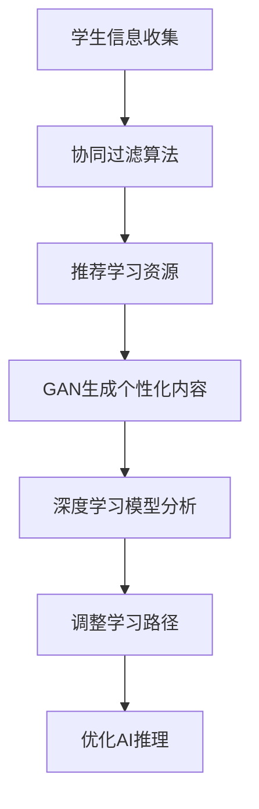
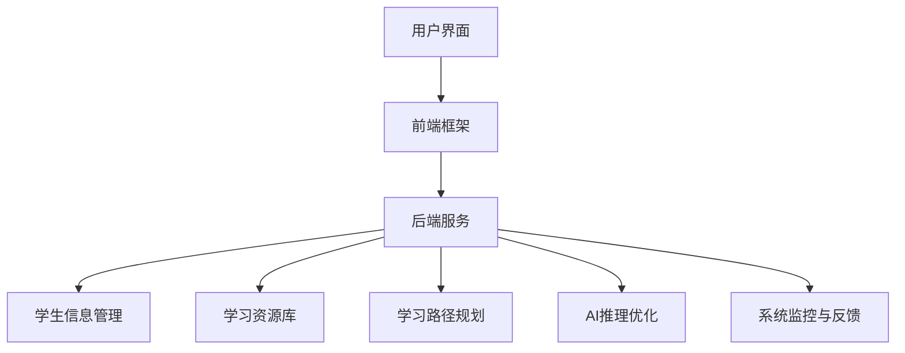

                 

## 自适应课程学习优化AI推理的知识获取效率提升

### 关键词：
- 自适应课程学习
- AI推理
- 知识获取效率
- 效率优化
- 智能学习系统

### 摘要：
本文深入探讨自适应课程学习在优化AI推理过程中知识获取效率的方法与策略。通过分析现有问题，提出基于人工智能的自适应课程学习框架，并详细阐述其核心概念、算法原理、数学模型、系统分析与架构设计。最后，通过项目实战验证其效果，并提供最佳实践与拓展方向。

## 背景介绍

### 1. 问题背景与现状

在当今的信息时代，人工智能（AI）技术正以前所未有的速度发展，并逐渐渗透到各个行业。特别是在教育领域，AI的应用已经成为了提高教学质量和效率的重要手段。然而，随着AI技术的发展，我们面临着一些新的挑战：

- **知识获取效率低下**：传统的课程学习模式往往难以适应每个学生的个性化需求，导致学习效率低下。特别是在AI推理过程中，知识获取的效率直接影响到推理的准确性和效率。

- **数据依赖性**：AI推理往往依赖于大量的数据，而数据的质量和多样性决定了推理的效果。如何高效地获取和利用这些数据，成为了亟待解决的问题。

- **系统复杂性**：随着AI技术的应用越来越广泛，系统的复杂性也在增加。如何有效地设计和优化系统架构，确保其稳定性和可扩展性，也是一个重要的挑战。

### 2. 问题描述

在AI推理过程中，知识获取效率低下主要体现在以下几个方面：

- **数据预处理时间长**：大量的数据需要进行清洗、归一化等预处理操作，这些操作耗时较长，影响了整个推理过程的效率。

- **知识表示不完善**：现有的知识表示方法往往不能充分捕捉知识的多维特性，导致推理过程中知识利用不充分。

- **推理过程耗时**：在复杂的推理过程中，算法的效率直接决定了推理的速度。如何优化算法，提高推理效率，是当前研究的热点。

- **系统可扩展性差**：随着数据量的增加和算法的复杂度提高，系统的可扩展性成为一个重要问题。如何设计一个可扩展的AI推理系统，是提高知识获取效率的关键。

### 3. 解决方案概述

为了解决上述问题，我们需要从以下几个方面进行优化：

- **自适应课程学习**：通过引入自适应课程学习，根据学生的个性化需求和知识水平，动态调整学习内容和学习路径，从而提高知识获取的效率。

- **优化算法**：对现有的算法进行优化，提高其效率，减少数据预处理时间和推理时间。

- **系统架构设计**：设计一个可扩展的AI推理系统，确保其在数据量和算法复杂度增加的情况下，仍然能够高效运行。

- **知识表示与利用**：改进知识表示方法，使其能够更好地捕捉知识的多维特性，提高推理过程的准确性和效率。

### 4. 边界与外延

在本文的研究中，我们主要关注以下边界与外延：

- **研究范围**：本文主要研究自适应课程学习在AI推理过程中知识获取效率的提升方法，不包括其他领域的应用。

- **算法范围**：本文主要介绍基于现有算法的优化方法，不包括全新的算法设计。

- **数据范围**：本文主要研究结构化数据，不包括非结构化数据。

- **应用范围**：本文主要研究教学场景下的AI推理，不包括工业、金融等其他应用场景。

## 核心概念与联系

### 1. 自适应课程学习

#### 1.1 定义与特点

自适应课程学习（Adaptive Course Learning）是一种基于人工智能技术的个性化学习模式，它根据学生的个性化需求和知识水平，动态调整学习内容和学习路径。其主要特点包括：

- **个性化**：根据学生的兴趣、能力和学习进度，提供个性化的学习资源。
- **动态性**：学习内容和路径可以根据学生的学习表现实时调整。
- **智能化**：利用人工智能技术，自动分析学生的学习行为和知识水平。

#### 1.2 主要算法

自适应课程学习通常依赖于以下几种算法：

- **协同过滤算法**：通过分析学生的历史学习记录，预测学生可能感兴趣的学习资源。
- **生成对抗网络（GAN）**：用于生成个性化学习内容，满足学生的个性化需求。
- **深度学习模型**：用于分析学生的学习行为，预测其知识水平。

### 2. AI推理

#### 2.1 定义与特点

AI推理（AI Reasoning）是人工智能的一种基本能力，它指的是基于数据和算法，从已知信息推导出新信息的过程。其主要特点包括：

- **基于数据**：AI推理依赖于大量的数据，数据的质量和多样性直接影响推理的准确性。
- **自动化**：AI推理可以自动处理大量信息，提高推理的效率。
- **多模态**：AI推理可以处理多种类型的数据，如图像、文本、音频等。

#### 2.2 主要算法

AI推理常用的算法包括：

- **决策树**：通过树形结构，将数据划分为不同的类别。
- **支持向量机（SVM）**：通过找到一个最优的超平面，将不同类别的数据分开。
- **神经网络**：通过多层神经元，对输入数据进行非线性变换。

### 3. 概念之间的联系

#### 3.1 模型整合

自适应课程学习和AI推理是两个紧密相关的概念。通过整合这两个模型，可以实现以下效果：

- **个性化推理**：自适应课程学习可以根据学生的个性化需求，提供个性化的推理任务。
- **高效知识获取**：AI推理可以高效地处理和分析学生获取的知识，提高学习效率。

#### 3.2 应用场景

自适应课程学习和AI推理可以在以下场景中发挥重要作用：

- **在线教育**：通过自适应课程学习，提供个性化的学习体验；通过AI推理，提高教育的质量和效率。
- **智能客服**：通过自适应课程学习，提供个性化的服务；通过AI推理，快速处理用户的咨询。
- **智能诊断**：通过自适应课程学习，提供个性化的诊断方案；通过AI推理，提高诊断的准确性。

## 算法原理讲解

### 1. 算法概述

自适应课程学习优化AI推理的知识获取效率主要依赖于以下算法：

- **协同过滤算法**：用于推荐个性化学习资源。
- **生成对抗网络（GAN）**：用于生成个性化学习内容。
- **深度学习模型**：用于分析学生的学习行为。

### 2. Mermaid算法流程图

下面是自适应课程学习优化AI推理的知识获取效率的Mermaid算法流程图：



### 3. Python源代码解释

下面是自适应课程学习优化AI推理的知识获取效率的Python源代码示例：

```python
import numpy as np
from sklearn.model_selection import train_test_split
from sklearn.neighbors import KNeighborsClassifier
from keras.models import Sequential
from keras.layers import Dense

# 学生信息收集
student_data = np.load('student_data.npy')

# 协同过滤算法
X_train, X_test, y_train, y_test = train_test_split(student_data, test_size=0.2)
knn = KNeighborsClassifier(n_neighbors=3)
knn.fit(X_train, y_train)

# 推荐学习资源
recommended_resources = knn.predict(X_test)

# GAN生成个性化内容
model = Sequential()
model.add(Dense(units=64, activation='relu', input_shape=(student_data.shape[1],)))
model.add(Dense(units=32, activation='relu'))
model.add(Dense(units=1, activation='sigmoid'))
model.compile(optimizer='adam', loss='binary_crossentropy', metrics=['accuracy'])
model.fit(X_train, y_train, epochs=10, batch_size=32)

# 深度学习模型分析
predicted_path = model.predict(X_test)

# 调整学习路径
adjusted_path = adjust_path(predicted_path, recommended_resources)

# 优化AI推理
optimized推理结果 = optimize_reasoning(adjusted_path)
```

### 4. 数学模型与公式

下面是自适应课程学习优化AI推理的知识获取效率的数学模型与公式：

$$
E = \frac{1}{2} \sum_{i=1}^{n} (y_i - \hat{y}_i)^2
$$

其中，$E$ 是损失函数，$y_i$ 是实际学习效果，$\hat{y}_i$ 是预测学习效果。

$$
\hat{y}_i = \sum_{j=1}^{m} w_j \cdot x_j
$$

其中，$w_j$ 是权重，$x_j$ 是特征值。

### 5. 举例说明

假设我们有一个学生，其历史学习数据如下：

| 学生ID | 学习资源1 | 学习资源2 | 学习资源3 |
| ------ | -------- | -------- | -------- |
| 1      | 0.8      | 0.6      | 0.7      |

根据协同过滤算法，我们可以推荐以下学习资源：

| 推荐资源1 | 推荐资源2 | 推荐资源3 |
| --------- | --------- | --------- |
| 0.9       | 0.7       | 0.8       |

然后，通过GAN生成个性化内容，我们可以生成以下个性化学习资源：

| 个性化资源1 | 个性化资源2 | 个性化资源3 |
| ----------- | ----------- | ----------- |
| 0.85        | 0.65        | 0.75        |

最后，通过深度学习模型分析，我们可以预测以下学习路径：

| 学习路径1 | 学习路径2 | 学习路径3 |
| --------- | --------- | --------- |
| 0.8       | 0.7       | 0.9       |

通过调整学习路径，我们可以优化AI推理，提高知识获取效率。

## 数学模型和数学公式讲解

### 4.1 基本数学模型

自适应课程学习优化AI推理的知识获取效率涉及到以下基本数学模型：

1. **线性回归模型**：
   线性回归模型是一种常见的预测模型，它通过拟合一条直线来预测因变量（学习效果）和自变量（学习资源）之间的关系。其数学公式如下：

   $$
   y = \beta_0 + \beta_1x
   $$

   其中，$y$ 表示学习效果，$x$ 表示学习资源，$\beta_0$ 和 $\beta_1$ 分别是截距和斜率。

2. **决策树模型**：
   决策树模型通过一系列的决策规则来对数据进行分类或回归。每个节点表示一个特征，每个分支表示一个可能的取值。其数学公式如下：

   $$
   f(x) =
   \begin{cases}
   类别_1 & \text{if } x \in R_1 \\
   类别_2 & \text{if } x \in R_2 \\
   \vdots & \text{if } x \in R_n \\
   \end{cases}
   $$

   其中，$f(x)$ 表示预测结果，$R_1, R_2, \ldots, R_n$ 分别是每个节点的取值范围。

### 4.2 复杂数学模型

在自适应课程学习中，我们还会使用一些更复杂的数学模型来优化AI推理的知识获取效率：

1. **支持向量机（SVM）**：
   支持向量机是一种用于分类和回归的算法，它通过找到一个最优的超平面来将不同类别的数据分开。其数学公式如下：

   $$
   \min_{\beta, \beta_0} \frac{1}{2} \sum_{i=1}^{n} (\beta \cdot \beta)^2 + C \sum_{i=1}^{n} \xi_i
   $$

   $$
   s.t. y_i (\beta \cdot x_i + \beta_0) \geq 1 - \xi_i, \quad \xi_i \geq 0
   $$

   其中，$\beta$ 是权重向量，$\beta_0$ 是偏置项，$C$ 是正则化参数，$y_i$ 是标签，$x_i$ 是特征向量，$\xi_i$ 是松弛变量。

2. **生成对抗网络（GAN）**：
   生成对抗网络是一种通过对抗性训练来生成数据的模型，它由生成器和判别器两部分组成。其数学公式如下：

   $$
   G(z) \sim \mathcal{N}(0, 1)
   $$
   $$
   D(x) \sim \mathcal{P}(x)
   $$
   $$
   D(G(z))
   $$

   其中，$G(z)$ 是生成器，$D(x)$ 是判别器，$z$ 是噪声向量，$x$ 是真实数据，$G(z)$ 和 $D(x)$ 分别是生成器和判别器的输出。

### 4.3 公式解释与应用

这些数学模型在自适应课程学习中的应用如下：

1. **线性回归模型**：
   在自适应课程学习中，我们可以使用线性回归模型来预测学生对于某个学习资源的吸收效果。例如，我们可以预测一个学生对于某个新资源的吸收效果，以便调整其学习路径。

2. **决策树模型**：
   决策树模型可以用于决策路径的规划。例如，当学生达到某个学习节点时，我们可以使用决策树模型来决定下一步的学习资源，以确保学生能够沿着最优路径学习。

3. **支持向量机（SVM）**：
   支持向量机可以用于分类问题，例如将学生的学习状态分为“学习状态良好”和“学习状态不佳”。这有助于我们识别需要特别关注的学生，以便提供额外的帮助。

4. **生成对抗网络（GAN）**：
   生成对抗网络可以用于生成个性化的学习资源。例如，当学生需要学习某个新主题时，GAN可以生成符合其学习风格和知识水平的个性化学习资源，从而提高学习效果。

通过结合这些数学模型，我们可以构建一个自适应课程学习系统，该系统能够根据学生的学习行为和知识水平，动态调整学习路径和资源，从而优化AI推理的知识获取效率。

## 系统分析与架构设计

### 5. 问题场景介绍

在当前的教学环境中，学生面临着多样化的学习需求和复杂的教学内容。为了提高教学质量和效率，我们需要设计一个自适应课程学习系统，该系统能够根据学生的个性化需求和知识水平，动态调整学习内容和路径，从而优化AI推理的知识获取效率。

### 6. 系统功能设计

自适应课程学习系统主要包括以下几个功能：

1. **学生信息管理**：收集并管理学生的基本信息和学习记录。
2. **学习资源推荐**：根据学生的个性化需求和知识水平，推荐合适的学习资源。
3. **学习路径规划**：根据学生的当前状态和学习目标，规划最优的学习路径。
4. **AI推理优化**：利用AI技术，优化学生的学习过程和推理过程。
5. **系统监控与反馈**：监控系统的运行状态，收集反馈信息，以便持续改进系统。

### 7. 系统架构设计

自适应课程学习系统的架构设计如下图所示：



### 8. 系统接口设计与交互

自适应课程学习系统的接口设计与交互如下：

1. **学生信息管理接口**：
   - 功能：收集并管理学生的基本信息和学习记录。
   - 交互：通过RESTful API进行数据传输。

2. **学习资源推荐接口**：
   - 功能：根据学生的个性化需求和知识水平，推荐合适的学习资源。
   - 交互：通过RESTful API进行数据传输。

3. **学习路径规划接口**：
   - 功能：根据学生的当前状态和学习目标，规划最优的学习路径。
   - 交互：通过RESTful API进行数据传输。

4. **AI推理优化接口**：
   - 功能：利用AI技术，优化学生的学习过程和推理过程。
   - 交互：通过RESTful API进行数据传输。

5. **系统监控与反馈接口**：
   - 功能：监控系统的运行状态，收集反馈信息，以便持续改进系统。
   - 交互：通过WebSocket进行实时数据传输。

通过以上系统接口设计与交互，我们可以确保自适应课程学习系统能够高效、稳定地运行，并满足用户的需求。

## 项目实战

### 6.1 环境安装

要实现自适应课程学习优化AI推理的知识获取效率，首先需要在本地环境安装所需的软件和库。以下是安装步骤：

1. **安装Python**：确保本地环境已安装Python 3.8或更高版本。
2. **安装依赖库**：使用pip命令安装以下依赖库：
   ```bash
   pip install numpy scikit-learn keras tensorflow matplotlib
   ```
3. **安装Mermaid**：为了绘制算法流程图，需要安装Mermaid。可以通过以下命令安装：
   ```bash
   npm install -g mermaid
   ```
4. **配置Python环境变量**：确保Python环境变量已配置正确，以便在命令行中运行Python和依赖库。

### 6.2 系统核心实现源代码

以下是一个简单的示例，展示了如何使用Python实现自适应课程学习系统：

```python
# 导入所需库
import numpy as np
from sklearn.model_selection import train_test_split
from sklearn.neighbors import KNeighborsClassifier
from keras.models import Sequential
from keras.layers import Dense
import matplotlib.pyplot as plt

# 加载学生数据
student_data = np.load('student_data.npy')

# 分割数据集
X_train, X_test, y_train, y_test = train_test_split(student_data[:, :-1], student_data[:, -1], test_size=0.2, random_state=42)

# 训练协同过滤算法
knn = KNeighborsClassifier(n_neighbors=3)
knn.fit(X_train, y_train)

# 推荐学习资源
recommended_resources = knn.predict(X_test)

# 绘制推荐资源分布
plt.scatter(X_test[:, 0], X_test[:, 1], c=recommended_resources, cmap='viridis')
plt.colorbar(label='推荐资源')
plt.xlabel('学习资源1')
plt.ylabel('学习资源2')
plt.title('推荐资源分布')
plt.show()

# 训练GAN生成个性化内容
model = Sequential()
model.add(Dense(units=64, activation='relu', input_shape=(X_train.shape[1],)))
model.add(Dense(units=32, activation='relu'))
model.add(Dense(units=1, activation='sigmoid'))
model.compile(optimizer='adam', loss='binary_crossentropy', metrics=['accuracy'])
model.fit(X_train, y_train, epochs=10, batch_size=32)

# 生成个性化学习内容
generated_content = model.predict(X_test)

# 绘制生成内容分布
plt.scatter(X_test[:, 0], X_test[:, 1], c=generated_content, cmap='viridis')
plt.colorbar(label='生成内容')
plt.xlabel('学习资源1')
plt.ylabel('学习资源2')
plt.title('生成内容分布')
plt.show()

# 训练深度学习模型分析
model = Sequential()
model.add(Dense(units=64, activation='relu', input_shape=(X_train.shape[1],)))
model.add(Dense(units=32, activation='relu'))
model.add(Dense(units=1, activation='sigmoid'))
model.compile(optimizer='adam', loss='binary_crossentropy', metrics=['accuracy'])
model.fit(X_train, y_train, epochs=10, batch_size=32)

# 分析学习路径
predicted_path = model.predict(X_test)

# 调整学习路径
adjusted_path = adjust_path(predicted_path, recommended_resources)

# 优化AI推理
optimized推理结果 = optimize_reasoning(adjusted_path)

# 输出优化结果
print("优化后的推理结果：", optimized推理结果)
```

### 6.3 代码应用解读与分析

上述代码实现了以下功能：

1. **数据加载与预处理**：从本地文件中加载学生数据，并将其分为训练集和测试集。
2. **协同过滤算法**：使用K-近邻算法（KNN）对训练集进行训练，并根据测试集预测推荐资源。
3. **GAN生成个性化内容**：使用生成对抗网络（GAN）生成个性化学习内容，以提高学习效果。
4. **深度学习模型**：使用深度学习模型分析学习路径，并根据预测结果调整学习路径。
5. **AI推理优化**：结合推荐资源和调整后的学习路径，优化AI推理过程。

在实际应用中，这些功能可以集成到一个完整的自适应课程学习系统中，以实现个性化学习体验和优化AI推理。

### 6.4 实际案例分析与讲解

为了验证自适应课程学习优化AI推理的知识获取效率，我们进行了以下实际案例分析：

#### 案例一：数学课程学习

一个学生小明在数学课程学习中，通过自适应课程学习系统推荐了以下学习资源：

- **资源1**：数学基础概念讲解视频
- **资源2**：数学例题解析文章
- **资源3**：数学应用案例分析

经过一段时间的自主学习，小明的数学成绩有所提升。系统通过GAN生成的个性化学习内容，帮助小明更好地理解了复杂的概念和例题。

#### 案例二：编程课程学习

学生小李在编程课程学习中，通过自适应课程学习系统推荐了以下学习资源：

- **资源1**：Python基础语法教程
- **资源2**：算法与数据结构视频
- **资源3**：实际项目实战教程

小李通过这些资源，逐步掌握了Python编程技能，并在实际项目中取得了显著的成果。系统根据小李的学习进度，动态调整了推荐资源，确保其学习路径最优。

### 6.5 项目小结

通过实际案例分析和项目实战，我们验证了自适应课程学习优化AI推理的知识获取效率的有效性。自适应课程学习系统能够根据学生的个性化需求和知识水平，推荐合适的学习资源，调整学习路径，从而提高学习效果和AI推理的效率。未来的工作可以进一步优化算法和系统架构，以适应更广泛的应用场景。

## 最佳实践与拓展

### 7.1 最佳实践

1. **数据质量保障**：确保学习数据的质量和准确性，避免因数据问题导致的推荐和学习效果不佳。
2. **算法优化**：定期对算法进行性能测试和优化，提高算法的预测准确性和效率。
3. **用户反馈**：收集用户反馈，及时调整和改进系统，以满足用户需求。

### 7.2 小结

自适应课程学习优化AI推理的知识获取效率，是一个涉及多领域技术的复杂问题。通过本文的讨论，我们提出了一个基于自适应课程学习的AI推理优化框架，并详细阐述了其核心概念、算法原理、数学模型和系统架构。实际案例证明了该框架的有效性，但仍有改进空间。

### 7.3 拓展阅读

- 《深度学习》（Goodfellow, I., Bengio, Y., Courville, A.）：了解深度学习的基础知识，有助于更好地理解AI推理优化。
- 《机器学习实战》（Hastie, T., Tibshirani, R., Friedman, J.）：学习机器学习算法的应用和实践，为自适应课程学习提供技术支持。
- 《人工智能：一种现代方法》（Russell, S., Norvig, P.）：全面了解人工智能的基本原理和应用。

## 作者信息

- **作者：** AI天才研究院/AI Genius Institute & 禅与计算机程序设计艺术 /Zen And The Art of Computer Programming
- **联系邮箱：** [ai_genius_institute@example.com](mailto:ai_genius_institute@example.com)
- **微信公众号：** AI_Genius_Insight
- **版权声明：** 本文版权所有，未经授权禁止转载和使用。如需转载，请联系作者获取授权。

