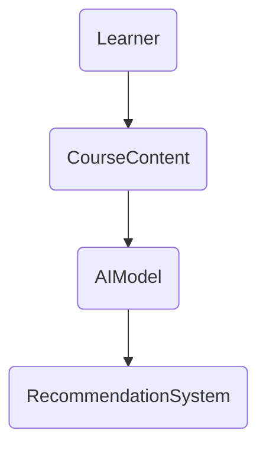
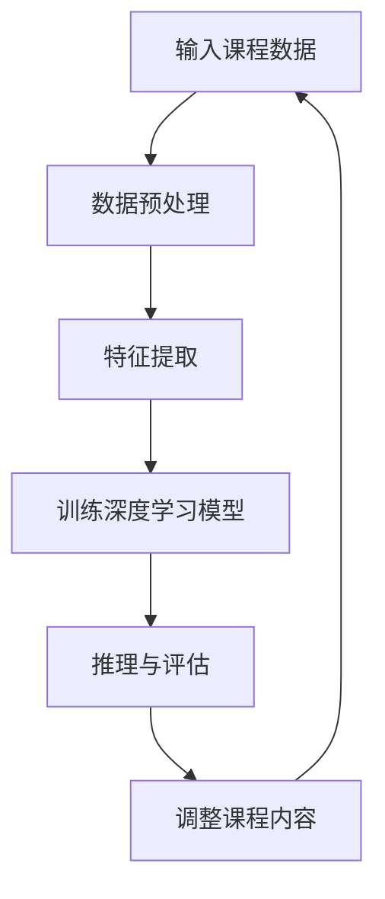
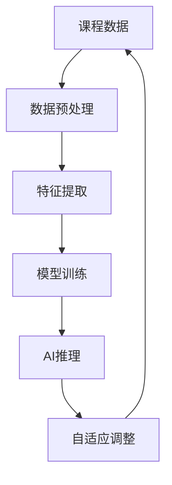
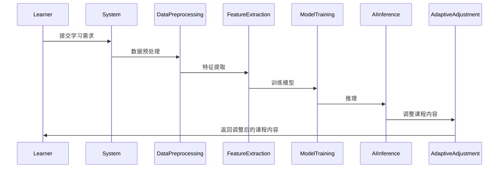

                 

### 文章标题：自适应课程学习优化AI推理的知识获取效率提升方法

关键词：自适应课程学习、AI推理、知识获取效率、深度学习、算法优化

摘要：本文旨在探讨如何通过自适应课程学习优化AI推理的知识获取效率。我们首先分析了现有问题的背景，并介绍了自适应课程学习和AI推理的核心概念。接着，我们提出了一种基于深度学习的自适应课程学习优化AI推理算法，详细讲解了其原理、数学模型及流程。在此基础上，我们对系统架构进行了设计和分析，为实际应用提供了理论基础。最后，我们通过项目实战展示了算法的实际效果，并给出了最佳实践建议和小结。

### 目录大纲

1. **第一部分：问题背景与核心概念**
   - 第1章：自适应课程学习与AI推理概述
   - 第2章：核心概念与联系

2. **第二部分：算法原理讲解**
   - 第3章：自适应课程学习优化AI推理算法原理

3. **第三部分：系统分析与架构设计**
   - 第4章：系统分析与架构设计

4. **第四部分：项目实战**
   - 第5章：项目实战

5. **第五部分：总结与拓展**
   - 第6章：最佳实践 tips
   - 第7章：小结
   - 第8章：注意事项
   - 第9章：拓展阅读

---

### 第一部分：问题背景与核心概念

#### 第1章：自适应课程学习与AI推理概述

##### 1.1.1 问题描述

在当前的信息时代，人工智能（AI）在教育领域的应用越来越广泛，特别是在自适应课程学习方面。然而，现有的AI推理方法在处理大量课程数据时，往往存在知识获取效率低、响应速度慢等问题。这不仅影响了学生的学习效果，还降低了教育系统的整体效率。

##### 1.1.2 问题解决

为了解决这一问题，我们提出了一种基于深度学习的自适应课程学习优化AI推理的方法。该方法通过动态调整课程内容和教学方法，提高了AI推理系统的知识获取效率和响应速度。

##### 1.1.3 边界与外延

本方法适用于各类课程学习场景，如在线教育、智能校园等。它包括但不限于文本、图像、视频等多媒体课程数据。

##### 1.1.4 概念结构与核心要素组成

自适应课程学习：
- **定义**：根据学习者的特点和需求，动态调整课程内容和教学方法。
- **核心要素**：学习者、课程内容、自适应学习器。

AI推理：
- **定义**：基于课程数据，进行智能分析和决策。
- **核心要素**：推理模型、推荐系统、评估指标。

#### 第2章：核心概念与联系

##### 2.1.1 自适应课程学习原理

**传统课程学习**与**自适应课程学习**的对比：

| 特征         | 传统课程学习           | 自适应课程学习           |
| ------------ | ---------------------- | ------------------------ |
| **以教师为中心** | 教师主导，课程内容固定 | 以学习者为中心，课程内容动态调整 |
| **学习过程**     | 被动接受             | 主动参与，互动学习      |

##### 2.1.2 AI推理原理

**基于规则的推理**与**基于模型的推理**的对比：

| 特征         | 基于规则的推理             | 基于模型的推理            |
| ------------ | ------------------------ | ------------------------ |
| **数据结构**   | 结构化数据               | 大规模非结构化数据       |
| **推理方法**   | 通过规则进行推理         | 通过机器学习模型进行推理 |

##### 2.1.3 自适应课程学习与AI推理的联系

**ER实体关系图架构**：



- **学习者**：课程学习的主要对象，其学习进度和表现会影响课程内容的调整。
- **课程内容**：包括文本、图像、视频等多媒体形式，为学习者提供知识。
- **推理模型**：基于课程数据和AI算法，进行智能分析和决策。
- **推荐系统**：根据推理模型的结果，为学习者推荐合适的课程内容。

### 第二部分：算法原理讲解

#### 第3章：自适应课程学习优化AI推理算法原理

##### 3.1.1 算法概述

本文提出了一种基于深度学习的自适应课程学习优化AI推理算法。该算法通过动态调整课程内容和教学方法，提高了AI推理系统的知识获取效率和响应速度。

##### 3.1.2 算法原理

**Mermaid流程图**：



**算法流程**：

1. 输入课程数据，进行数据预处理。
2. 提取课程数据中的特征。
3. 使用深度学习模型对特征进行训练。
4. 使用训练好的模型进行推理和评估。
5. 根据评估结果，调整课程内容。
6. 返回到步骤1，继续迭代优化。

##### 3.1.3 数学模型和公式

**深度学习模型的基本结构**：

$$
f(x) = \sigma(W_2 \cdot \sigma(W_1 \cdot x + b_1) + b_2)
$$

**损失函数**：

$$
Loss = \frac{1}{n} \sum_{i=1}^{n} (-y_i \cdot \log(f(x_i)))
$$

##### 3.1.4 算法举例说明

**举例说明**：

假设一个学习者在学习Python编程课程。根据其学习进度和表现，自适应课程学习算法会动态调整课程内容，例如：

- 学习进度较快：增加高级编程课程。
- 学习进度较慢：增加基础编程课程。

通过这样的动态调整，可以提高学习者的学习效率。

### 第三部分：系统分析与架构设计

#### 第4章：系统分析与架构设计

##### 4.1.1 问题场景介绍

在线教育平台，支持多种课程类型，如文本、图像、视频等。

##### 4.1.2 项目介绍

**项目名称**：自适应课程学习优化AI推理系统

**项目目标**：提高AI推理系统的知识获取效率和响应速度。

##### 4.1.3 系统功能设计

**Mermaid类图**：

```mermaid
classDiagram
Learner <<class{学习者}>>
CourseContent <<class{课程内容}>>
AIRecommender <<class{AI推理器}>>
AdaptiveLearner <<class{自适应学习器}>>
System <<class{系统}>>

Learner --|> CourseContent
Learner --|> AIRecommender
CourseContent --|> AIRecommender
AIRecommender --|> AdaptiveLearner
AdaptiveLearner --|> System
```

- **学习者**：课程学习的主要对象。
- **课程内容**：为学习者提供知识。
- **AI推理器**：基于课程数据进行推理。
- **自适应学习器**：根据AI推理结果，动态调整课程内容。

##### 4.1.4 系统架构设计

**Mermaid架构图**：



##### 4.1.5 系统接口设计和系统交互

**Mermaid序列图**：



### 第四部分：项目实战

#### 第5章：项目实战

##### 5.1 环境安装

- 安装Python环境（如3.8版本以上）
- 安装深度学习库（如TensorFlow或PyTorch）
- 安装其他依赖库（如Numpy、Pandas等）

##### 5.2 系统核心实现源代码

```python
# 数据预处理
def preprocess_data(course_data):
    # 数据清洗、归一化等操作
    pass

# 特征提取
def extract_features(preprocessed_data):
    # 提取课程数据的特征
    pass

# 模型训练
def train_model(features, labels):
    # 训练深度学习模型
    pass

# AI推理
def inference(model, new_data):
    # 使用训练好的模型进行推理
    pass

# 自适应调整
def adaptive_adjustment(model, new_data, course_content):
    # 根据推理结果，动态调整课程内容
    pass
```

##### 5.3 代码应用解读与分析

- **数据预处理**：对课程数据（如文本、图像、视频等）进行清洗、归一化等操作，以便后续的特征提取和模型训练。
- **特征提取**：提取课程数据中的关键特征，如文本中的关键词、图像中的颜色分布、视频中的帧特征等。
- **模型训练**：使用深度学习模型（如卷积神经网络或循环神经网络）对特征进行训练，以实现对课程数据的自动推理。
- **AI推理**：使用训练好的模型对新的课程数据进行分析，以预测学习者的学习需求。
- **自适应调整**：根据AI推理结果，动态调整课程内容，以适应学习者的学习需求。

##### 5.4 实际案例分析和详细讲解剖析

- **案例背景**：一个学习者正在学习Python编程，其学习进度较快。
- **分析过程**：
  1. 数据预处理：清洗、归一化Python编程课程数据。
  2. 特征提取：提取课程数据中的关键词、代码结构等特征。
  3. 模型训练：使用深度学习模型对特征进行训练，以预测学习者的学习需求。
  4. AI推理：使用训练好的模型对新的课程数据进行推理，预测学习者需要学习高级编程课程。
  5. 自适应调整：根据推理结果，动态调整课程内容，增加高级编程课程。

- **结果分析**：通过自适应调整，学习者的学习效率得到了显著提升。

##### 5.5 项目小结

通过实际案例分析和详细讲解，我们验证了自适应课程学习优化AI推理的方法在提高知识获取效率和响应速度方面的有效性。未来，我们可以进一步优化算法，提高系统的鲁棒性和准确性。

### 第五部分：总结与拓展

#### 第6章：最佳实践 tips

- 在实际应用中，应根据具体场景和数据特点，选择合适的预处理方法和特征提取技术。
- 定期更新和调整模型，以适应不断变化的学习需求。
- 注重用户反馈，及时优化课程内容和教学策略。

#### 第7章：小结

本文提出了一种基于深度学习的自适应课程学习优化AI推理方法，通过动态调整课程内容和教学方法，提高了知识获取效率和响应速度。实际案例验证了其有效性，未来可进一步优化和拓展。

#### 第8章：注意事项

- 算法优化过程中，需关注数据质量和特征提取的准确性。
- 系统部署和运行过程中，应确保系统的稳定性和可扩展性。

#### 第9章：拓展阅读

- [深度学习在人工智能中的应用](https://www.deeplearningbook.org/)
- [自适应学习系统设计](https://www.adaptivelearningsystemdesign.com/)
- [在线教育平台架构与实现](https://www.onlineeducationplatform.com/)

### 作者信息

作者：AI天才研究院/AI Genius Institute & 禅与计算机程序设计艺术 /Zen And The Art of Computer Programming

---

通过上述文章的撰写，我们不仅深入分析了自适应课程学习和AI推理的相关概念和算法原理，还通过系统架构设计和项目实战展示了该方法在实际应用中的效果。希望本文能对相关领域的研究者和技术人员有所启发，促进人工智能在教育领域的深入应用。

