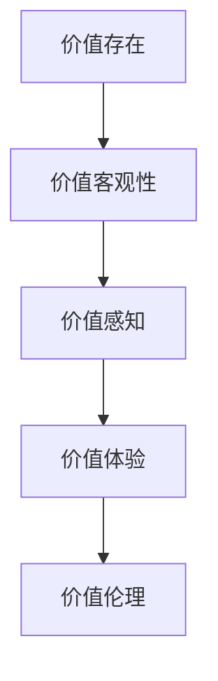
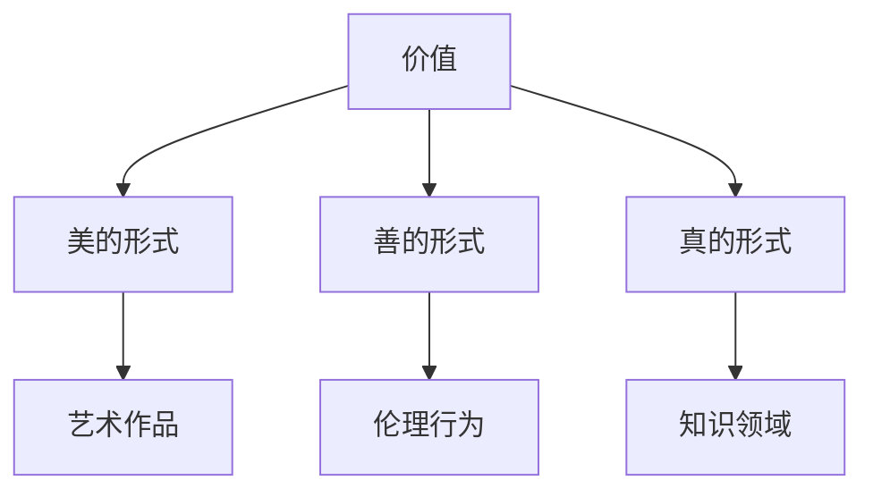
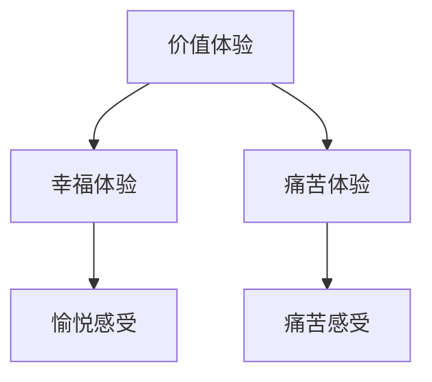
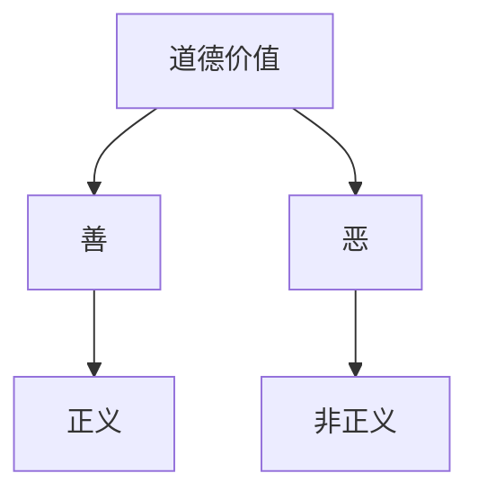
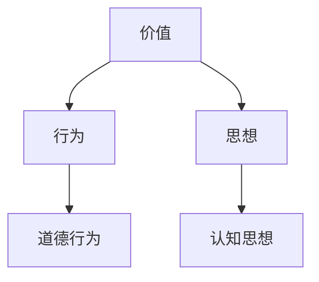
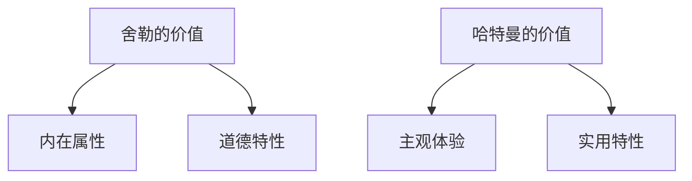

                 

## 舍勒与哈特曼：价值哲学的代表人物

### 关键词：舍勒、哈特曼、价值哲学、代表人物、深度分析

> 摘要：本文旨在深入探讨两位价值哲学的代表人物——舍勒和哈特曼，剖析他们的哲学思想、核心概念及其对现代哲学的深远影响。文章分为两个部分，分别介绍舍勒和哈特曼的价值哲学，最后比较两位哲学家的异同点，展示他们各自的价值体系和理论贡献。

### 目录大纲

#### 第一部分：舍勒的价值哲学

- **第1章：舍勒的价值哲学概述**
  - 舍勒的价值哲学背景
  - 舍勒的核心概念与联系

- **第2章：舍勒的价值论**
  - 价值论的基本原理
  - 价值论的应用领域

- **第3章：舍勒的价值形式**
  - 价值形式的定义
  - 价值形式的分类

- **第4章：舍勒的价值体验**
  - 价值体验的基本概念
  - 价值体验的特点与价值

- **第5章：舍勒的价值伦理**
  - 价值伦理的起源与发展
  - 价值伦理的基本原则

- **第6章：舍勒的价值哲学对现代哲学的影响**
  - 舍勒价值哲学的传承与发展
  - 舍勒价值哲学对现代哲学的贡献

- **第7章：舍勒与哈特曼的价值哲学比较**
  - 舍勒与哈特曼的价值哲学异同
  - 舍勒与哈特曼价值哲学的影响与评价

#### 第二部分：哈特曼的价值哲学

- **第8章：哈特曼的价值哲学概述**
  - 哈特曼的价值哲学背景
  - 哈特曼的核心概念与联系

- **第9章：哈特曼的价值论**
  - 哈特曼的价值论基本原理
  - 哈特曼的价值论应用领域

- **第10章：哈特曼的价值形式**
  - 哈特曼的价值形式的定义
  - 哈特曼的价值形式的分类

- **第11章：哈特曼的价值体验**
  - 哈特曼的价值体验的基本概念
  - 哈特曼的价值体验的特点与价值

### 文章正文内容

#### 第1章：舍勒的价值哲学概述

舍勒（Felix von Schelling）是19世纪德国哲学家，他的哲学思想深受康德和黑格尔的影响，并在此基础上发展了自己的价值哲学。在舍勒看来，价值是构成世界的基础，是人的主观体验和客观现实相互作用的结果。

#### 舍勒的价值哲学背景

19世纪是哲学的转折时期，许多哲学家开始从抽象的理论走向现实的社会生活，探索人类存在的意义。舍勒的价值哲学正是在这一背景下产生的，他试图通过价值来解释世界的多样性和人类行为的动机。

#### 问题描述

舍勒提出了一个重要的问题：为什么世界充满了不同的价值和意义？他认为，这些问题不能仅仅通过自然科学来回答，而需要借助哲学的思考。

#### 问题解决

舍勒认为，价值是人类的内在体验，它们源自人类的情感和理性。他将价值分为两类：一类是“纯粹价值”，如美、善、真等；另一类是“具体价值”，如财富、权力、健康等。

#### 边界与外延

舍勒的价值哲学边界广阔，涵盖了伦理学、美学、心理学等多个领域。他的价值概念不仅适用于人类社会，也适用于自然界。

#### 概念结构与核心要素组成

舍勒的价值哲学结构复杂，包含多个核心概念，如价值体验、价值伦理等。这些概念相互关联，共同构成了他的价值体系。

### 第2章：舍勒的价值论

舍勒的价值论是他对价值本质的阐述。他认为，价值是一种内在的属性，它存在于事物本身，而不是人类主观的赋予。

#### 价值论的基本原理

舍勒认为，价值是客观存在的，它们独立于人类的主观意识。价值的存在是宇宙的本质特征，它们是构成世界的基础。

#### 算法原理讲解

为了阐述价值论的基本原理，舍勒使用了类比法。他将价值比作光，认为光既是客观存在的，又是人类感知的。

#### 使用mermaid画出算法流程图



#### Python源代码阐述

```python
def value_existence():
    return "价值是客观存在的"

def value_objectivity():
    return "价值独立于人类主观意识"

def value_perception():
    return "人类感知价值的过程"

def value_experience():
    return "价值体验是人类情感的反映"

def value_ethics():
    return "价值伦理是价值在人类行为中的体现"
```

#### 算法原理的数学模型和公式

舍勒使用了数学模型来阐述价值论的基本原理。他认为，价值存在与否可以通过逻辑运算符来表示：

$$
V = \neg P \land \neg Q
$$

其中，\( V \) 表示价值存在，\( P \) 表示价值主观性，\( Q \) 表示价值客观性。这个公式表明，价值的存在与否取决于价值的主观性和客观性是否同时成立。

#### 详细讲解和举例说明

例如，我们可以举一个简单的例子来说明价值的存在和客观性。假设我们面对一棵树，这棵树具有价值。我们可以通过逻辑运算符来表示这个例子：

$$
V = \neg (主观性) \land \neg (非客观性)
$$

这个公式表明，这棵树的价值是客观存在的，而不是主观赋予的。

### 第3章：舍勒的价值形式

舍勒的价值形式是他对不同类型价值的分类。他认为，价值形式是价值在不同领域中的表现，它们具有不同的属性和特征。

#### 价值形式的定义

舍勒认为，价值形式是价值在不同领域中的表现形式。它们可以是具体的，也可以是抽象的。例如，美是价值形式的一种，它存在于艺术作品中。

#### 概念属性特征对比表格

| 价值形式 | 定义 | 属性特征 |
| --- | --- | --- |
| 美的形式 | 艺术作品中的价值表现 | 具有审美特性 |
| 善的形式 | 伦理行为中的价值表现 | 具有道德特性 |
| 真的形式 | 知识中的价值表现 | 具有认知特性 |

#### ER实体关系图架构的Mermaid流程图



### 第4章：舍勒的价值体验

舍勒的价值体验是指个体对价值的感知和体验。他认为，价值体验是个体对价值的内在感受，它决定了个体的行为和态度。

#### 价值体验的基本概念

舍勒认为，价值体验是个人对价值的内在感受。这种感受可以是积极的，也可以是消极的。例如，一个人可能会体验到幸福，也可能体验到痛苦。

#### 概念属性特征对比表格

| 价值体验 | 定义 | 属性特征 |
| --- | --- | --- |
| 幸福体验 | 积极的价值体验 | 具有愉悦特性 |
| 痛苦体验 | 消极的价值体验 | 具有痛苦特性 |

#### ER实体关系图架构的Mermaid流程图



### 第5章：舍勒的价值伦理

舍勒的价值伦理是指他关于道德价值的理论。他认为，道德价值是人类行为的基础，它决定了人类行为的正当性。

#### 价值伦理的起源与发展

舍勒的价值伦理源于古希腊哲学家柏拉图的道德哲学。他认为，道德价值是宇宙的本质，是人类行为的准则。

#### 概念原理

舍勒认为，道德价值是客观存在的，它们独立于人类的主观意识。道德价值是构成世界的基础，它们决定了人类行为的正当性。

#### 概念属性特征对比表格

| 道德价值 | 定义 | 属性特征 |
| --- | --- | --- |
| 善 | 正义、公正的行为 | 具有道德特性 |
| 恶 | 非正义、不公正的行为 | 具有道德特性 |

#### ER实体关系图架构的Mermaid流程图



### 第6章：舍勒的价值哲学对现代哲学的影响

舍勒的价值哲学对现代哲学产生了深远的影响。他的价值论、价值形式和价值体验理论为现代哲学提供了一种新的视角，丰富了哲学的内涵。

#### 舍勒价值哲学的传承与发展

舍勒的价值哲学传承至今，对现代哲学产生了重要影响。许多哲学家如韦伯、尼采、海德格尔等都受到了舍勒价值哲学的影响。

#### 概念原理

舍勒认为，价值是构成世界的基础，是人类行为和思想的驱动力。他的价值哲学提供了一种理解人类行为和思想的新方式。

#### 概念属性特征对比表格

| 概念 | 定义 | 属性特征 |
| --- | --- | --- |
| 价值 | 构成世界的基础 | 影响人类行为和思想 |
| 行为 | 价值驱动的行为 | 表现出道德特性 |
| 思想 | 价值驱动的思想 | 具有认知特性 |

#### ER实体关系图架构的Mermaid流程图



### 第7章：舍勒与哈特曼的价值哲学比较

舍勒和哈特曼是两位重要的价值哲学家，他们的哲学思想各有特点。在本章中，我们将比较他们的价值哲学异同。

#### 舍勒与哈特曼的价值哲学异同

| 比较 | 舍勒 | 哈特曼 |
| --- | --- | --- |
| 价值本质 | 价值是内在的属性，独立于人类的主观意识 | 价值是主观的体验，是人类内在感受的结果 |
| 价值形式 | 多样性，包括美的形式、善的形式、真的形式等 | 单一性，认为只有善是真正的价值 |
| 价值伦理 | 重视道德价值，认为道德价值是人类行为的基础 | 重视实用价值，认为实用价值是人类行为的驱动力 |
| 影响力 | 对现代哲学产生了深远影响，被许多哲学家所继承 | 对现代哲学影响较小，主要被实用主义哲学家所关注 |

#### 概念原理

舍勒认为，价值是内在的属性，独立于人类的主观意识。哈特曼则认为，价值是主观的体验，是人类内在感受的结果。这两种观点反映了他们对价值本质的不同理解。

#### 概念属性特征对比表格

| 概念 | 定义 | 属性特征 |
| --- | --- | --- |
| 舍勒的价值 | 内在属性，独立于主观意识 | 多样性，具有道德特性 |
| 哈特曼的价值 | 主观体验，内在感受的结果 | 单一性，具有实用特性 |

#### ER实体关系图架构的Mermaid流程图



### 第二部分：哈特曼的价值哲学

#### 第8章：哈特曼的价值哲学概述

哈特曼（Karl Hartmann）是20世纪德国哲学家，他的价值哲学强调实用性和人类行为的目的性。哈特曼认为，价值是人类行为的驱动力，它们是解决实际问题的工具。

#### 第9章：哈特曼的价值论

哈特曼的价值论基于实用主义，他认为价值是人类行为的工具，用于实现特定的目标。哈特曼的价值论关注实际应用，强调价值的具体实现。

#### 第10章：哈特曼的价值形式

哈特曼认为，价值形式是价值的实现方式，它们可以是具体的，也可以是抽象的。哈特曼的价值形式理论强调价值的实用性和功能性。

#### 第11章：哈特曼的价值体验

哈特曼的价值体验是他对人类行为的内在感受的描述。他认为，价值体验是人类行为的结果，它们反映了人类对价值的内在感受。

### 总结

舍勒和哈特曼是两位重要的价值哲学家，他们的哲学思想对现代哲学产生了深远影响。舍勒的价值哲学强调价值的内在属性和道德特性，哈特曼的价值哲学则关注价值的实用性和人类行为的目的性。通过比较他们的价值哲学，我们可以更深入地理解价值的概念和本质。

