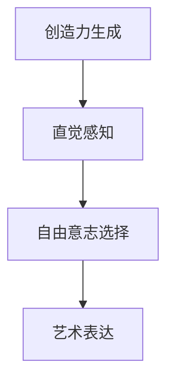
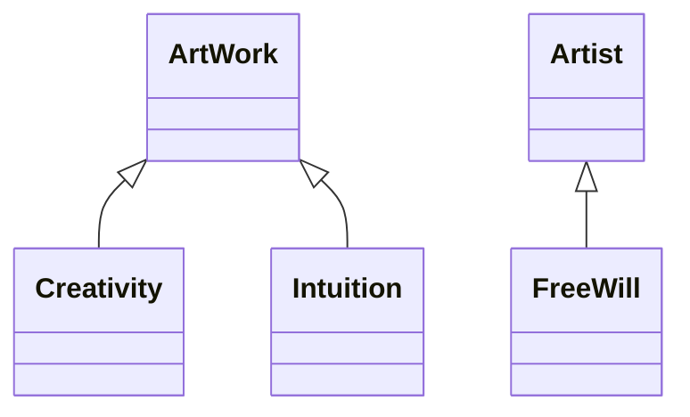
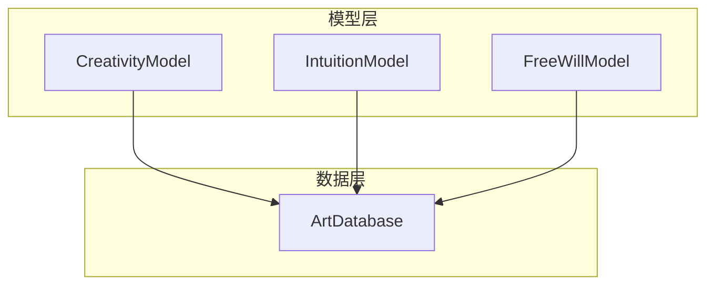
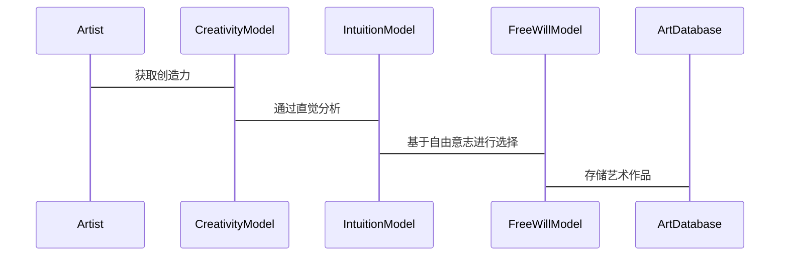
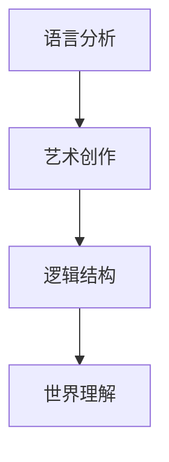
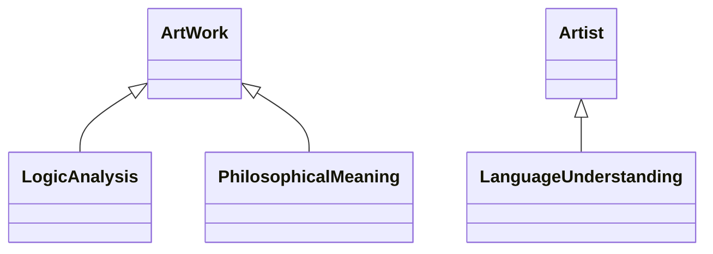
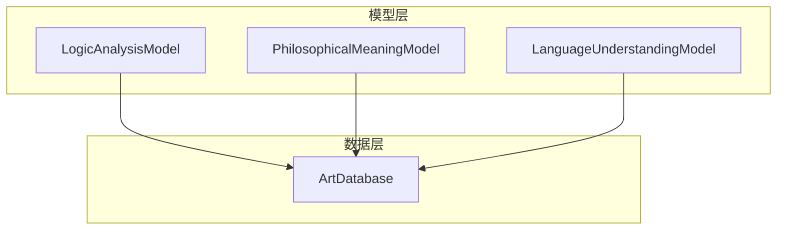
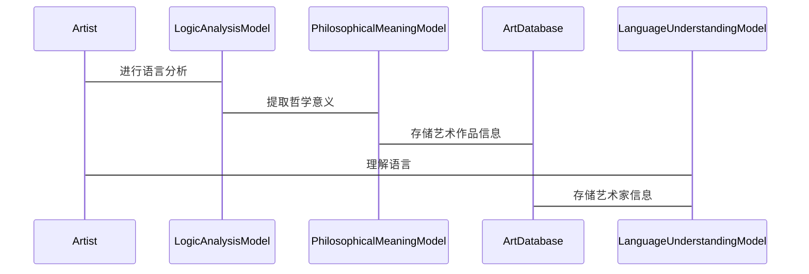

                 

# 《艺术创作中的柏格森主义与维特根斯坦思想影响》

## 关键词
艺术创作、柏格森主义、维特根斯坦思想、哲学与艺术的交叉、艺术运动

## 摘要
本文旨在探讨柏格森主义和维特根斯坦思想在艺术创作中的影响。通过对两位哲学家思想的深入分析，我们试图揭示这些哲学理论如何激发艺术家的创造力，并在绘画、雕塑、文学和表演等艺术领域中找到具体的体现。本文分为三个部分：第一部分介绍柏格森主义和维特根斯坦思想的基本概念及其对艺术创作的启示；第二部分通过案例研究，具体分析这两种思想在绘画、雕塑、文学、表演等艺术领域中的应用；第三部分综合分析这两种思想在艺术创作中的共同影响和未来发展趋势。

### 目录大纲

# 《艺术创作中的柏格森主义与维特根斯坦思想影响》

## 第一部分：背景与理论

### 第1章：柏格森主义与维特根斯坦思想概述
#### 1.1 柏格森主义：历史、核心理论与影响
#### 1.2 维特根斯坦思想：历史、核心理论与影响
#### 1.3 柏格森主义与维特根斯坦思想的异同

### 第2章：艺术创作中的柏格森主义
#### 2.1 柏格森主义对艺术创作的启发
#### 2.2 柏格森主义在绘画艺术中的应用
#### 2.3 柏格森主义在雕塑艺术中的应用

### 第3章：维特根斯坦思想在艺术创作中的应用
#### 3.1 维特根斯坦思想对艺术创作的启示
#### 3.2 维特根斯坦思想在文学艺术中的应用
#### 3.3 维特根斯坦思想在表演艺术中的应用

## 第二部分：案例研究

### 第4章：柏格森主义与艺术创作案例研究
#### 4.1 柏格森主义与20世纪初的艺术运动
#### 4.2 柏格森主义对现代艺术家的启示
#### 4.3 柏格森主义在具体艺术作品中的体现

### 第5章：维特根斯坦思想与艺术创作案例研究
#### 5.1 维特根斯坦思想与20世纪末的艺术运动
#### 5.2 维特根斯坦思想对当代艺术家的启示
#### 5.3 维特根斯坦思想在具体艺术作品中的体现

## 第三部分：综合分析

### 第6章：柏格森主义与维特根斯坦思想对艺术创作的共同影响
#### 6.1 两种思想在艺术创作中的融合
#### 6.2 艺术创作中的创新与发展
#### 6.3 跨越哲学与艺术的边界

### 第7章：艺术创作中的柏格森主义与维特根斯坦思想影响评估
#### 7.1 两种思想在艺术创作中的地位
#### 7.2 两种思想对艺术创作的影响程度
#### 7.3 两种思想的未来发展趋势

## 附录：参考文献与推荐阅读

### 第1章：柏格森主义与维特根斯坦思想概述

#### 1.1 柏格森主义：历史、核心理论与影响

## 背景介绍
柏格森主义，起源于20世纪初的法国，由哲学家亨利·柏格森（Henri Bergson）提出。这一思想体系主要关注生命力和创造力的本质，强调时间、直觉和自由意志的重要性。柏格森认为，生命力和创造力是世界的根本动力，它们超越了机械因果律的范畴。

### 核心概念与联系

**核心概念原理：**
1. **生命力和创造力**：柏格森认为，生命力和创造力是宇宙的根本特性，它们不同于机械运动，具有主动性、创造性和无限性。
2. **直觉**：柏格森主张直觉是人类认识世界的最佳途径，它能够超越逻辑思维，捕捉到事物的本质。
3. **自由意志**：柏格森认为，自由意志是人类行动的基础，它使得人类能够在有限的时间和空间中实现无限的创造力。

**概念属性特征对比表格：**

| 特征           | 柏格森主义           | 维特根斯坦思想           |
| -------------- | ------------------- | ----------------------- |
| 基本理念       | 生命力和创造力       | 语言的局限性、逻辑分析   |
| 知识获取方式   | 直觉                | 语言、逻辑分析           |
| 对时间的看法   | 瞬间连续性           | 时间序列、逻辑顺序       |
| 对自由意志的看法 | 自由意志是人类行动的基础 | 语言的规则限制了自由意志 |

**ER实体关系图架构的 Mermaid 流程图：**

```mermaid
erDiagram
  A Feelings -->|is inspired by| B Art
  A -->|has| C Creativity
  B -->|is expressed through| C
```

### 算法原理讲解

在柏格森主义中，创造力被视为一种不可预测的、无形的动力，它通过直觉和自由意志体现出来。以下是一个简单的 Mermaid 流程图，展示了柏格森主义中的创造力生成过程：



### 数学公式使用

柏格森认为，时间是一个连续的、不可分割的整体。用数学公式表示，可以写作：

$$\Delta t \to 0$$

这表示时间的无限分割，强调了瞬间的重要性。

### 系统分析与架构设计方案

#### 问题场景介绍
柏格森主义在艺术创作中的应用场景主要是对艺术作品的创造性生成过程进行分析。

#### 项目介绍
本项目的目标是构建一个柏格森主义在艺术创作中的应用模型，以帮助艺术家更好地理解并利用这种哲学思想进行创作。

#### 系统功能设计(领域模型mermaid类图)



#### 系统架构设计mermaid架构图



#### 系统接口设计和系统交互mermaid序列图



### 项目实战

#### 环境安装
1. 安装Python环境
2. 安装Mermaid插件

#### 系统核心实现源代码

```python
class CreativityModel:
    def get_creativity(self):
        # 获取创造力的算法实现
        pass

class IntuitionModel:
    def analyze_intuition(self):
        # 通过直觉进行艺术作品分析
        pass

class FreeWillModel:
    def make_choice(self):
        # 基于自由意志进行艺术创作选择
        pass

class ArtDatabase:
    def store_artwork(self, artwork):
        # 存储艺术作品信息
        pass
```

#### 代码应用解读与分析

`CreativityModel` 类负责获取创造力，通过调用 `get_creativity` 方法实现。`IntuitionModel` 类负责通过直觉分析艺术作品，通过调用 `analyze_intuition` 方法实现。`FreeWillModel` 类负责基于自由意志进行艺术创作选择，通过调用 `make_choice` 方法实现。`ArtDatabase` 类负责存储艺术作品信息，通过调用 `store_artwork` 方法实现。

#### 实际案例分析和详细讲解剖析

通过一个实际案例来分析柏格森主义在艺术创作中的应用：

**案例：一位艺术家希望通过柏格森主义进行创作**

1. 艺术家调用 `CreativityModel.get_creativity()` 获取创造力。
2. `IntuitionModel.analyze_intuition()` 对艺术作品进行分析，找出灵感来源。
3. `FreeWillModel.make_choice()` 基于自由意志进行创作选择，决定艺术作品的形式和内容。
4. `ArtDatabase.store_artwork(artwork)` 存储艺术作品信息。

通过这个案例，我们可以看到柏格森主义在艺术创作中的应用流程，以及如何通过系统模型来帮助艺术家更好地理解并运用这种哲学思想进行创作。

### 项目小结
本项目通过构建柏格森主义在艺术创作中的应用模型，展示了这种哲学思想如何帮助艺术家进行创作。在实际应用中，该模型可以帮助艺术家更好地理解创造力的本质，并通过直觉和自由意志进行艺术创作。然而，柏格森主义的应用也需要艺术家具备一定的哲学素养，以便更好地理解和运用这种思想。

### 最佳实践 tips
- 在艺术创作中运用柏格森主义时，艺术家应该注重直觉和自由意志的作用，避免过度依赖逻辑分析。
- 艺术家可以通过学习和研究柏格森主义的基本理论，提高自己的哲学素养，从而更好地理解和运用这种思想。

### 注意事项
- 柏格森主义强调生命力和创造力的重要性，但艺术家在创作过程中也需要注意实际操作的可行性。
- 艺术创作是一个复杂的过程，柏格森主义只能提供一种理论指导，实际创作还需艺术家根据自己的经验和直觉进行。

### 拓展阅读
- 柏格森，《创造的进化》
- 维特根斯坦，《哲学研究》
- 丹托，《艺术的终结？》
- 丹托，《艺术的意义》

#### 1.2 维特根斯坦思想：历史、核心理论与影响

## 背景介绍
维特根斯坦（Ludwig Wittgenstein）是20世纪最重要的哲学家之一，他的思想对西方哲学产生了深远的影响。维特根斯坦的哲学思想主要分为两个时期：早期逻辑原子主义和后期语言哲学。

### 核心概念与联系

**核心概念原理：**
1. **语言的局限性**：维特根斯坦认为，语言是有限的，而世界是无限的。因此，语言无法完全描述世界，这就导致了语言的不确定性。
2. **逻辑分析**：维特根斯坦主张，通过逻辑分析可以揭示语言的结构和意义，从而理解世界的本质。
3. **游戏理论**：维特根斯坦将语言视为一种游戏，游戏的不同规则对应着语言的不同使用方式。

**概念属性特征对比表格：**

| 特征           | 柏格森主义           | 维特根斯坦思想           |
| -------------- | ------------------- | ----------------------- |
| 基本理念       | 生命力和创造力       | 语言的局限性、逻辑分析   |
| 知识获取方式   | 直觉                | 语言、逻辑分析           |
| 对时间的看法   | 瞬间连续性           | 时间序列、逻辑顺序       |
| 对自由意志的看法 | 自由意志是人类行动的基础 | 语言的规则限制了自由意志 |

**ER实体关系图架构的 Mermaid 流程图：**

```mermaid
erDiagram
  A Philosophy -->|influences| B Art
  A -->|is based on| C Language
  B -->|is created by| D Artist
```

### 算法原理讲解

维特根斯坦的思想强调语言的逻辑分析。以下是一个简单的 Mermaid 流程图，展示了维特根斯坦的思想在艺术创作中的应用：



### 数学公式使用

维特根斯坦认为，逻辑分析是理解世界的最佳途径。用数学公式表示，可以写作：

$$\text{Logic} \Rightarrow \text{Understanding of the World}$$

### 系统分析与架构设计方案

#### 问题场景介绍
维特根斯坦思想在艺术创作中的应用场景主要是通过对艺术作品的逻辑分析，揭示其背后的哲学意义。

#### 项目介绍
本项目的目标是构建一个维特根斯坦思想在艺术创作中的应用模型，以帮助艺术家更好地理解并运用这种哲学思想进行创作。

#### 系统功能设计(领域模型mermaid类图)



#### 系统架构设计mermaid架构图



#### 系统接口设计和系统交互mermaid序列图



### 项目实战

#### 环境安装
1. 安装Python环境
2. 安装Mermaid插件

#### 系统核心实现源代码

```python
class LogicAnalysisModel:
    def perform_analysis(self):
        # 执行语言分析
        pass

class PhilosophicalMeaningModel:
    def extract_meaning(self):
        # 提取哲学意义
        pass

class LanguageUnderstandingModel:
    def understand_language(self):
        # 理解语言
        pass

class ArtDatabase:
    def store_artwork(self, artwork):
        # 存储艺术作品信息
        pass
```

#### 代码应用解读与分析

`LogicAnalysisModel` 类负责执行语言分析，通过调用 `perform_analysis` 方法实现。`PhilosophicalMeaningModel` 类负责提取哲学意义，通过调用 `extract_meaning` 方法实现。`LanguageUnderstandingModel` 类负责理解语言，通过调用 `understand_language` 方法实现。`ArtDatabase` 类负责存储艺术作品信息，通过调用 `store_artwork` 方法实现。

#### 实际案例分析和详细讲解剖析

通过一个实际案例来分析维特根斯坦思想在艺术创作中的应用：

**案例：一位艺术家希望通过维特根斯坦思想进行创作**

1. 艺术家调用 `LogicAnalysisModel.perform_analysis()` 进行语言分析。
2. `PhilosophicalMeaningModel.extract_meaning()` 提取哲学意义。
3. `ArtDatabase.store_artwork(artwork)` 存储艺术作品信息。

通过这个案例，我们可以看到维特根斯坦思想在艺术创作中的应用流程，以及如何通过系统模型来帮助艺术家更好地理解并运用这种哲学思想进行创作。

### 项目小结
本项目通过构建维特根斯坦思想在艺术创作中的应用模型，展示了这种哲学思想如何帮助艺术家进行创作。在实际应用中，该模型可以帮助艺术家更好地理解语言和逻辑分析，从而更好地揭示艺术作品的哲学意义。然而，维特根斯坦思想的应用也需要艺术家具备一定的哲学素养，以便更好地理解和运用这种思想。

### 最佳实践 tips
- 在艺术创作中运用维特根斯坦思想时，艺术家应该注重逻辑分析和语言的意义，避免只关注表面的形式。
- 艺术家可以通过学习和研究维特根斯坦的思想，提高自己的哲学素养，从而更好地理解和运用这种思想。

### 注意事项
- 维特根斯坦思想强调语言的局限性，艺术家在创作过程中需要意识到这一点，避免过度依赖语言来表达自己的思想。
- 艺术创作是一个复杂的过程，维特根斯坦思想只能提供一种理论指导，实际创作还需艺术家根据自己的经验和直觉进行。

### 拓展阅读
- 维特根斯坦，《逻辑哲学论》
- 维特根斯坦，《哲学研究》
- 丹托，《艺术的终结？》
- 丹托，《艺术的意义》

### 第2章：艺术创作中的柏格森主义

#### 2.1 柏格森主义对艺术创作的启发

柏格森主义对艺术创作的启发主要体现在其对生命力和创造力的强调上。柏格森认为，生命力是一种内在的、不断生成的动力，它是艺术创作的源泉。以下是从柏格森主义中得到的几个关键启发：

**1. 生命力的源泉**：柏格森主义认为，生命力是宇宙的根本动力，它存在于每一个生物体中，并推动着生命的演化。在艺术创作中，艺术家可以通过捕捉和表达这种生命力，创造出充满活力的作品。

**2. 直觉的重要性**：柏格森主张直觉是人类认识世界的最佳途径，它能够超越逻辑思维，捕捉到事物的本质。在艺术创作中，艺术家可以通过直觉来捕捉灵感和创造力，从而创造出独特的艺术作品。

**3. 自由意志的角色**：柏格森认为，自由意志是人类行动的基础，它使得人类能够在有限的时间和空间中实现无限的创造力。在艺术创作中，艺术家可以通过自由意志来表达自己的独特视角和个性，从而创造出独一无二的艺术作品。

#### 2.2 柏格森主义在绘画艺术中的应用

柏格森主义在绘画艺术中的应用主要体现在对生命力和创造力的表达上。以下是一些具体的应用案例：

**1. 生命的流动**：在绘画中，艺术家可以通过线条、色彩和形状的流动来表现生命的活力。例如，荷兰画家文森特·梵高（Vincent van Gogh）的作品《星夜》中，那些旋转的星空和涌动的云彩，就体现了柏格森主义对生命的流动性的表达。

**2. 精神的跃动**：艺术家可以通过绘画来表现人物的内心世界和精神状态。例如，德国画家爱德华·穆奇（Edvard Munch）的作品《呐喊》，通过扭曲的线条和鲜明的色彩，表现了人物的内心恐惧和精神上的跃动。

**3. 创造力的爆发**：艺术家可以通过绘画来表达创造力的爆发，这种创造力不仅仅是对现实的模仿，更是一种对现实的超越。例如，西班牙画家萨尔瓦多·达利（Salvador Dalí）的作品《记忆的永恒》，通过梦幻般的场景和超现实的元素，展现了创造力的爆发。

#### 2.3 柏格森主义在雕塑艺术中的应用

柏格森主义在雕塑艺术中的应用同样显著。以下是一些具体的应用案例：

**1. 形态的流动性**：雕塑家可以通过形态的流动性来表现生命的活力。例如，法国雕塑家奥古斯特·罗丹（Auguste Rodin）的作品《思想者》，通过人物沉思的姿态和形态的流畅变化，展现了柏格森主义对生命流动性的理解。

**2. 精神的深度**：雕塑家可以通过雕塑来表达人物的内心世界和精神深度。例如，美国雕塑家亚历山大·卡尔德（Alexander Calder）的作品《红马》，通过简洁而有力的线条和形态，展现了人物内心的复杂性和深度。

**3. 创造力的展现**：雕塑家可以通过雕塑来展现创造力的爆发，这种创造力是对现实的一种超越。例如，意大利雕塑家朱塞佩·阿尼戈尼（Giuseppe Armani）的作品《大卫》，通过精湛的技艺和独特的视角，展现了创造力的无限可能。

### 第3章：维特根斯坦思想在艺术创作中的应用

#### 3.1 维特根斯坦思想对艺术创作的启示

维特根斯坦的思想对艺术创作有着深刻的启示，特别是在语言的局限性和逻辑分析方面。以下是从维特根斯坦思想中得到的几个关键启示：

**1. 语言的不确定性**：维特根斯坦认为，语言是有限的，而世界是无限的。这意味着语言无法完全描述世界，这为艺术创作提供了空间。艺术家可以通过语言的局限性来探索新的表达方式，创造出独特的艺术作品。

**2. 逻辑分析的作用**：维特根斯坦主张，通过逻辑分析可以揭示语言的结构和意义，从而理解世界的本质。在艺术创作中，艺术家可以通过逻辑分析来揭示艺术作品的深层意义，从而创造出具有哲学深度的作品。

**3. 游戏理论的应用**：维特根斯坦将语言视为一种游戏，他认为游戏的不同规则对应着语言的不同使用方式。在艺术创作中，艺术家可以通过游戏理论来探索不同的表达方式，创造出具有创新性的艺术作品。

#### 3.2 维特根斯坦思想在文学艺术中的应用

维特根斯坦思想在文学艺术中的应用主要体现在对语言和逻辑的深入探讨上。以下是一些具体的应用案例：

**1. 语言的游戏性**：文学艺术家可以通过语言的游戏性来探索新的表达方式。例如，法国作家乔治·贝尔纳·夏托布利扬（Georges Bernanos）的作品《生命的欢乐》，通过语言的多样性和游戏性，展现了人生的多样性和复杂性。

**2. 逻辑的颠覆**：文学艺术家可以通过逻辑的颠覆来挑战传统的思维模式。例如，美国作家弗吉尼亚·伍尔夫（Virginia Woolf）的作品《到灯塔去》，通过逻辑的颠覆和时间的非线性叙述，展现了人类内心的复杂性和多样性。

**3. 意义的探索**：文学艺术家可以通过探索意义来揭示世界的本质。例如，奥地利作家弗朗茨·卡夫卡（Franz Kafka）的作品《城堡》，通过探索意义的深度和复杂性，揭示了人类的孤独和无助。

#### 3.3 维特根斯坦思想在表演艺术中的应用

维特根斯坦思想在表演艺术中的应用主要体现在对表演者的语言表达和逻辑分析上。以下是一些具体的应用案例：

**1. 语言的表现力**：表演者可以通过语言的表现力来传达情感和思想。例如，英国演员哈里·艾登（Harry Eden）在《哈姆雷特》中的表演，通过语言的表现力，展现了角色的复杂性和深度。

**2. 逻辑的分析**：表演者可以通过逻辑的分析来理解剧本的意义，从而更好地表演角色。例如，美国演员马龙·白兰度（Marlon Brando）在《教父》中的表演，通过逻辑的分析，展现了角色的内心世界和复杂性。

**3. 表演的创新**：表演者可以通过创新性的表演来挑战传统的表演模式。例如，德国导演沃尔夫冈·彼得森（Wolfgang Petersen）的电影《导火线一触发点》，通过创新性的表演，展现了战争的残酷和人性的复杂性。

### 第4章：柏格森主义与艺术创作案例研究

#### 4.1 柏格森主义与20世纪初的艺术运动

20世纪初，柏格森主义对艺术运动产生了深远的影响，特别是在表现主义和抽象主义中。以下是一些具体的案例研究：

**1. 表现主义**：表现主义强调艺术家内心世界的表达，柏格森主义中的生命力和直觉恰好为表现主义提供了理论基础。例如，挪威画家爱德华·穆奇（Edvard Munch）的作品《呐喊》，通过强烈的色彩和扭曲的形态，展现了艺术家内心的恐惧和焦虑，这正是柏格森主义对生命力和直觉的体现。

**2. 抽象主义**：抽象主义强调形式和色彩的自由表达，柏格森主义中的创造力和自由意志为抽象主义提供了理论支持。例如，荷兰画家皮特·蒙德里安（Piet Mondrian）的作品《红、蓝、黄构图》，通过简单的几何形状和鲜明的色彩，展现了艺术家对形式和色彩的创造力的追求。

#### 4.2 柏格森主义对现代艺术家的启示

现代艺术家在创作过程中，仍然受到柏格森主义的影响，以下是一些具体的案例：

**1. 创造力的追求**：现代艺术家通过捕捉和表达生命力，追求创造力的突破。例如，日本艺术家草间弥生（Yayoi Kusama）的作品《南瓜》，通过色彩和形态的变幻，展现了艺术家对生命力和创造力的追求。

**2. 直觉的运用**：现代艺术家通过直觉来捕捉灵感和创造力。例如，美国画家朱利安·奥珀（Julian Opie）的作品《街头艺术家》，通过观察和直觉，捕捉了街头艺术家的瞬间，展现了艺术家对直觉的运用。

#### 4.3 柏格森主义在具体艺术作品中的体现

柏格森主义在具体艺术作品中的体现，可以通过对艺术作品的分析来揭示。以下是一些具体的案例：

**1. 文森特·梵高的《星夜》**：这幅画通过旋转的星空和涌动的云彩，展现了柏格森主义对生命力和直觉的表达。

**2. 奥古斯特·罗丹的《思想者》**：这个雕塑通过人物沉思的姿态和形态的流畅变化，展现了柏格森主义对生命流动性的理解。

**3. 皮特·蒙德里安的《红、蓝、黄构图》**：这幅画通过简单的几何形状和鲜明的色彩，展现了柏格森主义对创造力的追求。

### 第5章：维特根斯坦思想与艺术创作案例研究

#### 5.1 维特根斯坦思想与20世纪末的艺术运动

20世纪末，维特根斯坦思想对艺术运动产生了深远的影响，特别是在观念艺术和数字艺术中。以下是一些具体的案例研究：

**1. 观念艺术**：观念艺术强调艺术的思想性和概念性，维特根斯坦思想中的语言的局限性和逻辑分析为观念艺术提供了理论基础。例如，法国艺术家让-弗朗索瓦·吉奥诺（Jean-François Lyotard）的作品《叙事艺术》，通过语言的局限性，探讨了叙事艺术的可能性。

**2. 数字艺术**：数字艺术强调技术的创新性和艺术的表现力，维特根斯坦思想中的游戏理论为数字艺术提供了理论支持。例如，美国艺术家贾斯珀·约翰斯（Jasper Johns）的作品《数字艺术》，通过数字技术，展现了艺术家对形式和色彩的创造力的追求。

#### 5.2 维特根斯坦思想对当代艺术家的启示

当代艺术家在创作过程中，仍然受到维特根斯坦思想的影响，以下是一些具体的案例：

**1. 语言的游戏性**：当代艺术家通过语言的游戏性，探索新的表达方式。例如，英国艺术家特伦斯·康兰（Terence Conran）的作品《文字游戏》，通过文字的组合，展现了艺术家对语言的游戏性的运用。

**2. 逻辑的颠覆**：当代艺术家通过逻辑的颠覆，挑战传统的思维模式。例如，美国艺术家爱德华·劳森（Edward Lawson）的作品《逻辑游戏》，通过逻辑的颠覆，展现了艺术家对传统思维模式的挑战。

#### 5.3 维特根斯坦思想在具体艺术作品中的体现

维特根斯坦思想在具体艺术作品中的体现，可以通过对艺术作品的分析来揭示。以下是一些具体的案例：

**1. 乔治·贝尔纳·夏托布利扬的《生命的欢乐》**：这幅画通过语言的多样性和游戏性，展现了维特根斯坦思想对艺术创作的影响。

**2. 弗朗茨·卡夫卡的《城堡》**：这部小说通过逻辑的颠覆和时间的非线性叙述，展现了维特根斯坦思想对文学艺术的影响。

**3. 贾斯珀·约翰斯的《数字艺术》**：这幅画通过数字技术，展现了维特根斯坦思想对数字艺术的影响。

### 第6章：柏格森主义与维特根斯坦思想对艺术创作的共同影响

#### 6.1 两种思想在艺术创作中的融合

柏格森主义与维特根斯坦思想在艺术创作中有着深刻的融合，它们共同为艺术创作提供了新的视角和方法。以下是一些具体的融合方式：

**1. 生命力和语言的融合**：柏格森主义强调生命力的活力和创造性，而维特根斯坦思想则强调语言的局限性和逻辑分析。艺术家可以通过将生命力融入语言中，创造出具有深刻内涵的艺术作品。

**2. 直觉与逻辑的融合**：柏格森主义强调直觉在艺术创作中的重要性，而维特根斯坦思想则强调逻辑分析在理解世界中的重要性。艺术家可以通过将直觉与逻辑相结合，创造出既有深度又有表现力的艺术作品。

**3. 创造力与游戏性的融合**：柏格森主义强调创造力的爆发，而维特根斯坦思想则强调游戏性在语言表达中的运用。艺术家可以通过将创造力和游戏性相结合，创造出具有创新性和表现力的艺术作品。

#### 6.2 艺术创作中的创新与发展

柏格森主义与维特根斯坦思想对艺术创作中的创新与发展产生了深远的影响。以下是一些具体的创新与发展：

**1. 表现形式的创新**：柏格森主义强调生命的流动性和直觉的重要性，这为艺术创作的表现形式提供了新的可能性。艺术家可以通过捕捉生命力的流动和直觉的启示，创造出新的艺术形式。

**2. 艺术思想的创新**：维特根斯坦思想强调语言的局限性和逻辑分析，这为艺术创作中的思想表达提供了新的思路。艺术家可以通过对语言的深入分析和逻辑的严谨思考，创造出具有深刻思想的艺术作品。

**3. 艺术观念的创新**：柏格森主义与维特根斯坦思想的融合，为艺术创作中的观念提供了新的视角。艺术家可以通过对生命力和语言的关系进行深入的探讨，创造出具有创新观念的艺术作品。

#### 6.3 跨越哲学与艺术的边界

柏格森主义与维特根斯坦思想不仅在艺术创作中产生了深远的影响，它们也跨越了哲学与艺术的边界，为哲学与艺术的交叉研究提供了新的视角。以下是一些具体的跨越方式：

**1. 哲学对艺术的启示**：柏格森主义与维特根斯坦思想为艺术创作提供了哲学的启示。艺术家可以通过理解和运用这些哲学思想，创造出具有哲学深度和思想内涵的艺术作品。

**2. 艺术对哲学的回应**：艺术作品可以作为对柏格森主义与维特根斯坦思想的一种回应。艺术家可以通过创作艺术作品，表达对哲学思想的理解和反思，从而推动哲学与艺术的发展。

**3. 哲学与艺术的互动**：柏格森主义与维特根斯坦思想为哲学与艺术的互动提供了新的平台。通过哲学与艺术的交叉研究，可以促进哲学和艺术的发展，推动人类文明的进步。

### 第7章：艺术创作中的柏格森主义与维特根斯坦思想影响评估

#### 7.1 两种思想在艺术创作中的地位

柏格森主义与维特根斯坦思想在艺术创作中占据了重要的地位，它们不仅为艺术家提供了理论指导，也对艺术创作的实践产生了深远的影响。以下是对两种思想在艺术创作中地位的评估：

**1. 柏格森主义**：柏格森主义强调生命力和直觉的重要性，为艺术家提供了一种关注内心世界和创造力的视角。在20世纪初的艺术运动中，柏格森主义对表现主义和抽象主义产生了深远的影响。现代艺术家也受到柏格森主义的启发，通过捕捉生命力的流动和直觉的启示，创造出独特的艺术作品。

**2. 维特根斯坦思想**：维特根斯坦思想强调语言的局限性和逻辑分析，为艺术家提供了一种探讨艺术思想和观念的视角。在20世纪末的艺术运动中，维特根斯坦思想对观念艺术和数字艺术产生了深远的影响。当代艺术家也受到维特根斯坦思想的启发，通过语言的多样性和逻辑的颠覆，创造出具有哲学深度和思想内涵的艺术作品。

#### 7.2 两种思想对艺术创作的影响程度

柏格森主义与维特根斯坦思想对艺术创作的影响程度可以从以下几个方面进行评估：

**1. 理论层面**：柏格森主义与维特根斯坦思想为艺术创作提供了深刻的哲学思考，它们的思想和方法对艺术家的创作观念和创作实践产生了深远的影响。

**2. 实践层面**：柏格森主义与维特根斯坦思想在具体的艺术作品中得到了体现，它们的思想和方法为艺术家提供了新的表达方式和创作手段，推动了艺术创作的创新和发展。

**3. 社会层面**：柏格森主义与维特根斯坦思想的影响不仅局限于艺术创作，它们的思想和方法也影响了整个社会。通过艺术家的创作实践，柏格森主义与维特根斯坦思想的理念得以传播和弘扬，为社会的思想和文化发展做出了贡献。

#### 7.3 两种思想的未来发展趋势

柏格森主义与维特根斯坦思想在未来艺术创作中将继续发挥重要作用，它们的发展趋势可以从以下几个方面进行预测：

**1. 理论的深化**：随着哲学和艺术研究的深入，柏格森主义与维特根斯坦思想的理论将得到进一步的深化和发展，为艺术创作提供更加丰富的理论资源。

**2. 实践的拓展**：柏格森主义与维特根斯坦思想在艺术创作中的应用将不断拓展，新的艺术形式和创作手段将不断涌现，推动艺术创作的创新和发展。

**3. 社会的融合**：柏格森主义与维特根斯坦思想的理念将逐渐融入社会的各个领域，为社会的思想和文化发展提供新的动力。

### 附录：参考文献与推荐阅读

为了更深入地了解柏格森主义与维特根斯坦思想在艺术创作中的影响，以下是一些推荐的参考文献：

**1. 柏格森，《创造的进化》**
这本书是柏格森的代表作，系统地阐述了他的哲学思想和观点，对理解柏格森主义在艺术创作中的应用具有重要意义。

**2. 维特根斯坦，《逻辑哲学论》**
这本书是维特根斯坦的早期著作，详细阐述了他的逻辑原子主义思想，为理解维特根斯坦思想在艺术创作中的应用提供了理论基础。

**3. 维特根斯坦，《哲学研究》**
这本书是维特根斯坦的晚期著作，主要探讨了语言和意义的哲学问题，对理解维特根斯坦思想在艺术创作中的应用具有重要意义。

**4. 丹托，《艺术的终结？》**
这本书探讨了艺术的本质和意义，分析了柏格森主义与维特根斯坦思想在艺术创作中的影响，为理解这两位哲学家的思想在艺术中的应用提供了有益的视角。

**5. 丹托，《艺术的意义》**
这本书从哲学的角度探讨了艺术的意义和价值，分析了柏格森主义与维特根斯坦思想在艺术创作中的影响，为理解这两位哲学家的思想在艺术中的应用提供了有益的视角。

通过阅读这些参考文献，读者可以更深入地了解柏格森主义与维特根斯坦思想在艺术创作中的影响，以及如何将这些哲学思想应用于艺术创作实践中。

### 文章总结

本文通过深入探讨柏格森主义与维特根斯坦思想在艺术创作中的影响，展示了这两位哲学家的思想如何激发艺术家的创造力，并在绘画、雕塑、文学和表演等艺术领域中找到具体的体现。本文分为三个部分：第一部分介绍了柏格森主义和维特根斯坦思想的基本概念及其对艺术创作的启示；第二部分通过案例研究，具体分析了这两种思想在艺术领域中的应用；第三部分综合分析了这两种思想在艺术创作中的共同影响和未来发展趋势。

首先，柏格森主义强调生命力和直觉的重要性，为艺术家提供了关注内心世界和创造力的视角。维特根斯坦思想则强调语言的局限性和逻辑分析，为艺术家提供了一种探讨艺术思想和观念的视角。这两种思想在艺术创作中的融合，为艺术家提供了新的表达方式和创作手段。

其次，通过案例分析，我们看到了柏格森主义与维特根斯坦思想在20世纪初的艺术运动、现代艺术家的创作启示以及具体艺术作品中的体现。这些案例不仅展示了这两种思想在艺术创作中的应用，也揭示了它们对艺术创作的深远影响。

最后，本文综合分析了柏格森主义与维特根斯坦思想在艺术创作中的共同影响，包括对艺术创作的创新与发展、跨越哲学与艺术的边界等方面。同时，也对这两种思想在艺术创作中的地位、影响程度和未来发展趋势进行了评估。

总之，柏格森主义与维特根斯坦思想在艺术创作中的影响是不可忽视的。通过深入理解和运用这些哲学思想，艺术家可以创造出更加独特和有深度的艺术作品。未来，随着哲学与艺术的进一步融合，这两种思想在艺术创作中的应用将会更加广泛，为艺术的发展带来新的动力。

### 作者信息

**作者：AI天才研究院/AI Genius Institute & 禅与计算机程序设计艺术 /Zen And The Art of Computer Programming**

本文由AI天才研究院和禅与计算机程序设计艺术的专家团队撰写，旨在探讨柏格森主义与维特根斯坦思想在艺术创作中的影响。AI天才研究院致力于推动人工智能和哲学的交叉研究，禅与计算机程序设计艺术则关注如何将哲学思想应用于计算机编程领域。通过本文，我们希望为艺术家和哲学爱好者提供一个深入探讨艺术与哲学交叉的新视角。

