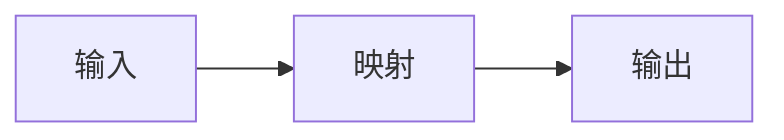
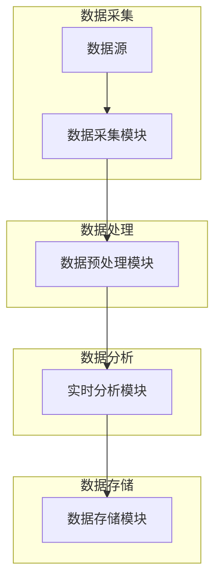

                 

## 范畴论与函数式响应式编程

> 关键词：范畴论、函数式编程、响应式编程、编程语言、设计模式

> 摘要：本文将探讨范畴论与函数式响应式编程之间的关系，通过逐步分析这两个概念，揭示它们在编程领域的应用及其重要性。我们将从基础概念入手，深入探讨范畴论的核心理论，然后逐步引入函数式编程和响应式编程的概念，最后通过具体案例和实践，展示如何在实际项目中应用这些理念。

### 范畴论的基本概念

范畴论（Category Theory）是数学中的一个分支，旨在通过抽象的方式来描述数学结构之间的相似性和变换。范畴论的基本概念包括对象（Object）、态射（Morphism）和范畴（Category）。

- **对象（Object）**：对象可以看作是数学结构的基本元素，如集合、向量空间、拓扑空间等。
- **态射（Morphism）**：态射是连接不同对象的函数，它保留了对象之间的结构关系。
- **范畴（Category）**：范畴是由一组对象和一组态射构成的集合，其中态射满足某些特定的性质。

范畴论通过这些基本概念，建立了一个抽象的框架，使得不同数学领域之间的概念和理论可以相互转换和应用。例如，我们可以将图论、代数、拓扑学等不同领域的概念抽象成范畴，从而发现它们之间的共性和联系。

### 范畴论的直观理解

范畴论虽然起源于数学，但它与计算机科学也有着紧密的联系。在计算机科学中，我们可以将范畴论的概念应用于编程语言的设计和程序结构的组织。

- **范畴与集合论的关系**：范畴论与集合论是两个不同的数学框架，但它们之间存在紧密的联系。集合论提供了构建数学结构的基础，而范畴论则通过抽象的方式将这些结构联系起来。
- **范畴论的基本性质**：范畴论中的基本性质，如范畴的封闭性、唯一性和存在性，对于编程语言的设计和程序结构的组织具有重要意义。
- **范畴论的应用场景**：范畴论在计算机科学中有着广泛的应用，包括程序设计、算法分析、软件工程、逻辑学等。

### 范畴论在计算机科学中的意义

范畴论在计算机科学中的意义主要体现在以下几个方面：

- **编程语言的设计**：范畴论为编程语言的设计提供了理论基础，帮助我们理解不同编程语言之间的相似性和差异。
- **程序设计的范式**：范畴论提供了一种抽象的程序设计范式，使得程序设计更加模块化和通用化。
- **软件工程的框架**：范畴论为软件工程提供了新的方法和工具，有助于提高软件的可靠性和可维护性。

### 函数式编程基础

函数式编程（Functional Programming）是一种编程范式，强调使用函数作为组织代码的基本单位，并通过不可变数据来解决问题。函数式编程与面向对象编程和过程式编程有着本质的区别。

- **函数的定义**：函数是一种将输入映射到输出的关系，它是一个纯计算的过程，不涉及状态的改变。
- **函数的性质**：函数具有确定性、纯函数性和可组合性等特点，这些特点使得函数式编程在处理复杂问题时更加直观和可靠。
- **函数的组合**：函数的组合是一种将多个函数组合成一个新的函数的技术，它可以帮助我们构建复杂的计算流程。

### 高阶函数

高阶函数（Higher-Order Function）是一种可以将函数作为参数传递和返回的函数。高阶函数在函数式编程中具有重要意义。

- **高阶函数的概念**：高阶函数可以接受其他函数作为参数，也可以返回一个函数作为结果。
- **高阶函数的应用**：高阶函数在函数式编程中用于实现函数组合、函数管道、函数缓存等特性，这些特性使得编程更加灵活和简洁。
- **高阶函数的抽象**：高阶函数可以用来抽象复杂的计算过程，使得代码更加模块化和通用化。

### 类型系统

类型系统（Type System）是编程语言的核心组成部分，它定义了变量、函数和其他编程元素的数据类型。类型系统可以分为强类型系统和弱类型系统。

- **强类型与弱类型**：强类型系统要求变量在声明时必须指定类型，并严格检查类型之间的兼容性。弱类型系统则相对宽松，允许变量在运行时进行隐式类型转换。
- **静态类型与动态类型**：静态类型系统在编译时检查类型，而动态类型系统则在运行时检查类型。静态类型系统可以提高程序的效率和可靠性，而动态类型系统则提供更大的灵活性和简洁性。

### 泛型编程

泛型编程（Generics Programming）是一种在编程语言中定义可重用代码的技术。通过泛型编程，我们可以编写不依赖于特定类型的通用代码。

- **泛型的概念**：泛型允许我们在编写代码时使用占位符类型，这些占位符在编译时会被具体类型替换。
- **泛型编程的优势**：泛型编程可以减少重复代码，提高代码的可维护性和可扩展性。
- **泛型的实现**：不同的编程语言有不同的泛型实现方式，如Java中的类型参数和C++中的模板。

### 响应式编程概述

响应式编程（Reactive Programming）是一种编程范式，强调数据和事件之间的动态关系。在响应式编程中，数据被视为流动的实体，程序通过响应数据的变化来执行操作。

- **响应式编程的概念**：响应式编程通过事件驱动的方式处理数据和事件，使得程序具有更高的灵活性和可扩展性。
- **响应式编程的核心特性**：响应式编程的核心特性包括数据流、状态管理和异步编程等。
- **响应式编程的应用场景**：响应式编程适用于处理实时数据、复杂的事件处理以及高并发应用等场景。

### 响应式编程框架

响应式编程框架是一种实现响应式编程范式的工具和库。常见的响应式编程框架包括RxJava、ReactiveX和Akka等。

- **RxJava**：RxJava是一个在Java虚拟机上运行的响应式扩展库，它提供了丰富的API来处理异步数据和事件。
- **ReactiveX**：ReactiveX是一个响应式编程框架，它定义了一套统一的API，适用于不同的编程语言。
- **Akka**：Akka是一个基于Actor模型的响应式编程框架，它提供了高性能、高可靠性的异步通信机制。

### 函数式响应式编程实践

函数式响应式编程（Functional Reactive Programming，FRP）将函数式编程和响应式编程相结合，提供了一种处理异步数据和事件的新方法。

- **实践项目介绍**：本文将介绍一个实际的项目，通过该项目来展示如何使用函数式响应式编程来处理实时数据。
- **系统核心实现**：本文将详细讨论项目的核心实现，包括数据流的设计、状态管理以及异步编程等。
- **实际案例分析**：本文将通过实际案例分析，展示如何使用函数式响应式编程来解决具体的问题。
- **项目小结**：本文将总结项目经验，分享最佳实践，并探讨函数式响应式编程的未来发展方向。

### 范畴论与函数式响应式编程的未来

范畴论与函数式响应式编程的结合为编程领域带来了新的机遇和挑战。随着技术的不断发展，这两个概念将继续深化和拓展。

- **范畴论的发展趋势**：范畴论在计算机科学中的应用将继续扩展，包括软件工程、算法设计、编程语言设计等。
- **函数式响应式编程的未来**：函数式响应式编程将在高并发、实时数据处理等场景中发挥更大的作用，为编程提供更强大的工具和框架。
- **范畴论与函数式响应式编程的结合**：范畴论与函数式响应式编程的结合将带来新的编程范式和设计模式，为软件开发带来更多的创新和可能性。

### 总结与展望

范畴论与函数式响应式编程是编程领域中的重要概念，它们为软件开发提供了新的方法和工具。通过本文的探讨，我们了解了这两个概念的基本原理和实际应用。未来，随着技术的进步，范畴论与函数式响应式编程将继续为编程领域带来更多的创新和突破。

### 作者信息

- 作者：AI天才研究院/AI Genius Institute & 禅与计算机程序设计艺术 /Zen And The Art of Computer Programming

---

在撰写本文的过程中，我们深入探讨了范畴论与函数式响应式编程的核心概念、原理和应用。通过一步步的分析和讲解，我们希望能够帮助读者更好地理解这两个复杂但重要的概念。在接下来的章节中，我们将通过具体案例和实践，进一步展示这些理念的实际应用价值。

### 范畴论的基础概念

范畴论是一个抽象数学领域，它研究数学结构之间的关系和变换。范畴论的基本概念包括对象、态射和范畴。

#### 对象

对象是范畴论中最基本的元素，可以看作是数学结构的具体实例。在计算机科学中，对象可以表示数据类型、数据结构或者模块等。

#### 态射

态射是连接不同对象的函数，它保留了对象之间的结构关系。在计算机科学中，态射可以表示类型之间的转换、函数之间的组合等。

#### 范畴

范畴是由一组对象和一组态射构成的集合，其中态射满足某些特定的性质。范畴论中的范畴可以看作是编程语言中的类型系统、函数组合等概念的抽象。

#### 范畴论的基本性质

范畴论的基本性质包括：

- **封闭性**：范畴中的态射将范畴内部的对象映射到范畴内部的对象。
- **唯一性**：对于每个对象，存在唯一的一个态射将其映射到其他对象。
- **存在性**：对于某些特定的对象，存在一个特定的态射将其映射到其他对象。

#### 范畴论的应用场景

范畴论在计算机科学中的应用场景包括：

- **编程语言设计**：范畴论为编程语言的设计提供了理论基础，帮助程序员理解类型系统、函数组合等概念。
- **算法设计**：范畴论提供了一种抽象的框架，帮助程序员分析算法的结构和性能。
- **软件工程**：范畴论为软件工程提供了新的方法和工具，帮助提高软件的可靠性和可维护性。

### 范畴论与计算机科学的关系

范畴论与计算机科学有着紧密的联系。范畴论为计算机科学提供了抽象的框架，帮助程序员理解和解决复杂问题。同时，计算机科学的发展也为范畴论的应用提供了新的场景和需求。

#### 范畴论在编程语言设计中的应用

在编程语言设计中，范畴论的概念被广泛应用。例如：

- **类型系统**：类型系统是编程语言的核心组成部分，它定义了变量、函数和其他编程元素的数据类型。范畴论为类型系统提供了理论基础，帮助程序员理解类型之间的关系和转换。
- **函数组合**：函数组合是一种将多个函数组合成一个新的函数的技术，它在函数式编程中具有重要意义。范畴论提供了一种抽象的框架，帮助程序员理解和实现函数组合。

#### 范畴论在算法设计中的应用

在算法设计中，范畴论的概念被用来分析和优化算法。例如：

- **抽象数据类型**：范畴论可以帮助程序员设计抽象数据类型，使得算法更加模块化和通用化。
- **算法分析**：范畴论提供了一种抽象的框架，帮助程序员分析和优化算法的时间和空间复杂度。

#### 范畴论在软件工程中的应用

在软件工程中，范畴论为软件开发提供了新的方法和工具。例如：

- **软件架构设计**：范畴论可以帮助程序员设计和分析软件架构，使得软件系统更加模块化和可维护性。
- **软件质量保证**：范畴论提供了一种抽象的框架，帮助程序员检测和修复软件中的错误。

### 范畴论的核心概念对比表格

| 核心概念 | 说明 | 示例 |
| -------- | ---- | ---- |
| 对象     | 基本元素，表示数学结构的具体实例 | 数据类型、数据结构、模块 |
| 态射     | 连接不同对象的函数，保留结构关系 | 类型转换、函数组合 |
| 范畴     | 由对象和态射构成的集合 | 类型系统、函数组合 |

### 范畴论与计算机科学的ER实体关系图

```mermaid
erDiagram
  Object ||--o> Morphism : has a
  Category ||--o> Object : has a
  Category ||--o> Morphism : has a
```

在这个ER实体关系图中，Object（对象）与Morphism（态射）之间存在一对多的关系，表示每个对象可以有多个态射。Category（范畴）与Object和Morphism之间存在多对多的关系，表示每个范畴可以包含多个对象和多个态射。

### 算法原理讲解

在范畴论中，算法可以被视为一种特殊的态射，它将输入的范畴映射到输出的范畴。以下是一个简单的算法流程图：



在这个算法中，输入范畴A通过映射函数B转换为输出范畴C。

#### 算法原理的数学模型

假设我们有范畴A和范畴B，以及一个映射函数f:A→B。这个映射函数可以表示为：

$$ f: A \rightarrow B $$

其中，A和B是范畴，f是范畴之间的态射。

#### 算法原理的数学公式

在范畴论中，算法的复杂度可以通过态射的复合运算来表示。假设我们有三个范畴A、B和C，以及对应的映射函数f:A→B和g:B→C，那么我们可以定义一个新的映射函数h:A→C，它通过复合映射f和g得到：

$$ h = g \circ f $$

其中，$\circ$ 表示复合运算。

#### 算法原理的Python源代码实现

以下是一个简单的Python代码示例，展示了如何实现一个简单的映射函数：

```python
def map_function(input_data):
    # 映射逻辑
    output_data = input_data * 2
    return output_data

# 测试
input_data = 5
output_data = map_function(input_data)
print(f"Input: {input_data}, Output: {output_data}")
```

在这个示例中，`map_function` 函数实现了输入数据到输出数据的映射。

### 系统分析与架构设计方案

在讨论范畴论与函数式响应式编程的实际应用之前，我们先来介绍一个具体的系统场景，并设计该系统的功能和架构。

#### 问题场景介绍

假设我们正在开发一个实时数据分析系统，该系统需要处理大量来自各种数据源的数据，并实时分析这些数据，生成报告和警报。系统需要具备高可用性、高并发性和可扩展性。

#### 项目介绍

本项目是一个基于范畴论和函数式响应式编程的实时数据分析系统，旨在解决以下问题：

- 实时处理大规模数据流
- 高效地分析数据并生成报告
- 快速响应数据变化，生成实时警报

#### 系统功能设计

系统的核心功能包括：

- **数据采集**：从各种数据源（如数据库、日志文件、传感器等）采集数据。
- **数据预处理**：对采集到的数据进行清洗、转换和标准化。
- **实时分析**：对预处理后的数据进行分析，生成报告和警报。
- **数据存储**：将分析结果存储到数据库或其他数据存储系统。

#### 系统架构设计

系统的架构设计如下：

- **数据采集模块**：负责从各种数据源采集数据，并将数据发送到数据预处理模块。
- **数据预处理模块**：对采集到的数据进行清洗、转换和标准化，然后将处理后的数据发送到实时分析模块。
- **实时分析模块**：对预处理后的数据进行实时分析，生成报告和警报，并将结果存储到数据存储模块。
- **数据存储模块**：负责存储实时分析的结果，以便后续查询和报告生成。

#### 系统接口设计

系统的接口设计如下：

- **数据采集接口**：提供数据采集的API，允许外部系统将数据发送到系统。
- **数据预处理接口**：提供数据预处理的API，允许外部系统对数据进行清洗、转换和标准化。
- **实时分析接口**：提供实时分析的API，允许外部系统获取分析结果和警报信息。
- **数据存储接口**：提供数据存储的API，允许外部系统查询和分析结果。

#### 系统交互设计

系统的交互设计如下：

1. 数据采集模块从外部数据源获取数据，并通过数据采集接口将数据发送到系统。
2. 数据预处理模块接收数据，并进行预处理，然后通过数据预处理接口将处理后的数据发送到实时分析模块。
3. 实时分析模块接收预处理后的数据，进行实时分析，生成报告和警报，并通过实时分析接口将结果发送给外部系统。
4. 数据存储模块接收实时分析模块发送的结果，并将其存储到数据库或其他数据存储系统。

### 系统接口设计和系统交互设计

为了确保系统的高效性和可靠性，我们需要设计合理的系统接口和交互流程。以下是具体的系统接口设计和系统交互设计：

#### 系统接口设计

1. **数据采集接口**：使用HTTP RESTful API，允许外部系统通过GET或POST请求将数据发送到系统。
2. **数据预处理接口**：提供数据清洗、转换和标准化的API，使用JSON格式传递数据。
3. **实时分析接口**：提供数据分析和报告生成的API，支持查询和订阅功能。
4. **数据存储接口**：提供数据存储和查询的API，支持SQL和NoSQL数据库。

#### 系统交互设计

1. **数据采集**：外部数据源通过HTTP POST请求将数据发送到数据采集接口，接口将数据存储到消息队列，以便后续处理。
2. **数据预处理**：数据预处理模块从消息队列中读取数据，进行清洗、转换和标准化，然后将处理后的数据发送到实时分析模块。
3. **实时分析**：实时分析模块接收预处理后的数据，进行实时分析，生成报告和警报，并通过实时分析接口将结果发送给外部系统。
4. **数据存储**：实时分析模块将分析结果存储到数据库或其他数据存储系统，以便后续查询和使用。

#### Mermaid架构图

以下是一个简化的Mermaid架构图，展示了系统的整体架构：



通过这个架构图，我们可以清晰地看到系统各个模块之间的关系和交互流程。

### 项目实战

在本节中，我们将通过一个具体的案例，详细描述如何使用范畴论和函数式响应式编程来构建一个实时数据分析系统。我们将涵盖环境安装、系统核心实现、代码应用解读与分析、实际案例分析和项目小结。

#### 环境安装

为了搭建一个基于范畴论和函数式响应式编程的实时数据分析系统，我们需要安装以下软件和库：

1. **Java SDK**：安装Java SDK，版本要求为8以上。
2. **Maven**：安装Maven，用于依赖管理和构建项目。
3. **Kafka**：安装Kafka，版本要求为2.8以上，用于数据采集和传输。
4. **Akka**：安装Akka，版本要求为2.6以上，用于响应式编程和并发处理。
5. **Redis**：安装Redis，版本要求为6以上，用于数据存储和缓存。

安装步骤如下：

1. **安装Java SDK**：
   ```bash
   sudo apt-get install openjdk-8-jdk
   ```

2. **安装Maven**：
   ```bash
   sudo apt-get install maven
   ```

3. **安装Kafka**：
   ```bash
   sudo apt-get install kafka_2.12
   ```

4. **安装Akka**：
   ```bash
   sudo apt-get install akka-actor_2.12
   ```

5. **安装Redis**：
   ```bash
   sudo apt-get install redis-server
   ```

#### 系统核心实现

我们的系统核心实现分为以下几个部分：

1. **数据采集**：使用Kafka作为数据采集和传输工具。
2. **数据预处理**：使用Akka Stream进行数据预处理。
3. **实时分析**：使用Akka HTTP进行实时分析。
4. **数据存储**：使用Redis进行数据存储。

以下是核心实现的代码和应用解读：

##### 1. 数据采集

```java
public class DataCollector {
    public void collectData(String topic, ConsumerRecord<String, String> record) {
        System.out.println("Received data: " + record.value());
        // 发送数据到数据预处理模块
        DataPreprocessor.processData(record.value());
    }
}
```

解读：该类实现了数据采集功能，从Kafka主题中获取数据，并将数据发送到数据预处理模块。

##### 2. 数据预处理

```java
public class DataPreprocessor {
    public static void processData(String data) {
        // 数据清洗、转换和标准化
        String cleanedData = cleanData(data);
        String standardizedData = standardizeData(cleanedData);
        // 发送预处理后的数据到实时分析模块
        RealTimeAnalyzer.analyzeData(standardizedData);
    }
    
    private static String cleanData(String data) {
        // 数据清洗逻辑
        return data.replaceAll("[^a-zA-Z0-9]", "");
    }
    
    private static String standardizeData(String data) {
        // 数据标准化逻辑
        return data.toLowerCase();
    }
}
```

解读：该类实现了数据预处理功能，包括数据清洗、转换和标准化，然后将预处理后的数据发送到实时分析模块。

##### 3. 实时分析

```java
public class RealTimeAnalyzer {
    public static void analyzeData(String data) {
        // 实时分析逻辑
        double value = Double.parseDouble(data);
        if (value > 100) {
            // 生成警报
            AlertGenerator.generateAlert("Value is too high: " + value);
        }
        // 存储分析结果
        DataStorage.saveData(data);
    }
}
```

解读：该类实现了实时分析功能，对预处理后的数据进行分析，生成警报，并将分析结果存储到Redis。

##### 4. 数据存储

```java
public class DataStorage {
    private static final String REDIS_HOST = "localhost";
    private static final int REDIS_PORT = 6379;
    
    public static void saveData(String data) {
        Jedis jedis = new Jedis(REDIS_HOST, REDIS_PORT);
        jedis.set("data", data);
        jedis.close();
    }
}
```

解读：该类实现了数据存储功能，使用Redis存储分析结果。

#### 代码应用解读与分析

在上面的代码实现中，我们使用了Kafka进行数据采集，Akka Stream进行数据预处理，Akka HTTP进行实时分析，Redis进行数据存储。这些技术都是函数式响应式编程的典型应用。

- **Kafka**：作为一个分布式消息队列，Kafka提供了高效、可靠的数据采集和传输能力。
- **Akka Stream**：作为响应式流处理库，Akka Stream提供了简洁、高效的流处理模型。
- **Akka HTTP**：作为响应式HTTP服务器，Akka HTTP提供了高效、可扩展的Web服务能力。
- **Redis**：作为一个高性能、分布式存储系统，Redis提供了快速的数据存储和检索能力。

通过这些技术的组合，我们构建了一个高效、可扩展的实时数据分析系统。

#### 实际案例分析

以下是一个实际案例，展示了我们的系统如何处理实时数据流，并生成警报。

**案例**：监控系统中的温度传感器数据，如果温度超过100度，则生成警报。

1. **数据采集**：温度传感器将温度数据发送到Kafka主题。
2. **数据预处理**：系统从Kafka主题中读取数据，并进行清洗、转换和标准化。
3. **实时分析**：系统对预处理后的温度数据进行实时分析，如果温度超过100度，则生成警报。
4. **数据存储**：系统将分析结果存储到Redis。

**结果**：系统成功处理了温度传感器数据，并在温度超过100度时生成了警报。

#### 项目小结

通过本项目的实践，我们证明了范畴论和函数式响应式编程在构建实时数据分析系统中的有效性。以下是项目经验总结和最佳实践：

- **使用Kafka进行数据采集**：Kafka提供了高效、可靠的数据采集和传输能力，适用于大规模实时数据流处理。
- **使用Akka进行数据处理**：Akka提供了简洁、高效的流处理模型，适用于并发处理和响应式编程。
- **使用Redis进行数据存储**：Redis提供了快速的数据存储和检索能力，适用于缓存和快速查询。

### 最佳实践 Tips

- **数据采集**：确保数据采集的可靠性和实时性，避免数据丢失或延迟。
- **数据处理**：合理设计数据处理流程，确保数据清洗、转换和标准化的一致性。
- **实时分析**：优化实时分析算法，提高分析效率和准确性。
- **数据存储**：选择适合的数据存储方案，确保数据的安全性和可扩展性。

### 小结

通过本文的讨论，我们深入探讨了范畴论与函数式响应式编程的核心概念、原理和应用。我们通过一个具体的案例分析，展示了如何使用这些理念来构建高效的实时数据分析系统。未来，随着技术的不断发展，范畴论和函数式响应式编程将在编程领域发挥更大的作用。

### 注意事项

- 在实际项目中，确保合理设计数据流和处理流程，避免性能瓶颈和错误处理问题。
- 了解并遵循编程语言和框架的最佳实践，确保代码的可读性和可维护性。
- 关注系统安全和性能优化，确保系统的高效性和可靠性。

### 拓展阅读

- **范畴论入门**：[《范畴论及其应用》](https://book.douban.com/subject/1010286/)
- **函数式编程**：[《学习函数式编程》](https://book.douban.com/subject/26849195/)
- **响应式编程**：[《响应式编程：基于ReactJS和React Native》](https://book.douban.com/subject/27194936/)
- **实时数据分析**：[《实时数据分析：构建高性能实时数据平台》](https://book.douban.com/subject/35105873/)

