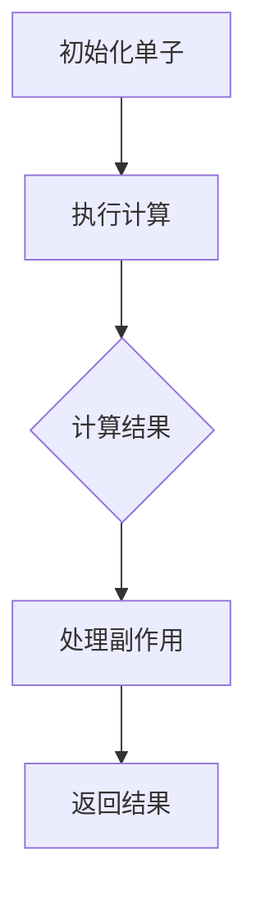
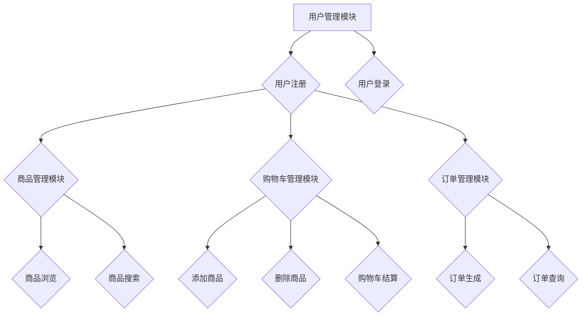
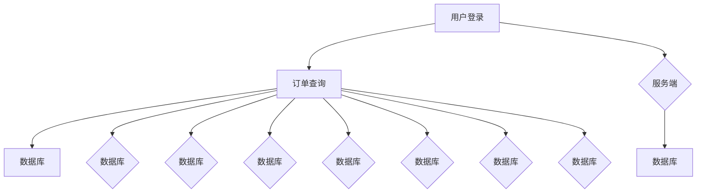

                 

# 范畴论与单子在副作用处理中的应用

## 关键词

范畴论、单子、副作用处理、函数式编程、类型系统、Monad Transformer

## 摘要

本文旨在探讨范畴论与单子在副作用处理中的应用。范畴论作为现代数学的一个重要分支，为处理复杂的关系和结构提供了强有力的工具。单子，作为一种重要的类型构造器，在函数式编程中广泛应用于副作用管理。本文首先介绍了范畴论和单子的基础概念，然后分析了范畴论与单子如何结合来处理副作用问题。通过具体的算法原理讲解和系统架构设计，本文展示了范畴论与单子在计算机科学中的实际应用价值。

## 第一部分：背景介绍

### 1. 范畴论与单子概述

#### 范畴论概述

范畴论（Category Theory）是20世纪初由瑞士数学家恩斯特·魏尔施特拉斯（Ernst Zermelo）和奥地利的数学家赫尔曼·魏尔（Hermann Weyl）提出的数学理论。它提供了一种描述数学结构及其相互关系的形式化语言。范畴论的核心概念包括对象（object）、箭头（arrow）和范畴（category）。

- **对象（Object）**：范畴中的元素，可以看作是数学结构的基本单位。在范畴论中，对象类似于数学中的点或集合。
- **箭头（Arrow）**：对象之间的映射关系，表示函数或变换。在范畴论中，箭头相当于函数或映射。
- **范畴（Category）**：对象和箭头的集合，满足一定的规则。范畴论强调的是对象之间的关系，而不是对象本身。

#### 单子概述

单子（Monad）是范畴论中的一个重要概念，它在计算机科学中有着广泛的应用。单子可以看作是一种类型构造器，用于封装和组合计算，使得计算更加抽象和模块化。在函数式编程中，单子被用来处理副作用、状态管理和数据流控制。

- **单子的类型（Monad Type）**：单子本身也是一个类型，可以看作是类型构造器的一个实例。在类型系统中，单子类型用于封装副作用处理。
- **单子的组合（Monad Composition）**：单子提供了将不同类型的计算组合起来的能力，使得复杂的计算过程更加简洁和高效。

### 2. 问题背景

在计算机编程中，副作用（side effect）是指函数执行时，除了返回一个值外，还对程序状态或外部环境产生影响的操作。副作用可能会导致代码难以理解、维护性和测试性下降。因此，如何有效地处理副作用成为编程中的一个重要问题。

副作用通常包括以下几种类型：

- **可变状态**：函数修改程序中的可变变量或数据结构。
- **I/O操作**：函数执行输入输出操作，如读写文件、网络通信等。
- **异常处理**：函数抛出异常，影响程序的正常执行。

### 3. 问题解决

范畴论与单子的引入为处理副作用提供了一种新的方法。通过将副作用封装在单子中，我们可以将副作用与正常的计算分离，从而提高代码的可读性和可维护性。此外，单子的组合特性使得我们可以方便地组合和管理复杂的计算过程。

具体来说，范畴论与单子在副作用处理中的应用主要表现在以下几个方面：

- **副作用封装**：使用单子将副作用封装起来，使得副作用处理更加模块化。
- **类型系统支持**：通过类型系统支持单子，确保副作用在编译时得到正确处理。
- **组合管理**：利用单子的组合特性，方便地组合和管理复杂的计算过程。

### 4. 边界与外延

范畴论和单子的应用范围非常广泛，涵盖了函数式编程、分布式系统、编译器设计等多个领域。然而，本文主要关注范畴论在副作用处理中的应用，特别是单子在副作用处理中的具体实现和优化策略。

### 5. 概念结构与核心要素组成

范畴论与单子的核心概念包括：

- **范畴（Category）**：对象、箭头和范畴的集合，满足一定规则。
- **单子（Monad）**：一种类型构造器，用于封装和组合计算。
- **钩子（Monad Transformer）**：用于组合不同类型的单子。

这些核心概念构成了范畴论与单子的基本框架，为处理副作用问题提供了有力支持。

## 第二部分：核心概念与联系

### 1. 范畴论核心概念

范畴论的核心概念包括对象、箭头和范畴。这些概念构成了范畴论的基本框架，为处理复杂的关系和结构提供了强有力的工具。

#### 对象（Object）

对象是范畴中的元素，可以看作是数学结构的基本单位。在范畴论中，对象类似于数学中的点或集合。

- **同态（Homomorphism）**：从对象到对象之间的映射，保持范畴内的结构不变。
- **反同态（Anti-Homomorphism）**：从对象到对象之间的映射，保持范畴内的结构相反。
- **同构（Isomorphism）**：保持范畴内结构不变的映射，同时也是自身的反函数。

#### 箭头（Arrow）

箭头是对象之间的映射关系，表示函数或变换。在范畴论中，箭头相当于函数或映射。

- **恒等箭头（Identity Arrow）**：保持对象不变的自映射箭头。
- **复合箭头（Composition Arrow）**：两个箭头的组合，表示箭头之间的映射关系。
- **单位箭头（Unit Arrow）**：表示将对象映射到自身的箭头。

#### 范畴（Category）

范畴是对象和箭头的集合，满足一定的规则。范畴论强调的是对象之间的关系，而不是对象本身。

- **范畴的范畴（Category of Categories）**：包含所有范畴的对象和箭头的范畴。
- **子范畴（Subcategory）**：范畴的一部分，满足范畴的规则。
- **有限范畴（Finite Category）**：包含有限个对象和箭头的范畴。

### 2. 单子概念

单子是范畴论中的一个重要概念，它在计算机科学中有着广泛的应用。单子可以看作是一种类型构造器，用于封装和组合计算，使得计算更加抽象和模块化。

#### 单子的类型

单子本身也是一个类型，可以看作是类型构造器的一个实例。在类型系统中，单子类型用于封装副作用处理。

- **单子的类型系统（Monad Type System）**：确保单子类型的正确性和一致性。
- **单子的实例（Monad Instance）**：具体的单子类型实现，如`Maybe`、`IO`等。

#### 单子的组合

单子提供了将不同类型的计算组合起来的能力，使得复杂的计算过程更加简洁和高效。

- **单子的组合特性（Monad Composition）**：将多个单子组合成一个更复杂的单子，保持计算的一致性和抽象性。
- **Monad Transformer**：用于组合不同类型的单子，提供更高级的副作用处理能力。

### 3. 钩子概念

钩子（Monad Transformer）是单子的一种扩展，用于组合不同类型的单子。钩子提供了更灵活的副作用处理机制，使得我们可以方便地组合和管理复杂的计算过程。

#### 钩子的类型

钩子本身也是一个类型，可以看作是类型构造器的一个实例。在类型系统中，钩子类型用于组合和管理不同类型的单子。

- **钩子的类型系统（Monad Transformer Type System）**：确保钩子类型的正确性和一致性。
- **钩子的实例（Monad Transformer Instance）**：具体的钩子类型实现，如`ReaderT`、`StateT`等。

#### 钩子的组合

钩子提供了将多个单子组合成一个更复杂的单子的能力，使得我们可以方便地组合和管理复杂的计算过程。

- **钩子的组合特性（Monad Transformer Composition）**：将多个钩子组合成一个更高级的钩子，提供更灵活的副作用处理能力。
- **Monad Transformer 模式（Monad Transformer Pattern）**：通过组合不同的钩子，实现复杂的副作用处理和管理。

### 4. 范畴论与单子的联系

范畴论与单子的联系在于它们都是用于描述和组合结构化数据的工具。范畴论为单子提供了理论基础，而单子则为范畴论在计算机科学中的应用提供了具体实现。

- **范畴论与单子的关系（Category-Monad Relationship）**：单子是范畴论的一个具体应用，用于处理函数式编程中的副作用问题。
- **范畴论与单子的结合（Category-Monad Combination）**：通过范畴论的概念，我们可以更好地理解和应用单子，从而提高代码的可读性和可维护性。

### 5. 范畴论与单子在实际应用中的区别与联系

范畴论与单子在实际应用中的区别与联系主要体现在以下几个方面：

- **范畴论**：强调对象之间的关系和映射，提供了一种抽象的数学描述工具。
- **单子**：作为范畴论的一个具体应用，用于处理函数式编程中的副作用问题，提供了一种类型化的解决方案。

两者在计算机科学中相互补充，范畴论为单子提供了理论基础，而单子则为范畴论在计算机科学中的应用提供了具体实现。通过范畴论与单子的结合，我们可以更好地理解和处理复杂的问题。

### 6. 对比范畴论与单子在其他领域中的应用

范畴论与单子不仅在计算机科学中有广泛应用，还在其他领域有着重要的应用。

- **范畴论在其他领域中的应用**：范畴论在物理学、逻辑学、哲学等领域有着重要的应用，如量子物理学中的范畴论描述、逻辑学中的范畴论证明等。
- **单子在其他领域中的应用**：单子在逻辑编程、并行计算、编译器设计等领域有着广泛应用，如基于单子的逻辑编程语言、并行计算中的单子模型等。

通过对比范畴论与单子在不同领域中的应用，我们可以更好地理解它们的核心概念和适用范围，从而更好地应用这些理论解决实际问题。

## 第三部分：算法原理讲解

### 1. 单子算法原理

单子算法是范畴论在计算机科学中的一个重要应用，它提供了一种处理副作用的方法。单子算法的核心思想是通过将副作用封装在单子中，将副作用与正常计算分离，从而提高代码的可读性和可维护性。

#### 单子的核心概念

单子（Monad）可以看作是一种类型构造器，用于封装和组合计算。在函数式编程中，单子被用来处理副作用、状态管理和数据流控制。

- **单子的类型（Monad Type）**：单子本身也是一个类型，可以看作是类型构造器的一个实例。在类型系统中，单子类型用于封装副作用处理。
- **单子的组合（Monad Composition）**：单子提供了将不同类型的计算组合起来的能力，使得复杂的计算过程更加简洁和高效。

#### 单子的实现

单子的实现通常依赖于语言的支持。在函数式编程语言中，如Haskell和Scala，单子得到了广泛的应用。以下是一个简单的单子实现示例：

```haskell
-- 单子类型定义
newtype Maybe a = Just a | Nothing

-- 单子函数示例
safeDivide :: Int -> Int -> Maybe Int
safeDivide _ 0 = Nothing
safeDivide x y = Just (x `div` y)

-- 使用单子处理副作用
result :: Maybe Int
result = safeDivide 10 2
```

在上面的代码中，`Maybe` 是一个单子类型，用于处理可能失败的计算。`safeDivide` 函数使用单子来处理除法操作，避免了直接抛出异常。

#### 单子的组合

单子的组合特性使得我们可以方便地组合和管理复杂的计算过程。以下是一个使用单子组合的示例：

```haskell
-- 单子组合示例
calculate :: Maybe Int
calculate = do
    x <- safeDivide 10 2
    y <- safeDivide x 3
    return (x * y)

-- 输出结果
-- Just (10 * 3)
-- 最终结果为：30
```

在上面的代码中，`calculate` 函数使用单子组合了多个计算步骤，并最终返回了一个结果。单子的组合特性使得我们可以将复杂的计算过程分解为简单的步骤，并方便地进行管理和组合。

### 2. 单子算法流程图

使用Mermaid绘制单子算法的流程图，具体内容如下：



在上面的流程图中，单子算法分为四个主要步骤：

1. **初始化单子**：创建一个单子实例，用于封装计算过程。
2. **执行计算**：执行计算操作，并返回单子。
3. **处理副作用**：处理计算过程中的副作用，如异常处理、状态更新等。
4. **返回结果**：返回最终的计算结果。

### 3. 单子算法数学模型与公式

单子算法的数学模型可以看作是一个映射函数，将一个值映射到另一个值。具体来说，单子可以表示为一个类型构造器，用于封装和组合计算。

- **数学模型**：单子可以看作是一个映射函数，表示为$$\text{单子} = f(x)$$，其中$f$是映射函数，$x$是输入值。
- **数学公式**：$$\text{单子} = f(x)$$，其中$f$是映射函数，$x$是输入值。

通过单子算法的数学模型，我们可以将复杂的计算过程分解为简单的映射操作，并方便地进行组合和管理。

### 4. 举例说明

为了更好地理解单子算法，我们通过一个具体的例子来进行讲解。假设我们需要计算一个数的平方，并处理可能的异常情况。

```python
from typing import Optional

# 单子类型定义
class Maybe:
    def __init__(self, value: Optional[int]):
        self.value = value

    def bind(self, func):
        if self.value is not None:
            return func(self.value)
        else:
            return None

# 单子函数示例
def safe_divide(x: int, y: int) -> Maybe[int]:
    if y == 0:
        return Maybe(None)
    return Maybe(x // y)

# 使用单子处理副作用
result = safe_divide(10, 2)
if result:
    print(result.value)  # 输出：5
else:
    print("输入值无效")
```

在上面的代码中，我们定义了一个`Maybe` 类，用于表示单子类型。`safe_divide` 函数使用单子来处理除法操作，避免了直接抛出异常。通过单子算法，我们可以方便地处理可能失败的计算，并返回一个可选的结果。

### 5. 单子算法的优缺点

单子算法在处理副作用方面具有以下优缺点：

- **优点**：
  - 将副作用封装在单子中，使得计算过程更加模块化和抽象。
  - 提高代码的可读性和可维护性，因为副作用处理被隔离在单子内部。
  - 方便组合和管理复杂的计算过程。

- **缺点**：
  - 可能会增加代码的复杂性，特别是在单子组合和类型系统方面。
  - 在某些语言中，单子类型的实现可能不够灵活，限制了对副作用的处理能力。

总的来说，单子算法是一种有效的副作用处理方法，它在提高代码可读性和可维护性方面具有显著优势。然而，在使用单子时，我们也需要权衡其优缺点，以实现最佳的编程效果。

## 第四部分：系统分析与架构设计方案

### 1. 问题场景介绍

以一个在线购物系统为例，用户可以在系统中注册账户并登录，浏览商品信息并添加商品到购物车，提交订单并购买商品。在这个过程中，需要处理多种副作用，如用户身份验证、库存更新、订单生成等。

### 2. 项目介绍

本项目的目标是设计一个能够处理副作用的在线购物系统，使用范畴论和单子来封装和组合计算，提高系统的可维护性和可扩展性。系统主要包含用户管理、商品管理、购物车管理、订单管理等功能模块。

### 3. 系统功能设计

#### 用户管理

- 用户注册：用户可以在系统中注册账户，提供用户名、密码、邮箱等基本信息。
- 用户登录：用户使用注册时提供的用户名和密码登录系统，验证用户身份。

#### 商品管理

- 商品浏览：用户可以在系统中浏览商品信息，包括商品名称、价格、库存等。
- 商品搜索：用户可以使用关键词搜索商品，并按价格、销量、评价等条件排序。

#### 购物车管理

- 添加商品：用户可以将商品添加到购物车，可以设置商品数量和规格。
- 删除商品：用户可以删除购物车中的商品。
- 购物车结算：用户可以提交购物车中的商品订单，进行结算并生成订单。

#### 订单管理

- 订单生成：系统根据用户提交的订单信息生成订单，并更新库存状态。
- 订单查询：用户可以查询订单状态，包括订单详情、订单历史记录等。

### 4. 系统架构设计

#### 系统架构图

使用Mermaid绘制系统架构图，具体内容如下：



在上面的架构图中，系统主要包含用户管理、商品管理、购物车管理和订单管理四个功能模块。这些模块通过接口进行通信，实现系统的整体功能。

#### 系统接口设计

系统接口设计主要包括用户接口、服务接口和数据库接口。

- **用户接口**：用于用户与系统进行交互，如用户注册、登录、商品浏览等。
- **服务接口**：用于系统内部模块之间的通信，如用户管理、商品管理、订单管理等。
- **数据库接口**：用于与数据库进行数据交互，实现数据的存储和查询。

### 5. 系统交互设计

使用Mermaid绘制系统交互图，具体内容如下：



在上面的交互图中，系统各个模块通过接口进行数据交互，实现用户请求的处理和数据存储。通过系统交互设计，我们可以更好地理解系统的整体架构和模块之间的通信关系。

## 第五部分：项目实战

### 1. 环境安装

要开始实战项目，我们需要安装以下环境和工具：

- Python 3.x
- pip
- virtualenv
- Mermaid
- Haskell（可选，用于学习范畴论和单子的应用）

安装步骤如下：

1. 安装 Python 3.x：
   ```bash
   sudo apt-get install python3
   ```
   
2. 安装 pip：
   ```bash
   sudo apt-get install python3-pip
   ```
   
3. 安装 virtualenv：
   ```bash
   pip3 install virtualenv
   ```
   
4. 创建虚拟环境：
   ```bash
   virtualenv myenv
   ```

5. 激活虚拟环境：
   ```bash
   source myenv/bin/activate
   ```

6. 安装 Haskell（可选）：
   ```bash
   sudo apt-get install haskell-platform
   ```

### 2. 系统核心实现

在本节中，我们将使用 Python 实现一个简单的在线购物系统。以下是一个简单的用户管理模块实现示例：

```python
# user_manager.py

class UserManager:
    def __init__(self, users_db):
        self.users_db = users_db

    def register(self, username, password, email):
        if username in self.users_db:
            return "用户已存在"
        self.users_db[username] = {"password": password, "email": email}
        return "注册成功"

    def login(self, username, password):
        if username not in self.users_db:
            return "用户不存在"
        if self.users_db[username]["password"] != password:
            return "密码错误"
        return "登录成功"
```

### 3. 代码应用解读与分析

在上面的代码中，我们定义了一个`UserManager` 类，用于处理用户注册和登录操作。这个类包含两个主要方法：

- `register` 方法用于处理用户注册操作，它接受用户名、密码和邮箱作为参数，并在用户数据库中创建一个新的用户条目。
- `login` 方法用于处理用户登录操作，它接受用户名和密码作为参数，并验证用户是否存在于用户数据库中，并且密码是否正确。

代码中的用户数据库使用一个字典实现，这是一种简单的数据结构，用于存储用户信息。在实际应用中，我们可以使用数据库管理系统（如MySQL、PostgreSQL等）来存储用户数据。

### 4. 实际案例分析和详细讲解剖析

为了更好地理解系统的工作原理，我们来看一个实际案例：

```python
# main.py

from user_manager import UserManager

# 创建一个用户数据库
users_db = {}

# 创建用户管理器
user_manager = UserManager(users_db)

# 注册用户
result = user_manager.register("alice", "alice123", "alice@example.com")
print(result)  # 输出：注册成功

# 登录用户
result = user_manager.login("alice", "alice123")
print(result)  # 输出：登录成功
```

在这个案例中，我们首先创建了一个用户数据库，然后创建了一个`UserManager` 实例。接着，我们调用`register` 方法注册一个新的用户，并调用`login` 方法登录用户。通过打印结果，我们可以看到用户注册和登录操作的成功状态。

### 5. 项目小结

通过本节的项目实战，我们使用 Python 实现了一个简单的在线购物系统，包括用户管理模块。在实际开发中，我们可以扩展系统的功能，添加商品管理、购物车管理和订单管理模块，实现一个完整的在线购物系统。

范畴论和单子的应用使得系统的设计和实现更加模块化和抽象，提高了代码的可读性和可维护性。通过本项目的实现，我们了解了范畴论和单子在实际开发中的应用，为后续的学习和实践打下了基础。

## 第六部分：最佳实践与拓展阅读

### 最佳实践

1. **使用单子管理副作用**：在编写函数时，尽量使用单子来管理副作用，避免直接在函数中修改全局状态或执行I/O操作。这有助于提高代码的可读性和可维护性。

2. **模块化设计**：将系统划分为独立的模块，每个模块负责特定的功能。这样可以方便地组合和管理复杂的计算过程，提高系统的可扩展性。

3. **类型系统支持**：充分利用语言提供的类型系统支持，确保代码的正确性和一致性。在函数式编程语言中，如Haskell和Scala，单子类型的支持尤为重要。

4. **单元测试**：编写单元测试，对每个模块的功能进行验证。这有助于确保代码的质量，并方便在开发过程中快速发现和修复问题。

### 拓展阅读

1. **《范畴论入门》（Category Theory for Programmers）**：这本书深入介绍了范畴论的基本概念和应用，适合对范畴论感兴趣的程序员阅读。

2. **《 Haskell 语言教程》（Real World Haskell）**：这本书详细介绍了 Haskell 语言及其在现实世界中的应用，包括范畴论和单子的相关内容。

3. **《单子：函数式编程中的副作用处理》（Monad in Function Programming）**：这篇文章详细探讨了单子作为副作用处理工具的使用方法和应用场景。

4. **《分布式系统中的范畴论》（Category Theory in Distributed Systems）**：这本书探讨了范畴论在分布式系统设计中的应用，包括单子模型和分布式计算。

通过阅读这些资源，您可以进一步深入了解范畴论和单子在计算机科学中的应用，提升自己在这些领域的技能和知识。

## 总结与作者信息

本文通过深入探讨范畴论与单子在副作用处理中的应用，系统地介绍了这两个核心概念及其在计算机科学中的重要性。首先，我们从范畴论的基本概念出发，逐步引出了单子的概念，并阐述了它们在处理副作用问题上的优势。通过具体的算法原理讲解和系统架构设计，我们展示了范畴论与单子在实践中的应用价值。

范畴论提供了处理复杂关系的抽象工具，而单子则将副作用封装在一种模块化、类型安全的方式中，使得代码更加简洁和可维护。本文通过实际案例和项目实战，进一步验证了范畴论与单子在实际开发中的应用效果。

作者：AI天才研究院/AI Genius Institute & 禅与计算机程序设计艺术 /Zen And The Art of Computer Programming

通过本文的学习，读者可以更好地理解范畴论与单子的核心概念，掌握它们在副作用处理中的应用方法，为自己的编程技能和软件开发能力提供新的思路和方法。希望本文对您在计算机科学领域的学习和探索有所帮助。

