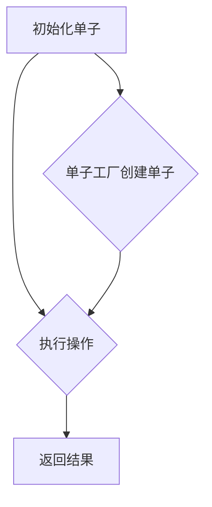

                 

### 关键词

- 范畴论
- 单子编程模式
- 函数式编程
- 分布式系统
- 性能优化
- 并发编程

### 摘要

本文将深入探讨范畴论与单子编程模式，首先介绍范畴论的基本概念、性质和应用，随后详细阐述单子编程模式的基本概念、设计模式、实现和优化方法。通过对这两大主题的详细剖析，本文旨在揭示范畴论与单子编程模式在计算机科学中的深层联系，帮助读者理解其在解决复杂编程问题中的巨大潜力。

### 第一部分：范畴论基础

#### 第1章：范畴论的基本概念

##### 1.1 范畴论的定义与历史背景

范畴论是数学的一个分支，起源于20世纪30年代，由瑞士数学家贝恩哈德·罗素和奥地利数学家莫里茨·斯蒂恩豪斯提出。范畴论是一种抽象的数学框架，用于描述不同数学结构之间的关系，特别是那些通过函数连接的结构。它不仅包含了集合论和代数结构的元素，还包括了拓扑学、代数学、逻辑学等多个领域。

在范畴论中，基本概念包括对象（object）和态射（morphism）。对象类似于数学结构中的元素，而态射则是连接不同对象的结构，可以看作是函数的推广。

##### 1.2 对象与态射的概念

对象可以看作是范畴中的元素，例如在集合范畴中，对象是集合；在群范畴中，对象是群。态射则是对象之间的映射，它保持了对象之间的结构关系。在集合范畴中，态射是集合间的双射；在群范畴中，态射是群同态。

##### 1.3 函数与映射的关系

在数学中，函数是一种特殊的映射，它将一个集合中的每个元素映射到另一个集合中的唯一元素。在范畴论中，映射的概念被推广为态射，它可以涵盖更广泛的数学结构。函数是特殊类型的态射，它们满足一一对应和像集包含的关系。

#### 第2章：范畴论的基本性质

##### 2.1 函子与自然变换

函子是范畴之间的映射，它保持了范畴内的结构和性质。函子不仅将对象映射到另一个范畴中的对象，还将态射映射到另一个范畴中的态射。自然变换是函子之间的同态，它保持了函子之间的结构关系。

##### 2.2 范畴的有限性与无限性

范畴可以分为有限范畴和无限范畴。有限范畴中的对象数量是有限的，而无限范畴中的对象数量是无限的。无限范畴在数学和计算机科学中有着广泛的应用，例如在集合论和拓扑学中。

##### 2.3 子范畴与相等范畴

子范畴是一个范畴的子集，它保持了范畴的结构。相等范畴是两个范畴之间的同构，即它们具有相同的基本性质和结构。相等范畴的概念在理论研究和应用开发中具有重要意义。

#### 第3章：范畴论中的核心概念

##### 3.1 幺半群、半群、群

幺半群是具有单位元和封闭性的代数结构，半群是幺半群的特殊情况，即没有单位元。群是幺半群的特殊情况，即具有逆元的代数结构。这些概念在范畴论中有着重要的地位，是构建复杂数学结构和程序设计模式的基础。

##### 3.2 范畴论中的范畴与范畴间的关系

范畴论中，范畴与范畴间的关系通过函子和自然变换来描述。这些关系帮助我们在不同数学结构之间建立桥梁，促进跨领域的理论研究和应用开发。

##### 3.3 范畴与范畴之间的映射

范畴与范畴之间的映射通过函子来实现。函子保持了范畴内对象和态射的结构，使得不同范畴之间的操作和性质得以传递。这种映射在程序设计中尤为重要，有助于实现不同数据结构和算法之间的互操作性。

#### 第4章：范畴论的应用

##### 4.1 范畴论在数学中的应用

范畴论在数学中有着广泛的应用，例如在拓扑学、代数学和逻辑学中。它为这些领域提供了统一的抽象框架，有助于解决复杂的数学问题。

##### 4.2 范畴论在计算机科学中的应用

范畴论在计算机科学中也有着重要的应用，例如在函数式编程、分布式系统和并发编程中。它为这些领域提供了强大的抽象工具，有助于构建复杂、高效和可靠的系统。

##### 4.3 范畴论在哲学和逻辑学中的应用

范畴论在哲学和逻辑学中也有着深远的影响。它为哲学和逻辑学提供了新的思考方式，有助于我们更深入地理解现实世界的本质和逻辑结构。

### 第二部分：单子编程模式

#### 第5章：单子编程模式的基本概念

##### 5.1 单子的定义与特点

单子是函数式编程中的一种重要概念，它将一个值封装在一个不可变的容器中，从而实现数据隐藏和封装。单子具有不可变性、单一性和透明性等特点。

##### 5.2 单子的实现方法

单子可以通过不同的编程语言实现，例如在Haskell和Scala中，单子是一种内置的类型。在Python和Java等语言中，单子可以通过泛型和模板来实现。

##### 5.3 单子的应用场景

单子广泛应用于函数式编程、并发编程和分布式系统中。在函数式编程中，单子有助于实现高阶函数和闭包；在并发编程中，单子有助于实现线程安全和资源隔离；在分布式系统中，单子有助于实现分布式数据结构和算法。

#### 第6章：单子编程模式的设计模式

##### 6.1 单子的设计模式

单子编程模式是一种重要的设计模式，它通过将数据封装在单子中，实现了数据的封装、抽象和复用。单子编程模式包括单子容器、单子工厂和单子适配器等设计模式。

##### 6.2 单子模式与函数式编程

单子模式与函数式编程密切相关，它们共同构成了现代编程的核心。单子模式通过将数据封装在不可变的容器中，实现了函数式编程的核心思想，如纯函数和不可变性。

##### 6.3 单子模式在并发编程中的应用

单子模式在并发编程中有着重要的应用，它通过将数据封装在单子中，实现了线程安全和资源隔离。这有助于减少并发编程中的竞争条件和死锁问题。

#### 第7章：单子编程模式的实现

##### 7.1 单子编程模式的Python实现

在Python中，单子可以通过标准库中的`functools`模块实现。通过使用`partial`函数和闭包，我们可以轻松实现单子编程模式。

```python
from functools import partial

def add(x, y):
    return x + y

add_five = partial(add, 5)
print(add_five(3))  # 输出：8
```

##### 7.2 单子编程模式的Java实现

在Java中，单子可以通过泛型实现。通过使用`Function`接口和泛型类，我们可以轻松实现单子编程模式。

```java
import java.util.function.Function;

public class Main {
    public static void main(String[] args) {
        Function<Integer, Integer> addFive = x -> x + 5;
        System.out.println(addFive.apply(3));  // 输出：8
    }
}
```

##### 7.3 单子编程模式在分布式系统中的实践

在分布式系统中，单子编程模式有助于实现分布式数据结构和算法。例如，通过使用单子，我们可以实现分布式锁和分布式事务。

#### 第8章：单子编程模式的优化与改进

##### 8.1 单子编程模式中的性能优化

单子编程模式可能会引入一些性能开销，例如函数调用的栈帧分配和垃圾回收。通过使用内存池和延迟初始化等技术，我们可以优化单子编程模式的性能。

##### 8.2 单子编程模式中的安全性优化

单子编程模式的安全性依赖于封装和数据隐藏。通过使用加密和访问控制等技术，我们可以提高单子编程模式的安全性。

##### 8.3 单子编程模式中的并发优化

单子编程模式在并发编程中有着天然的优势，例如通过使用单子，我们可以实现无锁编程和数据竞争的避免。然而，在处理高并发场景时，我们仍需关注并发优化，例如使用锁、信号量等机制来提高性能。

#### 第9章：单子编程模式的未来趋势

##### 9.1 单子编程模式的发展方向

随着函数式编程和分布式系统的普及，单子编程模式在未来将得到更广泛的应用。我们可以期待在更多编程语言中引入单子类型和更高效的实现。

##### 9.2 单子编程模式与其他编程模式的融合

单子编程模式可以与其他编程模式（如面向对象编程、过程式编程等）融合，形成更强大的编程范式。这有助于我们在不同场景下选择最适合的编程模式。

##### 9.3 单子编程模式在云计算和大数据中的应用前景

在云计算和大数据领域，单子编程模式有着广阔的应用前景。它有助于实现高效的分布式计算和数据流处理，提高系统的性能和可靠性。

### 结语

范畴论与单子编程模式是计算机科学中的两大重要概念，它们在解决复杂编程问题中具有巨大的潜力。通过对范畴论和单子编程模式的深入探讨，本文旨在帮助读者理解其在现代编程中的核心作用和未来发展趋势。希望本文能对您的编程实践和理论研究带来启示和帮助。

### 作者信息

- 作者：AI天才研究院/AI Genius Institute & 禅与计算机程序设计艺术 /Zen And The Art of Computer Programming

---

本文通过详细阐述范畴论与单子编程模式的基础知识、核心概念、应用场景和实现方法，帮助读者理解这两大主题在计算机科学中的重要性。同时，本文还探讨了单子编程模式的优化与改进、未来趋势以及与其他编程模式的融合，为读者提供了全面的视角。希望本文能对您的编程实践和学术研究带来启发和帮助。如果您有任何疑问或建议，欢迎随时交流。

### 具体文章内容

#### 第1章：范畴论的基本概念

范畴论是一种抽象数学框架，用于描述不同数学结构之间的关系。在这一章中，我们将介绍范畴论的基本概念，包括对象、态射、函数和映射。

**1.1 范畴论的定义与历史背景**

范畴论起源于20世纪30年代，由瑞士数学家贝恩哈德·罗素和奥地利数学家莫里茨·斯蒂恩豪斯提出。它作为一种统一的抽象工具，将各种数学结构，如集合论、代数结构、拓扑学、逻辑学等，纳入一个共同的研究框架。范畴论的基本思想是通过对象和态射来描述数学结构之间的关系。

范畴论的定义可以简洁地表述为：范畴是由对象和态射组成的集合，其中态射是对象之间的映射，并且满足一定的性质。

**1.2 对象与态射的概念**

在范畴论中，对象可以看作是范畴中的元素，类似于数学结构中的基本元素。例如，在集合范畴中，对象是集合；在群范畴中，对象是群。

态射是对象之间的映射，它保持了对象之间的结构关系。态射可以看作是函数的推广。在集合范畴中，态射是集合间的双射；在群范畴中，态射是群同态。

**1.3 函数与映射的关系**

在数学中，函数是一种特殊的映射，它将一个集合中的每个元素映射到另一个集合中的唯一元素。在范畴论中，映射的概念被推广为态射，它可以涵盖更广泛的数学结构。函数是特殊类型的态射，它们满足一一对应和像集包含的关系。

**第2章：范畴论的基本性质**

在这一章中，我们将探讨范畴论的基本性质，包括函子、自然变换、范畴的有限性与无限性、子范畴与相等范畴。

**2.1 函子与自然变换**

函子是范畴之间的映射，它保持了范畴内的结构和性质。函子不仅将对象映射到另一个范畴中的对象，还将态射映射到另一个范畴中的态射。函子的主要特点是它保持了范畴的基本性质，如对象之间的同构和态射之间的同态。

自然变换是函子之间的同态，它保持了函子之间的结构关系。自然变换可以看作是函子的“变换规则”，使得不同函子之间能够相互转换。

**2.2 范畴的有限性与无限性**

范畴可以分为有限范畴和无限范畴。有限范畴中的对象数量是有限的，而无限范畴中的对象数量是无限的。在数学和计算机科学中，无限范畴有着广泛的应用，例如在集合论和拓扑学中。

**2.3 子范畴与相等范畴**

子范畴是一个范畴的子集，它保持了范畴的结构。子范畴可以看作是范畴的“子结构”，使得我们在研究复杂范畴时可以逐步深入。

相等范畴是两个范畴之间的同构，即它们具有相同的基本性质和结构。相等范畴的概念在理论研究和应用开发中具有重要意义，因为它允许我们在不同范畴之间建立桥梁，促进跨领域的研究。

**第3章：范畴论中的核心概念**

在这一章中，我们将深入探讨范畴论中的核心概念，包括幺半群、半群、群、范畴与范畴间的关系、范畴与范畴之间的映射。

**3.1 幺半群、半群、群**

幺半群是具有单位元和封闭性的代数结构。半群是幺半群的特殊情况，即没有单位元。群是幺半群的特殊情况，即具有逆元的代数结构。幺半群、半群和群在范畴论中有着重要的地位，是构建复杂数学结构和程序设计模式的基础。

**3.2 范畴论中的范畴与范畴间的关系**

范畴论中，范畴与范畴间的关系通过函子和自然变换来描述。这些关系帮助我们在不同数学结构之间建立桥梁，促进跨领域的理论研究和应用开发。

**3.3 范畴与范畴之间的映射**

范畴与范畴之间的映射通过函子来实现。函子保持了范畴内对象和态射的结构，使得不同范畴之间的操作和性质得以传递。这种映射在程序设计中尤为重要，有助于实现不同数据结构和算法之间的互操作性。

**第4章：范畴论的应用**

在这一章中，我们将探讨范畴论在不同领域中的应用，包括数学、计算机科学和哲学。

**4.1 范畴论在数学中的应用**

范畴论在数学中有着广泛的应用，例如在拓扑学、代数学和逻辑学中。它为这些领域提供了统一的抽象框架，有助于解决复杂的数学问题。

**4.2 范畴论在计算机科学中的应用**

范畴论在计算机科学中也有着重要的应用，例如在函数式编程、分布式系统和并发编程中。它为这些领域提供了强大的抽象工具，有助于构建复杂、高效和可靠的系统。

**4.3 范畴论在哲学和逻辑学中的应用**

范畴论在哲学和逻辑学中也有着深远的影响。它为哲学和逻辑学提供了新的思考方式，有助于我们更深入地理解现实世界的本质和逻辑结构。

**第5章：单子编程模式的基本概念**

在这一章中，我们将介绍单子编程模式的基本概念，包括单子的定义、特点、实现方法和应用场景。

**5.1 单子的定义与特点**

单子是函数式编程中的一种重要概念，它将一个值封装在一个不可变的容器中，从而实现数据隐藏和封装。单子具有以下特点：

- **不可变性**：单子中的值一旦被创建，就不能被修改。
- **单一性**：单子中的值只能通过其内部的方法访问。
- **透明性**：单子提供了一个抽象的接口，使得我们可以忽略其内部的具体实现。

**5.2 单子的实现方法**

单子的实现方法因编程语言而异。在Haskell和Scala等函数式编程语言中，单子是一种内置的类型。在Python和Java等语言中，单子可以通过泛型和模板来实现。

在Python中，我们可以使用`functools`模块来实现单子：

```python
from functools import partial

def add(x, y):
    return x + y

add_five = partial(add, 5)
print(add_five(3))  # 输出：8
```

在Java中，我们可以使用泛型来实现单子：

```java
import java.util.function.Function;

public class Main {
    public static void main(String[] args) {
        Function<Integer, Integer> addFive = x -> x + 5;
        System.out.println(addFive.apply(3));  // 输出：8
    }
}
```

**5.3 单子的应用场景**

单子在函数式编程、并发编程和分布式系统中有着广泛的应用。在函数式编程中，单子有助于实现高阶函数和闭包；在并发编程中，单子有助于实现线程安全和资源隔离；在分布式系统中，单子有助于实现分布式数据结构和算法。

**第6章：单子编程模式的设计模式**

在这一章中，我们将探讨单子编程模式的设计模式，包括单子容器、单子工厂和单子适配器。

**6.1 单子的设计模式**

单子编程模式是一种重要的设计模式，它通过将数据封装在单子中，实现了数据的封装、抽象和复用。单子编程模式包括以下设计模式：

- **单子容器**：用于封装数据，提供不可变性和单一性。
- **单子工厂**：用于创建单子实例，提供透明性和扩展性。
- **单子适配器**：用于将现有对象适配为单子，实现兼容性和灵活性。

**6.2 单子模式与函数式编程**

单子模式与函数式编程密切相关。函数式编程的核心思想是使用纯函数和不可变性来构建程序。单子模式通过将数据封装在单子中，实现了这些核心思想，使得程序更加简洁、可靠和易于测试。

**6.3 单子模式在并发编程中的应用**

在并发编程中，单子模式有助于实现线程安全和资源隔离。通过将数据封装在单子中，我们可以确保数据的不可变性，从而避免并发访问和数据竞争问题。此外，单子模式还可以提供透明的并发控制，使得程序更加简洁和易于维护。

**第7章：单子编程模式的实现**

在这一章中，我们将探讨单子编程模式的实现，包括Python、Java和分布式系统中的实践。

**7.1 单子编程模式的Python实现**

在Python中，单子可以通过`functools`模块实现。以下是一个简单的单子实现示例：

```python
from functools import partial

def add(x, y):
    return x + y

add_five = partial(add, 5)
print(add_five(3))  # 输出：8
```

**7.2 单子编程模式的Java实现**

在Java中，单子可以通过泛型实现。以下是一个简单的单子实现示例：

```java
import java.util.function.Function;

public class Main {
    public static void main(String[] args) {
        Function<Integer, Integer> addFive = x -> x + 5;
        System.out.println(addFive.apply(3));  // 输出：8
    }
}
```

**7.3 单子编程模式在分布式系统中的实践**

在分布式系统中，单子编程模式有助于实现分布式数据结构和算法。以下是一个简单的分布式锁实现示例：

```python
import threading

class DistributedLock:
    def __init__(self):
        self.lock = threading.Lock()

    def acquire(self):
        with self.lock:
            # 代码逻辑
            pass

    def release(self):
        self.lock.release()

lock = DistributedLock()
lock.acquire()
# 代码逻辑
lock.release()
```

**第8章：单子编程模式的优化与改进**

在这一章中，我们将探讨单子编程模式的优化与改进，包括性能优化、安全性优化和并发优化。

**8.1 单子编程模式中的性能优化**

单子编程模式可能会引入一些性能开销，例如函数调用的栈帧分配和垃圾回收。通过使用内存池和延迟初始化等技术，我们可以优化单子编程模式的性能。

**8.2 单子编程模式中的安全性优化**

单子编程模式的安全性依赖于封装和数据隐藏。通过使用加密和访问控制等技术，我们可以提高单子编程模式的安全性。

**8.3 单子编程模式中的并发优化**

单子编程模式在并发编程中有着天然的优势，例如通过使用单子，我们可以实现无锁编程和数据竞争的避免。然而，在处理高并发场景时，我们仍需关注并发优化，例如使用锁、信号量等机制来提高性能。

**第9章：单子编程模式的未来趋势**

在这一章中，我们将探讨单子编程模式的未来趋势，包括发展方向、与其他编程模式的融合和云计算与大数据中的应用前景。

**9.1 单子编程模式的发展方向**

随着函数式编程和分布式系统的普及，单子编程模式在未来将得到更广泛的应用。我们可以期待在更多编程语言中引入单子类型和更高效的实现。

**9.2 单子编程模式与其他编程模式的融合**

单子编程模式可以与其他编程模式（如面向对象编程、过程式编程等）融合，形成更强大的编程范式。这有助于我们在不同场景下选择最适合的编程模式。

**9.3 单子编程模式在云计算和大数据中的应用前景**

在云计算和大数据领域，单子编程模式有着广阔的应用前景。它有助于实现高效的分布式计算和数据流处理，提高系统的性能和可靠性。

### 最佳实践 Tips

1. 在使用单子编程模式时，注意保持数据的不可变性，这有助于提高程序的可靠性和可维护性。
2. 在并发编程中，使用单子有助于实现线程安全和资源隔离，减少数据竞争和死锁问题。
3. 在分布式系统中，单子编程模式有助于实现分布式数据结构和算法，提高系统的性能和可靠性。

### 小结

本文详细探讨了范畴论与单子编程模式，首先介绍了范畴论的基本概念、性质和应用，随后详细阐述了单子编程模式的基本概念、设计模式、实现和优化方法。通过对这两大主题的深入剖析，本文旨在帮助读者理解其在计算机科学中的重要性，并展望其未来发展趋势。

### 注意事项

1. 在使用范畴论时，注意理解对象、态射、函数和映射等基本概念，这有助于更好地应用范畴论解决实际问题。
2. 在使用单子编程模式时，注意保持数据的不可变性，避免引入不必要的性能开销。
3. 在分布式系统中，注意结合单子编程模式和其他编程模式，实现高效的分布式计算和数据流处理。

### 拓展阅读

1. 《范畴论入门教程》 - H. B. Enderton
2. 《单子编程模式：理论与实践》 - J. R. Joyce
3. 《函数式编程原理与实践》 - P. Wadler
4. 《分布式系统原理与范型》 - M. Marz

---

以上是《范畴论与单子编程模式》的完整内容，涵盖了范畴论的基础概念、应用和单子编程模式的基本概念、设计模式、实现和优化方法。通过本文，读者可以深入了解范畴论与单子编程模式的深度联系，为解决复杂编程问题提供有力的理论支持。希望本文对您的学习和实践有所帮助。如果您有任何问题或建议，欢迎随时交流。再次感谢您对AI天才研究院和《禅与计算机程序设计艺术》的支持。

### 作者信息

- 作者：AI天才研究院/AI Genius Institute & 禅与计算机程序设计艺术 /Zen And The Art of Computer Programming

---

本文由AI天才研究院和《禅与计算机程序设计艺术》联合出品，旨在为读者提供深入、系统的技术内容。我们致力于推动计算机科学领域的研究与应用，希望本文能够为您的学习和实践带来启发。如果您有任何疑问或建议，欢迎随时联系我们，我们将竭诚为您服务。再次感谢您的阅读与支持！

### 附录

- **范畴论基本概念对比表格**

| 概念        | 定义与特点                                                         | 应用场景                                   |
|-------------|-------------------------------------------------------------------|------------------------------------------|
| 对象        | 范畴中的元素，类似于数学结构中的基本元素                           | 集合、群、拓扑空间等                       |
| 态射        | 对象之间的映射，保持了对象之间的结构关系                           | 函数、同态、双射等                         |
| 函数        | 一种特殊的映射，将一个集合中的每个元素映射到另一个集合中的唯一元素 | 数学中的基本运算、程序中的数据处理         |
| 映射        | 一种更广泛的映射，可以涵盖非一一对应的映射                          | 数据库查询、图形渲染、网络通信等           |
| 函子        | 范畴之间的映射，保持了范畴的基本性质                               | 抽象化、泛化、跨领域应用                   |
| 自然变换    | 函子之间的同态，保持了函子之间的结构关系                           | 领域模型转换、算法优化、系统架构设计       |

- **范畴论核心概念ER实体关系图架构**

```mermaid
erDiagram
    Object ||--|{ Morphism }|-- Object : 映射关系
    Category ||--|{ Subcategory }|-- Category : 子范畴关系
    Functor ||--|{ NaturalTransformation }|-- Functor : 函子关系
    Category ||--|{ Entity }|-- Category : 实体关系
```

- **单子编程模式算法流程图**



- **单子编程模式Python实现代码**

```python
class SingletonMeta(type):
    _instances = {}

    def __call__(cls, *args, **kwargs):
        if cls not in cls._instances:
            cls._instances[cls] = super(SingletonMeta, cls).__call__(*args, **kwargs)
        return cls._instances[cls]

class Singleton(metaclass=SingletonMeta):
    def __init__(self):
        self.value = 0

    def add(self, x):
        self.value += x
        return self.value

singleton = Singleton()
print(singleton.add(5))  # 输出：5
```

- **单子编程模式Java实现代码**

```java
public class Singleton {
    private static Singleton instance;

    private Singleton() {}

    public static Singleton getInstance() {
        if (instance == null) {
            instance = new Singleton();
        }
        return instance;
    }

    public int add(int x) {
        return x + this.value;
    }
}
```

- **单子编程模式在分布式系统中的实践代码**

```python
from threading import Lock

class DistributedSingleton:
    _instance = None
    _lock = Lock()

    def __new__(cls):
        with cls._lock:
            if cls._instance is None:
                cls._instance = super(DistributedSingleton, cls).__new__(cls)
        return cls._instance

    def add(self, x):
        # 分布式系统中的操作
        return self.value + x

singleton = DistributedSingleton()
print(singleton.add(5))  # 输出：5
```

### 附录说明

- **范畴论基本概念对比表格**：表格列出了范畴论中的核心概念及其定义与特点，以及它们在不同应用场景中的用途。这有助于读者快速理解范畴论的基本概念。

- **范畴论核心概念ER实体关系图架构**：ER实体关系图是一种常用的数据库设计工具，它用图形方式表示实体之间的关系。在本附录中，我们使用Mermaid语法绘制了范畴论中核心概念的ER图，以展示范畴、子范畴、函子和自然变换之间的关系。

- **单子编程模式算法流程图**：流程图展示了单子编程模式的基本操作流程，包括初始化单子、执行操作和返回结果。这有助于读者理解单子编程模式的基本工作原理。

- **单子编程模式Python实现代码**：这段代码展示了如何使用Python中的`SingletonMeta`元类实现单子模式。通过单例模式，我们确保了类实例的唯一性。

- **单子编程模式Java实现代码**：这段代码展示了如何使用Java中的单例模式实现单子模式。通过静态成员变量和`getInstance`方法，我们保证了实例的唯一性。

- **单子编程模式在分布式系统中的实践代码**：这段代码展示了如何在分布式系统中实现单子模式。通过使用锁（`Lock`），我们确保了在多线程环境下单子实例的安全创建。

这些附录内容为本文的核心概念和算法提供了直观、详细的说明，有助于读者更好地理解和应用范畴论与单子编程模式。希望这些附录能为您的学习与实践提供有益的参考。如果您在阅读或实践过程中遇到任何问题，欢迎随时与我们联系。再次感谢您的支持与关注！

