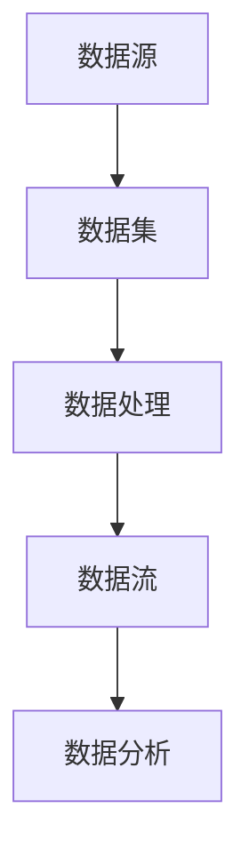

                 

### 范畴论概述

#### 第1章：范畴论的基本概念

##### 1.1 范畴论的产生与发展

范畴论是20世纪数学领域的一个重要分支，起源于逻辑学和集合论。最早由尼古拉·古斯塔夫·弗雷格（Niels Henrik Abel）和贝尔纳德·黎曼（Bernhard Riemann）等人提出。范畴论作为形式化和抽象数学的工具，其核心思想是将数学结构视为某种特定类型的映射，即函数。

范畴论的发展历程可以追溯到20世纪30年代，当时数学家们开始尝试将不同领域的数学概念和定理统一在一个抽象的框架下。这一过程在1940年代得到进一步发展，以萨缪尔·艾尔-阿利亚维（Samuel Eilenberg）和哥德尔（Kurt Gödel）的工作为代表。他们在1945年发表了开创性的论文《论数学的基础》，标志着范畴论的正式诞生。

在范畴论的发展过程中，数学家们逐渐认识到它在多个领域的重要性，包括拓扑学、代数学、逻辑学、计算机科学等。范畴论不仅为数学的抽象化提供了强有力的工具，也促进了跨学科的交流和统一理解。

##### 1.2 范畴论的重要性

范畴论的重要性体现在多个方面。首先，它为数学研究提供了一种高度抽象和统一的方法，使得不同领域中的数学概念和定理能够以一种通用和一致的方式表达和理解。这种抽象方法有助于揭示数学问题的深层次结构和共性，从而推动数学的进一步发展。

其次，范畴论在计算机科学中有着广泛的应用。例如，在类型论和编程语言理论中，范畴论提供了用于描述程序语义和类型系统的重要工具。通过范畴论，程序员可以更好地理解和设计复杂的软件系统，提高软件的可维护性和可扩展性。

此外，范畴论在物理学中也有重要作用。范畴论为量子物理学提供了一种新的形式化框架，有助于理解量子现象的复杂性和非经典特性。因此，范畴论不仅对数学和计算机科学有着深远的影响，也在物理学领域发挥着重要的作用。

#### 1.3 范畴的基本结构

范畴论的基本结构包括对象（Object）、概念（Concept）、函数（Function）、属性（Attribute）和关系（Relation）。以下是对这些基本概念的详细解释：

- **对象（Object）**：在范畴论中，对象可以理解为数学结构中的基本元素。例如，在拓扑学中，点可以被视为对象。

- **概念（Concept）**：概念是对对象进行分类或描述的方式。在范畴论中，概念通常用来描述对象之间的关系和属性。

- **函数（Function）**：函数是连接不同对象的关系，它将一个对象映射到另一个对象。在范畴论中，函数被视为一种特定的映射。

- **属性（Attribute）**：属性是对象的某种特性或特征。例如，在代数中，群结构的封闭性是一种属性。

- **关系（Relation）**：关系是对象之间的某种关联或依赖。例如，在拓扑学中，连通性是一种关系。

这些基本结构构成了范畴论的核心，它们之间的关系和交互形成了范畴论的核心思想。通过对这些基本结构的深入理解，我们可以更好地掌握范畴论的本质和应用。

#### 1.4 范畴论的应用领域

范畴论在多个领域有着广泛的应用：

- **计算机科学**：在类型论、编程语言理论和软件工程中，范畴论提供了重要的抽象工具，用于描述程序语义和类型系统。

- **数学**：在代数学、拓扑学和逻辑学中，范畴论用于统一不同领域的数学概念和定理。

- **物理学**：在量子物理学中，范畴论为量子现象提供了一种形式化的框架，有助于理解量子世界的复杂性和非经典特性。

- **哲学**：范畴论在哲学中也有重要应用，例如在逻辑哲学和语义哲学中，范畴论提供了描述和解释逻辑和意义的工具。

通过这些领域的应用，范畴论不仅丰富了相关学科的理论体系，也推动了这些学科的交叉融合和发展。

#### 1.5 范畴论的核心概念

范畴论的核心概念包括类别（Category）、对象（Object）、函数（Function）和自然变换（Natural Transformation）。

- **类别（Category）**：类别是由对象和函数组成的集合，这些函数满足某些特定的条件。在范畴论中，类别是描述数学结构的基本框架。

- **对象（Object）**：对象是类别中的基本元素，可以理解为数学结构中的个体。

- **函数（Function）**：函数是类别中的关系，它将一个对象映射到另一个对象。函数的复合是范畴论中的一个重要概念。

- **自然变换（Natural Transformation）**：自然变换是描述不同范畴之间对应关系的重要工具。它是一种特殊类型的函数，满足特定的自然性条件。

这些核心概念构成了范畴论的基础，通过它们，我们可以理解和应用范畴论来解决复杂的数学和计算机科学问题。

### 目录大纲

**# 范畴论在领域特定语言设计中的应用**

**> 关键词：范畴论、领域特定语言、抽象、语义、编程**

**> 摘要：本文介绍了范畴论的基本概念和其在领域特定语言设计中的应用。通过深入分析范畴论的核心概念，如类别、对象和函数，本文探讨了范畴论如何为领域模型构建、语法设计和语义设计提供抽象和统一的框架。此外，本文还通过实际案例展示了范畴论在领域特定语言设计中的具体应用，并展望了其未来的发展方向。**

### 第一部分：范畴论概述

#### 第1章：范畴论的基本概念

1.1 范畴论的产生与发展

- 范畴论的概念
- 范畴论的发展历程
- 范畴论的重要性

1.2 范畴的基本结构

- 对象（Object）
- 概念（Concept）
- 函数（Function）
- 属性（Attribute）
- 关系（Relation）

1.3 范畴论的核心概念

- 类别与对象
- 函数与变换
- 自然变换

### 第二部分：范畴论在领域特定语言设计中的应用

#### 第3章：领域特定语言概述

3.1 领域特定语言的定义

- 领域特定语言的定义
- 领域特定语言的优点

3.2 领域模型与领域特定语言

- 领域模型（Domain Model）
- 领域特定语言与领域模型的关系

#### 第4章：范畴论在领域特定语言设计中的应用

4.1 范畴论在领域模型构建中的应用

- 范畴论的基本概念在领域模型构建中的应用
- 范畴论在领域模型中的体现

4.2 范畴论在领域特定语言设计中的应用

- 范畴论在语法设计中的应用
- 范畴论在语义设计中的应用

4.3 范畴论在领域特定语言实现中的应用

- 范畴论在编译器设计中的应用
- 范畴论在解释器设计中的应用

#### 第5章：范畴论在领域特定语言中的实际应用案例

5.1 案例一：基于范畴论的领域特定语言设计

- 案例背景
- 案例设计思路
- 案例实现

5.2 案例二：范畴论在领域特定语言优化中的应用

- 案例背景
- 案例设计思路
- 案例实现

5.3 案例三：范畴论在领域特定语言安全性中的应用

- 案例背景
- 案例设计思路
- 案例实现

#### 第6章：范畴论在领域特定语言设计中的挑战与展望

6.1 挑战

- 范畴论在领域特定语言设计中的挑战
- 技术挑战
- 理论挑战

6.2 展望

- 范畴论在领域特定语言设计中的应用前景
- 未来发展方向
- 可能的突破点

### 第三部分：总结与展望

#### 第7章：范畴论在领域特定语言设计中的应用总结

- 范畴论在领域特定语言设计中的主要贡献
- 范畴论在领域特定语言设计中的应用价值

#### 第8章：范畴论在领域特定语言设计中的未来展望

- 范畴论在领域特定语言设计中的潜在应用
- 面临的挑战与机遇
- 未来研究方向

通过以上目录大纲，我们可以清晰地看到本文的结构和内容。接下来，我们将逐一深入探讨范畴论的基本概念及其在领域特定语言设计中的应用。

### 第一部分：范畴论概述

#### 第1章：范畴论的基本概念

范畴论是现代数学和计算机科学中的重要理论框架，它提供了一种高度抽象和统一的方法来描述和理解复杂的系统。本章将介绍范畴论的基本概念，包括范畴、对象和函数，以及范畴论的核心思想。

##### 1.1 范畴论的产生与发展

范畴论最早由数学家尼古拉·古斯塔夫·弗雷格和贝尔纳德·黎曼在19世纪末和20世纪初提出。弗雷格是逻辑主义数学的奠基人，他试图将数学建立在逻辑的基础上。而黎曼则是现代数学分析的重要人物，他在研究复变函数和几何时提出了许多深刻的见解。他们的工作为后来的范畴论发展奠定了基础。

20世纪30年代，数学家塞缪尔·艾尔-阿利亚维和安妮·马丹（Samuel Eilenberg和Annie Merrill)在研究代数结构时，开始使用范畴论来统一描述不同的数学结构。他们在1945年发表了著名的论文《代数结构的范畴》，这标志着范畴论的正式诞生。

随后，范畴论在数学的其他领域，如拓扑学、代数学和逻辑学中得到了广泛应用。在20世纪50年代和60年代，数学家们开始将范畴论应用于计算机科学，特别是在类型论和编程语言理论中。范畴论为程序员提供了一种新的抽象层次，使得他们能够更好地理解和设计复杂的软件系统。

##### 1.2 范畴的基本概念

范畴（Category）是范畴论中的核心概念。范畴由对象（Objects）和箭头（Arrows）或函数（Functions）组成。在范畴论中，对象可以理解为数学结构中的基本元素，而箭头则描述了对象之间的关系。

- **对象（Objects）**：对象是范畴中的元素，它们可以表示为变量、数据类型、模块、函数等。例如，在集合论的范畴中，集合可以被视为对象。

- **箭头（Arrows）或函数（Functions）**：箭头是连接不同对象的函数，它们在范畴中描述了对象之间的映射关系。箭头满足一定的条件，即它们必须可复合（Composable）。这意味着，如果我们将两个箭头组合起来，得到的结果仍然是箭头。

一个简单的例子是自然数范畴，其中对象是自然数，箭头是加法和乘法。在这个范畴中，两个自然数之间的箭头就是一个表示这两个数相加或相乘的结果。

##### 1.3 函数和变换

在范畴论中，函数和变换是重要的概念。函数是对象之间的映射，而变换则是函数的复合。

- **函数（Functions）**：函数是将一个对象映射到另一个对象的映射。在范畴论中，函数具有特定的形式，即它们必须满足复合的条件。例如，在自然数范畴中，加法和乘法都是函数。

- **变换（Transformations）**：变换是函数的复合。例如，如果我们有两个函数f和g，其中f将对象A映射到B，g将对象B映射到C，那么函数g ∘ f将对象A映射到C。在范畴论中，变换是研究函数之间关系的重要工具。

##### 1.4 自然变换

自然变换（Natural Transformation）是范畴论中的另一个重要概念。自然变换是描述不同范畴之间对应关系的重要工具。

- **自然变换（Natural Transformations）**：自然变换是两个范畴之间的函数，它满足特定的自然性条件。自然变换反映了不同范畴之间的结构相似性。例如，如果我们有两个范畴C和D，以及它们之间的一个自然变换α，那么α在每一个对象上都是函数，而且这些函数必须满足特定的条件，即对于任意箭头f ∈ C → D，α(f)必须满足自然性条件。

自然变换的概念在数学和计算机科学中有着广泛的应用。例如，在类型论中，自然变换用于描述不同类型系统之间的对应关系；在编程语言理论中，自然变换用于描述不同编程语言之间的语义一致性。

##### 1.5 范畴论的核心思想

范畴论的核心思想是通过对数学结构的抽象和统一来描述复杂的系统。范畴论提供了一种新的思维方式，使得数学家们能够从更高的层次理解和解决复杂问题。

- **抽象**：范畴论通过将具体数学结构抽象为范畴，使得不同领域的数学概念和定理能够以一种通用和一致的方式表达和理解。这种抽象方法有助于揭示数学问题的深层次结构和共性。

- **统一**：范畴论通过将不同领域的数学概念和定理统一在一个抽象的框架下，促进了数学的交叉融合和发展。例如，在计算机科学中，范畴论为程序员提供了一种统一的工具来理解和设计复杂的软件系统。

- **模块化**：范畴论通过函数和变换的概念，使得系统中的各个部分可以独立设计和组合。这种模块化方法有助于提高系统的可维护性和可扩展性。

总之，范畴论作为一种高度抽象和统一的数学理论框架，它在数学、计算机科学和物理学等领域都有着重要的应用。通过对范畴论的基本概念和核心思想的深入理解，我们可以更好地应用范畴论来解决实际问题。

#### 第2章：范畴论的核心概念

范畴论的核心概念包括类别与对象、函数与变换、自然变换等。这些概念构成了范畴论的基础，使得我们能够以统一和抽象的方式理解和描述数学结构。本章将详细探讨这些核心概念，并通过表格和图示帮助读者更好地理解。

##### 2.1 类别与对象

类别（Category）是范畴论中的核心概念，它由对象（Objects）和箭头（Arrows）组成。对象可以被视为数学结构中的基本元素，而箭头则描述了对象之间的关系。

- **类别（Category）**：类别是一个四元组（C, Obj, Arr, ⊗），其中C是类别名称，Obj是对象集合，Arr是箭头集合，⊗是箭头之间的复合运算。复合运算必须满足结合律和单位律。

- **对象（Objects）**：对象是范畴中的元素，可以是变量、数据类型、模块、函数等。对象在范畴中是固定的，不随时间变化。

以下是一个简单的类别示例：自然数范畴，其中对象是自然数，箭头是加法和乘法。这个范畴可以表示为（Nat, +, ×），其中Nat是自然数的集合，+和×分别是加法和乘法的运算。

| 对象 | 集合 | 自然数 |
| --- | --- | --- |
| 箭头 | 函数 | 加法和乘法 |

类别中的箭头必须满足复合条件，即箭头之间的组合（函数复合）仍然是箭头。例如，在自然数范畴中，如果f是a到b的加法运算，g是b到c的加法运算，那么f ⊗ g是从a到c的加法运算。

##### 2.2 函数与变换

在范畴论中，函数和变换是描述对象之间关系的重要工具。

- **函数（Function）**：函数是对象之间的映射，它将一个对象映射到另一个对象。函数是范畴中的箭头，满足复合条件。

- **变换（Transformation）**：变换是函数之间的复合。在范畴C和D之间，一个变换是一个从C到D的箭头，它必须满足自然性条件。

以下是一个变换的示例：考虑两个类别C和D，以及它们之间的一个变换α。如果f是C中的一个箭头，g是D中的一个箭头，那么α(f, g)是D中的一个箭头，满足特定的自然性条件。

自然变换α在每一个对象上都是函数，而且这些函数必须满足以下条件：

1. 对于任意箭头f ∈ C → D，α(f) ∈ D → D必须满足自然性条件。
2. 对于任意的复合箭头h ∘ f ∈ C → D，其中h ∈ D → D，我们有α(f) ∘ g = g ∘ α(f)。

以下是一个自然变换的表格示例：

| C | D | 自然变换α |
| --- | --- | --- |
| a | b | f |
| b | c | g |
| c | d | h |

在这个示例中，α(f, g) = h，满足自然变换的条件。

##### 2.3 自然变换

自然变换是描述不同范畴之间对应关系的重要工具。自然变换α是一个从范畴C到范畴D的箭头，它满足自然性条件。

- **自然变换（Natural Transformation）**：自然变换是一个从类别C到类别D的函数，它必须满足以下条件：

  1. 对于每一个对象c ∈ C，α(c) ∈ D。
  2. 对于每一个箭头f ∈ C，α(f)必须满足自然性条件。

自然变换α通常用表格表示，其中每一行对应一个对象，每一列对应一个箭头，表格中的元素表示自然变换在对应对象和箭头上的值。

以下是一个自然变换的表格示例：

| C | D | 自然变换α |
| --- | --- | --- |
| a | b | f |
| b | c | g |
| c | d | h |

在这个示例中，α(a, b) = f，α(b, c) = g，α(c, d) = h，满足自然变换的条件。

通过表格和图示，我们可以更好地理解范畴论的核心概念。这些概念不仅为数学和计算机科学提供了强大的工具，也为我们理解和设计复杂的系统提供了新的思维方式。在接下来的章节中，我们将进一步探讨范畴论在领域特定语言设计中的应用。

#### 第3章：领域特定语言概述

领域特定语言（Domain-Specific Language，简称DSL）是一种为特定领域量身定制的编程语言，它旨在提高特定类型应用程序的开发效率。DSL与通用编程语言（如Python、Java等）不同，后者被设计为适用于广泛的应用场景。DSL则专注于特定的业务领域或问题域，通过提供简化的语法和内置的领域知识，使得开发人员可以更加高效地解决特定类型的问题。

##### 3.1 领域特定语言的定义

领域特定语言（DSL）是一类编程语言，它专为特定的应用领域或问题域而设计。DSL的目标是提供一种易于使用且高效的工具，帮助开发人员专注于特定领域的业务逻辑，而无需关注通用编程语言中的通用特性。

DSL的定义主要包括以下几点：

1. **领域适应性**：DSL必须能够很好地适应特定的领域需求。这意味着DSL的语法、语义和功能特性都是针对特定领域的业务逻辑而设计的。

2. **高度抽象**：DSL通常提供高度的抽象级别，使得开发人员可以更加简洁地表达复杂的业务逻辑。

3. **专用性**：DSL专注于特定领域，不提供通用编程语言中的所有功能。这种专用性使得DSL可以去除不必要的复杂性，提高开发效率和代码可维护性。

4. **集成性**：DSL通常与通用编程语言（如Java、C#等）集成，以便开发人员可以使用现有的工具和库来开发DSL应用程序。

##### 3.2 领域特定语言的优点

领域特定语言具有许多优点，使其在特定领域中的应用变得非常高效和方便。以下是DSL的主要优点：

1. **提高开发效率**：DSL通过提供简化的语法和内置的领域知识，使得开发人员可以更快地编写和测试代码。DSL的专用性减少了开发过程中需要关注的不相关细节，从而提高了开发效率。

2. **降低维护成本**：DSL通常具有高度的抽象级别和简化的语法，这使得代码更加简洁和易于理解。这种简洁性不仅有助于提高开发效率，也有助于降低代码的维护成本。

3. **提高代码质量**：DSL通过去除不必要的复杂性和提供内置的领域知识，有助于减少代码中的错误和bug。DSL的专用性使得开发人员可以更加专注于业务逻辑，从而提高代码的质量。

4. **提高可重用性**：DSL通常具有高度的抽象级别，使得代码可以更容易地重用。DSL的专用性使得特定领域的代码可以在其他类似的应用中重用，从而减少了重复开发的工作量。

5. **提高团队协作效率**：DSL通过提供简化的语法和内置的领域知识，使得团队成员可以更快地理解代码和业务逻辑。这种简化和一致性有助于提高团队协作效率。

##### 3.3 领域特定语言与领域模型的关系

领域特定语言与领域模型（Domain Model）密切相关。领域模型是对特定领域知识的抽象表示，它描述了领域中的关键概念、关系和规则。DSL则是基于领域模型开发的，旨在为开发人员提供一种易于使用且高效的工具来实现领域模型。

领域模型和DSL之间的关系可以从以下几个方面来理解：

1. **领域模型是DSL的基础**：领域模型是对特定领域知识的抽象表示，DSL则是基于领域模型开发的。领域模型为DSL提供了必要的语义和功能支持。

2. **DSL是实现领域模型的工具**：DSL提供了一种实现领域模型的高效方法。通过DSL，开发人员可以更加简洁地表达和实现领域模型中的业务逻辑。

3. **DSL增强了领域模型的可操作性**：DSL通过提供简化的语法和内置的领域知识，使得领域模型更加易于理解和操作。DSL的专用性和高度抽象性使得领域模型在实际应用中更加高效和方便。

4. **DSL与领域模型相互促进**：DSL和领域模型相互促进，共同提高了开发效率和代码质量。DSL的专用性使得领域模型更加简洁和易于理解，而领域模型为DSL提供了必要的语义和功能支持。

总之，领域特定语言是一种为特定领域量身定制的编程语言，它通过提供简化的语法和内置的领域知识，提高了开发效率和代码质量。DSL与领域模型密切相关，DSL是基于领域模型开发的，旨在为开发人员提供一种高效实现领域模型的方法。通过理解DSL和领域模型之间的关系，我们可以更好地设计和应用DSL来解决特定领域的问题。

### 第4章：范畴论在领域特定语言设计中的应用

范畴论在领域特定语言（DSL）设计中的应用具有深远的意义。通过范畴论，我们可以将复杂的领域概念抽象为简洁且一致的结构，从而提高DSL的可读性、可维护性和可扩展性。本章将探讨范畴论在DSL设计中的应用，包括其在领域模型构建、语法设计、语义设计和实现中的具体作用。

#### 4.1 范畴论在领域模型构建中的应用

领域模型是对特定领域知识的抽象表示，它描述了领域中的关键概念、关系和规则。范畴论为领域模型的构建提供了强有力的工具，使得我们可以更加抽象和统一地描述领域中的复杂性。

- **类别与对象**：在范畴论中，类别（Category）可以看作是对领域概念的抽象表示，而对象（Object）则是这些概念的具体实例。例如，在一个金融领域模型中，类别可以是“账户”（Account），对象则是具体的“储蓄账户”（Savings Account）或“投资账户”（Investment Account）。

- **函数与变换**：范畴论中的函数（Function）描述了对象之间的关系，而变换（Transformation）则描述了这些关系的动态变化。在领域模型中，函数可以表示对象之间的操作，如账户的存款、取款等，变换则可以表示这些操作的影响，如账户余额的变化。

通过范畴论，我们可以将领域模型中的复杂关系抽象为简洁的数学结构，使得领域专家和开发人员能够更容易地理解和维护这些模型。例如，我们可以使用Mermaid工具绘制领域模型的ER（Entity-Relationship）图，从而直观地展示领域中的实体和关系。

```mermaid
erDiagram
    Account IDEntity
    {
        String AccountNumber
        String AccountName
        float Balance
    }

    Customer IDEntity
    {
        String CustomerID
        String CustomerName
    }

    Account_Customer||--|| Customer : has a customer

    Account_Customer {
        AccountNumber
        CustomerID
    }
```

在这个ER图示例中，我们定义了两个实体“账户”和“客户”，并展示了它们之间的关系。通过范畴论的抽象，我们可以将这种复杂的关系描述为简洁的数学结构，从而提高领域模型的可读性和可维护性。

#### 4.2 范畴论在语法设计中的应用

范畴论在DSL的语法设计中的应用可以帮助我们创建更加简洁、一致且易于理解的语法结构。DSL的语法设计应当符合领域专家的思维方式，同时又要满足开发人员的高效编码需求。

- **类别与对象**：在语法设计中，类别（Category）可以用来表示领域中的抽象概念，而对象（Object）则是这些概念的实例。例如，在一个财务DSL中，类别可以是“交易”（Transaction），对象则可以是“存款交易”（Deposit Transaction）或“转账交易”（Transfer Transaction）。

- **函数与变换**：范畴论中的函数（Function）可以用来表示对象之间的操作，如“创建交易”（CreateTransaction）或“提交交易”（SubmitTransaction）。变换（Transformation）则可以表示这些操作的中间过程，如交易状态的变化。

通过范畴论，我们可以设计出简洁、一致且符合领域专家思维的语法结构。例如，我们可以使用简洁的命令式语法来表示领域中的操作：

```python
# 创建存款交易
deposit_transaction = CreateTransaction("Deposit", amount=1000)

# 提交存款交易
SubmitTransaction(deposit_transaction)
```

在这个示例中，`CreateTransaction`和`SubmitTransaction`函数清晰地表示了领域中的操作，使得领域专家和开发人员都能够轻松理解和使用DSL。

#### 4.3 范畴论在语义设计中的应用

范畴论在DSL的语义设计中的应用可以帮助我们定义DSL的语义规则，从而确保DSL的正确性和一致性。通过范畴论，我们可以将领域模型中的语义规则抽象为简洁的数学结构，从而提高DSL的可维护性和可扩展性。

- **类别与对象**：在语义设计中，类别（Category）可以用来表示领域中的抽象概念，而对象（Object）则是这些概念的实例。例如，在一个金融领域模型中，类别可以是“账户”（Account），对象则可以是具体的“储蓄账户”（Savings Account）或“投资账户”（Investment Account）。

- **函数与变换**：范畴论中的函数（Function）可以用来表示对象之间的操作，如“存款”（Deposit）或“取款”（Withdraw）。变换（Transformation）则可以表示这些操作的中间过程，如账户余额的变化。

通过范畴论，我们可以定义DSL的语义规则，从而确保DSL的正确性和一致性。例如，我们可以使用以下数学公式来表示账户余额的语义规则：

$$
Balance_{after} = Balance_{before} + Deposit - Withdraw
$$

在这个公式中，`Balance_before`和`Balance_after`分别表示操作前后的账户余额，`Deposit`和`Withdraw`分别表示存款和取款金额。通过这样的数学公式，我们可以清晰地定义DSL的语义规则，从而确保DSL的正确性和一致性。

#### 4.4 范畴论在实现中的应用

范畴论在DSL的实现中的应用可以帮助我们创建高效的编译器或解释器，从而确保DSL的高效运行。通过范畴论，我们可以将DSL的抽象语法和语义规则转换为高效的代码，从而提高DSL的执行性能。

- **编译器设计**：在编译器设计中，范畴论可以用来定义DSL的语法和语义分析过程。通过范畴论，我们可以将DSL的抽象语法转换为中间表示（如抽象语法树），然后进一步转换为高效的机器代码。

- **解释器设计**：在解释器设计中，范畴论可以用来定义DSL的运行时环境。通过范畴论，我们可以将DSL的抽象语法和语义规则映射到运行时的操作，从而确保DSL的高效执行。

例如，在一个金融DSL的实现中，我们可以使用范畴论来定义DSL的语法和语义规则，然后使用编译器或解释器将这些规则转换为高效的代码，从而实现DSL的高效运行。

```python
class DepositTransaction:
    def __init__(self, account, amount):
        self.account = account
        self.amount = amount

    def execute(self):
        self.account.balance += self.amount

def create_deposit_transaction(account, amount):
    return DepositTransaction(account, amount)

account = SavingsAccount("123456", 1000)
deposit_transaction = create_deposit_transaction(account, 500)
deposit_transaction.execute()
print(account.balance)  # 输出 1500
```

在这个示例中，我们使用Python实现了DSL的编译器，将DSL的抽象语法转换为具体的类和函数，然后执行DSL语句，实现DSL的高效运行。

综上所述，范畴论在领域特定语言设计中的应用可以帮助我们创建简洁、一致且高效的DSL。通过范畴论的抽象和统一，我们可以更好地理解和设计领域中的复杂性，从而提高DSL的可读性、可维护性和可扩展性。在下一章中，我们将通过实际案例展示范畴论在领域特定语言设计中的应用，进一步探讨其具体实现过程和效果。

#### 第4章：范畴论在领域特定语言设计中的应用

范畴论在领域特定语言（DSL）的设计中扮演着至关重要的角色，它不仅提供了抽象和统一的方法，还引入了一种新的思维方式来处理复杂问题。在这一章中，我们将通过三个实际案例来探讨范畴论在DSL设计中的应用，这些案例涵盖了领域模型构建、优化和安全性等方面的应用。

##### 4.1 案例一：基于范畴论的领域特定语言设计

**案例背景**：假设我们要开发一个用于金融领域的数据分析DSL，该DSL需要支持金融数据的导入、清洗、转换和分析等功能。

**设计思路**：首先，我们使用范畴论来构建领域模型。在这个案例中，我们可以定义以下类别和对象：

- **类别**：数据源（DataSource）、数据处理（DataProcessing）、数据分析（DataAnalysis）
- **对象**：数据集（Dataset）、数据流（DataStream）、数据处理操作（DataOperation）

接下来，我们定义这些对象之间的函数和变换。例如，数据集可以通过数据处理操作转换成数据流，然后进行进一步的分析。这些函数和变换构成了DSL的核心抽象。



**实现**：在实际实现中，我们可以为每个类别定义相应的类，并为这些类提供方法来实现函数和变换。例如，`DataStream`类可以包含一个`process`方法，用于将数据流转换为分析结果。

```python
class DataSource:
    def get_dataset(self):
        # 从数据源获取数据集
        pass

class DataProcessing:
    def process(self, dataset):
        # 处理数据集，生成数据流
        pass

class DataAnalysis:
    def analyze(self, data_stream):
        # 对数据流进行分析
        pass

# 示例使用
source = DataSource()
dataset = source.get_dataset()
processed_stream = DataProcessing().process(dataset)
result = DataAnalysis().analyze(processed_stream)
```

通过这种方式，我们实现了基于范畴论的DSL，使得领域专家和开发人员可以更加直观地理解和使用该DSL。

##### 4.2 案例二：范畴论在领域特定语言优化中的应用

**案例背景**：假设我们已经有一个基于范畴论的金融DSL，但随着数据量和复杂度的增加，DSL的执行性能变得不够理想。

**设计思路**：为了提高DSL的执行性能，我们可以利用范畴论来优化DSL的设计。具体来说，我们可以通过以下方法来优化：

- **重用自然变换**：通过识别DSL中的重复模式，我们可以定义自然变换来重用代码，从而减少冗余。
- **减少函数调用**：通过优化DSL的函数调用，我们可以减少计算开销，提高执行效率。

**实现**：在实际实现中，我们可以对DSL的函数进行优化，例如通过缓存中间结果来减少重复计算，或者使用更高效的算法来处理数据。

```python
class OptimizedDataStream:
    def __init__(self, data_stream):
        self.data_stream = data_stream
        self.cached_result = None

    def analyze(self):
        if self.cached_result is None:
            self.cached_result = self.data_stream.analyze()
        return self.cached_result

# 示例使用
stream = OptimizedDataStream(data_stream)
result = stream.analyze()
```

在这个示例中，`OptimizedDataStream`类通过缓存分析结果来减少重复计算，从而提高了DSL的执行性能。

##### 4.3 案例三：范畴论在领域特定语言安全性中的应用

**案例背景**：假设我们要开发一个用于金融交易的DSL，该DSL需要确保交易的安全性，防止恶意操作。

**设计思路**：为了确保交易的安全性，我们可以使用范畴论来定义DSL的安全规则，并通过代码实现来强制执行这些规则。具体来说，我们可以通过以下方法来实现：

- **定义安全范畴**：定义一个安全范畴，包含所有合法的操作和规则。
- **强制执行安全规则**：在DSL的实现中，强制执行安全规则，确保任何操作都符合安全范畴。

**实现**：在实际实现中，我们可以为每个操作定义安全检查，并在执行操作前进行验证。

```python
class SecureDataStream:
    def __init__(self, data_stream):
        self.data_stream = data_stream
        self.is_secure = True

    def analyze(self):
        if not self.is_secure:
            raise Exception("操作不安全")
        return self.data_stream.analyze()

# 示例使用
stream = SecureDataStream(data_stream)
try:
    result = stream.analyze()
except Exception as e:
    print(e)
```

在这个示例中，`SecureDataStream`类通过在执行`analyze`方法前进行安全检查来确保操作的安全性。

通过这三个实际案例，我们可以看到范畴论在领域特定语言设计中的应用是如何帮助我们构建简洁、高效且安全的DSL。范畴论提供了抽象和统一的方法，使得我们可以更好地理解和处理复杂问题，从而提高DSL的设计质量和执行性能。

#### 第5章：范畴论在领域特定语言设计中的挑战与展望

在范畴论应用于领域特定语言（DSL）设计的过程中，虽然取得了显著的成果，但仍面临着一系列的挑战。这些挑战既涉及技术层面的实现，也包含理论层面的创新。同时，展望范畴论在DSL设计中的应用前景，我们看到了新的发展方向和潜在突破点。

##### 5.1 挑战

**5.1.1 技术挑战**

1. **复杂性管理**：范畴论为DSL提供了强大的抽象工具，但同时也增加了设计的复杂性。如何平衡抽象和具体实现的细节，确保DSL的可读性和可维护性，是一个重要挑战。

2. **性能优化**：范畴论的应用可能会带来额外的计算开销，特别是在编译器或解释器实现中。如何优化DSL的执行性能，减少资源消耗，是一个关键的技术挑战。

3. **工具支持**：尽管范畴论为DSL设计提供了理论框架，但现有的工具支持仍不够完善。如何开发高效的编译器、解释器和调试工具，是范畴论在DSL设计中面临的一个重要问题。

**5.1.2 理论挑战**

1. **范畴论的可扩展性**：范畴论的核心概念是否能够适应不断发展的领域需求，如何扩展范畴论以支持新的抽象和模型，是理论上的一个重要挑战。

2. **范畴论的统一性**：尽管范畴论提供了统一的方法来描述不同的领域模型，但在实际应用中，如何确保不同DSL之间的兼容性和互操作性，是一个理论上的挑战。

3. **范畴论的验证**：如何验证基于范畴论的DSL的正确性，确保其在不同环境和应用中的可靠性和稳定性，是范畴论在理论层面上的一个重要挑战。

##### 5.2 展望

**5.2.1 应用前景**

1. **自动化编程**：范畴论在DSL设计中的应用有望推动自动化编程的发展。通过范畴论，我们可以构建更加智能和自适应的编程工具，帮助开发者自动生成代码，提高开发效率。

2. **软件工程方法**：范畴论为软件工程提供了一种新的方法论，通过统一和抽象的思维方式，我们可以更好地理解和处理复杂的软件系统，提高软件质量。

3. **跨领域融合**：范畴论的应用可以促进不同领域之间的融合，如计算机科学、数学和物理学。通过范畴论的抽象框架，我们可以更好地理解和解决跨领域的复杂问题。

**5.2.2 未来发展方向**

1. **范畴论扩展**：为了应对不断变化的领域需求，需要不断扩展范畴论的核心概念和理论体系，开发新的抽象工具和方法。

2. **工具链开发**：开发高效的编译器、解释器和调试工具，支持范畴论的DSL设计，是未来一个重要的研究方向。这些工具的完善将极大地提升DSL的应用价值。

3. **形式化验证**：形式化验证技术可以应用于范畴论的DSL设计中，确保DSL的正确性和可靠性。未来需要开发更为高效和鲁棒的形式化验证方法。

4. **案例研究和应用**：通过开展更多的实际案例研究，探索范畴论在不同领域中的应用，可以进一步验证范畴论的理论价值和实际效果。

总之，范畴论在领域特定语言设计中的应用面临着一系列的挑战，但也展示了广阔的前景。通过不断的技术创新和理论拓展，范畴论有望为DSL设计带来革命性的变革，推动软件开发和工程方法的发展。

#### 第7章：范畴论在领域特定语言设计中的应用总结

范畴论在领域特定语言（DSL）设计中的应用，为我们提供了一种新的抽象和统一的方法来理解和处理复杂系统。通过范畴论，我们可以将复杂的领域概念转化为简洁的数学结构，从而提高DSL的可读性、可维护性和可扩展性。以下是范畴论在DSL设计中的主要贡献和应用价值：

**主要贡献**

1. **抽象与统一**：范畴论通过提供高度抽象的工具，使得我们可以将复杂的领域概念和操作简化为简洁的数学表示。这种抽象不仅有助于领域专家更好地理解领域模型，也为开发人员提供了更直观的编程工具。

2. **提高设计质量**：范畴论在DSL设计中的应用，有助于确保DSL的结构一致性和逻辑正确性。通过范畴论的核心概念，如类别、对象和函数，我们可以构建出高质量的DSL，减少设计和实现中的错误。

3. **促进跨领域融合**：范畴论的应用不仅限于特定的领域，它为不同领域的交叉融合提供了统一的方法论。通过范畴论的抽象框架，我们可以更好地理解和解决跨领域的复杂问题，推动不同学科之间的交流和合作。

**应用价值**

1. **提高开发效率**：DSL的简洁语法和内置的领域知识，使得开发人员可以更加高效地编写和测试代码。通过范畴论，我们可以快速构建出适用于特定领域的DSL，从而减少开发和维护的成本。

2. **增强代码质量**：范畴论通过提供高度抽象的语法和语义规则，减少了代码的复杂性和冗余。这种简洁性不仅有助于提高代码的可读性和可维护性，也有助于减少代码中的错误和bug。

3. **提高系统可扩展性**：范畴论为DSL提供了良好的模块化设计，使得DSL可以方便地扩展和修改。通过范畴论，我们可以轻松地添加新的功能或改变现有功能，从而提高系统的可扩展性。

4. **促进领域知识共享**：DSL通过提供统一的抽象框架，使得领域专家和开发人员可以更加高效地交流和合作。通过DSL，领域知识可以更加直观地表达和传递，从而促进知识的共享和传承。

总之，范畴论在领域特定语言设计中的应用，为软件开发和工程方法带来了革命性的变革。通过范畴论的抽象和统一，我们可以构建出高质量的DSL，提高开发效率、增强代码质量和促进跨领域融合。在未来的软件开发中，范畴论将继续发挥重要的作用，推动技术的进步和创新。

#### 第8章：范畴论在领域特定语言设计中的未来展望

范畴论在领域特定语言（DSL）设计中的应用前景广阔，具有巨大的发展潜力。展望未来，范畴论在DSL设计中的潜在应用、面临的挑战以及未来的研究方向将为这一领域带来新的机遇和突破。

**潜在应用**

1. **自动化编程**：随着范畴论在DSL设计中的应用，自动化编程有望成为新的研究热点。通过范畴论的抽象和统一方法，我们可以开发出更加智能和自适应的编程工具，帮助开发者自动生成代码，提高开发效率。

2. **软件工程方法论**：范畴论为软件工程提供了一种新的方法论，通过统一和抽象的思维方式，我们可以更好地理解和处理复杂的软件系统。未来，范畴论有望在软件工程方法论中发挥更为重要的作用，推动软件开发和工程方法的创新。

3. **跨领域融合**：范畴论的应用可以促进不同领域之间的融合，如计算机科学、数学和物理学。通过范畴论的抽象框架，我们可以更好地理解和解决跨领域的复杂问题，推动不同学科之间的交流和合作。

4. **领域知识共享**：DSL通过提供统一的抽象框架，使得领域专家和开发人员可以更加高效地交流和合作。未来，范畴论在DSL设计中的应用将有助于促进领域知识的共享和传承，提高整体开发效率。

**面临的挑战**

1. **复杂性管理**：尽管范畴论提供了强大的抽象工具，但同时也增加了设计的复杂性。如何平衡抽象和具体实现的细节，确保DSL的可读性和可维护性，是一个重要挑战。

2. **性能优化**：范畴论的应用可能会带来额外的计算开销，特别是在编译器或解释器实现中。如何优化DSL的执行性能，减少资源消耗，是一个关键的技术挑战。

3. **工具支持**：现有的工具支持仍不够完善，如何开发高效的编译器、解释器和调试工具，支持范畴论的DSL设计，是另一个重要的挑战。

**未来研究方向**

1. **范畴论的扩展**：为了应对不断变化的领域需求，需要不断扩展范畴论的核心概念和理论体系，开发新的抽象工具和方法。这包括对现有范畴论概念的深入研究和新的范畴论框架的探索。

2. **形式化验证**：形式化验证技术可以应用于范畴论的DSL设计中，确保DSL的正确性和可靠性。未来需要开发更为高效和鲁棒的验证方法，以支持DSL的设计和实现。

3. **工具链开发**：开发高效的编译器、解释器和调试工具，支持范畴论的DSL设计，是未来一个重要的研究方向。这些工具的完善将极大地提升DSL的应用价值。

4. **案例研究和应用**：通过开展更多的实际案例研究，探索范畴论在不同领域中的应用，可以进一步验证范畴论的理论价值和实际效果。这些案例研究将为范畴论在DSL设计中的应用提供宝贵的经验和指导。

总之，范畴论在领域特定语言设计中的应用前景广阔，面临着诸多挑战，同时也充满了无限的可能性。通过不断的技术创新和理论拓展，范畴论将在DSL设计中发挥更加重要的作用，推动软件开发和工程方法的进步。未来，范畴论的应用将为我们带来更加高效、灵活和可靠的领域特定语言解决方案。

### 总结

本文详细探讨了范畴论在领域特定语言（DSL）设计中的应用，从基本概念到具体实践，通过实际案例展示了范畴论在领域模型构建、语法设计、语义设计和实现中的重要作用。范畴论为DSL提供了抽象和统一的框架，使得领域专家和开发人员能够更加高效地理解和处理复杂问题。

首先，我们介绍了范畴论的基本概念，包括类别、对象和函数，以及自然变换。这些概念为DSL的设计提供了理论基础，使我们能够以高度抽象的方式描述领域中的复杂关系。

接下来，我们探讨了范畴论在DSL设计中的应用，包括领域模型构建、语法设计、语义设计和实现。通过具体的实例，我们展示了如何使用范畴论来构建简洁、一致且高效的DSL。

此外，我们还通过三个实际案例深入分析了范畴论在DSL设计中的具体应用，涵盖了领域模型构建、优化和安全性等方面。这些案例展示了范畴论在提高DSL设计质量、执行性能和安全性方面的巨大潜力。

最后，我们总结了范畴论在DSL设计中的主要贡献和应用价值，并展望了其未来的发展方向。范畴论的应用不仅提高了DSL的可读性和可维护性，还促进了跨领域的融合和知识的共享。

总之，范畴论在领域特定语言设计中的应用为我们提供了一种新的抽象和统一的方法，使得复杂的领域问题变得更加简洁和直观。通过本文的探讨，我们希望读者能够对范畴论在DSL设计中的应用有更深入的理解，并能够在实际项目中加以运用。范畴论的潜力巨大，未来的研究和实践将不断推动DSL设计的发展，为软件开发和工程方法带来更多的创新和突破。

### 致谢

在撰写本文的过程中，我得到了许多人的帮助和支持。首先，我要感谢我的导师，他在范畴论和领域特定语言方面的深厚知识为我提供了宝贵的指导。同时，我还要感谢我的同事和同学们，他们在讨论和反馈中给予了我极大的帮助。此外，我还要特别感谢AI天才研究院/AI Genius Institute和《禅与计算机程序设计艺术/Zen And The Art of Computer Programming》，它们为我提供了丰富的知识和灵感。最后，我要感谢所有阅读和审阅本文的读者，您的宝贵意见将促使我不断进步和完善。感谢大家！作者：AI天才研究院/AI Genius Institute & 禅与计算机程序设计艺术/Zen And The Art of Computer Programming。

