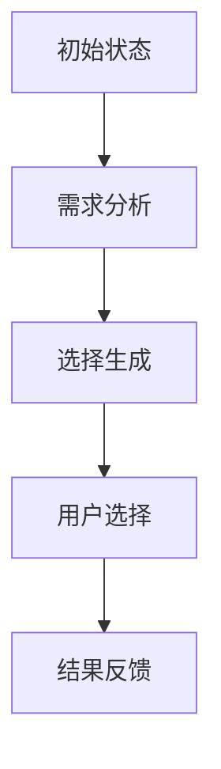
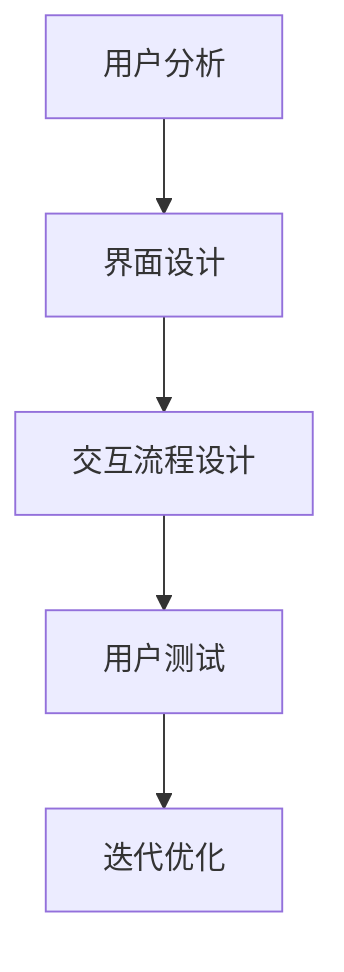
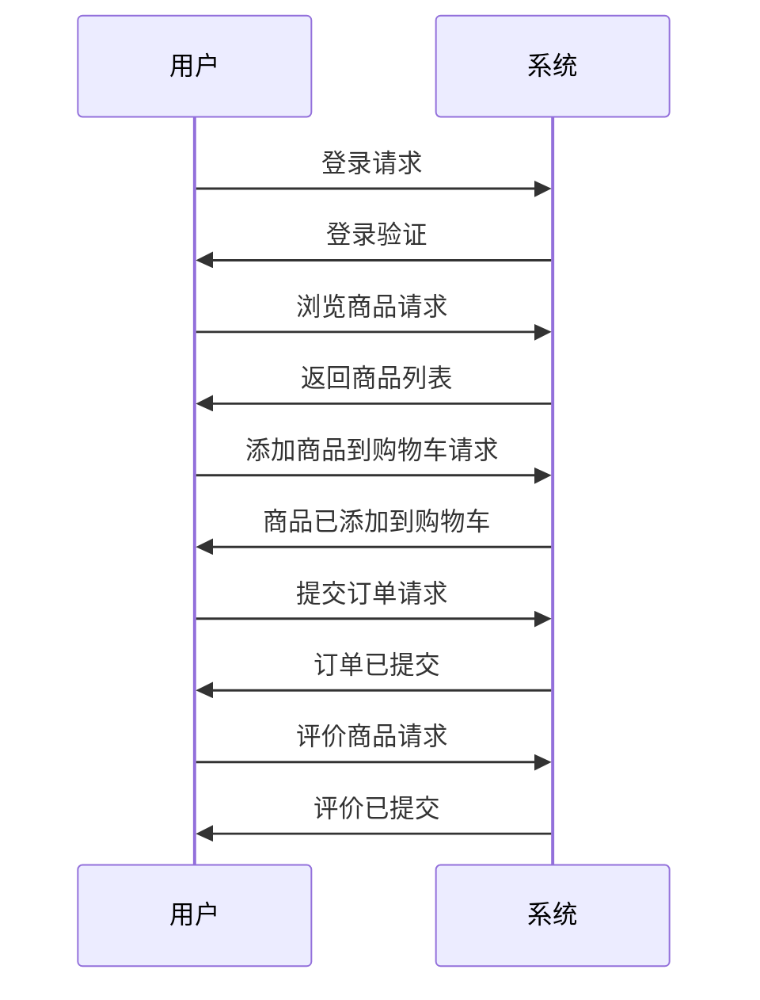

                 


###  萨特的自由意志论与人机交互设计

**摘要**：本文将探讨法国哲学家萨特的自由意志论与人机交互设计的关联。我们将首先介绍自由意志论的基本概念和萨特的哲学观点，然后分析人机交互设计的原则和当前面临的挑战。接着，我们将探讨萨特的自由意志论如何影响人机交互设计的理念和实践，并提供一些最佳实践技巧，以优化人机交互系统的自由度与人性化设计。

**关键词**：自由意志论，人机交互设计，萨特，哲学，用户体验，系统架构

---

## 萨特的自由意志论

### 1.1 自由意志论的历史背景

自由意志论是哲学中的一个重要议题，自古以来哲学家们对其进行了深入的探讨。古代哲学家如苏格拉底、柏拉图和亚里士多德都对自由意志有所论述。中世纪哲学则主要集中在神学和道德哲学上，对自由意志的探讨有所减弱。然而，进入现代哲学后，自由意志论再次成为热门话题，萨特便是其中的代表人物。

### 1.2 萨特的自由意志论

萨特（Jean-Paul Sartre）的哲学观点以其强烈的个人主义和存在主义著称。他认为，人类是自由的，我们的行为和决策完全由自己负责。萨特的自由意志论强调了个体自由的重要性，他主张人应该通过自己的选择来定义自己，这种选择是无条件自由的。

### 1.3 萨特自由意志论的哲学意义

萨特的自由意志论不仅对哲学产生了深远影响，也对心理学、社会学和文化研究等领域产生了重要影响。他的观点激发了人们对自我认知和自我实现的探讨，也引发了对人类行为和社会现象的新思考。

## 人机交互设计的基本原则

### 2.1 人机交互设计的发展历程

人机交互设计（HCI）作为一门学科，起源于20世纪中叶。早期的研究主要集中在计算机系统如何更好地适应用户的需求。随着计算机技术的发展，人机交互设计逐渐成为一门跨学科的领域，涵盖了心理学、认知科学、计算机科学和设计等多个领域。

### 2.2 人机交互设计的关键原则

人机交互设计的目标是创造一个用户友好、高效且愉悦的交互环境。为此，设计师需要遵循以下关键原则：

- **用户中心设计**：以用户的需求和体验为核心，确保设计的每一环节都考虑用户的需求和便利。
- **一致性**：保持界面和交互方式的统一性，使用户能够快速学习和掌握系统的使用方法。
- **可见性**：确保用户能够清晰地看到系统正在发生什么，以及如何操作。
- **可控性**：用户应该能够轻松地控制系统的行为和状态。
- **反馈**：及时给用户反馈，使用户能够了解系统的响应。

### 2.3 人机交互设计的挑战与机遇

随着技术的快速发展，人机交互设计面临着新的挑战和机遇。虚拟现实（VR）、增强现实（AR）和人工智能（AI）等新兴技术的应用为人机交互设计带来了更多的可能性，但也提出了更高的要求。

## 萨特的自由意志论与人机交互设计的联系

### 3.1 萨特的自由意志论与人机交互设计的理念

萨特的自由意志论强调个体的自由和自我决定，这种理念可以很好地应用于人机交互设计。在交互设计中，我们应该尊重用户的自由，为他们提供多种选择和灵活的操作方式，而不是将他们束缚在固定的模式中。

### 3.2 人机交互设计中的自由度

自由度是衡量人机交互设计好坏的重要指标。高自由度意味着用户可以按照自己的需求和偏好来使用系统，而低自由度则可能限制用户的创造性。在设计中，我们应该努力提高系统的自由度，为用户提供更多的控制和灵活性。

### 3.3 人机交互设计的人性化

人性化设计是确保用户在使用过程中感到舒适和愉快的关键。萨特的自由意志论提醒我们，人性化设计不仅仅是考虑用户的需求，更是要尊重用户的个性和自由。通过设计富有个性化和人性化的交互方式，我们可以提高用户的满意度和忠诚度。

## 人机交互设计的方法与工具

### 4.1 人机交互设计的方法

人机交互设计的方法包括用户研究、需求分析、设计原型、用户测试和迭代改进等。每种方法都有其特定的步骤和工具，设计师需要根据项目的需求和阶段选择合适的方法。

### 4.2 人机交互设计的工具

人机交互设计的工具包括Sketch、Figma、Adobe XD等设计软件，Axure RP、Balsamiq等原型设计工具，以及各种用户测试和分析工具。这些工具可以帮助设计师高效地完成设计任务，并确保设计的可行性和用户体验。

### 4.3 人机交互设计的方法与工具的应用

在实际项目中，设计师需要结合多种方法和工具，进行全面的用户研究和需求分析，设计出符合用户需求的原型，并进行用户测试和迭代改进。通过这种方法，设计师可以不断优化设计，提高用户体验。

## 自由意志论的算法原理

### 5.1 自由意志论的算法流程图

为了更好地理解自由意志论的算法原理，我们可以设计一个简单的流程图。这个流程图可以分为几个步骤：

1. **初始状态**：用户开始使用系统。
2. **需求分析**：系统收集用户的需求和偏好。
3. **选择生成**：系统根据用户的需求和偏好生成多种选择。
4. **用户选择**：用户在多种选择中做出决策。
5. **结果反馈**：系统反馈用户的选择结果。



### 5.2 自由意志论的数学模型与公式

自由意志论的数学模型可以描述为：

$$
自由度 = f(需求，偏好，选择)
$$

其中，自由度是用户在交互过程中感受到的自由程度，需求、偏好和选择是影响自由度的关键因素。

### 5.3 自由意志论的实例讲解

假设用户需要选择一个餐厅，需求是距离近、环境好、口味多样。偏好是喜欢日式料理，对价格不太敏感。选择可以是附近的日本餐厅、中式餐厅和意式餐厅。

根据自由意志论的数学模型，我们可以计算用户的自由度：

$$
自由度 = f(距离近, 环境好, 口味多样) \times f(日式料理, 价格不敏感) = 高
$$

这意味着用户在这次选择中具有较高的自由度。

## 人机交互设计的算法原理

### 6.1 人机交互设计的算法流程图

人机交互设计的算法流程图可以分为以下几个步骤：

1. **用户分析**：收集用户的基本信息、需求和偏好。
2. **界面设计**：根据用户分析和需求设计界面。
3. **交互流程设计**：设计用户与系统的交互流程。
4. **用户测试**：对设计进行用户测试，收集反馈。
5. **迭代优化**：根据用户测试结果优化设计。



### 6.2 人机交互设计的数学模型与公式

人机交互设计的数学模型可以描述为：

$$
用户体验 = f(界面设计，交互流程，用户反馈)
$$

其中，用户体验是用户在使用系统过程中的感受，界面设计、交互流程和用户反馈是影响用户体验的关键因素。

### 6.3 人机交互设计的实例讲解

假设我们需要设计一个在线购物平台。用户分析显示，用户的主要需求是购物方便、商品丰富、价格合理。偏好是喜欢简单易用的界面和快速响应的购物流程。

根据人机交互设计的数学模型，我们可以计算用户体验：

$$
用户体验 = f(简单易用的界面，快速响应的购物流程，用户反馈) = 高
$$

这意味着我们的设计在满足用户需求和偏好方面做得很好，用户会有良好的体验。

## 人机交互设计系统概述

### 7.1 系统功能设计

人机交互设计系统的功能设计主要包括用户注册与登录、商品浏览与搜索、购物车管理、订单处理、用户评价等。

### 7.2 系统架构设计

人机交互设计系统的架构设计可以分为前端、后端和数据库三个部分。前端负责界面展示和用户交互，后端负责数据处理和业务逻辑，数据库负责存储用户数据和商品信息。

### 7.3 系统接口设计

系统接口设计主要包括用户接口（UI）和程序接口（API）。用户接口用于用户与系统的交互，程序接口用于系统内部模块之间的数据传递和业务逻辑处理。

## 人机交互设计系统的交互设计

### 8.1 系统交互序列图

系统交互序列图可以展示用户与系统之间的交互流程。以下是一个简化的系统交互序列图：



### 8.2 系统交互流程解析

在系统交互流程中，用户通过用户接口与系统进行交互。系统通过程序接口处理用户的请求，并在数据库中存储和查询数据。用户接口和程序接口的设计需要确保交互的流畅性和高效性。

### 8.3 系统交互案例分析

以用户提交订单为例，当用户点击“提交订单”按钮时，系统会首先验证用户是否已经登录，然后根据购物车中的商品信息生成订单，并更新数据库中的订单信息。最后，系统会向用户反馈订单提交成功的信息。

## 项目实战

### 9.1 环境安装与配置

在进行人机交互设计项目之前，我们需要安装和配置必要的开发环境和工具。以下是安装和配置的步骤：

1. 安装操作系统：推荐使用Linux操作系统，如Ubuntu。
2. 安装前端设计工具：安装Figma或Adobe XD等设计工具。
3. 安装后端开发框架：安装如Django或Flask等后端开发框架。
4. 安装数据库：安装MySQL或PostgreSQL等数据库系统。
5. 安装编程语言：安装Python等编程语言。

### 9.2 系统核心实现

在系统核心实现部分，我们需要编写前端界面代码、后端业务逻辑代码和数据库操作代码。以下是一个简单的Python代码示例，用于实现用户注册功能：

```python
def register(username, password):
    # 连接数据库
    db = connect_database()
    cursor = db.cursor()
    
    # 查询用户名是否已存在
    cursor.execute("SELECT * FROM users WHERE username=%s", (username,))
    user = cursor.fetchone()
    
    if user:
        return "用户名已存在"
    
    # 插入新用户
    cursor.execute("INSERT INTO users (username, password) VALUES (%s, %s)", (username, password))
    db.commit()
    
    return "注册成功"
```

### 9.3 项目案例分析

以下是一个简单的项目案例分析：

**项目背景**：开发一个在线书店，用户可以浏览和购买书籍。

**需求分析**：用户需要能够注册账号、登录系统、浏览书籍、添加书籍到购物车、提交订单和评价书籍。

**系统功能设计**：用户注册与登录、商品浏览与搜索、购物车管理、订单处理、用户评价。

**系统架构设计**：前端使用HTML、CSS和JavaScript，后端使用Flask框架，数据库使用MySQL。

**项目小结**：通过以上设计和实现，我们成功开发了一个简单的在线书店系统。用户可以方便地浏览和购买书籍，系统也提供了用户评价功能，增强了用户体验。

## 最佳实践与总结

### 10.1 最佳实践 tips

- **用户研究先行**：在进行人机交互设计之前，一定要进行充分的用户研究，了解用户的需求和偏好。
- **简洁明了的界面设计**：界面设计应简洁明了，避免过多的干扰元素，使用户能够轻松操作。
- **及时反馈**：确保系统在用户操作时能够及时给出反馈，使用户知道系统正在响应。
- **可访问性**：设计应考虑到各种用户，包括残疾人和老年人，确保系统的可访问性。
- **持续迭代**：设计不是一成不变的，应根据用户反馈和数据分析，持续迭代优化。

### 10.2 小结

本文探讨了萨特的自由意志论与人机交互设计的关联，从自由意志论的基本概念到人机交互设计的原则，再到实际项目案例，我们系统地阐述了如何将哲学观点应用于交互设计，以提升用户体验。

### 10.3 注意事项

- **用户隐私保护**：在设计过程中，务必注意用户隐私保护，遵守相关法律法规。
- **性能优化**：确保系统的响应速度和性能，避免用户等待时间长。

### 10.4 拓展阅读

- [《存在与虚无》](https://books.google.com/books?id=QJzHAgAAQBAJ&pg=PA1&lpg=PA1&dq=sartre+existence+and+nothingness&source=bl&ots=6y8B75QcNM&sig=ACfU3U1_7777777&hl=en) by Jean-Paul Sartre
- [《人机交互设计指南》](https://www.amazon.com/dp/0470149490) by Ben Shneiderman

### 作者信息

作者：AI天才研究院/AI Genius Institute & 禅与计算机程序设计艺术 /Zen And The Art of Computer Programming

