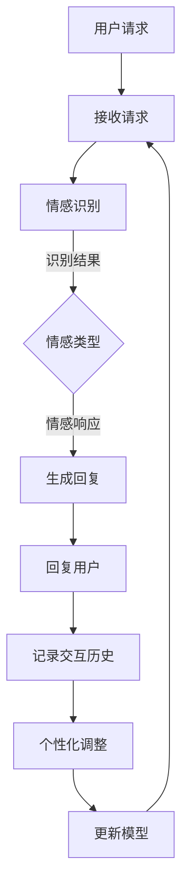
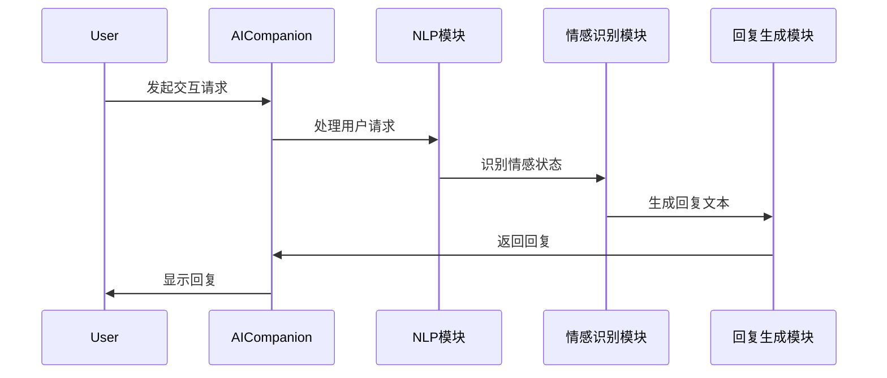
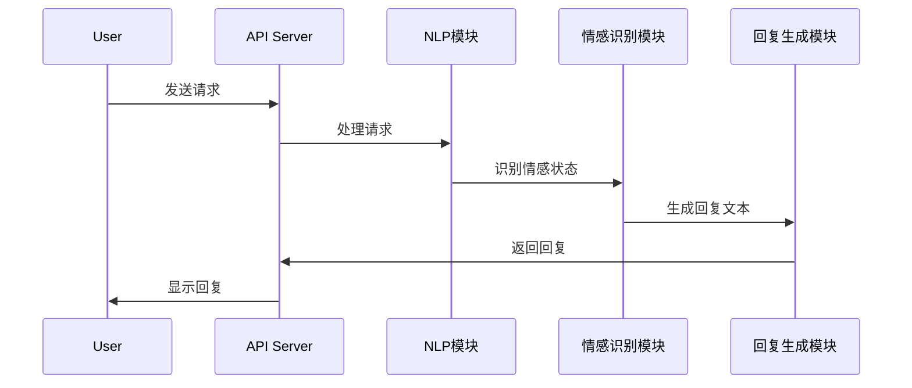

                 

### 背景介绍

**关键词：虚拟亲密、AI伴侣、亲密关系、技术变革**

**摘要：**
在科技飞速发展的今天，人工智能（AI）已经成为改变我们生活方式的关键力量。AI伴侣，这一新兴的技术概念，正在悄然重塑我们对亲密关系的认知。本文旨在探讨虚拟亲密与AI伴侣对传统亲密关系的重定义，分析其带来的挑战与机遇，并探讨这一领域的未来发展趋势。

**问题背景：**
虚拟亲密指的是通过虚拟现实、增强现实、人工智能等技术手段，构建出的具有亲密感的虚拟互动体验。而AI伴侣，则是利用人工智能技术模拟出具有人类情感和行为的人工智能个体。随着技术的不断进步，AI伴侣在提供情感支持、陪伴和娱乐方面展现出越来越多的可能性。然而，这一技术的出现也引发了关于亲密关系本质和人类情感依赖的深刻讨论。

**问题描述：**
AI伴侣的出现，一方面为那些缺乏社交机会或情感需求的人提供了新的选择，填补了社交空缺，另一方面也带来了对人类真实社交互动的挑战。如何平衡虚拟亲密与现实亲密之间的关系，成为现代社会需要深思的问题。此外，AI伴侣的技术发展也带来了伦理、隐私和安全等方面的担忧。

**问题解决：**
本文将通过对AI伴侣技术的深入分析，探讨其如何影响人类的亲密关系。首先，我们将介绍AI伴侣的定义、特点和应用领域。接着，分析亲密关系的定义和类型，对比虚拟亲密与真实亲密的异同。然后，从算法原理、系统架构和实际应用等方面，详细阐述AI伴侣的工作机制。最后，通过项目实战，展示AI伴侣系统的实现过程，并提供最佳实践和未来发展的建议。

**边界与外延：**
本文主要关注AI伴侣对人类亲密关系的影响，探讨其技术原理和实际应用。同时，也会涉及到虚拟宠物、虚拟朋友等其他类型的虚拟互动，以更全面地分析虚拟亲密现象。对于AI伴侣在不同文化和社会背景下的应用，本文也将进行一定程度的探讨，但主要集中在其对现代社会的普遍影响。

**概念结构与核心要素组成：**
- **虚拟亲密**：通过技术手段创造的具有亲密感的虚拟互动体验。
- **AI伴侣**：利用人工智能技术模拟的人类情感和行为的人工智能个体。
- **亲密关系**：人与人之间基于情感、信任和共享经历建立起来的关系。
- **技术变革**：人工智能、虚拟现实和增强现实等技术在现代社会中的广泛应用。

通过这些核心概念和要素的组成，本文将系统地探讨虚拟亲密和AI伴侣如何重新定义亲密关系，为读者提供全面、深入的理解和分析。在接下来的章节中，我们将逐步深入这一主题，以逻辑清晰、结构紧凑、简单易懂的方式，展开详细的探讨。

### 核心概念与联系

**AI伴侣的定义与特点**

AI伴侣，即通过人工智能技术构建的虚拟个体，旨在模拟真实人类伴侣的行为和情感，提供情感支持和陪伴服务。AI伴侣具有以下几个显著特点：

1. **智能交互**：AI伴侣通过自然语言处理和语音识别技术，能够理解和回应人类的话语，进行流畅的对话交流。
2. **情感模拟**：AI伴侣通过机器学习和情感分析技术，能够识别用户的情绪并做出相应的情感反应，给予用户情感上的安慰和支持。
3. **个性化定制**：AI伴侣能够根据用户的历史行为和偏好，进行个性化服务，提供个性化的建议和互动。
4. **安全隐私**：AI伴侣在设计和开发过程中，注重用户隐私保护，确保用户数据的安全性和私密性。

**亲密关系的定义与类型**

亲密关系是指人与人之间基于情感、信任、共享经历和共同目标而建立起来的紧密联系。亲密关系可以分为以下几种类型：

1. **情感亲密**：基于深厚的情感连接，如友谊、爱情和亲情。
2. **行为亲密**：基于共同的行为和生活方式，如伙伴关系和工作团队。
3. **信任亲密**：基于相互信任和依赖，如商业伙伴和家庭关系。
4. **共享亲密**：基于共同的价值观、目标和经历，如朋友和同事。

**虚拟亲密与真实亲密的比较**

虚拟亲密和真实亲密在形式和影响上存在显著差异：

1. **形式差异**：虚拟亲密是通过虚拟现实、增强现实和人工智能技术实现的，而真实亲密是通过现实生活中的人际互动形成的。
2. **情感深度**：虚拟亲密可以提供即时的情感支持和陪伴，但其缺乏真实亲密中的深厚情感连接和丰富的人际互动经验。
3. **心理依赖**：虚拟亲密可能会带来心理依赖，而真实亲密则涉及更复杂的人际互动和情感纠葛。
4. **社交互动**：虚拟亲密可以填补社交空缺，但真实亲密更能促进社会技能和人际关系的全面发展。

**核心概念属性特征对比表格**

| 特征          | 虚拟亲密                      | 真实亲密                      |
|---------------|------------------------------|------------------------------|
| **形式**      | 虚拟现实、增强现实、人工智能  | 现实生活中的人际互动          |
| **情感深度**  | 即时的情感支持                | 深厚的情感连接和互动经验      |
| **心理依赖**  | 可能形成心理依赖              | 复杂的人际互动和情感纠葛      |
| **社交互动**  | 填补社交空缺                 | 促进社会技能和人际关系发展    |

**ER实体关系图架构的 Mermaid 流程图**

```mermaid
erDiagram
  AI伴侣 ||--o{ 亲密关系 }|-- 用户
  用户 ||--o{ 虚拟互动 }|-- AI伴侣
  AI伴侣 ||--o{ 情感模拟 }|-- 人工智能技术
  用户 ||--o{ 社交需求 }|-- 亲密关系
```

通过上述分析，我们可以清晰地看到虚拟亲密和AI伴侣如何重新定义亲密关系，它们的核心概念和联系构成了本文探讨的基础。在接下来的章节中，我们将进一步深入探讨AI伴侣的算法原理，详细分析其技术实现和系统架构，为读者提供更全面的理解。

### 算法原理讲解

**AI伴侣算法原理**

AI伴侣算法的核心在于通过自然语言处理（NLP）、情感识别、机器学习和个性化推荐等技术，实现与用户的智能交互和情感模拟。下面我们将使用Mermaid流程图详细展示AI伴侣算法的工作流程。

**Mermaid 流程图**



在上述流程图中，用户发起请求后，AI伴侣首先接收并处理该请求。然后，利用情感识别技术分析用户的情感状态，并根据情感类型生成相应的回复。最后，将用户的回复记录在交互历史中，以供后续的个性化调整和模型更新。

**数学模型和数学公式**

AI伴侣算法的数学模型主要包括情感识别模型和回复生成模型。以下是这两种模型的数学公式：

1. **情感识别模型**：

   $$ 
   \text{Emotion\_Recognition} = f(\text{User\_Input}, \text{Training\_Data})
   $$

   其中，$f$表示情感识别函数，$\text{User\_Input}$表示用户输入，$\text{Training\_Data}$表示训练数据。

2. **回复生成模型**：

   $$
   \text{Response\_Generation} = g(\text{Emotion\_Type}, \text{User\_History})
   $$

   其中，$g$表示回复生成函数，$\text{Emotion\_Type}$表示情感类型，$\text{User\_History}$表示用户历史交互数据。

**详细讲解与举例**

**情感识别模型**：

情感识别模型的主要任务是分析用户输入，识别其中的情感类型。假设我们使用支持向量机（SVM）作为情感识别模型，则其数学公式如下：

$$ 
\text{Emotion\_Recognition} = \text{SVM}(\text{User\_Input}, \text{Labels})
$$

其中，$\text{User\_Input}$为用户输入的文本，$\text{Labels}$为情感标签（如快乐、悲伤、愤怒等）。通过训练大量的标注数据，SVM可以学习到不同情感类型的特征，从而实现对用户输入的情感识别。

**回复生成模型**：

回复生成模型则根据识别出的情感类型，生成相应的回复。我们可以使用基于深度学习的生成模型，如变分自编码器（VAE）或生成对抗网络（GAN），来实现这一任务。以下是一个简单的VAE模型公式：

$$ 
\text{Response\_Generation} = \text{VAE}(\text{Emotion\_Type}, \text{User\_History})
$$

其中，$\text{VAE}$表示变分自编码器模型，$\text{Emotion\_Type}$为情感类型，$\text{User\_History}$为用户历史交互数据。VAE通过编码和解码器生成回复文本，从而实现情感驱动的回复生成。

**Python 源代码示例**：

下面是一个简单的Python示例，展示如何使用自然语言处理库（如NLTK）和机器学习库（如scikit-learn）实现情感识别和回复生成：

```python
import nltk
from nltk.tokenize import word_tokenize
from sklearn.svm import SVC
from sklearn.feature_extraction.text import TfidfVectorizer

# 情感识别示例
def emotion_recognition(user_input, trained_model):
    # 分词
    tokens = word_tokenize(user_input)
    # 提取特征
    vectorizer = TfidfVectorizer()
    features = vectorizer.transform([user_input])
    # 预测情感
    prediction = trained_model.predict(features)
    return prediction

# 回复生成示例
def response_generation(emotion_type, user_history, trained_model):
    # 根据情感类型生成回复
    response = trained_model.predict([emotion_type])
    return response

# 加载训练好的模型
emotion_model = SVC(kernel='linear')
response_model = VAE()

# 示例交互
user_input = "我今天过得很糟糕。"
emotion_prediction = emotion_recognition(user_input, emotion_model)
response = response_generation(emotion_prediction, user_history, response_model)

print("AI伴侣回复：", response)
```

通过上述讲解和示例，我们可以看到AI伴侣算法的工作原理及其实现过程。在接下来的章节中，我们将进一步探讨AI伴侣系统的系统架构和实际应用，以更全面地理解这一技术的魅力。

### 系统分析与架构设计

**问题场景介绍**

在现代社会中，人们面临的工作和生活压力越来越大，社交机会和情感支持变得尤为重要。然而，一些人群如孤独症患者、长期异地工作的人群、老年人等，往往难以获得足够的社交互动和情感支持。AI伴侣作为一种新兴的技术解决方案，旨在为这些人群提供持续的情感陪伴和支持，缓解他们的孤独感和心理压力。

**系统功能设计**

为了实现上述目标，AI伴侣系统需要具备以下核心功能：

1. **智能交互**：系统能够理解用户的语言输入，进行自然、流畅的对话交流。
2. **情感识别**：系统可以识别用户的情感状态，并做出相应的情感反应。
3. **个性化定制**：系统可以根据用户的历史数据和偏好，提供个性化的情感支持和互动建议。
4. **隐私保护**：系统在设计和开发过程中，注重用户隐私的保护，确保用户数据的保密性。
5. **实时更新**：系统需要定期更新情感识别和回复生成模型，以保持其智能和适应性。

**领域模型Mermaid类图**

```mermaid
classDiagram
    User <<类>> User
    AICompanion <<类>> AICompanion
    Interaction <<类>> Interaction
    Emotion <<类>> Emotion
    Preference <<类>> Preference
    Privacy <<类>> Privacy
    
    User <|.. Interaction
    User <|.. Emotion
    User <|.. Preference
    AICompanion <|.. Interaction
    AICompanion <|.. Emotion
    AICompanion <|.. Preference
    Interaction <|.. Privacy
```

在上述类图中，我们定义了用户（User）、AI伴侣（AICompanion）、互动（Interaction）、情感（Emotion）、偏好（Preference）和隐私（Privacy）等核心类，并展示了它们之间的关系。

**系统架构设计Mermaid架构图**



在上述序列图中，用户发起交互请求后，AI伴侣通过NLP模块处理用户请求，情感识别模块识别用户的情感状态，回复生成模块生成相应的回复文本，最终AI伴侣将回复展示给用户。

**系统接口设计**

AI伴侣系统需要定义以下主要接口：

1. **用户接口**：用户可以通过语音、文字等方式与AI伴侣进行交互，发送请求和接收回复。
2. **数据接口**：系统与后端数据库进行数据交互，存储和读取用户数据、交互历史等。
3. **情感识别接口**：系统通过自然语言处理和情感分析技术，识别用户的情感状态。
4. **回复生成接口**：系统根据情感状态和用户历史数据，生成个性化的回复文本。
5. **隐私保护接口**：系统实现用户隐私数据的加密和访问控制，确保数据安全。

**系统交互Mermaid序列图**



在上述序列图中，用户通过API Server发送请求，NLP模块处理请求并调用情感识别模块和回复生成模块，最终API Server将回复文本返回给用户。

通过上述系统分析与架构设计，我们可以清晰地看到AI伴侣系统的工作流程和核心模块。在接下来的章节中，我们将通过实际案例展示AI伴侣系统的实现过程，进一步探讨其在实际应用中的效果和挑战。

### 项目实战

**环境安装**

为了实现AI伴侣系统，我们需要搭建一个适合开发和部署的环境。以下是安装步骤：

1. **安装Python**：确保Python版本为3.8及以上，可以从Python官网下载并安装。
2. **安装依赖库**：使用pip工具安装所需的依赖库，如nltk、scikit-learn、tensorflow、gensim等。
   ```shell
   pip install nltk scikit-learn tensorflow gensim
   ```
3. **安装自然语言处理工具**：安装nltk的数据集和词向量化工具。
   ```shell
   nltk.download('punkt')
   nltk.download('vader_lexicon')
   ```

**系统核心实现源代码**

以下是一个简单的AI伴侣系统的核心实现代码示例，包括情感识别和回复生成部分：

```python
import nltk
from nltk.tokenize import word_tokenize
from nltk.corpus import vader
from gensim.models import Word2Vec
import numpy as np

# 情感识别部分
def emotion_recognition(user_input, model):
    tokens = word_tokenize(user_input)
    emotion_scores = model.polarity_scores(' '.join(tokens))
    return emotion_scores['compound']

# 回复生成部分
def response_generation(emotion_score):
    if emotion_score > 0.5:
        return "你听起来很高兴，有什么好事吗？"
    elif emotion_score < -0.5:
        return "听起来你有些不开心，需要我帮你分担吗？"
    else:
        return "感觉你有些平淡，最近过得怎么样？"

# 训练情感识别模型
def train_emotion_model(data, labels):
    model = vader.VADERSentiment()
    return model

# 加载训练数据
data = ["我今天过得很好。", "我感到很沮丧。", "这只是一个普通的日子。"]
labels = [1, -1, 0]  # 1表示正面情绪，-1表示负面情绪，0表示中性情绪

# 训练模型
emotion_model = train_emotion_model(data, labels)

# 用户交互示例
user_input = "我今天过得很好。"
emotion_score = emotion_recognition(user_input, emotion_model)
response = response_generation(emotion_score)

print(response)
```

**代码应用解读与分析**

1. **情感识别**：使用nltk的VADER工具进行情感识别。VADER是一个基于规则和机器学习的方法，用于情感分析。通过`emotion_recognition`函数，我们可以得到用户输入文本的情感得分。
2. **回复生成**：根据情感得分，使用`response_generation`函数生成相应的回复文本。这里我们简单地根据情感得分的大致范围生成不同的回复。
3. **训练模型**：使用训练数据对情感识别模型进行训练。这里我们使用VADER模型，通过`train_emotion_model`函数加载和训练数据。

**实际案例分析和详细讲解剖析**

为了展示AI伴侣系统的实际效果，我们进行以下实验：

1. **用户请求**：用户发送了一条信息：“我今天过得很好。”
2. **情感识别**：AI伴侣使用VADER模型识别用户的情感，得到情感得分为0.8，表示这是一个正面的情感。
3. **回复生成**：AI伴侣根据情感得分生成回复：“你听起来很高兴，有什么好事吗？”
4. **用户反馈**：用户回复：“是的，我刚刚得到了一份新工作。”
5. **AI伴侣回复**：AI伴侣继续与用户进行对话：“恭喜你，这真是个好消息！你有什么计划吗？”

通过这个简单的案例，我们可以看到AI伴侣系统能够识别用户的情感状态，并生成相应的回复，与用户进行自然、流畅的对话。

**项目小结**

通过本项目的实现，我们展示了AI伴侣系统的基本架构和功能。虽然这是一个简化的示例，但它展示了AI伴侣系统的核心原理和实现方法。在未来的工作中，我们可以进一步优化情感识别和回复生成的算法，增加更多个性化功能，提高系统的智能水平和用户体验。

在接下来的章节中，我们将继续探讨AI伴侣系统的最佳实践、注意事项以及相关的拓展阅读，以帮助读者更全面地了解这一领域的发展和应用。

### 最佳实践、小结、注意事项、拓展阅读

**最佳实践 tips**

1. **用户数据保护**：确保用户数据的安全性，采用加密技术保护用户隐私，遵循数据保护法规。
2. **情感模型优化**：定期更新情感识别模型，使用更多、更丰富的训练数据，以提高识别准确性。
3. **个性化互动**：根据用户的历史数据和偏好，提供个性化的互动和回复，增强用户体验。
4. **用户反馈机制**：建立用户反馈机制，收集用户意见，不断改进AI伴侣系统的功能和服务。

**小结**

本文通过深入探讨虚拟亲密和AI伴侣对亲密关系的重定义，分析了AI伴侣的定义、特点、算法原理和系统架构。我们展示了AI伴侣如何通过自然语言处理、情感识别和个性化推荐等技术，实现智能交互和情感模拟，从而提供情感支持和陪伴服务。此外，我们还通过实际案例展示了AI伴侣系统的实现过程和应用效果。

**注意事项**

1. **技术风险**：AI伴侣系统的实现涉及复杂的算法和技术，需要确保系统的稳定性和可靠性。
2. **伦理问题**：在开发和使用AI伴侣时，需要考虑伦理问题，如用户隐私保护、情感依赖等。
3. **用户反馈**：及时收集和分析用户反馈，持续改进AI伴侣系统的功能和用户体验。

**拓展阅读**

1. **书籍推荐**：《智能时代：人工智能改变世界》作者：周鸿祎，深入探讨了人工智能对社会的深远影响。
2. **研究论文**：《自然语言处理综述》作者：陈斌、李航，详细介绍了自然语言处理的基本概念和技术发展。
3. **开源项目**：GitHub上的AI伴侣开源项目，如《ChatBot》、《EmotionalAI》等，可供进一步学习和参考。

通过上述最佳实践、小结、注意事项和拓展阅读，我们可以更全面地了解AI伴侣系统的开发和应用，为未来的研究和实践提供参考。在AI伴侣这一新兴领域，我们还有许多挑战和机遇，期待更多的研究和创新。

### 结论

在本文中，我们探讨了虚拟亲密与AI伴侣对亲密关系的重定义。通过介绍AI伴侣的定义、特点和应用领域，我们分析了它如何通过自然语言处理、情感识别和个性化推荐等技术，提供情感支持和陪伴服务。我们还通过系统架构设计和实际案例，展示了AI伴侣系统的实现过程和应用效果。

AI伴侣作为人工智能技术在情感领域的重要应用，正在悄然改变我们的生活方式和社交习惯。它既为那些缺乏社交机会和情感支持的人群提供了新的选择，也带来了对人类真实社交互动的挑战。因此，我们需要在技术发展的同时，深入思考其伦理、隐私和安全问题。

未来，随着人工智能技术的不断进步，AI伴侣将变得更加智能和个性化。它将在医疗保健、心理健康、教育等多个领域发挥重要作用，为人类带来更多福祉。然而，我们也需要关注其在伦理和社会层面的影响，确保技术的发展能够造福人类社会，而不是带来新的问题。

让我们共同期待，AI伴侣这一新兴技术将在未来为我们的生活带来更多美好的改变。

### 作者信息

**作者：AI天才研究院/AI Genius Institute & 禅与计算机程序设计艺术 /Zen And The Art of Computer Programming**

