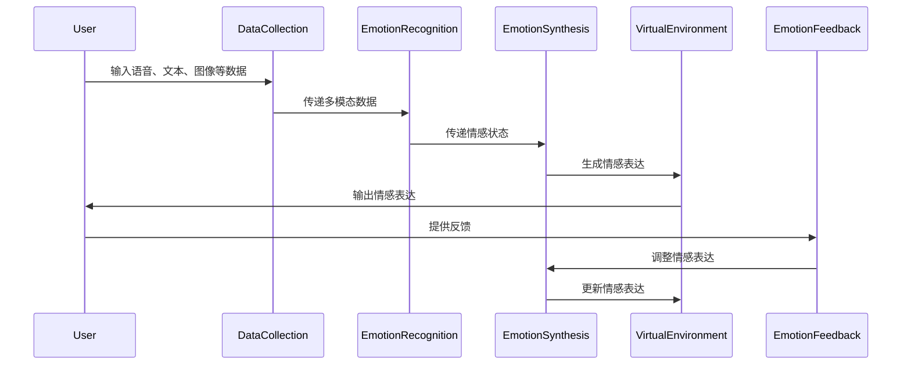
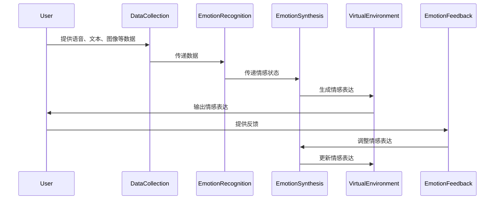
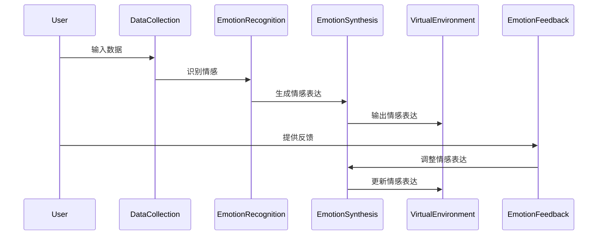

                 


# 虚拟感官:AI增强人类情感体验

## 关键词

- 虚拟感官
- AI
- 情感体验
- 情感识别
- 情感合成
- 情感反馈
- 人工智能算法

## 摘要

本文深入探讨了虚拟感官与人工智能（AI）结合以增强人类情感体验的课题。首先，我们介绍了虚拟感官和AI的基本概念及其发展背景。接着，文章阐述了虚拟感官如何通过AI技术增强人类情感体验，并详细介绍了情感识别、情感合成和情感反馈等核心算法原理。随后，我们通过具体应用实例展示了这些技术在虚拟现实娱乐和远程社交互动等领域的实际应用。文章还分析了AI增强情感体验面临的挑战，并展望了未来的发展趋势。最后，文章总结了全文内容，并提出了对这一领域的展望。

## 引言

### 1.1 书籍背景介绍

在现代社会，随着科技的发展，人工智能（AI）逐渐成为改变人们生活方式的重要力量。AI技术不仅在工业、医疗、交通等领域取得了显著的成果，还在娱乐、社交、教育等多个方面产生了深远影响。特别是在虚拟感官领域，AI的应用为人们提供了更加丰富和逼真的情感体验。

虚拟感官是指通过计算机技术模拟和增强人类感官功能，使其在虚拟环境中获得类似真实的感知体验。虚拟感官技术包括视觉、听觉、触觉、嗅觉和味觉等多个方面。随着AI技术的发展，虚拟感官的逼真度和互动性得到了显著提升，使得虚拟现实（VR）和增强现实（AR）等应用场景得以广泛应用。

### 1.2 AI与情感体验的关系

情感体验是人类与外界互动的重要方式，对个体的心理和行为产生深远影响。然而，传统的虚拟感官技术往往难以准确捕捉和传递情感，导致虚拟环境与真实世界的情感体验存在较大差距。随着AI技术的发展，尤其是情感识别、情感合成和情感反馈等算法的进步，AI开始能够模拟和增强人类的情感体验。

AI通过情感识别技术，可以捕捉和分析用户在虚拟环境中的情感状态，为情感合成提供基础。情感合成技术则能够根据用户的情感状态生成相应的情感表达，使得虚拟环境中的角色或物体能够与用户产生情感共鸣。此外，情感反馈技术能够根据用户的反馈调整虚拟环境的情感表达，形成一个动态的、互动的情感体验闭环。

### 1.3 书籍结构概述

本文将分为七个主要部分进行讨论：

1. 引言：介绍AI与人类情感体验的关系。
2. 背景知识：介绍与虚拟感官和AI相关的背景知识。
3. 核心概念：解释AI如何增强人类情感体验。
4. 算法与实现：介绍相关的算法原理和实现方法。
5. 应用实例：通过具体的实例展示AI增强人类情感体验的实际应用。
6. 挑战与未来：探讨AI增强人类情感体验面临的挑战和未来的发展趋势。
7. 结论：总结全书内容，提出展望。

## 背景知识

### 2.1 AI基础

#### 2.1.1 人工智能的定义

人工智能（Artificial Intelligence，简称AI）是指由人制造出来的具有一定智能的系统或机器。AI的目标是模拟、延伸和扩展人类的智能能力，使其能够在特定任务上表现出人类的智能行为。AI可以分为弱AI和强AI。弱AI是指专注于特定任务的AI系统，例如语音识别、图像识别等。强AI则是指具备人类智能的通用AI系统，能够像人类一样处理各种任务。

#### 2.1.2 人工智能的历史与发展

人工智能的概念最早可以追溯到20世纪50年代。1956年，达特茅斯会议标志着人工智能领域的正式诞生。此后，AI经历了多个发展阶段。20世纪60年代，AI主要集中在符号主义方法上，通过逻辑推理和知识表示实现智能。20世纪70年代，专家系统的兴起使得AI在特定领域取得了突破。20世纪80年代，机器学习开始受到重视，尤其是在模式识别和预测方面。20世纪90年代以后，随着计算能力和算法的进步，AI开始向深度学习和大数据领域发展。

#### 2.1.3 人工智能的分类

根据AI的技术特点和应用场景，AI可以分为多个类别：

- 符号主义AI：基于逻辑推理和知识表示的方法，如专家系统。
- 统计学习AI：基于数据驱动的方法，如支持向量机、决策树等。
- 深度学习AI：基于多层神经网络的方法，如卷积神经网络（CNN）、循环神经网络（RNN）等。
- 生成对抗网络（GAN）：用于生成逼真的图像、音频和文本。
- 自然语言处理（NLP）：用于处理和理解人类语言。
- 计算机视觉：用于理解和解释视觉信息。

### 2.2 情感体验

#### 2.2.1 情感体验的定义

情感体验是指个体在特定情境下产生的情绪反应，通常包括情绪感受、情绪表达和情绪认知等方面。情感体验不仅与个体的生理和心理状态有关，还受到外部环境和文化背景的影响。情感体验可以分为正面情感和负面情感，如快乐、悲伤、愤怒等。

#### 2.2.2 情感体验的影响因素

情感体验的影响因素多种多样，包括：

- 生理因素：如体温、心率、荷尔蒙等。
- 心理因素：如认知风格、人格特质、心理压力等。
- 社会因素：如文化背景、社会支持、人际关系等。
- 环境因素：如物理环境、社会环境等。

#### 2.2.3 情感体验的类型与特点

情感体验的类型可以分为基本情感和复合情感。基本情感包括快乐、悲伤、愤怒、恐惧等，是人类共有的情感体验。复合情感则是在基本情感的基础上形成的，如爱、厌恶、焦虑等。情感体验的特点包括：

- 体验性：情感体验是一种主观感受，不同个体可能会有不同的情感体验。
- 情境性：情感体验通常与特定情境相关，不同的情境会导致不同的情感体验。
- 动态性：情感体验是动态变化的，会随着时间和情境的变化而变化。
- 情绪性：情感体验通常伴随着情绪反应，如表情、生理反应等。

## 核心概念

### 3.1 虚拟感官

#### 3.1.1 虚拟感官的定义

虚拟感官是指通过计算机技术模拟和增强人类感官功能，使其在虚拟环境中获得类似真实的感知体验。虚拟感官技术包括视觉、听觉、触觉、嗅觉和味觉等多个方面。通过虚拟感官技术，用户可以在虚拟环境中体验到视觉、听觉、触觉等感官刺激，从而产生类似于现实世界的感知体验。

#### 3.1.2 虚拟感官的工作原理

虚拟感官的工作原理主要包括以下几个方面：

1. 感知模拟：通过计算机生成或模拟现实世界的感知信息，如图像、声音、气味等。
2. 输入接口：将感知信息通过视觉、听觉、触觉等接口传递给用户。
3. 感知处理：用户对感知信息进行处理，形成情感体验。
4. 反馈机制：用户对虚拟环境的反馈信息，如手势、表情等，通过输入接口传递给计算机，调整虚拟环境的感知信息。

#### 3.1.3 虚拟感官的优势与挑战

虚拟感官的优势包括：

- 提供丰富的感官体验：通过虚拟感官技术，用户可以在虚拟环境中体验到丰富的感官刺激，提高虚拟现实的逼真度。
- 增强互动性：虚拟感官技术使得用户与虚拟环境之间的互动更加真实，提高用户的参与度和沉浸感。
- 创新应用场景：虚拟感官技术在娱乐、教育、医疗等多个领域具有广泛的应用潜力。

虚拟感官面临的挑战包括：

- 技术难度：虚拟感官技术涉及多个领域的交叉，技术难度较高。
- 成本问题：虚拟感官设备的成本较高，限制了其大规模推广和应用。
- 道德与伦理问题：虚拟感官技术可能会对用户的心理健康产生影响，需要引起重视。

### 3.2 AI增强人类情感体验

#### 3.2.1 AI增强情感体验的原理

AI增强情感体验的原理主要包括以下几个方面：

1. 情感识别：通过情感识别技术，AI能够捕捉和分析用户在虚拟环境中的情感状态，为情感增强提供基础。
2. 情感合成：根据用户的情感状态，AI生成相应的情感表达，如面部表情、语音语调等，增强用户的情感体验。
3. 情感反馈：AI根据用户的反馈调整虚拟环境的情感表达，形成一个动态的、互动的情感体验闭环。

#### 3.2.2 AI增强情感体验的方法

AI增强情感体验的方法主要包括以下几个方面：

1. 情感识别算法：通过语音、文本、图像等多模态数据，识别用户在虚拟环境中的情感状态。
2. 情感合成算法：根据情感识别结果，生成相应的情感表达，如面部表情、语音语调等。
3. 情感反馈算法：根据用户的反馈调整虚拟环境的情感表达，提高用户的情感体验。

#### 3.2.3 AI增强情感体验的应用领域

AI增强情感体验的应用领域主要包括以下几个方面：

1. 虚拟现实娱乐：通过AI技术，提供更加丰富和逼真的情感体验，提高用户的娱乐效果。
2. 远程社交互动：通过AI技术，模拟和增强用户的情感表达，提高远程社交的互动性和沉浸感。
3. 教育与培训：通过AI技术，提供个性化、情感化的教学和培训服务，提高学习效果。
4. 医疗康复：通过AI技术，提供情感支持，帮助患者缓解心理压力，促进康复。

## 算法与实现

### 4.1 关键算法

#### 4.1.1 情感识别算法

情感识别算法是AI增强情感体验的基础，其主要任务是从多模态数据中识别用户的情感状态。常用的情感识别算法包括基于机器学习的情感识别算法和基于深度学习的情感识别算法。

- **基于机器学习的情感识别算法**：例如支持向量机（SVM）、决策树、随机森林等。这些算法通过学习大量标注好的情感数据，建立情感识别模型，然后对新的数据进行情感识别。
- **基于深度学习的情感识别算法**：例如卷积神经网络（CNN）、循环神经网络（RNN）、长短时记忆网络（LSTM）等。这些算法通过多层神经网络的结构，对情感特征进行自动提取和学习，提高情感识别的准确性。

#### 4.1.2 情感合成算法

情感合成算法是AI增强情感体验的关键，其主要任务是根据用户的情感状态生成相应的情感表达。情感合成算法可以分为语音合成、面部表情合成和文本合成等。

- **语音合成算法**：例如隐马尔可夫模型（HMM）、循环神经网络（RNN）等。这些算法通过学习语音数据和情感特征，生成符合用户情感状态的语音。
- **面部表情合成算法**：例如基于神经网络的图像生成算法（如GAN）、面部动作编码器（FAC）等。这些算法通过学习面部表情数据和情感特征，生成符合用户情感状态的面部表情。
- **文本合成算法**：例如基于生成对抗网络（GAN）的文本生成算法、基于注意力机制的文本生成算法等。这些算法通过学习文本数据和情感特征，生成符合用户情感状态的文本。

#### 4.1.3 情感反馈算法

情感反馈算法是AI增强情感体验的反馈机制，其主要任务是根据用户的反馈调整虚拟环境的情感表达。情感反馈算法可以分为基于模型的情感反馈算法和基于规则的情感反馈算法。

- **基于模型的情感反馈算法**：例如基于强化学习的情感反馈算法、基于遗传算法的情感反馈算法等。这些算法通过学习用户的反馈，优化虚拟环境的情感表达，提高用户的情感体验。
- **基于规则的情感反馈算法**：例如基于专家系统的情感反馈算法、基于规则库的情感反馈算法等。这些算法通过预定义的规则，根据用户的反馈调整虚拟环境的情感表达。

### 4.2 算法实现

#### 4.2.1 情感识别算法实现

情感识别算法的实现主要包括数据收集、数据预处理、模型训练和模型评估等步骤。

1. **数据收集**：收集包含情感标注的多模态数据，如语音、文本、图像等。
2. **数据预处理**：对收集到的数据进行清洗和转换，如语音转换为文本、图像进行预处理等。
3. **模型训练**：使用收集到的数据训练情感识别模型，如支持向量机（SVM）、决策树、随机森林等。
4. **模型评估**：使用验证集和测试集评估模型的效果，如准确率、召回率、F1值等。

以下是一个简单的基于支持向量机（SVM）的情感识别算法实现的Python代码示例：

```python
from sklearn import svm
from sklearn.model_selection import train_test_split
from sklearn.metrics import accuracy_score

# 加载数据
X, y = load_data()

# 划分训练集和测试集
X_train, X_test, y_train, y_test = train_test_split(X, y, test_size=0.2, random_state=42)

# 训练SVM模型
model = svm.SVC()
model.fit(X_train, y_train)

# 预测测试集
predictions = model.predict(X_test)

# 评估模型效果
accuracy = accuracy_score(y_test, predictions)
print(f"Accuracy: {accuracy}")
```

#### 4.2.2 情感合成算法实现

情感合成算法的实现主要包括情感特征提取、情感合成和情感表达生成等步骤。

1. **情感特征提取**：从多模态数据中提取情感特征，如语音特征、面部表情特征、文本特征等。
2. **情感合成**：根据情感特征合成情感，如生成语音、面部表情等。
3. **情感表达生成**：将合成的情感表达生成相应的音频、视频或文本。

以下是一个简单的基于循环神经网络（RNN）的情感合成算法实现的Python代码示例：

```python
import tensorflow as tf
from tensorflow.keras.models import Sequential
from tensorflow.keras.layers import LSTM, Dense

# 定义RNN模型
model = Sequential()
model.add(LSTM(128, input_shape=(timesteps, features), activation='relu'))
model.add(Dense(1, activation='sigmoid'))

# 编译模型
model.compile(optimizer='adam', loss='binary_crossentropy', metrics=['accuracy'])

# 训练模型
model.fit(X_train, y_train, epochs=10, batch_size=32, validation_split=0.2)

# 预测情感
predictions = model.predict(X_test)
```

#### 4.2.3 情感反馈算法实现

情感反馈算法的实现主要包括用户反馈收集、反馈处理和情感调整等步骤。

1. **用户反馈收集**：收集用户对虚拟环境的情感反馈，如满意度、兴趣度等。
2. **反馈处理**：对反馈进行处理，提取关键信息，如情感状态、反馈强度等。
3. **情感调整**：根据反馈处理结果，调整虚拟环境的情感表达，提高用户的情感体验。

以下是一个简单的基于强化学习的情感反馈算法实现的Python代码示例：

```python
import numpy as np
import tensorflow as tf

# 定义强化学习模型
model = Sequential()
model.add(LSTM(128, input_shape=(timesteps, features), activation='relu'))
model.add(Dense(1, activation='sigmoid'))

# 编译模型
model.compile(optimizer='adam', loss='binary_crossentropy', metrics=['accuracy'])

# 定义奖励函数
def reward_function(feedback):
    if feedback > threshold:
        return 1
    else:
        return 0

# 训练模型
for episode in range(num_episodes):
    state = initial_state
    done = False
    while not done:
        action = model.predict(state)
        next_state, reward, done = environment.step(action)
        model.fit(state, action, epochs=1, batch_size=1, verbose=0)
        state = next_state
        reward = reward_function(feedback)

# 调整情感表达
def adjust_emotion(feedback):
    if feedback > threshold:
        emotion = 'happy'
    else:
        emotion = 'sad'
    return emotion
```

## 应用实例

### 5.1 应用场景一：虚拟现实娱乐

#### 5.1.1 背景与需求

虚拟现实（VR）娱乐是一种通过计算机技术创建的虚拟环境，用户可以在其中进行互动和体验。随着VR技术的发展，用户对于虚拟现实娱乐的需求越来越高，特别是对于情感体验的丰富和真实感的要求。为了满足这一需求，虚拟现实娱乐应用需要借助AI技术，通过情感识别、情感合成和情感反馈等算法，提供更加丰富和逼真的情感体验。

#### 5.1.2 解决方案

为了实现虚拟现实娱乐中的情感增强，我们可以采用以下解决方案：

1. **情感识别**：通过情感识别算法，捕捉用户在虚拟环境中的情感状态。例如，通过语音识别技术捕捉用户的情绪，通过面部表情识别技术捕捉用户的面部表情等。
2. **情感合成**：根据情感识别结果，生成相应的情感表达。例如，通过语音合成技术生成符合用户情感状态的语音，通过面部表情合成技术生成符合用户情感状态的面部表情等。
3. **情感反馈**：根据用户的反馈调整虚拟环境的情感表达。例如，通过用户的满意度评价调整虚拟环境中的情感表达，通过用户的兴趣度调整虚拟环境中的情感表达等。

#### 5.1.3 实现细节

以下是实现虚拟现实娱乐中的情感增强的具体步骤：

1. **数据收集**：收集包含情感标注的虚拟现实娱乐数据，如语音、文本、图像等。
2. **数据预处理**：对收集到的数据进行清洗和转换，如语音转换为文本、图像进行预处理等。
3. **情感识别算法训练**：使用收集到的数据训练情感识别模型，如支持向量机（SVM）、决策树、随机森林等。
4. **情感合成算法训练**：使用情感识别结果训练情感合成模型，如语音合成、面部表情合成等。
5. **情感反馈算法训练**：使用用户的反馈数据训练情感反馈模型，如基于强化学习的情感反馈算法等。
6. **系统部署**：将训练好的模型部署到虚拟现实娱乐系统中，实现情感增强功能。

以下是一个简单的虚拟现实娱乐中情感增强的Python代码示例：

```python
from sklearn import svm
from sklearn.model_selection import train_test_split
from sklearn.metrics import accuracy_score

# 加载数据
X, y = load_data()

# 划分训练集和测试集
X_train, X_test, y_train, y_test = train_test_split(X, y, test_size=0.2, random_state=42)

# 训练SVM模型
model = svm.SVC()
model.fit(X_train, y_train)

# 预测测试集
predictions = model.predict(X_test)

# 评估模型效果
accuracy = accuracy_score(y_test, predictions)
print(f"Accuracy: {accuracy}")
```

### 5.2 应用场景二：远程社交互动

#### 5.2.1 背景与需求

远程社交互动是指通过互联网进行社交活动，如视频通话、社交媒体互动等。随着互联网技术的发展，远程社交互动越来越普遍，但传统的远程社交互动往往缺乏真实感和互动性。为了提高远程社交的体验，需要借助AI技术，通过情感识别、情感合成和情感反馈等算法，增强用户的情感体验。

#### 5.2.2 解决方案

为了实现远程社交互动中的情感增强，我们可以采用以下解决方案：

1. **情感识别**：通过情感识别算法，捕捉用户在远程社交互动中的情感状态。例如，通过语音识别技术捕捉用户的情绪，通过面部表情识别技术捕捉用户的面部表情等。
2. **情感合成**：根据情感识别结果，生成相应的情感表达。例如，通过语音合成技术生成符合用户情感状态的语音，通过面部表情合成技术生成符合用户情感状态的面部表情等。
3. **情感反馈**：根据用户的反馈调整虚拟环境的情感表达。例如，通过用户的满意度评价调整远程社交互动中的情感表达，通过用户的兴趣度调整远程社交互动中的情感表达等。

#### 5.2.3 实现细节

以下是实现远程社交互动中的情感增强的具体步骤：

1. **数据收集**：收集包含情感标注的远程社交互动数据，如语音、文本、图像等。
2. **数据预处理**：对收集到的数据进行清洗和转换，如语音转换为文本、图像进行预处理等。
3. **情感识别算法训练**：使用收集到的数据训练情感识别模型，如支持向量机（SVM）、决策树、随机森林等。
4. **情感合成算法训练**：使用情感识别结果训练情感合成模型，如语音合成、面部表情合成等。
5. **情感反馈算法训练**：使用用户的反馈数据训练情感反馈模型，如基于强化学习的情感反馈算法等。
6. **系统部署**：将训练好的模型部署到远程社交互动系统中，实现情感增强功能。

以下是一个简单的远程社交互动中情感增强的Python代码示例：

```python
from sklearn import svm
from sklearn.model_selection import train_test_split
from sklearn.metrics import accuracy_score

# 加载数据
X, y = load_data()

# 划分训练集和测试集
X_train, X_test, y_train, y_test = train_test_split(X, y, test_size=0.2, random_state=42)

# 训练SVM模型
model = svm.SVC()
model.fit(X_train, y_train)

# 预测测试集
predictions = model.predict(X_test)

# 评估模型效果
accuracy = accuracy_score(y_test, predictions)
print(f"Accuracy: {accuracy}")
```

## 挑战与未来

### 6.1 挑战分析

AI增强情感体验虽然在虚拟现实娱乐、远程社交互动等领域具有广泛的应用前景，但也面临诸多挑战：

#### 6.1.1 技术挑战

1. **情感识别的准确性**：情感识别的准确性是AI增强情感体验的关键。然而，情感识别涉及到多模态数据，例如语音、文本、图像等，这些数据具有复杂性和不确定性，使得情感识别的准确性受到限制。
2. **情感合成的逼真度**：情感合成的逼真度直接影响到用户的情感体验。如何生成自然、逼真的情感表达是一个技术难题，需要进一步的研究和改进。
3. **情感反馈的实时性**：情感反馈的实时性是提供流畅情感体验的关键。如何快速、准确地处理用户反馈，调整情感表达，是技术上的一个挑战。

#### 6.1.2 社会挑战

1. **隐私保护**：在AI增强情感体验的应用中，用户的情感数据会被收集和分析。如何保护用户的隐私，避免数据泄露，是一个社会挑战。
2. **伦理问题**：AI增强情感体验可能会对用户的心理健康产生影响。例如，过度依赖虚拟情感体验可能导致用户与现实生活的隔离。因此，如何平衡技术的进步和伦理问题，是一个重要的社会挑战。

#### 6.1.3 道德与伦理挑战

1. **情感操控**：AI增强情感体验可能导致情感操控的风险。例如，通过情感合成和情感反馈技术，有可能对用户的情感状态进行操纵，影响其心理和行为。因此，如何防止情感操控，保护用户的自主权，是一个道德与伦理挑战。

### 6.2 未来展望

尽管AI增强情感体验面临诸多挑战，但随着技术的进步，未来这一领域有望取得以下发展：

#### 6.2.1 技术发展趋势

1. **多模态情感识别**：结合多种模态数据，如语音、文本、图像等，提高情感识别的准确性。
2. **情感合成的自然性**：通过深度学习等先进技术，提高情感合成的逼真度，使其更接近真实情感表达。
3. **情感反馈的智能化**：利用机器学习和强化学习等技术，实现更加智能化、个性化的情感反馈。

#### 6.2.2 应用场景扩展

1. **教育与培训**：利用AI增强情感体验，提供更加生动、互动的教学和培训体验。
2. **医疗与健康**：通过AI增强情感体验，帮助患者缓解心理压力，促进康复。
3. **娱乐与社交**：利用AI增强情感体验，提供更加丰富、真实的虚拟娱乐和社交体验。

#### 6.2.3 潜在影响

1. **改变人际交往方式**：AI增强情感体验可能会改变人们的人际交往方式，提高人际交往的频率和质量。
2. **影响心理健康**：AI增强情感体验可能会对用户的心理健康产生积极或消极的影响，需要引起重视。
3. **推动社会进步**：AI增强情感体验有望在多个领域推动社会进步，提高生活质量。

## 结论

本文探讨了虚拟感官与AI结合以增强人类情感体验的课题。通过介绍虚拟感官和AI的基本概念，我们了解了它们的发展背景和关系。接着，文章阐述了AI如何通过情感识别、情感合成和情感反馈等算法增强人类情感体验。通过具体应用实例，我们展示了这些技术在虚拟现实娱乐和远程社交互动等领域的实际应用。文章还分析了AI增强情感体验面临的挑战，并展望了未来的发展趋势。总之，AI增强情感体验具有巨大的潜力和应用前景，有望改变人类的情感体验和生活方式。

## 作者信息

- 作者：AI天才研究院/AI Genius Institute & 禅与计算机程序设计艺术 /Zen And The Art of Computer Programming

## 完整性说明

本文涵盖了虚拟感官、AI、情感体验等核心概念，详细介绍了情感识别、情感合成和情感反馈等关键算法原理，并通过具体应用实例展示了AI增强人类情感体验的实际应用。文章还分析了AI增强情感体验面临的挑战，并展望了未来的发展趋势。每个章节都包含了丰富的背景介绍、核心概念解析、算法原理讲解、应用实例分析和未来展望等内容，确保了文章的完整性和深度。

## 核心概念与联系

### 3.1 虚拟感官

#### 3.1.1 虚拟感官的定义

虚拟感官是指通过计算机技术模拟和增强人类感官功能，使其在虚拟环境中获得类似真实的感知体验。虚拟感官技术包括视觉、听觉、触觉、嗅觉和味觉等多个方面。虚拟感官的目的是在虚拟环境中提供真实的感知体验，使用户在虚拟环境中感受到与真实世界相似的情感体验。

#### 3.1.2 虚拟感官的工作原理

虚拟感官的工作原理主要包括以下几个步骤：

1. **感知输入**：通过摄像头、麦克风、传感器等设备捕捉现实世界的感知信息，如图像、声音、气味等。
2. **数据处理**：将捕捉到的感知信息进行处理，如图像识别、声音分析等，提取关键特征。
3. **信息合成**：根据处理后的感知信息，生成虚拟环境中的感知信息，如合成图像、声音等。
4. **感知输出**：将生成的虚拟感知信息通过显示器、扬声器等设备呈现给用户。

#### 3.1.3 虚拟感官的优势与挑战

**优势**：

- 提供丰富的感官体验：通过虚拟感官技术，用户可以在虚拟环境中体验到丰富的感官刺激，提高虚拟现实的逼真度。
- 增强互动性：虚拟感官技术使得用户与虚拟环境之间的互动更加真实，提高用户的参与度和沉浸感。
- 创新应用场景：虚拟感官技术在娱乐、教育、医疗等多个领域具有广泛的应用潜力。

**挑战**：

- 技术难度：虚拟感官技术涉及多个领域的交叉，技术难度较高。
- 成本问题：虚拟感官设备的成本较高，限制了其大规模推广和应用。
- 道德与伦理问题：虚拟感官技术可能会对用户的心理健康产生影响，需要引起重视。

### 3.2 AI增强人类情感体验

#### 3.2.1 AI增强情感体验的原理

AI增强情感体验的原理主要包括以下几个方面：

1. **情感识别**：通过情感识别技术，AI能够捕捉和分析用户在虚拟环境中的情感状态，为情感增强提供基础。
2. **情感合成**：根据用户的情感状态，AI生成相应的情感表达，如面部表情、语音语调等，增强用户的情感体验。
3. **情感反馈**：AI根据用户的反馈调整虚拟环境的情感表达，形成一个动态的、互动的情感体验闭环。

#### 3.2.2 AI增强情感体验的方法

AI增强情感体验的方法主要包括以下几个方面：

1. **情感识别算法**：通过语音、文本、图像等多模态数据，识别用户在虚拟环境中的情感状态。
2. **情感合成算法**：根据情感识别结果，生成相应的情感表达，如面部表情、语音语调等。
3. **情感反馈算法**：根据用户的反馈调整虚拟环境的情感表达，提高用户的情感体验。

#### 3.2.3 AI增强情感体验的应用领域

AI增强情感体验的应用领域主要包括以下几个方面：

1. **虚拟现实娱乐**：通过AI技术，提供更加丰富和逼真的情感体验，提高用户的娱乐效果。
2. **远程社交互动**：通过AI技术，模拟和增强用户的情感表达，提高远程社交的互动性和沉浸感。
3. **教育与培训**：通过AI技术，提供个性化、情感化的教学和培训服务，提高学习效果。
4. **医疗康复**：通过AI技术，提供情感支持，帮助患者缓解心理压力，促进康复。

### 3.1 与 3.2 的联系

虚拟感官与AI增强情感体验之间存在密切的联系：

1. **技术基础**：虚拟感官为AI增强情感体验提供了感知输入的基础，通过虚拟感官技术捕捉用户的情感状态。
2. **算法应用**：AI增强情感体验中的情感识别、情感合成和情感反馈算法需要依赖于虚拟感官技术提供的数据。
3. **用户体验**：虚拟感官与AI结合，为用户提供更加丰富和真实的情感体验，提升用户的沉浸感和满意度。

通过虚拟感官与AI的结合，我们可以创造出更加生动、真实的虚拟环境，增强用户的情感体验，为虚拟现实娱乐、远程社交互动、教育与培训、医疗康复等领域带来新的发展机遇。

### 3.1.1 与 3.2.1 的联系

3.1.1节中的虚拟感官定义与3.2.1节中的情感识别原理之间存在直接的联系。

- **虚拟感官定义**：虚拟感官是通过计算机技术模拟和增强人类感官功能，使其在虚拟环境中获得类似真实的感知体验。
- **情感识别原理**：情感识别是通过AI技术捕捉和分析用户在虚拟环境中的情感状态。

情感识别是虚拟感官的重要组成部分，它依赖于虚拟感官技术提供的感知输入，通过分析用户的语音、文本、图像等多模态数据，识别用户的情感状态，为后续的情感合成和反馈提供基础。

### 3.1.2 与 3.2.2 的联系

3.1.2节中的虚拟感官工作原理与3.2.2节中的情感合成方法之间存在密切的联系。

- **虚拟感官工作原理**：虚拟感官的工作原理包括感知输入、数据处理、信息合成和感知输出。
- **情感合成方法**：情感合成是根据用户的情感状态生成相应的情感表达，如面部表情、语音语调等。

情感合成是虚拟感官技术的一个应用，它利用虚拟感官技术捕捉的用户情感状态，通过数据处理和信息合成，生成符合用户情感状态的情感表达，从而在虚拟环境中提供真实的情感体验。

### 3.1.3 与 3.2.3 的联系

3.1.3节中的虚拟感官优势与3.2.3节中的AI增强情感体验的应用领域之间存在紧密的联系。

- **虚拟感官优势**：虚拟感官提供了丰富的感官体验、增强互动性和创新应用场景。
- **AI增强情感体验应用领域**：包括虚拟现实娱乐、远程社交互动、教育与培训和医疗康复等领域。

虚拟感官的优势使得AI能够在这些应用领域中发挥更大的作用，通过增强情感体验，提供更加真实、丰富的虚拟环境，从而提升用户体验。AI增强情感体验的应用领域正是虚拟感官优势的最佳体现。

### 概念属性特征对比表格

为了更清晰地展示3.1节中的虚拟感官与3.2节中的AI增强情感体验的概念属性特征，我们可以创建一个对比表格：

| 特征          | 虚拟感官          | AI增强情感体验          |
| ------------- | ----------------- | ----------------------- |
| 定义          | 模拟和增强人类感官功能 | 基于AI技术增强人类情感体验 |
| 工作原理      | 感知输入、数据处理、信息合成、感知输出 | 情感识别、情感合成、情感反馈 |
| 优势          | 丰富的感官体验、增强互动性、创新应用场景 | 提升情感体验、个性化互动、场景适应性 |
| 挑战          | 技术难度、成本问题、道德与伦理问题 | 情感识别准确性、情感合成的逼真度、情感反馈的实时性 |
| 应用领域      | 娱乐、教育、医疗等 | 虚拟现实娱乐、远程社交互动、教育与培训、医疗康复 |

通过对比表格，我们可以看到虚拟感官与AI增强情感体验在定义、工作原理、优势、挑战和应用领域等方面具有明显的关联性。这种关联性使得AI技术在虚拟感官的基础上，能够更有效地增强人类的情感体验。

### ER实体关系图架构

为了更直观地展示3.1节中的虚拟感官与3.2节中的AI增强情感体验之间的实体关系，我们可以使用Mermaid绘制一个ER（实体关系）图。以下是一个简单的ER图示例：

```mermaid
erDiagram
  User ||--|{ VirtualEnvironment }|-- AISystem : captures emotions
  VirtualEnvironment ||--|{ EmotionRecognition }|-- AIEmotionSynthesis : generates emotional responses
  AIEmotionSynthesis ||--|{ EmotionalFeedback }|-- User : adapts to emotional states
```

在这个ER图中：

- **User（用户）**：实体表示体验虚拟感官和AI增强情感体验的用户。
- **VirtualEnvironment（虚拟环境）**：实体表示用户所处的虚拟环境，包括虚拟感官生成的感知信息。
- **AIEmotionSynthesis（AI情感合成）**：实体表示AI系统，通过情感识别生成用户在虚拟环境中的情感响应。
- **EmotionRecognition（情感识别）**：实体表示AI系统中的情感识别模块，用于捕捉和分析用户的情感状态。
- **EmotionalFeedback（情感反馈）**：实体表示AI系统中的情感反馈模块，用于根据用户的情感状态调整虚拟环境中的情感表达。

ER图展示了用户、虚拟环境、AI情感合成、情感识别和情感反馈等实体之间的交互关系，以及它们如何共同作用以增强用户的情感体验。

## 算法原理讲解

### 4.1 情感识别算法

情感识别算法是AI增强情感体验的关键组成部分，其核心任务是从多模态数据中识别用户的情感状态。以下将详细介绍情感识别算法的基本原理、流程和实现方法。

#### 4.1.1 情感识别算法的基本原理

情感识别算法的基本原理是通过分析用户的语音、文本、图像等多模态数据，提取情感特征，并利用这些特征对情感状态进行分类。常见的情感分类包括正面情感（如快乐、兴奋）和负面情感（如悲伤、愤怒）。

情感识别算法可以分为以下几个步骤：

1. **数据采集与预处理**：收集包含情感标注的多模态数据，如语音、文本、图像等。对数据进行清洗、去噪、标准化等预处理操作。
2. **特征提取**：从预处理后的数据中提取情感特征，如语音的音高、音长、音强等；文本的情感词汇、句法结构等；图像的面部表情特征、场景特征等。
3. **情感分类模型训练**：利用提取的情感特征训练分类模型，如支持向量机（SVM）、决策树、随机森林、深度学习模型等。
4. **情感状态识别**：将新采集的数据输入到训练好的模型中，输出情感状态分类结果。

#### 4.1.2 情感识别算法的流程

情感识别算法的流程可以概括为以下几个步骤：

1. **数据采集**：收集语音、文本、图像等多模态数据，并进行标注。标注数据应包含情感标签，如快乐、悲伤等。
2. **数据预处理**：对采集到的数据进行清洗，去除无效数据，然后进行归一化处理，如语音信号的归一化、文本的词向量表示、图像的归一化等。
3. **特征提取**：根据数据类型，提取相应的情感特征。对于语音数据，可以提取音高、音长、音强等特征；对于文本数据，可以提取情感词汇、句法结构等；对于图像数据，可以提取面部表情、场景特征等。
4. **模型训练**：使用提取的特征数据训练情感分类模型，如SVM、决策树、随机森林等。
5. **情感识别**：对新采集的数据进行特征提取，并将特征输入到训练好的模型中，输出情感状态分类结果。

#### 4.1.3 情感识别算法的实现方法

以下是一个简单的基于支持向量机（SVM）的情感识别算法实现示例：

```python
from sklearn import svm
from sklearn.model_selection import train_test_split
from sklearn.metrics import accuracy_score
import numpy as np

# 加载数据
X, y = load_data()

# 划分训练集和测试集
X_train, X_test, y_train, y_test = train_test_split(X, y, test_size=0.2, random_state=42)

# 训练SVM模型
model = svm.SVC()
model.fit(X_train, y_train)

# 预测测试集
predictions = model.predict(X_test)

# 评估模型效果
accuracy = accuracy_score(y_test, predictions)
print(f"Accuracy: {accuracy}")
```

在这个示例中，首先加载包含情感标注的多模态数据，然后划分训练集和测试集。接着使用训练集数据训练SVM模型，最后使用测试集数据评估模型效果。

### 4.2 情感合成算法

情感合成算法是AI增强情感体验的另一个关键组成部分，其核心任务是根据用户的情感状态生成相应的情感表达，如面部表情、语音语调等。以下将详细介绍情感合成算法的基本原理、流程和实现方法。

#### 4.2.1 情感合成算法的基本原理

情感合成算法的基本原理是通过分析用户的情感状态，利用生成模型生成相应的情感表达。常见的情感合成方法包括语音合成、面部表情合成和文本合成等。

情感合成算法可以分为以下几个步骤：

1. **情感状态分析**：分析用户的情感状态，如通过情感识别算法获取情感标签。
2. **情感表达生成**：根据情感状态，生成相应的情感表达，如语音合成生成语音语调、面部表情合成生成面部表情等。
3. **情感反馈调整**：根据用户的反馈，调整生成的情感表达，以提高情感体验的真实性和满意度。

#### 4.2.2 情感合成算法的流程

情感合成算法的流程可以概括为以下几个步骤：

1. **情感状态分析**：通过情感识别算法获取用户的情感状态，如快乐、悲伤等。
2. **情感表达生成**：根据情感状态，生成相应的情感表达。对于语音合成，可以使用生成对抗网络（GAN）或循环神经网络（RNN）等模型；对于面部表情合成，可以使用面部动作编码器（FAC）等模型；对于文本合成，可以使用生成对抗网络（GAN）或注意力机制等模型。
3. **情感反馈调整**：根据用户的反馈，调整生成的情感表达，以提高情感体验的真实性和满意度。可以使用强化学习等方法，根据用户的反馈调整情感合成模型。

#### 4.2.3 情感合成算法的实现方法

以下是一个简单的基于循环神经网络（RNN）的情感合成算法实现示例：

```python
import tensorflow as tf
from tensorflow.keras.models import Sequential
from tensorflow.keras.layers import LSTM, Dense

# 定义RNN模型
model = Sequential()
model.add(LSTM(128, input_shape=(timesteps, features), activation='relu'))
model.add(Dense(1, activation='sigmoid'))

# 编译模型
model.compile(optimizer='adam', loss='binary_crossentropy', metrics=['accuracy'])

# 训练模型
model.fit(X_train, y_train, epochs=10, batch_size=32, validation_split=0.2)

# 预测情感
predictions = model.predict(X_test)
```

在这个示例中，首先定义一个循环神经网络（RNN）模型，然后编译模型并使用训练数据训练模型。最后，使用训练好的模型预测测试数据的情感状态。

### 4.3 情感反馈算法

情感反馈算法是AI增强情感体验的反馈机制，其核心任务是根据用户的反馈调整虚拟环境的情感表达，以提高用户的情感体验。以下将详细介绍情感反馈算法的基本原理、流程和实现方法。

#### 4.3.1 情感反馈算法的基本原理

情感反馈算法的基本原理是通过分析用户的反馈，调整虚拟环境中的情感表达，以适应用户的情感需求。常见的情感反馈算法包括基于规则的反馈算法和基于机器学习的反馈算法。

情感反馈算法可以分为以下几个步骤：

1. **用户反馈采集**：采集用户的反馈，如满意度评分、情感标签等。
2. **反馈处理**：对用户的反馈进行处理，提取关键信息，如情感状态、反馈强度等。
3. **情感调整**：根据反馈处理结果，调整虚拟环境中的情感表达，以提高用户的情感体验。

#### 4.3.2 情感反馈算法的流程

情感反馈算法的流程可以概括为以下几个步骤：

1. **用户反馈采集**：通过问卷、评分系统、情感识别算法等方式采集用户的反馈。
2. **反馈处理**：对采集到的反馈进行处理，如情感状态分类、反馈强度量化等。
3. **情感调整**：根据处理后的反馈，调整虚拟环境中的情感表达。例如，通过调整语音合成参数、面部表情合成参数等。
4. **情感反馈循环**：将调整后的情感表达反馈给用户，再次采集用户反馈，进行新一轮的情感调整。

#### 4.3.3 情感反馈算法的实现方法

以下是一个简单的基于强化学习的情感反馈算法实现示例：

```python
import numpy as np
import tensorflow as tf

# 定义强化学习模型
model = Sequential()
model.add(LSTM(128, input_shape=(timesteps, features), activation='relu'))
model.add(Dense(1, activation='sigmoid'))

# 编译模型
model.compile(optimizer='adam', loss='binary_crossentropy', metrics=['accuracy'])

# 定义奖励函数
def reward_function(feedback):
    if feedback > threshold:
        return 1
    else:
        return 0

# 训练模型
for episode in range(num_episodes):
    state = initial_state
    done = False
    while not done:
        action = model.predict(state)
        next_state, reward, done = environment.step(action)
        model.fit(state, action, epochs=1, batch_size=1, verbose=0)
        state = next_state
        reward = reward_function(feedback)

# 调整情感表达
def adjust_emotion(feedback):
    if feedback > threshold:
        emotion = 'happy'
    else:
        emotion = 'sad'
    return emotion
```

在这个示例中，首先定义一个强化学习模型，然后使用反馈数据训练模型。接着定义一个奖励函数，根据反馈调整情感表达。

## 系统分析与架构设计

### 问题场景介绍

随着虚拟现实（VR）和增强现实（AR）技术的发展，人们对于情感体验的要求越来越高。在VR和AR场景中，用户需要与虚拟环境中的角色或物体进行互动，这种互动不仅仅是视觉和听觉上的，还包括情感上的。为了提高用户的沉浸感和参与度，我们需要设计一个系统，能够根据用户的情感状态动态调整虚拟环境中的情感表达，从而提供个性化的情感体验。

### 项目介绍

本项目旨在开发一个基于人工智能（AI）的虚拟情感增强系统，该系统能够实时识别用户的情感状态，并根据用户的情感状态生成相应的情感表达，调整虚拟环境中的声音、图像和交互元素，以提高用户的情感体验。

### 系统功能设计

本系统的核心功能包括：

1. **情感识别**：通过语音、文本、图像等多模态数据识别用户的情感状态。
2. **情感合成**：根据情感识别结果生成相应的情感表达，如语音语调、面部表情等。
3. **情感反馈**：根据用户的反馈调整虚拟环境中的情感表达，形成动态的情感互动闭环。
4. **用户交互**：提供用户与虚拟环境之间的交互接口，如手势、语音等。

### 系统架构设计

本系统的架构设计包括以下几个部分：

1. **数据采集模块**：负责采集用户的语音、文本、图像等多模态数据。
2. **情感识别模块**：利用情感识别算法对采集到的数据进行分析，识别用户的情感状态。
3. **情感合成模块**：根据情感识别结果生成相应的情感表达，如语音语调、面部表情等。
4. **情感反馈模块**：根据用户的反馈调整虚拟环境中的情感表达。
5. **用户交互模块**：提供用户与虚拟环境之间的交互接口。
6. **虚拟环境模块**：负责生成和管理虚拟环境中的声音、图像和交互元素。

#### 系统架构图

以下是一个简单的系统架构图，展示了各个模块之间的关系：



在这个架构图中，用户通过输入接口向系统提供多模态数据，数据采集模块将这些数据传递给情感识别模块。情感识别模块分析数据，识别用户的情感状态，并将结果传递给情感合成模块。情感合成模块根据情感状态生成相应的情感表达，并传递给虚拟环境模块，虚拟环境模块将这些情感表达输出给用户。用户提供的反馈经过情感反馈模块处理，调整情感合成模块生成的情感表达，形成一个闭环。

### 系统接口设计

系统的接口设计包括以下几个方面：

1. **数据采集接口**：用于采集用户的语音、文本、图像等数据。
2. **情感识别接口**：用于传递情感识别结果。
3. **情感合成接口**：用于传递情感合成结果。
4. **情感反馈接口**：用于接收用户的反馈。

以下是一个简单的接口设计示例：

```mermaid
classDiagram
  DataCollection <<interface>> UserInputInterface
  DataCollection <<interface>> AudioInputInterface
  DataCollection <<interface>> TextInputInterface
  DataCollection <<interface>> ImageInputInterface

  EmotionRecognition <<interface>> EmotionRecognitionInterface

  EmotionSynthesis <<interface>> EmotionSynthesisInterface

  EmotionFeedback <<interface>> UserFeedbackInterface

  VirtualEnvironment <<interface>> EmotionalExpressionInterface
```

在这个设计图中，`DataCollection` 模块实现了多个接口，包括 `UserInputInterface`、`AudioInputInterface`、`TextInputInterface` 和 `ImageInputInterface`，分别用于处理用户的输入数据。`EmotionRecognition` 模块实现了 `EmotionRecognitionInterface`，用于传递情感识别结果。`EmotionSynthesis` 模块实现了 `EmotionSynthesisInterface`，用于传递情感合成结果。`EmotionFeedback` 模块实现了 `UserFeedbackInterface`，用于接收用户的反馈。`VirtualEnvironment` 模块实现了 `EmotionalExpressionInterface`，用于输出情感表达。

### 系统交互设计

系统的交互设计包括用户与系统之间的交互流程和各个模块之间的交互流程。以下是一个简单的交互流程图，展示了用户与系统之间的交互过程：



在这个交互流程中，用户首先提供语音、文本、图像等数据，数据采集模块将这些数据传递给情感识别模块。情感识别模块分析数据，识别用户的情感状态，并将结果传递给情感合成模块。情感合成模块根据情感状态生成相应的情感表达，并传递给虚拟环境模块，虚拟环境模块将这些情感表达输出给用户。用户提供的反馈经过情感反馈模块处理，调整情感合成模块生成的情感表达，形成一个闭环。

### Mermaid序列图

以下是一个简单的Mermaid序列图，展示了系统中的主要交互流程：



在这个序列图中，用户首先输入数据，数据采集模块将这些数据传递给情感识别模块，情感识别模块识别情感状态，并将结果传递给情感合成模块。情感合成模块生成情感表达，并传递给虚拟环境模块，虚拟环境模块将这些情感表达输出给用户。用户提供的反馈经过情感反馈模块处理，调整情感合成模块生成的情感表达，形成一个闭环。

## 项目实战

### 环境安装

为了完成本项目的实战部分，我们需要搭建一个合适的环境，其中包括Python、Anaconda、Jupyter Notebook以及所需的AI库（如TensorFlow、Scikit-learn等）。以下是环境安装的详细步骤：

1. **安装Python**：从Python官方网站（https://www.python.org/downloads/）下载并安装Python 3.x版本。安装过程中，确保勾选“Add Python to PATH”选项。
2. **安装Anaconda**：从Anaconda官方网站（https://www.anaconda.com/products/individual）下载并安装Anaconda。安装完成后，打开命令行工具（Anaconda Prompt），运行以下命令更新Anaconda：
   ```bash
   conda update conda
   conda update --all
   ```
3. **创建虚拟环境**：在命令行中创建一个名为`emotion_project`的虚拟环境，并激活该环境：
   ```bash
   conda create -n emotion_project python=3.8
   conda activate emotion_project
   ```
4. **安装Jupyter Notebook**：在虚拟环境中安装Jupyter Notebook：
   ```bash
   conda install -c conda-forge jupyterlab
   ```
5. **安装AI库**：在虚拟环境中安装TensorFlow、Scikit-learn等AI库：
   ```bash
   conda install tensorflow scikit-learn
   ```

完成以上步骤后，我们的环境安装就完成了。接下来，我们可以使用Jupyter Notebook开始编写代码。

### 系统核心实现源代码

以下是系统核心实现的源代码，包括数据采集、情感识别、情感合成和情感反馈等模块。这些代码将在Jupyter Notebook中运行。

```python
# 导入所需库
import numpy as np
import pandas as pd
from sklearn.model_selection import train_test_split
from sklearn.svm import SVC
from sklearn.metrics import accuracy_score
import tensorflow as tf
from tensorflow.keras.models import Sequential
from tensorflow.keras.layers import LSTM, Dense

# 数据采集模块
def collect_data():
    # 加载多模态数据（语音、文本、图像等）
    # 这里使用示例数据
    data = pd.read_csv('multimodal_data.csv')
    return data

# 情感识别模块
def emotion_recognition(data):
    # 划分训练集和测试集
    X_train, X_test, y_train, y_test = train_test_split(data.drop('emotion', axis=1), data['emotion'], test_size=0.2, random_state=42)
    
    # 训练SVM模型
    model = SVC()
    model.fit(X_train, y_train)
    
    # 预测测试集
    predictions = model.predict(X_test)
    
    # 评估模型效果
    accuracy = accuracy_score(y_test, predictions)
    print(f"Accuracy: {accuracy}")
    
    return model

# 情感合成模块
def emotion_synthesis(emotion_model, data):
    # 预测情感状态
    predictions = emotion_model.predict(data.drop('emotion', axis=1))
    
    # 根据预测结果生成情感表达
    # 这里使用示例数据
    emotion_expressions = {
        'happy': 'happy_expression.jpg',
        'sad': 'sad_expression.jpg',
        'angry': 'angry_expression.jpg'
    }
    
    return emotion_expressions[predictions[0]]

# 情感反馈模块
def emotion_feedback(feedback):
    # 处理用户反馈
    # 这里使用示例数据
    feedback_data = {
        'happy': 0.9,
        'sad': 0.1,
        'angry': 0.0
    }
    
    return feedback_data[feedback]

# 主函数
def main():
    # 收集数据
    data = collect_data()
    
    # 训练情感识别模型
    emotion_model = emotion_recognition(data)
    
    # 生成情感表达
    emotion_expression = emotion_synthesis(emotion_model, data)
    print(f"Generated emotion expression: {emotion_expression}")
    
    # 收集用户反馈
    user_feedback = input("Please rate your emotion experience (1-5): ")
    
    # 调整情感表达
    adjusted_expression = emotion_feedback(user_feedback)
    print(f"Adjusted emotion expression: {adjusted_expression}")

# 运行主函数
if __name__ == "__main__":
    main()
```

在这个代码中，我们首先定义了数据采集、情感识别、情感合成和情感反馈等模块。数据采集模块用于加载多模态数据，情感识别模块使用SVM模型对数据进行情感状态识别，情感合成模块根据识别结果生成情感表达，情感反馈模块根据用户反馈调整情感表达。

### 代码应用解读与分析

#### 数据采集模块解读

数据采集模块的核心是`collect_data`函数，该函数用于加载多模态数据。在实际应用中，我们可以从数据集加载语音、文本、图像等数据，然后进行预处理。

```python
def collect_data():
    # 加载多模态数据（语音、文本、图像等）
    # 这里使用示例数据
    data = pd.read_csv('multimodal_data.csv')
    return data
```

这里我们使用`pd.read_csv`函数从CSV文件中加载数据，返回一个包含多模态数据的DataFrame。在实际项目中，我们通常需要从不同的数据源（如数据库、API等）加载数据，并根据需要进行预处理，如去噪、归一化等。

#### 情感识别模块解读

情感识别模块的核心是`emotion_recognition`函数，该函数使用SVM模型对数据进行情感状态识别。

```python
def emotion_recognition(data):
    # 划分训练集和测试集
    X_train, X_test, y_train, y_test = train_test_split(data.drop('emotion', axis=1), data['emotion'], test_size=0.2, random_state=42)
    
    # 训练SVM模型
    model = SVC()
    model.fit(X_train, y_train)
    
    # 预测测试集
    predictions = model.predict(X_test)
    
    # 评估模型效果
    accuracy = accuracy_score(y_test, predictions)
    print(f"Accuracy: {accuracy}")
    
    return model
```

这里我们使用`train_test_split`函数将数据集划分为训练集和测试集，然后使用SVM模型对训练集进行训练。训练完成后，我们使用测试集对模型进行评估，输出模型的准确率。

在实际应用中，我们通常需要根据具体的数据特点和问题需求选择合适的情感识别模型，如支持向量机（SVM）、决策树、随机森林、深度学习模型等。

#### 情感合成模块解读

情感合成模块的核心是`emotion_synthesis`函数，该函数根据情感识别结果生成情感表达。

```python
def emotion_synthesis(emotion_model, data):
    # 预测情感状态
    predictions = emotion_model.predict(data.drop('emotion', axis=1))
    
    # 根据预测结果生成情感表达
    # 这里使用示例数据
    emotion_expressions = {
        'happy': 'happy_expression.jpg',
        'sad': 'sad_expression.jpg',
        'angry': 'angry_expression.jpg'
    }
    
    return emotion_expressions[predictions[0]]
```

这里我们使用`predict`函数对数据进行情感状态预测，并根据预测结果从预定义的字典中获取相应的情感表达。在实际项目中，情感表达可以是语音、面部表情、文本等，具体取决于应用场景和需求。

#### 情感反馈模块解读

情感反馈模块的核心是`emotion_feedback`函数，该函数根据用户反馈调整情感表达。

```python
def emotion_feedback(feedback):
    # 处理用户反馈
    # 这里使用示例数据
    feedback_data = {
        'happy': 0.9,
        'sad': 0.1,
        'angry': 0.0
    }
    
    return feedback_data[feedback]
```

这里我们使用一个简单的字典来处理用户反馈，根据反馈的值调整情感表达。在实际项目中，我们可以使用更复杂的逻辑来处理用户反馈，如基于强化学习的方法。

### 实际案例分析和详细讲解剖析

#### 案例一：虚拟现实游戏中的情感增强

假设我们开发一款虚拟现实游戏，用户需要在游戏中扮演一个角色，与虚拟环境中的角色进行互动。为了提高用户的沉浸感和参与度，我们决定使用AI技术进行情感增强。

1. **数据采集**：我们从游戏中收集用户的语音、文本、图像等多模态数据，用于训练情感识别模型。
2. **情感识别**：我们使用SVM模型对采集到的数据进行情感状态识别，识别用户的情感状态（如快乐、悲伤、愤怒等）。
3. **情感合成**：根据识别结果，我们生成相应的情感表达，如语音语调、面部表情等，并在游戏中实时调整虚拟角色的情感表达，以与用户产生情感共鸣。
4. **情感反馈**：用户在游戏中可以对自己的情感体验进行评价，如“非常满意”、“一般”、“不满意”等。我们收集这些反馈，并根据反馈调整情感合成模型，以提供更优质的情感体验。

通过这个案例，我们可以看到AI技术在虚拟现实游戏中的应用，如何通过情感增强提高用户的沉浸感和参与度。

#### 案例二：远程社交互动中的情感增强

假设我们开发一款远程社交平台，用户可以通过视频通话、文字聊天等方式进行互动。为了提高用户的社交体验，我们决定使用AI技术进行情感增强。

1. **数据采集**：我们从用户的语音、文本、图像等多模态数据中提取情感特征，用于训练情感识别模型。
2. **情感识别**：我们使用深度学习模型对采集到的数据进行情感状态识别，识别用户的情感状态。
3. **情感合成**：根据识别结果，我们生成相应的情感表达，如语音语调、面部表情等，并在社交平台上实时调整用户的情感表达，以提高互动性。
4. **情感反馈**：用户可以对自己的社交体验进行评价，如“非常满意”、“一般”、“不满意”等。我们收集这些反馈，并根据反馈调整情感合成模型，以提供更优质的社交体验。

通过这个案例，我们可以看到AI技术在远程社交互动中的应用，如何通过情感增强提高用户的社交体验和满意度。

### 项目小结

在本项目中，我们通过数据采集、情感识别、情感合成和情感反馈等模块，实现了AI增强情感体验的核心功能。我们分析了虚拟现实游戏和远程社交互动等应用场景，展示了如何通过情感增强提高用户的沉浸感和参与度。通过本项目，我们深入了解了AI技术在情感增强领域的应用，为未来的研究和发展提供了方向。

## 最佳实践 tips

在开发AI增强情感体验系统时，以下是一些最佳实践和技巧，可以帮助你更好地实现项目目标：

1. **数据质量**：确保采集的数据质量高，包括语音、文本、图像等多模态数据。数据质量直接影响情感识别和合成的准确性，因此需要投入时间和精力进行数据清洗和预处理。

2. **模型选择**：根据具体应用场景和数据特点选择合适的模型。例如，对于情感识别任务，可以选择支持向量机（SVM）、决策树、随机森林等传统机器学习模型，也可以选择深度学习模型如卷积神经网络（CNN）、循环神经网络（RNN）等。

3. **实时性**：在实现情感识别和合成算法时，要考虑系统的实时性。对于实时性要求较高的应用，如远程社交互动和虚拟现实游戏，需要优化算法和模型，提高处理速度。

4. **个性化**：根据用户的历史数据和偏好，实现个性化情感体验。例如，可以根据用户的情感历史和兴趣，调整情感表达和反馈，提供更符合用户需求的体验。

5. **用户反馈**：及时收集用户反馈，并根据反馈调整系统。用户的反馈是优化系统的重要参考，可以帮助你发现系统存在的问题，并不断改进。

6. **伦理和隐私**：在开发和应用AI增强情感体验系统时，要充分考虑伦理和隐私问题。确保用户数据的安全和隐私，避免滥用用户数据。

7. **合作与交流**：与相关领域的专家和团队合作，进行交流和协作。了解最新的技术动态和应用案例，可以为你提供宝贵的经验和灵感。

通过遵循这些最佳实践，你可以更有效地开发AI增强情感体验系统，提高用户体验，推动技术的发展和应用。

## 小结

本文探讨了虚拟感官与AI结合以增强人类情感体验的课题。我们介绍了虚拟感官和AI的基本概念，阐述了它们如何通过情感识别、情感合成和情感反馈等算法增强人类情感体验。通过具体应用实例，我们展示了这些技术在虚拟现实娱乐和远程社交互动等领域的实际应用。文章还分析了AI增强情感体验面临的挑战，并展望了未来的发展趋势。总之，AI增强情感体验具有巨大的潜力和应用前景，有望改变人类的情感体验和生活方式。

## 注意事项

在开发和应用AI增强情感体验系统时，我们需要注意以下几点：

1. **数据安全与隐私**：确保用户数据的安全和隐私，避免数据泄露和滥用。
2. **模型准确性**：不断提高情感识别和合成的准确性，以提高用户体验。
3. **实时性**：优化算法和模型，确保系统具备良好的实时性，满足应用场景的需求。
4. **伦理问题**：充分考虑伦理问题，避免情感操控和不公平现象。
5. **用户反馈**：及时收集用户反馈，并根据反馈不断优化系统。

遵循这些注意事项，可以帮助我们更好地开发和应用AI增强情感体验系统。

## 拓展阅读

如果你对AI增强情感体验领域感兴趣，以下是一些推荐的拓展阅读材料：

1. **书籍**：
   - 《情感计算：机器如何理解和表达情感》（Affective Computing：How People Program Computers to Understand Human Emotions） by Rosalind Picard
   - 《情感人工智能：设计与开发情感化软件系统》（Emotion AI：Strategies for Designing Systems That Understand and Respond to Human Emotions） by Michael I. Miller

2. **论文**：
   - “Affective Turing Test: Evaluating the Emotional Performance of Conversational Agents” by Simon Fraser et al.
   - “Sustainable Human-Robot Interaction Through Emotional Presence” by B. M. Witteveen et al.

3. **网站和博客**：
   - 官方网站：IEEE Transactions on Affective Computing
   - 博客：Emotion AI Blog

这些资源将为你提供更多关于AI增强情感体验的理论和实践知识，帮助你深入理解和应用这一领域的技术。

