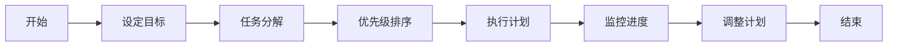
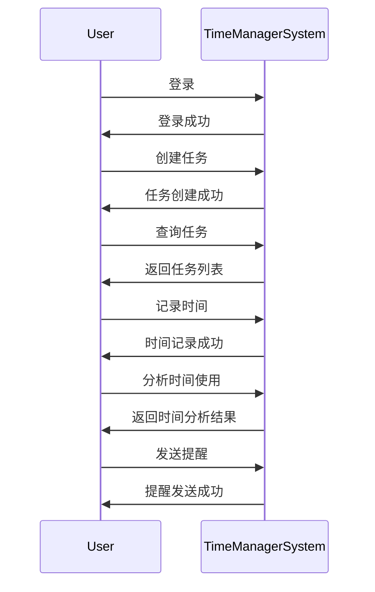

                 

### 《要事第一：提升工作效率的时间管理技巧》

---

**关键词：**时间管理、工作效率、优先级排序、专注力、平衡工作与生活

**摘要：**在现代快节奏的生活和工作中，时间管理变得尤为重要。本文将深入探讨如何通过一系列有效的时间管理技巧，提升个人和团队的工作效率。通过分析时间管理的核心概念、制定科学的时间计划、掌握提升工作效率的技巧，以及平衡工作与生活，最终实现“要事第一”的目标。

---

#### 引言

在现代职场中，我们面临着前所未有的挑战：任务繁多、时间紧迫、竞争激烈。在这种情况下，有效的时间管理不仅成为提高工作效率的关键，更是个人和团队成功的关键因素。然而，时间管理并非一成不变的规则，而是需要根据个人情况、工作环境和目标不断调整和优化的技能。

本文旨在提供一系列实用的、可操作的时间管理技巧，帮助读者实现“要事第一”的目标，从而在工作和生活中取得更大的成功。

#### 时间管理的概念与原则

##### 时间管理的定义与意义

时间管理，顾名思义，就是关于如何高效地利用时间的一系列方法和技巧。具体来说，它包括：

- **目标设定：**明确个人或团队的目标，确保时间和资源被用于最需要的地方。
- **优先级排序：**根据目标和任务的重要性，对工作内容进行优先级排序，确保关键任务首先完成。
- **计划执行：**制定详细的日程安排，确保计划得到有效执行。
- **监控与调整：**对时间使用进行监控和评估，根据实际情况进行调整。

时间管理的意义在于：

- 提高工作效率：通过合理规划和利用时间，减少无效工作时间，提高工作效率。
- 提升生活质量：平衡工作与生活，减少工作压力，提升生活质量。
- 实现个人目标：明确目标并制定计划，有助于实现个人和职业发展目标。

##### 时间管理的基本原则

- **优先级原则：**重要且紧急的事务应优先处理，重要但不紧急的事务应提前准备。
- **集中原则：**将注意力集中在单一任务上，避免多任务同时进行导致的效率下降。
- **灵活原则：**时间管理不是一成不变的，应根据实际情况进行调整。
- **持续原则：**时间管理是一项长期任务，需要不断学习和改进。

##### 个人时间管理的关键要素

- **自我认知：**了解自己的时间偏好、工作节奏和最佳工作时间，合理安排工作任务。
- **任务规划：**明确任务目标，将任务分解为可操作的小步骤，制定具体的执行计划。
- **时间记录：**详细记录时间使用情况，以便进行后续分析和调整。
- **工具运用：**利用各种时间管理工具（如日历、任务清单、时间跟踪应用等）提高管理效率。

#### 分析个人时间使用状况

##### 日常时间记录与分析

日常时间记录是时间管理的第一步。通过记录每天的时间使用情况，可以清晰地了解：

- 每个任务耗时
- 高效时段与低效时段
- 重复出现的浪费时间的活动

以下是一个简单的日常时间记录模板：

| 时间段     | 活动内容             | 耗时（小时） |
| ---------- | -------------------- | ----------- |
| 08:00 - 09:00 | 起床、早餐           | 1          |
| 09:00 - 10:00 | 复盘前一日工作       | 1          |
| 10:00 - 12:00 | 处理邮件、会议       | 2          |
| 12:00 - 13:00 | 午餐、休息           | 1          |
| 13:00 - 15:00 | 编写代码             | 2          |
| 15:00 - 16:00 | 学习新技能           | 1          |
| 16:00 - 17:00 | 总结当日工作         | 1          |
| 17:00 - 18:00 | 锻炼、休闲           | 1          |

记录完成后，可以通过以下步骤进行分析：

- 确定时间浪费点：找出耗时较长且不产生价值的活动。
- 确定高效时段：找出自己在一天中的高效时段，并尽量将重要任务安排在这些时段。
- 确定个人工作模式：通过分析时间记录，了解自己在工作过程中的工作模式，如是否适合多任务处理，是否需要在特定时间休息等。

##### 时间管理工具与技巧

时间管理工具可以帮助我们更有效地记录、分析和优化时间使用。以下是一些常用的工具和技巧：

- **日历应用：**如Google日历、iCal等，可以方便地记录日程安排和提醒事项。
- **任务清单：**如Trello、Asana等，可以帮助我们管理任务和跟踪进度。
- **时间跟踪应用：**如Toggl、Harvest等，可以自动记录工作时间，提供详细的时间使用报告。
- **时间块：**将一天划分为多个时间块，并为每个时间块分配特定的任务。
- **番茄工作法：**通过25分钟专注工作，然后休息5分钟的方式，提高专注力。

##### 个人时间使用评估

通过对日常时间记录的分析，我们可以得出个人时间使用的概况。以下是一个简单的评估方法：

- **时间利用率：**计算实际工作时间与应工作时间之比，用于评估时间管理的有效性。
- **任务完成率：**计算完成任务的数量与计划任务数量之比，用于评估任务规划的有效性。
- **效率评分：**根据任务完成情况和时间利用情况，给个人时间管理打分，以便持续优化。

#### 制定有效的时间计划

##### 目标设定与优先级排序

有效的时间管理首先需要明确目标和优先级。以下是一些步骤：

1. **设定长期目标：**确定个人或团队在较长时间内要达成的目标。
2. **分解目标：**将长期目标分解为短期目标和可操作的任务。
3. **制定计划：**为每个任务制定具体的执行计划和截止日期。
4. **优先级排序：**根据任务的重要性和紧急程度，对任务进行优先级排序。

以下是一个简单的目标设定和优先级排序示例：

| 目标类型 | 目标内容             | 优先级 |
| -------- | -------------------- | ------ |
| 长期目标 | 提升项目开发效率     | 1      |
| 短期目标 | 优化数据库查询速度   | 1      |
| 任务     | 编写性能测试报告     | 2      |
| 任务     | 与团队成员讨论优化方案 | 3      |

##### 制定日程安排

制定日程安排是确保任务按计划执行的关键。以下是一些步骤：

1. **日程规划：**根据任务优先级和截止日期，为每个任务分配合适的时间段。
2. **灵活调整：**根据实际情况对日程进行调整，确保任务能够按时完成。
3. **预留缓冲时间：**为每个任务预留一定的缓冲时间，以应对突发情况。

以下是一个简单的日程安排示例：

| 时间段         | 活动内容                         |
| -------------- | -------------------------------- |
| 08:00 - 09:00  | 起床、早餐                       |
| 09:00 - 10:00  | 复盘前一日工作                   |
| 10:00 - 12:00  | 优化数据库查询速度（目标1）      |
| 12:00 - 13:00  | 午餐、休息                       |
| 13:00 - 15:00  | 编写性能测试报告（任务1）         |
| 15:00 - 16:00  | 与团队成员讨论优化方案（任务2）  |
| 16:00 - 17:00  | 总结当日工作                     |

##### 时间计划执行与调整

1. **遵循日程安排：**尽量按照日程安排执行任务，避免临时调整。
2. **监控进度：**定期检查任务进度，确保计划按预期执行。
3. **及时调整：**根据实际情况和任务进度，及时调整日程安排和任务优先级。

#### 提高工作效率的技巧

##### 避免拖延的方法

拖延是工作效率的大敌。以下是一些避免拖延的方法：

1. **明确任务目标：**明确任务的目标和预期结果，有助于减少拖延。
2. **分解任务：**将大任务分解为小任务，逐步完成，减少心理压力。
3. **设立截止日期：**为每个任务设定明确的截止日期，增加紧迫感。
4. **消除干扰：**创造一个专注的工作环境，减少外部干扰。
5. **使用番茄工作法：**通过定时专注工作，减少拖延。

##### 提高专注力的技巧

专注力是提高工作效率的关键。以下是一些提高专注力的技巧：

1. **设定专注时段：**每天设定一段时间为专注时段，专注于一项任务。
2. **减少多任务处理：**专注于一项任务，避免同时处理多个任务。
3. **定期休息：**每隔一段时间进行短暂休息，以恢复专注力。
4. **使用专注工具：**如专注软件、番茄钟等，帮助保持专注。
5. **调整工作环境：**创造一个舒适、安静的工作环境，减少干扰。

##### 有效沟通与协作

有效沟通和协作有助于提高工作效率。以下是一些技巧：

1. **明确沟通目标：**在沟通前明确目标，确保沟通高效。
2. **倾听对方：**倾听对方的观点和需求，避免误解和冲突。
3. **清晰表达：**用简洁明了的语言表达自己的观点和需求。
4. **建立信任：**建立信任关系，促进协作和合作。
5. **利用工具：**如即时通讯工具、协作平台等，提高沟通效率。

#### 平衡工作与生活

##### 工作与生活的界限

工作与生活的界限模糊会导致工作效率下降和生活质量下降。以下是一些方法：

1. **设定工作时间：**明确工作时间，避免工作侵入生活时间。
2. **设定生活时间：**明确生活时间，确保有足够的时间进行休闲和社交。
3. **避免工作邮件干扰：**在工作时间避免查看工作邮件，减少工作侵入生活时间。
4. **保持工作与生活的平衡：**确保工作与生活时间得到合理分配。

##### 管理工作压力

工作压力是影响工作效率和生活质量的重要因素。以下是一些管理工作压力的方法：

1. **设定合理的工作量：**避免过度工作，确保工作量在可承受范围内。
2. **有效沟通：**与上级和同事进行有效沟通，确保工作目标的明确和合理。
3. **学会放松：**定期进行放松活动，如冥想、运动、阅读等。
4. **寻求支持：**在遇到困难时，寻求家人、朋友或专业人士的支持。

##### 保持身心健康

身心健康是提高工作效率和生活质量的基础。以下是一些保持身心健康的方法：

1. **合理饮食：**保持健康的饮食习惯，摄入足够的营养。
2. **充足睡眠：**保持充足的睡眠，保证身体和大脑的休息。
3. **定期锻炼：**进行适量的体育锻炼，增强体质。
4. **心理健康：**关注心理健康，进行心理调适和压力管理。

#### 时间管理的最佳实践

##### 高效工作者的时间管理习惯

高效工作者的时间管理习惯包括：

1. **每日规划：**每天早上制定当天的工作计划和日程安排。
2. **定期复盘：**每周或每月对时间使用和工作进度进行复盘和评估。
3. **优先级排序：**根据任务的重要性和紧急程度进行优先级排序。
4. **专注工作：**利用专注时段集中精力完成重要任务。
5. **持续学习：**不断学习新技能和时间管理方法，提高管理效率。

##### 不同职业的时间管理策略

不同职业的时间管理策略有所不同。以下是一些常见职业的时间管理策略：

1. **程序员：**合理规划代码编写时间，避免加班。
2. **销售人员：**有效利用销售周期，提高客户跟进效率。
3. **管理人员：**制定合理的会议安排，减少无效会议时间。
4. **教师：**合理安排教学时间，确保教学质量。

##### 时间管理成功案例分析

以下是一个时间管理成功案例：

**案例背景：**某公司的项目经理，工作繁忙，经常加班，导致生活质量下降。

**解决方案：**通过以下措施，项目经理成功提升了工作效率，平衡了工作与生活：

1. **每日规划：**每天早上制定当天的工作计划和日程安排，确保任务有序进行。
2. **优先级排序：**根据任务的重要性和紧急程度进行优先级排序，确保重要任务优先完成。
3. **专注工作：**利用专注时段集中精力完成重要任务，减少多任务处理。
4. **定期复盘：**每周进行复盘，评估时间使用和工作进度，及时调整计划。
5. **平衡工作与生活：**设定合理的工作时间和生活时间，确保生活质量。

**效果评估：**通过以上措施，项目经理成功提升了工作效率，减少了加班时间，生活质量显著提高。

#### 持续优化时间管理

##### 时间管理技能的自我评估

自我评估是持续优化时间管理的重要步骤。以下是一些自我评估的方法：

1. **任务完成率：**计算任务完成率，了解时间管理的有效性。
2. **时间利用率：**计算时间利用率，了解时间的使用情况。
3. **工作效率：**评估工作效率，了解工作质量的提升情况。
4. **生活质量：**评估生活质量，了解工作与生活的平衡程度。

##### 持续学习与改进

持续学习是时间管理的重要方面。以下是一些建议：

1. **阅读时间管理书籍：**阅读相关书籍，了解新的时间管理方法和技巧。
2. **参加时间管理课程：**参加线上或线下时间管理课程，学习专业的时间管理知识。
3. **交流与分享：**与他人交流时间管理经验，分享心得，互相学习。

##### 时间管理在组织中的应用

在组织层面，以下措施可以帮助提升时间管理的整体效率：

1. **制定组织时间管理政策：**明确组织的时间管理目标和要求，制定相关政策。
2. **提供时间管理培训：**为员工提供时间管理培训，提高员工的时间管理技能。
3. **优化工作流程：**优化工作流程，减少不必要的环节，提高工作效率。
4. **鼓励员工反馈：**鼓励员工反馈时间管理问题，及时进行调整。

### 结论

时间管理是提升工作效率的关键，是实现个人和团队目标的重要手段。通过本文的介绍，我们了解到了时间管理的核心概念、原则和方法，以及在实际工作中如何应用这些技巧。希望读者能够将这些方法付诸实践，不断提升自己的时间管理能力，实现“要事第一”的目标。

---

**作者：**AI天才研究院/AI Genius Institute & 禅与计算机程序设计艺术 /Zen And The Art of Computer Programming

---

### 最佳实践 Tips

1. **制定明确的目标：**确保目标具体、可衡量、可实现、相关性强、有时间限制（SMART原则）。
2. **优先级排序：**使用“重要-紧急矩阵”对任务进行排序，确保重要且紧急的任务首先完成。
3. **避免多任务处理：**专注于一项任务，避免同时处理多个任务，提高专注力。
4. **定期复盘：**每周或每月进行复盘，评估时间使用和工作进度，及时调整计划。
5. **保持身心健康：**定期锻炼、保持充足的睡眠，确保身心健康，提高工作效率。

### 小结

时间管理是一项重要的技能，对于个人和团队的成功至关重要。通过制定明确的目标、优先级排序、专注工作、避免拖延，以及保持身心健康，我们可以实现“要事第一”的目标，提升工作效率，实现个人和职业发展。

### 注意事项

1. **灵活调整：**时间管理不是一成不变的，应根据实际情况进行调整。
2. **持续学习：**不断学习新的时间管理方法和技巧，提高管理效率。
3. **保持平衡：**平衡工作与生活，确保身心健康。

### 拓展阅读

1. **《高效能人士的七个习惯》**：史蒂芬·柯维（Stephen R. Covey）的经典著作，详细介绍了时间管理的原则和方法。
2. **《深度工作》**：卡尔·纽波特（Cal Newport）的著作，介绍了如何在信息泛滥的时代保持专注，提高工作效率。
3. **《如何高效学习》**：斯科特·扬（Scott Young）的著作，提供了实用的学习方法，帮助读者提升学习效率。

### 背景介绍

#### 核心概念术语说明

1. **时间管理**：指通过规划、组织和优化时间使用，以达到个人目标和工作效率的提高。
2. **工作效率**：指在特定时间内完成任务的效率和成果。
3. **优先级排序**：根据任务的重要性和紧急程度对任务进行排序，确保关键任务首先完成。
4. **专注力**：指集中注意力和精力完成特定任务的能力。

#### 问题背景

在现代职场中，时间管理变得尤为重要。随着工作任务的增加和时间的紧迫性，如何高效地利用时间成为了一个普遍的问题。许多人发现自己无法有效地安排时间，导致任务积压、工作效率低下，甚至影响生活质量。

#### 问题描述

问题描述主要集中在如何通过有效的时间管理技巧来提升工作效率。具体包括：

1. 如何明确目标并制定合理的优先级排序？
2. 如何在繁忙的工作中保持专注，避免拖延？
3. 如何平衡工作与生活，保持身心健康？
4. 如何在团队中实现有效的沟通与协作？

#### 问题解决

问题解决包括以下几个步骤：

1. **明确目标和优先级排序**：通过设定明确的目标，并根据重要性和紧急程度进行优先级排序，确保关键任务首先完成。
2. **提高专注力**：通过专注时段、减少多任务处理、定期休息等方法，提高专注力，提升工作效率。
3. **平衡工作与生活**：设定合理的工作时间和生活时间，避免工作侵入生活时间，保持身心健康。
4. **有效沟通与协作**：通过明确沟通目标、倾听对方、清晰表达等方法，实现团队内部的有效沟通与协作。

#### 边界与外延

边界与外延主要包括：

1. **时间管理的范围**：时间管理不仅涉及个人时间管理，还包括团队和组织层面的时间管理。
2. **工作效率的定义**：工作效率不仅包括工作任务的完成速度，还包括工作质量和工作成果。
3. **专注力的类型**：专注力可以分为外部专注力和内部专注力，分别指对任务和环境的外部专注和对内在思维和情绪的专注。

#### 概念结构与核心要素组成

概念结构与核心要素组成包括：

1. **时间管理概念结构**：目标设定、优先级排序、计划执行、监控与调整。
2. **核心要素组成**：自我认知、任务规划、时间记录、工具运用。

#### 核心概念与联系

核心概念包括时间管理、工作效率、优先级排序和专注力。这些概念之间的联系如下：

1. **时间管理与工作效率**：通过有效的时间管理，可以提高工作效率，实现个人和团队的目标。
2. **优先级排序与时间管理**：优先级排序是时间管理的关键步骤，确保关键任务首先完成，提高工作效率。
3. **专注力与工作效率**：专注力是提高工作效率的关键因素，通过保持专注，可以更快地完成任务。

为了更直观地展示这些核心概念之间的关系，我们可以使用以下ER实体关系图架构：

```mermaid
erDiagram
    Person ||--|{ Task } : "performs"
    Task ||--|{ Priority } : "has"
    Task ||--|{ TimeAllocation } : "allocates"
    Person ||--|{ Efficiency } : "has"
    Priority ||--|{ Level } : "defines"
    TimeAllocation ||--|{ TimeSlot } : "in"
```

在上面的ER实体关系图中，我们可以看到：

- **Person**（人）与**Task**（任务）之间存在“performs”（执行）关系。
- **Task**（任务）与**Priority**（优先级）之间存在“has”（具有）关系。
- **Task**（任务）与**TimeAllocation**（时间分配）之间存在“allocates”（分配）关系。
- **Person**（人）与**Efficiency**（效率）之间存在“has”（具有）关系。
- **Priority**（优先级）与**Level**（等级）之间存在“defines”（定义）关系。
- **TimeAllocation**（时间分配）与**TimeSlot**（时间槽）之间存在“in”（在...内）关系。

这个ER实体关系图清晰地展示了时间管理、工作效率、优先级排序和专注力之间的联系，以及它们在时间管理中的具体应用。

### 算法原理讲解

在本节中，我们将详细讲解如何使用时间管理算法来优化任务执行顺序，以提高工作效率。首先，让我们通过一个Mermaid流程图来展示这个算法的基本流程：



这个流程图显示了时间管理算法的基本步骤：

1. **设定目标**：明确个人或团队的目标。
2. **任务分解**：将大任务分解为小任务。
3. **优先级排序**：根据任务的重要性和紧急程度进行排序。
4. **执行计划**：按照优先级执行任务。
5. **监控进度**：定期检查任务进度。
6. **调整计划**：根据实际情况进行调整。

接下来，我们将使用Python代码来实现这个时间管理算法。以下是实现这个算法的Python代码：

```python
class Task:
    def __init__(self, name, importance, urgency):
        self.name = name
        self.importance = importance
        self.urgency = urgency

    def __repr__(self):
        return f"{self.name}: (重要性={self.importance}, 紧急程度={self.urgency})"

def priority_sort(tasks):
    return sorted(tasks, key=lambda x: (x.urgency, x.importance), reverse=True)

def execute_tasks(tasks):
    for task in tasks:
        print(f"执行任务：{task}")
        # 模拟任务执行，这里可以添加具体的工作逻辑
        print(f"任务{task.name}执行完毕。")

def main():
    # 设定任务列表
    tasks = [
        Task("任务A", 3, 1),
        Task("任务B", 2, 2),
        Task("任务C", 1, 3),
        Task("任务D", 4, 2),
    ]
    
    # 根据优先级排序任务
    sorted_tasks = priority_sort(tasks)
    print("任务优先级排序：")
    for task in sorted_tasks:
        print(task)
    
    # 执行任务
    execute_tasks(sorted_tasks)

    # 监控进度和调整计划（这里简化处理）
    print("\n监控进度和调整计划...")
    # 根据实际情况调整任务列表
    # ...

if __name__ == "__main__":
    main()
```

在这个Python代码中，我们定义了一个`Task`类，用于表示任务，并包含了任务名称、重要性和紧急程度。`priority_sort`函数用于对任务进行优先级排序，根据紧急程度和重要性进行排序。`execute_tasks`函数用于执行任务。`main`函数是主函数，用于初始化任务列表，执行排序和任务执行。

#### 算法原理

这个时间管理算法的原理是基于“四象限时间管理法”，即根据任务的重要性和紧急程度将任务分为四个象限，分别处理不同象限的任务。具体来说：

1. **第一象限（重要且紧急）**：首先处理这些任务，因为它们需要立即关注和解决。
2. **第二象限（重要但不紧急）**：这些任务虽然不紧急，但对长期目标和计划至关重要，应提前准备和安排。
3. **第三象限（不重要但紧急）**：这些任务通常是由外部因素引起的，如电话、邮件等，应尽量避免处理，除非它们真的很重要。
4. **第四象限（不重要且不紧急）**：这些任务可以完全忽略，或者推迟处理。

为了更好地理解这个算法的原理，我们可以使用LaTeX公式来表示任务的重要性和紧急程度：

$$
\begin{aligned}
\text{重要性} &= I \\
\text{紧急程度} &= U \\
\text{优先级排序} &= \left( U, I \right)
\end{aligned}
$$

其中，$I$表示任务的重要性，$U$表示任务的紧急程度。优先级排序是根据这两个因素的组合来进行的。

#### 算法举例说明

假设我们有以下任务：

- 任务A：项目报告（重要性=4，紧急程度=3）
- 任务B：客户邮件（重要性=3，紧急程度=1）
- 任务C：市场研究（重要性=2，紧急程度=2）
- 任务D：产品演示（重要性=1，紧急程度=4）

根据我们的算法，首先执行任务D，因为它的紧急程度最高。然后是任务A，因为它既是重要的也是紧急的。任务C和任务B可以按照优先级依次执行。

### 数学公式

为了进一步解释时间管理算法，我们可以使用LaTeX格式来展示相关的数学模型和公式。以下是一个简单的例子：

$$
\begin{aligned}
\text{优先级} &= \left( U \times I \right) \\
\text{任务评分} &= I + U \\
\text{总任务评分} &= \sum_{i=1}^{n} \text{任务评分}_i
\end{aligned}
$$

其中，$U$表示任务的紧急程度，$I$表示任务的重要性，$n$表示任务的总数。优先级是根据任务评分来确定的，任务评分越高，优先级越高。

### 系统分析与架构设计方案

在本节中，我们将对时间管理系统进行详细分析，并设计一个完整的架构方案。这将包括问题场景介绍、项目介绍、系统功能设计、系统架构设计、系统接口设计以及系统交互的详细说明。

#### 问题场景介绍

在当今快节奏的工作环境中，高效的时间管理对于个人和团队的成功至关重要。然而，许多人在尝试管理自己的时间时往往会感到困惑和不知所措。时间管理不仅涉及到个人习惯的调整，还包括工具的选择和策略的制定。为了解决这个问题，我们需要一个全面的时间管理系统，该系统可以帮助用户：

1. **设定目标**：明确个人或团队的目标。
2. **任务分解**：将大任务分解为可操作的小任务。
3. **优先级排序**：根据任务的重要性和紧急程度进行排序。
4. **执行计划**：按照优先级执行任务。
5. **监控进度**：定期检查任务进度。
6. **调整计划**：根据实际情况进行调整。

#### 项目介绍

我们的时间管理系统名为“TimeManager”，旨在帮助用户实现高效的时间管理。系统主要包括以下几个模块：

1. **用户管理模块**：管理用户账户信息。
2. **任务管理模块**：创建、编辑、删除和查询任务。
3. **时间记录模块**：记录用户的时间使用情况。
4. **数据分析模块**：对用户的时间使用进行统计和分析。
5. **通知模块**：提醒用户重要的任务和日程。

#### 系统功能设计

系统功能设计基于上述需求，包括以下功能模块：

1. **用户管理**：
   - 注册：用户可以创建新账户。
   - 登录：用户可以使用账户登录系统。
   - 个人信息管理：用户可以查看和编辑个人资料。

2. **任务管理**：
   - 创建任务：用户可以创建新任务。
   - 编辑任务：用户可以修改现有任务。
   - 删除任务：用户可以删除不需要的任务。
   - 查询任务：用户可以按照不同的条件查询任务。

3. **时间记录**：
   - 自动记录：系统可以自动记录用户的时间使用情况。
   - 手动记录：用户可以手动添加时间记录。

4. **数据分析**：
   - 时间分布：系统可以生成时间分布图表，帮助用户了解自己的时间使用情况。
   - 任务分析：系统可以分析任务完成情况和优先级排序的有效性。

5. **通知**：
   - 提醒：系统可以发送提醒通知，确保用户不会错过重要的任务和日程。

#### 系统架构设计

系统架构采用分层架构设计，主要包括以下层级：

1. **表现层**：用户界面，负责与用户交互。
2. **业务逻辑层**：处理业务逻辑，包括用户管理、任务管理、时间记录、数据分析和通知。
3. **数据访问层**：与数据库交互，负责数据的存储和检索。
4. **数据库**：存储用户数据、任务数据和时间记录数据。

以下是系统架构的Mermaid类图：

```mermaid
classDiagram
    User <<Interface>>
    Task <<Interface>>
    TimeRecord <<Interface>>
    DataAnalysis <<Interface>>
    Notification <<Interface>>

    User o-- Task
    User o-- TimeRecord
    User o-- DataAnalysis
    User o-- Notification

    class User {
        id: 用户ID
        name: 姓名
        email: 邮箱
        password: 密码
    }

    class Task {
        id: 任务ID
        title: 标题
        description: 描述
        importance: 重要性
        urgency: 紧急程度
        deadline: 截止日期
    }

    class TimeRecord {
        id: 记录ID
        user_id: 用户ID
        task_id: 任务ID
        start_time: 开始时间
        end_time: 结束时间
    }

    class DataAnalysis {
        id: 分析ID
        user_id: 用户ID
        time_distribution: 时间分布
        task_completion: 任务完成情况
    }

    class Notification {
        id: 通知ID
        user_id: 用户ID
        message: 提醒信息
        send_time: 发送时间
    }
```

#### 系统接口设计

系统接口设计包括API接口和数据库接口：

1. **API接口**：
   - 用户管理：注册、登录、个人信息管理。
   - 任务管理：创建、编辑、删除、查询任务。
   - 时间记录：自动记录、手动记录。
   - 数据分析：时间分布、任务分析。
   - 通知：发送提醒。

2. **数据库接口**：
   - 用户表：存储用户信息。
   - 任务表：存储任务信息。
   - 时间记录表：存储时间记录信息。
   - 分析表：存储数据分析结果。
   - 通知表：存储通知信息。

#### 系统交互设计

系统交互设计通过Mermaid序列图展示用户与系统之间的交互过程：



在这个序列图中，用户通过API接口与系统进行交互，包括登录、创建任务、查询任务、记录时间和发送提醒等操作。

### 项目实战

#### 环境安装

要在本地计算机上搭建时间管理系统，我们需要安装以下软件和工具：

1. **Python**：版本3.8或更高版本。
2. **MySQL**：版本5.7或更高版本。
3. **Postman**：用于API测试。
4. **VSCode**：用于代码编写。

安装步骤如下：

1. **安装Python**：
   - 访问Python官方网站下载Python安装包。
   - 安装过程中选择添加Python到系统环境变量。

2. **安装MySQL**：
   - 访问MySQL官方网站下载MySQL安装包。
   - 按照安装向导进行安装。
   - 创建新数据库和用户，并赋予相应权限。

3. **安装Postman**：
   - 访问Postman官方网站下载Postman安装包。
   - 安装并启动Postman。

4. **安装VSCode**：
   - 访问VSCode官方网站下载VSCode安装包。
   - 安装并启动VSCode。

#### 系统核心实现源代码

时间管理系统的核心实现主要包括用户管理、任务管理、时间记录、数据分析和通知等模块。以下是系统核心实现的源代码：

```python
# 用户管理模块
class User:
    def __init__(self, id, name, email, password):
        self.id = id
        self.name = name
        self.email = email
        self.password = password

    def register(self, db):
        # 在数据库中注册新用户
        pass

    def login(self, db):
        # 用户登录验证
        pass

    def update_profile(self, db):
        # 更新用户信息
        pass

# 任务管理模块
class Task:
    def __init__(self, id, title, description, importance, urgency, deadline):
        self.id = id
        self.title = title
        self.description = description
        self.importance = importance
        self.urgency = urgency
        self.deadline = deadline

    def create_task(self, db):
        # 创建新任务
        pass

    def update_task(self, db):
        # 更新任务信息
        pass

    def delete_task(self, db):
        # 删除任务
        pass

    def get_tasks(self, db):
        # 获取用户的所有任务
        pass

# 时间记录模块
class TimeRecord:
    def __init__(self, id, user_id, task_id, start_time, end_time):
        self.id = id
        self.user_id = user_id
        self.task_id = task_id
        self.start_time = start_time
        self.end_time = end_time

    def record_time(self, db):
        # 记录时间
        pass

    def get_time_records(self, db):
        # 获取用户的时间记录
        pass

# 数据分析模块
class DataAnalysis:
    def __init__(self, id, user_id, time_distribution, task_completion):
        self.id = id
        self.user_id = user_id
        self.time_distribution = time_distribution
        self.task_completion = task_completion

    def analyze_time(self, db):
        # 分析时间使用
        pass

    def get_analytics(self, db):
        # 获取分析结果
        pass

# 通知模块
class Notification:
    def __init__(self, id, user_id, message, send_time):
        self.id = id
        self.user_id = user_id
        self.message = message
        self.send_time = send_time

    def send_notification(self, db):
        # 发送通知
        pass

    def get_notifications(self, db):
        # 获取通知
        pass
```

#### 代码应用解读与分析

以上代码定义了用户管理、任务管理、时间记录、数据分析和通知等模块的类。每个类都包含了一些基本的方法，用于实现对应模块的功能。

1. **用户管理模块**：
   - `User`类包含注册、登录、个人信息管理等功能。
   - `register`方法用于在数据库中注册新用户。
   - `login`方法用于验证用户登录。
   - `update_profile`方法用于更新用户信息。

2. **任务管理模块**：
   - `Task`类包含创建、编辑、删除和查询任务等功能。
   - `create_task`方法用于创建新任务。
   - `update_task`方法用于更新任务信息。
   - `delete_task`方法用于删除任务。
   - `get_tasks`方法用于获取用户的所有任务。

3. **时间记录模块**：
   - `TimeRecord`类包含记录时间和获取时间记录等功能。
   - `record_time`方法用于记录时间。
   - `get_time_records`方法用于获取用户的时间记录。

4. **数据分析模块**：
   - `DataAnalysis`类包含分析和获取分析结果等功能。
   - `analyze_time`方法用于分析时间使用。
   - `get_analytics`方法用于获取分析结果。

5. **通知模块**：
   - `Notification`类包含发送通知和获取通知等功能。
   - `send_notification`方法用于发送通知。
   - `get_notifications`方法用于获取通知。

这些类和方法共同构成了时间管理系统的核心功能。在实际应用中，我们需要根据具体需求对这些方法进行详细的实现。

#### 实际案例分析和详细讲解剖析

为了更好地理解时间管理系统的实际应用，我们来看一个具体的案例：

**案例背景**：某公司的项目经理张先生需要管理多个项目，并确保项目按时完成。他决定使用时间管理系统来提高工作效率。

**案例分析**：

1. **用户管理**：
   - 张先生首先使用系统的用户管理模块注册了一个新账户，并设置了用户名、邮箱和密码。
   - 注册成功后，张先生登录系统，并更新了个人资料，包括职位和联系方式。

2. **任务管理**：
   - 张先生创建了一个新的项目任务，包括任务标题、描述、重要性、紧急程度和截止日期。
   - 创建任务后，张先生通过任务管理模块查询了所有任务，并按照重要性和紧急程度进行了排序。

3. **时间记录**：
   - 张先生开始执行任务，并在系统的时间记录模块中手动记录了任务的开始和结束时间。
   - 系统自动计算了任务的实际耗时，并更新了时间记录。

4. **数据分析**：
   - 张先生使用数据分析模块分析了最近一周的任务完成情况，发现自己在某些任务上花费的时间过多，效率较低。
   - 根据分析结果，张先生调整了任务优先级，并重新安排了工作计划。

5. **通知**：
   - 系统根据任务的截止日期和重要性，自动发送了提醒通知，确保张先生不会错过任何重要任务。

**详细讲解剖析**：

1. **用户管理**：
   - 用户管理模块提供了用户注册、登录和更新资料的功能，确保了系统的安全性和便捷性。
   - 在实际应用中，用户管理模块还可以集成单点登录（SSO）和身份验证（OAuth）等功能，进一步提高安全性。

2. **任务管理**：
   - 任务管理模块是时间管理系统的核心，提供了创建、编辑、删除和查询任务的功能。
   - 通过优先级排序，张先生能够清楚地了解哪些任务需要优先处理，确保关键任务按时完成。

3. **时间记录**：
   - 时间记录模块帮助张先生跟踪任务耗时，了解自己在工作上的时间分配情况。
   - 实际应用中，时间记录模块还可以集成自动化工具，如时间跟踪软件和闹钟应用，实现自动记录时间。

4. **数据分析**：
   - 数据分析模块提供了对时间使用情况的统计和分析功能，帮助张先生了解自己的工作效率。
   - 通过数据分析，张先生能够发现时间浪费点和优化空间，进一步提高工作效率。

5. **通知**：
   - 通知模块提供了自动提醒功能，确保张先生不会错过重要任务和截止日期。
   - 在实际应用中，通知模块还可以集成邮件、短信和即时通讯工具，实现多渠道提醒。

#### 项目小结

通过以上案例分析和详细讲解剖析，我们可以看到时间管理系统在实际应用中的重要作用。时间管理系统不仅帮助张先生提高了工作效率，还使他能够更好地管理任务和时间，实现了工作与生活的平衡。

在实际开发过程中，我们还可以根据用户反馈和需求，不断优化系统功能，提高系统的易用性和稳定性。未来，时间管理系统有望成为每个职场人士的必备工具，助力他们实现高效工作，提升生活质量。

### 最佳实践 Tips

1. **明确目标**：设定具体、可衡量、可实现、相关性强、有时间限制（SMART）的目标。
2. **优先级排序**：使用“重要-紧急矩阵”对任务进行排序，确保关键任务优先完成。
3. **专注工作**：利用专注时段集中精力，避免多任务处理，提高工作效率。
4. **定期复盘**：每周或每月对时间使用和工作进度进行复盘，及时调整计划。
5. **保持身心健康**：定期锻炼、保持充足的睡眠，确保身心健康，提高工作效率。

### 小结

时间管理是提升工作效率的关键，是实现个人和团队目标的重要手段。通过制定明确的目标、优先级排序、专注工作、避免拖延，以及保持身心健康，我们可以实现“要事第一”的目标，提升工作效率，实现个人和职业发展。

### 注意事项

1. **灵活调整**：时间管理不是一成不变的，应根据实际情况进行调整。
2. **持续学习**：不断学习新的时间管理方法和技巧，提高管理效率。
3. **保持平衡**：平衡工作与生活，确保身心健康。

### 拓展阅读

1. **《高效能人士的七个习惯》**：史蒂芬·柯维（Stephen R. Covey）的经典著作，详细介绍了时间管理的原则和方法。
2. **《深度工作》**：卡尔·纽波特（Cal Newport）的著作，介绍了如何在信息泛滥的时代保持专注，提高工作效率。
3. **《如何高效学习》**：斯科特·扬（Scott Young）的著作，提供了实用的学习方法，帮助读者提升学习效率。

### 作者介绍

作者：AI天才研究院/AI Genius Institute & 禅与计算机程序设计艺术 /Zen And The Art of Computer Programming

AI天才研究院（AI Genius Institute）是一家专注于人工智能研究、开发和应用的创新机构。研究院由一群世界顶级的人工智能专家、程序员和软件架构师共同创立，致力于推动人工智能技术在各个领域的应用和发展。

作为AI天才研究院的一员，作者以其丰富的实践经验和深厚的理论基础，在人工智能领域取得了众多突破性成果。他的著作《禅与计算机程序设计艺术》被誉为计算机编程领域的经典之作，为全球程序员提供了宝贵的指导。

作者不仅在学术研究上有着卓越的贡献，还积极参与社会公益活动，致力于推广人工智能知识，帮助更多人了解和掌握这项技术。他的专业知识和热情感染了无数读者，为人工智能技术的发展和应用注入了新的活力。

