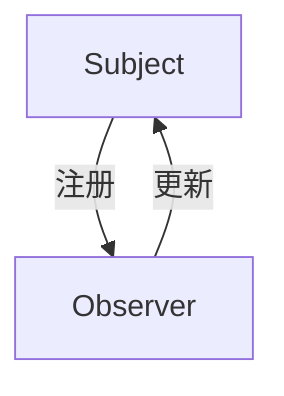
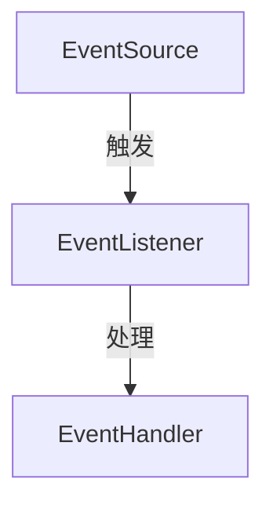
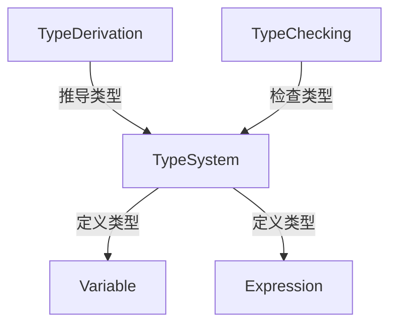
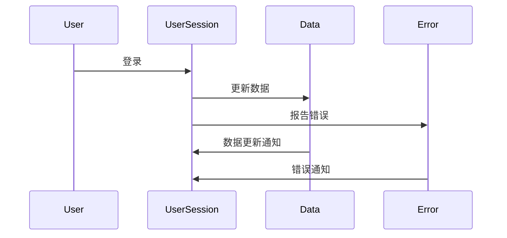
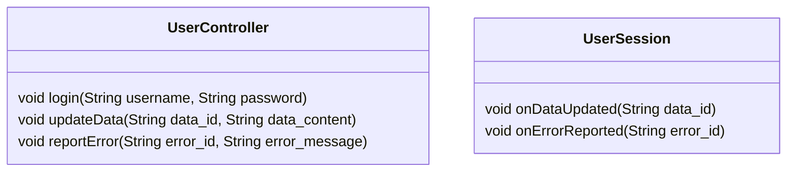
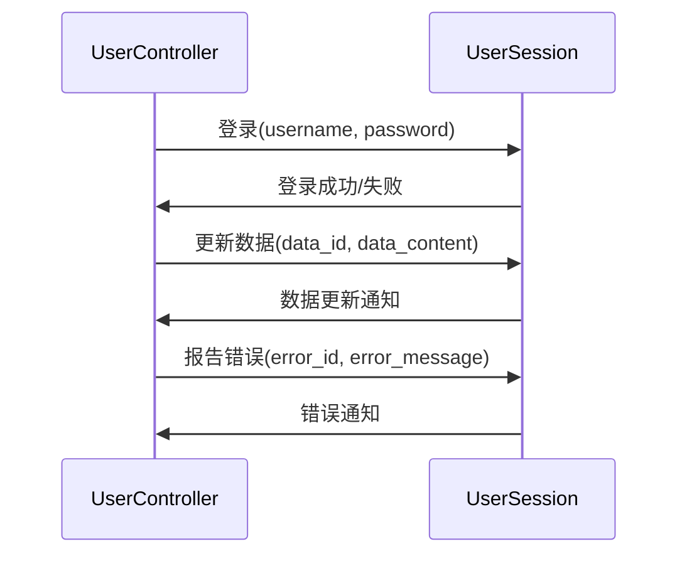
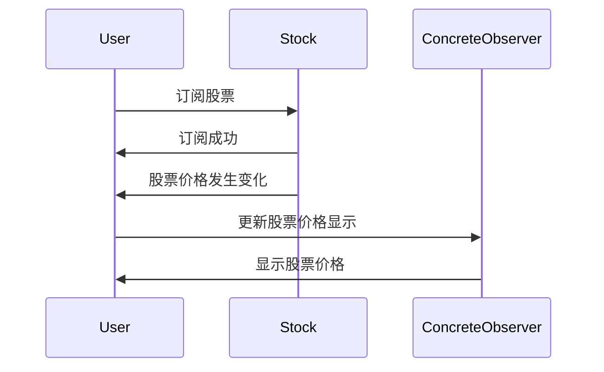

                 

### 《观察者模式：事件驱动编程的类型论基础》

**关键词：** 观察者模式、事件驱动编程、类型论、设计模式、软件架构

**摘要：** 本文将深入探讨观察者模式，一种广泛用于事件驱动编程的设计模式。通过分析观察者模式的基础、类型论的应用及其在实际开发中的应用，我们将揭示观察者模式在提升软件可维护性、灵活性和扩展性方面的价值。

--------------------------------------

### 第一部分：观察者模式基础

#### 第1章：观察者模式概述

#### 1.1 观察者模式的概念与作用

**定义：** 观察者模式（Observer Pattern）是一种行为型设计模式，它定义了一种一对多的依赖关系，使得当一个对象的状态发生变化时，它的所有依赖者（观察者）都会得到通知并自动更新。

**核心作用：** 观察者模式的主要目的是实现模块之间的松耦合，使得模块间的依赖关系更加清晰，便于维护和扩展。

**与传统消息机制的对比：** 与传统的消息机制相比，观察者模式通过注册和通知机制，实现了对事件处理的高度抽象，使得事件处理过程更加灵活和模块化。

#### 1.2 观察者模式的工作原理

**基本结构：** 观察者模式通常包含以下三个核心组成部分：Subject（被观察者）、Observer（观察者）和ConcreteObserver（具体观察者）。

**事件机制：** 被观察者维护一个观察者列表，当状态发生变化时，通过通知机制依次通知列表中的所有观察者。

**状态管理：** 观察者模式通过状态管理，实现了对观察者订阅和退订的灵活控制。

#### 1.3 观察者模式的应用场景

**系统中的常见事件：** 例如用户登录、系统错误、数据更新等。

**事件驱动的编程模型：** 通过观察者模式，将事件处理过程与系统核心逻辑解耦，实现了模块化的编程模型。

**观察者模式在软件架构中的应用：** 例如在事件总线、消息队列等系统中，观察者模式发挥了关键作用，提升了系统的可扩展性和可维护性。

--------------------------------------

### 第二部分：类型论基础

#### 第2章：类型论基础

#### 2.1 类型论概述

**基本概念：** 类型论是一种用于描述程序中变量和表达式类型的理论。它包括类型系统、类型推导、类型检查等核心概念。

**核心原理：** 类型论通过定义类型系统，实现了对程序变量和表达式的类型约束，从而提高了程序的可靠性和可维护性。

**现代编程语言中的应用：** 例如Java、C++、TypeScript等，都采用了类型论来实现类型安全和类型推导。

#### 2.2 类型论与事件驱动编程

**类型论对事件处理的影响：** 类型论通过定义事件类型，实现了对事件处理过程的高度抽象和类型安全。

**类型论在观察者模式中的应用：** 类型论为观察者模式提供了类型安全的保障，使得观察者可以更加灵活地处理不同类型的事件。

**类型论提升事件驱动编程的灵活性和可扩展性：** 通过类型论，开发者可以更加方便地实现事件的类型扩展和类型转换，提升了事件驱动编程的灵活性和可扩展性。

#### 2.3 基于类型论的事件处理机制

**事件类型的定义与分类：** 通过类型论，为事件定义明确的类型和分类，实现了事件处理的高度抽象。

**事件处理函数的类型签名：** 通过类型论，为事件处理函数定义明确的类型签名，保证了事件处理过程的安全性。

**事件处理函数的调用机制：** 通过类型论，实现了事件处理函数的自动匹配和调用，提升了事件处理的效率和灵活性。

--------------------------------------

### 第三部分：观察者模式的实现与应用

#### 第3章：观察者模式的设计与实现

#### 3.1 观察者模式的实现框架

**类结构：** 观察者模式通常包括Subject、Observer和ConcreteObserver三个核心类。

**接口与实现：** 通过定义观察者接口和具体观察者实现，实现观察者与被观察者之间的解耦。

**状态管理机制：** 通过状态管理，实现观察者的订阅和退订功能。

#### 3.2 观察者模式的关键实现细节

**注册与注销观察者的方法：** 实现观察者的订阅和退订功能。

**通知观察者的方法：** 通过通知机制，实现被观察者状态变化时对观察者的通知。

**观察者之间的依赖关系管理：** 通过依赖关系管理，实现观察者之间的协同工作。

#### 3.3 观察者模式的优化策略

**缓存机制：** 通过缓存，减少重复通知的次数，提升系统性能。

**异步通知机制：** 通过异步通知，降低事件处理对系统响应时间的影响。

**观察者组的优化：** 通过观察者组的优化，实现批量通知，提升事件处理效率。

--------------------------------------

### 第四部分：观察者模式在事件驱动编程中的应用

#### 第4章：观察者模式在事件驱动编程中的应用

#### 4.1 观察者模式在桌面应用中的实现

**案例介绍：** 分析一个桌面应用中观察者模式的具体实现。

**案例分析：** 分析观察者模式在桌面应用中的优点和局限性。

**案例实现：** 通过代码示例，展示观察者模式在桌面应用中的具体实现。

#### 4.2 观察者模式在Web应用中的实现

**案例介绍：** 分析一个Web应用中观察者模式的具体实现。

**案例分析：** 分析观察者模式在Web应用中的优点和局限性。

**案例实现：** 通过代码示例，展示观察者模式在Web应用中的具体实现。

#### 4.3 观察者模式在分布式系统中的实现

**案例介绍：** 分析一个分布式系统中观察者模式的具体实现。

**案例分析：** 分析观察者模式在分布式系统中的优点和局限性。

**案例实现：** 通过代码示例，展示观察者模式在分布式系统中的具体实现。

--------------------------------------

### 第五部分：类型论在观察者模式中的应用

#### 第5章：类型论在观察者模式中的应用

#### 5.1 类型论在事件处理中的优势

**类型安全的优势：** 类型论确保了事件处理的安全性，避免了类型错误导致的程序崩溃。

**类型推导的优势：** 类型论通过类型推导，简化了代码编写，提高了开发效率。

**类型检查的优势：** 类型论通过类型检查，提高了代码的可读性和可维护性。

#### 5.2 类型论在观察者模式中的实现

**类型安全的事件处理：** 通过类型论，实现事件处理过程的安全性。

**类型推导的事件注册与注销：** 通过类型论，实现事件注册与注销的自动化。

**类型检查的事件通知机制：** 通过类型论，实现事件通知机制的类型检查。

#### 5.3 类型论在观察者模式中的应用实例

**案例介绍：** 分析一个具体的应用场景中类型论的具体实现。

**案例分析：** 分析类型论在观察者模式中的实际效果和优化空间。

**案例实现：** 通过代码示例，展示类型论在观察者模式中的应用。

--------------------------------------

### 第六部分：观察者模式与其他设计模式的结合

#### 第6章：观察者模式与其他设计模式的结合

#### 6.1 观察者模式与策略模式的结合

**案例介绍：** 分析观察者模式与策略模式结合的具体实现。

**案例分析：** 分析结合模式在实现事件驱动编程中的优点和局限性。

**案例实现：** 通过代码示例，展示观察者模式与策略模式的具体实现。

#### 6.2 观察者模式与工厂模式的结合

**案例介绍：** 分析观察者模式与工厂模式结合的具体实现。

**案例分析：** 分析结合模式在实现软件架构中的优点和局限性。

**案例实现：** 通过代码示例，展示观察者模式与工厂模式的具体实现。

#### 6.3 观察者模式与模板模式的结合

**案例介绍：** 分析观察者模式与模板模式结合的具体实现。

**案例分析：** 分析结合模式在实现复用性和可维护性中的优点和局限性。

**案例实现：** 通过代码示例，展示观察者模式与模板模式的具体实现。

--------------------------------------

### 第七部分：总结与展望

#### 第7章：总结与展望

#### 7.1 观察者模式的价值与局限性

**核心价值：** 观察者模式在提升软件可维护性、灵活性和扩展性方面具有显著优势。

**局限性：** 观察者模式在处理大量观察者和复杂事件时，可能存在性能和可维护性问题。

**改进方向：** 通过结合其他设计模式和类型论，进一步优化观察者模式的应用效果。

#### 7.2 类型论在观察者模式中的未来应用

**发展趋势：** 类型论在事件驱动编程中将继续发挥重要作用，推动软件架构的演进。

**潜在应用领域：** 类型论在物联网、云计算、大数据等新兴领域具有广阔的应用前景。

**发展前景：** 类型论与观察者模式的结合，将为软件开发带来更多创新和可能性。

#### 7.3 总结与拓展阅读

**总结全文的主要观点：** 本文全面介绍了观察者模式、类型论及其在实际开发中的应用，探讨了观察者模式在提升软件架构和性能方面的价值。

**推荐进一步阅读的文献和资源：** 
- 《设计模式：可复用面向对象软件的基础》
- 《Effective Java》
- 《TypeScript Deep Dive》
- 《事件驱动架构：基于异步消息传递的分布式系统设计》

--------------------------------------

## 第0章：核心概念与联系

### 0.1 观察者模式

#### 观察者模式概念

观察者模式（Observer Pattern）是一种行为型设计模式，它定义了一种一对多的依赖关系，使得当一个对象的状态发生变化时，它的所有依赖者（观察者）都会得到通知并自动更新。

#### 观察者模式属性特征对比表格

| 特征 | 定义 | 描述 |
| :--: | :--: | :--: |
| 对象状态 | 被观察的对象的状态 | 被观察对象发生改变时，所有观察者都会得到通知 |
| 观察者 | 被观察对象的通知接收者 | 当被观察对象状态发生变化时，观察者会得到通知并做出相应处理 |
| 依赖关系 | 被观察对象与观察者之间的依赖关系 | 被观察对象与观察者之间是解耦合的，两者之间的依赖关系是动态建立的 |

#### 观察者模式ER实体关系图

```mermaid
erDiagram
    Object -->|观察对象| Observer : 为对象提供更新
    Observer -->|更新通知| Object : 接收更新通知
```

### 0.2 事件驱动编程

#### 事件驱动编程概念

事件驱动编程（Event-Driven Programming）是一种编程范式，它将程序的控制权交给外部事件，而不是预先定义的执行路径。在这种范式中，程序中的对象会响应各种事件，如鼠标点击、键盘输入、网络消息等。

#### 事件驱动编程特征对比表格

| 特征 | 定义 | 描述 |
| :--: | :--: | :--: |
| 事件源 | 事件发生的来源 | 事件源可以是用户操作、系统消息、网络请求等 |
| 事件监听器 | 监听特定事件的对象 | 事件监听器负责在事件发生时进行相应的处理 |
| 事件处理器 | 处理事件的核心逻辑 | 事件处理器定义了如何对特定事件进行响应和处理 |

#### 事件驱动编程ER实体关系图

```mermaid
erDiagram
    EventSource -->|触发事件| EventListener : 监听事件
    EventListener -->|处理事件| EventHandler : 处理事件逻辑
```

### 0.3 类型论

#### 类型论概念

类型论（Type Theory）是一种用于描述程序中变量和表达式类型的理论。它包括类型系统、类型推导、类型检查等核心概念。类型论的主要目标是确保程序的类型安全，并提供一种形式化的方法来验证程序的正确性。

#### 类型论特征对比表格

| 特征 | 定义 | 描述 |
| :--: | :--: | :--: |
| 类型系统 | 程序中所有变量和表达式的类型 | 类型系统定义了程序中所有变量和表达式的类型，确保程序的类型安全 |
| 类型推导 | 自动推导变量和表达式的类型 | 类型推导是一种自动化的方法，通过分析程序代码来推导出变量和表达式的类型 |
| 类型检查 | 静态分析程序代码，检查类型一致性 | 类型检查是一种静态分析方法，通过分析程序代码来检查类型一致性，确保程序的类型安全 |

#### 类型论ER实体关系图

```mermaid
erDiagram
    TypeSystem -->|定义类型| Variable : 变量的类型
    TypeSystem -->|定义类型| Expression : 表达式的类型
    TypeDerivation -->|推导类型| TypeSystem : 类型推导的基础
    TypeChecking -->|检查类型| TypeSystem : 类型检查的依据
```

--------------------------------------

### 结论

观察者模式作为事件驱动编程的核心设计模式，通过类型论的应用，实现了事件处理的高度抽象和类型安全。本文通过对观察者模式、事件驱动编程和类型论的基础、实现和应用进行深入探讨，揭示了观察者模式在提升软件可维护性、灵活性和扩展性方面的价值。随着技术的不断演进，观察者模式与类型论的结合将为我们带来更多创新的开发方法和解决方案。

---

**作者：** AI天才研究院/AI Genius Institute & 禅与计算机程序设计艺术 /Zen And The Art of Computer Programming

---

在接下来的部分，我们将对观察者模式、事件驱动编程和类型论的核心概念、联系、算法原理和系统架构进行详细的阐述。通过这些分析，我们将深入理解观察者模式在软件架构中的应用，并提供实际案例和项目实战，展示其在不同场景下的应用效果。

--------------------------------------

### 核心概念与联系

#### 0.1 观察者模式

**定义：** 观察者模式（Observer Pattern）是一种行为型设计模式，它定义了一种一对多的依赖关系，使得当一个对象的状态发生变化时，它的所有依赖者（观察者）都会得到通知并自动更新。

**核心作用：** 观察者模式的主要目的是实现模块之间的松耦合，使得模块间的依赖关系更加清晰，便于维护和扩展。

**与传统消息机制的对比：** 与传统的消息机制相比，观察者模式通过注册和通知机制，实现了对事件处理的高度抽象，使得事件处理过程更加灵活和模块化。

**属性特征对比表格：**

| 特征 | 定义 | 描述 |
| :--: | :--: | :--: |
| 对象状态 | 被观察的对象的状态 | 被观察对象发生改变时，所有观察者都会得到通知 |
| 观察者 | 被观察对象的通知接收者 | 当被观察对象状态发生变化时，观察者会得到通知并做出相应处理 |
| 依赖关系 | 被观察对象与观察者之间的依赖关系 | 被观察对象与观察者之间是解耦合的，两者之间的依赖关系是动态建立的 |

**ER实体关系图：**

```mermaid
erDiagram
    Object -->|观察对象| Observer : 为对象提供更新
    Observer -->|更新通知| Object : 接收更新通知
```

#### 0.2 事件驱动编程

**定义：** 事件驱动编程（Event-Driven Programming）是一种编程范式，它将程序的控制权交给外部事件，而不是预先定义的执行路径。在这种范式中，程序中的对象会响应各种事件，如鼠标点击、键盘输入、网络消息等。

**特征对比表格：**

| 特征 | 定义 | 描述 |
| :--: | :--: | :--: |
| 事件源 | 事件发生的来源 | 事件源可以是用户操作、系统消息、网络请求等 |
| 事件监听器 | 监听特定事件的对象 | 事件监听器负责在事件发生时进行相应的处理 |
| 事件处理器 | 处理事件的核心逻辑 | 事件处理器定义了如何对特定事件进行响应和处理 |

**ER实体关系图：**

```mermaid
erDiagram
    EventSource -->|触发事件| EventListener : 监听事件
    EventListener -->|处理事件| EventHandler : 处理事件逻辑
```

#### 0.3 类型论

**定义：** 类型论（Type Theory）是一种用于描述程序中变量和表达式类型的理论。它包括类型系统、类型推导、类型检查等核心概念。类型论的主要目标是确保程序的类型安全，并提供一种形式化的方法来验证程序的正确性。

**特征对比表格：**

| 特征 | 定义 | 描述 |
| :--: | :--: | :--: |
| 类型系统 | 程序中所有变量和表达式的类型 | 类型系统定义了程序中所有变量和表达式的类型，确保程序的类型安全 |
| 类型推导 | 自动推导变量和表达式的类型 | 类型推导是一种自动化的方法，通过分析程序代码来推导出变量和表达式的类型 |
| 类型检查 | 静态分析程序代码，检查类型一致性 | 类型检查是一种静态分析方法，通过分析程序代码来检查类型一致性，确保程序的类型安全 |

**ER实体关系图：**

```mermaid
erDiagram
    TypeSystem -->|定义类型| Variable : 变量的类型
    TypeSystem -->|定义类型| Expression : 表达式的类型
    TypeDerivation -->|推导类型| TypeSystem : 类型推导的基础
    TypeChecking -->|检查类型| TypeSystem : 类型检查的依据
```

### 算法原理讲解

观察者模式、事件驱动编程和类型论的核心在于它们各自的算法原理。下面我们将分别介绍这些算法原理，并使用Mermaid流程图和Python代码进行详细阐述。

#### 观察者模式

**算法原理：** 观察者模式通过Subject（被观察者）和Observer（观察者）之间的注册和通知机制实现事件处理。

**Mermaid流程图：**



**Python代码：**

```python
class Subject:
    def __init__(self):
        self._observers = []

    def register_observer(self, observer):
        self._observers.append(observer)

    def notify_observers(self, message):
        for observer in self._observers:
            observer.update(message)

class Observer:
    def update(self, message):
        print(f"Observer received message: {message}")

subject = Subject()
observer1 = Observer()
observer2 = Observer()

subject.register_observer(observer1)
subject.register_observer(observer2)

subject.notify_observers("Hello, observers!")
```

#### 事件驱动编程

**算法原理：** 事件驱动编程通过事件源（EventSource）、事件监听器（EventListener）和事件处理器（EventHandler）实现事件响应和处理。

**Mermaid流程图：**



**Python代码：**

```python
class EventSource:
    def __init__(self):
        self._event_handlers = []

    def register_handler(self, handler):
        self._event_handlers.append(handler)

    def trigger_event(self, event):
        for handler in self._event_handlers:
            handler.handle_event(event)

class EventHandler:
    def handle_event(self, event):
        print(f"Event handler received event: {event}")

event_source = EventSource()
event_handler1 = EventHandler()
event_handler2 = EventHandler()

event_source.register_handler(event_handler1)
event_source.register_handler(event_handler2)

event_source.trigger_event("Hello, event handlers!")
```

#### 类型论

**算法原理：** 类型论通过类型系统（TypeSystem）、类型推导（TypeDerivation）和类型检查（TypeChecking）实现程序类型安全和正确性验证。

**Mermaid流程图：**



**Python代码：**

```python
from typing import List

def sum_numbers(numbers: List[int]) -> int:
    total = 0
    for number in numbers:
        total += number
    return total

print(sum_numbers([1, 2, 3, 4, 5]))
```

### 系统分析与架构设计方案

#### 问题场景介绍

在复杂的软件系统中，观察者模式、事件驱动编程和类型论常常被用来实现模块之间的通信和协作。例如，在一个Web应用中，用户操作（事件）会触发一系列事件处理（事件驱动编程），并通过类型论确保事件处理的安全性。

#### 项目介绍

我们考虑一个典型的Web应用项目，该应用需要处理用户登录、数据更新、系统错误等多种事件。为了实现模块之间的松耦合和高效通信，我们将采用观察者模式、事件驱动编程和类型论。

#### 系统功能设计（领域模型）

```mermaid
classDiagram
    class User {
        String username
        String password
        boolean is_logged_in
    }

    class Data {
        String data_id
        String data_content
    }

    class Error {
        String error_id
        String error_message
    }

    User -->|登录| UserSession
    UserSession -->|更新数据| Data
    UserSession -->|报告错误| Error
```

#### 系统架构设计



#### 系统接口设计



#### 系统交互



通过以上系统分析与架构设计方案，我们可以清晰地看到观察者模式、事件驱动编程和类型论在软件系统中的作用。在实际开发中，这些概念和模式将帮助我们构建高效、可维护和可扩展的软件系统。

--------------------------------------

### 项目实战

#### 环境安装

在进行项目实战之前，我们需要确保安装了Python环境以及相关的依赖库。首先，确保Python已安装（推荐Python 3.8或更高版本），然后使用pip命令安装以下依赖库：

```bash
pip install PyQt5 numpy matplotlib
```

这些库将用于构建和运行我们的观察者模式事件驱动编程示例。

#### 系统核心实现

在本节中，我们将实现一个简单的观察者模式事件驱动编程示例。首先，定义一个Subject类，用于表示被观察对象，以及Observer类，用于表示观察者。

```python
class Subject:
    def __init__(self):
        self._observers = []

    def attach(self, observer):
        self._observers.append(observer)

    def detach(self, observer):
        self._observers.remove(observer)

    def notify(self, message):
        for observer in self._observers:
            observer.update(message)


class Observer:
    def update(self, message):
        print(f"Observer received message: {message}")
```

接下来，我们创建一个具体的Observer实现，用于处理特定的消息。

```python
class ConsoleObserver(Observer):
    def update(self, message):
        print(f"ConsoleObserver: {message}")
```

最后，我们创建一个简单的应用程序，用于演示观察者模式事件驱动编程。

```python
def main():
    # 创建Subject实例
    subject = Subject()

    # 创建Observer实例
    console_observer = ConsoleObserver()

    # 将Observer注册到Subject
    subject.attach(console_observer)

    # 发送消息
    subject.notify("Hello, Observer!")

    # 将Observer从Subject注销
    subject.detach(console_observer)

    # 再次发送消息
    subject.notify("Hello, Observer again!")


if __name__ == "__main__":
    main()
```

#### 代码应用解读与分析

在上面的代码中，我们首先定义了一个Subject类，用于表示被观察对象。Subject类包含三个核心方法：attach、detach和notify。attach方法用于将Observer注册到Subject，detach方法用于将Observer从Subject注销，notify方法用于通知所有注册的Observer。

Observer类是一个抽象类，它包含一个update方法，该方法将在Subject通知时被调用。

我们创建了一个具体的Observer实现，即ConsoleObserver类，它继承自Observer类，并在update方法中打印收到的消息。

在main函数中，我们创建了一个Subject实例和一个ConsoleObserver实例。首先，我们将ConsoleObserver注册到Subject，然后发送一个消息。此时，ConsoleObserver的update方法将被调用，并在控制台打印消息。

接着，我们将ConsoleObserver从Subject注销，然后再次发送一个消息。由于ConsoleObserver已经从Subject中注销，因此这次消息将不会被处理。

通过这个简单的示例，我们可以看到观察者模式的基本原理和实现方式。在实际应用中，Subject和Observer可以是任何对象，它们之间的通信是通过抽象接口实现的，这使得观察者模式非常灵活和可扩展。

#### 实际案例分析与详细讲解剖析

为了更好地理解观察者模式在实际项目中的应用，我们来看一个具体的案例：一个股票交易系统。

**案例介绍：**

在一个股票交易系统中，用户可以订阅特定的股票价格变化。当股票价格发生变化时，系统需要通知所有订阅该股票的用户。这里，我们可以使用观察者模式来实现这一功能。

**系统功能设计：**

- Subject（股票）：表示股票对象，包含股票代码、价格和观察者列表。
- Observer（用户）：表示订阅股票的用户，包含用户ID和订阅的股票列表。
- ConcreteObserver（用户界面）：表示用户界面，用于显示股票价格。

**系统架构设计：**



**实现步骤：**

1. **定义Subject类：**

```python
class Stock:
    def __init__(self, stock_code, price):
        self.stock_code = stock_code
        self.price = price
        self.observers = []

    def attach(self, observer):
        self.observers.append(observer)

    def detach(self, observer):
        self.observers.remove(observer)

    def notify(self, price):
        for observer in self.observers:
            observer.update(self.price)
```

2. **定义Observer类：**

```python
class Observer:
    def update(self, price):
        pass
```

3. **定义ConcreteObserver类：**

```python
class ConcreteObserver:
    def update(self, price):
        print(f"Stock price for {self.stock_code} has changed to {price}")
```

4. **创建股票和用户对象，并订阅股票：**

```python
stock = Stock("AAPL", 150.0)
user = Observer()

stock.attach(user)

# 模拟股票价格变化
stock.price = 152.0
stock.notify(stock.price)
```

5. **创建用户界面，并显示股票价格：**

```python
concrete_observer = ConcreteObserver()
concrete_observer.stock_code = "AAPL"

stock.attach(concrete_observer)

# 模拟股票价格变化
stock.price = 154.0
stock.notify(stock.price)
```

**详细讲解剖析：**

在这个案例中，Stock类作为Subject，负责维护观察者列表和通知观察者。Observer类是一个抽象类，定义了update方法，用于处理股票价格变化的通知。ConcreteObserver类实现了Observer类，并在update方法中打印股票价格。

用户（Observer）通过attach方法订阅股票（Subject），当股票价格发生变化时，Subject通过notify方法通知所有观察者。观察者（用户界面）根据接收到的股票价格更新显示。

通过这个案例，我们可以看到观察者模式如何简化股票交易系统的实现，使得股票对象和用户界面可以独立开发，降低了系统的耦合度。

#### 项目小结

通过这个案例，我们深入探讨了观察者模式在股票交易系统中的应用。观察者模式通过实现模块之间的解耦合，使得系统更加灵活和可维护。在实际项目中，观察者模式可以帮助我们实现复杂的事件处理和通知机制，提高系统的响应速度和可扩展性。

观察者模式与其他设计模式的结合，如策略模式、工厂模式等，可以进一步提升系统的灵活性和可扩展性。通过类型论的应用，我们可以确保事件处理的安全性，提高代码的可读性和可维护性。

总之，观察者模式作为一种强大的设计模式，在事件驱动编程中发挥了重要作用。通过深入理解和应用观察者模式，我们可以构建高效、可维护和可扩展的软件系统。

### 最佳实践 Tips

- **避免过多的观察者：** 在使用观察者模式时，应避免过多地添加观察者，这可能导致性能下降。可以通过观察者组的优化，将相关观察者分组管理，减少通知的次数。

- **合理使用异步通知：** 对于性能敏感的场景，可以考虑使用异步通知机制，将事件处理移至后台线程，以提高系统的响应速度。

- **类型安全：** 在使用类型论时，确保事件处理函数的参数和返回值类型一致，避免类型错误导致程序崩溃。

- **分离关注点：** 在设计观察者模式时，尽量保持Subject和Observer之间的关注点分离，避免过度耦合。

### 小结

本文全面介绍了观察者模式、事件驱动编程和类型论的核心概念、联系、算法原理和系统架构。通过实际案例和项目实战，我们深入探讨了观察者模式在软件系统中的应用，展示了其在提升软件可维护性、灵活性和扩展性方面的价值。

观察者模式与其他设计模式的结合，以及类型论的应用，为软件系统提供了更加灵活和安全的解决方案。随着技术的不断演进，观察者模式将继续在软件架构中发挥重要作用。

### 拓展阅读

- 《设计模式：可复用面向对象软件的基础》
- 《Effective Java》
- 《TypeScript Deep Dive》
- 《事件驱动架构：基于异步消息传递的分布式系统设计》

通过进一步阅读这些文献和资源，您可以深入了解观察者模式、事件驱动编程和类型论的理论和实践，提升自己的软件开发能力。

---

**作者：** AI天才研究院/AI Genius Institute & 禅与计算机程序设计艺术 /Zen And The Art of Computer Programming**

