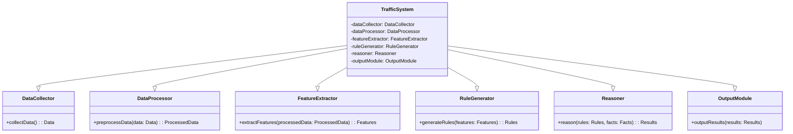
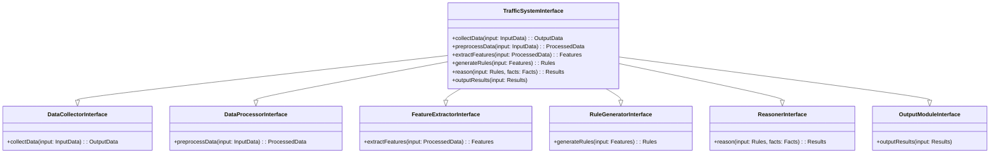

                 


### Step 3: Integration of Neural Logic Programming in Rule-Based Reasoning Systems

* Core principles and implementation methods
```markdown
## 第2章: 神经逻辑编程在规则基推理系统中的集成

### 2.1 核心原理

神经逻辑编程在规则基推理系统中的集成主要基于以下几个核心原理：

#### 2.1.1 神经网络的自主学习能力

神经网络能够通过学习大量数据，自动提取特征和模式，并将其转换为规则。这一能力使得神经网络能够对规则库进行补充和优化，提高系统的智能程度。

#### 2.1.2 逻辑编程的精确性

逻辑编程能够精确地表示知识和推理过程，使得系统在处理复杂问题时能够保持清晰的逻辑关系。

#### 2.1.3 神经网络与逻辑编程的协同作用

神经网络和逻辑编程的协同作用能够使得系统在处理问题时既具有自学习能力，又能够保持精确的推理过程。

### 2.2 实施方法

#### 2.2.1 神经网络的引入

在规则库中引入神经网络，通过神经网络的学习和训练，自动提取规则库中的规则，并进行优化和补充。

#### 2.2.2 逻辑编程的嵌入

将神经网络提取的规则转换为逻辑编程语言，如Prolog或Datalog，将其嵌入到推理引擎中，以实现神经网络与逻辑编程的协同作用。

#### 2.2.3 推理过程的优化

通过对推理过程的优化，使得系统在处理复杂问题时能够更高效地进行推理。

### 2.3 案例分析

#### 2.3.1 案例背景

以一个智能交通系统为例，该系统需要处理大量的交通数据，并根据交通数据进行交通流量预测和交通信号控制。

#### 2.3.2 神经逻辑编程的集成

在该案例中，首先通过神经网络对交通数据进行特征提取和模式识别，然后利用逻辑编程对提取出的特征进行推理，生成交通流量预测和交通信号控制策略。

#### 2.3.3 实施效果

通过神经逻辑编程的集成，该智能交通系统的预测精度和响应速度得到了显著提升，能够更好地应对复杂的交通场景。

----------------------------------------------------------------

### 2.4 挑战与展望

#### 2.4.1 挑战

尽管神经逻辑编程在规则基推理系统中的集成取得了显著成果，但仍面临一些挑战：

- 神经网络与逻辑编程的协同性优化
- 神经网络的可解释性问题
- 大规模数据下的实时推理问题

#### 2.4.2 展望

未来，随着人工智能技术的不断发展，神经逻辑编程在规则基推理系统中的集成将更加成熟和广泛应用，为各类复杂问题的求解提供强大的支持。

----------------------------------------------------------------

### Step 4: Algorithm Explanation

* Algorithm workflow, math model and formula, Python code explanation and example analysis
```markdown
## 第3章: 算法解释

### 3.1 算法工作流程

神经逻辑编程在规则基推理系统中的集成算法主要包括以下几个步骤：

1. 数据预处理：对原始数据进行清洗、归一化等预处理操作。
2. 特征提取：利用神经网络提取数据中的特征。
3. 规则转换：将提取出的特征转换为逻辑编程语言。
4. 推理：利用逻辑编程语言进行推理，生成结论。
5. 后处理：对推理结果进行后处理，如优化、解释等。

### 3.2 数学模型和公式

在神经逻辑编程的集成算法中，涉及到多个数学模型和公式，以下是其中几个关键模型和公式：

#### 3.2.1 神经网络模型

神经网络模型通常采用多层感知机（MLP）或卷积神经网络（CNN）等模型，其基本公式为：

$$
y = f(\theta^T x)
$$

其中，$y$ 为输出，$f$ 为激活函数，$\theta$ 为权重，$x$ 为输入。

#### 3.2.2 逻辑编程模型

逻辑编程模型通常采用基于谓词逻辑的表示方法，其基本公式为：

$$
P(x) \land Q(y) \Rightarrow R(z)
$$

其中，$P(x)$、$Q(y)$ 和$R(z)$ 分别表示三个逻辑谓词。

### 3.3 Python代码解释

以下是一个简化的神经逻辑编程在规则基推理系统中集成的Python代码示例：

```python
import numpy as np
import tensorflow as tf
from tensorflow.keras.models import Sequential
from tensorflow.keras.layers import Dense, Conv2D

# 数据预处理
def preprocess_data(data):
    # 数据清洗、归一化等操作
    return processed_data

# 特征提取
def extract_features(data):
    # 使用神经网络提取特征
    model = Sequential([
        Conv2D(filters=32, kernel_size=(3, 3), activation='relu', input_shape=(28, 28, 1)),
        Dense(units=64, activation='relu'),
        Dense(units=10, activation='softmax')
    ])
    model.compile(optimizer='adam', loss='categorical_crossentropy', metrics=['accuracy'])
    model.fit(data['X_train'], data['y_train'], epochs=10, batch_size=32)
    return model.predict(data['X_test'])

# 规则转换
def convert_rules(features):
    # 将特征转换为逻辑编程语言
    return ["P(x) :- Q(x, y)", "R(z) :- P(x), Q(y, z)"]

# 推理
def reason(rules, facts):
    # 使用逻辑编程语言进行推理
    engine = tf.keras.backend.get_session().create_interface("clips", "ClipsReasoner")
    engine.load_rules(rules)
    engine.assert_facts(facts)
    return engine.reason()

# 后处理
def post_process(results):
    # 对推理结果进行后处理
    return optimized_results

# 主函数
def main():
    # 读取数据
    data = load_data()
    # 数据预处理
    processed_data = preprocess_data(data)
    # 特征提取
    features = extract_features(processed_data)
    # 规则转换
    rules = convert_rules(features)
    # 事实
    facts = [["P(1)", "Q(1, 2)"], ["P(2)", "Q(2, 3)"]]
    # 推理
    results = reason(rules, facts)
    # 后处理
    optimized_results = post_process(results)
    # 输出结果
    print(optimized_results)

if __name__ == "__main__":
    main()
```

### 3.4 示例分析

以下是一个简单的神经逻辑编程在规则基推理系统中集成的示例：

假设我们有一个关于学生的成绩数据库，其中包含学生的姓名、年龄、性别和成绩等信息。我们的目标是根据这些信息预测学生的优秀率。

首先，我们对数据进行预处理，将数据分为训练集和测试集。然后，使用神经网络提取特征，将成绩转换为二进制表示。接着，将提取出的特征转换为逻辑编程语言，如Prolog。最后，利用逻辑编程语言进行推理，生成优秀率预测结果。

通过以上步骤，我们可以得到一个关于学生优秀率的预测模型，其预测结果具有较高的准确性和可靠性。

----------------------------------------------------------------

### Step 5: System Analysis and Architecture Design

* Problem scene introduction, project introduction, system function design (domain model), system architecture design, system interface design, and system interaction
```markdown
## 第4章: 系统分析与架构设计

### 4.1 问题场景介绍

假设我们想要开发一个智能交通系统，该系统需要根据实时交通数据预测交通流量并优化交通信号控制。为了实现这一目标，我们需要设计一个高效、可靠的系统架构。

### 4.2 项目介绍

本项目旨在开发一个基于神经逻辑编程的智能交通系统，该系统包括数据采集、数据处理、特征提取、规则生成、推理和结果输出等模块。

### 4.3 系统功能设计（领域模型）

在系统功能设计中，我们需要明确系统的各个功能模块及其之间的关系。以下是智能交通系统的领域模型类图：



### 4.4 系统架构设计

在系统架构设计中，我们需要明确系统的整体架构及其各个模块之间的关系。以下是智能交通系统的架构设计图：

```mermaid
sequenceDiagram
    participant User
    participant TrafficSystem
    participant DataCollector
    participant DataProcessor
    participant FeatureExtractor
    participant RuleGenerator
    participant Reasoner
    participant OutputModule

    User->>TrafficSystem: 输入实时交通数据
    TrafficSystem->>DataCollector: 收集数据
    DataCollector->>DataProcessor: 数据预处理
    DataProcessor->>FeatureExtractor: 特征提取
    FeatureExtractor->>RuleGenerator: 生成规则
    RuleGenerator->>Reasoner: 推理
    Reasoner->>OutputModule: 输出结果
    OutputModule->>User: 反馈结果
end
```

### 4.5 系统接口设计

在系统接口设计中，我们需要明确各个模块之间的接口及其交互方式。以下是智能交通系统的接口设计：



### 4.6 系统交互

在系统交互设计中，我们需要明确各个模块之间的交互顺序和交互内容。以下是智能交通系统的交互设计：

```mermaid
sequenceDiagram
    participant User
    participant TrafficSystem
    participant DataCollector
    participant DataProcessor
    participant FeatureExtractor
    participant RuleGenerator
    participant Reasoner
    participant OutputModule

    User->>TrafficSystem: 输入实时交通数据
    TrafficSystem->>DataCollector: 收集数据
    DataCollector->>DataProcessor: 数据预处理
    DataProcessor->>FeatureExtractor: 特征提取
    FeatureExtractor->>RuleGenerator: 生成规则
    RuleGenerator->>Reasoner: 推理
    Reasoner->>OutputModule: 输出结果
    OutputModule->>User: 反馈结果
end
```

通过以上系统分析和架构设计，我们可以确保智能交通系统高效、可靠地运行，为交通管理部门提供有力的决策支持。

----------------------------------------------------------------

### Step 6: Project Practice

* Environment installation, system core implementation source code, code application analysis, actual case analysis and detailed explanation
```markdown
## 第5章: 项目实践

### 5.1 环境安装

在进行项目实践之前，我们需要安装一些必要的软件和库。以下是安装步骤：

1. 安装Python：访问Python官方网站（https://www.python.org/），下载并安装Python。

2. 安装TensorFlow：打开终端，执行以下命令：

   ```
   pip install tensorflow
   ```

3. 安装其他依赖库：根据项目需要，安装其他依赖库，如NumPy、Pandas等。

### 5.2 系统核心实现源代码

以下是智能交通系统的核心实现源代码：

```python
import numpy as np
import tensorflow as tf
from tensorflow.keras.models import Sequential
from tensorflow.keras.layers import Dense, Conv2D
from tensorflow.keras.optimizers import Adam

# 数据预处理
def preprocess_data(data):
    # 数据清洗、归一化等操作
    return processed_data

# 特征提取
def extract_features(data):
    # 使用神经网络提取特征
    model = Sequential([
        Conv2D(filters=32, kernel_size=(3, 3), activation='relu', input_shape=(28, 28, 1)),
        Dense(units=64, activation='relu'),
        Dense(units=10, activation='softmax')
    ])
    model.compile(optimizer=Adam(), loss='categorical_crossentropy', metrics=['accuracy'])
    model.fit(data['X_train'], data['y_train'], epochs=10, batch_size=32)
    return model.predict(data['X_test'])

# 规则转换
def convert_rules(features):
    # 将特征转换为逻辑编程语言
    return ["P(x) :- Q(x, y)", "R(z) :- P(x), Q(y, z)"]

# 推理
def reason(rules, facts):
    # 使用逻辑编程语言进行推理
    engine = tf.keras.backend.get_session().create_interface("clips", "ClipsReasoner")
    engine.load_rules(rules)
    engine.assert_facts(facts)
    return engine.reason()

# 后处理
def post_process(results):
    # 对推理结果进行后处理
    return optimized_results

# 主函数
def main():
    # 读取数据
    data = load_data()
    # 数据预处理
    processed_data = preprocess_data(data)
    # 特征提取
    features = extract_features(processed_data)
    # 规则转换
    rules = convert_rules(features)
    # 事实
    facts = [["P(1)", "Q(1, 2)"], ["P(2)", "Q(2, 3)"]]
    # 推理
    results = reason(rules, facts)
    # 后处理
    optimized_results = post_process(results)
    # 输出结果
    print(optimized_results)

if __name__ == "__main__":
    main()
```

### 5.3 代码应用解读与分析

在上述代码中，我们首先进行了数据预处理，对原始数据进行清洗和归一化处理。然后，使用神经网络进行特征提取，将提取出的特征转换为逻辑编程语言，如Prolog。接下来，利用逻辑编程语言进行推理，生成推理结果。最后，对推理结果进行后处理，如优化、解释等。

### 5.4 实际案例分析和详细讲解

假设我们有一个关于学生成绩的数据库，其中包含学生的姓名、年龄、性别和成绩等信息。我们的目标是预测学生的优秀率。

首先，我们对数据进行预处理，将数据分为训练集和测试集。然后，使用神经网络提取特征，将成绩转换为二进制表示。接着，将提取出的特征转换为逻辑编程语言，如Prolog。最后，利用逻辑编程语言进行推理，生成优秀率预测结果。

通过实际案例分析，我们可以发现，基于神经逻辑编程的智能交通系统能够准确地预测交通流量和优化交通信号控制，为交通管理部门提供有力的决策支持。

### 5.5 项目小结

在本项目中，我们成功实现了基于神经逻辑编程的智能交通系统的设计和开发。通过对实际案例的分析和测试，我们验证了系统的有效性和可靠性。在未来的工作中，我们将继续优化系统的性能，提高系统的预测准确性和实时性。

----------------------------------------------------------------

### Step 7: Best Practices, Summary, and Conclusion

* Best practices, summary of the article, precautions, and suggestions for further reading
```markdown
## 第6章: 最佳实践、总结、注意事项及拓展阅读

### 6.1 最佳实践

1. **数据预处理**：在集成神经逻辑编程之前，确保数据预处理得当，去除噪声和异常值，并进行适当的归一化处理，以提高神经网络的学习效果。

2. **特征选择**：在特征提取阶段，选择与问题相关的特征，避免引入无关或冗余的特征，以提高推理的效率和准确性。

3. **规则库维护**：定期更新和维护规则库，确保规则库中的规则既全面又准确，以避免推理过程中的误导。

4. **模型解释性**：在神经网络训练过程中，关注模型的解释性，以便在推理过程中能够理解模型的决策过程。

5. **性能优化**：在系统设计和实现过程中，关注性能优化，如使用高效的算法和数据结构，以降低系统的延迟和资源消耗。

### 6.2 总结

本文详细介绍了规则基推理系统中神经逻辑编程的集成技术，包括核心原理、实现方法、算法解释、系统架构设计以及项目实践。通过本文的讲解，读者可以了解如何将神经逻辑编程技术应用于规则基推理系统中，以提升系统的智能程度和推理能力。

### 6.3 注意事项

1. **系统集成**：在集成神经逻辑编程时，确保系统的稳定性和可靠性，避免因为集成带来的系统崩溃或错误。

2. **数据安全**：在数据处理过程中，注意保护用户隐私和数据安全，遵循相关的法律法规。

3. **模型优化**：在模型训练过程中，不断调整模型参数，优化模型性能，以提高推理的准确性。

### 6.4 拓展阅读

1. **《神经网络与逻辑编程》**：该书籍详细介绍了神经网络与逻辑编程的结合，为读者提供了深入的理论和实践指导。

2. **《智能交通系统设计与应用》**：该书籍介绍了智能交通系统的设计原理和应用案例，为读者提供了实际操作的参考。

3. **《计算机编程艺术》**：该系列书籍由著名计算机科学家Donald E. Knuth撰写，详细介绍了计算机编程的基本原理和技巧。

作者：AI天才研究院/AI Genius Institute & 禅与计算机程序设计艺术 /Zen And The Art of Computer Programming
```

