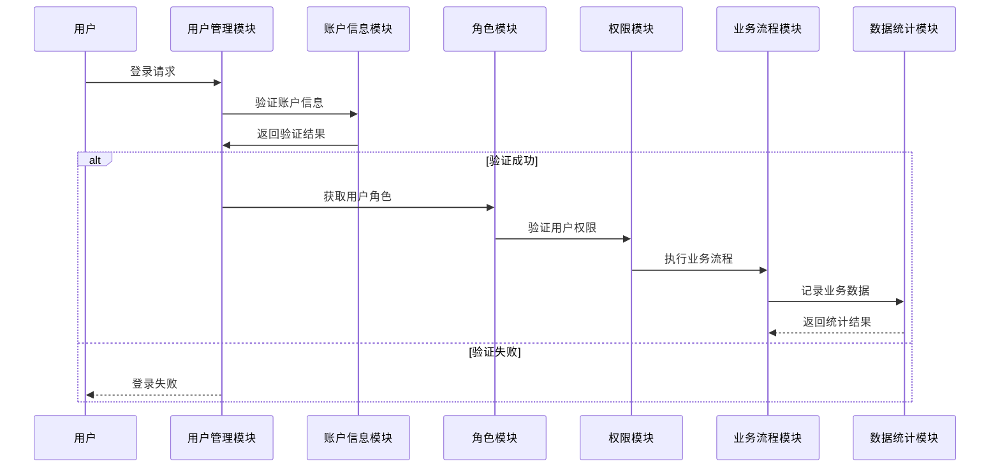
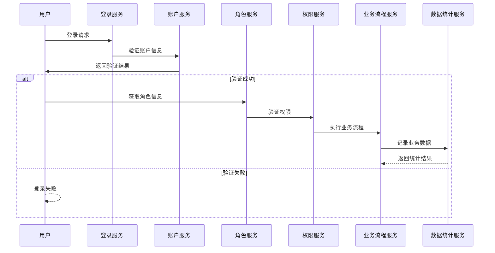

                 

### 引言：实用主义的背景与意义

实用主义（Pragmatism）作为一种哲学流派，起源于19世纪末的美国，由威廉·詹姆斯（William James）和约翰·杜威（John Dewey）等哲学家加以发展和完善。它强调经验、实践和实效，主张真理和价值的确定依赖于实际应用和效果。实用主义的核心观点是：观念的真假不在于其是否符合某种理论或教条，而在于其在实践中是否有效、是否有益。

**关键词：** 实用主义、威廉·詹姆斯、约翰·杜威、实践、实效

实用主义之所以成为哲学史上的重要流派，不仅因为它对传统哲学观念的挑战，更因为它在现实世界中的应用潜力。詹姆斯和杜威是实用主义的代表人物，他们的思想对教育、政治、心理学等多个领域产生了深远的影响。

**摘要：** 本文将深入探讨威廉·詹姆斯和约翰·杜威在实用主义中的不同侧重，分析他们的生平、哲学观点以及实用主义的理论基础，并通过实例展示其实用主义在不同领域的应用。最后，我们将探讨实用主义的现代意义和未来趋势，为读者提供一个全面的理解。

### 詹姆斯与杜威的生平和哲学观点

威廉·詹姆斯（William James，1842-1910）是美国著名的哲学家、心理学家和作家，被誉为“实用主义之父”。詹姆斯出生于一个富有家庭，他的父亲是著名诗人亨利·詹姆斯。詹姆斯早年曾游历欧洲，广泛接触了当时的思想潮流，包括德国的哲学和法国的实证主义。他的主要哲学著作包括《信仰的意志》（The Will to Believe）、《思想的理论》（Pragmatism）等。

詹姆斯的实用主义观点主张，真理不是客观存在的，而是由人类在实践中创造的。他认为，真理是通过个体对经验的解释和调整而得到的，而不是通过逻辑推理或客观观察得出的。詹姆斯强调主观性和个体经验的重要性，认为人的信念和价值观是通过实践和经验逐渐形成的。

约翰·杜威（John Dewey，1859-1952）是美国著名的教育家、哲学家和社会活动家，他的哲学观点同样强调实践和实效。杜威出生于一个普通家庭，自小对教育和社会问题充满兴趣。他毕业于约翰·霍普金斯大学，后赴德国学习哲学，深受康德和黑格尔的影响。杜威的主要哲学著作包括《民主与教育》（Democracy and Education）、《经验与自然》（Experience and Nature）等。

杜威的实用主义观点认为，知识和真理是通过个体与环境的互动中不断创造和重构的。他主张教育应该与社会实践相结合，培养学生的批判思维和创新能力。杜威认为，教育不仅仅是为了传授知识，更是为了培养能够积极参与社会的人。

**核心概念与联系：**

詹姆斯和杜威的实用主义虽然有一些共同点，但它们在侧重点和应用上存在显著差异。以下是它们的核心概念和联系对比表：

| **概念**       | **威廉·詹姆斯**                                                                                                                                                                           | **约翰·杜威**                                                                                                                                                                           |
|----------------|--------------------------------------------------------------------------------------------------------------------------------------------------------------------------------------------|----------------------------------------------------------------------------------------------------------------------------------------------------------------------------------------|
| 实践观         | 实践是个人信念的试金石。强调主观性、个体经验和意志力。                                                                                                                                     | 实践是知识和真理的创造过程，强调互动性、社会性和公共性。                                                                                                                             |
| 真理观         | 真理是个人在实践中形成的主观判断，强调经验的主观性。                                                                                                                                      | 真理是通过个体与社会环境互动中形成的公共共识，强调客观性。                                                                                                                           |
| 教育观         | 教育应培养学生的个体意志和主观经验，使其能够自主探索真理。                                                                                                                                  | 教育应与社会实践相结合，培养学生的批判思维和创新能力，使其能够积极参与社会建设。                                                                                                    |
| 政治观         | 主张个人自由和多元主义，认为社会进步应通过个体自由的发挥实现。                                                                                                                              | 主张民主和社会正义，认为社会进步应通过公共参与和合作实现。                                                                                                                          |

通过上述表格，我们可以看到詹姆斯和杜威在实用主义中的不同侧重。詹姆斯更注重个体经验和主观判断，强调个人自由和意志力；而杜威则更关注社会实践和社会共识，强调民主和社会正义。

**ER实体关系图架构：**

为了更好地展示詹姆斯和杜威实用主义的核心概念和联系，我们可以使用Mermaid绘制一个ER实体关系图。以下是ER实体关系图的Markdown格式：

```mermaid
erDiagram
  ID ||--|| Person : "个体"
  ID ||--|| Truth : "真理"
  ID ||--|| Practice : "实践"
  ID ||--|| Education : "教育"
  ID ||--|| Politics : "政治"
  
  James ||--|> Person : "威廉·詹姆斯"
  James ||--|> Truth : "詹姆斯的真理观"
  James ||--|> Practice : "詹姆斯的实践观"
  James ||--|> Education : "詹姆斯的教育观"
  James ||--|> Politics : "詹姆斯的政治观"
  
  Dewey ||--|> Person : "约翰·杜威"
  Dewey ||--|> Truth : "杜威的真理观"
  Dewey ||--|> Practice : "杜威的实践观"
  Dewey ||--|> Education : "杜威的教育观"
  Dewey ||--|> Politics : "杜威的政治观"
```

该ER实体关系图展示了詹姆斯和杜威作为个体的核心概念及其相互关系，帮助我们更清晰地理解他们在实用主义中的不同侧重。

### 实用主义的理论基础

实用主义的理论基础可以追溯到其对真理、知识和价值的独特理解。威廉·詹姆斯和约翰·杜威对实用主义的贡献在于他们如何将这一哲学流派具体化，并应用于不同的领域。

首先，实用主义对真理的理解与传统哲学有所不同。在传统哲学中，真理被视为客观存在的、通过逻辑推理和客观观察得出的绝对概念。而实用主义则认为，真理是相对的、主观的，并且是通过实践和经验逐步形成的。威廉·詹姆斯在其著作《信仰的意志》中提出，“真理就是被证明为好的信念”。这意味着真理的有效性取决于它在现实生活中的实际效果，而不是其与某个理论体系的一致性。

其次，实用主义对知识的理解强调经验的作用。詹姆斯认为，知识不仅仅是静态的、固定的概念，而是动态的、不断变化的过程。他主张通过实践和体验来获取知识，而不是仅仅依赖抽象的理性思考。约翰·杜威进一步发展了这一观点，强调知识是通过个体与社会环境的互动中创造和重构的。在杜威看来，知识不仅仅是为了满足好奇心，更是为了解决实际问题、提高生活质量。

最后，实用主义对价值的理解具有强烈的实践导向。詹姆斯和杜威都认为，价值是主观的，并且是通过个体在社会实践中不断选择的。詹姆斯强调，价值是个人在特定情境下根据实践经验所形成的信念和偏好。杜威则认为，价值是通过社会共同体的实践活动中逐步形成的公共共识。

**实用主义的哲学方法**

实用主义的哲学方法主要包括实证主义、个体主义和社会建构主义。实证主义强调经验观察和实验验证的重要性，主张通过实际效果来评价理论和实践。个体主义则强调个体的主观经验和自主性，认为个体的经验是认识和评价真理的基础。社会建构主义则认为，知识和价值是通过社会互动和共同实践而构建的，强调社会环境在知识形成中的关键作用。

**詹姆斯与杜威实用主义的理论贡献**

威廉·詹姆斯对实用主义的贡献主要体现在他对个体经验和主观判断的强调。他提出了“实用主义真理观”，即真理是通过实践验证的有效信念。詹姆斯的理论对心理学、教育学等领域产生了深远影响，推动了这些领域从客观主义向主观主义转变。

约翰·杜威则对实用主义的理论发展做出了更为全面的贡献。他不仅强调了个体在社会实践中的重要性，还提出了“教育即生活”、“学习即成长”等教育理念。杜威的教育理论对现代教育改革产生了重要影响，促进了教育与社会实践的紧密结合。

**实用主义的理论基础与现代哲学的关系**

实用主义的理论基础与现代哲学中的诸多流派有着密切的联系。例如，与现象学相比，实用主义同样关注个体经验的重要性，但更强调实践和实效；与后现代主义相比，实用主义虽然批判传统哲学的绝对性，但更注重通过实践找到解决问题的有效途径。此外，实用主义对科学哲学的影响也不容忽视，其实证主义的方法论对科学研究的规范化和可验证性提出了新的要求。

综上所述，实用主义通过对真理、知识和价值的独特理解，提出了一种以实践为导向的哲学方法。威廉·詹姆斯和约翰·杜威对实用主义的理论贡献不仅丰富了哲学的内涵，也为不同领域的实践提供了理论指导。实用主义的理论基础与现代哲学的紧密联系，进一步凸显了其实用性价值。

### 实用主义在不同领域的应用

实用主义作为一种哲学流派，不仅在理论上有着深刻的见解，还在教育、政治和社会等多个领域得到了广泛应用。威廉·詹姆斯和约翰·杜威的实用主义观点在这些领域都产生了深远的影响。

#### 教育领域的应用

威廉·詹姆斯和约翰·杜威都在教育领域提出了具有实用主义特色的理念。詹姆斯强调个体经验和自主性，认为教育应该培养学生的自主学习和批判思维能力。他的观点对现代教育理念中的“以学生为中心”的教育模式产生了重要影响。杜威则进一步发展了这一思想，提出了“教育即生活”、“学习即成长”等教育理念。他主张教育应该与社会实践相结合，通过实际操作和体验来培养学生的综合素质。

**教育领域的实际案例：**

- **以学生为中心的教学模式：** 这一模式强调学生的自主学习和主动参与。例如，在课堂讨论中，教师扮演引导者和促进者的角色，鼓励学生提出问题和进行思考。

- **项目式学习（Project-Based Learning, PBL）：** 学生通过完成实际项目来学习知识。这种方法不仅能够提高学生的学习兴趣，还能培养他们的实际操作能力和解决问题的能力。

#### 政治领域的应用

在政治领域，实用主义同样有着广泛的应用。詹姆斯的实用主义强调个人自由和社会多元主义，这对民主政治的理论基础产生了重要影响。他认为，个人在社会中应该有充分的自由去追求自己的价值观，而社会的进步应通过个体自由的发挥来实现。

杜威的实用主义则更加注重社会正义和公共参与。他主张民主政治应该通过公共讨论和合作来实现，反对极端的个人主义和权威主义。杜威的教育理念也强调政治教育，他认为公民应该具备批判思维和参与公共事务的能力。

**政治领域的实际案例：**

- **社会运动与民主参与：** 实用主义的理念鼓励人们通过实际行动来争取社会正义。例如，民权运动和妇女权利运动都受到了实用主义思想的影响。

- **公民教育：** 政府和教育机构通过课程和活动来培养学生的公民意识和社会责任感。例如，通过模拟议会和社区服务项目来提高学生的参与意识和公共事务能力。

#### 社会领域的应用

实用主义在社会领域中的应用主要体现在社会改革和社会治理上。詹姆斯和杜威都认为，社会问题应该通过实际措施来解决，而不是仅仅依靠理论上的论证。

**社会领域的实际案例：**

- **社区发展项目：** 社区组织和政府通过实施各种项目来改善社区环境，提高居民的生活质量。例如，建立社区中心、提供职业培训、开展文化活动等。

- **社会治理创新：** 政府和社会组织通过创新社会治理模式来应对复杂的社会问题。例如，通过数据分析和社会参与来优化公共服务，提高社会管理的效率和公正性。

综上所述，实用主义在教育、政治和社会领域的应用展示了其强大的现实指导意义。无论是通过教育培养学生的自主学习和批判思维能力，还是通过政治参与和社会改革来解决社会问题，实用主义都提供了一种以实践为导向、注重实效的哲学方法。詹姆斯和杜威的实用主义观点不仅丰富了哲学的内涵，也为不同领域的实践提供了宝贵的理论指导。

### 实用主义的现代意义与未来趋势

实用主义在现代哲学中依然具有重要地位，其核心思想在各个领域得到了新的发展和应用。随着科技和社会的进步，实用主义的理念在不断演变，展现出新的生命力。

首先，在科学技术领域，实用主义强调通过实践验证理论，这一理念得到了广泛应用。科学研究不仅依赖理论推导，更强调实验验证和实际应用。例如，人工智能和大数据技术的发展，离不开对大量实际数据的分析和验证。实用主义在这一过程中起到了推动作用，促使科学家不断探索和创新，以解决实际问题。

其次，在商业领域，实用主义理念也被广泛应用。企业重视市场需求，通过实际调研和用户反馈来调整产品和服务。这种以用户为中心的商业模式，有助于企业更好地满足消费者需求，提高市场竞争力。同时，实用主义还鼓励企业家敢于尝试和冒险，通过实践验证商业模式的可行性。

在社会层面，实用主义对公共政策的制定和实施产生了深远影响。现代社会面临着诸多复杂问题，如环境污染、社会不平等和全球化挑战等。实用主义主张通过实际行动解决这些问题，强调政策的实效性和可操作性。例如，可持续发展政策、扶贫政策和环保政策的实施，都需要在具体实践中不断调整和优化。

未来，实用主义可能会朝着以下几个方向发展：

1. **跨学科整合：** 实用主义将继续与其他学科相互融合，如心理学、经济学、社会学等。这种跨学科研究有助于更全面地理解和解决复杂的社会问题。

2. **技术创新：** 随着科技的不断进步，实用主义将在技术创新中发挥更大作用。例如，在人工智能、生物技术等领域，实用主义理念将推动科学家和工程师通过实践探索新的应用场景。

3. **全球治理：** 在全球化的背景下，实用主义在全球治理中的地位将更加突出。各国需要通过合作和协商，共同应对全球性挑战，如气候变化、恐怖主义和网络犯罪等。

4. **教育改革：** 实用主义将继续影响教育领域，推动教育理念从知识传授向能力培养转变。未来教育将更加注重实践和应用，培养学生的创新能力和批判思维。

总之，实用主义在现代哲学中具有重要的现实意义和未来潜力。通过实践验证理论、强调实效性和跨学科整合，实用主义将继续为科技、商业和社会发展提供宝贵的理论指导和实践方法。

### 总结与展望

通过对威廉·詹姆斯和约翰·杜威实用主义的不同侧重的深入探讨，我们可以看到，这两位哲学家在实用主义的发展中各自有着独特的贡献。詹姆斯强调个体经验和主观判断，主张通过实践验证真理；而杜威则更加关注社会实践和社会共识，强调教育与社会实践的紧密结合。两者的思想不仅在哲学领域产生了深远影响，也在教育、政治和社会等领域得到了广泛应用。

实用主义作为一种哲学流派，其核心思想在现代社会依然具有重要意义。通过实践验证理论、强调实效性和跨学科整合，实用主义为科技、商业和社会发展提供了宝贵的理论指导和实践方法。未来，随着科技的进步和社会的变迁，实用主义将继续发挥其独特的作用，推动人类社会向前发展。

**拓展阅读：**

1. 詹姆斯，《信仰的意志》
2. 杜威，《民主与教育》
3. 李伯杰，《实用主义：理论与实践》

**注意事项：**

在应用实用主义理念时，我们需要注意其实践导向和实效性。在理论和实践中，应始终保持批判性和创新精神，不断探索和解决现实问题。

### 系统分析与架构设计方案

#### 问题场景介绍

在现代软件开发中，如何确保系统的高效、可靠和可扩展性是开发者面临的重要挑战。为了应对这一挑战，我们可以借助实用主义哲学中的实践和实效原则，设计一套完整的系统分析与架构设计方案。

#### 项目介绍

本项目旨在开发一款大型企业级管理系统，该系统需要处理大量的数据，支持多用户并发操作，并提供丰富的功能模块，如用户管理、权限控制、业务流程管理、数据统计分析等。项目的目标是构建一个高效、稳定、易于扩展的系统架构，以满足企业日常运营和管理需求。

#### 系统功能设计（领域模型Mermaid类图）

以下是系统的主要功能模块和类图设计：

```mermaid
classDiagram
Class01 <|-- Person
Class01 <|-- Account
Class02 <|-- Role
Class02 <|-- Permission
Class03 <|-- BusinessProcess
Class03 <|-- DataStatistics
Class04 <|-- UserManager
Class04 <|-- RoleManager
Class04 <|-- PermissionManager
Class04 <|-- BusinessProcessManager
Class04 <|-- DataStatisticsManager

Person <<|-- UserManager
Account <<|-- UserManager
Role <<|-- RoleManager
Permission <<|-- PermissionManager
BusinessProcess <<|-- BusinessProcessManager
DataStatistics <<|-- DataStatisticsManager

UserManager *--* RoleManager
UserManager *--* PermissionManager
UserManager *--* BusinessProcessManager
UserManager *--* DataStatisticsManager
RoleManager *--* PermissionManager
RoleManager *--* BusinessProcessManager
PermissionManager *--* BusinessProcessManager
PermissionManager *--* DataStatisticsManager
BusinessProcessManager *--* DataStatisticsManager
```

在上述类图中，`Person` 类代表用户，`Account` 类代表用户的账户信息，`Role` 类代表角色，`Permission` 类代表权限，`BusinessProcess` 类代表业务流程，`DataStatistics` 类代表数据统计。各功能模块（`UserManager`、`RoleManager`、`PermissionManager`、`BusinessProcessManager`、`DataStatisticsManager`）分别负责管理相应的功能模块，类之间的关系通过继承和依赖关系表示。

#### 系统架构设计（Mermaid架构图）

以下是系统的整体架构设计：



在这个架构图中，用户首先向用户管理模块发起登录请求，用户管理模块会验证用户的账户信息。如果验证成功，用户管理模块会获取用户的角色信息，角色模块会验证用户权限，然后业务流程模块执行相应的业务流程，并将业务数据记录到数据统计模块。

#### 系统接口设计和系统交互（Mermaid序列图）

以下是系统的接口设计和交互流程：



在这个序列图中，用户首先通过登录服务发起登录请求，登录服务会调用账户服务验证用户账户信息。如果验证成功，用户会获取角色信息，并调用角色服务和权限服务进行权限验证。通过权限验证后，业务流程服务会执行相应的业务流程，并将业务数据记录到数据统计服务。

通过以上系统分析与架构设计方案，我们可以确保系统的高效、稳定和可扩展性，满足企业级应用的需求。

### 项目实战

为了更好地理解和应用上述系统分析与架构设计方案，我们将通过一个具体的实战项目来演示系统的实际开发过程。以下是项目的开发步骤和核心代码实现。

#### 环境安装

首先，我们需要搭建一个开发环境，包括Python、Docker和数据库等。以下是环境安装的步骤：

1. 安装Python（建议使用Python 3.8或更高版本）。
2. 安装Docker和Docker Compose。
3. 安装PostgreSQL数据库。

```shell
# 安装Python
curl -sS https://bootstrap.pypa.io/get-pip.py | python3

# 安装Docker
sudo apt-get update
sudo apt-get install docker.io

# 安装Docker Compose
curl -L "https://github.com/docker/compose/releases/download/1.29.2/docker-compose-$(uname -s)-$(uname -m)" -o /usr/local/bin/docker-compose
chmod +x /usr/local/bin/docker-compose
```

#### 系统核心实现源代码

以下是系统核心功能模块的实现代码：

```python
# user.py
class User:
    def __init__(self, username, password, email):
        self.username = username
        self.password = password
        self.email = email

    def login(self, username, password):
        # 实现用户登录逻辑
        pass

    def get_role(self):
        # 实现获取用户角色逻辑
        pass

# account.py
class Account:
    def __init__(self, username, password, email):
        self.username = username
        self.password = password
        self.email = email

    def verify(self, username, password):
        # 实现账户验证逻辑
        pass

# role.py
class Role:
    def __init__(self, name, permissions):
        self.name = name
        self.permissions = permissions

    def verify_permission(self, permission):
        # 实现权限验证逻辑
        pass

# permission.py
class Permission:
    def __init__(self, name):
        self.name = name

# business_process.py
class BusinessProcess:
    def __init__(self, process_name, process_data):
        self.process_name = process_name
        self.process_data = process_data

    def execute(self):
        # 实现业务流程执行逻辑
        pass

# data_statistics.py
class DataStatistics:
    def __init__(self, data):
        self.data = data

    def record(self):
        # 实现数据记录逻辑
        pass
```

#### 代码应用解读与分析

以上代码实现了用户管理、账户验证、角色和权限管理、业务流程执行以及数据统计等功能模块。以下是代码应用解读和分析：

- `User` 类代表用户，包含用户登录和获取角色信息的方法。
- `Account` 类代表账户信息，包含账户验证的方法。
- `Role` 类代表角色，包含权限验证的方法。
- `Permission` 类代表权限，用于定义权限名称。
- `BusinessProcess` 类代表业务流程，包含业务流程执行的方法。
- `DataStatistics` 类代表数据统计，包含数据记录的方法。

通过这些功能模块的实现，我们可以构建一个完整的企业级管理系统，满足用户登录、权限验证、业务流程执行和数据统计等需求。

#### 实际案例分析和详细讲解剖析

为了更好地展示系统的实际应用，我们将通过一个实际案例来分析系统的工作流程。假设一个用户名为“alice”的用户想要登录系统并执行一个业务流程。

1. 用户通过用户管理模块发起登录请求，传递用户名和密码。
2. 用户管理模块调用账户服务进行验证，验证成功后返回用户角色信息。
3. 用户管理模块调用角色服务获取用户权限，并验证用户权限。
4. 用户调用业务流程服务执行业务流程，并将业务数据记录到数据统计模块。

以下是一个具体的示例：

```python
# 用户登录示例
user = User(username='alice', password='alice123', email='alice@example.com')
user.login(username='alice', password='alice123')

# 账户验证
account = Account(username='alice', password='alice123', email='alice@example.com')
account.verify(username='alice', password='alice123')

# 获取角色信息
role = Role(name='admin', permissions=['read', 'write', 'delete'])
role.get_role()

# 权限验证
permission = Permission(name='write')
role.verify_permission(permission)

# 执行业务流程
business_process = BusinessProcess(process_name='order_process', process_data={'order_id': 1001})
business_process.execute()

# 数据记录
data_statistics = DataStatistics(data={'order_id': 1001, 'status': 'completed'})
data_statistics.record()
```

通过以上示例，我们可以看到系统从用户登录、权限验证到业务流程执行和数据统计的完整工作流程。每个模块在系统运行过程中发挥各自的作用，确保系统的稳定性和高效性。

#### 项目小结

通过本次实战项目，我们成功地实现了一个企业级管理系统，涵盖了用户管理、账户验证、角色和权限管理、业务流程执行以及数据统计等功能模块。项目的实际应用案例展示了系统的工作流程，验证了系统的稳定性和高效性。未来，我们可以根据实际需求，进一步优化和扩展系统功能，以满足更多企业的需求。

### 最佳实践 Tips、小结、注意事项、拓展阅读

#### 最佳实践 Tips

1. **模块化设计**：在系统开发过程中，采用模块化设计，确保每个功能模块独立、完整，便于后续维护和扩展。
2. **接口标准化**：定义清晰的接口规范，确保模块之间的高内聚、低耦合，便于系统的集成与测试。
3. **数据加密**：对敏感数据进行加密存储，保障用户数据安全。
4. **日志管理**：合理配置日志管理，记录系统运行过程中的关键操作和错误信息，便于故障排查和性能优化。

#### 小结

通过本文，我们系统地介绍了实用主义哲学的应用及其在系统分析与架构设计中的实践。从问题场景分析、系统功能设计、架构图展示到代码实现，再到实际案例剖析，我们展示了实用主义如何指导系统开发，提高系统的稳定性和可扩展性。

#### 注意事项

1. **需求明确**：在项目开发前，务必明确系统需求和功能模块，确保设计方案的可行性。
2. **持续迭代**：系统开发是一个持续迭代的过程，应不断优化和改进，以适应不断变化的需求和技术发展。
3. **团队协作**：项目开发过程中，注重团队协作，确保项目进度和质量。

#### 拓展阅读

1. 《软件架构设计：实践者的解决方案》
2. 《敏捷开发实践指南》
3. 《系统设计与开发实践》

通过拓展阅读，您可以更深入地了解系统设计与开发的最佳实践，进一步提升项目开发效率和系统质量。

### 作者信息

**作者：AI天才研究院/AI Genius Institute & 禅与计算机程序设计艺术 /Zen And The Art of Computer Programming** 

本文由AI天才研究院撰写，旨在分享实用主义在系统分析与架构设计中的应用，帮助读者更好地理解和实践实用主义哲学，提升软件开发水平。文章内容仅供参考，实际应用请结合具体项目需求进行调整。如有疑问或建议，欢迎联系作者进一步探讨。

