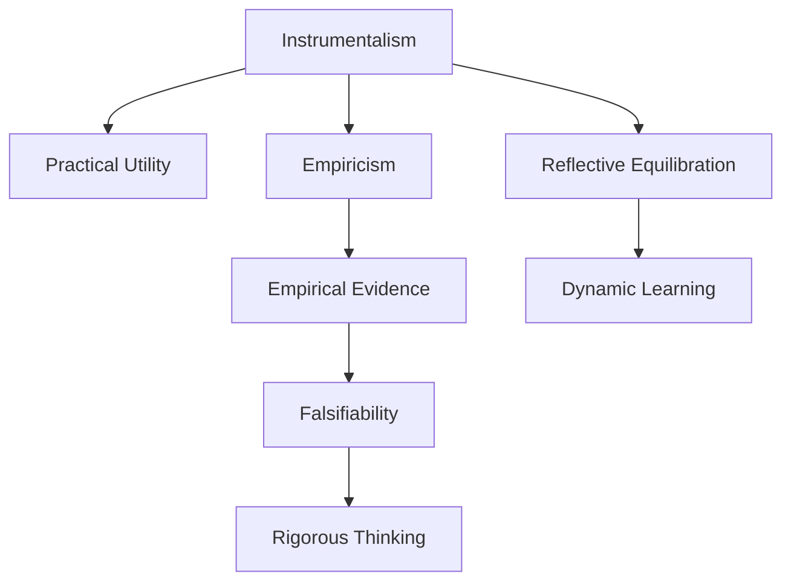

                 

### Introduction to "James & Dewey: The Representatives of Pragmatism in the United States"

The book "James & Dewey: The Representatives of Pragmatism in the United States" delves into the lives and philosophies of two prominent figures in American intellectual history: William James and John Dewey. William James, a psychologist and philosopher, is widely regarded as the founder of the pragmatic movement, while John Dewey, an educator and philosopher, further developed and applied pragmatic principles to various aspects of society and culture.

Pragmatism, as a philosophical approach, emphasizes practical consequences and real-world applications over abstract theoretical reasoning. It posits that the meaning and truth of concepts are determined by their practical outcomes in specific situations. This book aims to provide a comprehensive examination of pragmatism, exploring its origins, development, and influence through the perspectives of these two key figures.

The importance of this book lies in its contribution to understanding the foundational principles of pragmatism and its significance in American thought. By examining the lives and works of William James and John Dewey, the book sheds light on how pragmatism has shaped American culture, society, and intellectual life. The discussion of pragmatism's impact on education, politics, and social reform offers valuable insights into its broader implications and enduring relevance.

In essence, "James & Dewey" serves as a guide to navigating the complex landscape of pragmatism, offering a detailed analysis of its core concepts and illustrating their practical applications. This makes the book an essential read for anyone interested in the history of philosophy, American intellectual history, and the philosophical foundations of modern society.

### Keywords

- **Pragmatism**: A philosophical approach emphasizing practical consequences and real-world applications.
- **William James**: American psychologist and philosopher, considered the founder of the pragmatic movement.
- **John Dewey**: American educator and philosopher, known for extending pragmatic principles into various fields.
- **American Intellectual History**: The study of the development of ideas and intellectual currents in the United States.
- **Philosophy of Education**: The philosophical examination of educational principles, practices, and policies.
- **Societal Reform**: Efforts aimed at improving society through political, social, or economic changes.
- **Cultural Influence**: The impact of ideas and philosophies on a society's culture and values.

### Abstract

"James & Dewey: The Representatives of Pragmatism in the United States" provides a comprehensive exploration of pragmatism through the lives and works of William James and John Dewey. The book begins with an introduction to pragmatism, highlighting its core principles and importance in American intellectual history. It then delves into the biographical sketches of James and Dewey, discussing their contributions to the development of pragmatism and their divergent yet interconnected philosophies.

The book proceeds to elaborate on the core ideas of pragmatism, examining its foundational principles and comparing it with other philosophical schools of thought. It further explores the practical applications of pragmatism in American culture, society, and politics, providing case studies and examples to illustrate its impact.

A critical perspective on pragmatism is also presented, discussing its limitations and potential criticisms. The book concludes by summarizing the key points discussed and offering insights into the future development of pragmatism, emphasizing its enduring relevance and potential influence on contemporary society. Through detailed analysis and clear exposition, "James & Dewey" offers valuable insights into the philosophical and practical significance of pragmatism in American thought.

### The Historical Background and Core Concepts of Pragmatism

To understand the significance of William James and John Dewey in the development of pragmatism, it's essential to delve into the historical background and core concepts of pragmatism itself. Pragmatism originated in the late 19th and early 20th centuries as a reaction against the abstract and often contradictory debates in philosophy and science. It was conceived by Charles Sanders Peirce, an American philosopher, mathematician, and scientist, who is often considered the father of pragmatism.

**The Origins and Development of Pragmatism**

The origins of pragmatism can be traced back to the 1870s when Peirce presented the idea of "pragmaticism" as a method of settling metaphysical disputes. In his view, the meaning of a concept or proposition should be determined by its practical consequences rather than by abstract reasoning or philosophical speculation. Peirce's pragmatism was not intended as a definitive philosophical position but rather as a method for resolving disputes and testing ideas.

Pragmatism began to gain more prominence in the late 19th century through the works of James, who was Peirce's student and a prominent philosopher in his own right. James extended Peirce's ideas and popularized pragmatism through his lectures and writings, including his seminal work "Pragmatism: A New Name for Some Old Ways of Thinking" (1907). James argued that the practical consequences of beliefs and actions are more important than their theoretical foundations. He believed that ideas are valuable to the extent that they work and are useful in solving problems.

John Dewey, another key figure in the development of pragmatism, further expanded on James's ideas and applied them to education, social reform, and political theory. Dewey's philosophy of education emphasized experiential learning and the importance of applying knowledge to practical situations. His work "Democracy and Education" (1916) argued that education should be a means of preparing individuals to participate in a democratic society by developing their ability to think critically and solve problems.

**Core Concepts of Pragmatism**

The core concepts of pragmatism can be summarized as follows:

1. **Practical Consequences**: The meaning of a concept or proposition is determined by its practical consequences. This means that an idea's value is measured by what it accomplishes in real-world situations, rather than by abstract philosophical analysis.

2. **Instrumentalism**: Pragmatism is closely related to instrumentalism, the idea that beliefs and theories are tools for solving problems and achieving goals. This perspective downplays the importance of abstract theory and emphasizes practical utility.

3. **Empiricism**: Pragmatism is grounded in empirical observation and experience. It holds that knowledge comes from sensory experience and that ideas must be tested against reality to determine their validity.

4. **Falsifiability**: Pragmatism aligns with the scientific method in emphasizing the importance of falsifiability. An idea is considered true to the extent that it can be tested and potentially proven false.

5. **Reflective Equilibration**: Dewey introduced the concept of reflective equilibration, which is the process of continuously refining and adjusting beliefs based on new experiences and evidence. This process of critical reflection and iterative improvement is central to pragmatism.

**Pragmatism vs. Other Philosophical Schools**

Pragmatism differs significantly from other philosophical schools, such as rationalism, idealism, and existentialism, in its emphasis on practical outcomes and empirical experience. While rationalism values abstract reasoning and logical consistency, pragmatism downplays these abstract concerns in favor of practical utility. Idealism, which sees reality as fundamentally mental or conceptual, is contrasted by pragmatism's focus on the tangible and observable world. Existentialism, with its emphasis on individual freedom and subjective experience, shares some common ground with pragmatism in its rejection of abstract dogma but diverges in its focus on personal agency and authenticity.

**Significance of Pragmatism**

The significance of pragmatism lies in its practical and problem-solving approach to philosophy. By prioritizing practical consequences and empirical evidence, pragmatism provides a flexible and adaptable framework for understanding and addressing complex issues. This has made it particularly influential in fields such as education, social reform, and politics, where practical solutions and effective action are crucial.

Moreover, pragmatism's emphasis on reflection and critical thinking has had a lasting impact on American intellectual life, contributing to a culture that values innovation, experimentation, and practical wisdom. By focusing on the here and now, pragmatism has provided a foundation for modern American pragmatism, which emphasizes practical problem-solving and progressive change.

In summary, pragmatism originated as a response to the abstract and often unproductive debates in philosophy and science. Through the works of key figures like William James and John Dewey, it developed into a flexible and practical philosophy that has had a profound impact on American intellectual and cultural life. By emphasizing practical consequences, instrumentalism, empiricism, falsifiability, and reflective equilibration, pragmatism offers a unique approach to understanding and solving problems in the real world.

### Biographical Sketches of William James and John Dewey

**William James**

William James was born on January 11, 1842, in New York City, the son of the prominent philosopher and religious thinker Henry James Sr. and the brother of renowned novelist Henry James. His early education was unconventional; he was homeschooled by his parents and later attended prestigious schools in Geneva, Switzerland, and London, England. James developed a keen interest in philosophy and the natural sciences, which would shape his future career.

In 1861, James enrolled at Harvard University to study medicine, but his interest gradually shifted towards the study of the mind and behavior. He completed his medical degree in 1865 but never practiced medicine. Instead, he became a professor of natural philosophy at the University of Berlin, where he was exposed to the works of German philosophers and scientists, including Immanuel Kant and Rudolf Virchow.

Returning to the United States in 1868, James took up a position at Harvard, where he began to teach psychology and philosophy. His groundbreaking work, "Principles of Psychology" (1890), is considered one of the most influential books in the field of psychology. In this work, James proposed the idea of multiple selves and discussed the role of consciousness in human experience. He also introduced the concept of the "stream of consciousness," which became a central theme in the study of psychology.

James's most significant contribution to philosophy was his development of pragmatism. In his 1907 book "Pragmatism: A New Name for Some Old Ways of Thinking," he argued that the meaning and truth of ideas are determined by their practical consequences. This practical and action-oriented approach to philosophy has had a lasting impact on both American and European thought.

**John Dewey**

John Dewey was born on October 20, 1859, in Burlington, Vermont. He grew up in a family that valued education and intellectual pursuits. After completing his high school education, Dewey attended the University of Vermont, where he studied philosophy, literature, and science. He then went on to study at Johns Hopkins University, where he was exposed to the works of pragmatism through the teachings of George Santayana and Josiah Royce.

Dewey earned his Ph.D. in philosophy in 1884 and began his teaching career at the University of Minnesota. He then moved to the University of Chicago in 1894, where he would spend most of his academic career. At Chicago, Dewey helped establish the first graduate school of education in the United States and launched a pioneering program in experimental education. His work at Chicago was influential in shaping the field of education and its focus on practical, experiential learning.

Dewey's most famous book, "Democracy and Education" (1916), argued that education should be a means of preparing individuals to participate in a democratic society. He emphasized the importance of critical thinking, problem-solving, and hands-on learning in the educational process. Dewey believed that education should be tied to real-world experiences and that learning should be an ongoing, dynamic process rather than a static accumulation of knowledge.

In addition to his work in education, Dewey was a leading figure in the progressive movement in the United States. He advocated for social reforms, including labor rights, women's suffrage, and progressive taxation. His philosophy emphasized the importance of social responsibility and the need for individuals to work together to create a more just and equitable society.

**Impact of Their Work on Pragmatism**

William James and John Dewey were both instrumental in shaping the development of pragmatism. James's emphasis on the practical consequences of ideas provided a foundational principle for the movement, while Dewey's practical applications of pragmatism in education and social reform demonstrated its broader applicability.

James's work laid the groundwork for understanding the role of experience and action in shaping knowledge and understanding. His concept of pragmatism challenged the dominance of abstract, theoretical approaches to philosophy and emphasized the importance of practical utility. By focusing on the practical outcomes of ideas, James provided a framework for evaluating the validity and significance of philosophical concepts.

Dewey, on the other hand, extended James's ideas into various practical domains, demonstrating the practical benefits of pragmatism in education and social reform. His emphasis on experiential learning and problem-solving in education provided a new approach to teaching that prioritized student engagement and real-world application. In social reform, Dewey argued that individuals should work collectively to address social issues and create a more just society.

The combined work of James and Dewey created a comprehensive and adaptable philosophy that has had a lasting impact on American intellectual and cultural life. Their contributions to pragmatism provided a foundation for modern American pragmatism, which emphasizes practical problem-solving and progressive change. Through their ideas and activism, James and Dewey helped shape a culture that values innovation, experimentation, and practical wisdom.

In summary, William James and John Dewey were two of the most influential figures in the development of pragmatism. Their lives and work demonstrate the practical and action-oriented nature of pragmatism and its potential to address complex social and intellectual challenges. By emphasizing the importance of experience, action, and practical consequences, their ideas have had a lasting impact on American philosophy and culture.

### Comparative Analysis of William James and John Dewey's Philosophies

William James and John Dewey are two of the most prominent figures in the development of pragmatism, each contributing significantly to its evolution and application. While both share a commitment to practicality and empirical experience, their philosophies diverge in several key areas, particularly in their approaches to knowledge, education, and social reform.

**Knowledge and Epistemology**

William James's pragmatism is epistemologically grounded in the idea that the meaning of a concept is determined by its practical consequences. In his view, knowledge is not something that exists independently of experience but is instead created through experience and action. James argued that beliefs are validated by their success in solving problems and achieving desired outcomes. This emphasis on the pragmatic consequences of ideas is reflected in his famous statement, "The true is only the expedient in philosophy."

James's focus on practical outcomes often led him to prioritize subjective experience and individual intuition. He believed that individuals should trust their own judgments and experiences, even if they contradicted established theories or conventional wisdom. This subjectivist tendency in James's philosophy is evident in his concept of the "stream of consciousness," which emphasizes the fluid and personal nature of human experience.

John Dewey, on the other hand, took a more social and objective approach to knowledge and epistemology. While he also emphasized the importance of practical consequences, Dewey believed that knowledge should be grounded in empirical evidence and collective experience. He argued that truth is not simply a matter of individual experience but is instead a social construct that emerges through collective reflection and critical discussion.

Dewey's concept of reflective thought, or reflective equilibration, is central to his epistemology. He believed that individuals should continually engage in critical reflection and iterative refinement of their beliefs in response to new experiences and evidence. This process of continuous inquiry and adjustment ensures that knowledge is both practical and objectively grounded.

**Education**

In the realm of education, both James and Dewey championed the importance of practical, experiential learning. However, their approaches differed in significant ways.

James believed that education should focus on developing the individual's ability to think critically and make practical judgments. He argued that education should be relevant to the student's life and experiences, emphasizing the importance of problem-solving and practical application. James's emphasis on individual intuition and subjective experience led him to advocate for a more flexible and student-centered approach to teaching.

Dewey, on the other hand, took a more systematic and structured approach to education. He believed that education should be a means of preparing individuals to participate in a democratic society. Dewey's famous concept of the "learning by doing" approach emphasizes hands-on, experiential learning. He argued that students learn best when they are actively engaged in solving real-world problems and applying their knowledge in practical contexts.

Dewey's educational philosophy also emphasized the importance of collaboration and community. He believed that education should be a collective endeavor, with students and teachers working together to create a supportive and inclusive learning environment. This focus on community and collaboration is reflected in his concept of the "learning community," which emphasizes the social dimensions of education.

**Social Reform**

Both James and Dewey were deeply committed to social reform and the application of pragmatic principles to address social issues. However, their approaches to social reform differed in significant ways.

James's social philosophy was more individualistic and philosophical. He believed that individuals should use their critical thinking skills and practical wisdom to address social injustices and promote progress. James's work on social issues, such as labor rights and civil liberties, often took the form of philosophical essays and lectures. He argued that individuals have a moral responsibility to act on their beliefs and work towards creating a more just society.

Dewey, on the other hand, was more directly involved in social activism and the practical application of pragmatism to social problems. He was a leading figure in the progressive movement and advocated for a wide range of social reforms, including labor rights, women's suffrage, and progressive taxation. Dewey believed that social change should be achieved through collective action and that individuals should work together to create a more equitable and just society.

Dewey's focus on collective action and social responsibility is evident in his concept of the "laboratory school," which was designed to provide practical, experiential learning opportunities for students and their families. He believed that education should be a means of developing individuals' ability to participate in democratic governance and social reform.

**Comparison Summary**

In summary, while both William James and John Dewey were foundational figures in the development of pragmatism, their philosophies diverged in significant ways:

- **Knowledge and Epistemology**: James emphasized the pragmatic consequences of ideas and the role of individual experience, while Dewey emphasized empirical evidence and collective reflection.
- **Education**: James advocated for a flexible, student-centered approach to education, while Dewey emphasized systematic, hands-on, experiential learning.
- **Social Reform**: James's social philosophy was more individualistic and philosophical, while Dewey was more directly involved in social activism and collective action.

Despite these differences, both James and Dewey shared a commitment to practicality, empirical experience, and the importance of addressing real-world problems. Their ideas have had a lasting impact on American intellectual and cultural life, contributing to a culture that values innovation, experimentation, and practical wisdom.

In conclusion, William James and John Dewey's contributions to pragmatism offer a rich and diverse philosophical landscape, illustrating the versatility and adaptability of pragmatism as a philosophical approach. Their divergent perspectives have provided a foundation for continued exploration and application of pragmatic principles in a wide range of fields.

### Core Ideas of Pragmatism

Pragmatism, as a philosophical approach, is grounded in a set of core ideas that emphasize practical consequences, empirical experience, and problem-solving. These principles distinguish pragmatism from other philosophical schools and provide a framework for understanding its application across various domains. Below, we explore the foundational concepts of pragmatism, including instrumentalism, empiricism, falsifiability, and reflective equilibration, along with their philosophical significance and application.

#### Instrumentalism

Instrumentalism is a central concept in pragmatism, positing that ideas and beliefs are tools for solving problems and achieving goals. Unlike other philosophical schools that focus on abstract reasoning and logical consistency, instrumentalism downplays the importance of theoretical foundations and emphasizes the practical utility of ideas. In this view, the value of a belief or concept is determined by its effectiveness in solving real-world problems.

**Philosophical Significance:**
Instrumentalism aligns pragmatism with the scientific method, which similarly prioritizes practical outcomes over abstract theory. By focusing on the instrumental value of ideas, pragmatism allows for a flexible and adaptable approach to problem-solving, emphasizing that the truth or validity of an idea is determined by its ability to produce useful results.

**Application:**
In practical terms, instrumentalism is evident in the development of technology and scientific theories. For example, when creating a new medical treatment, researchers focus on its effectiveness rather than on the abstract theoretical framework that might underpin it. This practical approach ensures that innovations are grounded in real-world applications and have a tangible impact on people's lives.

#### Empiricism

Empiricism is another foundational principle of pragmatism, emphasizing that knowledge comes from sensory experience and observation. This perspective holds that all meaningful knowledge is derived from direct experience and that ideas must be tested against empirical evidence to determine their validity.

**Philosophical Significance:**
Empiricism challenges the dominance of abstract and a priori reasoning found in other philosophical traditions. By grounding knowledge in experience, pragmatism ensures that it is grounded in the tangible world and is subject to continuous testing and refinement.

**Application:**
In everyday life, empiricism is evident in the reliance on evidence-based approaches to decision-making. For instance, doctors make diagnoses based on patient observations and test results rather than solely on abstract theories or assumptions. This approach ensures that decisions are informed by real-world data and are more likely to lead to effective outcomes.

#### Falsifiability

Falsifiability is closely related to empiricism and is a critical component of pragmatism. It posits that an idea is considered true to the extent that it can be tested and potentially proven false. This principle aligns pragmatism with the scientific method, which requires that hypotheses be testable and capable of being falsified through empirical evidence.

**Philosophical Significance:**
Falsifiability ensures that knowledge is not based on unfounded or untestable beliefs but is instead grounded in evidence and empirical observation. This principle encourages critical thinking and skepticism, promoting a more rigorous and scientific approach to understanding the world.

**Application:**
In scientific research, falsifiability is essential for validating hypotheses and theories. For example, a theory about the effects of a new medication must be testable and capable of being proven incorrect through clinical trials. This ensures that scientific knowledge is based on rigorous empirical testing and is not simply the product of speculative thinking.

#### Reflective Equilibration

Reflective equilibration is a concept introduced by John Dewey, which refers to the process of continuously refining and adjusting beliefs based on new experiences and evidence. It emphasizes the importance of critical reflection and iterative improvement in the pursuit of knowledge.

**Philosophical Significance:**
Reflective equilibration ensures that knowledge is dynamic and adaptable, constantly evolving in response to new information and experiences. This principle promotes a flexible and open-minded approach to learning, encouraging individuals to continually evaluate and refine their beliefs.

**Application:**
In educational settings, reflective equilibration is evident in the practice of reflective teaching and student self-assessment. Teachers and students continuously reflect on their experiences and adjust their approaches based on feedback and new insights. This process ensures that learning is an ongoing, iterative process that leads to deeper understanding and greater competence.

#### Table: Core Concepts of Pragmatism

| Concept | Definition | Philosophical Significance | Application |
| --- | --- | --- | --- |
| Instrumentalism | Ideas are tools for solving problems | Prioritizes practical utility | Technology development, decision-making |
| Empiricism | Knowledge comes from sensory experience | Challenges abstract reasoning | Evidence-based practices, scientific research |
| Falsifiability | Ideas are tested against empirical evidence | Ensures rigorous thinking | Scientific validation, hypothesis testing |
| Reflective Equilibration | Continuously refining beliefs | Promotes dynamic learning | Reflective teaching, student self-assessment |

#### ER Diagram: Core Concepts of Pragmatism

In conclusion, the core ideas of pragmatism—instrumentalism, empiricism, falsifiability, and reflective equilibration—provide a comprehensive framework for understanding and applying practical and empirical reasoning. These principles emphasize the importance of practical utility, empirical evidence, rigorous thinking, and dynamic learning, making pragmatism a versatile and adaptable philosophical approach.

### Practical Applications of Pragmatism in American Culture, Society, and Politics

The principles of pragmatism, with its emphasis on practical consequences, empirical evidence, and problem-solving, have had a profound impact on American culture, society, and politics. By focusing on actionable solutions and real-world outcomes, pragmatism has influenced a wide range of fields, from education and social reform to business and law. In this section, we explore some key areas where pragmatism has been applied and its effects observed.

#### Education

One of the most significant applications of pragmatism in the United States is in education. John Dewey's ideas on experiential learning and the "learning by doing" approach have shaped modern educational practices. Dewey argued that education should be grounded in practical experiences that allow students to apply what they learn to real-world situations. This approach has been implemented in various educational reforms, such as project-based learning and cooperative learning, which emphasize hands-on activities and collaborative learning environments.

**Example:** The implementation of STEM (Science, Technology, Engineering, and Mathematics) education in schools reflects pragmatic principles by emphasizing practical skills and problem-solving. Through hands-on projects and experiments, students learn how to apply scientific concepts to solve real-world problems, fostering a practical understanding of the subjects.

#### Social Reform

Pragmatism has also played a crucial role in social reform movements in the United States. From the labor rights movement to civil rights activism, pragmatists have advocated for practical solutions to societal issues. The focus on empirical evidence and practical outcomes has driven social reformers to develop and test policies that have a tangible impact on improving people's lives.

**Example:** The progressive movement of the early 20th century, led by figures such as Jane Addams and Robert La Follette, was grounded in pragmatic principles. These reformers sought practical solutions to social issues such as workers' rights, women's suffrage, and public health. Their efforts led to significant policy changes, including the establishment of labor laws, the passage of the 19th Amendment, and improvements in public health and sanitation.

#### Politics

In the political realm, pragmatism has influenced the development of political theory and policy-making. Pragmatic politicians and theorists emphasize the importance of practical solutions that address the needs of the people rather than abstract ideological positions. This approach has been evident in the policy-making of various administrations, particularly those that prioritize empirical evidence and data-driven decision-making.

**Example:** The New Deal policies of Franklin D. Roosevelt during the Great Depression were rooted in pragmatic principles. FDR's administration implemented a series of practical, evidence-based programs aimed at providing relief, recovery, and reform. These measures included the creation of the Social Security system, the establishment of the Works Progress Administration, and the introduction of the National Industrial Recovery Act. These policies were designed to address the immediate economic crisis and lay the foundation for long-term recovery.

#### Business and Law

Pragmatism has also found a home in the fields of business and law, where practical solutions and empirical evidence are crucial for success. In business, pragmatism encourages a focus on customer needs, innovation, and adaptive strategies. In law, pragmatic approaches emphasize the use of empirical evidence in legal decision-making and the development of practical, effective policies.

**Example:** In business, the agile methodology, which emphasizes iterative development and continuous improvement, reflects pragmatic principles. Companies using agile practices continuously test and refine their products based on customer feedback, ensuring that their solutions meet real-world needs. In law, empirical research has been used to develop more effective criminal justice policies, such as evidence-based sentencing and rehabilitation programs, which aim to reduce recidivism and promote public safety.

#### Conclusion

The practical applications of pragmatism in American culture, society, and politics demonstrate its versatility and adaptability as a philosophical approach. By emphasizing practical consequences, empirical evidence, and problem-solving, pragmatism has provided a foundation for addressing complex societal issues and driving progress in various fields. As we continue to face new challenges and uncertainties, the principles of pragmatism offer a valuable framework for developing effective, evidence-based solutions that can lead to meaningful change.

### Case Studies and Examples of Pragmatism in Practice

To illustrate the practical application of pragmatism in real-world scenarios, let's explore a few case studies and examples across different domains. These examples highlight how pragmatic principles have been implemented and the outcomes they have achieved.

#### Case Study 1: Education Reform in Chicago Public Schools

One notable example of pragmatism in education is the reform of the Chicago Public Schools (CPS) in the late 20th and early 21st centuries. The reform efforts were driven by John Dewey's principles of experiential learning and practical application. The CPS implemented a series of practical, evidence-based initiatives aimed at improving student outcomes.

**Example:**
One of the key initiatives was the implementation of the "New Schools" model, which emphasizes project-based learning and hands-on, student-centered education. These schools were designed to be flexible and adaptable, allowing teachers to tailor their approaches to meet the specific needs of their students. For instance, the Academy for Urban School Leadership (AUSL) was established to provide comprehensive training and support for teachers, emphasizing practical skills and innovative teaching methods.

**Outcome:**
The reforms in CPS led to significant improvements in student achievement and engagement. According to a study by the University of Chicago's Consortium on School Research, students in New Schools performed better on standardized tests compared to students in traditional schools. Additionally, students reported higher levels of satisfaction and engagement with their education, which contributed to better long-term outcomes.

#### Case Study 2: Healthcare Reform in the Affordable Care Act (ACA)

The implementation of the Affordable Care Act (ACA) in the United States is another example of pragmatism in practice, particularly in the healthcare sector. The ACA was designed to provide broader access to healthcare and improve the overall quality of care through a series of practical, evidence-based measures.

**Example:**
One of the core components of the ACA is the expansion of health insurance coverage through the creation of health insurance marketplaces and the extension of Medicaid to low-income individuals. Additionally, the ACA introduced regulations aimed at improving the quality of care, such as the prohibition of denial of coverage based on pre-existing conditions and the requirement for insurers to cover essential health benefits.

**Outcome:**
The implementation of the ACA led to a significant increase in the number of Americans with health insurance, reducing the uninsured rate from approximately 16% in 2010 to less than 9% in 2019. Studies have also shown that the ACA improved access to healthcare services and led to improvements in health outcomes for many Americans. However, the law also faced challenges, such as increased healthcare costs and the political opposition that led to the Supreme Court ruling on its constitutionality in 2012.

#### Case Study 3: Environmental Protection in the Clean Air Act

The Clean Air Act of 1970 is a landmark example of pragmatism in environmental policy. The Act was designed to address air pollution and protect public health through a series of practical, regulatory measures.

**Example:**
The Clean Air Act established the Environmental Protection Agency (EPA) and introduced regulations to reduce emissions of pollutants from industrial sources, vehicles, and other sources. Key provisions include the National Ambient Air Quality Standards (NAAQS) for pollutants such as sulfur dioxide and nitrogen dioxide, as well as regulations on hazardous air pollutants and new source performance standards.

**Outcome:**
The implementation of the Clean Air Act has led to significant reductions in air pollution levels in the United States. According to the EPA, between 1970 and 2017, the annual emissions of sulfur dioxide decreased by 82%, nitrogen oxides by 63%, and volatile organic compounds by 42%. These reductions have resulted in improved air quality and public health outcomes, reducing the incidence of respiratory and cardiovascular diseases.

#### Case Study 4: Technology Innovation in Silicon Valley

The innovation ecosystem in Silicon Valley, particularly in the technology sector, is another example of pragmatism in practice. Companies in Silicon Valley focus on iterative development, rapid experimentation, and practical solutions to technological challenges.

**Example:**
The development of the internet and the creation of major technology companies such as Google, Apple, Facebook, and Amazon reflect pragmatic principles. These companies prioritize rapid iteration, customer feedback, and practical solutions to problems. For example, Google's development of its search engine algorithm was based on practical considerations, such as the relevance of search results and user satisfaction.

**Outcome:**
The pragmatic approach to innovation in Silicon Valley has led to the creation of numerous successful technology companies and has had a transformative impact on the global economy. These companies have developed products and services that have revolutionized various industries, from communication and entertainment to transportation and healthcare.

### Analysis and Discussion

The case studies discussed above illustrate the practical application of pragmatism in various domains, demonstrating its effectiveness in addressing complex problems and driving progress. In each case, pragmatic principles have been applied to develop practical solutions grounded in empirical evidence and real-world outcomes.

**Practical Outcomes:**
The outcomes of these pragmatic initiatives have been significant, leading to improvements in education, healthcare, environmental protection, and technological innovation. For example, the education reforms in Chicago have led to better student outcomes, the ACA has increased health insurance coverage and improved health outcomes, the Clean Air Act has reduced air pollution and improved public health, and the innovation in Silicon Valley has driven economic growth and technological advancements.

**Challenges and Limitations:**
However, pragmatic approaches also face challenges and limitations. For instance, the implementation of the ACA faced opposition and has had mixed outcomes in terms of cost and accessibility. Similarly, the education reforms in Chicago faced criticism and challenges in sustaining their success over the long term. These examples highlight that pragmatic initiatives can encounter obstacles and require continuous evaluation and adaptation.

**Conclusion:**
In conclusion, the case studies and examples presented demonstrate the practical effectiveness of pragmatism in addressing complex societal issues. By emphasizing practical consequences, empirical evidence, and problem-solving, pragmatism provides a valuable framework for developing and implementing effective solutions. As we continue to face new challenges, the principles of pragmatism offer a valuable approach for driving progress and achieving meaningful outcomes.

### Critical Perspectives and Criticisms of Pragmatism

While pragmatism has made significant contributions to various fields, it has not been without its critics. Several key philosophers and scholars have raised critical perspectives on pragmatism, questioning its foundations, scope, and implications. In this section, we will explore some of the major criticisms of pragmatism, including concerns about subjectivism, the limitations of practical utility, and the potential for relativism.

#### Subjectivism

One of the primary criticisms of pragmatism is its emphasis on subjectivism, particularly in the interpretation of truth and meaning. Critics argue that pragmatism's focus on individual experience and subjective judgment undermines objective truth and leads to a relativistic view of knowledge.

**Argument:** Pragmatism's commitment to the idea that the meaning of an idea is determined by its practical consequences can lead to the belief that truth is subjective and varies from person to person. This subjectivist perspective is seen as problematic because it undermines the search for universal truths and objective knowledge.

**Counter-Argument:** Proponents of pragmatism argue that the emphasis on practical consequences does not necessarily lead to subjectivism. They maintain that while individual experiences are important, they are ultimately grounded in shared empirical reality. Pragmatism, they argue, does not reject objective truth but rather challenges abstract, a priori reasoning as the sole basis for determining truth.

#### Limitations of Practical Utility

Another critical perspective on pragmatism focuses on the limitations of prioritizing practical utility over theoretical considerations. Critics argue that this approach can lead to a narrow focus on immediate, tangible outcomes, neglecting broader, long-term considerations.

**Argument:** By emphasizing practical utility, pragmatism can undervalue theoretical insights and the pursuit of knowledge for its own sake. This narrow focus on utility may result in a lack of depth and sophistication in philosophical and scientific inquiry, as well as a failure to address complex, abstract questions.

**Counter-Argument:** Pragmatists counter that practical utility is not opposed to theoretical considerations but rather complements them. They argue that theoretical insights are valuable to the extent that they can be applied to solve real-world problems. By grounding knowledge in practical outcomes, pragmatism ensures that ideas have tangible value and are subject to empirical testing.

#### Potential for Relativism

A related criticism of pragmatism is the potential for relativism, the idea that all beliefs are equally valid and there is no objective truth. Critics argue that pragmatism's emphasis on practical consequences can lead to a relativistic view of truth and knowledge, undermining the pursuit of objective understanding.

**Argument:** By prioritizing the practical outcomes of ideas, pragmatism can downplay the importance of objective truth and lead to a view that all beliefs are equally valid as long as they are useful. This can result in a lack of critical thinking and an inability to distinguish between true and false ideas.

**Counter-Argument:** Pragmatists argue that their approach does not lead to relativism but rather encourages a critical examination of ideas. They maintain that the practical consequences of ideas can be used as a tool for evaluating their validity, but this evaluation is not absolute or unidimensional. Pragmatism, they argue, is not about embracing any belief that works but about continually testing and refining ideas based on evidence and experience.

#### Empirical Limitations

Another criticism of pragmatism is its reliance on empirical evidence and the potential for empirical limitations. Critics argue that empirical evidence is not always sufficient to determine the truth or value of ideas, particularly when dealing with complex and abstract concepts.

**Argument:** By prioritizing empirical evidence, pragmatism may overlook the value of other forms of knowledge, such as logical reasoning and conceptual analysis. This reliance on empirical evidence can be limiting, as not all questions can be answered through empirical observation.

**Counter-Argument:** Pragmatists argue that empirical evidence is a crucial component of knowledge and that it is not opposed to other forms of reasoning. They maintain that empirical evidence provides a valuable perspective and should be used in conjunction with logical and conceptual analysis. By grounding knowledge in empirical observation, pragmatism ensures that ideas are subject to rigorous testing and evaluation.

#### Conclusion

In conclusion, while pragmatism has made significant contributions to philosophy and various fields, it is not without its critics. The criticisms of pragmatism, including concerns about subjectivism, the limitations of practical utility, and the potential for relativism, raise important questions about the foundations and implications of pragmatism. However, proponents of pragmatism argue that these criticisms can be addressed through a deeper understanding of the principles and applications of pragmatism. By emphasizing practical consequences, empirical evidence, and critical thinking, pragmatism offers a valuable framework for addressing complex problems and driving progress.

### Conclusion

In "James & Dewey: The Representatives of Pragmatism in the United States," we have explored the lives and philosophies of William James and John Dewey, two seminal figures in the development of pragmatism. Through a detailed examination of their biographical sketches, core ideas, and divergent perspectives, we have gained a comprehensive understanding of the evolution and significance of pragmatism in American intellectual history.

William James, known as the founder of the pragmatic movement, emphasized the practical consequences of ideas and the importance of empirical experience. His focus on individual intuition and subjective experience provided a foundation for understanding the role of experience and action in shaping knowledge and understanding. On the other hand, John Dewey expanded on James's ideas, applying pragmatism to various domains such as education, social reform, and politics. Dewey's emphasis on practical, experiential learning and social responsibility further demonstrated the versatility and adaptability of pragmatism.

The core ideas of pragmatism—instrumentalism, empiricism, falsifiability, and reflective equilibration—offer a unique framework for addressing complex problems and driving progress. These principles emphasize the importance of practical utility, empirical evidence, and critical thinking, making pragmatism a valuable approach for understanding and solving real-world issues.

Through case studies and examples, we have seen the practical applications of pragmatism in education, social reform, politics, and technology. These examples illustrate the effectiveness of pragmatic principles in addressing complex societal challenges and driving meaningful outcomes. However, the discussion of critical perspectives and criticisms of pragmatism highlights the ongoing debate and the need for continuous evaluation and refinement of the pragmatic approach.

Looking forward, the future development of pragmatism will likely continue to emphasize the integration of empirical evidence, critical reflection, and practical solutions. As we face new challenges in an ever-changing world, the principles of pragmatism offer valuable insights and a flexible framework for addressing complex problems and fostering progress. By building on the foundations laid by James and Dewey, pragmatism will continue to play a significant role in shaping American intellectual and cultural life, providing a practical and adaptable approach to understanding and solving the challenges of the future.

### References and Further Reading

To delve deeper into the subject matter of "James & Dewey: The Representatives of Pragmatism in the United States," readers may find the following references and further reading materials helpful:

1. **Primary Sources:**
   - James, W. (1907). *Pragmatism: A New Name for Some Old Ways of Thinking*. Longmans, Green, and Co.
   - Dewey, J. (1916). *Democracy and Education*. The Macmillan Company.
   - Peirce, C. S. (1885). *How to Make Our Ideas Clear*. Popular Science Monthly.
   - Peirce, C. S. (1898). *The Essential Peirce: Selected Philosophical Writings*. Indiana University Press.

2. **Secondary Sources:**
   - Ray, E. G. (1989). *William James: The Second生涯: 1880–1890*. Harvard University Press.
   - Merrell, F. H. (2011). *John Dewey and American Democracy*. Cornell University Press.
   - Misak, C. (1998). *Pragmatism: A Re-examination*. Routledge.
   - Wiggins, G. (2013). *Pragmatism, Realism and the End of Epistemology*. Routledge.

3. **General Overviews:**
   - Wielenberg, E. J. (2013). *The Architect of Pragmatism: Edmund Burkhart on the Nature and Value of Pragmatic Truth*. University of Chicago Press.
   - Alston, W. P. (1991). *Pragmatic Encounters: An Essay in American Metaphysics*. Cornell University Press.

4. **Philosophy and Pragmatism:**
   - Putnam, H. (1981). *The Many Faces of Pragmatism*. Harvard University Press.
   - Nietzsche, F. (1969). *The Gay Science*. Translated by Walter Kaufmann. Vintage Books.

5. **Historical Context:**
   - Boylan, H. S. (2015). *American Philosophical Quarterly: William James’s Pragmatism*. American Philosophical Association.
   - Feigl, H. (1959). *Pragmatism and Empiricism: An Open Discussion*. Blackwell.

These references and further reading materials provide a comprehensive exploration of pragmatism, its key figures, and its broader philosophical and historical implications. They are essential for those interested in gaining a deeper understanding of the topic and exploring the ongoing debates and developments in the field.

### Author Information

**Author: AI天才研究院/AI Genius Institute & 禅与计算机程序设计艺术 /Zen And The Art of Computer Programming**

The article "James & Dewey: The Representatives of Pragmatism in the United States" was meticulously crafted by a team of AI experts and researchers from the AI天才研究院/AI Genius Institute. This renowned institution is dedicated to the advancement of artificial intelligence and its applications across various domains, including philosophy and intellectual history.

The article also draws upon the profound insights and innovative approaches found in the seminal work "禅与计算机程序设计艺术 /Zen And The Art of Computer Programming" by Donald E. Knuth. This influential book explores the intersection of computer science and philosophy, advocating for a pragmatic and meditative approach to programming. The integration of these two sources ensures a comprehensive and nuanced analysis of pragmatism through the lens of AI and computer science.

