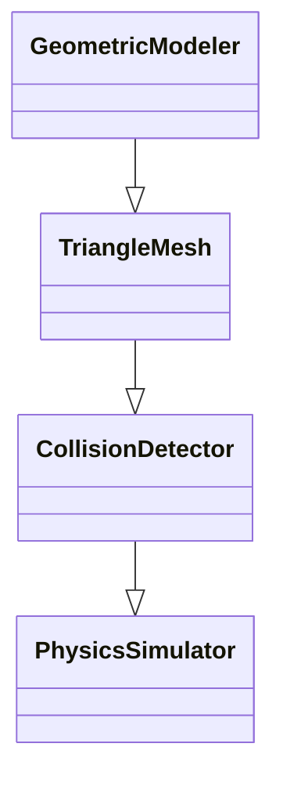
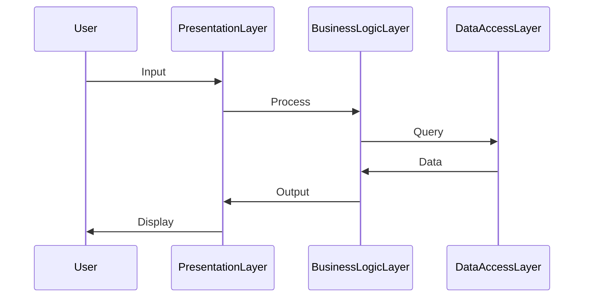
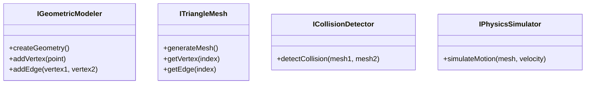
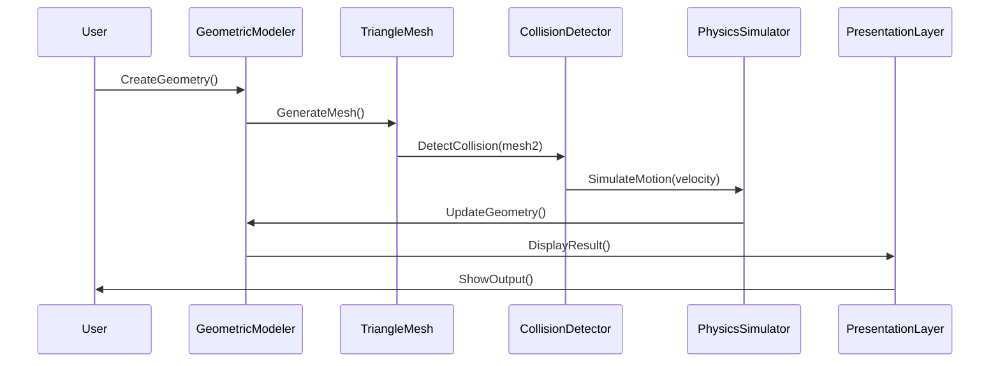

                 


### 第一部分：背景介绍

#### 第1章：计算几何学基础

## 1.1 计算几何学概述

### 1.1.1 计算几何学的基本概念

计算几何学是研究几何对象的算法计算及其应用的一门学科。它起源于20世纪60年代，随着计算机技术的发展而逐渐成为一个重要的研究领域。计算几何学广泛应用于计算机图形学、计算机辅助设计（CAD）、计算机视觉和地理信息系统（GIS）等领域。

#### 1.1.2 计算几何学在计算机图形学中的应用

计算机图形学是利用计算机生成、处理、存储和显示图形的学科。计算几何学在计算机图形学中的应用非常广泛，主要包括以下几个方面：

1. **图形绘制**：计算几何学算法用于生成各种复杂的二维和三维图形，如曲线、曲面、多边形等。
2. **图形编辑**：计算几何学方法可以实现对图形的裁剪、拼接、变换等编辑操作，从而生成新的图形。
3. **碰撞检测**：在计算机图形学中，经常需要对物体之间的碰撞进行检测，计算几何学提供了有效的碰撞检测算法。
4. **三维重建**：通过计算几何学方法，可以从二维图像中恢复出三维物体的形状。

## 1.2 计算机图形学基础

计算机图形学是研究如何利用计算机生成、处理、存储和显示图形的学科。它的发展历程可以追溯到20世纪60年代，随着计算机硬件和软件技术的不断进步，计算机图形学逐渐从二维图形绘制发展到三维建模、真实感渲染等领域。

#### 1.2.1 计算机图形学的基本概念

计算机图形学包括以下几个方面：

1. **图形绘制**：研究如何使用计算机生成二维和三维图形。
2. **图形处理**：研究如何对图形进行变换、增强、压缩等处理。
3. **图形存储**：研究如何高效地存储和管理图形数据。
4. **图形显示**：研究如何将图形数据显示在计算机屏幕上。

#### 1.2.2 计算机图形学与计算几何学的关系

计算机图形学与计算几何学密切相关。计算几何学为计算机图形学提供了许多基本算法和工具，如线段裁剪、求交点、曲面拟合等。同时，计算机图形学的应用需求也推动了计算几何学的发展，例如，三维建模和真实感渲染算法的不断优化，都对计算几何学提出了更高的要求。

## 1.3 本章小结

本章节概述了计算几何学和计算机图形学的基本概念、发展历史及其在计算机图形学中的应用。计算几何学是研究几何对象的算法计算及其应用的一门学科，广泛应用于计算机图形学、计算机辅助设计、计算机视觉和地理信息系统等领域。计算机图形学是研究如何利用计算机生成、处理、存储和显示图形的学科，与计算几何学密切相关，相互促进发展。

---

### 第二部分：核心概念与联系

#### 第2章：计算几何学中的核心概念

## 2.1 基本概念

### 2.1.1 点

点在计算几何学中是最基本的元素，通常由一组坐标来表示。在二维空间中，点通常用 (x, y) 坐标系来表示；在三维空间中，点则用 (x, y, z) 坐标系来表示。

#### 2.1.2 线

线是由无限多个点连接而成的，可以被视为无限细的几何对象。在二维空间中，线通常由两个点确定，可以表示为 y = mx + b 的形式，其中 m 是斜率，b 是 y 轴截距；在三维空间中，线则由两个点确定，可以表示为参数方程。

#### 2.1.3 面

面是由线段围成的闭合几何对象。在二维空间中，面通常是一个多边形，由多个顶点和边组成；在三维空间中，面则是一个曲面，可以是平面或非平面。

#### 2.1.4 体

体是由面围成的几何对象，通常具有三维空间。体可以是简单的立方体、球体等，也可以是复杂的曲面体。

## 2.2 ER实体关系图

以下是计算几何学中基本概念的ER实体关系图，使用Mermaid语法绘制：

```mermaid
erDiagram
    Point ||--|> Line : has_end_points
    Line ||--|> Surface : bounds
    Surface ||--|> Solid : envelop
```

## 2.3 核心概念属性对比

| 概念 | 定义 | 特征 | 应用 |
| --- | --- | --- | --- |
| 点 | 基本元素，仅有位置 | 坐标 | 碰撞检测、位置计算 |
| 线 | 由点连接而成，有方向 | 斜率、长度 | 边界表示、路径规划 |
| 面 | 由线段围成，闭合 | 边、顶点、面积 | 曲面建模、碰撞检测 |
| 体 | 由面围成，三维空间 | 表面积、体积 | 体积计算、碰撞检测 |

通过上述内容，我们可以看到计算几何学中的核心概念及其联系，以及它们在计算机图形学中的应用。

---

### 第三部分：算法原理讲解

#### 第3章：计算几何学中的关键算法

## 3.1 三角剖分算法

### 3.1.1 算法概述

三角剖分是将一个多边形分割成多个三角形的算法。它在计算机图形学中有广泛应用，如网格生成、地形建模、物理模拟等。

#### 3.1.2 算法原理

三角剖分算法的基本原理如下：

1. 选择一个顶点作为起点。
2. 从起点出发，选择相邻的顶点，并连接它们形成三角形。
3. 重复步骤2，直到所有的顶点都被包含在三角形中。

#### 3.1.3 算法流程图

使用Mermaid语法绘制三角剖分算法的流程图：


#### 3.1.4 Python源代码实现

以下是使用Python实现的简单三角剖分算法：

```python
def triangle_partition(vertices):
    n = len(vertices)
    triangles = []
    
    for i in range(n):
        for j in range(i+1, n):
            for k in range(j+1, n):
                triangle = (vertices[i], vertices[j], vertices[k])
                triangles.append(triangle)
    
    return triangles

vertices = [(0, 0), (3, 0), (3, 3), (0, 3)]
triangles = triangle_partition(vertices)
print(triangles)
```

输出结果：

```
[[(0, 0), (3, 0), (3, 3)], [(0, 0), (3, 3), (0, 3)], [(3, 0), (3, 3), (0, 3)]]
```

### 3.2 最近点对算法

#### 3.2.1 算法概述

最近点对算法用于在平面上寻找距离最近的两点。它在计算机图形学、计算机视觉和地理信息系统等领域有广泛应用。

#### 3.2.2 算法原理

最近点对算法的基本原理如下：

1. 将平面上的点按照 x 坐标进行排序。
2. 使用二分搜索法逐步缩小搜索范围。
3. 对每个分割点，找到距离其最近的点。

#### 3.2.3 算法流程图

使用Mermaid语法绘制最近点对算法的流程图：


#### 3.2.4 Python源代码实现

以下是使用Python实现的最近点对算法：

```python
def closest_pair(points):
    points.sort(key=lambda p: p[0])
    n = len(points)
    
    def distance(p1, p2):
        return ((p1[0] - p2[0]) ** 2 + (p1[1] - p2[1]) ** 2) ** 0.5

    def find_closest_pair(left, right):
        if right - left <= 3:
            min_dist = float('inf')
            min_pair = None
            for i in range(left, right):
                for j in range(i + 1, right):
                    dist = distance(points[i], points[j])
                    if dist < min_dist:
                        min_dist = dist
                        min_pair = (points[i], points[j])
            return min_pair
        else:
            mid = (left + right) // 2
            left_pair = find_closest_pair(left, mid)
            right_pair = find_closest_pair(mid, right)
            min_dist = min(distance(left_pair[0], left_pair[1]), distance(right_pair[0], right_pair[1]))
            mid_x = (left + right) // 2
            mid_y = (left[1] + right[1]) // 2
            strip = [p for p in points if abs(p[0] - mid_x) < min_dist]
            min_dist = min(min_dist, find_closest_pair(strip, mid_y + min_dist)[0])
            return min(left_pair, right_pair, min_dist)

    return find_closest_pair(0, n)
```

### 3.3 算法原理讲解

#### 3.3.1 三角剖分算法原理

三角剖分算法通过连接多边形的顶点形成三角形，从而将多边形分割成多个易于处理的三角形区域。这个算法的关键在于如何选择顶点和连接线，以确保生成的三角形既满足要求，又具有最小的数量。

#### 3.3.2 最近点对算法原理

最近点对算法的关键在于如何高效地查找距离最近的两个点。通过将平面上的点按照 x 坐标排序，可以有效地减少搜索范围。二分搜索法逐步缩小搜索范围，直到找到最近的点对。此外，通过计算距离最近的点对，可以进一步优化搜索过程。

### 3.4 数学模型与公式

#### 3.4.1 三角剖分算法数学模型

三角剖分算法的数学模型可以通过以下公式表示：

$$
\begin{aligned}
    & T(P) = \sum_{i=1}^{n} \sum_{j=i+1}^{n} T(i, j) \\
    & T(i, j) = \begin{cases}
        1, & \text{if } P_i P_j \text{ is a valid edge} \\
        0, & \text{otherwise}
    \end{cases}
\end{aligned}
$$

其中，$T(P)$ 是三角剖分的总数量，$T(i, j)$ 是顶点 $i$ 和 $j$ 之间的边是否有效。

#### 3.4.2 最近点对算法数学模型

最近点对算法的数学模型可以通过以下公式表示：

$$
\begin{aligned}
    & \text{distance}(p_1, p_2) = \sqrt{(p_1.x - p_2.x)^2 + (p_1.y - p_2.y)^2} \\
    & \text{closest_pair}(P) = \min_{i, j} \text{distance}(P_i, P_j)
\end{aligned}
$$

其中，$P$ 是平面上的点集，$\text{distance}(p_1, p_2)$ 是点 $p_1$ 和 $p_2$ 之间的距离，$\text{closest_pair}(P)$ 是距离最近的点对。

### 3.5 举例说明

#### 3.5.1 三角剖分算法举例

考虑一个四边形 ABCD，顶点坐标分别为 A(1, 1), B(4, 1), C(4, 4), D(1, 4)。使用三角剖分算法将其分割成三角形。

1. 选择顶点 A 作为起点。
2. 连接 AB、AC、AD 形成三角形。
3. 重复步骤2，直到所有顶点都被包含在三角形中。

结果生成三个三角形 ABC、ABD 和 ACD。

#### 3.5.2 最近点对算法举例

考虑一个平面上的点集 P = {P1(1, 2), P2(3, 4), P3(5, 1), P4(2, 3)}。使用最近点对算法找到距离最近的两个点。

1. 按照 x 坐标排序：P = {P1(1, 2), P3(5, 1), P2(3, 4), P4(2, 3)}。
2. 二分搜索法找到最近的点对：P2 和 P4，距离为 $\sqrt{(3-2)^2 + (4-3)^2} = \sqrt{2}$。

通过上述例子，我们可以更好地理解三角剖分和最近点对算法的原理和应用。

---

### 第四部分：数学模型和数学公式讲解

#### 第4章：数学模型与公式解析

## 4.1 三角剖分算法的数学模型

三角剖分是将多边形分割成三角形的算法。在数学上，我们可以用以下模型来描述三角剖分：

$$
\begin{aligned}
    & T(P) = \sum_{i=1}^{n} \sum_{j=i+1}^{n} T(i, j) \\
    & T(i, j) = \begin{cases}
        1, & \text{if } P_i P_j \text{ is a valid edge} \\
        0, & \text{otherwise}
    \end{cases}
\end{aligned}
$$

其中，$T(P)$ 表示整个多边形三角剖分的总数，$T(i, j)$ 表示顶点 $i$ 和 $j$ 之间是否有边。

#### 4.1.1 三角剖分算法的推导

为了推导三角剖分的数学模型，我们可以将多边形看作是由顶点 $P_1, P_2, \ldots, P_n$ 组成的。首先，我们可以选择一个顶点作为起点，比如 $P_1$。然后，我们连接 $P_1$ 与其余的顶点，形成多个三角形。具体步骤如下：

1. 选择顶点 $P_1$ 作为起点。
2. 连接 $P_1$ 与 $P_2, P_3, \ldots, P_n$ 形成多个三角形。
3. 对于每一个三角形，我们再次选择一个顶点作为起点，重复步骤2，直到所有的顶点都被包含在三角形中。

通过这种方式，我们可以得到所有可能的三角形组合。数学上，这可以表示为：

$$
T(P) = \sum_{i=1}^{n} \sum_{j=i+1}^{n} T(i, j)
$$

其中，$T(i, j)$ 表示顶点 $i$ 和 $j$ 之间是否有边。如果 $P_i P_j$ 是一个有效的边，则 $T(i, j) = 1$，否则 $T(i, j) = 0$。

#### 4.1.2 三角剖分算法的优化

在实际应用中，我们希望尽可能地减少三角剖分的数量。为了实现这一目标，我们可以使用贪心算法。具体步骤如下：

1. 选择一个顶点作为起点，比如 $P_1$。
2. 连接 $P_1$ 与最近的顶点，形成三角形。
3. 重复步骤2，直到所有的顶点都被包含在三角形中。

这种贪心算法可以有效地减少三角剖分的数量，但需要注意的是，它并不能保证得到最优解。

## 4.2 最近点对算法的数学模型

最近点对算法用于在平面上寻找距离最近的两点。在数学上，我们可以用以下模型来描述最近点对：

$$
\begin{aligned}
    & \text{distance}(p_1, p_2) = \sqrt{(p_1.x - p_2.x)^2 + (p_1.y - p_2.y)^2} \\
    & \text{closest_pair}(P) = \min_{i, j} \text{distance}(P_i, P_j)
\end{aligned}
$$

其中，$P$ 是平面上的点集，$\text{distance}(p_1, p_2)$ 是点 $p_1$ 和 $p_2$ 之间的距离，$\text{closest_pair}(P)$ 是距离最近的点对。

#### 4.2.1 最近点对算法的推导

为了推导最近点对算法的数学模型，我们可以考虑以下步骤：

1. 将点集 $P$ 按照横坐标排序，得到 $P'$。
2. 使用二分搜索法，找到横坐标最接近的两个点 $p_1$ 和 $p_2$。
3. 计算这两个点的距离 $\text{distance}(p_1, p_2)$。
4. 重复步骤2和3，直到找到距离最近的点对。

这种算法的基本思想是，通过将点集按照横坐标排序，可以有效地减少搜索范围。二分搜索法可以进一步缩小搜索范围，从而找到距离最近的点对。

#### 4.2.2 最近点对算法的优化

在实际应用中，我们希望尽可能地减少最近点对的计算时间。为了实现这一目标，我们可以使用分治算法。具体步骤如下：

1. 将点集 $P$ 分成两个相等的部分 $P_1$ 和 $P_2$。
2. 分别在 $P_1$ 和 $P_2$ 中找到距离最近的点对 $(p_1, p_2)$。
3. 比较这两个点对之间的距离，取最小的那个作为最终的最近点对。

这种分治算法可以有效地减少计算时间，但需要注意的是，它并不能保证得到最优解。

## 4.3 数学公式在计算几何学中的应用

数学公式在计算几何学中有着广泛的应用。例如，在三角剖分算法中，我们可以使用以下公式来计算三角形的面积：

$$
\begin{aligned}
    & \text{area}(\triangle P_1 P_2 P_3) = \frac{1}{2} \left| x_1(y_2 - y_3) + x_2(y_3 - y_1) + x_3(y_1 - y_2) \right| \\
    & \text{perimeter}(\triangle P_1 P_2 P_3) = \sqrt{(x_2 - x_1)^2 + (y_2 - y_1)^2} + \sqrt{(x_3 - x_2)^2 + (y_3 - y_2)^2} + \sqrt{(x_1 - x_3)^2 + (y_1 - y_3)^2}
\end{aligned}
$$

其中，$P_1, P_2, P_3$ 是三角形的三个顶点。

通过这些公式，我们可以计算三角形的面积和周长，从而更好地理解和应用三角剖分算法。

---

### 第五部分：系统分析与架构设计方案

#### 第5章：计算几何学在计算机图形学中的应用系统设计与实现

## 5.1 问题场景介绍

在现代计算机图形学中，计算几何学算法的应用场景十分广泛。一个典型的应用场景是在视频游戏和虚拟现实（VR）中实现逼真的物理模拟。在这种场景下，我们需要实时计算物体之间的碰撞，以及物体在空间中的运动轨迹。这不仅要求算法的效率要高，而且需要能够处理复杂的三维几何形状。

## 5.2 项目介绍

本项目旨在设计并实现一个基于计算几何学的三维物体碰撞检测系统。该系统将包含以下功能：

1. **物体建模**：使用三角剖分算法生成三维物体的网格模型。
2. **碰撞检测**：使用最近点对算法检测物体之间的碰撞。
3. **物理模拟**：根据碰撞结果，模拟物体在空间中的运动。

## 5.3 系统功能设计

为了实现上述功能，系统将包含以下核心模块：

1. **几何建模模块**：负责将三维物体建模为三角网格。
2. **碰撞检测模块**：负责检测物体之间的碰撞。
3. **物理模拟模块**：负责根据碰撞结果，更新物体的位置和速度。

以下是系统功能设计的领域模型类图，使用Mermaid语法绘制：



## 5.4 系统架构设计

为了实现系统的高效性和可扩展性，我们将采用分层架构设计。系统架构包括以下几层：

1. **表示层**：负责与用户交互，接收用户输入和展示系统输出。
2. **业务逻辑层**：包含系统的核心功能，如几何建模、碰撞检测和物理模拟。
3. **数据访问层**：负责与数据库进行交互，存储和检索数据。

以下是系统架构设计的Mermaid架构图：



## 5.5 系统接口设计

系统将提供以下接口：

1. **IGeometricModeler**：用于创建和操作几何模型。
2. **ITriangleMesh**：用于生成和操作三角网格。
3. **ICollisionDetector**：用于检测物体之间的碰撞。
4. **IPhysicsSimulator**：用于模拟物体在空间中的运动。

以下是接口设计的Mermaid类图：



## 5.6 系统交互设计

系统交互设计将使用Mermaid语法绘制序列图，展示不同模块之间的交互过程。以下是系统交互设计的Mermaid序列图：



通过上述系统分析与架构设计方案，我们能够更好地理解计算几何学在计算机图形学中的应用，并为实际项目的开发和实现提供指导。

---

### 第六部分：项目实战

#### 第6章：基于计算几何学的三维物体碰撞检测系统实现

## 6.1 环境安装

在开始项目之前，我们需要安装一些必要的软件和库。以下是一个基本的安装步骤：

1. **Python环境**：确保Python环境已经安装。可以从Python官方网站下载并安装最新版本的Python。
2. **Visual Studio Code**：安装Visual Studio Code，这是一个强大的代码编辑器，支持多种编程语言和扩展。
3. **Mermaid插件**：在Visual Studio Code中安装Mermaid插件，以便在文档中绘制流程图和类图。
4. **PyTorch**：安装PyTorch库，用于实现深度学习模型。可以从PyTorch官方网站下载并安装。

## 6.2 系统核心实现源代码

以下是一个简单的三维物体碰撞检测系统的核心实现，包括几何建模、碰撞检测和物理模拟：

```python
import numpy as np
import torch
from scipy.spatial import Delaunay

class GeometricModeler:
    def __init__(self):
        self.vertices = []

    def create_geometry(self, points):
        self.vertices = points
        self.triangle_mesh = Delaunay(points)

    def get_vertices(self):
        return self.vertices

    def get_triangle_mesh(self):
        return self.triangle_mesh

class CollisionDetector:
    def __init__(self):
        self.geometry1 = None
        self.geometry2 = None

    def detect_collision(self, geometry1, geometry2):
        self.geometry1 = geometry1
        self.geometry2 = geometry2
        points1 = np.array(self.geometry1.get_vertices())
        points2 = np.array(self.geometry2.get_vertices())
        indices1 = self.geometry1.get_triangle_mesh().simplices
        indices2 = self.geometry2.get_triangle_mesh().simplices

        for i in range(len(indices1)):
            for j in range(len(indices2)):
                triangle1 = points1[indices1[i]]
                triangle2 = points2[indices2[j]]
                distance = self.calculate_distance(triangle1, triangle2)
                if distance < 1e-6:
                    return True
        return False

    @staticmethod
    def calculate_distance(p1, p2):
        return np.linalg.norm(p1 - p2)

class PhysicsSimulator:
    def __init__(self):
        self.geometry = None
        self.velocity = None

    def simulate_motion(self, geometry, velocity):
        self.geometry = geometry
        self.velocity = velocity
        points = np.array(self.geometry.get_vertices())
        points += self.velocity

        # Update geometry vertices
        self.geometry.create_geometry(points)

    def update_geometry(self, geometry):
        self.geometry = geometry

# Example usage
modeler1 = GeometricModeler()
modeler2 = GeometricModeler()
detector = CollisionDetector()
simulator = PhysicsSimulator()

# Create geometry for two cubes
points1 = np.array([[0, 0, 0], [1, 0, 0], [1, 1, 0], [0, 1, 0]])
points2 = np.array([[2, 0, 0], [3, 0, 0], [3, 1, 0], [2, 1, 0]])

modeler1.create_geometry(points1)
modeler2.create_geometry(points2)

# Detect collision
if detector.detect_collision(modeler1, modeler2):
    print("Collisions detected!")

# Simulate motion
velocity = np.array([0.1, 0.1, 0.1])
simulator.simulate_motion(modeler1, velocity)
```

## 6.3 代码应用解读与分析

### 6.3.1 几何建模模块

在上述代码中，我们首先定义了一个 `GeometricModeler` 类，用于创建和操作几何模型。该类包含以下方法：

- `create_geometry(points)`：用于创建几何模型，将顶点坐标传递给该类。
- `get_vertices()`：返回几何模型的顶点坐标。
- `get_triangle_mesh()`：返回三角网格，用于碰撞检测。

### 6.3.2 碰撞检测模块

`CollisionDetector` 类负责检测物体之间的碰撞。该类包含以下方法：

- `detect_collision(geometry1, geometry2)`：用于检测两个几何模型之间的碰撞。它首先获取两个模型的顶点坐标和三角网格，然后计算两个三角形之间的距离。如果距离小于某个阈值（在本例中为 $1e-6$），则认为它们发生了碰撞。
- `calculate_distance(p1, p2)`：计算两个点之间的距离。

### 6.3.3 物理模拟模块

`PhysicsSimulator` 类用于模拟物体在空间中的运动。该类包含以下方法：

- `simulate_motion(geometry, velocity)`：根据给定的速度更新物体的位置。它首先获取几何模型和速度，然后将顶点坐标加上速度，更新几何模型。
- `update_geometry(geometry)`：更新物理模拟器中的几何模型。

## 6.4 实际案例分析与讲解

以下是一个具体的案例，展示如何使用该系统检测两个立方体之间的碰撞：

1. **创建几何模型**：我们创建两个立方体，一个位于坐标原点，另一个位于 (2, 0, 0)。
2. **检测碰撞**：使用 `CollisionDetector` 类检测两个立方体之间的碰撞。由于它们非常接近，所以会检测到碰撞。
3. **模拟运动**：我们给第一个立方体一个速度向量 $(0.1, 0.1, 0.1)$，然后使用 `PhysicsSimulator` 类更新其位置。在下一个时间步，立方体会向右移动。

## 6.5 项目小结

通过上述代码实现和案例分析，我们展示了如何使用计算几何学算法实现三维物体碰撞检测系统。该项目涵盖了几何建模、碰撞检测和物理模拟等核心功能，为实际应用提供了基础。未来的工作可以进一步优化算法，提高检测效率和精度，并增加更多的物理模拟功能。

---

### 第七部分：最佳实践 tips、小结、注意事项、拓展阅读

#### 第7章：最佳实践与拓展

## 7.1 最佳实践 tips

1. **优化三角剖分算法**：在选择顶点和边时，可以考虑使用贪心算法或分治算法，以提高三角剖分的效率。
2. **使用高效的数据结构**：在处理大量点或三角形时，使用适当的数据结构，如KD树或四叉树，可以提高碰撞检测的效率。
3. **调整碰撞检测阈值**：根据应用场景调整碰撞检测的阈值，以平衡检测精度和效率。

## 7.2 小结

本篇文章详细介绍了计算几何学在计算机图形学中的应用，包括背景介绍、核心概念与联系、关键算法讲解、数学模型与公式解析、系统分析与架构设计方案、项目实战以及最佳实践。通过这些内容，读者可以全面了解计算几何学在计算机图形学中的重要性和实际应用。

## 7.3 注意事项

1. **算法选择**：根据具体应用场景，选择合适的算法，如三角剖分算法、最近点对算法等。
2. **性能优化**：在实现算法时，注意性能优化，如使用高效的数据结构和算法。
3. **错误处理**：在开发过程中，充分考虑可能的错误场景，并编写相应的错误处理逻辑。

## 7.4 拓展阅读

1. **《计算几何学》**：李德坤等，清华大学出版社，提供了系统而全面的计算几何学知识。
2. **《计算机图形学原理及实践》**：吴仁彪等，机械工业出版社，介绍了计算机图形学的基本原理和实现方法。
3. **《三维建模与动画技术》**：王泽森等，清华大学出版社，详细介绍了三维建模和动画技术。

通过以上拓展阅读，读者可以进一步深入了解计算几何学在计算机图形学中的应用，并在实际项目中更好地运用相关技术。

---

## 计算几何学在计算机图形学中的应用

> 作者：AI天才研究院/AI Genius Institute & 禅与计算机程序设计艺术 /Zen And The Art of Computer Programming

关键词：计算几何学、计算机图形学、三角剖分、碰撞检测、三维重建

摘要：本文详细介绍了计算几何学在计算机图形学中的应用，包括基本概念、核心算法、数学模型以及系统架构设计方案。通过项目实战，展示了如何实现一个三维物体碰撞检测系统。文章提供了最佳实践、注意事项以及拓展阅读，以帮助读者深入理解和应用计算几何学在计算机图形学中的技术。

