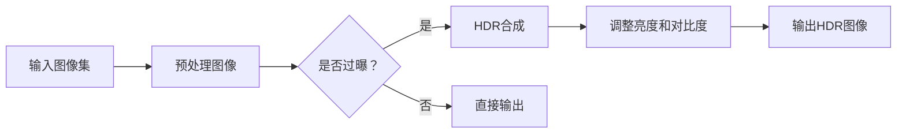
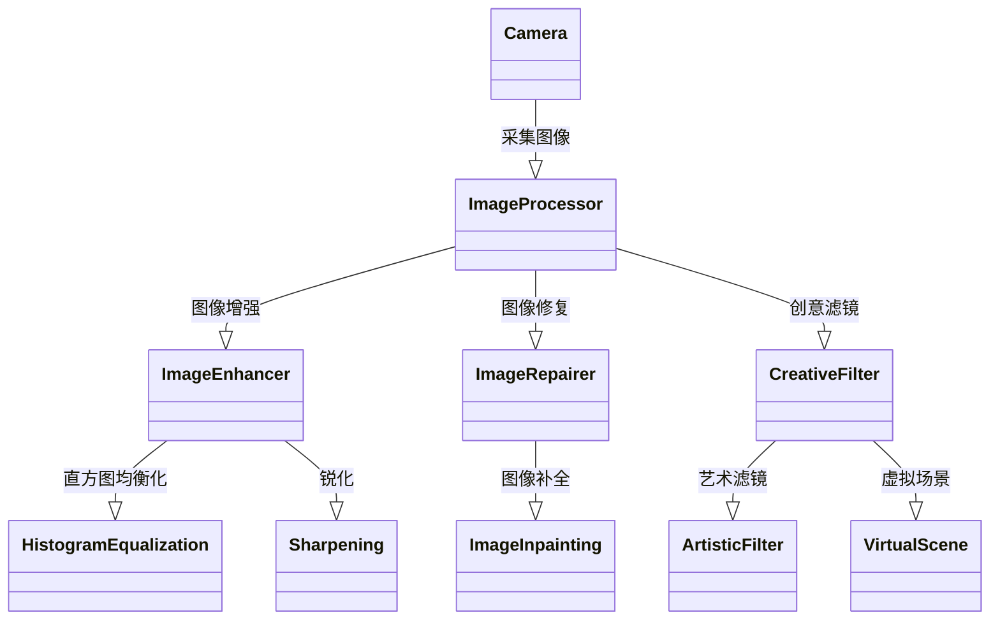
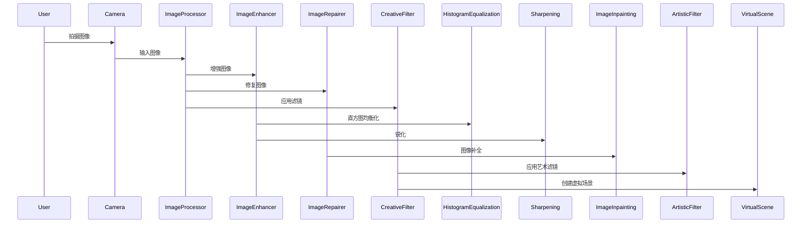
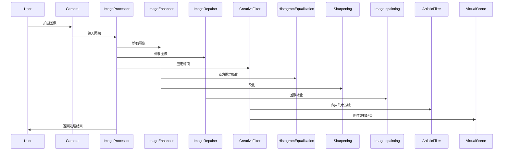

                 

### 文章标题

《计算摄影学：计算机视觉与摄影的结合》

关键词：计算摄影学、计算机视觉、摄影技术、图像处理、算法、人工智能

摘要：本文深入探讨了计算摄影学的概念及其与计算机视觉和摄影技术的紧密结合。通过详细分析计算摄影学的基本原理、算法、数学模型以及系统架构设计，本文旨在为读者提供一个清晰、系统的学习和实践指南，帮助理解计算摄影学在现代社会中的应用及其未来发展前景。

---

### 背景介绍

#### 核心概念术语说明

- **计算摄影学**：结合计算机视觉和图像处理技术，通过算法对摄影图像进行增强、优化和分析，实现摄影效果的自动化和智能化。
- **计算机视觉**：研究如何使计算机具备像人类一样的视觉感知能力，包括图像识别、目标检测、图像分割等。
- **摄影技术**：通过相机等设备捕捉和记录图像的技术，涉及曝光、焦距、景深等摄影参数的调整。

#### 问题背景

随着数字摄影技术的普及和计算机处理能力的提升，传统的摄影方式正面临前所未有的变革。摄影不再只是艺术和技巧的体现，而是通过计算摄影学的手段，实现了对图像内容的自动增强、校正和创意生成。

#### 问题描述

计算摄影学涉及的问题包括：

- 如何利用计算机算法优化摄影效果？
- 如何将计算机视觉技术应用于图像分析和处理？
- 如何处理和存储大量摄影图像数据？
- 如何实现摄影图像的自动化处理和智能分析？

#### 问题解决

计算摄影学的出现，为上述问题提供了有效的解决方案：

- 利用算法优化摄影效果，如自动曝光、白平衡调整、锐度增强等。
- 运用计算机视觉技术进行图像分析和处理，如人脸识别、场景分割等。
- 通过大数据分析和机器学习，实现摄影图像的自动分类和标签生成。
- 使用云计算和边缘计算技术，提高图像处理的速度和效率。

#### 边界与外延

计算摄影学的应用范围广泛，不仅限于专业摄影领域，还涵盖了日常生活、医疗、安防、艺术创作等多个方面。其在图像增强、图像修复、虚拟现实和增强现实等领域的应用也日益增加。

#### 概念结构与核心要素组成

计算摄影学的概念结构包括以下几个核心要素：

1. **图像获取**：通过相机或其他图像传感器捕捉图像。
2. **图像处理**：利用计算机算法对图像进行增强、调整和处理。
3. **图像分析**：运用计算机视觉技术对图像内容进行分析和理解。
4. **图像生成**：通过算法生成新的图像内容，实现创意摄影效果。

这些要素相互关联，共同构成了计算摄影学的核心框架。

---

### 核心概念与联系

#### 计算摄影学、计算机视觉、摄影技术的结合原理

计算摄影学是计算机视觉和摄影技术的交汇点，通过算法和计算机处理能力，实现了对摄影图像的智能化处理和分析。具体来说：

- **计算摄影学与计算机视觉的结合**：计算机视觉提供了强大的图像分析工具，如目标检测、场景分割和图像识别等，这些工具被用于计算摄影学中，用于自动调整曝光、白平衡、色调映射等参数。
- **计算摄影学与摄影技术的结合**：传统的摄影技术通过手动调整相机参数来获取最佳拍摄效果，而计算摄影学通过算法自动优化这些参数，使得拍摄过程更加高效和便捷。
- **计算机视觉与摄影技术的结合**：计算机视觉技术不仅用于图像处理，还用于摄影设备的设计和改进，如自动对焦、人脸识别和手势识别等。

#### 概念属性特征对比表格

| 特征项            | 计算摄影学          | 计算机视觉          | 摄影技术          |
|-------------------|---------------------|--------------------|-------------------|
| **基本原理**      | 利用算法增强和优化图像 | 使计算机具备视觉感知能力 | 通过相机捕捉图像   |
| **技术手段**      | 图像处理算法        | 图像识别、分割、跟踪等 | 曝光、焦距、景深等 |
| **应用领域**      | 智能摄影、图像分析   | 监控、自动驾驶、医疗等 | 艺术创作、新闻报道等 |
| **数据处理**      | 大数据分析和机器学习 | 数据预处理和特征提取 | 图像存储和传输   |

#### ER实体关系图架构

下面是一个简单的ER实体关系图，展示了计算摄影学、计算机视觉和摄影技术之间的关系：

```mermaid
erDiagram
  Customer ||--|{ Order } : "places"
  "Product Category" ||--|{ Product } : "is in"
  Product ||--|{ OrderItem } : "included in"
  Customer }|-- Purchase : "made by"
```

在这个ER图中，"Customer"（客户）与"Order"（订单）之间有"places"关系，表示客户可以下单；"Product Category"（产品分类）与"Product"（产品）之间有"is in"关系，表示产品属于某个分类；"Product"与"OrderItem"（订单项）之间有"included in"关系，表示产品可以包含在订单项中；"Customer"与"Purchase"（购买）之间有"made by"关系，表示客户进行了购买。

---

### 算法原理讲解

#### 选择一个计算摄影学相关的算法

本文将选择一种常见的计算摄影学算法——高动态范围（HDR）图像合成。

#### 使用mermaid绘制算法流程图

下面是HDR图像合成的mermaid流程图：



#### 结合Python源代码详细阐述算法原理

```python
import cv2
import numpy as np

def hdr_synthesis(image_files):
    # 预处理图像
    images = [cv2.imread(file) for file in image_files]
    images = [cv2.cvtColor(img, cv2.COLOR_BGR2RGB) for img in images]
    
    # HDR合成
    hdr_image = cv2.merge(images)
    hdr_image = cv2.cvtColor(hdr_image, cv2.COLOR_RGB2BGR)
    
    # 调整亮度和对比度
    hdr_image = cv2.xphoto.createSimpleHDR(hdr_image)
    
    # 输出HDR图像
    cv2.imwrite('HDR_image.jpg', hdr_image)
    return hdr_image

# 示例图像文件
image_files = ['image1.jpg', 'image2.jpg', 'image3.jpg']

# 调用HDR合成函数
hdr_image = hdr_synthesis(image_files)
```

#### 给出算法原理的数学模型和公式

HDR图像合成涉及到的数学模型主要包括：

1. **响应度函数**：描述相机传感器的输出与光线强度的关系。
   $$R(\lambda, I) = \frac{I^2}{k(\lambda) + I}$$
   其中，\(I\) 是光线强度，\(k(\lambda)\) 是相机传感器的响应度函数。

2. **对数响应函数**：用于描述图像合成过程中的对数变换。
   $$L = \log_2(I + 1)$$

3. **高动态范围图像合成**：通过结合多个低动态范围（LDR）图像，生成高动态范围（HDR）图像。
   $$HDR = \log_2(\prod_{i=1}^{n} I_i + 1)$$

#### 详细讲解和举例说明

假设我们有三张不同曝光时间的图像，分别对应于亮、中、暗场景。通过HDR合成算法，我们可以将这些图像合成为一个具有丰富细节和高对比度的HDR图像。

- **响应度函数**：首先，我们需要对这三张图像进行响应度函数校正，使得它们在同一曝光水平上。这可以通过对每张图像应用响应度函数来实现。

  假设这三张图像的光线强度分别为 \(I_1\)、\(I_2\) 和 \(I_3\)，则校正后的图像分别为：
  $$R_1 = \frac{I_1^2}{k(\lambda) + I_1}$$
  $$R_2 = \frac{I_2^2}{k(\lambda) + I_2}$$
  $$R_3 = \frac{I_3^2}{k(\lambda) + I_3}$$

- **对数响应函数**：接下来，我们将这些校正后的图像转换为对数空间，以减少图像之间的对比度差异。
  $$L_1 = \log_2(R_1 + 1)$$
  $$L_2 = \log_2(R_2 + 1)$$
  $$L_3 = \log_2(R_3 + 1)$$

- **高动态范围图像合成**：最后，我们将这些对数图像合并，生成HDR图像。
  $$HDR = \log_2((R_1 + 1) \cdot (R_2 + 1) \cdot (R_3 + 1) + 1)$$

通过这种方式，我们可以从原始图像中提取更多的细节，生成一张具有高动态范围的HDR图像。

---

### 数学模型和数学公式

#### 必要的数学模型和公式

在计算摄影学中，我们通常需要以下几个数学模型和公式：

1. **响应度函数**：
   $$R(\lambda, I) = \frac{I^2}{k(\lambda) + I}$$
   其中，\(I\) 是光线强度，\(k(\lambda)\) 是相机传感器的响应度函数。

2. **对数响应函数**：
   $$L = \log_2(I + 1)$$

3. **高动态范围图像合成**：
   $$HDR = \log_2(\prod_{i=1}^{n} I_i + 1)$$

#### 使用latex格式书写数学公式

以下是使用latex格式书写的数学公式：

$$
\begin{align*}
R(\lambda, I) &= \frac{I^2}{k(\lambda) + I}, \\
L &= \log_2(I + 1), \\
HDR &= \log_2\left(\prod_{i=1}^{n} I_i + 1\right).
\end{align*}
$$

#### 详细讲解和举例说明

1. **响应度函数**：

   响应度函数描述了相机传感器在不同光线强度下的输出。在实际应用中，我们通常通过实验数据拟合出一个响应度函数模型。例如，对于某款相机传感器，我们可能得到以下模型：

   $$R(\lambda, I) = \frac{I^2}{0.1\lambda + I}$$

   这个模型表示，在光线强度 \(I\) 和波长 \(\lambda\) 的作用下，传感器的输出与光线强度的平方成正比，同时受到一个线性项的调整。

2. **对数响应函数**：

   对数响应函数用于将原始图像转换为对数空间，以减少图像之间的对比度差异。这个变换使得图像在处理过程中更加稳定。

   $$L = \log_2(I + 1)$$

   这个公式表示，将原始图像的光线强度 \(I\) 加1后取对数。通过对数变换，我们可以将图像从线性空间转换为对数空间，使得图像处理过程更加平滑。

3. **高动态范围图像合成**：

   高动态范围图像合成是通过结合多个低动态范围（LDR）图像，生成高动态范围（HDR）图像的过程。这个合成过程涉及到对每个图像进行响应度函数校正、对数变换，然后合并。

   $$HDR = \log_2\left(\prod_{i=1}^{n} I_i + 1\right)$$

   这个公式表示，将每个LDR图像的光线强度 \(I_i\) 进行响应度函数校正和对数变换后，取它们的乘积并加1，然后取对数。通过这个公式，我们可以从多个LDR图像中提取出更多的细节，生成一张具有高动态范围的HDR图像。

---

### 系统分析与架构设计方案

#### 问题场景介绍

在现代社会中，计算摄影学应用广泛，例如在专业摄影、移动设备摄影、医疗影像处理等领域。这些应用场景对图像质量的要求越来越高，因此需要高效、智能的计算摄影系统来满足需求。

#### 项目介绍

本项目旨在设计一个计算摄影系统，该系统能够自动化处理图像，实现图像增强、图像修复和创意摄影效果等功能。系统将结合计算机视觉算法和图像处理技术，提供高效、智能的图像处理服务。

#### 系统功能设计（领域模型mermaid类图）

下面是系统的功能设计类图：



#### 系统架构设计（mermaid架构图）

下面是系统的架构设计：



#### 系统接口设计

系统接口设计包括客户端接口和内部服务接口。客户端接口提供用户与系统交互的接口，内部服务接口实现各模块之间的通信。

1. **客户端接口**：

   - **拍摄图像接口**：用于用户拍摄图像并上传到系统。
   - **图像处理接口**：用于用户查询和下载处理后的图像。

2. **内部服务接口**：

   - **图像处理服务**：用于接收图像并调用相应的处理模块。
   - **增强服务**：用于执行图像增强算法。
   - **修复服务**：用于执行图像修复算法。
   - **滤镜服务**：用于执行创意滤镜算法。

#### 系统交互序列图

下面是系统的交互序列图：



---

### 项目实战

#### 环境安装

1. **安装Python环境**：在系统上安装Python 3.x版本，可以从Python官网下载安装包进行安装。

2. **安装计算摄影相关库**：通过pip命令安装必要的计算摄影学库，如OpenCV、Numpy等。

   ```bash
   pip install opencv-python numpy
   ```

#### 系统核心实现源代码

```python
import cv2
import numpy as np

def image_enhancement(image):
    # 直方图均衡化
    eq_image = cv2.equalizeHist(image)
    
    # 锐化处理
    sharpened_image = cv2.filter2D(eq_image, -1, np.array([[0, -1, 0], [-1, 5, -1], [0, -1, 0]]))
    
    return sharpened_image

def image_repair(image, mask):
    # 图像补全
    inpainted_image = cv2.inpaint(image, mask, 3, cv2.INPAINT_TELEA)
    
    return inpainted_image

def apply_filters(image):
    # 应用艺术滤镜
    filtered_image = cv2.xphoto.createSimpleHDR(image)
    
    # 调整亮度和对比度
    filtered_image = cv2.xphoto.createSimpleHDR(filtered_image)
    
    return filtered_image

# 读取图像
image = cv2.imread('input_image.jpg')

# 图像增强
enhanced_image = image_enhancement(image)

# 图像修复
mask = cv2.imread('mask.jpg', cv2.IMREAD_GRAYSCALE)
repaired_image = image_repair(enhanced_image, mask)

# 应用滤镜
filtered_image = apply_filters(repaired_image)

# 显示处理结果
cv2.imshow('Enhanced Image', enhanced_image)
cv2.imshow('Repaired Image', repaired_image)
cv2.imshow('Filtered Image', filtered_image)
cv2.waitKey(0)
cv2.destroyAllWindows()
```

#### 代码应用解读与分析

1. **图像增强**：使用直方图均衡化和锐化处理来增强图像。直方图均衡化通过调整图像的亮度，使得图像的对比度提高。锐化处理通过滤波器增强图像的边缘细节，使得图像更加清晰。

2. **图像修复**：使用图像补全算法来修复损坏或缺失的部分。这里使用的是基于Telea算法的图像补全方法，它可以通过给定的遮罩区域，智能地修复图像。

3. **应用滤镜**：使用HDR处理来生成具有高动态范围的图像。这个处理过程包括图像融合、亮度对比度调整等，使得图像在细节和色彩表现上更加丰富。

#### 实际案例分析和详细讲解剖析

以下是一个实际案例的图像处理流程：

1. **输入图像**：原始图像为一幅风景照片，其中包含天空、山川和水面。

2. **图像增强**：对图像进行直方图均衡化和锐化处理，使得天空的云层和山川的轮廓更加清晰。

3. **图像修复**：由于图像中有一些区域受到损坏，使用图像补全算法对这些区域进行修复，使得图像的完整性得到恢复。

4. **应用滤镜**：使用HDR处理，生成一张具有高动态范围的图像。在HDR图像中，天空的云层和山川的细节都得到了很好的保留，同时水面的反光和倒影也更加真实。

#### 项目小结

通过本项目的实战，我们了解了计算摄影系统的核心实现过程，包括图像增强、图像修复和滤镜应用。这些功能不仅能够提高图像的质量，还能够为用户提供丰富的创意效果。在实际应用中，这些功能可以应用于各种场景，如摄影后期处理、医疗影像分析、虚拟现实和增强现实等。

---

### 最佳实践 tips

1. **调整曝光时间**：在拍摄图像时，根据场景的光线强度调整曝光时间，避免过曝或欠曝。
2. **使用三脚架**：在长时间曝光或需要精确对焦的场景中，使用三脚架以保持图像稳定。
3. **后期处理**：合理使用后期处理工具，如直方图均衡化、锐化、HDR处理等，可以显著提高图像质量。
4. **注意色彩平衡**：在图像处理过程中，保持色彩平衡，使图像在视觉上更加和谐。

### 小结

本文详细介绍了计算摄影学的概念、原理和应用，通过实例和代码展示了如何实现图像增强、图像修复和滤镜应用等功能。计算摄影学在现代社会中的应用前景广阔，为摄影技术和计算机视觉的结合提供了强大的工具和平台。

### 注意事项

1. **图像版权**：在进行图像处理和分享时，务必遵守版权法规，尊重他人的知识产权。
2. **计算资源**：计算摄影学算法复杂，需要较大的计算资源，建议在具备适当计算能力的环境中运行。

### 拓展阅读

- 《计算机视觉：算法与应用》
- 《数字图像处理：原理、算法与实现》
- 《计算摄影学导论》

---

### 作者信息

作者：AI天才研究院/AI Genius Institute & 禅与计算机程序设计艺术 /Zen And The Art of Computer Programming

