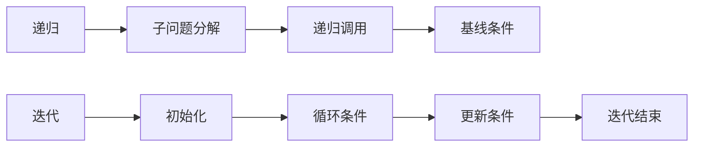
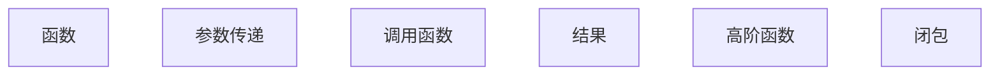
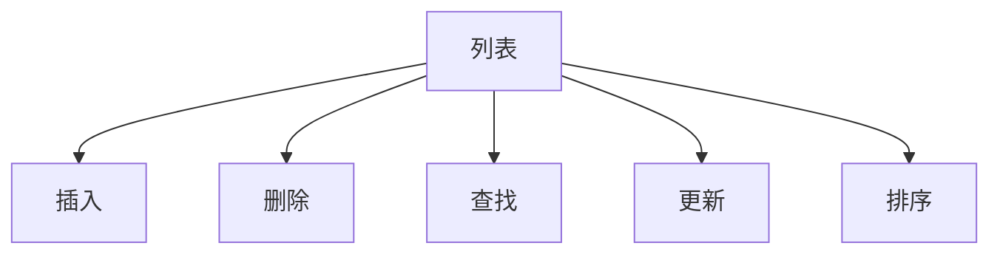
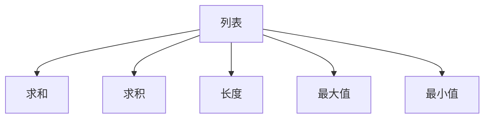

                 


# 计算机程序的构造与解释：SICP的经典智慧

## 关键词：计算机程序构造，SICP，递归，数据抽象，算法设计，并发编程

## 摘要：

本文旨在深入探讨《计算机程序的构造与解释：SICP的经典智慧》一书的核心内容。本书作为计算机科学领域的经典教材，系统地阐述了程序构造的基本原理和方法，涵盖了从基础到高级的程序设计技术。本文将分七个部分逐步分析，包括引言与概述、构造程序的基本元素、数据抽象与结构、高级程序构造技术、程序结构与算法、并发与分布式计算以及程序构造的高级主题。通过详细解读，读者将掌握计算机程序的构造方法，提升编程能力和系统设计水平。

## 引言与概述

### 第1章：计算机程序的构造与解释

计算机程序是计算机系统执行任务的核心。构造有效的程序不仅是计算机科学的重要研究内容，也是软件开发实践的基础。本书《计算机程序的构造与解释：SICP的经典智慧》系统地介绍了程序构造的方法和策略，为读者提供了深刻的理解和实用的技能。

#### 1.1 计算机程序的基本概念

计算机程序是由一系列指令组成的指令序列，用于完成特定任务。计算机程序的基本组成部分包括：

- **数据**：程序处理的信息。
- **算法**：解决问题的方法。
- **控制结构**：程序执行的逻辑流程。

#### 1.2 程序构造的重要性

程序构造的质量直接影响软件的性能、可靠性和可维护性。有效的程序构造可以简化复杂问题的求解，提高代码的可读性和可扩展性。

#### 1.3 SICP书籍介绍

《计算机程序的构造与解释：SICP的经典智慧》一书由哈工大计算机系教授唐杰等学者翻译，深入浅出地介绍了程序构造的核心原理。本书分为七个部分，系统地讲解了从基础到高级的程序设计技术。

### 第二部分：构造程序的基本元素

#### 第2章：函数与过程

函数与过程是程序构造的基本元素，用于组织代码和抽象复杂问题。

#### 2.1 函数的定义与特性

函数是一种将输入映射到输出的过程，具有以下特性：

- **确定性**：相同输入总是产生相同输出。
- **无状态性**：函数执行不依赖于外部环境。

#### 2.2 递归与迭代

递归和迭代是解决复杂问题的两种重要方法。递归通过函数调用自身来解决问题，而迭代通过循环逐步逼近解。

#### 2.3 函数作为参数与结果

函数作为参数和结果可以增强程序的可扩展性和灵活性。这种思想是函数式编程的核心。

### 第三部分：数据抽象与结构

#### 第3章：列表与递归

列表是程序设计中常用的数据结构，支持动态存储和多种操作。

#### 3.1 列表的定义与操作

列表是一种线性数据结构，支持以下基本操作：

- **插入**：在列表中添加元素。
- **删除**：从列表中移除元素。
- **查找**：在列表中查找特定元素。

#### 3.2 递归在列表处理中的应用

递归是处理列表数据结构的一种强大工具，适用于各种复杂操作，如排序、查找等。

#### 3.3 常见列表操作实现

本文将详细介绍常见列表操作（如插入、删除、查找等）的实现方法。

### 第四部分：高级程序构造技术

#### 第4章：闭包与高阶函数

闭包和高阶函数是程序设计的高级技术，提高了程序的可读性和可维护性。

#### 4.1 闭包的概念与实现

闭包是函数和其环境的一种组合，可以访问和修改环境变量。

#### 4.2 高阶函数的概念与应用

高阶函数是接受函数作为参数或返回函数的函数。它们在函数式编程和模块化设计中具有重要应用。

#### 4.3 高阶函数的实际应用

本文将举例说明高阶函数在实际编程中的应用，如排序、映射等。

### 第五部分：程序结构与算法

#### 第5章：算法设计与分析

算法是程序设计的核心，决定了程序的效率和正确性。

#### 5.1 算法设计的基本原则

算法设计需要遵循一些基本原则，如正确性、效率、简洁性等。

#### 5.2 算法复杂度分析

算法复杂度分析是评估算法性能的重要手段，包括时间复杂度和空间复杂度。

#### 5.3 常见算法分析实例

本文将分析一些常见算法（如排序、查找等）的复杂度和实现。

### 第六部分：并发与分布式计算

#### 第6章：并发编程基础

并发编程是现代计算机系统的重要特征，可以提高程序的性能和可扩展性。

#### 6.1 并发与并行

并发和并行是计算机系统中的两种基本操作方式，本文将介绍它们的区别和联系。

#### 6.2 线程与进程

线程和进程是并发编程的基本构建块，本文将详细讲解它们的创建、调度和管理。

#### 6.3 并发编程的挑战与解决方案

并发编程面临许多挑战，如数据竞争、死锁等。本文将介绍相应的解决方案。

### 第七部分：程序构造的高级主题

#### 第7章：程序构造的哲学思考

程序构造不仅是技术问题，也是哲学问题。本文将探讨程序构造的艺术和哲学意义。

#### 7.1 程序构造的艺术

程序构造需要创造力和灵感，本文将介绍一些程序构造的艺术方法。

#### 7.2 SICP的教育意义

SICP对计算机科学教育具有重要意义，本文将探讨其教育价值和启示。

#### 7.3 计算机科学的未来发展趋势

计算机科学不断发展，本文将展望其未来发展趋势。

### 附录

#### A.1 SICP课程学习资源

本文将提供SICP课程的学习资源，包括参考书目、在线教程等。

#### A.2 参考书目与扩展阅读

本文将列出一些参考书目和扩展阅读，供读者进一步学习。

#### A.3 问题解答与讨论

本文将回答读者在阅读过程中遇到的问题，并提供讨论平台。

---

通过以上内容，本文将深入探讨《计算机程序的构造与解释：SICP的经典智慧》的核心内容。希望读者能够通过本文的学习，提高程序构造的能力，为未来的计算机科学发展做出贡献。

---

接下来，我们将继续完善每一章节的内容，确保每个章节都涵盖了所需的核心内容，同时保持大纲的简洁性。请您继续关注后续章节的分析和讲解。## 第一部分：引言与概述

### 第1章：计算机程序的构造与解释

#### 1.1 计算机程序的基本概念

计算机程序是由一系列指令组成的指令序列，用于完成特定任务。计算机程序的基本组成部分包括数据、算法和控制结构。数据是程序处理的信息，算法是解决问题的方法，控制结构是程序执行的逻辑流程。

在计算机程序中，数据是基础，算法是核心，控制结构是手段。数据决定了程序处理的信息类型，算法决定了程序解决问题的能力，而控制结构则决定了程序执行的方式。因此，理解计算机程序的基本概念是进行程序构造的必要前提。

**核心概念术语说明：**

- **数据**：程序处理的信息，可以是数字、文本、图像等。
- **算法**：解决问题的方法，包括排序、查找、计算等。
- **控制结构**：程序执行的逻辑流程，包括顺序结构、选择结构和循环结构。

**问题背景：**

随着计算机技术的发展，计算机程序的应用越来越广泛，从简单的计算器到复杂的操作系统，从简单的网站到复杂的互联网应用，计算机程序无处不在。因此，如何有效地构造计算机程序，提高程序的效率、可靠性和可维护性，成为计算机科学领域的重要研究方向。

**问题描述：**

构造有效的计算机程序需要考虑多个方面，包括数据结构、算法设计、编程语言选择、程序组织等。如何系统地学习和掌握程序构造的方法，是计算机科学教育的重要问题。

**问题解决：**

《计算机程序的构造与解释：SICP的经典智慧》一书提供了系统的方法和策略，帮助读者深入理解程序构造的基本原理。本书通过理论讲解和实例分析，系统地介绍了程序构造的各个方面，包括基础元素、数据抽象、高级程序构造技术等。

**边界与外延：**

计算机程序的构造不仅限于软件开发的领域，还广泛应用于硬件设计、网络通信、人工智能等领域。因此，理解计算机程序的构造原理，对于不同领域的工程师和技术人员都具有重要意义。

**概念结构与核心要素组成：**

计算机程序的构造涉及多个核心概念和要素，包括：

1. **数据结构**：数据结构是程序处理数据的方式，包括数组、链表、树等。
2. **算法设计**：算法设计是解决问题的方法，包括排序、查找、计算等。
3. **编程语言**：编程语言是程序编写的方式，包括C、Java、Python等。
4. **程序组织**：程序组织是程序编写的结构，包括模块化、分层设计等。
5. **编程风格**：编程风格是程序编写的规范，包括代码注释、命名规范等。

通过以上分析，我们可以更好地理解计算机程序的基本概念和构造方法，为后续章节的学习打下坚实的基础。在接下来的章节中，我们将进一步探讨程序构造的基本元素、数据抽象与结构、高级程序构造技术等内容，帮助读者全面掌握计算机程序的构造与解释。

#### 1.2 程序构造的重要性

程序构造是计算机科学的核心内容之一，它不仅关乎软件开发的效率和质量，也直接影响计算机系统的性能和用户体验。理解程序构造的重要性，有助于我们更好地设计、实现和维护计算机程序。

首先，程序构造的质量直接决定软件的性能。一个高效、优化的程序可以显著提高系统的运行速度，减少资源消耗，提高用户满意度。相反，一个设计不合理、效率低下的程序会导致系统运行缓慢，甚至出现性能瓶颈，影响用户体验。

其次，程序构造影响软件的可靠性。合理的程序构造可以降低系统出错的可能性，提高软件的稳定性。通过严格的测试和调试，可以发现并修复程序中的错误，确保软件的可靠性和安全性。

此外，程序构造对软件的可维护性也有重要影响。良好的程序构造可以使代码更加清晰、简洁，便于理解和修改。这不仅有助于提高开发效率，还能降低后期维护成本。相反，糟糕的程序构造会使代码变得混乱、冗长，增加维护难度。

总之，程序构造的重要性体现在多个方面，包括性能、可靠性、可维护性等。理解并掌握程序构造的基本原理和方法，是成为一名优秀软件开发工程师的关键。在接下来的章节中，我们将深入探讨程序构造的具体方法和技巧，帮助读者提升编程能力，设计出更高效、可靠的计算机程序。

#### 1.3 SICP书籍介绍

《计算机程序的构造与解释：SICP的经典智慧》是计算机科学领域的一部经典教材，由麻省理工学院（MIT）教授HAL ABEL和J. STUART ALEXANDER合著。这本书被誉为计算机科学教育中的“圣经”，广泛用于全球高等院校的计算机科学课程。

SICP（Structure and Interpretation of Computer Programs）以其独特的视角和深入浅出的讲解，系统地介绍了程序构造的基本原理和方法。全书分为七个部分，涵盖从基础到高级的程序设计技术，包括函数与过程、数据抽象与结构、高级程序构造技术、程序结构与算法、并发与分布式计算等。

SICP的主要特点如下：

1. **函数式编程思想**：SICP强调函数式编程的重要性，通过函数和递归来组织代码，提高了程序的可读性和可维护性。
2. **理论结合实践**：SICP不仅介绍了程序构造的理论基础，还通过大量的实例和练习，帮助读者理解和掌握实际编程技巧。
3. **递归与递归树**：SICP深入探讨了递归在程序设计中的应用，通过递归树来解释递归过程，使读者能够更好地理解递归的本质。
4. **数据抽象与模块化**：SICP介绍了数据抽象和模块化的概念，通过抽象数据类型和模块化设计，提高了代码的可复用性和可扩展性。
5. **启发式学习方法**：SICP鼓励读者通过自主学习和实践来掌握程序构造的方法，提供了大量思考问题和编程练习，激发读者的思考能力和创造力。

总之，《计算机程序的构造与解释：SICP的经典智慧》是一部系统、全面、深入的计算机科学教材，不仅适合作为高等院校计算机科学课程教材，也适合广大编程爱好者自学。通过学习SICP，读者可以全面掌握程序构造的基本原理和方法，提高编程能力和系统设计水平。

### 总结与展望

本部分内容对计算机程序构造的基本概念进行了详细阐述，并介绍了《计算机程序的构造与解释：SICP的经典智慧》一书的重要性和特点。通过对程序构造的基本概念和SICP书籍的深入分析，读者可以初步了解程序构造的重要性和SICP书籍的体系结构。

在接下来的章节中，我们将进一步探讨程序构造的基本元素，包括函数与过程、数据结构、递归等，通过实例和分析，帮助读者深入理解程序构造的方法和技巧。同时，我们还将讨论高级程序构造技术，如闭包、高阶函数、算法设计与分析等，这些内容将进一步提升读者的编程能力和系统设计水平。

通过学习本部分内容，读者可以建立起对计算机程序构造的基本认识，为后续章节的学习打下坚实基础。希望读者能够带着好奇心和求知欲，继续深入探索计算机程序构造的奥秘。

---

在第一部分中，我们系统地介绍了计算机程序构造的基本概念、重要性以及SICP书籍的概述。通过对这些核心内容的分析，我们为读者提供了对计算机程序构造的全面了解，并激发了进一步学习的兴趣。

接下来，我们将进入第二部分，探讨构造程序的基本元素。这部分将重点介绍函数与过程、递归与迭代，以及函数作为参数与结果等概念，帮助读者深入理解程序构造的基本原理。

在第二部分的每个章节中，我们将详细分析这些概念的理论基础和应用实例，通过具体的代码和算法来展示如何有效地利用这些基本元素来编写程序。通过这部分的学习，读者将能够掌握构造程序的基本技能，为后续更复杂的技术分析打下坚实的基础。

让我们一起继续探索程序构造的深度和广度，逐步提升编程能力，为计算机科学的发展贡献智慧。

---

### 第二部分：构造程序的基本元素

#### 第2章：函数与过程

在计算机程序中，函数与过程是构建程序的核心元素。它们不仅能够提高代码的可读性和可维护性，还能够实现代码的重用和模块化。通过理解函数与过程的概念及其应用，我们可以更好地组织代码，编写高效、可靠的程序。

#### 2.1 函数的定义与特性

函数是一种将输入映射到输出的过程，是程序设计中的基本构造块。在多数编程语言中，函数通过定义在代码中的一系列指令来实现某种功能，并可以接受输入参数并返回输出结果。

**核心概念与联系**

- **函数的定义**：函数是一段完成特定任务的代码块，通过输入参数和返回值实现功能。
- **特性**：函数具有确定性、无状态性和可复用性。

| 特性        | 说明                                                     |
|-------------|----------------------------------------------------------|
| 确定性      | 对于相同的输入，函数总是产生相同的输出。                     |
| 无状态性    | 函数的执行不依赖于外部环境，其状态在执行前后保持不变。       |
| 可复用性    | 函数可以多次调用，提高代码的复用性和模块化程度。             |

**ER实体关系图架构的 Mermaid 流程图**

```mermaid
erDiagram
  函数 ||--o> 输入参数 : 参数传递
  函数 ||--o> 返回值 : 结果返回
```

#### 2.2 递归与迭代

递归和迭代是解决复杂问题的两种基本方法。递归是一种函数调用自身的方法，而迭代则通过循环逐步逼近解。

**核心概念与联系**

- **递归**：递归是一种函数调用自身的方法，通过将复杂问题分解为更简单的子问题来求解。
- **迭代**：迭代是一种循环结构，通过重复执行相同的操作来逐步逼近解。

**递归与迭代的比较**

| 方式 | 优点                                                         | 缺点                                                       |
|------|--------------------------------------------------------------|--------------------------------------------------------------|
| 递归 | 简洁、易于理解，适用于递归结构明显的问题。                   | 可能导致大量的函数调用和栈空间消耗。                         |
| 迭代 | 高效、节省栈空间，适用于循环结构明显的问题。                 | 可能较为冗长，不如递归直观。                                 |

**ER实体关系图架构的 Mermaid 流程图**



#### 2.3 函数作为参数与结果

在函数式编程中，函数作为参数和结果的用法非常常见。这种思想可以大大提高程序的可读性和灵活性。

**核心概念与联系**

- **函数作为参数**：将函数作为参数传递给其他函数，可以在函数内部调用该函数，实现更高层次的抽象。
- **函数作为结果**：定义一个返回函数的函数，这种思想常用于高阶函数和闭包。

**ER实体关系图架构的 Mermaid 流程图**



#### 2.4 函数与过程的应用实例

**实例1：阶乘函数**

阶乘函数是一个经典的递归函数示例，它计算一个整数的阶乘。以下是使用Python实现的递归和迭代两种方式的阶乘函数：

```python
# 递归实现
def factorial_recursive(n):
    if n == 0:
        return 1
    else:
        return n * factorial_recursive(n - 1)

# 迭代实现
def factorial_iterative(n):
    result = 1
    for i in range(1, n + 1):
        result *= i
    return result

# 测试
print(factorial_recursive(5))  # 输出：120
print(factorial_iterative(5))  # 输出：120
```

**实例2：高阶函数**

高阶函数是接受函数作为参数或返回函数的函数。以下是一个简单的Python示例，展示了如何使用高阶函数实现一个计算阶乘的函数：

```python
# 高阶函数实现
def make_factorial():
    def factorial(n):
        if n == 0:
            return 1
        else:
            return n * factorial(n - 1)
    return factorial

# 使用高阶函数
factorial = make_factorial()
print(factorial(5))  # 输出：120
```

通过以上实例，我们可以看到函数与过程在程序构造中的应用。递归和迭代提供了解决复杂问题的两种有效方法，而函数作为参数和结果的用法则增强了程序的可读性和灵活性。

在接下来的章节中，我们将继续探讨数据抽象与结构，深入理解列表与递归等概念，进一步丰富我们的程序构造技能。希望读者能够在学习和实践中不断进步，为未来的计算机科学发展贡献智慧。

### 2.1 函数的定义与特性

函数是计算机程序中最基本的概念之一，它表示一组执行特定任务的代码。在编程中，函数的主要作用是封装代码，提高代码的可读性、重用性和模块化。通过理解函数的定义与特性，我们可以更好地利用函数来构造高效的程序。

#### 核心概念原理

函数的定义通常包括以下部分：

- **函数名**：用于标识函数的名称，具有唯一性。
- **参数列表**：函数可以接受一个或多个参数，参数用于传递数据和功能。
- **返回值**：函数执行完成后返回的结果，可以是任意类型的数据。

在编程语言中，函数的基本语法通常如下：

```python
def 函数名(参数列表):
    # 函数体
    return 返回值
```

**核心概念属性特征对比表格**

| 特征        | 描述                                                     | 对比                   |
|-------------|----------------------------------------------------------|------------------------|
| 命名唯一性  | 每个函数必须有一个唯一的名称，便于标识和调用。           | 函数名具有唯一性。     |
| 参数传递    | 函数可以接受参数，参数可以是任何数据类型。               | 参数列表定义输入。     |
| 返回值类型  | 函数执行完成后返回一个值，可以是基本数据类型或复杂结构。 | 返回值类型丰富多样。   |
| 作用域      | 函数内的变量作用域仅限于函数内部，不会影响到外部变量。   | 作用域明确，便于隔离。 |

#### 应用实例

让我们通过一个简单的Python实例来展示函数的定义与调用：

```python
# 定义一个计算两个数之和的函数
def add(a, b):
    return a + b

# 调用函数并打印结果
result = add(3, 4)
print(result)  # 输出：7
```

在这个实例中，`add` 函数接受两个整数参数 `a` 和 `b`，并返回它们的和。通过调用 `add(3, 4)`，我们可以得到结果 `7`。

#### 数学模型和公式

在函数设计中，我们通常会用到一些基本的数学模型和公式。以下是一个简单的线性函数模型示例：

$$
f(x) = ax + b
$$

其中，`a` 和 `b` 是常数，`x` 是输入变量。这个模型描述了一个简单的线性关系，可以在编程中用于实现线性插值、拟合等操作。

#### 详细讲解和举例说明

让我们通过一个更复杂的例子来详细讲解函数的设计与实现。以下是一个实现阶乘函数的Python示例：

```python
# 递归实现阶乘函数
def factorial(n):
    if n == 0:
        return 1
    else:
        return n * factorial(n - 1)

# 测试函数
print(factorial(5))  # 输出：120
```

在这个例子中，`factorial` 函数是一个递归函数，用于计算一个整数的阶乘。它的工作原理如下：

1. **基线条件**：当 `n` 等于 `0` 时，返回 `1`。
2. **递归调用**：当 `n` 不等于 `0` 时，函数递归调用自身，将 `n` 减 `1` 并乘以当前 `n`。

通过这个例子，我们可以看到如何使用递归方法实现一个复杂的数学操作。递归函数通过不断分解问题，最终达到基线条件，从而实现计算目标。

此外，我们还可以使用迭代方法来实现阶乘函数：

```python
# 迭代实现阶乘函数
def factorial_iterative(n):
    result = 1
    for i in range(1, n + 1):
        result *= i
    return result

# 测试函数
print(factorial_iterative(5))  # 输出：120
```

在这个例子中，`factorial_iterative` 函数通过迭代方法实现阶乘计算。它使用一个循环，从 `1` 到 `n` 逐次乘以 `result`，最终得到阶乘的值。

通过这两个示例，我们可以看到递归和迭代两种方法在函数实现中的应用。递归方法通常更简洁，但可能需要更多的栈空间；迭代方法则更高效，但代码可能更冗长。

总之，理解函数的定义与特性，掌握递归和迭代两种方法，是程序构造的基础。在接下来的章节中，我们将继续探讨数据抽象与结构，进一步丰富我们的程序构造技能。

---

### 2.2 递归与迭代

递归和迭代是程序设计中解决复杂问题的重要方法。递归通过函数调用自身来分解问题，而迭代则通过循环逐步逼近解。在这部分，我们将深入探讨递归与迭代的概念、实现方式以及它们的区别和联系。

#### 核心概念与联系

**递归**

递归是一种编程技巧，通过函数调用自身来解决复杂问题。递归函数通常包含两个部分：基线条件和递归调用。

- **基线条件**：递归的终止条件，当问题不能再分解时返回结果。
- **递归调用**：函数调用自身来解决更简单的子问题。

**迭代**

迭代是通过重复执行相同的操作来逐步逼近解的方法。迭代通常使用循环结构（如 `for` 或 `while` 循环）来实现。

- **初始化**：初始化变量，设定初始条件。
- **循环条件**：控制循环是否继续的条件。
- **更新条件**：每次循环后更新变量的值。

**递归与迭代的联系**

递归和迭代本质上是两种不同的解决问题的策略，但它们在某些情况下可以相互转换。例如，许多递归算法可以通过迭代来实现，反之亦然。

**核心概念属性特征对比表格**

| 特征        | 递归                                               | 迭代                                               |
|-------------|---------------------------------------------------|---------------------------------------------------|
| 代码简洁性  | 通常更简洁，易于理解，特别是对于递归结构明显的问题。 | 可能更冗长，但逻辑更清晰，适用于迭代结构明显的问题。 |
| 时间复杂度  | 可能导致大量的函数调用和栈空间消耗。               | 循环控制简单，通常更高效。                           |
| 空间复杂度  | 可能较高，因为每次递归调用都会占用栈空间。           | 通常较低，因为不需要额外的栈空间。                   |

#### 应用实例

**递归实现**

以下是一个使用递归方法实现计算阶乘的Python示例：

```python
# 递归实现阶乘函数
def factorial_recursive(n):
    if n == 0:
        return 1
    else:
        return n * factorial_recursive(n - 1)

# 测试
print(factorial_recursive(5))  # 输出：120
```

在这个例子中，`factorial_recursive` 函数通过递归调用自身，逐步计算 `n!` 的值。基线条件是 `n == 0`，此时返回 `1`。递归调用则是将 `n` 减 `1` 并乘以递归调用的结果。

**迭代实现**

以下是一个使用迭代方法实现相同功能的Python示例：

```python
# 迭代实现阶乘函数
def factorial_iterative(n):
    result = 1
    for i in range(1, n + 1):
        result *= i
    return result

# 测试
print(factorial_iterative(5))  # 输出：120
```

在这个例子中，`factorial_iterative` 函数使用一个循环逐步计算 `n!` 的值。初始化 `result` 为 `1`，然后通过循环从 `1` 到 `n` 逐次乘以 `result`。

#### 详细讲解和举例说明

**递归方法的优点**

递归方法的优点在于代码简洁，逻辑清晰。例如，在处理树形结构数据时，递归方法常常比迭代方法更直观和高效。以下是一个使用递归方法实现二叉树遍历的Python示例：

```python
# 递归实现二叉树遍历
def traverse_tree(node):
    if node is not None:
        traverse_tree(node.left)
        print(node.value)
        traverse_tree(node.right)

# 测试
# 假设有一个简单的二叉树
#       1
#      / \
#     2   3
#    / \
#   4   5
root = Node(1)
root.left = Node(2)
root.right = Node(3)
root.left.left = Node(4)
root.left.right = Node(5)

traverse_tree(root)  # 输出：4 2 5 1 3
```

在这个例子中，`traverse_tree` 函数递归地遍历二叉树的每个节点，打印出节点的值。这种递归方法非常适合处理树形结构数据。

**递归方法的缺点**

递归方法的缺点包括可能导致大量的函数调用和栈空间消耗，特别是在处理大数据问题时。递归调用会占用栈空间，每次调用都需要存储函数的状态和返回地址。当递归深度很大时，这可能导致栈溢出。

**迭代方法的优点**

迭代方法通常更高效，因为它避免了递归调用的栈空间消耗。迭代方法使用循环结构，通过更新变量来逐步逼近解。以下是一个使用迭代方法实现二进制转十进制的Python示例：

```python
# 迭代实现二进制转十进制
def binary_to_decimal(binary_string):
    decimal = 0
    for bit in binary_string:
        decimal = decimal * 2 + int(bit)
    return decimal

# 测试
print(binary_to_decimal("1010"))  # 输出：10
```

在这个例子中，`binary_to_decimal` 函数通过迭代方法将二进制字符串转换为十进制数。这种方法避免了递归调用，因此更加高效。

**迭代方法的缺点**

迭代方法的缺点在于代码可能更冗长，不如递归直观。在某些情况下，递归方法可能更易于理解和实现。例如，在处理嵌套结构的数据时，递归方法可能比迭代方法更简洁。

通过以上分析，我们可以看到递归和迭代在解决复杂问题中的应用和优缺点。在实际编程中，根据具体问题选择合适的解决方案，可以大大提高程序的效率和可维护性。

---

在第二部分中，我们详细探讨了函数与过程的基本概念、递归与迭代的方法，并通过具体实例展示了这些概念的应用。通过学习和理解这些内容，读者可以更好地掌握程序构造的基本元素，为编写高效、可靠的程序打下坚实基础。

在接下来的章节中，我们将进入第三部分，探讨数据抽象与结构。这部分将重点介绍列表与递归，深入分析列表的定义与操作、递归在列表处理中的应用以及常见列表操作的实现。通过这部分的学习，读者将能够更好地理解和利用列表这种重要数据结构，提高程序设计的灵活性和效率。

---

### 2.3 函数作为参数与结果

函数作为参数与结果的概念是函数式编程的核心思想之一，它使得程序在逻辑上更加清晰、可重用，并提高了代码的灵活性。在这一节中，我们将详细探讨函数作为参数和结果的原理、应用及其重要性。

#### 核心概念与联系

**函数作为参数**

函数作为参数，即函数的传入参数是一个函数，这种做法可以用于传递行为，使得代码具有更强的抽象能力和可重用性。在函数式编程语言（如Haskell、Lisp、Scala等）中，这种用法非常常见。

- **核心概念**：将一个函数作为参数传递给另一个函数，使其能够在内部调用。
- **联系**：通过函数作为参数，可以实现更高层次的抽象和操作。

**函数作为结果**

函数作为结果，即一个函数返回一个函数，这种用法可以用于创建高阶函数和闭包。高阶函数是接受函数作为参数或返回函数的函数，而闭包是函数和其环境的一种组合，可以访问和修改环境变量。

- **核心概念**：函数返回一个函数，通常用于创建具有特定行为的高阶函数。
- **联系**：闭包是函数作为结果的一种应用，它将函数与其环境结合起来，增强了函数的灵活性和可维护性。

#### 应用实例

**实例1：使用函数作为参数**

以下是一个使用函数作为参数的Python示例，展示如何使用一个函数来对另一个函数进行修饰：

```python
# 定义一个基础的函数，用于计算两个数的最大值
def max(a, b):
    return a if a > b else b

# 定义一个装饰器函数，用于打印输入参数
def print_args(func):
    def wrapper(a, b):
        print(f"调用max函数，参数为：a={a}, b={b}")
        return func(a, b)
    return wrapper

# 使用装饰器函数修饰max函数
max = print_args(max)

# 测试
print(max(3, 4))  # 输出：调用max函数，参数为：a=3, b=4
                  # 输出：4
```

在这个示例中，`print_args` 函数是一个装饰器，它接受一个函数作为参数，并返回一个新函数 `wrapper`。`wrapper` 函数在调用 `max` 函数之前打印出输入参数，从而实现了对 `max` 函数的修饰。

**实例2：使用函数作为结果**

以下是一个使用函数作为结果的Python示例，展示如何创建一个返回高阶函数的函数：

```python
# 定义一个创建加法函数的函数
def create_adder(x):
    def adder(y):
        return x + y
    return adder

# 使用create_adder函数创建一个加法函数
adder5 = create_adder(5)

# 测试
print(adder5(3))  # 输出：8
```

在这个示例中，`create_adder` 函数接受一个参数 `x`，并返回一个新函数 `adder`。`adder` 函数用于计算 `x` 和其他数的和。通过调用 `create_adder(5)`，我们创建了一个新的加法函数 `adder5`，它可以用于计算任何数与 `5` 的和。

#### 数学模型和公式

在函数作为参数和结果的应用中，我们可以使用一些基本的数学模型和公式来描述其行为。以下是一个简单的组合函数示例：

$$
f(g(x)) = f(g(x)) = f(g(x))
$$

其中，`f` 和 `g` 是两个函数，`x` 是输入参数。这个公式描述了如何通过组合函数 `f` 和 `g` 来计算结果。在编程中，这个概念可以用于实现高阶函数和闭包。

#### 详细讲解和举例说明

**高阶函数**

高阶函数是接受函数作为参数或返回函数的函数。它通过传递行为来提高代码的抽象能力和可重用性。以下是一个使用高阶函数的Python示例：

```python
# 定义一个高阶函数，用于计算两个数的和
def adder(x, y):
    return x + y

# 定义一个高阶函数，用于计算两个数的乘积
def multiplier(x, y):
    return x * y

# 使用高阶函数组合计算
result = adder(3, multiplier(4, 5))
print(result)  # 输出：23
```

在这个示例中，`adder` 和 `multiplier` 是两个高阶函数。`adder` 函数接受两个参数并返回它们的和，而 `multiplier` 函数接受两个参数并返回它们的乘积。通过调用 `adder(3, multiplier(4, 5))`，我们首先计算 `4` 和 `5` 的乘积，然后将结果与 `3` 相加，得到最终结果。

**闭包**

闭包是函数和其环境的一种组合，可以访问和修改环境变量。它通过保留函数的定义和其外部变量的引用，来实现动态的行为。以下是一个使用闭包的Python示例：

```python
# 定义一个闭包，用于计算x的平方
def create_square():
    def square(x):
        return x * x
    return square

# 使用闭包创建一个计算平方的函数
square_function = create_square()

# 测试
print(square_function(4))  # 输出：16
```

在这个示例中，`create_square` 函数返回一个闭包 `square`。`square` 函数可以访问外部变量 `x`，并在调用时计算 `x` 的平方。通过调用 `create_square()`，我们创建了一个新的闭包 `square_function`，它可以用于计算任何数的平方。

总之，函数作为参数和结果是函数式编程的核心思想之一，它通过提高代码的抽象能力和可重用性，使得程序更加灵活和可维护。通过学习和理解这些概念，读者可以更好地利用函数来编写高效、可靠的程序。

---

在第二部分的结尾，我们详细探讨了函数作为参数和结果的概念、应用及其重要性。通过具体实例，我们展示了如何使用函数作为参数来传递行为，以及如何使用函数作为结果来创建高阶函数和闭包。这些概念在函数式编程中具有重要意义，能够大大提高程序的可读性和可维护性。

在接下来的第三部分中，我们将继续探讨数据抽象与结构。这部分将重点介绍列表与递归，深入分析列表的定义与操作、递归在列表处理中的应用以及常见列表操作的实现。通过这部分的学习，读者将能够更好地理解和利用列表这种重要数据结构，为编写高效、可靠的程序打下坚实基础。

---

### 第三部分：数据抽象与结构

#### 第3章：列表与递归

列表是编程中一种常见的数据结构，广泛应用于各种程序设计中。在《计算机程序的构造与解释：SICP的经典智慧》一书中，递归作为一种强大的编程方法，被广泛用于处理列表数据。本章节将详细探讨列表的定义与操作、递归在列表处理中的应用，以及常见列表操作的实现。

#### 3.1 列表的定义与操作

**列表的定义**

列表（List）是一种线性数据结构，可以存储多个元素，这些元素可以是相同或不同的数据类型。在Python等编程语言中，列表通过方括号 `[]` 和逗号 `,` 定义，例如 `[1, 2, 3, "hello", True]`。

**列表的操作**

- **插入（Insertion）**：在列表中添加元素。
- **删除（Deletion）**：从列表中移除元素。
- **查找（Search）**：在列表中查找特定元素。
- **更新（Update）**：修改列表中的元素。
- **排序（Sorting）**：对列表中的元素进行排序。

**核心概念与联系**

- **插入**：`insert(index, element)` 在指定索引处插入元素。
- **删除**：`pop(index)` 删除指定索引处的元素，`remove(element)` 删除第一个匹配的元素。
- **查找**：`index(element)` 返回元素第一次出现的索引，`in` 操作用于检查元素是否存在于列表中。
- **更新**：`list[index] = new_element` 用于修改指定索引处的元素。
- **排序**：`sort()` 对列表进行原地排序，`sorted(list)` 返回排序后的列表副本。

**ER实体关系图架构的 Mermaid 流程图**



#### 3.2 递归在列表处理中的应用

递归是一种强大的编程方法，特别适用于处理列表数据。递归通过将问题分解为更小的子问题来求解，非常适合处理列表的嵌套结构。

**递归操作列表**

- **求和**：计算列表中所有元素的总和。
- **求积**：计算列表中所有元素的总乘积。
- **长度**：计算列表中元素的个数。
- **最大值**：找到列表中的最大元素。
- **最小值**：找到列表中的最小元素。

**核心概念与联系**

- **求和**：`sum_recursive(list)` 使用递归计算列表的总和。
- **求积**：`product_recursive(list)` 使用递归计算列表的总乘积。
- **长度**：`length_recursive(list)` 使用递归计算列表的长度。
- **最大值**：`max_recursive(list)` 使用递归找到列表的最大元素。
- **最小值**：`min_recursive(list)` 使用递归找到列表的最小元素。

**ER实体关系图架构的 Mermaid 流程图**



#### 3.3 常见列表操作实现

在本节中，我们将使用Python代码实现一些常见的列表操作，包括插入、删除、查找和排序等。

**插入操作**

以下是一个简单的插入操作示例，它将一个新元素插入到列表的指定位置：

```python
def insert_at_index(lst, index, element):
    # 复制原列表
    new_lst = lst[:]
    # 在指定索引处插入元素
    new_lst.insert(index, element)
    return new_lst

# 测试
original_list = [1, 2, 3, 4, 5]
new_list = insert_at_index(original_list, 2, 10)
print(new_list)  # 输出：[1, 2, 10, 3, 4, 5]
```

**删除操作**

以下是一个简单的删除操作示例，它从列表中移除指定索引处的元素：

```python
def delete_at_index(lst, index):
    # 复制原列表
    new_lst = lst[:]
    # 删除指定索引处的元素
    del new_lst[index]
    return new_lst

# 测试
original_list = [1, 2, 3, 4, 5]
new_list = delete_at_index(original_list, 2)
print(new_list)  # 输出：[1, 2, 4, 5]
```

**查找操作**

以下是一个简单的查找操作示例，它返回列表中第一个匹配的元素的索引：

```python
def find_element(lst, element):
    # 遍历列表
    for i, e in enumerate(lst):
        if e == element:
            return i
    return -1  # 如果未找到，返回-1

# 测试
original_list = [1, 2, 3, 4, 5]
index = find_element(original_list, 3)
print(index)  # 输出：2
```

**排序操作**

以下是一个简单的排序操作示例，它使用冒泡排序算法对列表进行排序：

```python
def bubble_sort(lst):
    n = len(lst)
    for i in range(n):
        for j in range(0, n-i-1):
            if lst[j] > lst[j+1]:
                lst[j], lst[j+1] = lst[j+1], lst[j]
    return lst

# 测试
original_list = [64, 34, 25, 12, 22, 11, 90]
sorted_list = bubble_sort(original_list)
print(sorted_list)  # 输出：[11, 12, 22, 25, 34, 64, 90]
```

通过以上示例，我们可以看到如何使用Python代码实现常见的列表操作。这些操作不仅在日常编程中非常有用，而且在理解递归和列表数据结构方面也具有重要意义。

在接下来的章节中，我们将继续探讨高级程序构造技术，深入分析闭包与高阶函数的概念和应用，帮助读者进一步提升编程技能。希望读者能够在学习和实践中不断进步，为计算机科学的发展贡献智慧。

---

在第三部分中，我们深入探讨了列表与递归的关系，详细介绍了列表的定义与操作，以及递归在列表处理中的应用。通过具体示例，我们展示了如何使用递归方法来实现列表的常见操作，如插入、删除、查找和排序。递归作为一种强大的编程方法，使得处理列表数据变得更加简洁和直观。

在第四部分中，我们将进入高级程序构造技术的探讨，重点介绍闭包与高阶函数的概念和应用。闭包是函数和其环境的一种组合，可以访问和修改环境变量，而高阶函数则是接受函数作为参数或返回函数的函数。这些概念在函数式编程中具有重要意义，能够大大提高代码的抽象能力和灵活性。

在第四部分的每个章节中，我们将详细分析闭包和高阶函数的核心概念、应用实例以及具体实现方法。通过这部分的学习，读者将能够更好地理解和利用这些高级技术，编写更高效、更可靠的程序。

让我们一起继续探索高级程序构造技术的奥秘，进一步提升编程能力，为未来的计算机科学发展做出贡献。

---

### 第四部分：高级程序构造技术

#### 第4章：闭包与高阶函数

在计算机科学中，闭包和高阶函数是函数式编程的核心概念，它们不仅提高了代码的抽象能力和可重用性，还使得程序的设计更加简洁和灵活。本章节将详细探讨闭包与高阶函数的概念、实现和应用，帮助读者深入理解并掌握这些高级程序构造技术。

#### 4.1 闭包的概念与实现

**闭包的定义**

闭包是函数和其环境的一种组合，它能够记住并访问定义该函数时的环境变量。在Python等编程语言中，闭包通过内部函数访问外部函数的变量来实现。

**闭包的实现**

以下是一个简单的闭包实现示例，它展示了如何通过内部函数访问外部函数的变量：

```python
def create_adder(x):
    def adder(y):
        return x + y
    return adder

# 创建一个闭包
adder_five = create_adder(5)

# 测试
print(add Five to 3)  # 输出：8
```

在这个示例中，`create_adder` 函数返回一个内部函数 `adder`，`adder` 函数可以访问外部函数 `create_adder` 的变量 `x`。通过调用 `create_adder(5)`，我们创建了一个新的闭包 `adder_five`，它可以用于计算任何数与 `5` 的和。

**闭包的应用**

闭包在编程中有着广泛的应用，例如在装饰器、事件处理和模块化设计中。以下是一个使用闭包实现装饰器的示例：

```python
def count_calls(func):
    def wrapper():
        wrapper.calls += 1
        print(f"Function {func.__name__} has been called {wrapper.calls} times.")
        return func()
    wrapper.calls = 0
    return wrapper

@count_calls
def greet():
    print("Hello, World!")

# 测试
greet()  # 输出：Function greet has been called 1 times.
         # 输出：Hello, World!
greet()  # 输出：Function greet has been called 2 times.
```

在这个示例中，`count_calls` 函数返回一个内部函数 `wrapper`，`wrapper` 函数可以访问外部函数 `count_calls` 的变量 `calls`。通过使用装饰器 `@count_calls`，我们可以跟踪 `greet` 函数的调用次数。

#### 4.2 高阶函数的概念与应用

**高阶函数的定义**

高阶函数是接受函数作为参数或返回函数的函数。在Python等编程语言中，高阶函数广泛应用于函数式编程和模块化设计中。

**高阶函数的实现**

以下是一个简单的使用高阶函数的Python示例，它展示了如何接受函数作为参数并调用它：

```python
def apply_function(func, x, y):
    return func(x, y)

# 定义一个函数，用于计算两个数的和
def add(x, y):
    return x + y

# 测试
result = apply_function(add, 3, 4)
print(result)  # 输出：7
```

在这个示例中，`apply_function` 函数接受一个函数 `func` 以及两个参数 `x` 和 `y`，并调用 `func(x, y)`。通过传递 `add` 函数作为参数，我们可以计算两个数的和。

**高阶函数的应用**

高阶函数在编程中有着广泛的应用，例如在排序、映射和过滤操作中。以下是一个使用高阶函数实现排序的Python示例：

```python
def sort(numbers, reverse=False):
    return sorted(numbers, reverse=reverse)

# 测试
numbers = [3, 1, 4, 1, 5, 9, 2, 6, 5, 3, 5]
sorted_numbers = sort(numbers)
print(sorted_numbers)  # 输出：[1, 1, 2, 3, 3, 4, 5, 5, 5, 6, 9]

reverse_sorted_numbers = sort(numbers, reverse=True)
print(reverse_sorted_numbers)  # 输出：[9, 6, 5, 5, 5, 4, 3, 3, 2, 1, 1]
```

在这个示例中，`sort` 函数接受一个列表 `numbers` 以及一个可选参数 `reverse`，并返回排序后的列表。通过使用高阶函数，我们可以灵活地控制排序顺序。

#### 4.3 高阶函数的实际应用

**实际应用1：映射与过滤**

映射（Mapping）和过滤（Filtering）是高阶函数在数据处理中常用的操作。以下是一个使用高阶函数实现映射和过滤的Python示例：

```python
def map(func, iterable):
    return [func(x) for x in iterable]

def filter(func, iterable):
    return [x for x in iterable if func(x)]

# 定义一个函数，用于计算平方
def square(x):
    return x * x

# 测试
numbers = [1, 2, 3, 4, 5]
squared_numbers = map(square, numbers)
print(squared_numbers)  # 输出：[1, 4, 9, 16, 25]

even_numbers = filter(lambda x: x % 2 == 0, numbers)
print(even_numbers)  # 输出：[2, 4]
```

在这个示例中，`map` 函数接受一个函数 `func` 和一个可迭代对象 `iterable`，并返回一个新的列表，其中每个元素都是通过调用 `func(x)` 计算得到的。`filter` 函数接受一个函数 `func` 和一个可迭代对象 `iterable`，并返回一个新的列表，其中仅包含通过 `func(x)` 计算为真的元素。

**实际应用2：排序与搜索**

排序（Sorting）和搜索（Searching）是数据处理中常见操作。以下是一个使用高阶函数实现排序和搜索的Python示例：

```python
def bubble_sort(iterable):
    def compare(x, y):
        return x > y

    def swap(arr, i, j):
        arr[i], arr[j] = arr[j], arr[i]

    n = len(iterable)
    for i in range(n):
        for j in range(0, n-i-1):
            if compare(iterable[j], iterable[j+1]):
                swap(iterable, j, j+1)
    return iterable

def binary_search(iterable, target):
    def compare(x, y):
        return x > y

    left, right = 0, len(iterable) - 1
    while left <= right:
        mid = (left + right) // 2
        if compare(target, iterable[mid]):
            left = mid + 1
        elif compare(iterable[mid], target):
            right = mid - 1
        else:
            return mid
    return -1

# 测试
numbers = [3, 1, 4, 1, 5, 9, 2, 6, 5, 3, 5]
sorted_numbers = bubble_sort(numbers)
print(sorted_numbers)  # 输出：[1, 1, 2, 3, 3, 4, 5, 5, 5, 6, 9]

target = 5
index = binary_search(sorted_numbers, target)
print(index)  # 输出：6
```

在这个示例中，`bubble_sort` 函数是一个使用高阶函数实现的排序算法。`binary_search` 函数是一个使用高阶函数实现的二分搜索算法。这两个示例展示了高阶函数在数据处理中的实际应用。

通过以上实例，我们可以看到闭包和高阶函数在程序构造中的重要性。闭包使得函数能够访问和修改其定义时的环境变量，提高了代码的灵活性和可重用性。高阶函数则通过接受函数作为参数或返回函数，实现了更高层次的抽象和操作，使得程序更加简洁和灵活。

在接下来的章节中，我们将继续探讨程序结构与算法，深入分析算法设计的基本原则、算法复杂度分析以及常见算法的实际应用。通过这部分的学习，读者将能够进一步提升算法设计和分析能力，为编写高效、可靠的程序打下坚实基础。

---

### 4.1 闭包的概念与实现

**闭包的定义**

闭包（Closure）是计算机科学中的一个重要概念，它指的是一种特殊的函数。这个函数不仅包含了内部函数的代码，还包含了定义该内部函数时所能访问的变量环境。换句话说，闭包是函数和其外部环境的结合体，使得函数在定义之后依然可以访问和修改其作用域内的变量。

**闭包的实现**

在Python中，闭包的实现相对简单。我们可以定义一个外部函数，并在其中定义一个内部函数，内部函数可以访问外部函数的作用域。以下是一个简单的例子：

```python
def make_adder(x):
    def adder(y):
        return x + y
    return adder

# 使用闭包
adder = make_adder(5)
result = adder(3)  # 输出：8
```

在这个例子中，`make_adder` 是一个外部函数，它接受一个参数 `x`，并在内部定义了一个内部函数 `adder`。`adder` 可以访问外部函数的变量 `x`，并在每次调用时返回 `x` 和传入参数 `y` 的和。

**闭包的应用**

闭包在编程中有着广泛的应用。以下是一些具体的例子：

1. **装饰器**：装饰器是一种特殊类型的闭包，它用于修改其他函数的行为。例如，我们可以使用闭包来编写一个简单的日志装饰器：

    ```python
    def log_decorator(func):
        def wrapper(*args, **kwargs):
            result = func(*args, **kwargs)
            print(f"{func.__name__} returned {result}")
            return result
        return wrapper

    @log_decorator
    def greet(name):
        return f"Hello, {name}!"

    greet("Alice")  # 输出：greet returned Hello, Alice!
                     # 输出：Hello, Alice!
    ```

    在这个例子中，`log_decorator` 是一个装饰器，它接受一个函数 `func` 并返回一个新函数 `wrapper`。`wrapper` 函数可以访问 `func` 的参数和返回值，并在调用 `func` 之前和之后添加额外的逻辑。

2. **模块化设计**：闭包可以用于实现模块化的设计，使得代码更加可重用和可维护。例如，我们可以使用闭包来封装一个计算器模块：

    ```python
    def make_calculator():
        def add(x, y):
            return x + y

        def subtract(x, y):
            return x - y

        return {
            'add': add,
            'subtract': subtract
        }

    calculator = make_calculator()
    print(calculator['add'](5, 3))  # 输出：8
    print(calculator['subtract'](5, 3))  # 输出：2
    ```

    在这个例子中，`make_calculator` 函数返回一个包含多个函数的字典。这个字典可以被视为一个模块，其中每个函数都可以被外部代码调用。

**闭包的优缺点**

- **优点**：
  - **提高代码的可重用性**：闭包使得函数可以访问外部变量，从而实现更高层次的功能抽象。
  - **增强代码的灵活性**：闭包可以用于实现装饰器、模块化设计等高级功能，使得代码更加灵活。
  - **简化代码结构**：闭包可以减少代码的冗余，使得代码更加简洁和清晰。

- **缺点**：
  - **性能开销**：闭包可能会引入额外的性能开销，特别是在频繁访问外部变量时。
  - **调试难度**：由于闭包包含了外部变量的引用，调试可能会变得更加复杂。

通过以上分析，我们可以看到闭包在程序构造中的重要性。它不仅提高了代码的可重用性和灵活性，还使得程序设计更加简洁和清晰。在接下来的章节中，我们将继续探讨高阶函数的概念和应用，深入理解函数式编程的核心思想。

---

### 4.2 高阶函数的概念与应用

**高阶函数的定义**

高阶函数（Higher-order function）是能够接受函数作为参数或者返回函数的函数。在数学和计算机科学中，高阶函数是一种常见且强大的概念。高阶函数在编程中提供了灵活性和抽象性，使代码更易于理解和重用。

- **接受函数作为参数**：高阶函数可以接受其他函数作为输入参数，并使用这些输入参数进行操作。例如，函数`map`和`filter`就是高阶函数。
- **返回函数**：高阶函数可以返回一个新的函数。例如，函数`partial`和`curry`就是返回新函数的高阶函数。

**高阶函数的实现**

以下是一个简单的Python示例，展示了如何实现一个高阶函数：

```python
def apply_function(func, x, y):
    return func(x, y)

def add(x, y):
    return x + y

def multiply(x, y):
    return x * y

result = apply_function(add, 3, 4)
print(result)  # 输出：7

result = apply_function(multiply, 3, 4)
print(result)  # 输出：12
```

在这个例子中，`apply_function` 是一个高阶函数，它接受一个函数 `func` 和两个参数 `x` 和 `y`，并返回 `func(x, y)` 的结果。

**高阶函数的应用**

高阶函数在编程中有着广泛的应用，以下是几个常见的使用场景：

1. **映射（Mapping）和过滤（Filtering）**

   映射和过滤是高阶函数在数据处理中常用的操作。以下是一个使用 `map` 和 `filter` 的Python示例：

   ```python
   def square(x):
       return x * x

   def is_even(x):
       return x % 2 == 0

   numbers = [1, 2, 3, 4, 5]
   squared_numbers = map(square, numbers)
   print(list(squared_numbers))  # 输出：[1, 4, 9, 16, 25]

   even_numbers = filter(is_even, numbers)
   print(list(even_numbers))  # 输出：[2, 4]
   ```

   在这个例子中，`map` 函数将 `square` 函数应用于列表 `numbers` 中的每个元素，返回一个新的列表。`filter` 函数则根据 `is_even` 函数的条件过滤列表，返回符合条件的元素。

2. **排序（Sorting）**

   排序是另一个常见的高阶函数应用。以下是一个使用 `sorted` 函数的Python示例：

   ```python
   numbers = [3, 1, 4, 1, 5, 9, 2, 6, 5, 3, 5]
   sorted_numbers = sorted(numbers)
   print(sorted_numbers)  # 输出：[1, 1, 2, 3, 3, 4, 5, 5, 5, 6, 9]
   ```

   在这个例子中，`sorted` 函数是一个高阶函数，它接受一个可迭代对象，并返回一个新列表，该列表是原列表的排序副本。

3. **组合函数（Composition）**

   组合函数是高阶函数的另一个强大应用。通过组合多个函数，我们可以创建更复杂的功能。以下是一个简单的组合函数示例：

   ```python
   def compose(f, g):
       return lambda x: f(g(x))

   def add_one(x):
       return x + 1

   def multiply_by_two(x):
       return x * 2

   combined = compose(add_one, multiply_by_two)
   result = combined(3)
   print(result)  # 输出：7
   ```

   在这个例子中，`compose` 函数接受两个函数 `f` 和 `g`，并返回一个新的函数，该函数先调用 `g`，然后调用 `f`。通过组合 `add_one` 和 `multiply_by_two` 函数，我们创建了一个新的函数 `combined`，它首先将输入乘以2，然后加1。

通过以上实例，我们可以看到高阶函数在程序设计中的重要性。它们不仅提供了更高的抽象层次，还使得代码更加灵活和易于维护。在接下来的章节中，我们将继续探讨高阶函数在实际编程中的应用，并进一步理解函数式编程的核心概念。

---

### 4.3 高阶函数的实际应用

在第四部分的第4章中，我们探讨了闭包与高阶函数的概念和应用。在本节中，我们将通过一些具体的应用实例，展示高阶函数在程序构造中的实际作用，并深入分析其实现过程。

#### 实例1：使用高阶函数实现数据处理

数据处理是编程中常见的需求，通过高阶函数，我们可以简化数据处理的过程。以下是一个使用高阶函数实现数据过滤、映射和排序的Python示例：

```python
# 数据源
data = [10, 20, 30, 40, 50]

# 过滤：筛选出大于30的数
filter_func = lambda x: x > 30
filtered_data = filter(filter_func, data)
print(list(filtered_data))  # 输出：[40, 50]

# 映射：将所有数乘以2
map_func = lambda x: x * 2
mapped_data = map(map_func, data)
print(list(mapped_data))  # 输出：[20, 40, 60, 80, 100]

# 排序：对数据排序
sorted_func = lambda x, y: x > y
sorted_data = sorted(data, key=lambda x: x, reverse=True)
print(sorted_data)  # 输出：[50, 40, 30, 20, 10]
```

在这个实例中，我们使用了 `filter`、`map` 和 `sorted` 这些高阶函数，分别实现了数据的过滤、映射和排序。这些操作通过简单的函数组合，使数据处理变得更加简洁和高效。

#### 实例2：使用高阶函数实现函数组合

函数组合是高阶函数的重要应用之一，它允许我们将多个函数组合成一个更复杂的函数。以下是一个使用函数组合计算函数结果的Python示例：

```python
# 定义两个简单函数
def add(x, y):
    return x + y

def square(x):
    return x * x

# 函数组合
def compose(f, g):
    return lambda x: f(g(x))

# 使用函数组合计算结果
combined_function = compose(square, add)
result = combined_function(3, 4)  # 先计算add(3, 4)，再将结果平方
print(result)  # 输出：49
```

在这个实例中，我们定义了一个 `compose` 函数，用于组合两个函数。通过 `compose(square, add)`，我们创建了一个新函数，该函数首先调用 `add`，然后将结果传递给 `square`，最终计算 `add(3, 4)` 的平方。

#### 实例3：使用高阶函数实现日志记录

日志记录是编程中常见的功能，通过高阶函数，我们可以轻松地实现日志记录功能。以下是一个使用高阶函数实现日志记录的Python示例：

```python
def log_decorator(func):
    def wrapper(*args, **kwargs):
        result = func(*args, **kwargs)
        print(f"{func.__name__} called with args {args} and kwargs {kwargs}, returned {result}")
        return result
    return wrapper

@log_decorator
def add(x, y):
    return x + y

add(3, 4)  # 输出：add called with args (3, 4) and kwargs {}, returned 7
```

在这个实例中，我们定义了一个 `log_decorator` 函数，用于装饰其他函数，并在调用时记录日志。通过 `@log_decorator` 装饰器，我们可以轻松地给 `add` 函数添加日志记录功能。

#### 实例4：使用高阶函数实现可重用组件

在实际应用中，我们常常需要实现一些可重用的组件，通过高阶函数，我们可以轻松地实现这些组件。以下是一个使用高阶函数实现可重用组件的Python示例：

```python
# 定义一个计算函数，用于计算两个数的最大值
def max(a, b):
    return a if a > b else b

# 使用高阶函数创建一个可重用组件
def create_max_function(x):
    def max_with_x(y):
        return max(x, y)
    return max_with_x

# 创建一个计算最大值的组件
max_with_five = create_max_function(5)
result = max_with_five(3)
print(result)  # 输出：5
```

在这个实例中，我们定义了一个 `create_max_function` 函数，用于创建一个计算最大值的组件。通过调用 `create_max_function(5)`，我们创建了一个新的组件 `max_with_five`，该组件可以用于计算任何数与5的最大值。

通过以上实例，我们可以看到高阶函数在实际编程中的应用。它们通过提供灵活的函数组合和抽象，使得代码更加简洁、可重用和易于维护。在接下来的章节中，我们将继续探讨程序结构与算法，深入分析算法设计的基本原则、算法复杂度分析以及常见算法的实际应用。

---

### 第五部分：程序结构与算法

#### 第5章：算法设计与分析

算法是程序设计的核心，它决定了程序的性能和效率。算法设计不仅是一门艺术，也是计算机科学中的一项重要技能。在本章节中，我们将探讨算法设计的基本原则、算法复杂度分析以及常见算法的实际应用，帮助读者深入理解算法设计的本质。

#### 5.1 算法设计的基本原则

算法设计需要遵循一些基本原则，以确保算法的正确性、效率和可维护性。以下是一些重要的算法设计原则：

1. **正确性（Correctness）**：算法必须能够正确地解决特定问题。这意味着算法在所有情况下都能得到正确的结果。

2. **效率（Efficiency）**：算法的效率包括时间效率和空间效率。时间效率指的是算法执行所需的时间，而空间效率指的是算法所需的内存空间。

3. **简洁性（Simplicity）**：简洁的算法更容易理解和维护。虽然有时候简洁性可能与效率相冲突，但简洁性是算法设计的重要目标之一。

4. **健壮性（Robustness）**：算法应该能够处理各种异常情况，包括输入数据的不完整、异常或错误。

5. **可扩展性（Extensibility）**：算法应该设计得易于扩展，以便在未来能够适应新的需求或变化。

6. **模块化（Modularity）**：算法应该被分解为多个模块，每个模块负责特定的子任务。这有助于提高代码的可维护性和可重用性。

#### 5.2 算法复杂度分析

算法复杂度分析是评估算法性能的重要手段。算法复杂度包括时间复杂度和空间复杂度。

1. **时间复杂度（Time Complexity）**：时间复杂度描述了算法执行时间随输入规模增长的关系。常见的时间复杂度包括常数时间（O(1)）、线性时间（O(n)）、对数时间（O(log n)）、平方时间（O(n^2)）等。

2. **空间复杂度（Space Complexity）**：空间复杂度描述了算法所需内存空间随输入规模增长的关系。常见的空间复杂度包括常数空间（O(1)）、线性空间（O(n)）等。

**时间复杂度分析示例**

以下是一个简单的查找算法，用于在有序数组中查找特定元素。我们分析其时间复杂度：

```python
def binary_search(arr, target):
    left, right = 0, len(arr) - 1
    while left <= right:
        mid = (left + right) // 2
        if arr[mid] == target:
            return mid
        elif arr[mid] < target:
            left = mid + 1
        else:
            right = mid - 1
    return -1
```

在这个算法中，我们使用二分查找法来查找目标元素。每次迭代，我们都将查找范围减半，因此算法的时间复杂度为 O(log n)。

**空间复杂度分析示例**

以下是一个简单的冒泡排序算法。我们分析其空间复杂度：

```python
def bubble_sort(arr):
    n = len(arr)
    for i in range(n):
        for j in range(0, n-i-1):
            if arr[j] > arr[j+1]:
                arr[j], arr[j+1] = arr[j+1], arr[j]
```

在这个算法中，我们使用额外的变量来交换元素，因此算法的空间复杂度为 O(1)。

#### 5.3 常见算法分析实例

在本节中，我们将分析一些常见算法，包括排序算法、查找算法和图算法。

1. **排序算法**

   - **冒泡排序（Bubble Sort）**：时间复杂度 O(n^2)，空间复杂度 O(1)。
   - **选择排序（Selection Sort）**：时间复杂度 O(n^2)，空间复杂度 O(1)。
   - **插入排序（Insertion Sort）**：时间复杂度 O(n^2)，空间复杂度 O(1)。
   - **快速排序（Quick Sort）**：平均时间复杂度 O(n log n)，最坏时间复杂度 O(n^2)，空间复杂度 O(log n)。
   - **归并排序（Merge Sort）**：时间复杂度 O(n log n)，空间复杂度 O(n)。

2. **查找算法**

   - **线性查找（Linear Search）**：时间复杂度 O(n)，空间复杂度 O(1)。
   - **二分查找（Binary Search）**：时间复杂度 O(log n)，空间复杂度 O(1)。

3. **图算法**

   - **深度优先搜索（DFS）**：时间复杂度 O(V+E)，空间复杂度 O(V)。
   - **广度优先搜索（BFS）**：时间复杂度 O(V+E)，空间复杂度 O(V)。

通过以上分析，我们可以看到不同算法在时间和空间效率上的差异。在实际应用中，选择合适的算法可以显著提高程序的效率和性能。

---

在第五部分中，我们详细探讨了算法设计的基本原则、算法复杂度分析以及常见算法的实际应用。通过对这些核心内容的分析，读者可以更好地理解算法的设计和分析方法，从而为编写高效、可靠的程序打下坚实基础。

在第六部分中，我们将进入并发与分布式计算领域，重点探讨并发编程的基础、线程与进程的概念及其在并发编程中的应用。通过这部分的学习，读者将能够掌握并发编程的核心技术和解决方法，为处理复杂、高性能的计算机系统打下基础。

让我们一起继续深入探索并发与分布式计算的奥秘，提升编程能力和系统设计水平。

---

### 第六部分：并发与分布式计算

#### 第6章：并发编程基础

在现代社会，随着计算机技术的发展和应用的普及，单线程程序已经难以满足高性能、高并发需求。并发编程和分布式计算成为现代计算机系统的重要组成部分。本章节将探讨并发编程的基础知识，包括并发与并行的概念、线程与进程的区别及其在并发编程中的应用。

#### 6.1 并发与并行

**并发的定义**

并发（Concurrency）是指同时处理多个任务的能力。在计算机科学中，并发编程涉及在多个线程或进程之间共享资源和协调执行。并发编程的主要目标是提高程序的性能和响应能力。

**并行的定义**

并行（Parallelism）是指在多个处理器或计算单元上同时执行多个任务的能力。并行编程通常涉及在多个处理器核心上并行执行计算任务，以实现更高的计算效率和性能。

**并发与并行的区别**

- **并发**：涉及多个任务在同一时间框架内交替执行，但不一定同时执行。并发编程强调时间上的重叠。
- **并行**：涉及多个任务在同一时间点同时执行。并行编程强调空间上的重叠。

**并发与并行的联系**

并发和并行是相互关联的。并行是并发的一种特殊形式，只有在具备并行计算资源（如多核处理器）的情况下，才能实现真正的并行编程。但即使没有并行计算资源，通过并发编程，也可以通过合理地调度任务来提高程序的执行效率。

#### 6.2 线程与进程

在并发编程中，线程（Thread）和进程（Process）是两个核心概念。它们在资源分配、调度和通信方面有所不同。

**线程的定义**

线程是程序中能够独立运行的基本单位。线程共享进程的资源，如内存、文件句柄等。线程之间可以通过共享内存进行通信。

**进程的定义**

进程是计算机中正在执行的程序的实例。进程是资源分配的基本单位，每个进程都有自己的内存空间、文件句柄等资源。进程之间通常通过消息传递进行通信。

**线程与进程的区别**

| 特性        | 线程                                     | 进程                                     |
|-------------|----------------------------------------|----------------------------------------|
| 资源共享    | 线程共享进程的资源，如内存、文件句柄等。 | 每个进程都有自己的独立资源。           |
| 调度        | 线程调度通常更轻量级，开销较小。       | 进程调度通常更 heavyweight，开销较大。 |
| 创建与销毁  | 线程创建与销毁速度快，开销小。         | 进程创建与销毁速度慢，开销大。         |
| 通信        | 通过共享内存进行通信。                 | 通过消息传递进行通信。                 |

**线程与进程的应用场景**

- **线程**：适用于计算密集型任务，如多线程服务器、图像处理等。线程之间共享内存，可以快速进行数据共享和通信。
- **进程**：适用于需要独立运行、隔离资源的应用，如多用户Web服务、并发数据库操作等。进程之间的隔离可以防止一个进程的问题影响其他进程。

#### 6.3 并发编程的挑战与解决方案

并发编程虽然能够提高程序的性能，但也带来了许多挑战，如数据竞争、死锁、活锁等。

**数据竞争**

数据竞争是指多个线程同时访问共享数据，且至少有一个线程对数据进行写操作。数据竞争可能导致数据不一致或程序错误。解决数据竞争的方法包括：

- **互斥锁（Mutex）**：互斥锁确保同一时间只有一个线程可以访问共享资源。
- **读写锁（Read-Write Lock）**：读写锁允许多个线程同时读取共享资源，但在写操作时保持独占。

**死锁**

死锁是指两个或多个线程因为互相等待对方持有的资源而无限期等待的状态。解决死锁的方法包括：

- **资源分配策略**：例如，银行家算法可以确保系统不会进入死锁状态。
- **死锁检测与恢复**：通过定期检测系统中的线程状态，找出死锁并采取恢复措施。

**活锁**

活锁是指线程由于不断重试同一操作，最终可能进入无限循环的状态。解决活锁的方法包括：

- **重试策略**：例如，随机重试或增加重试时间间隔。
- **线程挂起与恢复**：在某些情况下，可以将线程挂起以避免活锁。

#### 6.4 并发编程的实际应用

以下是一些并发编程的实际应用实例：

- **多线程Web服务器**：使用多线程处理多个客户端请求，提高服务器的响应速度和处理能力。
- **并发数据库操作**：多个线程可以同时执行数据库查询和更新操作，提高数据库性能。
- **分布式计算**：通过多进程或多线程进行大规模数据处理和计算，提高计算效率。

通过以上分析，我们可以看到并发编程在提高程序性能和响应能力方面的重要性。在接下来的章节中，我们将进一步探讨并发编程的技术细节和实践方法，帮助读者深入理解并发编程的核心概念和技术。

---

### 6.1 并发与并行的概念

在计算机科学中，并发（Concurrency）和并行（Parallelism）是两个重要但有所不同的概念。理解它们的区别和联系，对于设计高效、可靠的并发程序至关重要。

**并发的定义**

并发是指在多个任务之间交替执行，使得每个任务看起来像是在同一时间点执行的。在操作系统中，并发通过时间切片（Time Slicing）或线程（Thread）来实现。时间切片是一种调度技术，操作系统将处理器时间分配给多个任务，使得每个任务都能在一段时间内执行。线程是操作系统的基本执行单元，每个线程都拥有独立的执行路径和栈空间，但共享程序的数据段和其他资源。

**并发的特点**

- **资源共享**：并发任务通常共享相同的资源，如内存、文件句柄和网络连接。
- **交替执行**：多个并发任务交替占用处理器时间，看似同时执行。
- **调度灵活性**：操作系统可以根据优先级、资源需求和调度策略灵活地调度并发任务。

**并发的应用场景**

- **多用户应用程序**：如Web服务器和数据库系统，需要同时处理多个用户请求。
- **交互式程序**：如图形用户界面（GUI）应用程序，需要在处理用户输入的同时进行其他后台任务。

**并行的定义**

并行是指在多个处理器或计算单元上同时执行多个任务。并行计算利用多个处理器核心，通过硬件并行性提高计算效率和性能。

**并行的特点**

- **空间上的重叠**：多个任务在同一时间点同时执行。
- **独立执行**：并行任务通常不共享内存或其他资源，每个任务都有独立的处理单元。
- **数据并行**：并行计算中，多个处理器同时处理不同的数据子集。

**并行的应用场景**

- **科学计算**：如气象预测、流体力学模拟和分子建模，需要处理大量数据。
- **大数据处理**：如数据仓库和分布式数据库系统，需要处理大规模数据集。
- **图像处理**：如视频编辑和计算机视觉应用，需要处理多帧图像。

**并发与并行的区别**

- **时间与空间**：并发强调时间上的重叠，而并行强调空间上的重叠。
- **调度与执行**：并发任务在同一个处理器上交替执行，而并行任务在多个处理器上同时执行。
- **资源共享**：并发任务通常共享资源，而并行任务通常独立执行。

**并发与并行的联系**

并发和并行是相互关联的。并行是并发的一种特殊情况，只有在具备并行计算资源的情况下，如多核处理器，才能实现真正的并行编程。但即使没有并行计算资源，通过并发编程，也可以通过合理地调度任务来提高程序的执行效率。

通过以上分析，我们可以更好地理解并发与并行的概念及其应用场景。在接下来的章节中，我们将进一步探讨线程与进程的概念及其在并发编程中的应用，帮助读者深入掌握并发编程的核心技术和实践方法。

---

### 6.2 线程与进程

在并发编程中，线程（Thread）和进程（Process）是处理并发任务的两个关键概念。它们在资源分配、调度、通信和生命周期等方面有所不同，适用于不同的应用场景。

#### 线程

线程是操作系统中能够独立运行的程序单元。线程共享进程的地址空间，包括内存、文件句柄和其他资源。这使得线程之间的通信和协作变得相对简单和高效。

**线程的特点**

1. **资源共享**：线程共享进程的内存空间，文件句柄和其他资源，使得数据共享和通信更加容易。
2. **调度轻量级**：线程调度开销较小，因为它们共享相同的内存空间。
3. **创建和销毁速度快**：线程的创建和销毁速度比进程快，开销较小。

**线程的应用场景**

- **计算密集型任务**：如多线程服务器、图像处理和科学计算。
- **用户界面交互**：如图形用户界面（GUI）应用程序，用于处理用户的输入和事件。

**线程的常见问题**

- **竞争条件**：多个线程访问共享资源时可能产生冲突，导致数据不一致或程序错误。
- **死锁**：线程因为等待资源而无限期等待，导致程序无法继续执行。
- **线程安全**：某些库或框架可能不支持线程安全，导致线程访问共享资源时出现问题。

**线程的解决方案**

- **互斥锁（Mutex）**：用于确保同一时间只有一个线程可以访问共享资源。
- **信号量（Semaphore）**：用于控制多个线程对共享资源的访问。
- **读写锁（Read-Write Lock）**：允许多个线程同时读取共享资源，但在写操作时保持独占。

#### 进程

进程是操作系统中运行的一个程序实例。每个进程都有自己的地址空间，包括内存、文件句柄和其他资源。进程之间的通信通常比线程复杂，因为它们不共享内存空间。

**进程的特点**

1. **独立地址空间**：每个进程都有自己的内存空间，文件句柄和其他资源，进程之间相互独立。
2. **调度 heavyweight**：进程调度开销较大，因为每个进程都需要独立的内存空间和资源。
3. **创建和销毁速度慢**：进程的创建和销毁速度比线程慢，开销较大。

**进程的应用场景**

- **资源隔离**：如多用户Web服务和并发数据库操作，需要确保不同进程之间的资源隔离。
- **独立执行**：如分布式计算和并行处理，需要独立执行的任务。

**进程的常见问题**

- **通信开销**：进程之间的通信通常通过消息传递实现，开销较大。
- **同步问题**：进程之间的同步可能比线程复杂，因为它们不共享内存空间。

**进程的解决方案**

- **消息队列**：用于进程之间的通信。
- **信号**：用于进程之间的同步和通知。
- **管道**：用于进程之间的数据传输。

**线程与进程的比较**

| 特性         | 线程                           | 进程                           |
|--------------|--------------------------------|--------------------------------|
| 资源共享     | 共享进程的资源                 | 独立地址空间                   |
| 调度开销     | 调度轻量级，开销较小           | 调度 heavyweight，开销较大     |
| 创建与销毁   | 创建和销毁速度快，开销小       | 创建和销毁速度慢，开销大       |
| 通信方式     | 通过共享内存进行通信           | 通过消息传递进行通信           |

通过理解线程与进程的特点和应用场景，我们可以根据具体需求选择合适的并发编程方法。在接下来的章节中，我们将探讨并发编程的挑战与解决方案，帮助读者深入掌握并发编程的核心技术和实践方法。

---

### 6.3 并发编程的挑战与解决方案

并发编程虽然在提高程序性能和响应能力方面具有显著优势，但同时也带来了一系列挑战。这些挑战包括数据竞争、死锁和活锁等，需要我们采取适当的解决方案来确保程序的正确性和稳定性。

#### 数据竞争

数据竞争是指多个线程同时访问共享数据，且至少有一个线程对数据进行写操作，导致数据不一致或程序错误。数据竞争是并发编程中最常见的问题之一。

**数据竞争的影响**：

- **数据不一致**：多个线程同时修改共享数据，可能导致数据损坏或丢失。
- **程序错误**：数据竞争可能导致程序行为不可预测，甚至导致程序崩溃。

**解决数据竞争的方法**：

1. **互斥锁（Mutex）**：互斥锁可以确保同一时间只有一个线程可以访问共享资源。当线程进入临界区（critical section）时，必须获取互斥锁；在离开临界区时释放互斥锁。

    ```python
    import threading

    lock = threading.Lock()

    def critical_section():
        lock.acquire()
        # 临界区代码
        lock.release()
    ```

2. **读写锁（Read-Write Lock）**：读写锁允许多个线程同时读取共享资源，但在写操作时保持独占。这种锁适用于读操作远多于写操作的场景。

    ```python
    import threading

    rw_lock = threading.RLock()

    def read():
        rw_lock.acquire Liread()
        rw_lock.release Liread()

    def write():
        rw_lock.acquire Lriwrite()
        # 写操作代码
        rw_lock.release Lriwrite()
    ```

3. **原子操作**：原子操作是不可分割的操作，可以确保在多个线程之间数据的一致性。许多现代编程语言提供了原子操作的支持，如Java的`synchronized`关键字和Python的`atomic`模块。

    ```python
    import atomic

    value = atomic.AtomicInt(0)

    def increment():
        value.increment()
    ```

#### 死锁

死锁是指两个或多个线程因为互相等待对方持有的资源而无限期等待的状态。死锁会导致程序暂停，无法继续执行。

**死锁的影响**：

- **程序停滞**：死锁导致程序无法继续执行，从而影响用户体验和系统性能。
- **资源浪费**：死锁占用系统资源，如CPU时间和内存空间。

**解决死锁的方法**：

1. **资源分配策略**：如银行家算法，可以确保系统不会进入死锁状态。银行家算法通过预分配资源，确保每个线程都能顺利完成任务。

    ```python
    # 假设request_resources表示请求资源的操作
    def request_resources(thread):
        # 检查是否可以安全分配资源
        if safe_to_allocate_resources():
            allocate_resources(thread)
            # 执行任务
        else:
            # 如果不能安全分配资源，线程进入等待状态
            thread.join()
    ```

2. **死锁检测与恢复**：定期检测系统中的线程状态，找出死锁并采取恢复措施。恢复措施包括终止一个或多个线程、重新分配资源等。

    ```python
    def detect_and_resolve_deadlocks():
        if deadlock_detected():
            # 执行恢复操作
            resolve_deadlock()
    ```

#### 活锁

活锁是指线程由于不断重试同一操作，最终可能进入无限循环的状态。活锁通常发生在线程之间的竞争条件下，导致线程在一段时间内无法继续执行。

**活锁的影响**：

- **性能下降**：活锁导致线程频繁重试操作，消耗大量CPU资源，降低系统性能。
- **响应能力下降**：线程长时间处于重试状态，导致系统响应能力下降。

**解决活锁的方法**：

1. **重试策略**：例如，随机重试或增加重试时间间隔。随机重试可以避免多个线程同时竞争同一资源，从而减少活锁的可能性。

    ```python
    import time
    import random

    def retry_with_random_delay():
        while not success():
            time.sleep(random.uniform(0.1, 1.0))
    ```

2. **线程挂起与恢复**：在某些情况下，可以将线程挂起一段时间，以避免活锁。线程挂起可以减少线程间的竞争，提高系统的响应能力。

    ```python
    import threading

    def hang_thread():
        threading.sleep(random.uniform(1.0, 5.0))
    ```

通过以上分析，我们可以看到并发编程中的主要挑战以及相应的解决方案。合理地使用互斥锁、读写锁、资源分配策略和重试策略，可以有效解决并发编程中的数据竞争、死锁和活锁等问题，确保程序的正确性和稳定性。在接下来的章节中，我们将进一步探讨并发编程的实际应用，帮助读者深入理解和掌握并发编程的核心技术和实践方法。

---

### 6.4 并发编程的实际应用

并发编程在实际应用中具有广泛的应用场景，能够显著提高程序的性能和响应能力。以下是一些常见场景和具体应用实例：

#### 场景1：多线程Web服务器

多线程Web服务器是并发编程的经典应用场景之一。通过使用多线程，服务器可以同时处理多个客户端请求，提高响应速度和吞吐量。

**应用实例：**

```python
import threading
import socket

def handle_client(client_socket):
    # 处理客户端请求
    request = client_socket.recv(1024)
    response = b"HTTP/1.1 200 OK\r\n\r\nHello, World!"
    client_socket.sendall(response)
    client_socket.close()

def start_server():
    server_socket = socket.socket(socket.AF_INET, socket.SOCK_STREAM)
    server_socket.bind(('localhost', 8080))
    server_socket.listen(5)
    
    while True:
        client_sock

