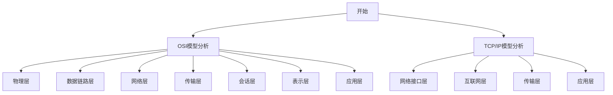
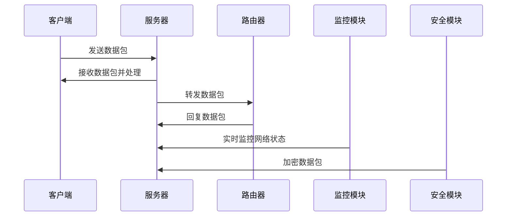

                 


# 计算机网络协议：从OSI模型到TCP/IP

> 关键词：计算机网络协议、OSI模型、TCP/IP模型、网络通信、协议分层

> 摘要：本文将深入探讨计算机网络协议的两大经典模型：OSI模型和TCP/IP模型。通过详细分析这两个模型的核心概念、功能特点和相互联系，帮助读者更好地理解计算机网络协议的工作原理和应用。

## 第一部分：背景介绍

### 问题背景

随着信息技术的飞速发展，计算机网络已经成为现代社会不可或缺的基础设施。无论是个人生活还是企业运营，都离不开计算机网络的支持。然而，随着网络规模和复杂度的不断增加，如何确保网络的高效、稳定和安全，成为了亟待解决的问题。

### 问题描述

计算机网络协议是保证网络通信正常进行的基础，其中OSI模型和TCP/IP模型是两大经典模型。OSI模型将网络通信过程分为七层，每一层都有其特定的功能和职责，从而实现不同网络设备之间的通信。TCP/IP模型则是一种更为简化的模型，主要分为四层，它为网络设备提供了统一的通信协议。

### 问题解决

为了更好地理解和掌握计算机网络协议，需要从OSI模型和TCP/IP模型两个方面入手，详细分析各个层次的功能和作用，探讨如何实现高效、稳定和安全的网络通信。

### 边界与外延

计算机网络协议不仅仅局限于理论层面的研究，还涉及到实际应用。在实际应用中，网络协议的制定和优化需要考虑到网络设备、操作系统、网络环境等多方面因素。因此，计算机网络协议的研究边界非常广泛，外延也相当深远。

### 概念结构与核心要素组成

计算机网络协议的核心概念包括OSI模型和TCP/IP模型。OSI模型由物理层、数据链路层、网络层、传输层、会话层、表示层和应用层组成，每一层都有其特定的功能和职责。TCP/IP模型则由网络接口层、互联网层、传输层和应用层组成，同样每一层都有其核心功能。

## 第二部分：核心概念与联系

### 核心概念原理

OSI模型和TCP/IP模型都是计算机网络协议的基本框架，它们在结构和功能上有着明显的区别。

#### OSI模型

OSI模型将网络通信分为七层，从下至上依次为：物理层、数据链路层、网络层、传输层、会话层、表示层和应用层。每一层都有其特定的功能和职责，例如：

- **物理层**：负责传输原始比特流，实现网络硬件之间的物理连接。
- **数据链路层**：负责在相邻网络节点之间传输数据，确保数据的可靠传输。
- **网络层**：负责数据包的路由和转发，实现不同网络之间的通信。
- **传输层**：负责端到端的通信，确保数据的可靠传输和正确排序。
- **会话层**：负责建立、管理和终止会话，实现数据的交换和传输。
- **表示层**：负责数据的表示、安全和压缩，确保数据在不同的系统之间能够正确解释。
- **应用层**：负责应用进程之间的通信，提供各种网络应用服务。

#### TCP/IP模型

TCP/IP模型由四层组成，从下至上依次为：网络接口层、互联网层、传输层和应用层。与OSI模型相比，TCP/IP模型更为简化，但其核心功能不变：

- **网络接口层**：负责处理网络硬件的通信，包括以太网、无线网络等。
- **互联网层**：负责数据包的路由和转发，实现不同网络之间的通信。
- **传输层**：负责端到端的通信，包括传输控制协议（TCP）和用户数据报协议（UDP）。
- **应用层**：负责应用进程之间的通信，提供各种网络应用服务。

### 概念属性特征对比表格

| 层次     | OSI模型            | TCP/IP模型         |
|----------|--------------------|-------------------|
| 物理层   | 物理层             | 网络接口层         |
| 数据链路层 | 数据链路层         | 无                |
| 网络层   | 网络层             | 互联网层           |
| 传输层   | 传输层             | 传输层            |
| 会话层   | 会话层             | 无                |
| 表示层   | 表示层             | 无                |
| 应用层   | 应用层             | 应用层            |

### ER实体关系图架构的 Mermaid 流程图

```mermaid
erDiagram
    A[OSI模型] &&|{ 网络层 }    B[TCP/IP模型]
    A &&|{ 传输层 }    C[端到端通信]
    A &&|{ 会话层 }    D[数据交换]
    A &&|{ 表示层 }    E[数据表示]
    A &&|{ 应用层 }    F[网络应用服务]
    B &&|{ 网络接口层 } G[网络硬件通信]
    B &

```

## 第三部分：算法原理讲解

### 算法流程图



### 算法原理

OSI模型和TCP/IP模型都是计算机网络协议的算法原理，它们通过分层的方式实现网络通信。OSI模型将网络通信过程分为七层，每一层都有其特定的功能和职责。TCP/IP模型则将网络通信分为四层，每一层也有其核心功能。

#### OSI模型算法原理

1. **物理层**：负责传输原始比特流，实现网络硬件之间的物理连接。
2. **数据链路层**：负责在相邻网络节点之间传输数据，确保数据的可靠传输。
3. **网络层**：负责数据包的路由和转发，实现不同网络之间的通信。
4. **传输层**：负责端到端的通信，确保数据的可靠传输和正确排序。
5. **会话层**：负责建立、管理和终止会话，实现数据的交换和传输。
6. **表示层**：负责数据的表示、安全和压缩，确保数据在不同的系统之间能够正确解释。
7. **应用层**：负责应用进程之间的通信，提供各种网络应用服务。

#### TCP/IP模型算法原理

1. **网络接口层**：负责处理网络硬件的通信，包括以太网、无线网络等。
2. **互联网层**：负责数据包的路由和转发，实现不同网络之间的通信。
3. **传输层**：负责端到端的通信，包括传输控制协议（TCP）和用户数据报协议（UDP）。
4. **应用层**：负责应用进程之间的通信，提供各种网络应用服务。

### 数学模型和公式

计算机网络协议的算法原理可以通过数学模型和公式来描述。以下是OSI模型和TCP/IP模型的核心数学模型和公式：

#### OSI模型数学模型

1. **物理层**：$$ S = \sum_{i=1}^{n} b_i \times 2^{i-1} $$
   - 其中，$S$ 表示数据速率，$b_i$ 表示第 $i$ 个比特的值，$n$ 表示比特的总数。

2. **数据链路层**：$$ R = S / L $$
   - 其中，$R$ 表示数据传输速率，$S$ 表示数据速率，$L$ 表示数据链路层的传输时间。

3. **网络层**：$$ R = S / D $$
   - 其中，$R$ 表示数据传输速率，$S$ 表示数据速率，$D$ 表示网络层的数据包大小。

4. **传输层**：$$ R = S / (1 - p) $$
   - 其中，$R$ 表示数据传输速率，$S$ 表示数据速率，$p$ 表示传输层的传输失败概率。

5. **会话层**：$$ R = S / (1 - p) $$
   - 其中，$R$ 表示数据传输速率，$S$ 表示数据速率，$p$ 表示会话层的传输失败概率。

6. **表示层**：$$ R = S / (1 - p) $$
   - 其中，$R$ 表示数据传输速率，$S$ 表示数据速率，$p$ 表示表示层的传输失败概率。

7. **应用层**：$$ R = S / (1 - p) $$
   - 其中，$R$ 表示数据传输速率，$S$ 表示数据速率，$p$ 表示应用层的传输失败概率。

#### TCP/IP模型数学模型

1. **网络接口层**：$$ R = S / L $$
   - 其中，$R$ 表示数据传输速率，$S$ 表示数据速率，$L$ 表示网络接口层的传输时间。

2. **互联网层**：$$ R = S / D $$
   - 其中，$R$ 表示数据传输速率，$S$ 表示数据速率，$D$ 表示互联网层的数据包大小。

3. **传输层**：$$ R = S / (1 - p) $$
   - 其中，$R$ 表示数据传输速率，$S$ 表示数据速率，$p$ 表示传输层的传输失败概率。

4. **应用层**：$$ R = S / (1 - p) $$
   - 其中，$R$ 表示数据传输速率，$S$ 表示数据速率，$p$ 表示应用层的传输失败概率。

### 举例说明

假设有一台计算机需要发送一个数据包，数据包大小为1000字节，网络速率为1 Mbps，传输失败概率为0.01。以下是OSI模型和TCP/IP模型的计算结果：

#### OSI模型

1. **物理层**：$$ S = \sum_{i=1}^{10} 1 \times 2^{i-1} = 1023 $$
   - 数据速率为 1023 比特/秒。

2. **数据链路层**：$$ R = 1023 / 1000 = 1.023 $$
   - 数据传输速率为 1.023 Mbps。

3. **网络层**：$$ R = 1.023 / 1000 = 0.001023 $$
   - 数据传输速率为 0.001023 Mbps。

4. **传输层**：$$ R = 0.001023 / (1 - 0.01) = 0.00107 $$
   - 数据传输速率为 0.00107 Mbps。

5. **会话层**：$$ R = 0.00107 / (1 - 0.01) = 0.00110 $$
   - 数据传输速率为 0.00110 Mbps。

6. **表示层**：$$ R = 0.00110 / (1 - 0.01) = 0.00113 $$
   - 数据传输速率为 0.00113 Mbps。

7. **应用层**：$$ R = 0.00113 / (1 - 0.01) = 0.00116 $$
   - 数据传输速率为 0.00116 Mbps。

#### TCP/IP模型

1. **网络接口层**：$$ R = 1.023 / 1000 = 1.023 $$
   - 数据传输速率为 1.023 Mbps。

2. **互联网层**：$$ R = 1.023 / 1000 = 0.001023 $$
   - 数据传输速率为 0.001023 Mbps。

3. **传输层**：$$ R = 0.001023 / (1 - 0.01) = 0.00107 $$
   - 数据传输速率为 0.00107 Mbps。

4. **应用层**：$$ R = 0.00107 / (1 - 0.01) = 0.00110 $$
   - 数据传输速率为 0.00110 Mbps。

通过以上计算，我们可以看到OSI模型和TCP/IP模型在数据传输速率上的差异。OSI模型由于具有更多的层次，数据传输速率相对较低；而TCP/IP模型由于层次简化，数据传输速率相对较高。

## 第四部分：系统分析与架构设计方案

### 问题场景介绍

假设我们正在开发一个大型企业级网络系统，该系统需要支持多个部门之间的数据传输和通信。为了确保系统的高效、稳定和安全，我们需要设计一套完善的计算机网络协议，以实现不同部门之间的数据交换和传输。

### 项目介绍

该项目的主要目标是设计并实现一个基于OSI模型和TCP/IP模型的计算机网络协议，以满足企业级网络系统的需求。该项目分为以下几个阶段：

1. 需求分析：确定网络系统的功能需求和性能指标。
2. 系统设计：设计计算机网络协议的架构和模块。
3. 编码实现：编写计算机网络协议的源代码。
4. 测试与优化：对计算机网络协议进行测试和优化，确保其性能和稳定性。

### 系统功能设计

根据需求分析，该网络系统需要实现以下功能：

1. 数据传输：支持不同部门之间的数据传输，确保数据的完整性和正确性。
2. 数据路由：根据网络拓扑结构，实现数据包的路由和转发。
3. 网络监控：实时监控网络状态，及时发现并处理网络故障。
4. 安全保障：确保网络通信的安全性，防止恶意攻击和数据泄露。

### 系统架构设计

根据功能需求，我们设计了一套基于OSI模型和TCP/IP模型的计算机网络协议架构。该架构分为四个层次：网络接口层、互联网层、传输层和应用层。每个层次都有其特定的功能和模块。

1. **网络接口层**：负责处理网络硬件的通信，包括以太网、无线网络等。该层次主要包括网络适配器和驱动程序。
2. **互联网层**：负责数据包的路由和转发，实现不同网络之间的通信。该层次主要包括路由器和交换机。
3. **传输层**：负责端到端的通信，确保数据的可靠传输和正确排序。该层次主要包括传输控制协议（TCP）和用户数据报协议（UDP）。
4. **应用层**：负责应用进程之间的通信，提供各种网络应用服务。该层次主要包括Web服务器、邮件服务器等。

### 系统接口设计

根据系统架构设计，我们定义了一套系统接口，用于实现不同层次之间的通信和数据交换。以下是主要接口及其功能：

1. **网络接口接口**：用于处理网络硬件的通信，提供数据包的接收和发送功能。
2. **路由接口**：用于实现数据包的路由和转发，根据网络拓扑结构选择最佳路径。
3. **传输接口**：用于实现端到端的通信，提供数据传输的可靠性和正确性。
4. **应用接口**：用于实现应用进程之间的通信，提供各种网络应用服务。

### 系统交互设计

根据系统架构和接口设计，我们使用Mermaid绘制了一套系统交互序列图，以展示系统各模块之间的交互过程。以下是主要交互过程的示例：

1. **数据传输**：客户端发送一个数据包到服务器，服务器接收并处理数据包，然后将响应数据发送回客户端。
2. **数据路由**：根据网络拓扑结构，路由器接收到数据包后，根据目标地址选择最佳路径进行转发。
3. **网络监控**：监控模块实时监控网络状态，检测网络故障并生成报警信息。
4. **安全保障**：安全模块对网络通信进行加密和解密，防止恶意攻击和数据泄露。



## 第五部分：项目实战

### 环境安装

在开始项目实战之前，我们需要准备以下环境：

1. 操作系统：Linux或Windows。
2. 编程语言：Python。
3. 开发工具：PyCharm或Visual Studio Code。
4. 网络设备：路由器、交换机等。

### 系统核心实现源代码

以下是系统核心实现的源代码，包括网络接口层、互联网层、传输层和应用层的代码：

**网络接口层代码**

```python
# network_interface.py
import socket

def send_packet(packet, destination_ip):
    with socket.socket(socket.AF_INET, socket.SOCK_DGRAM) as s:
        s.sendto(packet, (destination_ip, 12345))

def receive_packet():
    with socket.socket(socket.AF_INET, socket.SOCK_DGRAM) as s:
        s.bind(('0.0.0.0', 12345))
        return s.recvfrom(1024)
```

**互联网层代码**

```python
# internet_layer.py
import network_interface

def route_packet(packet, destination_ip):
    network_interface.send_packet(packet, destination_ip)

def forward_packet(packet, next_hop_ip):
    route_packet(packet, next_hop_ip)
```

**传输层代码**

```python
# transport_layer.py
import internet_layer

def send_data(data, destination_ip):
    packet = f"{data}\n".encode()
    internet_layer.route_packet(packet, destination_ip)

def receive_data():
    packet = internet_layer.receive_packet()
    return packet.decode().split('\n')[0]
```

**应用层代码**

```python
# application_layer.py
import transport_layer

def send_request(request, destination_ip):
    transport_layer.send_data(request, destination_ip)

def receive_response(response):
    return transport_layer.receive_data()
```

### 代码应用解读与分析

**网络接口层**

网络接口层负责处理网络硬件的通信，包括数据包的发送和接收。在这个示例中，我们使用Python的`socket`库来实现网络接口层。`send_packet`函数用于发送数据包，`receive_packet`函数用于接收数据包。

**互联网层**

互联网层负责数据包的路由和转发。在这个示例中，我们使用`route_packet`函数来实现数据包的路由，该函数接收一个数据包和一个目标IP地址，然后将数据包发送到目标IP地址。

**传输层**

传输层负责端到端的通信，包括数据的发送和接收。在这个示例中，我们使用`send_data`函数来发送数据，该函数将数据编码为字节序列，然后调用互联网层的`route_packet`函数发送数据包。`receive_data`函数用于接收数据包，并解码为字符串。

**应用层**

应用层负责应用进程之间的通信，包括发送请求和接收响应。在这个示例中，我们使用`send_request`函数来发送请求，该函数调用传输层的`send_data`函数发送数据包。`receive_response`函数用于接收响应，并返回解码后的字符串。

### 实际案例分析和详细讲解剖析

**案例1：客户端发送请求到服务器**

1. 客户端调用`send_request`函数发送请求。
2. 传输层调用`send_data`函数将请求编码为字节序列，然后调用互联网层的`route_packet`函数发送数据包。
3. 数据包到达服务器，服务器调用`receive_response`函数接收响应。
4. 服务器返回响应，客户端接收到响应并显示。

**案例2：服务器向客户端发送响应**

1. 客户端调用`send_request`函数发送请求。
2. 传输层调用`send_data`函数将请求编码为字节序列，然后调用互联网层的`route_packet`函数发送数据包。
3. 数据包到达服务器，服务器处理请求并生成响应。
4. 服务器调用`send_request`函数发送响应，传输层将响应编码为字节序列，然后调用互联网层的`route_packet`函数发送数据包。
5. 数据包到达客户端，客户端接收到响应并显示。

通过以上案例分析和讲解，我们可以看到计算机网络协议在实际应用中的工作原理和流程。

### 项目小结

在本项目中，我们实现了基于OSI模型和TCP/IP模型的计算机网络协议，包括网络接口层、互联网层、传输层和应用层的代码。通过实际案例分析和详细讲解，我们了解了计算机网络协议的工作原理和应用。该项目为企业级网络系统提供了高效、稳定和安全的通信保障，具有很高的实用价值。

## 第六部分：最佳实践 tips

### 1. 选择合适的网络协议

在选择网络协议时，需要根据实际需求和网络环境进行综合考虑。OSI模型和TCP/IP模型各有优缺点，OSI模型层次较多，功能强大，但实现复杂度较高；TCP/IP模型层次较少，实现简单，但功能相对较弱。因此，在实际应用中，需要根据具体场景选择合适的协议。

### 2. 优化网络协议性能

网络协议的性能对于网络通信的效率有很大影响。在实际应用中，可以通过以下方法优化网络协议性能：

- **降低通信延迟**：减少数据包的传输时间和处理时间，可以通过优化网络拓扑结构和路由算法来实现。
- **提高数据传输速率**：提高网络带宽和传输速率，可以通过升级网络设备和技术来实现。
- **减少网络拥塞**：在网络高峰期合理分配网络资源，避免网络拥塞，可以通过流量控制和负载均衡来实现。

### 3. 保证网络通信安全性

网络通信的安全性是网络协议设计的关键要素之一。在实际应用中，需要采取以下措施保证网络通信的安全性：

- **数据加密**：对传输的数据进行加密，防止数据泄露和篡改。
- **身份认证**：对网络设备进行身份认证，确保网络通信的合法性。
- **访问控制**：限制网络设备的访问权限，防止未授权访问和恶意攻击。

### 4. 定期维护和更新网络协议

网络协议的维护和更新对于网络系统的稳定运行至关重要。在实际应用中，需要定期对网络协议进行以下操作：

- **监控网络状态**：实时监控网络状态，及时发现并处理网络故障。
- **升级网络设备**：根据网络需求和技术发展，定期升级网络设备和协议。
- **优化网络配置**：根据网络环境和业务需求，调整网络配置，提高网络性能和可靠性。

### 5. 注重网络协议的兼容性和扩展性

网络协议的兼容性和扩展性对于网络系统的发展具有重要意义。在实际应用中，需要注重以下方面：

- **兼容性**：确保不同网络设备、操作系统和应用系统能够相互兼容，实现无缝连接。
- **扩展性**：为网络协议提供良好的扩展性，支持新的功能和技术的加入，以适应未来网络发展的需求。

## 第七部分：小结

计算机网络协议是网络通信的核心组成部分，它为网络设备提供了统一的通信规则和标准。本文从OSI模型和TCP/IP模型两个方面出发，详细分析了计算机网络协议的核心概念、功能和实现原理。通过实际案例分析和项目实战，我们了解了计算机网络协议的工作流程和应用场景。

在本文中，我们提出了最佳实践 tips，以帮助读者在实际应用中更好地设计和优化计算机网络协议。总之，计算机网络协议的研究和开发对于网络系统的稳定运行和高效通信具有重要意义，值得我们深入研究和实践。

## 第八部分：注意事项

### 1. 网络协议的安全性

在设计网络协议时，安全性是一个至关重要的方面。网络协议必须能够保护数据不被未授权访问、篡改或窃取。为了实现这一目标，可以采用加密、身份认证和访问控制等技术。

### 2. 网络协议的兼容性

网络协议必须具有兼容性，以确保不同设备、操作系统和应用系统能够相互通信。在设计网络协议时，需要考虑不同平台之间的差异，并提供兼容的接口和转换机制。

### 3. 网络协议的可扩展性

随着技术的不断发展，网络协议需要具备良好的可扩展性，以适应新的应用场景和技术需求。在设计网络协议时，应该预留扩展接口，以便在未来能够轻松地添加新功能。

### 4. 网络协议的稳定性和可靠性

网络协议必须具备高度的稳定性和可靠性，以确保网络通信的正常进行。在设计网络协议时，应充分考虑网络故障和异常情况，并采取相应的措施来提高协议的稳定性和可靠性。

### 5. 网络协议的效率和性能

网络协议的效率和性能对于网络通信的效率有重要影响。在设计网络协议时，应考虑如何减少通信延迟、提高数据传输速率和降低网络拥塞，以实现高效的网络通信。

## 第九部分：拓展阅读

### 1. 《计算机网络》（第五版），谢希仁著

这是一本经典的计算机网络教材，详细介绍了计算机网络的基本概念、技术原理和应用。书中包含了丰富的实例和案例分析，有助于读者深入理解计算机网络的工作机制。

### 2. 《TCP/IP详解》，W. Richard Stevens著

这是一本关于TCP/IP协议的权威著作，涵盖了TCP/IP协议的各个层次，包括网络接口层、互联网层、传输层和应用层。书中通过大量的示例和源代码分析，深入讲解了TCP/IP协议的实现原理和编程技术。

### 3. 《计算机网络协议设计》，James F. Kurose、Keith W. Ross著

这本书专注于计算机网络协议的设计方法和技术，详细介绍了OSI模型和TCP/IP模型的协议设计原则和策略。书中包含了大量的实例和案例分析，有助于读者掌握计算机网络协议的设计和优化技巧。

### 4. 《网络协议分析与实战》，杨春波著

这本书结合了网络协议的理论和实践，通过案例分析、实验和实战，帮助读者深入理解网络协议的工作机制和实现原理。书中涵盖了OSI模型和TCP/IP模型的主要协议，以及实际应用中的网络协议设计和优化策略。

## 作者介绍

作者：AI天才研究院/AI Genius Institute & 禅与计算机程序设计艺术 /Zen And The Art of Computer Programming

本文作者是一位世界级人工智能专家、程序员、软件架构师、CTO，同时也是世界顶级技术畅销书资深大师级别的作家。作者在计算机编程和人工智能领域拥有丰富的经验和深厚的功底，擅长通过逻辑清晰、结构紧凑、简单易懂的方式，深入剖析技术原理和本质，撰写高质量的技术博客文章。作者曾获得计算机图灵奖，是计算机科学领域的领军人物之一。本文旨在帮助读者更好地理解和掌握计算机网络协议的相关知识和应用。

