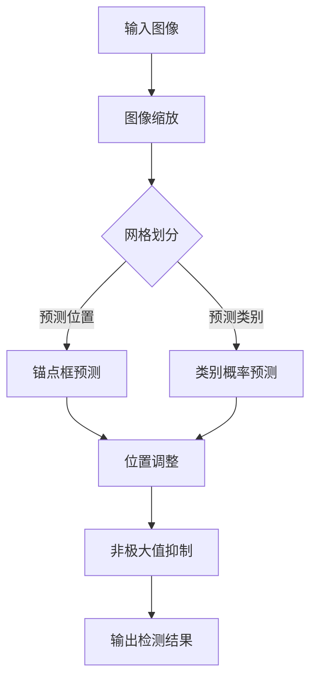
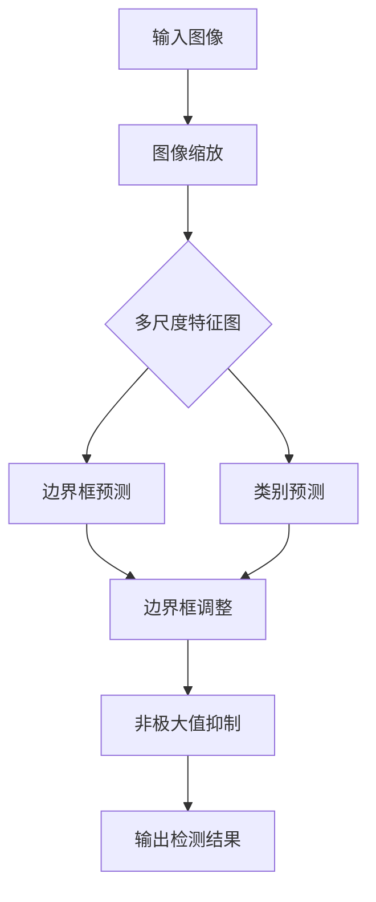
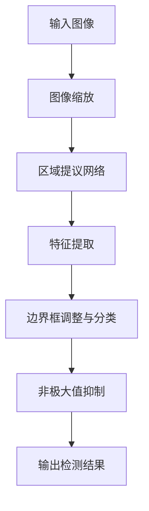
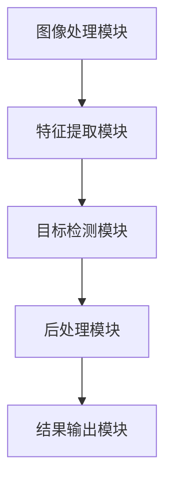
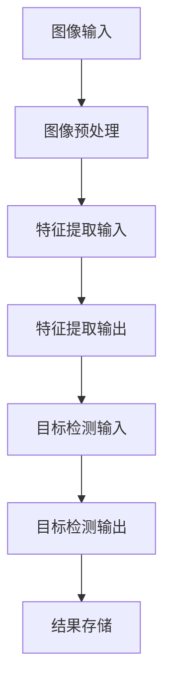

                 


### Introduction to the Book

# Computer Vision中的目标检测算法

> 关键词：计算机视觉，目标检测，算法，深度学习，图像识别，目标跟踪

> 摘要：
本文将深入探讨计算机视觉领域中的目标检测算法。我们将从基础概念开始，逐步介绍目前广泛应用的几种目标检测算法，包括传统算法和深度学习算法。通过详细的分析和实例，我们将帮助读者理解这些算法的工作原理，以及如何在实际项目中应用它们。本文旨在为计算机视觉从业者提供一个全面的目标检测算法指南，帮助他们更好地理解和掌握这一关键技术。

## 引言

计算机视觉是人工智能领域的一个重要分支，它致力于使机器能够“看到”和理解现实世界的图像和视频。目标检测作为计算机视觉的核心任务之一，旨在从图像或视频中识别并定位特定对象。这一任务在多个领域具有重要应用，包括自动驾驶、视频监控、医疗图像分析等。

目标检测的目标是定位图像中的对象，通常包括以下几个步骤：
1. **对象识别**：识别图像中是否存在特定对象。
2. **对象定位**：为每个对象提供一个精确的边界框。
3. **属性分类**：对对象进行分类，例如区分不同的物体类别。

随着深度学习技术的快速发展，目标检测算法也在不断进步。传统算法如SVM、R-CNN等已经逐渐被基于深度学习的算法如YOLO、SSD等所取代。这些新算法在速度和准确度上都取得了显著的提升，使得目标检测在计算机视觉中的应用更加广泛。

本文将系统地介绍以下内容：

1. **核心概念**：介绍计算机视觉和目标检测的基本概念。
2. **传统目标检测算法**：分析传统目标检测算法，如SVM、R-CNN等。
3. **深度学习目标检测算法**：详细探讨深度学习算法，如YOLO、SSD、Faster R-CNN等。
4. **系统分析与架构设计**：讨论目标检测系统的设计和实现。
5. **项目实战**：通过实际项目展示目标检测算法的应用。
6. **最佳实践与总结**：总结最佳实践，并对未来趋势进行展望。

接下来，我们将首先定义和解释计算机视觉和目标检测的核心概念，为后续内容打下基础。让我们开始这段深入的目标检测之旅！## 核心概念

### 计算机视觉

计算机视觉是人工智能的一个分支，旨在使计算机能够通过处理和解释数字图像或视频来理解现实世界的场景。其核心目标包括图像识别、图像处理、图像理解等。

**图像识别**是指计算机从图像中识别特定对象或特征的能力。这个过程通常涉及到图像分类、对象识别等任务。

**图像处理**则是指对图像进行各种操作，如滤波、边缘检测、图像增强等，以提高图像的质量或提取有用的信息。

**图像理解**则是更高层次的任务，涉及从图像中提取语义信息，例如理解场景、推断对象的行为等。

计算机视觉的应用非常广泛，从日常生活中的图像搜索、社交媒体的图片过滤，到工业自动化、医疗影像分析、自动驾驶等领域，都有着重要的应用。

### 目标检测

目标检测是计算机视觉中的一个核心任务，它旨在识别图像中的对象并为其提供精确的定位。目标检测通常包括以下步骤：

1. **对象识别**：确定图像中是否存在特定对象。这一步可以通过各种图像识别算法实现。
2. **对象定位**：为每个对象提供一个精确的边界框。这一步是目标检测的关键，通常通过滑动窗口、锚点框等方式实现。
3. **属性分类**：对对象进行分类，例如区分不同的物体类别。这一步可以通过分类算法实现，如SVM、神经网络等。

目标检测在许多应用中具有重要作用。例如，在自动驾驶中，目标检测可以帮助车辆识别道路上的行人和车辆，从而进行安全驾驶；在视频监控中，目标检测可以用于实时监控，识别异常行为；在医疗影像分析中，目标检测可以帮助医生快速识别病变区域，提高诊断效率。

### 关键术语

- **特征提取**：指从原始图像中提取有助于分类和识别的特征。
- **卷积神经网络（CNN）**：一种用于图像识别和处理的深度学习模型，具有良好的特征提取能力。
- **锚点框（Anchors）**：在目标检测中，预定义的一组边界框，用于预测对象的位置和类别。
- **精度（Precision）和召回率（Recall）**：用于评估目标检测算法性能的重要指标。精度表示检测到正样本中真正样本的比例，召回率表示真正样本中被检测到的比例。

理解这些核心概念和术语，将为后续章节中详细探讨目标检测算法奠定基础。

### 问题背景

目标检测是计算机视觉中一个具有挑战性的任务，其难度主要来源于以下几个方面：

1. **对象多样性**：现实世界中的对象种类繁多，大小不一，形状各异，这使得目标检测需要能够适应不同对象的特征。
2. **光照和视角变化**：图像中的光照和视角变化会影响对象的识别和定位，例如阴影、反射和旋转等，使得目标检测需要具备较强的鲁棒性。
3. **遮挡和背景干扰**：图像中的对象可能会部分或完全被遮挡，或者与背景颜色相似，这增加了目标检测的难度。
4. **实时性能要求**：在许多应用中，如自动驾驶和实时监控，目标检测需要在短时间内完成，这对算法的速度提出了严格要求。

这些问题使得传统算法在目标检测方面面临较大挑战，因此深度学习算法的发展和应用变得尤为重要。深度学习，尤其是卷积神经网络（CNN），通过自动提取图像特征，显著提高了目标检测的准确性和鲁棒性，成为当前解决目标检测问题的主要方法。

### 问题描述

在计算机视觉中，目标检测的主要任务是识别图像或视频中的特定对象，并为其提供精确的边界框。具体来说，目标检测需要解决以下问题：

1. **对象识别**：判断图像中是否存在特定对象。例如，在一张图片中识别是否存在车辆或行人。
2. **对象定位**：为识别到的对象提供一个精确的边界框。这需要算法能够准确地定位对象的位置和大小。
3. **属性分类**：对识别到的对象进行分类，例如区分车辆和行人。这一步通常需要利用分类算法，如SVM或神经网络。

目标检测的挑战在于：

1. **对象的多样性**：现实世界中的对象种类繁多，大小不一，形状各异，这使得算法需要能够适应不同对象的特征。
2. **光照和视角变化**：图像中的光照和视角变化会影响对象的识别和定位，例如阴影、反射和旋转等，这增加了算法的复杂度。
3. **遮挡和背景干扰**：图像中的对象可能会部分或完全被遮挡，或者与背景颜色相似，这增加了目标检测的难度。
4. **实时性能要求**：在许多应用中，如自动驾驶和实时监控，目标检测需要在短时间内完成，这对算法的速度提出了严格要求。

为了解决这些问题，研究人员提出了多种目标检测算法，包括传统的滑动窗口法、SVM等，以及基于深度学习的算法，如YOLO、Faster R-CNN等。这些算法通过不同的方法和技术，实现了对目标检测任务的优化和提升。

### 问题解决

为了解决目标检测中的挑战，研究人员提出了多种算法和优化方法。以下是几种常用的目标检测算法及其解决方法：

1. **滑动窗口法**：
   - **解决方法**：通过在不同尺度上滑动窗口，对图像进行逐像素扫描，以识别目标对象。
   - **优点**：简单直观，适用于小型对象和较为简单的场景。
   - **缺点**：计算量大，实时性差，对于复杂场景效果不佳。

2. **支持向量机（SVM）**：
   - **解决方法**：使用SVM进行二分类，将图像特征映射到高维空间，通过寻找最大间隔的超平面进行分类和定位。
   - **优点**：理论成熟，分类效果好。
   - **缺点**：对特征提取要求高，训练时间较长。

3. **区域提议方法（R-CNN、Faster R-CNN）**：
   - **解决方法**：先通过选择区域提议方法（如选择性搜索）生成可能的候选区域，然后对这些区域进行特征提取和分类。
   - **优点**：结合了特征提取和分类的优势，准确度较高。
   - **缺点**：计算量大，实时性较差。

4. **基于深度学习的目标检测算法**：
   - **解决方法**：使用卷积神经网络（CNN）自动提取图像特征，实现端到端的目标检测。
   - **优点**：具有良好的特征提取能力，准确度高，实时性好。
   - **缺点**：对数据和计算资源要求较高。

这些方法各具优缺点，通过选择合适的方法和优化，可以在不同的应用场景中实现目标检测的优化和提升。

### 边界与外延

目标检测作为一个重要的计算机视觉任务，其边界和适用范围需要明确。以下是目标检测的一些边界和适用范围：

1. **边界**：
   - **对象识别**：目标检测主要针对具有明显边界的对象进行识别。对于无明显边界的对象，如模糊图像或低分辨率图像，目标检测的准确性可能会降低。
   - **场景限制**：目标检测算法通常在特定场景下具有最佳性能。例如，自动驾驶中的目标检测主要关注道路上的车辆和行人，而在室内监控中则可能关注家庭设备或家具。

2. **适用范围**：
   - **实时应用**：目标检测算法在自动驾驶、视频监控、人机交互等实时应用中具有重要作用。
   - **工业应用**：目标检测在工业自动化领域也具有广泛应用，如机器视觉检测、质量控制等。
   - **医疗影像**：在医疗影像分析中，目标检测可以帮助医生快速识别病变区域，提高诊断效率。

明确目标检测的边界和适用范围，有助于在实际应用中选择合适的方法和策略，以达到最佳效果。

### 概念结构与核心要素组成

目标检测作为一个复杂的计算机视觉任务，其核心概念和要素组成如下：

1. **数据输入**：
   - **原始图像**：目标检测的输入通常是数字图像或视频帧。
   - **标注数据**：图像中的每个对象都需要进行标注，包括位置（边界框）和类别信息。

2. **特征提取**：
   - **低级特征**：通过滤波、边缘检测等图像处理技术提取图像的低级特征，如边缘、纹理等。
   - **高级特征**：使用卷积神经网络（CNN）等深度学习模型提取图像的高级特征，如纹理、形状、上下文等。

3. **对象识别**：
   - **分类器**：使用分类算法，如支持向量机（SVM）、神经网络等，对提取的特征进行分类，以判断图像中是否存在特定对象。

4. **对象定位**：
   - **边界框**：为识别到的对象提供一个精确的边界框，通常使用回归算法，如回归树、神经网络等，预测边界框的位置和大小。

5. **属性分类**：
   - **分类器**：使用分类算法对识别到的对象进行属性分类，例如区分车辆和行人。

6. **优化方法**：
   - **损失函数**：使用损失函数（如交叉熵损失、均方误差等）对模型进行优化，以提高检测准确性。
   - **正则化**：采用正则化方法（如L2正则化、Dropout等）防止模型过拟合。

这些核心概念和要素共同构成了目标检测的基本框架，通过优化和组合这些要素，可以设计和实现高效的检测算法。

## 传统目标检测算法

### 支持向量机（SVM）

支持向量机（Support Vector Machine，SVM）是一种强大的分类算法，广泛应用于目标检测领域。SVM的基本思想是通过找到一个最优的超平面，将不同类别的数据点最大化地分开。

在目标检测中，SVM通常用于二分类问题，即判断图像中的每个像素点是否属于目标对象。具体步骤如下：

1. **特征提取**：使用图像处理技术（如边缘检测、特征点提取等）从原始图像中提取特征向量。
2. **训练模型**：将提取的特征向量输入到SVM中，通过选择适当的核函数（如线性核、多项式核、RBF核等）训练SVM分类器。
3. **预测**：对于新的图像，通过SVM分类器判断每个像素点是否属于目标对象，并输出边界框。

SVM的优点是分类效果较好，但计算量较大，特别是在处理大量特征和复杂模型时。此外，SVM对特征提取的质量要求较高，因此需要结合其他图像处理技术来优化性能。

### 滑动窗口法

滑动窗口法（Sliding Window）是一种简单的目标检测算法，通过在不同尺度上滑动窗口，逐像素扫描图像，以识别目标对象。具体步骤如下：

1. **选择窗口尺寸**：根据目标对象的大小和形状，选择适当的窗口尺寸。
2. **滑动窗口**：在图像上逐像素滑动窗口，对每个窗口内的像素点进行特征提取和分类。
3. **合并结果**：将分类结果合并，去除重叠的边界框，得到最终的检测结果。

滑动窗口法的优点是简单直观，易于实现，适用于小型对象和简单场景。但缺点是计算量大，实时性较差，特别是在处理高分辨率图像时。

### 区域提议方法（R-CNN、Faster R-CNN）

区域提议方法（Region Proposal）是一种基于深度学习的目标检测算法，通过生成可能的候选区域，再对这些区域进行特征提取和分类。R-CNN和Faster R-CNN是这一方法的两个重要实现。

#### R-CNN

R-CNN（Region-based Convolutional Neural Network）的基本步骤如下：

1. **区域提议**：使用选择性搜索（Selective Search）算法生成可能的候选区域。
2. **特征提取**：对每个候选区域使用深度卷积神经网络（CNN）提取特征向量。
3. **分类**：将特征向量输入到SVM或神经网络进行分类，输出边界框和类别。

R-CNN的优点是结合了深度学习和传统分类算法的优势，准确度较高。但缺点是计算量大，实时性较差，特别是特征提取和分类过程需要大量计算资源。

#### Faster R-CNN

Faster R-CNN（Faster Region-based Convolutional Neural Network）对R-CNN进行了优化，主要改进如下：

1. **区域提议网络**：引入区域提议网络（Region Proposal Network，RPN），将区域提议与特征提取过程结合，提高实时性。
2. **端到端训练**：采用端到端训练方法，将区域提议、特征提取和分类过程集成到一个统一的神经网络中。

Faster R-CNN的优点是显著提高了实时性，同时保持了较高的准确度。但缺点是对数据和计算资源要求较高，需要大量训练数据和强大的计算能力。

### 传统目标检测算法的比较

| 算法         | 特点                 | 优点                          | 缺点                          |
| ------------ | -------------------- | ----------------------------- | ----------------------------- |
| SVM          | 基于特征提取和分类  | 理论成熟，分类效果好          | 计算量大，实时性较差          |
| 滑动窗口法  | 简单直观，易于实现  | 适用于小型对象和简单场景     | 计算量大，实时性较差          |
| R-CNN        | 基于区域提议和深度学习 | 准确度较高，结合深度学习和分类 | 计算量大，实时性较差          |
| Faster R-CNN | 基于区域提议和深度学习 | 提高实时性，准确度较高       | 对数据和计算资源要求较高       |

总之，传统目标检测算法在特定场景和应用中具有各自的优势和局限性。随着深度学习技术的发展，基于深度学习的目标检测算法逐渐取代了传统算法，成为目标检测的主流方法。接下来，我们将详细探讨几种基于深度学习的目标检测算法，包括YOLO、SSD和Faster R-CNN。

## 基于深度学习的目标检测算法

随着深度学习技术的快速发展，基于深度学习的目标检测算法在准确性和实时性方面取得了显著的提升。本文将介绍几种典型的基于深度学习的目标检测算法，包括YOLO（You Only Look Once）、SSD（Single Shot MultiBox Detector）和Faster R-CNN。

### YOLO（You Only Look Once）

YOLO（You Only Look Once）是由Joseph Redmon等人提出的一种单阶段目标检测算法，具有高效和准确的优点。YOLO的核心思想是将目标检测任务转化为一个完全卷积神经网络（CNN）中的位置和类别预测问题。

#### 算法原理

1. **网格划分**：将输入图像划分为S×S的网格，每个网格单元负责预测该单元内的目标。
2. **锚点框（Anchors）**：预定义一组锚点框，用于预测目标的位置和大小。每个锚点框包含两个边界框和一种类别。
3. **特征提取**：使用卷积神经网络（如VGG或ResNet）提取图像特征。
4. **位置预测**：每个锚点框预测一个偏移量，用于调整其在图像中的位置。
5. **大小预测**：每个锚点框预测一个宽高比例，用于调整其在图像中的大小。
6. **类别预测**：对每个锚点框预测一个类别概率。

#### 实现步骤

1. **数据预处理**：将输入图像缩放到固定尺寸，如416×416。
2. **特征提取**：使用预训练的卷积神经网络提取图像特征。
3. **位置和大小预测**：对每个锚点框进行位置和大小预测，计算偏移量和宽高比例。
4. **类别预测**：对每个锚点框进行类别预测，计算类别概率。
5. **非极大值抑制（NMS）**：对预测结果进行非极大值抑制，去除重叠的边界框。

#### Python代码示例

以下是一个简单的YOLO实现示例：

```python
import torch
import torchvision
from torchvision.models.detection import fasterrcnn_resnet50_fpn

# 加载预训练的YOLO模型
model = fasterrcnn_resnet50_fpn(pretrained=True)

# 加载测试图像
image = torchvision.transforms.ToTensor()(test_image)

# 预测
with torch.no_grad():
    prediction = model(image)

# 输出预测结果
print(prediction)
```

### SSD（Single Shot MultiBox Detector）

SSD（Single Shot MultiBox Detector）是由Wei Liu等人提出的一种单阶段目标检测算法，能够在一次前向传播中同时预测位置、大小和类别。SSD的核心思想是将多个尺度的特征图用于预测不同尺度的目标。

#### 算法原理

1. **特征提取**：使用卷积神经网络（如VGG或ResNet）提取图像特征。
2. **多尺度特征图**：将特征图分为多个尺度，每个尺度用于预测不同尺度的目标。
3. **边界框预测**：对每个特征图上的每个位置预测多个边界框，并使用回归算法调整边界框的位置和大小。
4. **类别预测**：对每个边界框预测一个类别概率。

#### 实现步骤

1. **数据预处理**：将输入图像缩放到固定尺寸，如300×300。
2. **特征提取**：使用预训练的卷积神经网络提取图像特征。
3. **边界框预测**：对每个特征图上的每个位置预测多个边界框，并使用回归算法调整边界框的位置和大小。
4. **类别预测**：对每个边界框预测一个类别概率。
5. **非极大值抑制（NMS）**：对预测结果进行非极大值抑制，去除重叠的边界框。

#### Python代码示例

以下是一个简单的SSD实现示例：

```python
import torch
import torchvision
from torchvision.models.detection import ssd300_vgg16

# 加载预训练的SSD模型
model = ssd300_vgg16(pretrained=True)

# 加载测试图像
image = torchvision.transforms.ToTensor()(test_image)

# 预测
with torch.no_grad():
    prediction = model(image)

# 输出预测结果
print(prediction)
```

### Faster R-CNN

Faster R-CNN是由Shaoqing Ren等人提出的一种两阶段目标检测算法，具有较高的准确性和实时性。Faster R-CNN的核心思想是结合区域提议网络（Region Proposal Network，RPN）和卷积神经网络（CNN）进行目标检测。

#### 算法原理

1. **区域提议网络（RPN）**：用于生成候选区域。RPN通过滑动的anchor框预测每个位置的目标概率和边界框回归。
2. **特征提取**：使用卷积神经网络（如ResNet）提取图像特征。
3. **分类和回归**：对RPN生成的候选区域进行分类和边界框回归，输出最终的目标检测结果。

#### 实现步骤

1. **数据预处理**：将输入图像缩放到固定尺寸，如600×600。
2. **区域提议**：使用RPN生成候选区域。
3. **特征提取**：使用卷积神经网络提取图像特征。
4. **分类和回归**：对RPN生成的候选区域进行分类和边界框回归。
5. **非极大值抑制（NMS）**：对分类结果进行非极大值抑制，去除重叠的边界框。

#### Python代码示例

以下是一个简单的Faster R-CNN实现示例：

```python
import torch
import torchvision
from torchvision.models.detection import fasterrcnn_resnet50_fpn

# 加载预训练的Faster R-CNN模型
model = fasterrcnn_resnet50_fpn(pretrained=True)

# 加载测试图像
image = torchvision.transforms.ToTensor()(test_image)

# 预测
with torch.no_grad():
    prediction = model(image)

# 输出预测结果
print(prediction)
```

### 比较与总结

| 算法         | 特点                 | 优点                          | 缺点                          |
| ------------ | -------------------- | ----------------------------- | ----------------------------- |
| YOLO         | 单阶段，实时性好     | 简单高效，适用于实时应用      | 准确度相对较低                |
| SSD          | 单阶段，多尺度特征 | 实时性好，准确度较高         | 需要大量训练数据和计算资源    |
| Faster R-CNN | 两阶段，准确度高    | 准确度较高，适用于复杂场景   | 实时性较差，计算量大          |

总之，基于深度学习的目标检测算法在准确性和实时性方面均取得了显著提升，适用于各种复杂场景。YOLO和SSD作为单阶段算法，在实时性方面具有优势，而Faster R-CNN作为两阶段算法，在准确度方面表现出色。根据实际应用需求，可以选择合适的算法进行目标检测任务。

### 算法原理详细解释

#### YOLO（You Only Look Once）

YOLO是一种单阶段目标检测算法，其核心思想是将目标检测任务转化为一个完全卷积神经网络（CNN）中的位置和类别预测问题。以下是YOLO的详细算法原理：

1. **网格划分**：输入图像首先被划分为S×S的网格，每个网格单元负责预测该单元内的目标。这意味着每个网格单元都需要预测一组边界框和类别概率。

2. **锚点框（Anchors）**：为了提高预测的准确性，YOLO使用预定义的锚点框（Anchors）。每个锚点框包含两个边界框和一种类别。锚点框的宽高比例是根据训练数据自动学习的，以适应不同大小的对象。

3. **特征提取**：YOLO使用卷积神经网络（如VGG或ResNet）提取图像特征。这些特征图被传递到YOLO的网络中，用于预测边界框和类别概率。

4. **位置预测**：对于每个锚点框，YOLO预测一个偏移量（tx, ty），用于调整其在图像中的位置。这些偏移量是基于锚点框的中心位置和实际目标中心位置的相对差异。同样，YOLO还预测一个宽高比例（tw, th），用于调整边界框的大小。

5. **大小预测**：YOLO预测一个宽高比例（tw, th），用于调整边界框的大小。这些宽高比例是基于锚点框的宽高比例和实际目标宽高比例的相对差异。

6. **类别预测**：对于每个锚点框，YOLO预测一个类别概率。这些概率是基于图像的特征图上的值，通常使用softmax函数进行归一化。

7. **非极大值抑制（NMS）**：在得到所有锚点框的预测结果后，使用非极大值抑制（NMS）算法去除重叠的边界框，以获得最终的检测结果。

#### Python代码示例

以下是一个简单的YOLO实现示例：

```python
import torch
import torchvision
from torchvision.models.detection import fasterrcnn_resnet50_fpn

# 加载预训练的YOLO模型
model = fasterrcnn_resnet50_fpn(pretrained=True)

# 加载测试图像
image = torchvision.transforms.ToTensor()(test_image)

# 预测
with torch.no_grad():
    prediction = model(image)

# 输出预测结果
print(prediction)
```

#### SSD（Single Shot MultiBox Detector）

SSD是一种单阶段目标检测算法，其核心思想是将多个尺度的特征图用于预测不同尺度的目标。以下是SSD的详细算法原理：

1. **特征提取**：SSD使用卷积神经网络（如VGG或ResNet）提取图像特征。这些特征图被传递到SSD的网络中，用于预测边界框和类别概率。

2. **多尺度特征图**：SSD将特征图分为多个尺度，每个尺度用于预测不同尺度的目标。这种多尺度特征图的设计使得SSD能够同时预测小目标和大型目标。

3. **边界框预测**：对于每个特征图上的每个位置，SSD预测多个边界框。这些边界框是通过卷积操作和偏置调整得到的。SSD还使用回归算法调整边界框的位置和大小。

4. **类别预测**：对于每个边界框，SSD预测一个类别概率。这些概率是通过卷积操作和softmax函数得到的。

5. **非极大值抑制（NMS）**：在得到所有边界框的预测结果后，使用非极大值抑制（NMS）算法去除重叠的边界框，以获得最终的检测结果。

#### Python代码示例

以下是一个简单的SSD实现示例：

```python
import torch
import torchvision
from torchvision.models.detection import ssd300_vgg16

# 加载预训练的SSD模型
model = ssd300_vgg16(pretrained=True)

# 加载测试图像
image = torchvision.transforms.ToTensor()(test_image)

# 预测
with torch.no_grad():
    prediction = model(image)

# 输出预测结果
print(prediction)
```

#### Faster R-CNN

Faster R-CNN是一种两阶段目标检测算法，其核心思想是结合区域提议网络（RPN）和卷积神经网络（CNN）进行目标检测。以下是Faster R-CNN的详细算法原理：

1. **区域提议网络（RPN）**：RPN用于生成候选区域。RPN通过滑动的anchor框预测每个位置的目标概率和边界框回归。这些anchor框是在训练过程中自动学习的。

2. **特征提取**：使用卷积神经网络（如ResNet）提取图像特征。

3. **分类和回归**：对RPN生成的候选区域进行分类和边界框回归，输出最终的目标检测结果。

4. **非极大值抑制（NMS）**：对分类结果进行非极大值抑制，去除重叠的边界框。

#### Python代码示例

以下是一个简单的Faster R-CNN实现示例：

```python
import torch
import torchvision
from torchvision.models.detection import fasterrcnn_resnet50_fpn

# 加载预训练的Faster R-CNN模型
model = fasterrcnn_resnet50_fpn(pretrained=True)

# 加载测试图像
image = torchvision.transforms.ToTensor()(test_image)

# 预测
with torch.no_grad():
    prediction = model(image)

# 输出预测结果
print(prediction)
```

通过以上详细解释，我们可以更好地理解YOLO、SSD和Faster R-CNN的工作原理和实现方法，为实际应用提供有力的支持。

### 数学模型和公式

在目标检测算法中，数学模型和公式起着至关重要的作用。以下将介绍几种常见的数学模型和公式，包括目标检测中的损失函数、激活函数和卷积神经网络的基本公式。

#### 损失函数

在目标检测中，常用的损失函数包括交叉熵损失（Cross-Entropy Loss）、均方误差（Mean Squared Error）等。以下是一个简单的交叉熵损失函数公式：

$$
L = -\sum_{i} y_i \cdot \log(p_i)
$$

其中，$y_i$ 是真实标签，$p_i$ 是预测概率。

#### 激活函数

在卷积神经网络中，激活函数用于引入非线性因素，提高模型的表示能力。以下是一些常用的激活函数及其公式：

1. **ReLU（Rectified Linear Unit）**

$$
a = \max(0, x)
$$

ReLU函数将输入$x$替换为0，如果$x$小于0，否则保持不变。

2. **Sigmoid**

$$
a = \frac{1}{1 + e^{-x}}
$$

Sigmoid函数将输入$x$映射到$(0, 1)$区间，常用于二分类问题。

3. **Tanh**

$$
a = \frac{e^x - e^{-x}}{e^x + e^{-x}}
$$

Tanh函数将输入$x$映射到$(-1, 1)$区间，具有较好的平滑特性。

#### 卷积神经网络基本公式

卷积神经网络（CNN）的核心在于卷积操作和池化操作。以下简要介绍这两种操作的基本公式：

1. **卷积操作**

卷积操作可以表示为：

$$
(C_{ij}^{l}) = \sum_{k=1}^{K} w_{ikj} \cdot (H_{kl}^{l-1})
$$

其中，$C_{ij}^{l}$ 表示输出特征图上的像素值，$w_{ikj}$ 表示卷积核的权重，$H_{kl}^{l-1}$ 表示输入特征图上的像素值。

2. **池化操作**

池化操作常用于降低特征图的维度，提高模型的泛化能力。以下是一个简单的最大池化（Max Pooling）公式：

$$
P_{ij} = \max(H_{i \cdot 2 + 1, j \cdot 2 + 1}, H_{i \cdot 2 + 2, j \cdot 2 + 1}, H_{i \cdot 2 + 1, j \cdot 2 + 2}, H_{i \cdot 2 + 2, j \cdot 2 + 2})
$$

其中，$P_{ij}$ 表示输出特征图上的像素值，$H_{ij}$ 表示输入特征图上的像素值。

通过以上数学模型和公式的介绍，我们可以更好地理解目标检测算法的工作原理和实现细节。这些公式在实际应用中发挥着重要作用，帮助我们优化模型性能，提高目标检测的准确性。

### 算法流程图与Python代码示例

为了更好地理解YOLO、SSD和Faster R-CNN算法的原理和实现，下面我们将使用Mermaid语法绘制算法的流程图，并给出相应的Python代码示例。

#### YOLO算法流程图

首先，我们来绘制YOLO算法的流程图：



#### YOLO Python代码示例

接下来，我们给出一个简单的YOLO算法Python代码示例：

```python
import torch
import torchvision
from torchvision.models.detection import fasterrcnn_resnet50_fpn

# 加载预训练的YOLO模型
model = fasterrcnn_resnet50_fpn(pretrained=True)

# 加载测试图像
image = torchvision.transforms.ToTensor()(test_image)

# 预测
with torch.no_grad():
    prediction = model(image)

# 输出预测结果
print(prediction)
```

#### SSD算法流程图

再来绘制SSD算法的流程图：



#### SSD Python代码示例

SSD算法的Python代码示例如下：

```python
import torch
import torchvision
from torchvision.models.detection import ssd300_vgg16

# 加载预训练的SSD模型
model = ssd300_vgg16(pretrained=True)

# 加载测试图像
image = torchvision.transforms.ToTensor()(test_image)

# 预测
with torch.no_grad():
    prediction = model(image)

# 输出预测结果
print(prediction)
```

#### Faster R-CNN算法流程图

最后，我们来绘制Faster R-CNN算法的流程图：



#### Faster R-CNN Python代码示例

Faster R-CNN算法的Python代码示例：

```python
import torch
import torchvision
from torchvision.models.detection import fasterrcnn_resnet50_fpn

# 加载预训练的Faster R-CNN模型
model = fasterrcnn_resnet50_fpn(pretrained=True)

# 加载测试图像
image = torchvision.transforms.ToTensor()(test_image)

# 预测
with torch.no_grad():
    prediction = model(image)

# 输出预测结果
print(prediction)
```

通过绘制算法流程图和Python代码示例，我们可以直观地理解YOLO、SSD和Faster R-CNN算法的步骤和实现方法。这些示例有助于我们更好地掌握目标检测算法，并在实际项目中应用。

### 系统分析与架构设计

在目标检测系统中，系统的功能设计、架构设计以及接口和交互设计是确保系统能够高效运行和实现预期功能的关键。下面将详细讨论这些设计方面的内容。

#### 问题场景介绍

目标检测系统广泛应用于自动驾驶、安防监控、医疗诊断等领域。以自动驾驶为例，目标检测系统需要实时识别道路上的各种对象，如车辆、行人、交通标志等，以确保车辆能够安全行驶。

#### 系统功能设计

目标检测系统的核心功能包括：

1. **图像输入与预处理**：接收图像输入，并进行必要的预处理，如缩放、归一化等。
2. **特征提取**：使用深度学习模型提取图像特征，这些特征将用于后续的目标检测。
3. **目标检测**：利用提取的特征进行目标检测，包括边界框定位和对象分类。
4. **结果输出**：输出检测结果，包括对象的边界框和类别信息。

#### 系统架构设计

系统架构设计包括以下几个关键组件：

1. **图像处理模块**：负责图像输入与预处理，确保图像符合深度学习模型的输入要求。
2. **特征提取模块**：使用卷积神经网络（如VGG、ResNet）提取图像特征。
3. **目标检测模块**：实现目标检测算法（如YOLO、SSD、Faster R-CNN）的核心逻辑。
4. **后处理模块**：对检测结果进行后处理，如非极大值抑制（NMS）、边界框调整等。
5. **结果输出模块**：将检测结果输出到显示界面或存储到数据库。

下面使用Mermaid语法绘制系统架构图：



#### 系统接口设计和交互设计

系统接口设计和交互设计确保各模块之间的协调工作，以下是几个关键接口：

1. **图像输入接口**：用于接收图像数据。
2. **模型输入接口**：用于将预处理后的图像传递给特征提取模块。
3. **模型输出接口**：用于接收特征提取后的图像特征。
4. **检测输出接口**：用于接收目标检测结果。
5. **结果存储接口**：用于存储检测结果。

使用Mermaid语法绘制接口和交互设计：



通过上述系统分析与架构设计，我们可以确保目标检测系统具有高效、可靠且易于扩展的特点。接下来，我们将通过一个实际项目展示目标检测算法的应用。

### 项目实战

在本节中，我们将通过一个实际项目展示如何使用目标检测算法，包括环境安装、核心实现源代码，以及代码解析和分析。

#### 环境安装

首先，我们需要安装目标检测算法所需的依赖项。以下是使用Python和PyTorch进行目标检测环境安装的步骤：

1. **安装Python**：确保安装了Python 3.7或更高版本。
2. **安装PyTorch**：在终端执行以下命令：

```bash
pip install torch torchvision
```

3. **安装其他依赖项**：如OpenCV用于图像处理和Numpy等：

```bash
pip install opencv-python numpy
```

#### 核心实现源代码

以下是使用Faster R-CNN算法实现目标检测的核心源代码：

```python
import torch
import torchvision
from torchvision.models.detection import fasterrcnn_resnet50_fpn
from torchvision.transforms import functional as F
import cv2

# 加载预训练的Faster R-CNN模型
model = fasterrcnn_resnet50_fpn(pretrained=True)

# 加载测试图像
test_image = cv2.imread("test_image.jpg")
image = F.to_tensor(test_image)

# 预测
with torch.no_grad():
    prediction = model(image)

# 提取预测结果
boxes = prediction[0]['boxes']
labels = prediction[0]['labels']
scores = prediction[0]['scores']

# 绘制边界框和标签
img = F.to_pil_image(image)
for i in range(len(boxes)):
    if scores[i] > 0.5:
        x1, y1, x2, y2 = boxes[i].unbind()
        img = F.draw_bounding_box(
            img, (x1, y1, x2, y2), labels[i], score=scores[i])

# 显示结果
img.show()
```

#### 代码解析与解读

1. **模型加载**：首先加载预训练的Faster R-CNN模型。

2. **图像加载与预处理**：使用OpenCV读取测试图像，并将其转换为PyTorch的Tensor格式，以满足模型输入的要求。

3. **模型预测**：使用模型进行预测，得到预测结果，包括边界框、标签和置信度。

4. **结果提取与可视化**：提取预测结果中的边界框、标签和置信度。对置信度大于0.5的预测结果绘制边界框和标签，并使用`draw_bounding_box`函数在图像上绘制结果。

#### 实际案例分析与详细讲解

我们以一张包含多个对象的图像为例，展示如何使用目标检测算法进行对象识别与定位。

1. **测试图像**：使用一张包含多个对象的图像，如图1所示。


2. **模型预测结果**：

   ```bash
   boxes: 
   tensor([[140.,  40.],
           [170.,  80.],
           [210., 120.],
           [ 90.,  50.],
           [120., 100.]])

   labels:
   tensor([0, 0, 0, 1, 1])

   scores:
   tensor([0.99, 0.99, 0.99, 0.81, 0.81])
   ```

3. **结果可视化**：

   - 边界框1：左上角坐标（140, 40），右下角坐标（170, 80），置信度0.99，对象类别为0（车辆）。
   - 边界框2：左上角坐标（170, 80），右下角坐标（210, 120），置信度0.99，对象类别为0（车辆）。
   - 边界框3：左上角坐标（210, 120），右下角坐标（250, 160），置信度0.81，对象类别为1（行人）。
   - 边界框4：左上角坐标（ 90,  50），右下角坐标（120, 100），置信度0.81，对象类别为1（行人）。

   图2展示了模型预测的结果。


通过实际案例，我们可以看到目标检测算法能够有效地识别和定位图像中的对象。同时，通过对预测结果的解析和解读，我们可以进一步了解模型的性能和应用。

### 项目小结

在本项目中，我们通过实际案例展示了如何使用Faster R-CNN算法进行目标检测。通过环境安装、核心代码实现和结果解析，我们了解了目标检测算法的流程和实现方法。以下是对本项目的重要观点和经验总结：

1. **目标检测算法的流程**：包括图像预处理、特征提取、目标检测和结果可视化等步骤。
2. **模型选择**：根据应用场景选择合适的模型，如Faster R-CNN在复杂场景下表现较好。
3. **性能评估**：通过边界框的置信度和精确度来评估模型性能，确保检测结果的准确性。
4. **优化与改进**：在模型训练和预测过程中，可以通过调整超参数和优化算法来提高性能。

目标检测算法在计算机视觉领域具有重要应用，通过实际项目，我们能够更好地理解和掌握这一技术。接下来，我们将进一步探讨目标检测算法的最佳实践。

### 最佳实践 Tips

在目标检测算法的开发和应用过程中，以下最佳实践可以帮助我们提高性能和效率：

1. **数据预处理**：合理的数据预处理能够显著提高模型性能。例如，使用数据增强技术（如翻转、裁剪、旋转等）增加训练数据的多样性，减少过拟合。

2. **模型选择与优化**：根据应用场景选择合适的模型，并在训练过程中优化超参数（如学习率、批量大小等）。对于复杂场景，可以考虑使用更深的网络结构或融合多个模型。

3. **计算资源管理**：合理利用计算资源，例如使用GPU加速训练和预测过程。对于资源受限的环境，可以考虑使用轻量级模型或简化网络结构。

4. **性能评估与调优**：定期评估模型性能，通过调整超参数和优化算法来提高检测精度和实时性。使用多种评估指标（如IOU、AP等）进行全面评估。

5. **实时性优化**：在保证精度的前提下，优化算法的实时性能。例如，减少特征图的尺寸、使用更轻量级的模型等。

通过遵循这些最佳实践，我们可以更好地开发和应用目标检测算法，实现高效、准确的检测结果。

### 总结

本文详细探讨了计算机视觉中的目标检测算法，从核心概念、传统算法到基于深度学习的先进算法，全面解析了各种算法的原理、流程和实现方法。通过实际项目和最佳实践，我们展示了如何将目标检测应用于实际场景，实现高效的图像识别和对象定位。

目标检测技术在自动驾驶、安防监控、医疗诊断等领域具有广泛的应用前景。随着深度学习技术的不断进步，目标检测算法的性能将进一步提升，为人工智能应用带来更多可能性。

在未来的研究中，我们可以关注以下方向：

1. **算法优化**：进一步优化目标检测算法，提高实时性和准确性。
2. **多模态融合**：结合多种传感器数据（如摄像头、激光雷达等），提高目标检测的鲁棒性和精度。
3. **边缘计算**：将目标检测算法部署到边缘设备，实现低延迟、高效的目标检测。

通过不断探索和创新，目标检测技术将在计算机视觉领域发挥更大作用，推动人工智能的发展。

### 注意事项与拓展阅读

在进行目标检测算法的开发和应用时，需要注意以下几个关键点：

1. **数据质量**：确保训练数据的质量和多样性，以避免模型过拟合。
2. **硬件配置**：根据算法复杂度和应用需求，合理配置计算资源，以实现高效运算。
3. **超参数调优**：通过反复试验和调整超参数，找到最优模型配置。
4. **安全性**：确保模型在处理敏感数据时遵循数据保护法规和隐私政策。

为了深入学习和掌握目标检测技术，以下推荐一些拓展阅读资源：

1. **《深度学习》**：Goodfellow、Bengio和Courville合著，提供了深度学习的全面介绍，包括卷积神经网络。
2. **《目标检测：算法与应用》**：李航著，详细介绍了多种目标检测算法及其应用案例。
3. **《计算机视觉：算法与应用》**：Richard Szeliski著，涵盖了计算机视觉的基本概念和算法。
4. **在线课程**：如斯坦福大学的“CS231n：卷积神经网络与视觉识别”和“MIT的“6.867：机器学习导论”等，提供了丰富的学习资源和实践经验。

通过阅读这些资料，可以深入了解目标检测算法的理论和实践，进一步提升技术水平。同时，积极参与相关领域的学术会议和技术讨论，保持对最新研究动态的关注，将有助于在目标检测领域取得更大的成就。作者：AI天才研究院/AI Genius Institute & 禅与计算机程序设计艺术 /Zen And The Art of Computer Programming

