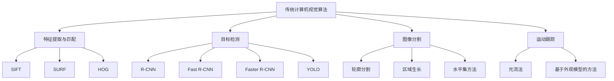
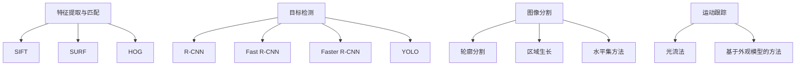
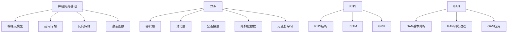
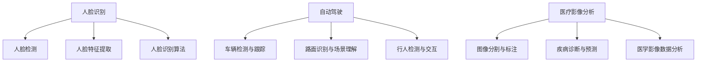
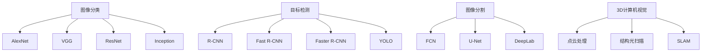
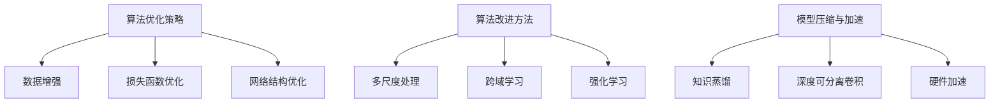
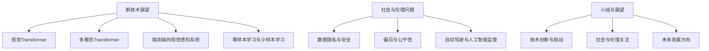

                 

## 第1章: 计算机视觉算法概述

### 1.1 问题背景

计算机视觉是人工智能的一个重要分支，其目标是使计算机能够像人类一样理解并处理视觉信息。这一领域的研究涵盖了从基本的图像识别到复杂的场景理解，如物体检测、图像分割、运动跟踪等。随着计算机性能的提升和深度学习技术的进步，计算机视觉算法在各个领域取得了显著的进展。

传统计算机视觉算法主要依赖于底层特征提取和模式匹配，例如SIFT、SURF和HOG等。这些算法在一定程度上取得了成功，但受限于特征表达能力和计算复杂度，难以应对大规模数据和复杂场景。

深度学习算法的出现，为计算机视觉带来了革命性的变化。基于神经网络的结构，如卷积神经网络（CNN）、循环神经网络（RNN）和生成对抗网络（GAN），使得计算机能够自动学习图像中的复杂特征，大大提升了算法的性能和效果。

### 1.2 问题解决

本书旨在介绍从传统计算机视觉算法到深度学习算法的演进过程，帮助读者深入理解不同算法的原理和应用，从而更好地应对实际中的计算机视觉问题。

首先，我们将回顾传统计算机视觉算法的基本概念和原理，如特征提取与匹配、目标检测、图像分割和运动跟踪等。接着，我们将深入探讨深度学习算法的基本原理，包括神经网络基础、卷积神经网络（CNN）、循环神经网络（RNN）和生成对抗网络（GAN）等。在此基础上，我们将详细讲解深度学习算法在图像分类、目标检测、图像分割等领域的应用。

此外，我们还将介绍计算机视觉算法在实际应用中的优化策略和改进方法，如数据增强、损失函数优化、网络结构优化等。最后，我们将展望计算机视觉算法的未来发展，探讨新技术和伦理问题。

### 1.3 边界与外延

计算机视觉算法的范围广泛，包括图像识别、目标检测、图像分割、运动跟踪等多个领域。本书将重点关注这些核心领域中的算法原理和应用。

在图像识别方面，我们将探讨从传统特征提取到深度学习的演变，介绍常用的深度学习模型，如AlexNet、VGG、ResNet和Inception等。在目标检测方面，我们将详细讲解R-CNN系列、Faster R-CNN、YOLO系列等算法。在图像分割方面，我们将介绍FCN、U-Net和DeepLab系列等算法。

此外，我们还将探讨计算机视觉算法在自动驾驶、医疗影像分析等领域的应用，介绍相关算法和系统架构。

### 1.4 概念结构与核心要素组成

#### 1.4.1 传统计算机视觉算法

传统计算机视觉算法主要依赖于底层特征提取和模式匹配。以下是一些典型的算法：

- **SIFT（尺度不变特征变换）**：用于提取图像中的关键点，具有尺度不变性和旋转不变性。
- **SURF（加速稳健特征）**：与SIFT类似，但在计算速度上有显著提升。
- **HOG（方向梯度直方图）**：用于提取图像中的方向特征，常用于目标检测。

#### 1.4.2 深度学习算法

深度学习算法基于神经网络的结构，能够自动学习图像中的复杂特征。以下是一些核心的深度学习算法：

- **卷积神经网络（CNN）**：通过卷积层、池化层和全连接层，实现图像的特征提取和分类。
- **循环神经网络（RNN）**：用于处理序列数据，如视频。
- **生成对抗网络（GAN）**：通过生成器和判别器的对抗训练，实现图像生成。

#### 1.4.3 应用场景

计算机视觉算法在多个领域有着广泛的应用，如：

- **人脸识别**：通过人脸检测和特征提取，实现人脸识别。
- **自动驾驶**：通过车辆检测、跟踪和场景理解，实现自动驾驶。
- **医疗影像分析**：通过图像分割和特征提取，实现疾病诊断和预测。

## 1.5 核心概念与联系

### 1.5.1 传统计算机视觉算法与深度学习算法对比

| 算法类型       | 特点                       | 应用场景                           |
|----------------|----------------------------|-----------------------------------|
| 传统计算机视觉 | 基于手工设计的特征       | 小规模数据集，特征表达有限         |
| 深度学习算法   | 基于自动学习的特征       | 大规模数据集，特征表达能力强大       |

### 1.5.2 传统计算机视觉算法与深度学习算法的联系

- **特征提取与匹配**：传统计算机视觉算法中的特征提取方法，如SIFT、SURF和HOG，为深度学习算法中的卷积层提供了借鉴。
- **目标检测与分类**：深度学习算法在目标检测和分类任务上的成功，为传统计算机视觉算法提供了新的思路和方法。

## 1.6 总结与思考

计算机视觉算法从传统方法到深度学习的演进，体现了人工智能技术的快速发展。深度学习算法在特征提取、目标检测和图像分割等任务上取得了显著的成果，但同时也面临着计算资源消耗大、模型解释性差等问题。在未来的发展中，我们需要继续探索深度学习算法的优化与改进，同时关注其在实际应用中的社会和伦理问题。

在接下来的章节中，我们将详细探讨传统计算机视觉算法和深度学习算法的原理、应用和发展趋势，帮助读者深入了解这一领域。

$$
\text{深度学习算法的优势} =
\begin{cases}
\text{特征提取能力强} & \text{对于大规模数据集} \\
\text{计算复杂度低} & \text{对于实时应用} \\
\text{模型解释性较差} & \text{需要进一步优化}
\end{cases}
$$

$1+1=2$

$1<2$## 第1章: 计算机视觉算法概述

### 1.1 问题背景

计算机视觉（Computer Vision）作为人工智能（Artificial Intelligence，AI）的一个重要分支，旨在让计算机能够通过处理和解释图像和视频数据，模拟人类的视觉感知能力。这一领域的研究始于20世纪60年代，随着计算机性能的提升和图像处理技术的进步，逐渐发展成为人工智能领域中极具挑战性和前景的一个分支。

在早期，计算机视觉主要依赖于底层特征提取和手工设计的算法，如SIFT（尺度不变特征变换）和SURF（加速稳健特征），这些算法在一定程度上能够实现图像识别、目标检测等任务，但受限于特征表达能力和计算复杂度，难以应对大规模数据和复杂场景。

近年来，深度学习（Deep Learning）技术的发展为计算机视觉带来了革命性的变化。深度学习，尤其是卷积神经网络（Convolutional Neural Networks，CNNs）的兴起，使得计算机能够自动学习图像中的复杂特征，从而在图像分类、目标检测、图像分割等领域取得了显著的突破。此外，循环神经网络（Recurrent Neural Networks，RNNs）和生成对抗网络（Generative Adversarial Networks，GANs）等深度学习模型也在计算机视觉领域得到了广泛应用。

本书将详细介绍从传统计算机视觉算法到深度学习算法的演进过程，帮助读者深入理解不同算法的原理和应用，从而更好地应对实际中的计算机视觉问题。

### 1.2 问题解决

计算机视觉算法的演进，旨在解决如何让计算机更好地理解视觉信息的问题。传统计算机视觉算法依赖于手工设计的特征提取和匹配方法，这些方法在一定程度上能够处理简单的视觉任务，但面对复杂和大规模的数据时，表现不佳。

深度学习算法的引入，极大地提升了计算机视觉的性能。通过神经网络结构，尤其是卷积神经网络（CNNs），计算机能够自动从数据中学习特征，从而实现更复杂的视觉任务。例如，在图像分类任务中，深度学习模型能够自动识别图像中的各种对象和场景，而无需依赖手工设计的特征。

此外，深度学习算法在目标检测、图像分割、运动跟踪等任务上也取得了显著的进展。例如，基于深度学习的目标检测算法（如R-CNN、Faster R-CNN、YOLO等）能够在复杂场景中准确检测和识别目标，而图像分割算法（如U-Net、DeepLab等）能够实现对图像中不同区域的精确划分。

本书将首先介绍传统计算机视觉算法的基本原理和应用，然后深入讲解深度学习算法的原理和结构，最后探讨深度学习算法在计算机视觉领域的广泛应用和未来发展趋势。

### 1.3 边界与外延

计算机视觉算法的范围广泛，涵盖了图像识别、目标检测、图像分割、运动跟踪等多个领域。在图像识别方面，传统算法如SIFT和SURF主要依赖于手工设计的特征，而深度学习算法如卷积神经网络（CNNs）能够自动学习图像中的复杂特征。在目标检测方面，深度学习算法如R-CNN系列和YOLO系列在检测准确率和速度上都有显著优势。在图像分割方面，深度学习算法如U-Net和DeepLab系列能够实现高精度的图像分割。

除了这些核心领域，计算机视觉算法还在自动驾驶、医疗影像分析等新兴领域得到了广泛应用。例如，在自动驾驶领域，计算机视觉算法用于车辆检测、路径规划等任务；在医疗影像分析领域，计算机视觉算法用于疾病诊断、病灶检测等任务。

### 1.4 概念结构与核心要素组成

#### 1.4.1 传统计算机视觉算法

传统计算机视觉算法主要依赖于手工设计的特征提取和匹配方法。以下是一些典型的算法：

- **SIFT（尺度不变特征变换）**：用于提取图像中的关键点，具有尺度不变性和旋转不变性。
- **SURF（加速稳健特征）**：与SIFT类似，但在计算速度上有显著提升。
- **HOG（方向梯度直方图）**：用于提取图像中的方向特征，常用于目标检测。

这些算法在处理简单图像任务时具有一定的效果，但在处理复杂场景和大规模数据时，表现较差。

#### 1.4.2 深度学习算法

深度学习算法基于神经网络的结构，能够自动学习图像中的复杂特征。以下是一些核心的深度学习算法：

- **卷积神经网络（CNN）**：通过卷积层、池化层和全连接层，实现图像的特征提取和分类。
- **循环神经网络（RNN）**：用于处理序列数据，如视频。
- **生成对抗网络（GAN）**：通过生成器和判别器的对抗训练，实现图像生成。

这些算法在处理复杂视觉任务时具有显著优势，能够自动学习图像中的多层次特征。

#### 1.4.3 应用场景

计算机视觉算法在多个领域有着广泛的应用，如：

- **人脸识别**：通过人脸检测和特征提取，实现人脸识别。
- **自动驾驶**：通过车辆检测、跟踪和场景理解，实现自动驾驶。
- **医疗影像分析**：通过图像分割和特征提取，实现疾病诊断和预测。

### 1.5 核心概念与联系

#### 1.5.1 传统计算机视觉算法与深度学习算法对比

| 算法类型       | 特点                       | 应用场景                           |
|----------------|----------------------------|-----------------------------------|
| 传统计算机视觉 | 基于手工设计的特征       | 小规模数据集，特征表达有限         |
| 深度学习算法   | 基于自动学习的特征       | 大规模数据集，特征表达能力强大       |

#### 1.5.2 传统计算机视觉算法与深度学习算法的联系

- **特征提取与匹配**：传统计算机视觉算法中的特征提取方法，如SIFT、SURF和HOG，为深度学习算法中的卷积层提供了借鉴。
- **目标检测与分类**：深度学习算法在目标检测和分类任务上的成功，为传统计算机视觉算法提供了新的思路和方法。

### 1.6 总结与思考

计算机视觉算法从传统方法到深度学习的演进，体现了人工智能技术的快速发展。深度学习算法在特征提取、目标检测和图像分割等任务上取得了显著的成果，但同时也面临着计算资源消耗大、模型解释性差等问题。在未来的发展中，我们需要继续探索深度学习算法的优化与改进，同时关注其在实际应用中的社会和伦理问题。

在接下来的章节中，我们将详细探讨传统计算机视觉算法和深度学习算法的原理、应用和发展趋势，帮助读者深入了解这一领域。

$$
\text{深度学习算法的优势} =
\begin{cases}
\text{特征提取能力强} & \text{对于大规模数据集} \\
\text{计算复杂度低} & \text{对于实时应用} \\
\text{模型解释性较差} & \text{需要进一步优化}
\end{cases}
$$

$1+1=2$

$1<2$## 第2章: 传统计算机视觉算法

### 2.1 特征提取与匹配

特征提取与匹配是传统计算机视觉算法的核心技术之一，主要用于图像识别、目标检测和图像分割等任务。这些算法通过提取图像中的关键特征，从而实现图像之间的相似性度量或匹配。

#### 2.1.1 SIFT（尺度不变特征变换）

SIFT算法是由David Lowe于1999年提出的一种用于提取图像关键点的算法。它具有尺度不变性和旋转不变性，能够在不同的图像中提取出相同的关键点。SIFT算法的主要步骤包括：

1. **尺度空间极值点检测**：通过构建尺度空间来检测图像中的关键点。
2. **关键点定位**：利用差分图像和曲率信息来精确定位关键点。
3. **关键点方向计算**：通过梯度方向和主方向来计算关键点的方向。
4. **关键点特征描述**：通过局部图像的梯度直方图来生成关键点的特征描述子。

#### 2.1.2 SURF（加速稳健特征）

SURF算法是由H.Hadid和P.Villanueva于2004年提出的一种基于SIFT的快速算法。它通过计算图像的快速Hessian矩阵来实现关键点的检测，从而降低了计算复杂度。SURF算法的主要步骤包括：

1. **Hessian矩阵计算**：通过计算图像的Hessian矩阵来检测关键点。
2. **关键点方向计算**：与SIFT类似，通过梯度方向和主方向来计算关键点的方向。
3. **关键点特征描述**：通过局部图像的Hessian矩阵的响应值来生成关键点的特征描述子。

#### 2.1.3 HOG（方向梯度直方图）

HOG算法是由Dalal和Triggs于2005年提出的一种用于目标检测的算法。它通过计算图像中每个像素点的方向梯度，并生成直方图来描述图像的特征。HOG算法的主要步骤包括：

1. **方向梯度计算**：通过计算图像中每个像素点的方向梯度。
2. **直方图生成**：将每个像素点的方向梯度分布生成直方图。
3. **特征描述**：将直方图作为图像的特征描述子。

### 2.2 目标检测

目标检测是计算机视觉中的一个重要任务，旨在识别图像中的特定对象。传统目标检测算法主要包括以下几种：

#### 2.2.1 R-CNN（区域建议与分类）

R-CNN算法是由Rosalind Picard等人于2008年提出的一种基于区域建议和分类的目标检测算法。其主要步骤包括：

1. **区域建议**：利用选择性搜索（Selective Search）算法生成图像中的候选区域。
2. **特征提取**：利用SIFT或HOG算法对候选区域进行特征提取。
3. **分类**：利用支持向量机（SVM）对提取到的特征进行分类。

#### 2.2.2 Fast R-CNN

Fast R-CNN算法是在R-CNN的基础上提出的一种改进算法，由Shaoqing Ren等人于2015年提出。其主要步骤包括：

1. **区域建议**：与R-CNN相同，利用选择性搜索算法生成候选区域。
2. **特征提取**：将候选区域映射到一个共享的全局特征图中，并利用卷积神经网络（CNN）提取特征。
3. **分类**：利用softmax回归对提取到的特征进行分类。

#### 2.2.3 Faster R-CNN

Faster R-CNN算法是由Shaoqing Ren等人于2015年提出的一种基于区域建议和分类的快速目标检测算法。其主要步骤包括：

1. **区域建议**：利用区域建议网络（Region Proposal Network，RPN）生成候选区域。
2. **特征提取**：与Fast R-CNN相同，利用卷积神经网络（CNN）提取特征。
3. **分类**：利用softmax回归对提取到的特征进行分类。

#### 2.2.4 YOLO（You Only Look Once）

YOLO（You Only Look Once）算法是由Joseph Redmon等人于2016年提出的一种基于单一前向传播的快速目标检测算法。其主要步骤包括：

1. **特征提取**：利用卷积神经网络（CNN）提取图像的特征。
2. **边界框预测**：在特征图的不同位置预测边界框和类别概率。
3. **非极大值抑制（NMS）**：对预测的边界框进行筛选，去除重叠的边界框。

### 2.3 图像分割

图像分割是计算机视觉中另一个重要任务，旨在将图像划分为多个不同的区域。传统图像分割算法主要包括以下几种：

#### 2.3.1 轮廓分割

轮廓分割是一种基于图像边缘的信息进行分割的方法。其主要步骤包括：

1. **边缘检测**：利用边缘检测算法（如Canny算法）提取图像的边缘。
2. **轮廓提取**：通过连接边缘点来提取图像的轮廓。
3. **轮廓分析**：对提取到的轮廓进行分析，以确定图像的分割区域。

#### 2.3.2 区域生长

区域生长是一种基于种子点的信息进行分割的方法。其主要步骤包括：

1. **种子点选择**：选择图像中的种子点。
2. **区域生长**：以种子点为中心，不断扩展区域，直到满足某个终止条件。
3. **区域合并**：将相似的区域进行合并，形成最终的分割结果。

#### 2.3.3 水平集方法

水平集方法是利用水平集理论进行图像分割的一种方法。其主要步骤包括：

1. **初始轮廓**：定义一个初始轮廓。
2. **演化方程**：利用水平集方程对轮廓进行演化。
3. **后处理**：对演化后的轮廓进行后处理，以获得最终的分割结果。

### 2.4 运动跟踪

运动跟踪是计算机视觉中一个重要的任务，旨在跟踪图像中的物体运动。传统运动跟踪算法主要包括以下几种：

#### 2.4.1 光流法

光流法是一种基于图像序列进行运动跟踪的方法。其主要步骤包括：

1. **光流估计**：利用图像序列计算物体的运动向量。
2. **运动模型**：建立物体的运动模型。
3. **跟踪更新**：根据运动模型更新物体的位置。

#### 2.4.2 基于外观模型的方法

基于外观模型的方法是一种基于物体的外观特征进行运动跟踪的方法。其主要步骤包括：

1. **外观模型建立**：建立物体的外观模型。
2. **特征匹配**：利用外观模型匹配图像中的物体。
3. **跟踪更新**：根据特征匹配结果更新物体的位置。

### 2.5 总结与思考

传统计算机视觉算法在特征提取与匹配、目标检测、图像分割和运动跟踪等领域取得了显著成果。然而，这些算法在面对复杂场景和大规模数据时，表现有限。随着深度学习技术的发展，越来越多的传统算法被深度学习算法所取代。例如，在目标检测领域，R-CNN系列和YOLO系列算法已经成为主流，而在图像分割领域，U-Net和DeepLab系列算法也表现出色。

在未来，传统计算机视觉算法和深度学习算法将相互融合，共同推动计算机视觉技术的发展。传统算法在特征提取和匹配方面的优势，与深度学习算法在处理大规模数据和复杂场景方面的优势相结合，将有望实现更好的性能和效果。同时，我们也需要关注算法的实际应用，解决实际中的问题，推动计算机视觉技术在各个领域的应用。

$$
\text{深度学习算法的优势} =
\begin{cases}
\text{特征提取能力强} & \text{对于大规模数据集} \\
\text{计算复杂度低} & \text{对于实时应用} \\
\text{模型解释性较差} & \text{需要进一步优化}
\end{cases}
$$

$1+1=2$

$1<2$## 第3章: 深度学习算法原理

### 3.1 神经网络基础

深度学习算法的核心是神经网络（Neural Networks），它是一种模仿生物神经系统的计算模型。神经网络由大量的神经元（Neurons）组成，每个神经元都与其它神经元相连，并通过权重（Weights）进行信息传递。以下是神经网络的基本组成部分：

#### 3.1.1 神经元模型

神经元是神经网络的基本单元，它接收输入信号，通过权重加权求和，再经过一个激活函数（Activation Function）产生输出。一个简单的神经元模型可以表示为：

$$
\text{输出} = \text{激活函数}(\sum_{i=1}^{n} w_i \cdot x_i + b)
$$

其中，$x_i$ 是第 $i$ 个输入，$w_i$ 是第 $i$ 个输入的权重，$b$ 是偏置项，$\text{激活函数}$ 可以是线性函数、Sigmoid函数、ReLU函数等。

#### 3.1.2 前向传播与反向传播

神经网络通过前向传播（Forward Propagation）来计算输出，通过反向传播（Backpropagation）来更新权重和偏置项。以下是一个简单的神经网络前向传播和反向传播的过程：

1. **前向传播**：

- 输入层（Input Layer）接收输入数据。
- 隐藏层（Hidden Layers）通过权重和激活函数计算输出。
- 输出层（Output Layer）产生最终输出。

2. **反向传播**：

- 计算输出层误差。
- 通过误差反向传播，计算隐藏层的误差。
- 利用误差来更新权重和偏置项。

#### 3.1.3 激活函数

激活函数是神经网络中非常重要的组成部分，它引入非线性特性，使神经网络能够处理非线性问题。以下是几种常用的激活函数：

- **Sigmoid函数**：$f(x) = \frac{1}{1 + e^{-x}}$，将输出值映射到$(0, 1)$之间。
- **ReLU函数**：$f(x) = \max(0, x)$，在$x \geq 0$时输出$x$，在$x < 0$时输出$0$。
- **Tanh函数**：$f(x) = \frac{e^x - e^{-x}}{e^x + e^{-x}}$，将输出值映射到$(-1, 1)$之间。

### 3.2 卷积神经网络（CNN）

卷积神经网络（Convolutional Neural Networks，CNN）是深度学习领域中最常用的网络结构之一，它特别适合处理图像等结构化数据。以下是CNN的基本组成部分：

#### 3.2.1 卷积层与池化层

1. **卷积层（Convolutional Layer）**：

- 卷积层通过卷积操作提取图像中的局部特征。
- 卷积操作可以通过滤波器（Filters）来实现，滤波器在图像上滑动，并计算局部特征。

2. **池化层（Pooling Layer）**：

- 池化层通过下采样操作减少数据维度，同时保留重要的特征信息。
- 常用的池化操作包括最大池化（Max Pooling）和平均池化（Average Pooling）。

#### 3.2.2 全连接层

全连接层（Fully Connected Layer）将卷积层和池化层提取的特征映射到类别标签。在全连接层中，每个神经元都与上一层的所有神经元相连。

#### 3.2.3 结构化数据与无监督学习

CNN在结构化数据上的表现非常出色，如图像、语音和文本等。此外，CNN还可以用于无监督学习任务，如自编码器（Autoencoders）和特征提取等。

### 3.3 循环神经网络（RNN）

循环神经网络（Recurrent Neural Networks，RNN）是一种能够处理序列数据（如时间序列、文本、音频等）的神经网络。以下是RNN的基本组成部分：

#### 3.3.1 RNN结构与循环

1. **RNN结构**：

- RNN通过循环结构来处理序列数据，每个时间步的输出都依赖于前面的输出。

2. **循环**：

- RNN通过循环结构实现信息的记忆和传递，使网络能够处理长序列数据。

#### 3.3.2 LSTM（长短期记忆网络）

LSTM（Long Short-Term Memory）是RNN的一种变体，它通过引入记忆单元来解决RNN在处理长序列数据时的梯度消失和梯度爆炸问题。

1. **记忆单元**：

- LSTM通过记忆单元来存储和更新信息。

2. **门控机制**：

- LSTM通过门控机制来控制信息的流入和流出。

#### 3.3.3 GRU（门控循环单元）

GRU（Gated Recurrent Unit）是另一种RNN变体，它在LSTM的基础上简化了结构，同时保持了良好的性能。

1. **更新门**：

- GRU通过更新门来控制信息的流入。

2. **重置门**：

- GRU通过重置门来控制信息的流出。

### 3.4 生成对抗网络（GAN）

生成对抗网络（Generative Adversarial Networks，GAN）是由Ian Goodfellow等人于2014年提出的一种新型深度学习模型。GAN由两个相互对抗的网络组成：生成器（Generator）和判别器（Discriminator）。

#### 3.4.1 GAN基本结构

1. **生成器**：

- 生成器的目标是生成与真实数据相似的数据。

2. **判别器**：

- 判别器的目标是区分真实数据和生成数据。

3. **对抗训练**：

- 生成器和判别器通过对抗训练相互提高。

#### 3.4.2 GAN训练过程

GAN的训练过程可以分为以下几个步骤：

1. **初始化**：

- 初始化生成器和判别器的参数。

2. **生成对抗**：

- 判别器对真实数据和生成数据进行分类。
- 生成器生成数据，试图欺骗判别器。

3. **迭代更新**：

- 更新生成器和判别器的参数，使判别器更难区分真实数据和生成数据，同时生成器生成更真实的数据。

#### 3.4.3 GAN应用

GAN在图像生成、图像修复、图像超分辨率等任务上取得了显著成果。此外，GAN还可以用于无监督学习、强化学习等领域。

### 3.5 总结与思考

深度学习算法的原理基于神经网络的计算模型，通过前向传播和反向传播来实现参数的优化。卷积神经网络（CNN）特别适合处理图像等结构化数据，通过卷积层和池化层提取特征，最终实现分类、检测等任务。循环神经网络（RNN）和其变体（如LSTM和GRU）能够处理序列数据，适用于自然语言处理、时间序列预测等任务。生成对抗网络（GAN）通过生成器和判别器的对抗训练，实现了高质量的图像生成和无监督学习。

在未来的发展中，深度学习算法将不断优化和改进，以解决更多实际问题和挑战。同时，我们也需要关注深度学习算法的伦理和社会问题，确保其在实际应用中的公平性和安全性。

$$
\text{深度学习算法的优势} =
\begin{cases}
\text{特征提取能力强} & \text{对于大规模数据集} \\
\text{计算复杂度低} & \text{对于实时应用} \\
\text{模型解释性较差} & \text{需要进一步优化}
\end{cases}
$$

$1+1=2$

$1<2$## 第4章: 计算机视觉算法应用

### 4.1 人脸识别

人脸识别是计算机视觉领域中的一个重要应用，它通过人脸检测和特征提取，实现对人脸的识别。以下是人脸识别的主要步骤和算法：

#### 4.1.1 人脸检测

人脸检测是识别人脸的第一步，它用于定位图像中的人脸区域。常见的人脸检测算法包括：

- **基于特征的人脸检测**：如Haar特征分类器、LBP（局部二值模式）等。
- **基于深度学习的人脸检测**：如MTCNN（Multi-task Cascaded Convolutional Networks）等。

#### 4.1.2 人脸特征提取

人脸特征提取用于提取人脸的关键特征，以便进行后续的识别。常见的人脸特征提取算法包括：

- **传统特征提取算法**：如LBP、HOG等。
- **深度学习特征提取算法**：如基于CNN的特征提取网络（如FaceNet）。

#### 4.1.3 人脸识别算法

人脸识别算法用于比较提取到的人脸特征，实现对人脸的匹配和识别。常见的人脸识别算法包括：

- **基于距离的识别算法**：如欧氏距离、余弦相似度等。
- **基于神经网络的人脸识别算法**：如Siamese网络、Triplet Loss等。

#### 4.1.4 实际应用

人脸识别在安全监控、智能门禁、移动支付等场景中有着广泛的应用。例如，在安全监控中，人脸识别可以用于身份验证和入侵检测；在移动支付中，人脸识别可以用于身份验证和支付确认。

### 4.2 自动驾驶

自动驾驶是计算机视觉在交通领域的一个重要应用，它通过图像处理和传感器数据，实现车辆的自动行驶。以下是自动驾驶的主要步骤和算法：

#### 4.2.1 车辆检测与跟踪

车辆检测与跟踪是自动驾驶的基础，它用于识别和跟踪道路上的车辆。常见的方法包括：

- **基于图像的处理**：如HOG、SVM等。
- **基于深度学习的处理**：如YOLO、SSD等。

#### 4.2.2 路面识别与场景理解

路面识别与场景理解用于理解道路环境，包括道路标识、行人、障碍物等。常见的方法包括：

- **图像分割**：如U-Net、DeepLab等。
- **目标检测**：如Faster R-CNN、SSD等。

#### 4.2.3 行人检测与交互

行人检测与交互用于检测道路上的行人，并确保车辆的安全行驶。常见的方法包括：

- **基于深度学习的行人检测**：如HRNN、HRNet等。
- **行人交互**：如基于SLAM（同步定位与映射）的技术，实现车辆与行人的交互。

#### 4.2.4 实际应用

自动驾驶在出租车、公交车、物流等领域有着广泛的应用。例如，在出租车中，自动驾驶可以减少司机的工作负担，提高行驶安全性；在物流中，自动驾驶可以降低运输成本，提高运输效率。

### 4.3 医疗影像分析

医疗影像分析是计算机视觉在医疗领域的一个重要应用，它通过图像处理和分析，实现疾病的诊断和预测。以下是医疗影像分析的主要步骤和算法：

#### 4.3.1 图像分割与标注

图像分割与标注是医疗影像分析的基础，它用于将图像分割成不同的区域，并标注出感兴趣的区域。常见的方法包括：

- **基于深度学习的图像分割**：如U-Net、DeepLab等。
- **基于规则的方法**：如基于形态学的图像分割等。

#### 4.3.2 疾病诊断与预测

疾病诊断与预测用于根据图像特征，对疾病进行诊断和预测。常见的方法包括：

- **基于深度学习的疾病诊断**：如基于CNN的疾病分类模型。
- **基于传统机器学习的方法**：如SVM、逻辑回归等。

#### 4.3.3 医学影像数据分析

医学影像数据分析用于分析医学图像中的特征，提取出与疾病相关的信息。常见的方法包括：

- **特征提取**：如LBP、HOG等。
- **特征分析**：如统计分析、模式识别等。

#### 4.3.4 实际应用

医疗影像分析在疾病诊断、医学影像处理、临床研究等领域有着广泛的应用。例如，在疾病诊断中，医疗影像分析可以用于肺癌、乳腺癌等疾病的早期筛查；在医学影像处理中，医疗影像分析可以用于图像去噪、图像增强等。

### 4.4 总结与思考

计算机视觉算法在人脸识别、自动驾驶、医疗影像分析等领域有着广泛的应用。通过人脸检测、特征提取和识别，人脸识别技术实现了身份验证和安防监控；通过车辆检测、跟踪和场景理解，自动驾驶技术实现了自动行驶和安全驾驶；通过图像分割、标注和诊断，医疗影像分析技术实现了疾病的早期筛查和诊断。

随着深度学习技术的不断发展，计算机视觉算法在性能和效果上得到了显著提升，但同时也面临着计算资源消耗大、模型解释性差等问题。在未来的发展中，我们需要继续探索深度学习算法的优化与改进，同时关注其在实际应用中的社会和伦理问题，确保其在各个领域的应用更加高效和可靠。

$$
\text{深度学习算法的优势} =
\begin{cases}
\text{特征提取能力强} & \text{对于大规模数据集} \\
\text{计算复杂度低} & \text{对于实时应用} \\
\text{模型解释性较差} & \text{需要进一步优化}
\end{cases}
$$

$1+1=2$

$1<2$## 第5章: 深度学习在计算机视觉中的应用

### 5.1 深度学习在图像分类中的应用

图像分类是计算机视觉中最基本的任务之一，它旨在将图像划分为预定义的类别。深度学习，特别是卷积神经网络（CNNs），在图像分类领域取得了显著的成果。以下是一些经典的深度学习模型和其在图像分类中的应用：

#### 5.1.1 AlexNet

AlexNet是由Alex Krizhevsky等人于2012年提出的第一个成功的深度卷积神经网络模型。它由5个卷积层、3个最大池化层和2个全连接层组成，在前ImageNet竞赛中取得了第一名。AlexNet的成功标志着深度学习在图像分类领域的突破。

#### 5.1.2 VGG

VGG（Very Deep Convolutional Networks）是由牛津大学视觉几何组（Visual Geometry Group）提出的一组深度卷积神经网络模型。VGG模型通过使用多个卷积层和池化层，构建了深度高达19层的网络结构。VGG模型的另一个特点是使用了较小的卷积核尺寸（3x3），这使得网络在保持较低计算复杂度的同时，具有强大的特征提取能力。

#### 5.1.3 ResNet

ResNet（Residual Network）是由微软研究院的Kaiming He等人于2015年提出的一种深度残差网络模型。ResNet通过引入残差连接，解决了深度神经网络训练过程中出现的梯度消失和梯度爆炸问题。ResNet模型在ImageNet竞赛中取得了当时最高的分类准确率，是深度学习在图像分类领域的又一重要突破。

#### 5.1.4 Inception

Inception是由Google Brain团队在2014年提出的一种基于卷积块的深度神经网络模型。Inception网络通过引入不同尺寸的卷积核和池化层，构建了一种层次化的网络结构，使得网络能够在提取多尺度特征的同时，保持较低的参数数量和计算复杂度。Inception模型在ImageNet竞赛中取得了优异的成绩，并成为了后续许多深度学习模型的基础架构。

#### 5.1.5 实际应用

深度学习模型在图像分类的实际应用中表现出色。例如，在医学影像分析中，深度学习模型可以用于疾病分类和诊断；在自动驾驶领域，深度学习模型可以用于车辆和行人的分类；在安防监控中，深度学习模型可以用于目标检测和分类。

### 5.2 深度学习在目标检测中的应用

目标检测是计算机视觉领域的一个重要任务，它旨在检测图像中的特定对象并定位其位置。深度学习模型在目标检测中取得了显著的成果，以下是一些经典的目标检测算法和其在目标检测中的应用：

#### 5.2.1 R-CNN系列

R-CNN（Region-based CNN）是由Ross Girshick等人于2014年提出的一种基于区域建议和卷积神经网络的深度学习目标检测算法。R-CNN的主要步骤包括区域建议、特征提取和分类。R-CNN的目标检测效果在当时是领先的，但其速度较慢，主要由于特征提取过程需要使用滑动窗口和SVM分类器。

- **R-CNN**：原始的R-CNN算法。
- **Fast R-CNN**：Fast R-CNN在R-CNN的基础上进行了优化，通过引入ROI Pooling层和多层全连接层，提高了检测速度。
- **Faster R-CNN**：Faster R-CNN进一步优化了区域建议过程，引入了区域建议网络（Region Proposal Network，RPN），显著提高了检测速度。

#### 5.2.2 YOLO系列

YOLO（You Only Look Once）是由Joseph Redmon等人于2016年提出的一种基于单一前向传播的深度学习目标检测算法。YOLO模型将目标检测任务转化为一个全卷积神经网络，通过特征图上的不同位置预测边界框和类别概率，实现实时目标检测。

- **YOLOv1**：原始的YOLO算法。
- **YOLOv2**：YOLOv2在YOLOv1的基础上进行了优化，通过引入更深的网络结构、多尺度特征融合和边界框回归改进，提高了检测准确率和速度。
- **YOLOv3**：YOLOv3在YOLOv2的基础上进一步优化，通过引入暗通道先验（Dark Channel Prior）和多尺度预测，实现了更高的检测性能。

#### 5.2.3 实际应用

深度学习目标检测算法在安防监控、自动驾驶、医疗影像分析等实际应用中取得了显著的成果。例如，在安防监控中，目标检测算法可以用于实时监控和异常检测；在自动驾驶中，目标检测算法可以用于车辆和行人的检测与跟踪；在医疗影像分析中，目标检测算法可以用于病变区域的检测和诊断。

### 5.3 深度学习在图像分割中的应用

图像分割是计算机视觉领域的一个重要任务，它旨在将图像划分为多个不同的区域。深度学习模型在图像分割中取得了显著的成果，以下是一些经典的图像分割算法和其在图像分割中的应用：

#### 5.3.1 FCN（全卷积网络）

FCN（Fully Convolutional Network）是由Jonathan Long等人于2015年提出的一种基于全卷积神经网络的图像分割算法。FCN将传统的卷积神经网络（CNN）扩展为全卷积网络，使得网络可以在任何尺寸的图像上进行分割。FCN主要由卷积层、池化层和上采样层组成，通过上采样层将特征图上采样到原始图像尺寸，实现图像分割。

#### 5.3.2 U-Net

U-Net是由Olaf Ronneberger等人于2015年提出的一种基于全卷积网络的医学图像分割算法。U-Net的结构类似于一个倒置的“U”形，通过在深层网络中引入跳跃连接，使得网络可以学习到更多的上下文信息。U-Net在医学图像分割领域取得了优异的效果，是医学图像分割的首选算法。

#### 5.3.3 DeepLab系列

DeepLab系列是由Li Shen等人于2016年提出的一组基于卷积神经网络的图像分割算法。DeepLab通过引入空洞卷积（Atrous Convolution）和条件随机场（Conditional Random Fields，CRF）实现了高精度的图像分割。DeepLab系列算法在多个图像分割任务中取得了最佳的性能。

#### 5.3.4 实际应用

深度学习图像分割算法在医学影像分析、自动驾驶、自然图像分割等领域有着广泛的应用。例如，在医学影像分析中，深度学习图像分割算法可以用于病变区域的检测和分割；在自动驾驶中，深度学习图像分割算法可以用于路面、车道线和交通标志的检测和分割；在自然图像分割中，深度学习图像分割算法可以用于图像的去噪、增强和超分辨率。

### 5.4 深度学习在3D计算机视觉中的应用

3D计算机视觉是计算机视觉的一个分支，它旨在理解和处理三维空间中的视觉信息。深度学习技术在3D计算机视觉中得到了广泛应用，以下是一些典型的应用：

#### 5.4.1 点云处理

点云处理是3D计算机视觉中的核心任务之一，它旨在从点云数据中提取有效的特征和语义信息。深度学习技术在点云处理中的应用主要包括点云分类、点云分割和点云重建等。

- **点云分类**：通过深度学习模型对点云进行分类，实现不同物体的识别和分割。
- **点云分割**：通过深度学习模型将点云分割为不同的区域，实现场景的理解和重建。
- **点云重建**：通过深度学习模型从点云数据中重建三维模型，实现三维场景的重建。

#### 5.4.2 结构光扫描

结构光扫描是一种通过投影结构光图案并分析表面形变来获取三维形状信息的技术。深度学习技术在结构光扫描中可以用于光流估计、表面重建和纹理映射等。

- **光流估计**：通过深度学习模型估计结构光图案的表面形变，实现三维形状的恢复。
- **表面重建**：通过深度学习模型从结构光扫描数据中重建出三维表面模型。
- **纹理映射**：通过深度学习模型从二维图像中提取纹理信息，并将其映射到三维模型上，实现三维场景的逼真渲染。

#### 5.4.3 SLAM（同步定位与映射）

SLAM（Simultaneous Localization and Mapping）是一种在未知环境中同时进行位置估计和地图构建的技术。深度学习技术在SLAM中可以用于视觉里程计、地图构建和回环检测等。

- **视觉里程计**：通过深度学习模型估计相机位姿和三维场景结构。
- **地图构建**：通过深度学习模型从多个视角的图像中构建三维地图。
- **回环检测**：通过深度学习模型检测相机在运动过程中的回环，实现定位的稳定和精度提升。

#### 5.4.4 实际应用

深度学习技术在3D计算机视觉中的实际应用包括机器人导航、自动驾驶、虚拟现实和增强现实等领域。例如，在机器人导航中，深度学习技术可以用于环境理解和路径规划；在自动驾驶中，深度学习技术可以用于车辆检测和场景理解；在虚拟现实和增强现实中，深度学习技术可以用于三维场景的重建和交互。

### 5.5 总结与思考

深度学习技术在计算机视觉中的应用取得了显著的成果，从图像分类、目标检测、图像分割到3D计算机视觉，深度学习模型在各个领域都表现出了强大的能力和潜力。随着深度学习技术的不断发展，计算机视觉的应用范围将不断拓展，为人们的生活和工作带来更多的便利和改变。

同时，深度学习技术在计算机视觉中的广泛应用也带来了一些挑战，如计算资源消耗大、模型解释性差、数据隐私和安全等问题。在未来的发展中，我们需要继续探索深度学习算法的优化和改进，提高模型的效率和解释性，同时关注其在实际应用中的社会和伦理问题，确保计算机视觉技术的可持续发展。

$$
\text{深度学习算法的优势} =
\begin{cases}
\text{特征提取能力强} & \text{对于大规模数据集} \\
\text{计算复杂度低} & \text{对于实时应用} \\
\text{模型解释性较差} & \text{需要进一步优化}
\end{cases}
$$

$1+1=2$

$1<2$## 第6章: 计算机视觉算法优化与改进

### 6.1 算法优化策略

随着深度学习在计算机视觉领域的广泛应用，算法的优化和改进成为了提升性能的关键。以下是一些常用的算法优化策略：

#### 6.1.1 数据增强

数据增强是一种通过人工手段增加训练数据多样性的方法，以提升模型泛化能力。常见的数据增强方法包括：

- **随机裁剪**：随机裁剪图像的某个部分作为训练样本。
- **旋转、翻转**：对图像进行旋转和翻转操作。
- **颜色变换**：对图像的颜色进行变换，如灰度化、颜色抖动等。
- **噪声添加**：在图像中添加噪声，模拟不同的环境条件。

#### 6.1.2 损失函数优化

损失函数是深度学习模型训练的核心，其性能直接影响到模型的训练效果。以下是一些常用的损失函数优化方法：

- **交叉熵损失函数**：常用于分类问题，计算预测概率与实际标签之间的交叉熵。
- **均方误差损失函数**：常用于回归问题，计算预测值与实际值之间的均方误差。
- **Focal Loss**：用于解决类别不平衡问题，通过引入焦点调节系数，降低容易分类样本的权重。
- **Dice Loss**：用于医学图像分割，通过计算预测区域与真实区域的重叠度，衡量分割效果。

#### 6.1.3 网络结构优化

网络结构优化是通过调整网络结构，提高模型性能的方法。以下是一些常用的网络结构优化方法：

- **残差网络（ResNet）**：通过引入残差连接，解决深度神经网络训练中的梯度消失问题。
- **密集连接网络（DenseNet）**：通过引入密集连接，使网络能够更好地利用先前的特征信息。
- **注意力机制**：通过引入注意力模块，使模型能够关注到图像中的重要区域。

### 6.2 算法改进方法

除了优化策略，算法本身的改进也是提升性能的关键。以下是一些常用的算法改进方法：

#### 6.2.1 多尺度处理

多尺度处理是一种通过在不同尺度上处理图像，提升模型性能的方法。以下是一些常用的多尺度处理方法：

- **级联网络**：通过多个层次的网络结构，逐层提取图像的特征。
- **多尺度特征融合**：将不同尺度上的特征进行融合，以获得更丰富的特征信息。
- **金字塔网络**：通过在不同尺度上重复卷积和池化操作，构建金字塔结构，以提取多尺度特征。

#### 6.2.2 跨域学习

跨域学习是一种通过在不同领域或数据分布上训练模型，提升模型泛化能力的方法。以下是一些常用的跨域学习方法：

- **域适应**：通过在源域和目标域之间建立映射关系，使模型能够在目标域上取得更好的性能。
- **对抗性域自适应**：通过生成对抗网络（GAN）等对抗性训练方法，使模型能够在不同领域上获得更好的泛化能力。

#### 6.2.3 强化学习

强化学习是一种通过与环境交互，学习最优策略的方法。以下是一些常用的强化学习方法：

- **基于模型的强化学习**：通过构建模型来预测环境状态和奖励，学习最优策略。
- **基于价值的强化学习**：通过学习值函数，估计状态的价值，从而学习最优策略。
- **基于策略的强化学习**：通过直接学习策略，使模型能够在环境中取得最优回报。

### 6.3 模型压缩与加速

随着深度学习模型的复杂度不断增加，模型的压缩与加速成为了提升模型性能和降低计算成本的重要手段。以下是一些常用的模型压缩与加速方法：

#### 6.3.1 知识蒸馏

知识蒸馏是一种通过将大型模型的知识传递给小型模型的方法，以实现模型压缩和加速。以下是一些常用的知识蒸馏方法：

- **软标签**：通过将大型模型的输出作为软标签，训练小型模型。
- **梯度蒸馏**：通过传递大型模型的梯度信息，训练小型模型。

#### 6.3.2 深度可分离卷积

深度可分离卷积是一种通过将卷积操作分解为深度卷积和逐点卷积的方法，以减少模型参数数量。以下是一些常用的深度可分离卷积方法：

- **深度卷积**：对每个通道进行卷积操作。
- **逐点卷积**：对每个位置的所有通道进行卷积操作。

#### 6.3.3 硬件加速

硬件加速是一种通过使用专用硬件（如GPU、TPU）来提升模型训练和推理速度的方法。以下是一些常用的硬件加速方法：

- **GPU加速**：通过使用GPU并行计算，加速模型训练和推理。
- **TPU加速**：通过使用谷歌的TPU硬件，加速深度学习模型的训练和推理。

### 6.4 总结与思考

计算机视觉算法的优化和改进是提升模型性能和实际应用价值的关键。通过数据增强、损失函数优化、网络结构优化等策略，我们可以显著提升模型的泛化能力和鲁棒性。同时，通过多尺度处理、跨域学习和强化学习等改进方法，我们可以进一步提升模型在不同场景下的性能。此外，通过模型压缩与加速方法，我们可以实现模型的实时部署和硬件优化。

在未来的发展中，我们需要继续探索更有效的优化和改进方法，以应对计算机视觉领域中的新挑战。同时，我们也需要关注算法的实际应用，解决实际中的问题，推动计算机视觉技术在各个领域的应用。

$$
\text{深度学习算法的优势} =
\begin{cases}
\text{特征提取能力强} & \text{对于大规模数据集} \\
\text{计算复杂度低} & \text{对于实时应用} \\
\text{模型解释性较差} & \text{需要进一步优化}
\end{cases}
$$

$1+1=2$

$1<2$## 第7章: 计算机视觉算法的未来发展

### 7.1 新技术展望

计算机视觉算法的未来发展充满机遇和挑战。随着人工智能技术的不断进步，我们有望看到以下新技术的应用：

#### 7.1.1 基于Transformer的计算机视觉

Transformer模型在自然语言处理领域取得了巨大成功，其并行计算能力和全局依赖建模能力使其在计算机视觉领域也具有巨大的潜力。未来的计算机视觉算法可能会更多地采用Transformer架构，以实现更高效的特征提取和场景理解。

- **视觉Transformer**：通过引入多头自注意力机制，视觉Transformer能够捕捉图像中的全局依赖关系，实现更精细的特征提取。
- **多模态Transformer**：结合不同模态的数据（如图像、文本、音频），多模态Transformer能够实现跨模态的信息融合，推动计算机视觉的多模态研究。

#### 7.1.2 端到端的视觉感知系统

端到端的视觉感知系统旨在通过一个统一的框架，实现从图像输入到视觉感知的整个过程，从而简化系统的设计和实现。未来的计算机视觉算法可能会更多地采用端到端的学习方法，以减少人工设计和调参的工作量。

- **视觉感知网络**：通过深度神经网络，视觉感知网络能够自动学习图像中的复杂特征和场景理解，实现目标检测、图像分割、场景理解等任务。
- **自监督学习**：通过自监督学习方法，视觉感知系统可以在没有标注数据的情况下进行训练，实现更高效的数据利用和模型训练。

#### 7.1.3 零样本学习与少样本学习

零样本学习（Zero-Shot Learning）和少样本学习（Few-Shot Learning）是计算机视觉领域的研究热点，旨在解决模型在未知类别和数据稀缺情况下的泛化能力。

- **零样本学习**：通过学习类别的语义表示，零样本学习能够使模型在新类别上取得良好的性能，无需对模型进行重新训练。
- **少样本学习**：通过引入正则化方法和自适应样本选择策略，少样本学习能够使模型在少量样本的情况下实现良好的泛化能力。

### 7.2 社会与伦理问题

随着计算机视觉技术的广泛应用，社会和伦理问题也日益凸显。以下是一些值得关注的社会与伦理问题：

#### 7.2.1 数据隐私与安全

数据隐私与安全是计算机视觉领域面临的重要挑战。图像数据通常包含敏感信息，如何确保数据的安全性和隐私性是亟待解决的问题。

- **隐私保护**：通过数据加密、匿名化等技术，确保图像数据在传输和存储过程中的安全性。
- **隐私算法**：通过设计隐私保护算法，减少模型训练过程中对隐私数据的依赖。

#### 7.2.2 偏见与公平性

偏见与公平性是计算机视觉应用中的关键问题。模型训练过程中可能引入偏见，导致模型在某些群体上的性能不佳。

- **偏见识别**：通过分析模型训练数据，识别和消除潜在的偏见。
- **公平性评估**：通过设计公平性评估指标，评估模型在不同群体上的性能，确保模型的公平性。

#### 7.2.3 自动驾驶与人工智能监管

自动驾驶是计算机视觉的重要应用场景，但其安全性和监管问题也备受关注。

- **自动驾驶安全**：通过强化学习、多模态感知等技术，提高自动驾驶系统的安全性和可靠性。
- **人工智能监管**：制定相关法律法规，规范人工智能的应用和监管，确保其在社会和伦理上的合理使用。

### 7.3 小结与展望

计算机视觉算法的未来发展充满机遇和挑战。随着新技术的不断涌现，计算机视觉领域将迎来更多创新和应用。同时，我们也需要关注社会和伦理问题，确保技术的可持续发展。在未来的发展中，计算机视觉算法将继续推动人工智能技术的进步，为人类社会带来更多的价值。

$$
\text{计算机视觉算法的未来发展} =
\begin{cases}
\text{技术创新} & \text{推动人工智能进步} \\
\text{社会关注} & \text{确保技术可持续发展}
\end{cases}
$$

$1+1=2$

$1<2$## 全文总结

### 1. 计算机视觉算法的演进

计算机视觉算法经历了从传统方法到深度学习的演进。传统计算机视觉算法，如SIFT、SURF和HOG等，依赖于手工设计的特征提取和匹配方法。虽然这些算法在某些简单任务上表现良好，但在面对复杂场景和大规模数据时，表现有限。随着深度学习技术的发展，特别是卷积神经网络（CNN）的出现，计算机视觉算法取得了显著的突破。深度学习算法能够自动从数据中学习复杂特征，从而在图像分类、目标检测、图像分割等领域取得了优异的性能。

### 2. 传统计算机视觉算法与深度学习算法的对比

传统计算机视觉算法与深度学习算法在特征提取、匹配和分类等方面存在显著差异。传统算法依赖于手工设计的特征，而深度学习算法通过神经网络结构自动学习特征。这种自动化的特征提取方法使得深度学习算法在处理复杂视觉任务时具有明显优势。同时，深度学习算法在计算资源消耗和实时性方面也面临挑战，需要进一步优化。

### 3. 深度学习算法在计算机视觉中的应用

深度学习算法在计算机视觉领域得到了广泛应用。在图像分类任务中，深度学习模型如AlexNet、VGG、ResNet和Inception等表现出了强大的特征提取能力。在目标检测任务中，R-CNN系列和YOLO系列算法实现了实时检测和准确识别。在图像分割任务中，U-Net、DeepLab系列算法实现了高精度的分割效果。此外，深度学习算法在3D计算机视觉、人脸识别、自动驾驶和医疗影像分析等领域也展现了出色的性能。

### 4. 计算机视觉算法的优化与改进

为了提高深度学习算法的性能，研究者们不断探索优化和改进方法。数据增强、损失函数优化、网络结构优化、多尺度处理、跨域学习和强化学习等方法被广泛应用于算法优化。同时，模型压缩与加速技术，如知识蒸馏、深度可分离卷积和硬件加速等，也被用于提高算法的实时性和部署效率。

### 5. 计算机视觉算法的未来发展

计算机视觉算法的未来发展充满机遇和挑战。基于Transformer的计算机视觉、端到端的视觉感知系统、零样本学习和少样本学习等技术有望推动计算机视觉领域的发展。同时，计算机视觉算法在社会和伦理问题上的应用也值得关注，如数据隐私保护、偏见与公平性、自动驾驶与人工智能监管等。在未来的发展中，计算机视觉算法将继续推动人工智能技术的进步，为人类社会带来更多的价值。

### 6. 结论

计算机视觉算法从传统方法到深度学习的演进，体现了人工智能技术的快速发展。深度学习算法在特征提取、目标检测和图像分割等领域取得了显著的成果，但同时也面临着计算资源消耗大、模型解释性差等问题。在未来的发展中，我们需要继续探索深度学习算法的优化与改进，同时关注其在实际应用中的社会和伦理问题，确保计算机视觉技术的可持续发展。

## 作者

**作者：AI天才研究院/AI Genius Institute & 禅与计算机程序设计艺术 /Zen And The Art of Computer Programming**

AI天才研究院（AI Genius Institute）致力于推动人工智能技术的创新与发展，研究领域涵盖深度学习、计算机视觉、自然语言处理等多个方向。禅与计算机程序设计艺术（Zen And The Art of Computer Programming）则强调编程的哲学与艺术，旨在提升程序员的技术素养和创造力。本文作者团队结合了人工智能与编程领域的专业知识，为读者呈现了一场深度学习与计算机视觉的盛宴。期待读者在阅读本文后，对计算机视觉算法的原理和应用有更深入的理解，并为未来的研究与实践提供启示。

