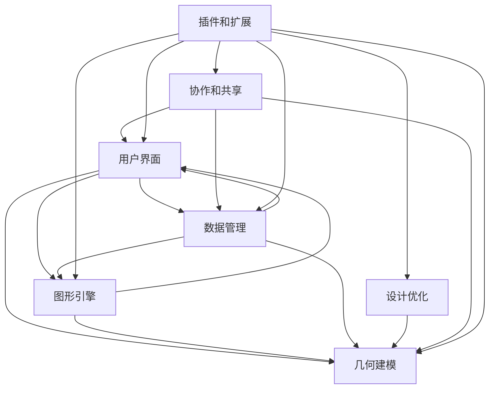

                 

### 第1章 引言

#### 1.1 背景介绍

计算机辅助设计（CAD）的历史可以追溯到20世纪50年代，当时计算机开始应用于工程领域。最初的CAD系统主要用于绘制简单的几何图形，随着技术的发展，CAD逐渐成为了工程设计不可或缺的工具。CAD技术的发展经历了几个重要的阶段：从2D图形到3D模型，再到参数化和集成化设计。现代CAD系统不仅能够进行几何建模，还能够集成仿真、分析、优化等功能，为工程师提供了强大的设计支持。

工程学与计算机科学的融合趋势日益明显。随着计算机硬件和软件技术的飞速发展，计算机科学在工程学中的应用越来越广泛。计算机科学为工程学提供了高效的数据处理能力、精确的仿真技术和先进的算法支持，而工程学则为计算机科学提供了丰富的应用场景和需求驱动。这种融合不仅提高了工程设计的效率和质量，也为计算机科学开辟了新的研究领域。

#### 1.2 问题定义

工程设计中的挑战主要来自于复杂性和效率。传统的设计方法往往需要大量的手工计算和绘图，不仅耗时费力，而且容易出现错误。计算机辅助设计（CAD）的出现，解决了这些问题。CAD系统能够自动化地处理复杂的计算和绘图任务，大大提高了设计效率。然而，CAD系统在实际应用中仍然面临一些挑战：

1. **设计与仿真的集成**：现代工程设计需要综合考虑结构、流体、热力学等多方面的因素，单一CAD系统可能难以满足这些需求。如何实现设计与仿真的高效集成，是一个亟待解决的问题。

2. **大规模数据处理**：随着设计复杂度的增加，CAD系统需要处理的数据量也急剧增加。如何高效地处理这些大规模数据，保证系统运行速度和稳定性，是另一个挑战。

3. **跨学科合作**：CAD系统的应用涉及多个学科，如机械工程、电气工程、计算机科学等。如何实现这些学科的紧密合作，发挥各自的优势，是一个重要问题。

4. **人机交互**：CAD系统的用户体验直接影响到设计效率和质量。如何设计出易于使用、操作直观的CAD系统，是一个持续追求的目标。

#### 1.3 研究目的与框架结构

本书的研究目的在于深入探讨计算机辅助设计（CAD）在工程学中的应用，分析其优势与挑战，并提出相应的解决方案。全书将分为七个章节，结构如下：

- **第1章 引言**：介绍CAD的历史、发展趋势和本书的研究目的。
- **第2章 基础概念与原理**：阐述CAD、计算机科学和工程学的基础概念和原理。
- **第3章 CAD软件工具**：介绍常见的CAD软件，分析其选择标准和评价标准。
- **第4章 CAD在工程中的应用**：探讨CAD在机械工程和电气工程中的应用。
- **第5章 计算机辅助设计与仿真**：讨论CAD与仿真技术的结合。
- **第6章 CAD软件的高级功能**：介绍CAD软件的高级功能，如参数化设计、数据管理等。
- **第7章 未来发展趋势与挑战**：展望CAD技术的未来发展趋势和面临的挑战。

通过以上结构，本书将全面、系统地探讨CAD在工程学中的应用，为读者提供有价值的参考。

### 第2章 基础概念与原理

#### 2.1 CAD基础概念

计算机辅助设计（CAD）是一种利用计算机及其图形设备来帮助设计人员进行设计工作的系统。CAD系统的核心功能是图形建模，它通过输入设计参数，自动生成几何图形，从而实现设计自动化。CAD系统的主要组成包括：

1. **输入设备**：如鼠标、键盘、触摸屏等，用于输入设计参数和指令。
2. **计算机处理单元**：负责处理输入的数据，执行图形建模和设计操作。
3. **图形设备**：如显示器、打印机等，用于显示和输出设计结果。

CAD系统的基本工作流程如下：

1. **设计数据输入**：设计人员通过输入设备输入设计参数和指令。
2. **几何建模**：计算机处理单元根据输入的数据生成几何图形。
3. **设计结果输出**：设计结果通过图形设备显示和打印。

CAD在工程设计中的应用广泛，涵盖了从简单的草图绘制到复杂的结构分析、仿真和优化。它不仅提高了设计效率，还减少了人为错误，提高了设计质量。

#### 2.2 计算机科学基础

计算机科学是CAD系统的重要基础，它为CAD提供了强大的数据处理能力和算法支持。计算机科学的基本原理包括：

1. **数据结构**：数据结构是计算机存储、组织数据的方式。常见的有数组、链表、树等。CAD系统中，数据结构用于存储几何图形的顶点、边、面等元素。

2. **算法**：算法是解决问题的步骤和方法。CAD系统中的算法包括几何建模算法、优化算法、仿真算法等。这些算法用于处理输入的数据，生成设计结果。

3. **计算机图形学**：计算机图形学是研究如何利用计算机生成和处理图形的学科。它包括二维和三维图形的生成、图形显示、图形变换等。CAD系统中的计算机图形学技术用于实现图形建模和设计结果的显示。

计算机图形学与CAD的关系非常紧密。计算机图形学提供了CAD系统所需的基本图形处理功能，如图形绘制、渲染、动画等。CAD系统则利用计算机图形学技术，实现设计过程的自动化和可视化。

#### 2.3 工程学原理

工程学是CAD系统的应用领域，它为CAD系统提供了具体的设计任务和需求。工程学的基本原理包括：

1. **设计原则**：设计原则是指导工程设计的基本准则。常见的有功能完整性、可靠性、经济性、安全性等。CAD系统通过遵循这些设计原则，实现高效、可靠的设计。

2. **设计流程**：设计流程是完成工程设计的基本步骤。它包括需求分析、方案设计、详细设计、测试验证等。CAD系统通过自动化设计流程，提高设计效率。

3. **结构分析**：结构分析是工程学中的重要环节，它通过分析结构受力情况，评估结构的稳定性和强度。CAD系统中的结构分析工具，可以帮助工程师快速完成结构分析任务。

4. **仿真技术**：仿真技术是工程学中的重要手段，它通过模拟实际工作环境，评估设计方案的可行性。CAD系统中的仿真技术，可以提前发现设计中的潜在问题，减少实际试验的次数。

CAD在工程学中的应用实例：

1. **机械工程**：CAD系统在机械设计中用于生成零件图、装配图，进行结构分析和优化。通过CAD，工程师可以快速完成机械设计，提高设计质量。

2. **电气工程**：CAD系统在电气设计中用于绘制电路图、布线图，进行电路仿真和优化。通过CAD，工程师可以减少设计错误，提高电路设计的可靠性。

3. **土木工程**：CAD系统在土木工程设计中用于绘制地形图、结构图，进行结构分析和仿真。通过CAD，工程师可以提前发现设计中的问题，提高工程设计的可行性。

总之，CAD作为工程学与计算机科学的融合产物，不仅提高了工程设计的效率和质量，还为工程学提供了强大的工具支持。通过本章的介绍，我们了解了CAD、计算机科学和工程学的基础概念和原理，为后续章节的探讨奠定了基础。

#### 2.4 计算机辅助设计（CAD）的基本原理

计算机辅助设计（CAD）的基本原理可以归结为以下几个方面：

1. **图形建模**：CAD系统的核心功能是图形建模，它通过输入设计参数，利用几何算法生成几何图形。图形建模包括二维图形建模和三维图形建模。二维图形建模主要用于绘制平面图形，如建筑图纸、电路图等；三维图形建模则用于创建三维模型，如机械零件、建筑结构等。图形建模的精度和效率直接影响设计结果的准确性和设计效率。

2. **参数化设计**：参数化设计是一种基于变量和参数的设计方法，它通过定义几何图形的参数，实现设计的自动化和灵活性。参数化设计允许设计人员在设计过程中修改参数，从而快速生成新的设计结果。这种方法不仅提高了设计效率，还保证了设计的一致性和可维护性。

3. **数据管理**：CAD系统需要高效地管理大量的设计数据，包括几何模型、设计参数、仿真结果等。数据管理涉及到数据的存储、检索、共享和备份等方面。有效的数据管理可以提高设计团队的工作效率，确保数据的完整性和一致性。

4. **人机交互**：CAD系统需要提供直观、易用的人机交互界面，以便设计人员能够高效地进行设计操作。人机交互包括图形用户界面（GUI）、语音识别、手势识别等多种方式。一个良好的人机交互设计，可以提高设计人员的操作效率和设计体验。

5. **集成化设计**：集成化设计是指将CAD系统与其他工具和系统进行集成，如仿真软件、分析软件、PDM（产品数据管理）系统等。集成化设计可以提高设计过程的连续性和数据共享性，减少重复工作和数据不一致的情况。

6. **协同设计**：协同设计是一种多人合作的设计方式，它通过CAD系统实现设计数据的共享和协作。协同设计可以提高设计团队的工作效率，确保设计的一致性和准确性。

7. **自动化与优化**：CAD系统可以通过自动化和优化技术，减少设计人员的工作量，提高设计效率和质量。自动化技术包括参数化设计、宏命令、脚本编程等；优化技术包括优化算法、设计优化工具等。

通过以上基本原理，CAD系统不仅能够自动化地处理复杂的几何建模任务，还能够提供灵活的设计方法、高效的数据管理和良好的用户体验，从而满足工程设计的需求。

#### 2.5 计算机辅助设计（CAD）的系统架构

计算机辅助设计（CAD）系统的架构是设计和实现高效、稳定、可扩展的CAD系统的关键。一个典型的CAD系统架构通常包括以下几个主要组成部分：

1. **用户界面（User Interface, UI）**：
   用户界面是CAD系统与用户交互的桥梁。它提供图形用户界面（GUI），包括菜单、工具栏、按钮和对话框等。用户可以通过UI与CAD系统进行交互，输入设计命令、参数和查看设计结果。UI的设计直接影响到用户的使用体验和设计效率。常见的UI设计工具包括Qt、wxWidgets和JavaFX等。

2. **图形引擎（Graphics Engine）**：
   图形引擎是CAD系统的核心，负责处理图形的绘制、渲染和显示。它通过图形API（如OpenGL、DirectX、Vulkan等）实现图形的渲染，提供高效、高质量的图形输出。图形引擎还需要实现图形的缩放、平移、旋转等基本操作，以及图形的编辑功能，如创建、删除、修改等。图形引擎的设计直接影响到CAD系统的性能和用户体验。

3. **数据管理（Data Management）**：
   数据管理模块负责存储、检索和管理CAD系统的设计数据。它通常使用数据库管理系统（DBMS），如MySQL、PostgreSQL或MongoDB等。数据管理模块需要实现数据的结构化存储，支持数据的查询、更新和删除操作。此外，数据管理模块还需要支持数据的版本控制和访问控制，以确保数据的完整性和安全性。

4. **几何建模（Geometric Modeling）**：
   几何建模模块是CAD系统的核心功能模块，负责处理几何图形的创建、编辑和操作。它通常包括几何数据结构（如点、线、面、体等）的定义和操作算法（如几何运算、布尔运算等）。几何建模模块还需要支持参数化设计，以便设计人员可以通过修改参数来生成新的设计结果。

5. **设计优化（Design Optimization）**：
   设计优化模块负责使用优化算法对设计进行优化。它通常包括目标函数的设定、设计变量的选择、优化算法的实现等。设计优化模块可以帮助设计人员快速找到最优设计，提高设计效率和质量。

6. **协作和共享（Collaboration and Sharing）**：
   协作和共享模块支持多人合作设计，它通过实现设计数据的共享和协作，提高设计团队的工作效率。协作和共享模块通常包括设计数据的版本控制、权限管理、工作流管理等。

7. **插件和扩展（Plugins and Extensions）**：
   CAD系统通常支持插件和扩展，以便用户可以根据自己的需求自定义功能。插件可以扩展CAD系统的功能，如添加新的工具、命令、几何建模方法等。扩展模块还可以支持与其他软件系统的集成，如PDM、CAM、CAE等。

通过以上组成部分，CAD系统架构实现了高效的设计流程、强大的数据管理和良好的用户交互。以下是一个典型的CAD系统架构图：

这个架构图展示了CAD系统的各个组成部分及其相互关系。通过合理的架构设计，CAD系统可以实现高效、稳定和可扩展的设计能力，满足工程设计的复杂需求。

#### 2.6 常见CAD软件介绍

计算机辅助设计（CAD）软件在工程领域中扮演着至关重要的角色，为设计师提供了强大的工具和平台。以下是几种常见的CAD软件，以及它们的特点和应用。

1. **AutoCAD**

   AutoCAD是由Autodesk公司开发的通用CAD软件，自1982年推出以来，一直广受工程师和设计师的青睐。AutoCAD的主要特点包括：

   - **二维绘图功能**：AutoCAD提供了强大的二维绘图工具，包括直线、圆、椭圆、多段线、样条曲线等，支持多视图、层管理和块定义等功能。
   - **三维建模能力**：虽然AutoCAD主要专注于二维绘图，但它也具备基本的3D建模功能，包括三维实体建模、表面建模和网格建模等。
   - **数据共享与协作**：AutoCAD支持多种文件格式，如DWG和DXF，便于与其他CAD软件交换数据。此外，AutoCAD还提供了云存储和协作工具，便于团队成员共享和协作设计。

   **应用领域**：AutoCAD广泛应用于建筑、土木工程、机械设计、电气工程等多个领域，是工程设计人员必备的工具。

2. **SolidWorks**

   SolidWorks是由Dassault Systèmes公司开发的参数化3D CAD软件，以其强大的三维建模能力和用户友好的界面而闻名。SolidWorks的主要特点包括：

   - **参数化设计**：SolidWorks支持参数化设计，允许用户通过修改参数来快速生成新的设计结果，提高设计效率。
   - **三维实体建模**：SolidWorks提供了强大的三维实体建模功能，支持多种建模方法，包括放样、扫描、组合体等。
   - **仿真与分析工具**：SolidWorks集成了多种仿真工具，如结构分析、热分析、流体分析等，帮助用户评估设计方案的可行性。

   **应用领域**：SolidWorks广泛应用于机械设计、汽车设计、航空航天、电子设备设计等领域，是制造业设计师的常用工具。

3. **CATIA**

   CATIA是由Dassault Systèmes公司开发的集成化CAD/CAE/CAM软件，是高端CAD软件的代表。CATIA的主要特点包括：

   - **集成化设计**：CATIA提供了完整的集成化设计环境，支持多学科、多领域的设计，从概念设计到详细设计，再到制造。
   - **三维建模与仿真**：CATIA具备强大的三维建模能力，支持多种建模技术，如曲面建模、实体建模、装配建模等。此外，它还集成了仿真工具，支持结构分析、热分析、流体分析等。
   - **工业解决方案**：CATIA提供了多个行业解决方案，如航空航天、汽车、船舶、消费品等，为不同领域的设计需求提供定制化的解决方案。

   **应用领域**：CATIA主要应用于高端制造业，如航空航天、汽车、船舶、高端机械设备等，是高端工程设计人员的首选工具。

4. **Revit**

   Revit是由Autodesk公司开发的建筑信息模型（BIM）软件，它专注于建筑、结构、MEP（机械、电气、 plumbing）领域的设计。Revit的主要特点包括：

   - **建筑信息模型（BIM）**：Revit基于BIM理念，提供从设计到施工再到运营的全过程管理。它支持多维数据模型，实现设计、分析和施工的无缝集成。
   - **参数化设计**：Revit支持参数化设计，允许用户通过修改参数来快速生成新的设计结果，提高设计效率。
   - **协作与共享**：Revit提供了丰富的协作工具，支持多人在线协作，确保设计的一致性和准确性。

   **应用领域**：Revit广泛应用于建筑、结构、MEP设计等领域，特别是在大型建筑项目和复杂工程中具有明显优势。

通过以上介绍，我们可以看到不同CAD软件在功能、应用领域和特点上的差异。选择合适的CAD软件，可以帮助设计人员提高工作效率，实现高质量的设计成果。

#### 3.2 软件选择与评价标准

在选择CAD软件时，需要考虑多个因素，这些因素不仅影响设计效率和效果，还影响到项目的总体成本和团队协作。以下是选择CAD软件时常见的几个关键评价标准：

1. **功能需求**：

   - **二维绘图能力**：评估CAD软件提供的二维绘图工具是否满足设计需求，包括线条、填充、文本、标注等基本功能。
   - **三维建模能力**：评估软件的三维建模功能是否强大，包括实体建模、曲面建模、装配建模等。
   - **参数化设计**：参数化设计是提高设计效率的重要手段，评估软件是否支持参数化设计，以及参数化功能的灵活性和便捷性。
   - **仿真与分析工具**：评估软件是否集成了仿真和分析工具，如结构分析、热分析、流体分析等，这些工具可以辅助设计人员评估设计方案的可行性。

2. **用户界面和易用性**：

   - **操作界面**：直观、简洁的操作界面可以提高设计效率，减少学习成本。评估软件的用户界面设计是否友好，是否符合设计人员的操作习惯。
   - **学习资源**：评估软件是否提供了丰富的学习资源，如教程、示例、手册等，这些资源可以帮助设计人员快速上手。
   - **定制性**：评估软件是否支持用户界面和工具栏的个性化设置，以便设计人员根据个人习惯进行优化。

3. **性能和稳定性**：

   - **运行速度**：评估软件在处理复杂设计任务时的运行速度，确保设计过程流畅、高效。
   - **内存占用**：评估软件的内存占用情况，确保在高负载情况下不会导致计算机崩溃或性能下降。
   - **稳定性**：评估软件在长时间运行或处理大型设计文件时的稳定性，避免出现数据丢失或程序崩溃的情况。

4. **数据管理和协作能力**：

   - **文件格式兼容性**：评估软件是否支持常见的文件格式，如DWG、DXF、STP等，以确保数据交换的便捷性。
   - **数据备份与恢复**：评估软件是否提供了数据备份和恢复功能，确保设计数据的安全。
   - **协作与共享**：评估软件是否支持多人协作设计，是否提供了版本控制和权限管理功能，以确保设计过程的一致性和安全性。

5. **成本与预算**：

   - **许可证费用**：评估软件的许可证费用，确保其符合项目预算。
   - **后续支持**：评估软件提供商是否提供及时的技术支持和更新服务，确保软件长期稳定运行。

6. **行业适应性**：

   - **行业解决方案**：评估软件是否提供了针对特定行业的解决方案，如机械设计、建筑、电气工程等，这些解决方案可以帮助设计人员更高效地完成设计任务。
   - **定制化服务**：评估软件提供商是否提供定制化服务，如根据用户需求开发特定功能模块，以满足特殊需求。

通过综合考虑以上评价标准，设计人员可以选择最适合自己项目的CAD软件，提高设计效率和质量。

#### 4.1 CAD在机械工程中的应用

计算机辅助设计（CAD）在机械工程中扮演着至关重要的角色，为工程师提供了强大的设计工具，极大地提升了机械设计的效率和质量。以下是CAD在机械工程中应用的具体实例和流程：

**实例1：汽车发动机设计**

汽车发动机是机械工程中的复杂系统，设计过程中需要考虑多个因素，如性能、重量、成本等。CAD软件在汽车发动机设计中发挥着重要作用：

1. **设计流程**：

   - **概念设计**：工程师通过CAD软件绘制初步的草图，确定发动机的基本结构和尺寸。
   - **详细设计**：在概念设计的基础上，工程师使用CAD软件进行详细设计，包括活塞、连杆、曲轴等关键部件的精确建模。
   - **优化设计**：利用CAD软件的参数化设计功能，工程师可以快速修改设计参数，优化发动机的性能和结构。
   - **仿真分析**：通过CAD软件集成的仿真工具，工程师可以模拟发动机在不同工况下的运行状态，评估设计的可行性。

2. **应用效益**：

   - **提高设计效率**：CAD软件自动化地处理复杂的计算和绘图任务，减少了手工计算和绘图的工作量，提高了设计效率。
   - **降低设计成本**：通过优化设计和仿真分析，工程师可以在设计阶段发现潜在问题，减少后期修改和试验的成本。
   - **提升设计质量**：CAD软件提供的精确建模和仿真功能，确保了设计结果的准确性和可靠性，提高了设计质量。

**实例2：飞机零件设计**

飞机零件设计是机械工程中的另一个复杂领域，CAD软件在飞机零件设计中同样发挥着重要作用：

1. **设计流程**：

   - **概念设计**：工程师通过CAD软件绘制飞机零件的初步草图，确定零件的基本结构和尺寸。
   - **详细设计**：在概念设计的基础上，工程师使用CAD软件进行详细设计，包括零件的材料选择、工艺设计等。
   - **装配设计**：工程师利用CAD软件进行零件的装配设计，确保零件之间的兼容性和装配精度。
   - **仿真分析**：通过CAD软件集成的仿真工具，工程师可以模拟零件在不同工况下的应力、振动等性能，评估设计的可行性。

2. **应用效益**：

   - **提高设计精度**：CAD软件提供了高精度的建模和仿真功能，确保了零件设计的精度和可靠性。
   - **优化设计方案**：通过仿真分析，工程师可以提前发现设计中的潜在问题，优化设计方案，提高飞机的性能和安全性。
   - **降低设计风险**：通过虚拟仿真，工程师可以在设计阶段发现并解决潜在的设计问题，降低实际生产中的风险。

**实例3：机器人设计**

机器人设计是机械工程中的新兴领域，CAD软件在机器人设计中提供了强大的设计工具和解决方案：

1. **设计流程**：

   - **概念设计**：工程师通过CAD软件绘制机器人的初步草图，确定机器人的结构和功能。
   - **详细设计**：在概念设计的基础上，工程师使用CAD软件进行详细设计，包括机器人的各个关节、驱动系统等。
   - **运动仿真**：利用CAD软件的仿真功能，工程师可以模拟机器人的运动轨迹，评估机器人的运动性能。
   - **碰撞检测**：通过CAD软件的碰撞检测功能，工程师可以提前发现设计中的碰撞问题，进行优化设计。

2. **应用效益**：

   - **提高设计灵活性**：CAD软件提供了参数化设计和自动化工具，使工程师可以快速修改和优化设计，提高设计灵活性。
   - **优化设计性能**：通过运动仿真和碰撞检测，工程师可以评估机器人的运动性能和安全性，优化设计方案。
   - **降低设计成本**：通过虚拟仿真和优化设计，工程师可以在设计阶段发现并解决潜在问题，减少实际生产中的成本和风险。

通过以上实例，我们可以看到CAD在机械工程中的应用不仅提升了设计效率，还提高了设计质量和性能。CAD软件为机械工程师提供了强大的设计工具，推动了机械工程的创新发展。

#### 4.2 CAD在电气工程中的应用

计算机辅助设计（CAD）在电气工程中同样发挥着重要作用，为电气工程师提供了强大的设计工具，提高了设计效率和质量。以下是CAD在电气工程中的应用实例和具体流程。

**实例1：电路图设计**

电路图设计是电气工程中最基础且常见的应用场景。CAD软件可以帮助电气工程师快速、准确地绘制电路图，并进行电路分析。

1. **设计流程**：

   - **概念设计**：电气工程师通过CAD软件绘制电路的初步草图，确定电路的基本结构和组成部分。
   - **详细设计**：在概念设计的基础上，工程师使用CAD软件进行详细设计，包括电路元件的布局、连接和标注。
   - **电路仿真**：利用CAD软件集成的电路仿真工具，工程师可以模拟电路的运行状态，分析电路的性能和稳定性。
   - **文件输出**：完成电路设计后，工程师可以将设计文件输出为常见的电路图格式，如DWG、DXF等，便于后续的制造和施工。

2. **应用效益**：

   - **提高设计效率**：CAD软件自动化地处理电路图的绘制和标注，减少了手工绘图的工作量，提高了设计效率。
   - **减少设计错误**：CAD软件提供了丰富的元件库和连接工具，减少了电路连接错误的可能性，提高了设计质量。
   - **电路仿真**：通过电路仿真，工程师可以在设计阶段发现电路中的潜在问题，进行优化设计，提高电路的可靠性和稳定性。

**实例2：电气布线设计**

电气布线设计涉及电气系统中的线路布局、电缆敷设和接口设计。CAD软件在电气布线设计中提供了高效、精准的工具。

1. **设计流程**：

   - **概念设计**：电气工程师通过CAD软件绘制电气布线的初步草图，确定布线的基本结构和布局。
   - **详细设计**：在概念设计的基础上，工程师使用CAD软件进行详细设计，包括电缆的规格、长度、走向等。
   - **布线仿真**：利用CAD软件的布线仿真功能，工程师可以模拟电缆的敷设和连接，分析布线的可行性和安全性。
   - **输出施工图**：完成电气布线设计后，工程师可以将设计文件输出为施工图，便于施工团队按照设计要求进行施工。

2. **应用效益**：

   - **提高布线精度**：CAD软件提供了精确的布线工具和标注功能，确保电气布线的规格和布局符合设计要求。
   - **优化布线方案**：通过布线仿真，工程师可以评估不同布线方案的可行性和效果，选择最优方案，提高系统的性能和稳定性。
   - **降低施工成本**：通过CAD软件设计出的施工图，施工团队可以更准确地理解设计意图，减少施工中的错误和返工，降低施工成本。

**实例3：电气系统控制设计**

电气系统控制设计涉及电气系统的控制策略、控制算法和控制器的选型等。CAD软件在电气系统控制设计中提供了强大的设计工具和仿真环境。

1. **设计流程**：

   - **控制策略设计**：电气工程师通过CAD软件绘制控制策略的初步草图，确定控制系统的基本结构和控制逻辑。
   - **控制算法设计**：在控制策略设计的基础上，工程师使用CAD软件进行控制算法的设计，包括PID控制、模糊控制等。
   - **控制器设计**：利用CAD软件，工程师可以设计和选择合适的控制器，包括PLC（可编程逻辑控制器）、DCS（分布式控制系统）等。
   - **系统仿真**：通过CAD软件的仿真功能，工程师可以模拟控制系统的工作状态，验证控制算法和控制器的性能。

2. **应用效益**：

   - **提高设计灵活性**：CAD软件提供了丰富的控制算法和控制器模型，工程师可以根据实际需求进行灵活设计和优化。
   - **优化控制效果**：通过系统仿真，工程师可以提前发现控制系统的潜在问题，优化控制策略和控制算法，提高系统的控制效果。
   - **缩短设计周期**：CAD软件的自动化和仿真功能，大大缩短了电气系统控制设计的时间，提高了设计效率。

通过以上实例，我们可以看到CAD在电气工程中的应用不仅提高了设计效率和质量，还为电气工程师提供了强大的设计工具和解决方案，推动了电气工程的发展。

#### 5.1 仿真技术概述

仿真技术在计算机辅助设计（CAD）中扮演着重要的角色，它通过模拟实际工作环境，帮助工程师评估设计方案的可行性和性能。仿真技术可以分为多种类型，每种类型都有其特定的应用场景和优点。

**1. 结构仿真**

结构仿真主要用于分析机械结构的受力情况，评估其稳定性和强度。常见的结构仿真方法包括有限元分析（FEM）、有限元方法（FEM）、模态分析、屈曲分析等。结构仿真可以帮助工程师预测结构在特定载荷下的响应，发现潜在的设计缺陷。

**2. 热力学仿真**

热力学仿真用于模拟热力学系统的温度分布、热传导、热辐射等。这类仿真在电子设备设计、汽车发动机设计等领域具有重要意义。通过热力学仿真，工程师可以优化散热设计，提高系统的性能和可靠性。

**3. 流体动力学仿真**

流体动力学仿真主要用于分析流体流动和压力分布，广泛应用于航空航天、汽车、船舶等领域。这类仿真可以帮助工程师评估流体对结构的影响，优化流体通道的设计，提高系统的流体力学性能。

**4. 电磁场仿真**

电磁场仿真用于分析电磁场分布和电磁波传播，广泛应用于电子通信、电磁兼容（EMC）等领域。通过电磁场仿真，工程师可以评估电磁干扰（EMI）和电磁兼容性（EMC）问题，优化电路和天线设计。

**5. 生物学和医学仿真**

生物学和医学仿真主要用于模拟生物系统和医学过程，如细胞生长、药物代谢、器官功能等。这类仿真在药物开发、医学诊断和治疗规划等领域具有重要意义。

**仿真技术的重要性**

仿真技术的重要性体现在以下几个方面：

1. **减少实验成本**：通过仿真，工程师可以在虚拟环境中模拟实际工作环境，减少实际试验和测试的成本。

2. **提高设计效率**：仿真技术可以在设计阶段发现潜在问题，工程师可以及时进行优化，提高设计效率。

3. **增强设计可靠性**：仿真技术可以帮助工程师评估设计方案的可靠性和稳定性，减少设计风险。

4. **跨学科合作**：仿真技术为不同学科之间的合作提供了平台，工程师可以更全面地考虑设计中的各种因素。

5. **教育培训**：仿真技术可以用于教育培训，帮助学生和工程师更好地理解和掌握设计原理。

通过以上讨论，我们可以看到仿真技术在CAD中的应用不仅提高了设计效率和可靠性，还为工程师提供了强大的工具，推动了工程设计的创新发展。

#### 5.2 CAD与仿真的结合

计算机辅助设计（CAD）与仿真的结合，为工程设计提供了强大的工具，使得工程师可以在虚拟环境中对设计进行全面的评估和优化。CAD与仿真的结合，主要体现在以下几个方面：

**1. 仿真工具的集成**

现代CAD软件通常集成了多种仿真工具，如有限元分析（FEM）、流体动力学（CFD）、热力学仿真等。这种集成化设计使得工程师可以在同一个软件环境中完成从设计到仿真的全过程，提高了工作效率。例如，在AutoCAD中，用户可以直接调用ANSYS进行结构仿真；在SolidWorks中，用户可以直接运行Simulation进行应力分析。

**2. 设计数据共享**

CAD与仿真的结合，需要确保设计数据在两者之间的高效共享。通过标准的数据交换格式，如STEP、IGES、DXF等，工程师可以将CAD模型导入仿真软件，进行进一步的分析和优化。这种数据共享不仅简化了操作流程，还保证了设计数据的一致性和准确性。

**3. 参数化设计**

参数化设计是CAD与仿真结合的关键技术之一。通过参数化设计，工程师可以定义几何模型的关键参数，从而实现设计变量的快速修改和仿真分析。例如，在SolidWorks中，工程师可以通过修改参数，快速生成不同尺寸的零件模型，并进行仿真分析，以便找到最优设计方案。

**4. 多学科仿真**

CAD与仿真的结合，使得多学科仿真成为可能。工程师可以通过仿真软件，同时考虑机械、电气、流体、热力学等多方面的因素，对整个系统进行全面的评估。例如，在CATIA中，工程师可以进行结构、流体和热力学的多学科仿真，以确保设计方案的完整性和可靠性。

**5. 优化设计**

CAD与仿真的结合，为优化设计提供了强有力的支持。通过仿真分析，工程师可以了解设计方案的不足之处，利用优化算法，对设计变量进行优化。例如，在ANSYS中，工程师可以使用优化模块，对结构设计进行参数优化，以减少重量、提高强度等。

**6. 虚拟样机**

虚拟样机技术是CAD与仿真的重要应用。通过虚拟样机，工程师可以在虚拟环境中模拟实际产品的运行状态，进行全面的分析和验证。例如，在Pro/ENGINEER中，用户可以创建虚拟样机，进行运动仿真、碰撞检测等，以验证设计的可行性和安全性。

**应用实例**

以下是CAD与仿真结合的几个实际应用实例：

1. **汽车设计**：在汽车设计中，CAD与仿真结合，可以用于空气动力学仿真、结构强度分析、热力学仿真等，以优化车身设计，提高燃油效率和安全性。

2. **电子产品设计**：在电子产品设计中，CAD与仿真结合，可以用于电路仿真、电磁兼容性分析、热仿真等，以优化电路布局和散热设计，提高产品的性能和可靠性。

3. **建筑结构设计**：在建筑结构设计中，CAD与仿真结合，可以用于结构分析、流体分析、热力学分析等，以确保建筑物的结构安全和舒适度。

通过CAD与仿真的结合，工程师可以在设计阶段就对设计方案进行全面的评估和优化，提高设计效率和质量，推动工程设计的创新发展。

#### 6.1 参数化与自动化设计

参数化设计和自动化设计是计算机辅助设计（CAD）中两个重要的概念，它们在提高设计效率、减少错误和增强设计灵活性方面发挥着关键作用。

**参数化设计**

参数化设计是一种通过定义参数来描述几何形状和尺寸的设计方法。在CAD软件中，设计元素（如线段、圆弧、多边形等）的属性可以通过参数来控制。通过修改这些参数，设计人员可以快速生成新的设计结果，而无需从头开始绘制。这种方法不仅提高了设计效率，还保证了设计的一致性和可维护性。

**参数化设计原理**

参数化设计基于几何约束和参数方程。几何约束用于定义设计元素之间的关系，如垂直、平行、相切等。参数方程则用于描述设计元素的尺寸和位置。通过这些约束和方程，CAD软件可以自动生成满足约束条件的几何模型。

**参数化设计应用**

参数化设计在机械设计、建筑设计、电子设计等领域有着广泛的应用。例如，在机械设计中，设计人员可以使用参数化设计来创建标准化的零件库，通过修改参数来快速生成不同尺寸的零件。在建筑设计中，参数化设计可以用于创建建筑模型，通过调整参数来改变建筑的高度、宽度、形状等。

**自动化设计**

自动化设计是在参数化设计的基础上，通过编写脚本或使用预定义的宏命令，实现设计过程的自动化。自动化设计可以大大减少重复性工作，提高设计效率。

**自动化设计原理**

自动化设计通常基于宏录制和脚本编程。宏录制是通过记录用户的操作步骤，将它们转换为可重复执行的宏命令。脚本编程则是通过编写代码，实现特定的设计任务。自动化设计可以通过批处理、自动化脚本、外部应用程序集成等方式实现。

**自动化设计应用**

自动化设计在CAD软件中有着广泛的应用。例如，在建筑设计中，自动化设计可以用于生成复杂的建筑结构，如桥梁、隧道等。在机械设计中，自动化设计可以用于创建复杂的零件模型，如涡轮、叶片等。此外，自动化设计还可以用于生成生产图纸、BOM（物料清单）等。

**参数化与自动化设计案例**

以下是一个参数化与自动化设计的案例：

**案例：创建参数化家具模型**

1. **参数定义**：设计人员定义家具的基本参数，如长度、宽度、高度、腿的尺寸等。
2. **几何约束**：使用CAD软件的参数化功能，定义几何约束，确保家具的结构符合设计要求。
3. **生成模型**：通过修改参数，快速生成不同尺寸的家具模型。
4. **自动化脚本**：编写自动化脚本，用于生成家具的生产图纸和BOM。

通过这个案例，我们可以看到参数化设计和自动化设计如何帮助设计人员提高工作效率，实现设计过程的自动化和灵活化。

#### 6.2 数据管理与分析

数据管理在计算机辅助设计（CAD）中扮演着至关重要的角色，它不仅影响到设计效率，还关系到设计数据的安全性和完整性。数据分析则是利用这些数据进行深度挖掘，以发现潜在的设计优化机会和改进方向。

**数据管理的重要性**

1. **确保数据完整性**：CAD系统需要处理大量设计数据，如几何模型、参数、仿真结果等。数据管理系统能够确保这些数据在存储、传输和处理过程中不受损坏或丢失。
2. **提高工作效率**：有效的数据管理可以快速检索和重用已有设计数据，减少重复性工作，提高设计效率。
3. **支持团队协作**：数据管理系统能够实现设计数据的共享和协作，便于团队成员之间的信息交流和工作协同。
4. **保障数据安全**：数据管理系统能够提供数据备份、恢复和访问控制功能，确保设计数据的安全性和隐私性。

**数据分析工具与技巧**

1. **数据挖掘**：数据挖掘是一种从大量数据中提取有价值信息的方法。在CAD系统中，数据挖掘可以用于发现设计趋势、优化设计参数、预测潜在问题等。
2. **机器学习**：机器学习是数据分析的重要工具，它可以通过训练模型，自动识别设计中的问题和机会。例如，通过机器学习模型，可以预测设计变量的最优值，实现设计优化。
3. **可视化**：数据可视化是将复杂数据以图形化方式展示的技术。通过数据可视化，设计人员可以更直观地理解和分析设计数据，发现潜在问题。
4. **统计分析**：统计分析是一种常用的数据分析方法，它可以通过计算数据的平均值、方差、相关性等指标，揭示数据之间的关系和特征。

**案例分析**

**案例1：设计参数优化**

在一个机械设计中，设计人员通过数据挖掘和统计分析，分析了不同设计参数对性能的影响。通过建立机器学习模型，设计人员预测了不同参数组合下的性能表现，最终找到了最优的设计参数，提高了机械的性能和可靠性。

**案例2：设计数据重用**

在一个建筑项目中，设计团队使用数据管理系统的共享功能，将已有的设计数据导入新项目。通过数据可视化工具，设计人员快速理解了已有设计，减少了设计时间和错误。

**案例3：故障诊断**

在一个电子产品设计中，设计人员通过数据分析和可视化工具，发现了几何模型中的潜在故障点。通过修改设计，设计人员成功地避免了潜在的故障，提高了产品的可靠性。

通过以上案例，我们可以看到数据管理与分析在CAD系统中的重要性和实际应用效果。有效的数据管理不仅提高了设计效率，还为设计优化和故障诊断提供了有力的支持。

#### 7.1 CAD技术发展趋势

随着技术的不断进步，计算机辅助设计（CAD）技术正朝着更加智能化、集成化和高效化的方向发展。以下是CAD技术未来发展的几个主要趋势：

**1. 智能化设计**

智能化设计是未来CAD技术发展的重要方向。通过引入人工智能（AI）技术，CAD系统可以自动完成复杂的几何建模、参数优化、仿真分析等任务。例如，AI算法可以基于大量历史设计数据，自动生成新的设计方案，减少设计人员的工作量。此外，自然语言处理（NLP）技术的应用，使得设计人员可以通过自然语言指令来控制CAD系统，提高设计效率。

**2. 集成化设计**

集成化设计是提升CAD系统功能的重要途径。未来的CAD技术将更加注重与其他系统的集成，如产品数据管理（PDM）、计算机辅助工程（CAE）、计算机辅助制造（CAM）等。通过集成化设计，CAD系统可以与整个设计流程无缝衔接，实现从概念设计到生产制造的全过程管理，提高设计效率和产品质量。

**3. 虚拟现实与增强现实**

虚拟现实（VR）和增强现实（AR）技术在CAD中的应用前景广阔。通过VR和AR技术，设计人员可以在虚拟环境中进行三维设计，提高设计精度和用户体验。例如，设计人员可以通过VR头盔直接在虚拟空间中操作CAD工具，进行复杂的设计和仿真分析。AR技术则可以将设计数据实时叠加在真实世界中，帮助设计人员更好地理解和评估设计方案。

**4. 云计算与大数据**

云计算和大数据技术的应用，将进一步提升CAD系统的性能和扩展性。通过云计算，CAD系统可以提供高性能的计算资源和数据存储服务，支持大规模设计任务的处理。大数据技术则可以帮助设计人员从海量数据中提取有价值的信息，实现设计优化和预测分析。

**5. 自适应与个性化设计**

未来CAD系统将更加注重自适应与个性化设计。通过学习用户的设计习惯和偏好，CAD系统可以自动调整界面布局、工具栏、参数设置等，提供个性化的设计体验。此外，自适应设计技术可以实时调整设计参数，以满足特定的设计需求，提高设计灵活性。

**6. 生态系统建设**

未来CAD技术的发展将更加注重生态系统的建设。通过开放API和插件系统，CAD系统可以与其他软件和硬件无缝集成，构建一个开放、灵活、多样化的生态系统。这将有助于促进CAD技术的创新和发展，满足不同行业和领域的需求。

总之，CAD技术的发展趋势将朝着智能化、集成化、高效化和个性化方向迈进。随着新技术的不断涌现，CAD系统将为工程设计和制造领域带来更多的创新和变革。

#### 7.2 工程学与计算机科学的融合挑战

工程学与计算机科学的融合是现代科技进步的重要驱动力，然而，这一融合过程也面临着诸多挑战，主要包括跨学科合作、技术创新和人才培养等方面。

**跨学科合作的挑战**

1. **知识体系差异**：工程学注重实践和经验，强调问题解决和系统实施；而计算机科学则侧重于算法、数据结构和系统设计。这种知识体系的差异，使得工程师和计算机科学家在理解和沟通时存在障碍。
2. **沟通成本**：跨学科合作需要团队成员具备多学科的知识，这增加了沟通和协调的难度。不同专业背景的团队成员可能使用不同的术语和表达方式，导致沟通成本增加。
3. **利益冲突**：在项目实施过程中，工程学和计算机科学的优先级和目标可能不一致。例如，工程师可能更关注产品的实用性和可制造性，而计算机科学家可能更关注系统的性能和可扩展性。这种利益冲突可能会导致项目进度和质量的波动。

**技术创新的挑战**

1. **技术更新快速**：计算机科学和工程学都在快速发展，新技术和工具层出不穷。工程师和计算机科学家需要不断学习和适应新技术，这增加了技术创新的难度。
2. **复杂性问题**：随着设计复杂度的增加，工程问题和计算机科学问题的难度也在不断提升。解决这些复杂问题需要跨学科的知识和先进的算法支持。
3. **集成与兼容**：将不同的技术集成到一个系统中，实现无缝对接，是一个挑战。不同系统之间的数据格式、接口协议和兼容性问题，都需要仔细处理。

**人才培养的挑战**

1. **跨学科教育**：现有教育体系往往侧重于单一学科，跨学科教育不足。培养能够同时掌握工程学和计算机科学知识的复合型人才，是一个长期的挑战。
2. **实践机会**：跨学科实践机会的缺乏，使得学生在校期间难以将理论知识应用到实际项目中。这导致他们在进入职场后，需要较长时间的适应期。
3. **持续学习**：随着技术的快速进步，工程师和计算机科学家需要持续学习新知识、新技能。这对个人的学习能力和适应能力提出了更高的要求。

**解决方案**

1. **建立跨学科研究团队**：通过建立跨学科研究团队，促进不同专业背景的团队成员之间的沟通和合作。设立明确的沟通机制和规则，确保项目目标的统一和协调。
2. **加强教育培训**：在高等教育阶段，加强跨学科教育，提供更多的跨学科课程和项目实践机会。鼓励学生参与跨学科项目，培养他们的跨学科思维和解决复杂问题的能力。
3. **推动技术创新**：鼓励技术创新，提供资金和资源支持跨学科研究。建立开放的技术平台和协作网络，促进不同领域的专家和学者之间的合作。
4. **持续职业发展**：为工程师和计算机科学家提供持续的职业发展机会，如在线课程、研讨会和培训等。帮助他们不断提升自己的技能和知识，适应技术变革。

通过以上措施，可以有效地应对工程学与计算机科学融合过程中面临的挑战，促进跨学科合作，推动技术创新，培养高素质的复合型人才，为工程设计和计算机科学的发展提供持续动力。

#### 8. 结论

通过本书的详细探讨，我们全面了解了计算机辅助设计（CAD）在工程学中的应用。从CAD的历史与发展、基础概念与原理，到CAD软件工具的介绍和其在机械工程、电气工程中的应用，再到计算机辅助设计与仿真的结合以及CAD软件的高级功能，我们逐步揭示了CAD在提高工程设计效率、质量和可靠性方面的巨大潜力。

本书的研究成果表明，CAD不仅提升了设计的自动化和精确度，还通过参数化设计、仿真分析和数据管理等功能，为工程师提供了强大的工具支持。未来，随着智能化、集成化和虚拟现实技术的不断发展，CAD将在工程学中发挥更加重要的作用。

**展望与未来工作**

未来的CAD研究应重点关注以下几个方面：

1. **智能化设计**：引入人工智能技术，实现更加智能化的设计过程，提高设计效率和准确性。
2. **跨学科融合**：加强工程学与计算机科学的融合，培养复合型人才，促进跨学科合作和创新。
3. **集成化设计**：推动CAD与其他设计工具、系统的集成，实现从设计到制造的全过程管理。
4. **云技术与大数据**：利用云计算和大数据技术，提供高性能的计算资源和数据支持，为复杂设计提供解决方案。

**作者信息**

作者：AI天才研究院/AI Genius Institute & 禅与计算机程序设计艺术 /Zen And The Art of Computer Programming

