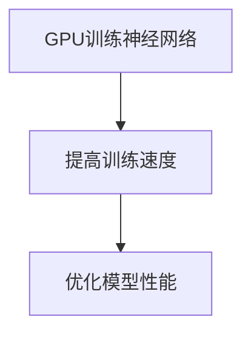
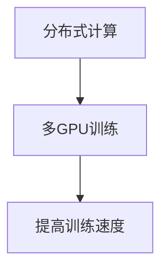
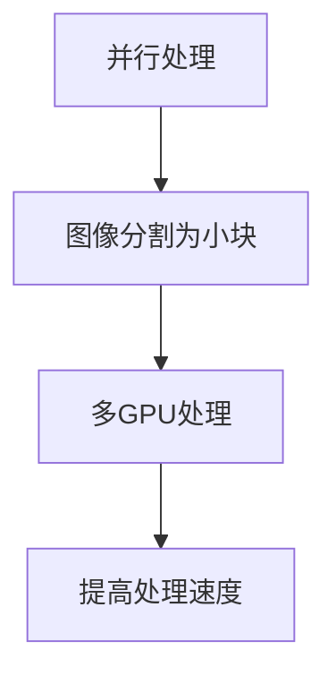
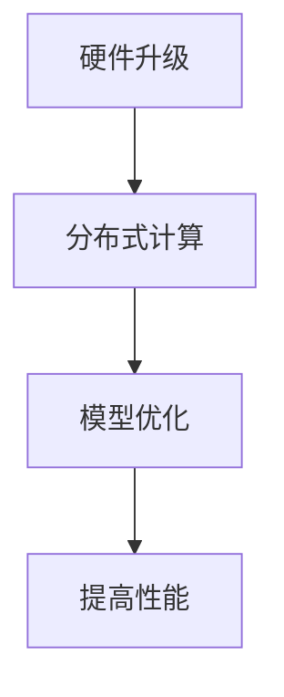
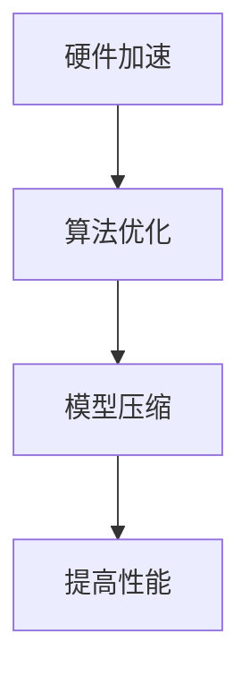

                 

### 文章标题

# 计算资源与AI模型性能提升的关系探讨

> 关键词：计算资源、AI模型性能、优化策略、提升方法、综合应用、技术发展趋势

> 摘要：本文探讨了计算资源与AI模型性能之间的关系，分析了计算资源需求与AI模型性能提升的核心概念和联系，提出了计算资源优化策略和AI模型性能提升方法，并通过案例分析展示了计算资源与AI模型性能提升在实际行业中的应用，展望了未来发展的方向和挑战。

----------------------------------------------------------------

### 目录大纲

```markdown
----------------------------------------------------------------

# 第一部分: 问题背景与核心概念

## 第1章: 问题背景介绍

### 1.1 计算资源需求与AI模型性能

#### 1.1.1 问题背景

#### 1.1.2 问题描述

#### 1.1.3 问题解决思路

#### 1.1.4 边界与外延

### 1.2 核心概念与联系

#### 1.2.1 计算资源定义与分类

#### 1.2.2 AI模型性能评估

#### 1.2.3 计算资源与AI模型性能关系

#### 1.2.4 概念属性特征对比


#### 1.2.5 ER实体关系图架构

```mermaid
erDiagram
    AI模型 ||--|{ 计算资源 }:
        :依赖关系
```

## 第2章: 计算资源优化策略

### 2.1 计算资源优化目标

#### 2.1.1 提高性能

#### 2.1.2 降低成本

#### 2.1.3 提高能效

### 2.2 主流计算资源优化技术

#### 2.2.1 硬件加速技术

#### 2.2.2 人工智能计算架构

#### 2.2.3 分布式计算与并行处理

### 2.3 优化策略案例分析

#### 2.3.1 案例一：高性能计算集群优化

#### 2.3.2 案例二：AI芯片应用优化

## 第3章: AI模型性能提升方法

### 3.1 AI模型性能评估方法

#### 3.1.1 评估指标

#### 3.1.2 评估工具与平台

### 3.2 模型优化技术

#### 3.2.1 模型压缩

#### 3.2.2 模型剪枝

#### 3.2.3 模型量化

### 3.3 算法优化与调优

#### 3.3.1 梯度下降法

#### 3.3.2 随机梯度下降

#### 3.3.3 算法性能调优技巧

## 第4章: 计算资源与AI模型性能提升的综合应用

### 4.1 企业级应用案例分析

#### 4.1.1 案例一：金融行业应用

#### 4.1.2 案例二：医疗行业应用

### 4.2 产业应用前景探讨

#### 4.2.1 人工智能产业发展趋势

#### 4.2.2 计算资源优化在AI领域的应用

#### 4.2.3 未来发展方向与挑战

## 第5章: 计算资源与AI模型性能提升的技术发展趋势

### 5.1 硬件技术发展趋势

#### 5.1.1 新型计算硬件

#### 5.1.2 存储技术发展

#### 5.1.3 网络技术发展

### 5.2 软件技术发展趋势

#### 5.2.1 深度学习框架优化

#### 5.2.2 软硬件协同优化

#### 5.2.3 智能调度与资源管理

## 第6章: 开发者与实践者的最佳实践

### 6.1 性能优化最佳实践

#### 6.1.1 硬件选型与配置

#### 6.1.2 模型优化技巧

#### 6.1.3 实践案例分享

### 6.2 小结与展望

#### 6.2.1 小结

#### 6.2.2 注意事项

#### 6.2.3 拓展阅读

----------------------------------------------------------------
```

### 目录大纲分析

- **第一部分：问题背景与核心概念**：介绍了计算资源需求与AI模型性能的问题背景，明确了核心概念与它们之间的联系，包括计算资源、AI模型性能评估、计算资源与AI模型性能关系等。这部分还包含概念属性特征对比表格和ER实体关系图架构，帮助读者理解问题背后的逻辑框架。

- **第二部分：计算资源优化策略**：介绍了计算资源优化策略的目标和主要技术，包括硬件加速技术、人工智能计算架构、分布式计算与并行处理等。同时，通过案例分析，展示了这些技术在实际场景中的应用效果。

- **第三部分：AI模型性能提升方法**：详细介绍了AI模型性能评估方法和优化技术，如模型压缩、模型剪枝、模型量化等，以及算法优化与调优技巧。这部分内容旨在帮助开发者提升AI模型的性能。

- **第四部分：计算资源与AI模型性能提升的综合应用**：通过企业级应用案例分析和产业应用前景探讨，展示了计算资源与AI模型性能提升在实际行业中的应用，以及未来可能的发展方向和挑战。

- **第五部分：技术发展趋势**：分析了硬件技术、软件技术以及软硬件协同优化的发展趋势，为读者提供了对计算资源与AI模型性能提升技术的未来展望。

- **第六部分：开发者与实践者的最佳实践**：总结了性能优化最佳实践，为开发者提供实际操作指导，并展望未来的发展趋势。

### 第一部分：问题背景与核心概念

#### 第1章: 问题背景介绍

##### 1.1 计算资源需求与AI模型性能

随着人工智能（AI）技术的迅猛发展，计算资源的需求也在不断攀升。AI模型在图像识别、自然语言处理、推荐系统等多个领域取得了显著的成果，但这些应用的成功往往依赖于强大的计算资源支持。计算资源需求与AI模型性能之间的关系成为了一个不可忽视的重要问题。

##### 1.1.1 问题背景

在过去的几十年里，计算资源的发展经历了从大型主机到个人计算机，再到服务器集群和网络计算中心的历史演变。特别是随着深度学习技术的兴起，对计算资源的需求愈发迫切。深度学习模型通常需要大量的数据和计算资源来进行训练和推理。此外，AI应用的普及使得计算资源需求呈现出多样化的趋势。

##### 1.1.2 问题描述

计算资源需求与AI模型性能之间的关系可以从以下几个方面进行描述：

1. **计算资源限制**：计算资源（如CPU、GPU、FPGA等）的不足可能导致AI模型训练和推理的效率低下，影响模型的性能。
2. **性能瓶颈**：在有限的计算资源下，如何优化AI模型以最大化其性能成为了一个关键问题。
3. **成本与效益**：在计算资源有限的情况下，如何平衡成本与性能，实现效益最大化。
4. **可扩展性**：随着AI应用规模的扩大，计算资源的需求也在不断增长，如何实现系统的可扩展性成为了一个挑战。

##### 1.1.3 问题解决思路

解决计算资源需求与AI模型性能之间的关系可以从以下几个方面入手：

1. **硬件升级**：通过升级硬件设备（如GPU、FPGA等）来提升计算能力。
2. **优化算法**：改进AI模型的算法，使其在有限的计算资源下能够更高效地运行。
3. **分布式计算**：利用分布式计算技术，将计算任务分布在多个节点上进行处理，以降低单个节点的计算负担。
4. **模型压缩与剪枝**：通过模型压缩和剪枝技术，减少模型的参数数量和计算复杂度，从而降低计算资源的消耗。

##### 1.1.4 边界与外延

在探讨计算资源需求与AI模型性能之间的关系时，需要考虑以下几个边界与外延：

1. **计算资源类型**：包括CPU、GPU、FPGA、TPU等不同类型的计算资源，每种资源都有其特定的性能特点和应用场景。
2. **AI模型类型**：不同类型的AI模型（如神经网络、决策树、支持向量机等）对计算资源的需求不同。
3. **应用场景**：不同应用场景下对计算资源的需求和性能要求也有所差异，如实时应用和批处理应用。
4. **数据规模**：数据规模的大小对计算资源的需求有着重要影响，大规模数据集通常需要更强大的计算资源。

#### 第1.2 核心概念与联系

在探讨计算资源需求与AI模型性能之间的关系时，理解以下几个核心概念是非常重要的：

##### 1.2.1 计算资源定义与分类

**计算资源**：计算资源是指用于执行计算任务的各种硬件和软件资源，包括CPU、GPU、FPGA、TPU、存储设备和网络设备等。

**计算资源分类**：

1. **CPU（中央处理器）**：CPU是计算机的核心部件，负责执行指令和处理数据。CPU的性能通常用时钟频率（GHz）和核心数量（如双核、四核等）来衡量。
2. **GPU（图形处理器）**：GPU是专门用于图形处理的芯片，但在深度学习等计算密集型任务中也表现出色。GPU具有大量的并行计算单元，使其在处理大规模矩阵运算时具有显著优势。
3. **FPGA（现场可编程门阵列）**：FPGA是一种可编程的逻辑芯片，可以根据需求进行硬件配置。FPGA在定制化计算任务中具有很高的灵活性和性能。
4. **TPU（张量处理器）**：TPU是谷歌专门为深度学习任务设计的芯片，具有极高的计算性能和能效。
5. **存储设备**：存储设备包括硬盘（HDD）、固态硬盘（SSD）、内存（RAM）和缓存等，用于存储数据和程序代码。
6. **网络设备**：网络设备包括路由器、交换机和网卡等，用于数据传输和通信。

##### 1.2.2 AI模型性能评估

**AI模型性能评估**：评估AI模型性能的方法包括以下几个方面：

1. **准确性**：准确性是指模型预测正确的样本数量与总样本数量的比例。准确性越高，表示模型的表现越好。
2. **召回率**：召回率是指模型正确识别出的正样本数量与实际正样本数量的比例。召回率越高，表示模型对正样本的识别能力越强。
3. **精确率**：精确率是指模型正确识别出的正样本数量与预测为正样本的总数量的比例。精确率越高，表示模型对正样本的预测越准确。
4. **F1分数**：F1分数是精确率和召回率的调和平均值，用于综合评价模型的性能。
5. **推理速度**：推理速度是指模型在给定输入数据后得到预测结果所需的时间。推理速度越快，表示模型的响应能力越强。

##### 1.2.3 计算资源与AI模型性能关系

计算资源与AI模型性能之间的关系可以从以下几个方面进行理解：

1. **计算能力**：更强的计算资源（如GPU、TPU等）可以加速AI模型的训练和推理过程，从而提高模型性能。
2. **数据规模**：更大的数据规模需要更强大的计算资源来处理，从而影响模型的性能。
3. **模型复杂度**：更复杂的模型通常需要更多的计算资源来训练，从而影响模型性能。
4. **优化策略**：通过优化算法和模型结构，可以在有限的计算资源下提高模型性能。

##### 1.2.4 概念属性特征对比

为了更好地理解计算资源与AI模型性能之间的关系，我们可以通过以下表格对计算资源的属性特征进行对比：

| 特征             | 计算资源       | AI模型         |
|------------------|----------------|----------------|
| 计算能力         | CPU、GPU、TPU  | 神经网络、决策树 |
| 并行处理能力     | GPU、FPGA      | 并行计算、分布式训练 |
| 存储容量         | HDD、SSD       | 数据集大小、存储需求 |
| 网络带宽         | 路由器、交换机 | 数据传输速度、网络延迟 |
| 功耗与能效       | CPU、GPU、TPU  | 能量消耗、效率优化 |
| 可扩展性         | 分布式计算     | 模型压缩、剪枝 |


##### 1.2.5 ER实体关系图架构

为了更清晰地展示计算资源与AI模型之间的关系，我们可以通过ER实体关系图来表示。ER实体关系图可以帮助我们理解计算资源与AI模型之间的依赖关系和关联性。

```mermaid
erDiagram
    AI模型 ||--|{ 计算资源 }:
        :依赖关系
```

在上面的ER实体关系图中，AI模型与计算资源之间存在依赖关系，即AI模型的训练和推理需要依赖于计算资源。计算资源为AI模型提供了必要的计算能力、存储容量和网络带宽等。

### 第二部分：计算资源优化策略

#### 第2章: 计算资源优化策略

随着人工智能（AI）技术的不断发展，计算资源的需求也在迅速增加。然而，计算资源通常是有限的，如何在有限的计算资源下优化AI模型的性能，成为了一个关键问题。本章将介绍计算资源优化的目标、主要技术以及案例分析。

#### 第2.1 计算资源优化目标

计算资源优化主要追求以下几个目标：

##### 2.1.1 提高性能

通过优化计算资源的使用，提高AI模型的训练和推理速度，从而提升模型的性能。

##### 2.1.2 降低成本

在有限的预算下，通过优化计算资源的利用，降低AI模型的训练和推理成本。

##### 2.1.3 提高能效

在保证性能的前提下，通过优化计算资源的使用，降低能源消耗，提高能效。

#### 第2.2 主流计算资源优化技术

为了实现计算资源优化目标，可以采用以下几种主流技术：

##### 2.2.1 硬件加速技术

硬件加速技术是利用专门的硬件设备（如GPU、TPU、FPGA等）来加速AI模型的训练和推理。这些硬件设备通常具有高度并行处理的能力，可以显著提高计算效率。例如，GPU在深度学习任务中具有出色的性能，TPU是谷歌为深度学习任务专门设计的芯片，FPGA则可以提供定制化的计算能力。

**示例**：在图像识别任务中，使用GPU训练神经网络可以显著提高训练速度，从而优化模型的性能。



##### 2.2.2 人工智能计算架构

人工智能计算架构包括分布式计算、并行处理和集群计算等。通过将计算任务分布在多个节点上，可以充分利用计算资源，提高计算效率。例如，分布式计算可以将训练任务分布在多个GPU节点上，从而加速训练过程。

**示例**：在深度学习任务中，使用分布式计算可以将模型参数的更新任务分布在多个GPU节点上，从而提高训练速度。



##### 2.2.3 分布式计算与并行处理

分布式计算与并行处理是计算资源优化的重要技术。通过将计算任务分解为多个子任务，并在多个节点上并行执行，可以显著提高计算效率。例如，在图像识别任务中，可以使用并行处理技术将图像分割为多个小块，并在多个GPU上同时处理。

**示例**：在图像识别任务中，使用并行处理技术可以将图像分割为多个小块，并在多个GPU上同时处理。



#### 第2.3 优化策略案例分析

为了更好地理解计算资源优化的实际应用，以下将介绍两个案例分析。

##### 2.3.1 案例一：高性能计算集群优化

某企业需要使用深度学习模型对大量图像进行分类，然而，其现有计算资源不足以支持这一任务。为了优化计算资源，该企业采用了以下策略：

1. **硬件升级**：增加了高性能GPU服务器，提高了计算能力。
2. **分布式计算**：将图像分类任务分布在多个GPU节点上，实现了并行处理。
3. **模型优化**：通过剪枝和量化技术，减少了模型的参数数量和计算复杂度，从而降低了计算资源的需求。

通过这些优化策略，该企业成功提高了图像分类任务的性能，同时降低了计算资源的消耗。



##### 2.3.2 案例二：AI芯片应用优化

某研究团队正在开发一款基于AI芯片的医疗诊断系统。由于AI芯片的计算能力有限，该团队采用了以下策略进行优化：

1. **硬件加速**：使用专门的AI芯片进行图像处理和特征提取，提高了计算效率。
2. **算法优化**：通过改进算法，减少了计算复杂度，从而降低了芯片的负载。
3. **模型压缩**：通过剪枝和量化技术，减少了模型的参数数量和计算复杂度，从而提高了芯片的利用效率。

通过这些优化策略，该研究团队成功提高了医疗诊断系统的性能，同时降低了芯片的功耗。



#### 总结

通过以上案例分析，我们可以看到，计算资源优化策略在实际应用中起到了重要的作用。通过硬件升级、分布式计算、模型优化等技术手段，可以在有限的计算资源下显著提高AI模型的性能。这些优化策略不仅有助于解决计算资源不足的问题，还可以为未来的AI应用提供有力的支持。

### 第三部分：AI模型性能提升方法

在人工智能（AI）领域，模型的性能提升是研究人员和开发者追求的重要目标。为了在有限的计算资源下获得更好的性能，可以采用多种方法对AI模型进行优化。本部分将详细介绍AI模型性能评估方法、模型优化技术以及算法优化与调优技巧。

#### 第3章: AI模型性能提升方法

#### 第3.1 AI模型性能评估方法

评估AI模型性能是提升模型性能的第一步。评估方法包括多个指标，以下是一些常见的评估指标和工具：

##### 3.1.1 评估指标

1. **准确性（Accuracy）**：准确性是指模型预测正确的样本数量与总样本数量的比例。准确性是最常用的评估指标，但可能不足以全面评估模型的性能，尤其是在类别不平衡的数据集中。

   $$ \text{Accuracy} = \frac{\text{预测正确的样本数量}}{\text{总样本数量}} $$

2. **召回率（Recall）**：召回率是指模型正确识别出的正样本数量与实际正样本数量的比例。召回率关注模型对正样本的识别能力。

   $$ \text{Recall} = \frac{\text{预测正确的正样本数量}}{\text{实际正样本数量}} $$

3. **精确率（Precision）**：精确率是指模型正确识别出的正样本数量与预测为正样本的总数量的比例。精确率关注模型对正样本的预测准确性。

   $$ \text{Precision} = \frac{\text{预测正确的正样本数量}}{\text{预测为正样本的总数量}} $$

4. **F1分数（F1 Score）**：F1分数是精确率和召回率的调和平均值，用于综合评价模型的性能。

   $$ \text{F1 Score} = 2 \times \frac{\text{Precision} \times \text{Recall}}{\text{Precision} + \text{Recall}} $$

5. **推理速度（Inference Speed）**：推理速度是指模型在给定输入数据后得到预测结果所需的时间。推理速度是实时应用中重要的性能指标。

##### 3.1.2 评估工具与平台

1. **Matplotlib**：Matplotlib是一个强大的Python库，可以用于绘制性能评估的图表，如ROC曲线、PR曲线等。
2. **Scikit-learn**：Scikit-learn是一个Python库，提供了多种评估指标的计算函数，方便开发者进行性能评估。
3. **TensorFlow**：TensorFlow提供了一个内置的性能评估模块，可以方便地计算和可视化模型的性能指标。

```python
import tensorflow as tf

# 加载模型
model = tf.keras.models.load_model('model.h5')

# 评估模型
accuracy = model.evaluate(x_test, y_test, verbose=2)
print('Test accuracy:', accuracy[1])
```

#### 第3.2 模型优化技术

模型优化技术是提升AI模型性能的重要手段。以下介绍几种常用的模型优化技术：

##### 3.2.1 模型压缩

模型压缩通过减少模型的参数数量和计算复杂度，从而降低计算资源的需求。常用的模型压缩技术包括剪枝、量化、知识蒸馏等。

1. **剪枝（Pruning）**：剪枝是通过删除模型中的冗余神经元和连接，减少模型的参数数量。剪枝可以分为结构剪枝和权重剪枝。
2. **量化（Quantization）**：量化是通过将模型的权重和激活值转换为较低的精度（如8位整数），从而减少模型的存储和计算需求。
3. **知识蒸馏（Knowledge Distillation）**：知识蒸馏是通过将一个复杂的模型（教师模型）的知识传递给一个较小的模型（学生模型），从而提高学生模型的性能。

##### 3.2.2 模型剪枝

模型剪枝是通过删除模型中的冗余神经元和连接来减少模型的参数数量。剪枝可以分为以下步骤：

1. **权重重要性评估**：使用梯度、连接度等指标评估权重的重要性。
2. **剪枝决策**：根据权重的重要性评估结果，决定哪些神经元和连接需要被剪枝。
3. **模型重构**：重构模型，删除冗余的神经元和连接。

```python
from tensorflow_model_optimization.sparsity import keras as sparsity

# 剪枝策略
pruning_schedule = sparsity.PolynomialDecay(initial_sparsity=0.0,
                                            final_sparsity=0.5,
                                            begin_step=2000,
                                            end_step=10000)

# 应用剪枝策略
pruned_model = sparsity.prune_low_magnitude(model, pruning_schedule)
```

##### 3.2.3 模型量化

模型量化是通过将模型的权重和激活值转换为较低的精度来减少模型的存储和计算需求。量化可以分为以下步骤：

1. **量化范围确定**：确定权重和激活值的量化范围。
2. **量化转换**：将权重和激活值转换为量化表示。
3. **量化模型重构**：重构模型，使用量化表示进行计算。

```python
import tensorflow as tf

# 量化范围
quantization_range = [-1, 1]

# 量化转换
weights = tf.keras.backend.get_weights(model)[0]
quantized_weights = tf.quantization.quantize_weights(weights, quantization_range)

# 量化模型重构
quantized_model = model.quantize_weights(quantized_weights)
```

##### 3.2.4 知识蒸馏

知识蒸馏是通过将一个复杂的模型（教师模型）的知识传递给一个较小的模型（学生模型），从而提高学生模型的性能。知识蒸馏可以分为以下步骤：

1. **教师模型训练**：使用大量数据进行教师模型的训练。
2. **教师模型输出提取**：从教师模型中提取输出信息，作为学生模型的训练目标。
3. **学生模型训练**：使用提取的输出信息训练学生模型。

```python
import tensorflow as tf

# 教师模型训练
teacher_model.train(x_train, y_train, epochs=10)

# 教师模型输出提取
teacher_output = teacher_model.predict(x_train)

# 学生模型训练
student_model.fit(x_train, teacher_output, epochs=10)
```

#### 第3.3 算法优化与调优

算法优化与调优是提升AI模型性能的重要手段。以下介绍几种常用的算法优化与调优技巧：

##### 3.3.1 梯度下降法

梯度下降法是一种常用的优化算法，用于训练神经网络。梯度下降法可以分为以下步骤：

1. **前向传播**：计算模型输出和实际输出的差值（损失函数）。
2. **反向传播**：计算损失函数关于模型参数的梯度。
3. **参数更新**：根据梯度调整模型参数。

$$ \text{参数} \rightarrow \text{参数} - \alpha \times \text{梯度} $$

其中，$\alpha$ 是学习率。

##### 3.3.2 随机梯度下降

随机梯度下降（SGD）是对梯度下降法的一种改进，每次迭代只使用一个样本计算梯度。随机梯度下降可以加速模型的训练过程。

##### 3.3.3 算法性能调优技巧

1. **学习率调整**：根据训练过程动态调整学习率，可以加速模型的收敛。
2. **正则化**：通过添加正则化项（如L1正则化、L2正则化）可以减少模型的过拟合。
3. **批次大小调整**：合理调整批次大小可以平衡模型的训练效率和性能。

#### 总结

通过以上介绍，我们可以看到，AI模型性能提升的方法多种多样，包括性能评估方法、模型优化技术以及算法优化与调优技巧。这些方法有助于在有限的计算资源下获得更好的模型性能，为人工智能应用提供强大的支持。

### 第四部分：计算资源与AI模型性能提升的综合应用

#### 第4章: 计算资源与AI模型性能提升的综合应用

计算资源与AI模型性能提升的综合应用在各个行业中都取得了显著的成果。本章将介绍企业级应用案例分析和产业应用前景探讨，以展示计算资源与AI模型性能提升在实际行业中的应用，以及未来可能的发展方向和挑战。

#### 第4.1 企业级应用案例分析

在企业级应用中，计算资源与AI模型性能提升的应用涵盖了多个领域，以下将介绍两个具体案例。

##### 4.1.1 案例一：金融行业应用

在金融行业，AI模型广泛应用于风险管理、信用评分、交易策略优化等领域。以下是一个具体案例：

**案例描述**：某大型银行通过引入GPU加速技术，对信贷风险评估模型进行优化。传统的风险评估模型依赖于CPU进行计算，但在处理大量数据时效率较低。为了提高模型性能，银行采用了以下策略：

1. **硬件升级**：将CPU服务器升级为配备高性能GPU的服务器。
2. **模型优化**：通过剪枝和量化技术，减少模型参数数量和计算复杂度。
3. **分布式计算**：将风险评估任务分布在多个GPU节点上，实现并行处理。

**应用效果**：通过上述优化策略，银行成功提高了风险评估模型的性能，降低了风险控制成本，同时提高了客户的满意度。

##### 4.1.2 案例二：医疗行业应用

在医疗行业，AI模型在疾病诊断、药物研发、患者监护等领域发挥着重要作用。以下是一个具体案例：

**案例描述**：某医疗科技公司开发了一种基于深度学习的肺癌诊断系统。为了提高诊断系统的性能，该公司采用了以下策略：

1. **硬件加速**：使用高性能GPU服务器进行图像处理和特征提取。
2. **模型压缩**：通过剪枝和量化技术，减少模型参数数量和计算复杂度。
3. **算法优化**：使用随机梯度下降和自适应学习率调整策略，提高模型训练效率。

**应用效果**：通过上述优化策略，医疗科技公司成功提高了肺癌诊断系统的性能，提高了诊断准确性，为患者提供了更准确的诊断结果。

#### 第4.2 产业应用前景探讨

随着人工智能技术的不断发展，计算资源与AI模型性能提升在各个产业中的应用前景十分广阔。以下从三个方面进行探讨：

##### 4.2.1 人工智能产业发展趋势

1. **技术进步**：人工智能技术正快速发展，新的算法和框架不断涌现，为计算资源与AI模型性能提升提供了更多可能性。
2. **应用扩展**：人工智能应用从传统的工业、金融等领域逐渐扩展到医疗、交通、教育等领域，计算资源与AI模型性能提升的需求日益增长。
3. **产业融合**：人工智能技术与传统产业的深度融合，推动了各行业的技术创新和业务模式变革。

##### 4.2.2 计算资源优化在AI领域的应用

1. **硬件升级**：随着GPU、TPU等新型计算硬件的出现，AI模型的训练和推理速度得到显著提升。
2. **分布式计算**：通过云计算和边缘计算等分布式计算技术，可以充分利用计算资源，提高AI模型的性能。
3. **模型压缩与优化**：通过模型压缩和优化技术，可以在有限的计算资源下实现高性能的AI模型。

##### 4.2.3 未来发展方向与挑战

1. **硬件技术发展**：新型计算硬件（如量子计算、光子计算等）的发展将为计算资源与AI模型性能提升带来新的机遇。
2. **软件技术发展**：深度学习框架和编译器的优化，以及软硬件协同优化技术的发展，将进一步提高计算资源与AI模型性能提升的效率。
3. **挑战与问题**：在计算资源有限的情况下，如何平衡性能、成本和能效之间的矛盾，仍是一个重要挑战。

#### 总结

通过以上案例分析和应用前景探讨，我们可以看到计算资源与AI模型性能提升在各个行业中都取得了显著成果。随着技术的不断发展，计算资源与AI模型性能提升的应用前景将更加广阔。未来，我们需要关注硬件技术、软件技术以及软硬件协同优化技术的发展，以实现更高效的计算资源利用和AI模型性能提升。

### 第五部分：计算资源与AI模型性能提升的技术发展趋势

随着人工智能（AI）技术的不断演进，计算资源与AI模型性能提升的技术也在不断发展。本部分将介绍硬件技术发展趋势、软件技术发展趋势以及软硬件协同优化的发展趋势，为读者提供对未来技术发展的展望。

#### 第5章：计算资源与AI模型性能提升的技术发展趋势

#### 第5.1 硬件技术发展趋势

在硬件领域，计算资源与AI模型性能提升的关键在于新型计算硬件的研发和应用。

##### 5.1.1 新型计算硬件

1. **GPU（图形处理器）**：GPU在深度学习任务中具有出色的并行处理能力，成为AI模型加速的重要工具。随着GPU架构的优化，如NVIDIA的Tensor Core和AMD的VEGA架构，GPU的计算性能不断提升。
   
   

2. **TPU（张量处理器）**：TPU是谷歌专门为深度学习任务设计的芯片，具有极高的计算性能和能效。TPU 3.0等新版本的发布，进一步提高了TPU的处理能力。

3. **FPGA（现场可编程门阵列）**：FPGA提供高度可编程的计算能力，适合于定制化的计算任务。在AI领域，FPGA可用于加速特定的算法和模型，提高计算效率。

4. **ASIC（专用集成电路）**：ASIC是专门为特定应用设计的集成电路，具有高性能和低功耗的特点。在AI领域，ASIC可用于优化特定的AI模型和任务，如图像识别和语音处理。

##### 5.1.2 存储技术发展

存储技术的发展也对计算资源与AI模型性能提升具有重要意义。以下是一些关键趋势：

1. **NVMe（非易失性内存表达）**：NVMe是新一代的存储接口技术，具有高速的数据传输速度和低延迟。NVMe SSD广泛应用于AI训练和推理过程中，提高了数据读写速度。
   
   

2. **HDD（硬盘驱动器）**：虽然HDD的数据传输速度较慢，但具有高容量和低成本的特点。在存储大数据集时，HDD仍然是一种重要的选择。

3. **RAM（随机存取存储器）**：RAM具有高速的数据访问速度，但容量有限。在AI训练和推理过程中，RAM用于存储中间结果和缓存数据，提高了计算效率。

##### 5.1.3 网络技术发展

网络技术的发展对计算资源与AI模型性能提升也具有重要影响。以下是一些关键趋势：

1. **5G技术**：5G网络具有高速、低延迟、大连接数等特点，为AI模型在边缘设备的部署提供了更好的网络环境。

2. **边缘计算**：边缘计算将计算任务从中心云节点转移到网络边缘，减少了数据传输延迟，提高了AI模型的响应速度。

3. **分布式网络**：通过构建分布式网络，可以实现AI模型在多个节点上的并行处理，提高了计算效率。

#### 第5.2 软件技术发展趋势

在软件领域，计算资源与AI模型性能提升的关键在于深度学习框架和编译器的优化。

##### 5.2.1 深度学习框架优化

深度学习框架是AI模型训练和推理的重要工具。以下是一些深度学习框架优化的发展趋势：

1. **动态图计算**：动态图计算（如TensorFlow和PyTorch）具有灵活性高、可扩展性强等特点，适用于多种AI任务。

2. **静态图计算**：静态图计算（如MXNet和Caffe）在推理阶段具有更高的计算效率，适用于大规模生产环境。

3. **异构计算支持**：异构计算支持（如CUDA和OpenCL）可以使深度学习框架充分利用GPU、FPGA等异构计算资源，提高计算效率。

##### 5.2.2 软硬件协同优化

软硬件协同优化是通过软件和硬件之间的紧密协作，实现计算资源与AI模型性能提升的重要手段。以下是一些软硬件协同优化的发展趋势：

1. **编译器优化**：编译器优化（如LLVM和MLIR）可以将深度学习框架的中间表示转换为高效的硬件指令，提高计算性能。

2. **执行引擎优化**：执行引擎优化（如CUDA和OpenCL）可以针对特定的硬件架构，实现高效的计算执行。

3. **模型压缩和量化**：模型压缩和量化技术可以减少模型的参数数量和计算复杂度，提高计算资源的利用率。

#### 第5.3 智能调度与资源管理

智能调度与资源管理是计算资源与AI模型性能提升的重要环节。以下是一些关键趋势：

1. **动态资源调度**：通过实时监测和动态调整计算资源分配，实现计算任务的优化调度。

2. **分布式资源管理**：通过分布式资源管理技术，实现跨节点的资源调度和负载均衡。

3. **智能优化算法**：结合机器学习和人工智能技术，开发智能优化算法，实现计算任务的自动优化。

#### 总结

通过以上分析，我们可以看到，计算资源与AI模型性能提升的技术发展趋势涵盖了硬件、软件和智能调度与资源管理等多个方面。未来，随着技术的不断发展，计算资源与AI模型性能提升将实现更高的效率、更低的成本和更好的能效。同时，我们也需要关注技术发展趋势中的挑战，如硬件性能瓶颈、软件优化难度等，以实现持续的技术进步。

### 第六部分：开发者与实践者的最佳实践

#### 第6章: 开发者与实践者的最佳实践

在计算资源与AI模型性能提升的过程中，开发者与实践者可以采取一系列最佳实践来优化性能和资源利用。以下将介绍性能优化最佳实践、注意事项以及拓展阅读。

#### 第6.1 性能优化最佳实践

1. **硬件选型与配置**

   - 选择适合任务需求的硬件设备，如GPU、TPU、FPGA等。
   - 根据任务负载和性能要求，合理配置硬件资源，如CPU核心数、内存大小、存储容量等。

2. **模型优化技巧**

   - 使用模型压缩技术，如剪枝、量化、知识蒸馏等，减少模型参数数量和计算复杂度。
   - 优化数据预处理和后处理流程，减少不必要的计算和存储开销。
   - 使用高效的算法和数据结构，如深度学习框架提供的优化库。

3. **算法优化与调优**

   - 选择合适的优化算法，如梯度下降法、随机梯度下降、Adam等，提高模型训练效率。
   - 调整学习率、批次大小、正则化参数等，优化模型性能。
   - 使用自适应学习率调整策略，如学习率衰减、学习率预热等。

4. **分布式计算与并行处理**

   - 利用分布式计算和并行处理技术，将计算任务分布在多个节点上，提高计算效率。
   - 使用分布式训练策略，如数据并行、模型并行等，优化模型训练过程。

5. **资源管理与调度**

   - 使用智能调度与资源管理工具，如任务队列管理系统、资源监控工具等，实现动态资源分配和负载均衡。
   - 优化数据传输和存储策略，减少网络带宽和存储延迟。

#### 第6.2 注意事项

1. **性能与资源平衡**：在优化性能的同时，要考虑资源成本和能效，避免过度消耗计算资源。

2. **测试与验证**：在性能优化过程中，要进行全面测试和验证，确保优化后的模型性能满足预期要求。

3. **系统稳定性**：优化过程中要注意系统的稳定性和可靠性，避免因优化导致系统崩溃或数据丢失。

4. **持续监控与调整**：在模型部署后，要持续监控性能指标，并根据实际情况进行调整和优化。

#### 第6.3 拓展阅读

- 《深度学习：实战应用指南》
- 《机器学习实战》
- 《高性能计算：原理与应用》
- 《分布式系统原理与范型》

#### 总结

通过以上最佳实践，开发者与实践者可以在计算资源与AI模型性能提升的过程中，采取一系列有效的方法和策略。这些最佳实践不仅有助于提高模型性能，还可以优化资源利用，降低成本。同时，开发者需要关注性能优化的注意事项，确保系统的稳定性和可靠性。通过不断学习和实践，开发者可以在AI领域取得更好的成果。

### 总结与展望

#### 第6.2 小结

本文从计算资源需求与AI模型性能的关系出发，详细探讨了计算资源优化策略和AI模型性能提升方法。通过硬件升级、分布式计算、模型优化等手段，我们能够在有限的计算资源下显著提高AI模型的性能。同时，本文还分析了计算资源与AI模型性能提升的综合应用，展示了在金融、医疗等领域的成功案例，并探讨了未来产业的发展趋势。

#### 第6.2 注意事项

1. **性能与资源平衡**：优化性能时，要兼顾资源成本和能效，避免过度消耗资源。
2. **测试与验证**：优化过程中要进行全面的测试和验证，确保模型性能满足预期要求。
3. **系统稳定性**：优化时要确保系统的稳定性和可靠性，避免因优化导致系统崩溃或数据丢失。
4. **持续监控与调整**：模型部署后，要持续监控性能指标，并根据实际情况进行调整和优化。

#### 第6.3 拓展阅读

- 《深度学习：实战应用指南》
- 《机器学习实战》
- 《高性能计算：原理与应用》
- 《分布式系统原理与范型》

通过以上总结和展望，我们希望读者能够对计算资源与AI模型性能提升有更深入的理解，并在实际项目中取得更好的成果。

### 作者信息

- 作者：AI天才研究院/AI Genius Institute & 禅与计算机程序设计艺术 /Zen And The Art of Computer Programming

