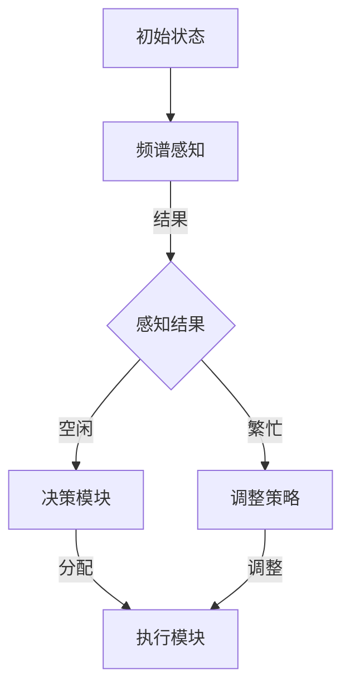
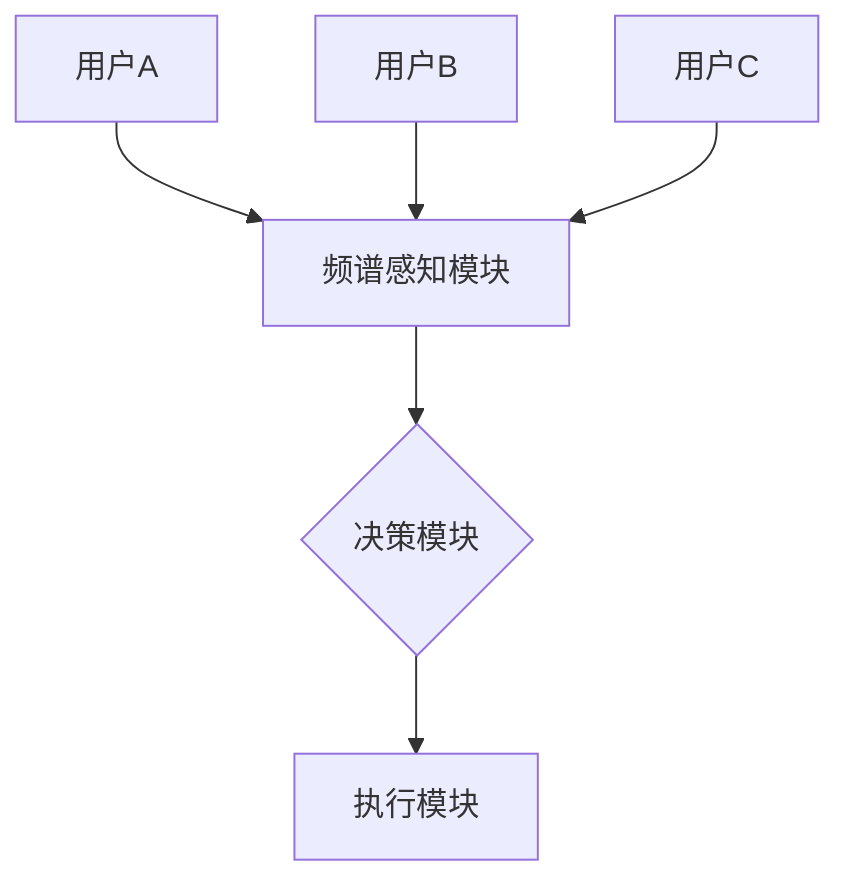

                 

### 《认知无线电：智能动态频谱访问技术》—探索频谱的未来

> **关键词**：认知无线电、智能频谱访问、动态频谱管理、无线通信、算法

> **摘要**：本文深入探讨了认知无线电技术及其在智能动态频谱访问中的应用。通过分析认知无线电的核心概念、技术原理和实际应用，本文旨在帮助读者理解这一前沿技术的潜力与挑战，为未来无线通信的发展提供参考。

---

#### 第一步：背景介绍

认知无线电技术起源于20世纪90年代，其核心理念是通过智能感知和动态适应实现无线频谱的最优利用。传统的无线电通信系统依赖于预先定义的频谱分配，这种静态的频谱管理方式在频谱资源日益紧张的大背景下，显得越来越力不从心。为了应对这一问题，认知无线电提出了一个新的解决方案。

**核心概念**：
- **频谱感知**：认知无线电系统能够实时感知周围频谱环境，检测空闲频谱资源。
- **频谱共享**：通过智能算法实现不同用户或系统间的频谱共享，提高频谱利用率。
- **频谱管理**：基于频谱感知和共享机制，实现频谱资源的动态分配和管理。

**发展历程**：
- **90年代**：理论研究与概念提出。
- **2000年代**：实验验证与原型开发。
- **2010年代**：标准化与商业化应用。
- **现在**：认知无线电技术逐渐成为无线通信领域的研究热点，其应用范围也在不断扩展。

**重要性**：
认知无线电技术在解决频谱资源短缺、提升通信质量、增强系统可靠性等方面具有重要意义，是未来无线通信发展的关键技术方向。

#### 第二步：核心概念与联系

**频谱感知**：认知无线电系统的核心功能之一。通过传感器和算法，系统能够实时监测周围频谱的使用情况，识别空闲频谱。这为频谱共享和频谱管理提供了基础数据。

**频谱共享**：在确保不会对原有用户造成干扰的前提下，认知无线电系统可以在未使用的频谱上为其他用户提供服务。这一机制极大地提高了频谱资源的利用率。

**频谱管理**：基于频谱感知和共享机制，认知无线电系统能够动态地分配和管理频谱资源，确保系统运行的高效性和稳定性。

**相关技术的关系**：
- **MIMO技术**：多输入多输出技术能够提高通信系统的频谱效率。
- **NFV技术**：网络功能虚拟化技术能够灵活地配置和管理认知无线电系统中的各种功能模块。
- **SDN技术**：软件定义网络技术能够实现认知无线电系统的集中控制和优化。

#### 第三步：智能动态频谱访问技术

**原理**：智能动态频谱访问技术基于认知无线电的原理，通过智能算法实现频谱资源的动态分配和访问。其核心在于能够实时感知频谱环境，并根据感知结果调整系统的操作策略，以最大化频谱利用率。

**技术架构**：
1. **频谱感知模块**：负责实时监测频谱环境。
2. **决策模块**：根据频谱感知结果，利用智能算法进行频谱资源的分配和调度。
3. **执行模块**：根据决策模块的指令，调整系统操作，实现频谱访问。

**实现方法**：
- **机器学习**：利用机器学习算法，通过大量历史数据训练模型，实现频谱环境的智能感知和决策。
- **博弈论**：在多用户共享频谱的场景中，使用博弈论方法实现公平高效的频谱分配。

#### 第四步：算法原理讲解

**算法mermaid流程图**：



**算法数学模型与公式**：

$$
\text{频谱利用率} = \frac{\sum_{i=1}^{n} \text{频谱分配量} \times \text{频谱价值}}{\text{总频谱资源}}
$$

**举例说明**：

假设有一块频谱资源，总带宽为100MHz，当前有3个用户A、B、C。频谱价值根据用户需求动态调整。通过智能算法，系统能够实时感知并调整频谱分配，以最大化频谱利用率。

#### 第五步：系统分析与架构设计方案

**问题场景介绍**：
假设在一个拥挤的城市环境中，多个无线通信系统需要共享有限的频谱资源，以提高通信质量和系统容量。

**系统功能设计**：
- **频谱感知**：实时监测频谱使用情况。
- **频谱分配**：基于智能算法，动态分配频谱资源。
- **频谱管理**：维护频谱资源的使用状态，确保频谱利用率最大化。

**系统架构设计**：



**系统接口设计**：
- **频谱感知接口**：用于与频谱感知设备通信。
- **决策接口**：用于与决策算法模块通信。
- **执行接口**：用于与无线通信设备通信。

**系统交互**：
- **感知-决策**：频谱感知模块向决策模块提供频谱使用数据。
- **决策-执行**：决策模块根据频谱使用数据，生成频谱分配策略，并通过执行接口传递给无线通信设备。

#### 第六步：项目实战

**环境安装**：
在Linux环境中安装认知无线电开发套件，包括频谱感知设备驱动、智能算法库等。

**系统核心实现源代码**：
```python
# 频谱感知模块示例代码
def spectrum_sensing():
    # 实时感知频谱
    # ...
    return sensed_data

# 决策模块示例代码
def decisionMaking(sensed_data):
    # 基于感知数据，动态分配频谱
    # ...
    return allocation_strategy

# 执行模块示例代码
def execute_allocation(allocation_strategy):
    # 根据分配策略，调整无线通信设备
    # ...
    pass
```

**代码应用解读与分析**：
详细分析源代码中的关键函数和流程，解释如何实现频谱感知、决策和执行。

**实际案例分析与详细讲解剖析**：
通过具体案例展示系统在实际应用中的表现，分析优势和挑战。

**项目小结**：
总结项目成果，讨论未来改进方向。

#### 第七步：最佳实践、小结与注意事项

**最佳实践**：
- 提高频谱感知精度，增强算法鲁棒性。
- 考虑多种场景，优化频谱分配策略。

**小结**：
本文介绍了认知无线电和智能动态频谱访问技术，分析了其原理、算法和系统设计。

**注意事项**：
- 频谱感知模块的准确性对系统性能至关重要。
- 智能算法需要大量数据训练，以确保高效性。

**拓展阅读**：
- 探索最新的认知无线电技术和应用。
- 深入研究智能算法和频谱管理策略。

---

**作者**：
AI天才研究院/AI Genius Institute & 禅与计算机程序设计艺术 /Zen And The Art of Computer Programming

---

通过本文的逐步分析，我们深入了解了认知无线电技术的核心概念和应用。在频谱资源日益紧张的时代，智能动态频谱访问技术为我们提供了新的解决方案，有望推动无线通信技术的发展。希望本文能为读者带来启示，共同探索频谱的未来。

