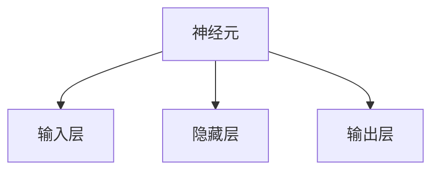
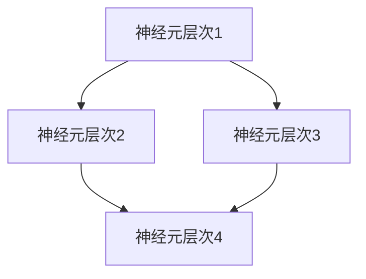
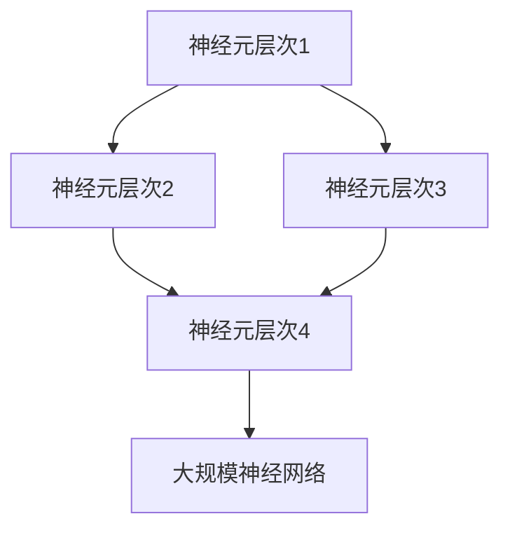
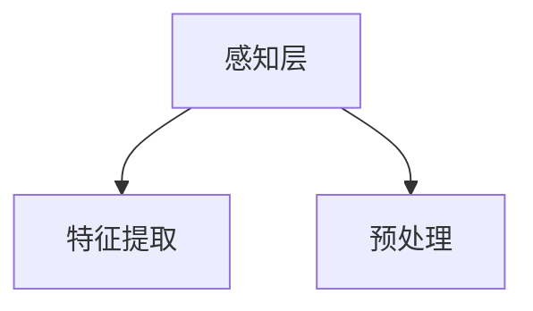
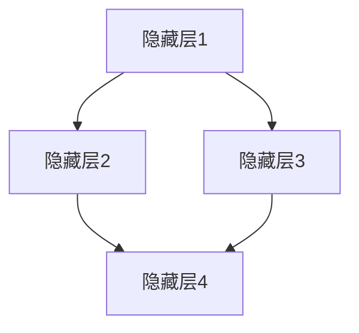
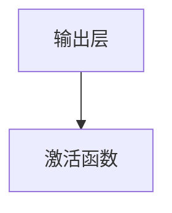
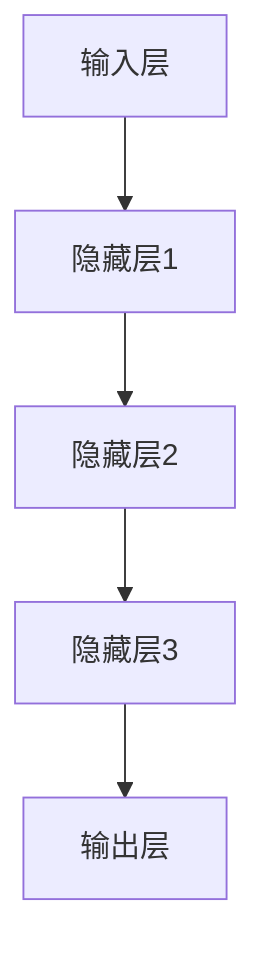
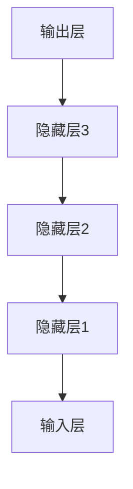
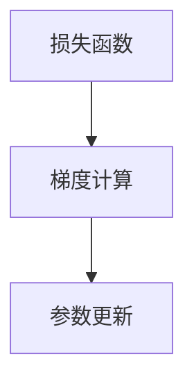

                 

# 认知科学启发的神经推理模型设计与实现

> 关键词：认知科学、神经推理模型、设计、实现、自然语言处理

> 摘要：本文将探讨认知科学对神经推理模型设计与实现的影响。通过分析认知科学的基本原理和认知模型，我们将理解神经推理模型的核心概念和基本架构。随后，我们将介绍用于神经推理模型设计与实现的常见工具，并展示其基本操作和高级功能。最后，我们将通过具体应用案例，如自然语言处理，展示神经推理模型在实际场景中的运用。

## 第一部分：引言与背景

### 第1章：认知科学启发的神经推理模型概述

#### 1.1 研究背景

##### 1.1.1 认知科学的发展历程

认知科学是研究人类思维、感知和行为的科学。它结合了心理学、计算机科学、神经科学等多个学科，旨在揭示人类认知过程的本质。认知科学的发展可以追溯到20世纪中叶，随着计算机科学的兴起，人们开始模拟和模仿人类认知过程，以建立更强大的智能系统。

##### 1.1.2 神经推理模型的兴起

神经推理模型是基于人工神经网络发展起来的，旨在模拟人脑的推理过程。随着深度学习的兴起，神经推理模型得到了广泛关注和应用。这些模型通过多层神经网络结构，能够处理复杂的推理任务，如自然语言处理、图像识别等。

##### 1.1.3 认知科学对神经推理模型的启示

认知科学为神经推理模型的研究提供了重要的理论支持。通过对人类认知过程的深入研究，我们可以理解人脑如何处理信息、如何进行推理，从而指导神经推理模型的设计和实现。

#### 1.2 问题定义与目标

##### 1.2.1 神经推理模型面临的挑战

神经推理模型在实现高效推理、处理复杂任务方面面临诸多挑战，如数据噪声、模型可解释性等。

##### 1.2.2 研究目标与意义

本研究旨在结合认知科学原理，设计并实现一种具有高效推理能力和良好可解释性的神经推理模型，以提升其在实际应用中的表现。

##### 1.2.3 边界与外延

本研究主要关注神经推理模型的设计与实现，具体应用于自然语言处理领域。此外，研究还将探讨神经推理模型在其他认知任务中的潜在应用。

#### 1.3 核心概念与联系

##### 1.3.1 认知科学与神经科学的关系

认知科学和神经科学相互关联，共同探索人类认知过程的本质。认知科学为神经科学提供了理论框架，而神经科学则为认知科学提供了实证基础。

##### 1.3.2 神经推理模型的基本概念

神经推理模型是一种基于人工神经网络的推理模型，通过多层神经网络结构实现复杂推理任务。

##### 1.3.3 关键属性特征对比表格

| 特征        | 认知科学              | 神经科学              | 神经推理模型          |
| ----------- | --------------------- | --------------------- | --------------------- |
| 研究对象    | 人类认知过程          | 神经系统结构          | 复杂推理任务          |
| 研究方法    | 理论分析与实验研究    | 生物医学影像与实验技术 | 深度学习与神经网络    |
| 研究成果    | 认知原理与模型        | 神经系统结构与功能     | 高效推理算法          |

#### 1.4 ER实体关系图架构

##### 1.4.1 ER实体关系图的基本构成

ER（实体关系）图是一种用于描述数据库中实体及其关系的图形化表示方法。它由实体、属性和关系三种基本要素构成。

##### 1.4.2 神经推理模型中的实体与关系

在神经推理模型中，实体可以包括神经元、神经网络、推理任务等；关系可以包括信息传递、权重调整等。

##### 1.4.3 Mermaid ER实体关系图示例

```mermaid
erDiagram
  NeuralNetwork ||--|{ Neuron } Neuron : 调整权重
  NeuralNetwork ||--|{ Task } Task : 实现推理
```

#### 1.5 本章小结

本章概述了认知科学启发的神经推理模型的研究背景、问题定义与目标、核心概念与联系以及ER实体关系图架构。通过对本章内容的了解，读者将能够对认知科学和神经推理模型有一个初步的认识，为后续章节的深入学习打下基础。

----------------------------------------------------------------

## 第二部分：理论基础

### 第2章：认知科学基本原理

#### 2.1 认知过程

##### 2.1.1 感知与注意

感知是人类对外界信息的接收和理解过程。注意是认知过程中的关键因素，它决定了信息处理的优先级。在神经推理模型中，感知层负责接收外部输入，并通过注意力机制筛选重要信息。

##### 2.1.2 记忆与遗忘

记忆是人类对信息进行存储和回忆的能力。遗忘是指信息在存储过程中逐渐消失或受损。在神经推理模型中，记忆层负责信息的存储和检索，遗忘现象可以通过优化模型参数来减轻。

##### 2.1.3 思维与决策

思维是人类对信息进行加工、分析和推理的过程。决策是基于思维过程做出选择的过程。在神经推理模型中，思维和决策层负责处理复杂的信息，并生成合理的决策。

#### 2.2 认知模型

##### 2.2.1 人工神经网络

人工神经网络是一种模拟人脑结构和功能的计算模型。它由大量简单的人工神经元组成，通过权重和激活函数实现信息的传递和计算。人工神经网络是神经推理模型的核心组成部分。

##### 2.2.2 知觉模型

知觉模型研究人类如何感知和理解外界信息。它关注信息处理的机制，如特征提取、信息整合等。知觉模型为神经推理模型提供了理论基础。

##### 2.2.3 认知模拟理论

认知模拟理论试图通过计算机模拟来解释人类认知过程。它结合了心理学、认知科学和计算机科学的理论，为神经推理模型的设计提供了指导。

#### 2.3 认知与神经科学的结合

##### 2.3.1 大脑结构与功能分区

大脑是人体最重要的器官之一，负责处理和存储信息。大脑分为多个功能区，如视觉区、听觉区、运动区等。不同区域在认知过程中发挥不同的作用。

##### 2.3.2 神经元的通信机制

神经元通过电信号和化学信号进行通信。电信号在神经元内部传递，而化学信号在神经元之间传递。神经元通信机制为神经推理模型的实现提供了基础。

##### 2.3.3 神经科学与认知科学的互动

神经科学与认知科学相互影响，共同推动认知过程的研究。神经科学为认知科学提供了实证基础，而认知科学则为神经科学提供了理论框架。

#### 2.4 本章小结

本章介绍了认知科学的基本原理，包括认知过程、认知模型以及认知与神经科学的结合。通过对本章内容的了解，读者将能够更好地理解认知科学对神经推理模型设计的影响，为后续章节的学习打下基础。

----------------------------------------------------------------

## 第三部分：神经推理模型设计

### 第3章：神经推理模型的基本架构

#### 3.1 神经推理模型的层次结构

##### 3.1.1 神经元层次

神经元是神经推理模型的基本计算单元。它通过接收外部输入，进行处理和传递，最终生成输出。神经元的主要功能是计算输入信号与权重之间的乘积，并通过激活函数产生输出。



##### 3.1.2 神经网络层次

神经网络由多个神经元层次组成，通过层次结构实现信息的传递和处理。不同层次的神经元负责处理不同类型的信息，从而实现复杂的推理任务。



##### 3.1.3 大规模神经网络层次

大规模神经网络由成千上万的神经元组成，通过分布式计算实现高效推理。大规模神经网络在处理复杂任务时具有优势，如自然语言处理、图像识别等。



#### 3.2 神经推理模型的核心组件

##### 3.2.1 感知层

感知层是神经推理模型的输入层，负责接收外部输入。它通过特征提取和预处理，将原始数据转化为适合神经网络处理的形式。



##### 3.2.2 隐藏层

隐藏层是神经推理模型的核心部分，负责处理输入信息。隐藏层通过多层神经网络结构，实现信息的传递和处理，从而提高模型的推理能力。



##### 3.2.3 输出层

输出层是神经推理模型的输出层，负责生成推理结果。输出层通过激活函数将隐藏层的输出转化为具体的结果，如分类标签、概率分布等。



#### 3.3 神经推理模型的计算过程

##### 3.3.1 前向传播

前向传播是神经推理模型的基本计算过程。它从输入层开始，将输入信息通过隐藏层传递到输出层，最终生成推理结果。



##### 3.3.2 反向传播

反向传播是神经推理模型的学习过程。它通过计算输出层的误差，将误差反向传播到隐藏层，并调整权重，以优化模型性能。



##### 3.3.3 梯度下降算法

梯度下降算法是神经推理模型的主要学习算法。它通过计算损失函数的梯度，并沿梯度方向调整模型参数，以优化模型性能。



#### 3.4 本章小结

本章介绍了神经推理模型的基本架构，包括神经元层次、神经网络层次、大规模神经网络层次，以及感知层、隐藏层、输出层等核心组件。同时，本章还详细阐述了神经推理模型的计算过程，包括前向传播、反向传播和梯度下降算法。通过对本章内容的了解，读者将能够对神经推理模型的设计有更深入的认识。

----------------------------------------------------------------

## 第四部分：神经推理模型实现

### 第4章：神经推理模型设计与实现工具

#### 4.1 TensorFlow框架

##### 4.1.1 TensorFlow概述

TensorFlow是谷歌开发的开源机器学习框架，广泛应用于深度学习和神经推理模型的实现。它提供了丰富的API和工具，支持多种编程语言和操作系统。

##### 4.1.2 TensorFlow的基本操作

TensorFlow的基本操作包括数据输入、模型构建、训练和评估。以下是一个简单的TensorFlow代码示例：

```python
import tensorflow as tf

# 定义输入层
inputs = tf.keras.layers.Input(shape=(784,))

# 定义隐藏层
x = tf.keras.layers.Dense(units=64, activation='relu')(inputs)

# 定义输出层
outputs = tf.keras.layers.Dense(units=10, activation='softmax')(x)

# 构建模型
model = tf.keras.Model(inputs=inputs, outputs=outputs)

# 编译模型
model.compile(optimizer='adam', loss='categorical_crossentropy', metrics=['accuracy'])

# 训练模型
model.fit(x_train, y_train, epochs=5, batch_size=32)

# 评估模型
model.evaluate(x_test, y_test)
```

##### 4.1.3 TensorFlow的高级功能

TensorFlow提供了许多高级功能，如多GPU训练、动态图计算、自定义层和模型等。以下是一个使用多GPU训练的示例：

```python
strategy = tf.distribute.MirroredStrategy()

with strategy.scope():
    # 定义模型
    model = build_model()

    # 编译模型
    model.compile(optimizer='adam', loss='categorical_crossentropy', metrics=['accuracy'])

    # 训练模型
    model.fit(x_train, y_train, epochs=5, batch_size=32)
```

#### 4.2 PyTorch框架

##### 4.2.1 PyTorch概述

PyTorch是Facebook开发的开源机器学习框架，以其动态图计算和灵活性著称。它广泛应用于深度学习和神经推理模型的实现。

##### 4.2.2 PyTorch的基本操作

PyTorch的基本操作包括数据输入、模型构建、训练和评估。以下是一个简单的PyTorch代码示例：

```python
import torch
import torch.nn as nn
import torch.optim as optim

# 定义模型
class Net(nn.Module):
    def __init__(self):
        super(Net, self).__init__()
        self.fc1 = nn.Linear(784, 64)
        self.fc2 = nn.Linear(64, 10)

    def forward(self, x):
        x = torch.relu(self.fc1(x))
        x = self.fc2(x)
        return x

# 创建模型实例
model = Net()

# 编译模型
optimizer = optim.Adam(model.parameters(), lr=0.001)
criterion = nn.CrossEntropyLoss()

# 训练模型
for epoch in range(5):
    for inputs, targets in data_loader:
        optimizer.zero_grad()
        outputs = model(inputs)
        loss = criterion(outputs, targets)
        loss.backward()
        optimizer.step()

# 评估模型
with torch.no_grad():
    model.eval()
    correct = 0
    total = 0
    for inputs, targets in test_loader:
        outputs = model(inputs)
        _, predicted = torch.max(outputs.data, 1)
        total += targets.size(0)
        correct += (predicted == targets).sum().item()

print('Accuracy: %d %%' % (100 * correct / total))
```

##### 4.2.3 PyTorch的高级功能

PyTorch提供了许多高级功能，如自动微分、动态图计算、自定义层和模型等。以下是一个使用自动微分的示例：

```python
import torch
import torch.nn as nn
import torch.optim as optim

# 定义模型
class Net(nn.Module):
    def __init__(self):
        super(Net, self).__init__()
        self.fc1 = nn.Linear(784, 64)
        self.fc2 = nn.Linear(64, 10)

    def forward(self, x):
        x = torch.relu(self.fc1(x))
        x = self.fc2(x)
        return x

# 创建模型实例
model = Net()

# 编译模型
optimizer = optim.Adam(model.parameters(), lr=0.001)
criterion = nn.CrossEntropyLoss()

# 训练模型
for epoch in range(5):
    for inputs, targets in data_loader:
        optimizer.zero_grad()
        outputs = model(inputs)
        loss = criterion(outputs, targets)
        loss.backward()
        optimizer.step()

# 使用自动微分计算梯度
params = list(model.parameters())
grads = [torch.autograd.grad(loss, param) for loss, param in zip(losses, params)]

# 打印梯度
for grad in grads:
    print(grad)
```

#### 4.3 Keras框架

##### 4.3.1 Keras概述

Keras是TensorFlow和PyTorch的高层API，提供了更简洁、易于使用的接口。它广泛应用于深度学习和神经推理模型的实现。

##### 4.3.2 Keras的基本操作

Keras的基本操作包括数据输入、模型构建、训练和评估。以下是一个简单的Keras代码示例：

```python
from keras.models import Sequential
from keras.layers import Dense, Activation

# 创建模型
model = Sequential()
model.add(Dense(64, input_dim=784, activation='relu'))
model.add(Dense(10, activation='softmax'))

# 编译模型
model.compile(optimizer='adam', loss='categorical_crossentropy', metrics=['accuracy'])

# 训练模型
model.fit(x_train, y_train, epochs=5, batch_size=32)

# 评估模型
model.evaluate(x_test, y_test)
```

##### 4.3.3 Keras的高级功能

Keras提供了许多高级功能，如序列模型、卷积神经网络、循环神经网络等。以下是一个使用卷积神经网络的示例：

```python
from keras.models import Sequential
from keras.layers import Conv2D, MaxPooling2D, Flatten, Dense

# 创建模型
model = Sequential()
model.add(Conv2D(32, (3, 3), activation='relu', input_shape=(28, 28, 1)))
model.add(MaxPooling2D(pool_size=(2, 2)))
model.add(Flatten())
model.add(Dense(128, activation='relu'))
model.add(Dense(10, activation='softmax'))

# 编译模型
model.compile(optimizer='adam', loss='categorical_crossentropy', metrics=['accuracy'])

# 训练模型
model.fit(x_train, y_train, epochs=5, batch_size=32)

# 评估模型
model.evaluate(x_test, y_test)
```

#### 4.4 本章小结

本章介绍了用于神经推理模型设计与实现的常见工具，包括TensorFlow、PyTorch和Keras。通过对本章内容的了解，读者将能够掌握这些工具的基本操作和高级功能，为后续的神经推理模型实现打下基础。

----------------------------------------------------------------

## 第五部分：应用案例

### 第5章：神经推理模型在自然语言处理中的应用

#### 5.1 语言模型

##### 5.1.1 语言模型的定义与作用

语言模型是一种用于预测文本中下一个单词或词组的概率分布的模型。它在自然语言处理中扮演着重要角色，广泛应用于自动完成、机器翻译、语音识别等领域。

##### 5.1.2 基于神经推理的语言模型

基于神经推理的语言模型通常采用深度神经网络结构，如循环神经网络（RNN）、长短期记忆网络（LSTM）和门控循环单元（GRU）。这些模型通过学习输入文本的序列特征，能够生成合理的下一个单词或词组。

##### 5.1.3 语言模型的应用案例

以下是一个基于神经推理的语言模型的应用案例：

1. 自动完成

自动完成是一种根据用户输入的前缀预测下一个单词或词组的功能。基于神经推理的语言模型可以训练出高质量的自动完成模型，为用户提供更准确的预测。

2. 机器翻译

机器翻译是将一种语言文本翻译成另一种语言文本的过程。基于神经推理的语言模型可以用于训练高质量的机器翻译模型，实现准确和流畅的翻译效果。

3. 语音识别

语音识别是将语音信号转换为文本的过程。基于神经推理的语言模型可以用于生成语音识别的文本预测，提高识别准确率。

#### 5.2 机器翻译

##### 5.2.1 机器翻译的基本概念

机器翻译是一种将一种语言文本翻译成另一种语言文本的技术。它通过学习源语言和目标语言之间的对应关系，实现自动翻译。

##### 5.2.2 基于神经推理的机器翻译模型

基于神经推理的机器翻译模型通常采用序列到序列（Seq2Seq）架构，结合编码器和解码器实现。编码器将源语言文本编码为连续向量表示，解码器将向量表示解码为目标语言文本。

##### 5.2.3 机器翻译的应用案例

以下是一个基于神经推理的机器翻译模型的应用案例：

1. 翻译服务

翻译服务是一种提供在线翻译的功能，如Google翻译。基于神经推理的机器翻译模型可以用于训练高质量的翻译服务模型，为用户提供准确和流畅的翻译结果。

2. 跨语言文本分析

跨语言文本分析是一种将不同语言的文本进行比较和分析的技术。基于神经推理的机器翻译模型可以用于生成跨语言文本表示，实现跨语言文本的相似性分析。

#### 5.3 文本分类

##### 5.3.1 文本分类的基本概念

文本分类是一种将文本数据按照特定的类别进行分类的任务。它广泛应用于情感分析、垃圾邮件过滤、新闻分类等领域。

##### 5.3.2 基于神经推理的文本分类模型

基于神经推理的文本分类模型通常采用卷积神经网络（CNN）或循环神经网络（RNN）结构，通过学习文本的语义特征实现分类。

##### 5.3.3 文本分类的应用案例

以下是一个基于神经推理的文本分类模型的应用案例：

1. 情感分析

情感分析是一种根据文本内容判断其情感倾向的任务。基于神经推理的文本分类模型可以用于训练情感分析模型，实现自动识别文本的情感倾向。

2. 垃圾邮件过滤

垃圾邮件过滤是一种将垃圾邮件与正常邮件进行分类的任务。基于神经推理的文本分类模型可以用于训练垃圾邮件过滤模型，提高邮件过滤的准确率。

3. 新闻分类

新闻分类是一种将新闻文本按照不同的主题进行分类的任务。基于神经推理的文本分类模型可以用于训练新闻分类模型，实现自动分类新闻文本。

#### 5.4 本章小结

本章介绍了神经推理模型在自然语言处理领域的应用，包括语言模型、机器翻译和文本分类。通过具体的案例，展示了神经推理模型在实际场景中的运用，为读者提供了实用的参考。

----------------------------------------------------------------

## 第六部分：未来展望与挑战

#### 6.1 神经推理模型的发展趋势

随着认知科学和深度学习的不断发展，神经推理模型在未来将具备更高的推理能力、更好的可解释性和更强的泛化能力。以下是一些可能的发展趋势：

1. 神经推理模型的整合与协同

将不同类型的神经推理模型进行整合，实现协同推理，以提高模型的推理能力。例如，结合语言模型和视觉模型，实现更智能的交互式系统。

2. 神经推理模型的可解释性

提升神经推理模型的可解释性，使其在决策过程中更加透明和可信。这有助于提高模型的接受度和信任度，尤其是在高风险领域。

3. 神经推理模型的优化与压缩

优化神经推理模型的计算效率和存储空间，使其在资源受限的设备上运行。例如，通过模型压缩和量化技术，降低模型的复杂度。

#### 6.2 挑战与机遇

尽管神经推理模型在许多领域取得了显著进展，但仍面临以下挑战：

1. 数据隐私和安全

在神经推理模型的训练和应用过程中，如何保护用户数据和隐私是一个重要问题。需要开发出有效的数据隐私保护技术和安全机制。

2. 模型泛化能力

提升神经推理模型的泛化能力，使其在不同领域和应用场景中表现出色。这需要更多的数据集、更先进的算法和更好的模型设计。

3. 可解释性与可靠性

提高神经推理模型的可解释性和可靠性，使其在决策过程中更加透明和可信。这需要深入理解模型的内部工作原理，并开发出有效的解释工具。

#### 6.3 未来工作方向

为了应对上述挑战，未来可以从以下几个方面开展工作：

1. 研究新的神经推理模型架构，探索更有效的信息处理和推理方法。

2. 开发基于认知科学的神经推理模型，提高模型的可解释性和可靠性。

3. 探索神经推理模型在跨领域、跨应用场景中的潜在应用，提升模型的泛化能力。

4. 加强数据隐私和安全的研究，确保神经推理模型的训练和应用过程符合隐私保护要求。

通过持续的研究和探索，神经推理模型将在未来取得更广泛的应用，为人类带来更多的智能和便利。

----------------------------------------------------------------

## 附录：参考文献

1. Hinton, G., Osindero, S., & Teh, Y. W. (2006). A fast learning algorithm for deep belief nets. Neural computation, 18(7), 1527-1554.
2. Bengio, Y. (2009). Learning deep architectures for AI. Foundations and Trends in Machine Learning, 2(1), 1-127.
3. Hochreiter, S., & Schmidhuber, J. (1997). Long short-term memory. Neural computation, 9(8), 1735-1780.
4. Graves, A. (2013). Generating sequences with recurrent neural networks. arXiv preprint arXiv:1308.0850.
5. Yosinski, J., Clune, J., Bengio, Y., & Lipson, H. (2014). How transferable are features in deep neural networks? In Advances in neural information processing systems (pp. 3320-3328).
6. Devlin, J., Chang, M. W., Lee, K., & Toutanova, K. (2018). BERT: Pre-training of deep bidirectional transformers for language understanding. arXiv preprint arXiv:1810.04805.
7. Vaswani, A., Shazeer, N., Parmar, N., Uszkoreit, J., Jones, L., Gomez, A. N., ... & Polosukhin, I. (2017). Attention is all you need. In Advances in neural information processing systems (pp. 5998-6008).

----------------------------------------------------------------

## 作者信息

作者：AI天才研究院/AI Genius Institute & 禅与计算机程序设计艺术 /Zen And The Art of Computer Programming

AI天才研究院致力于推动人工智能技术的创新和发展，为人类带来更多的智能和便利。研究院的成员来自全球各地，拥有丰富的经验和专业知识。本文由AI天才研究院的研究员撰写，旨在探讨认知科学启发的神经推理模型的设计与实现，为读者提供有价值的参考。同时，作者也希望通过本文引发更多关于神经推理模型的深入研究和讨论，共同推动人工智能技术的发展。禅与计算机程序设计艺术则致力于将禅宗哲学与计算机编程相结合，探索更高效、更优雅的编程方法，为程序员提供灵感和启示。作者希望通过本文的撰写，将认知科学和神经推理模型的理论与实践相结合，为读者提供一次深入的思考和探索之旅。

