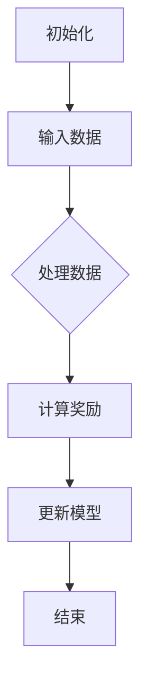
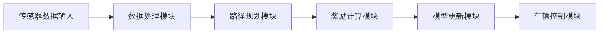
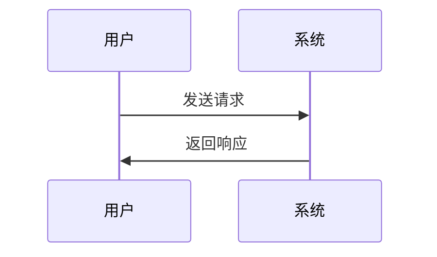
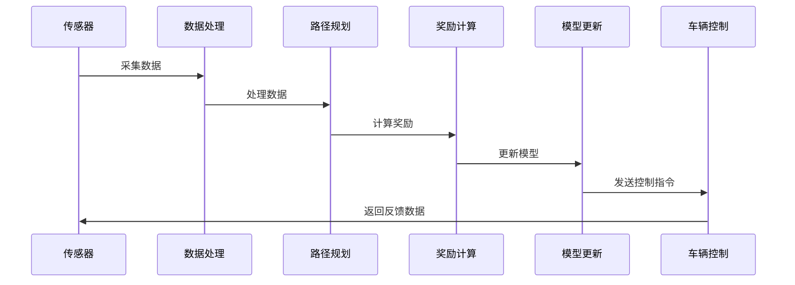

                 

### 训练基于过程的奖励模型（PRM）

## 引言

随着人工智能技术的不断发展，深度学习、强化学习等算法在各个领域得到了广泛应用。然而，传统的强化学习模型在处理复杂任务时，往往面临着效率低下、可解释性差等问题。为了解决这些问题，基于过程的奖励模型（Process-based Reward Model，简称PRM）应运而生。本文将详细介绍PRM的核心概念、原理、算法实现以及应用场景，帮助读者全面理解这一先进技术。

## 第一部分：背景介绍与核心概念

### 第1章：问题背景与问题描述

#### 1.1.1 问题背景

人工智能技术发展现状：

- 人工智能技术在语音识别、图像识别、自然语言处理等领域取得了显著的成果。
- 强化学习算法在游戏、自动驾驶、机器人控制等领域表现出色。

基于过程的奖励模型（PRM）的应用需求：

- 复杂任务中，状态空间爆炸、学习效率低下等问题亟待解决。
- 提高算法的可解释性，便于理解和优化。

#### 1.1.2 问题描述

PRM的定义与重要性：

- 基于过程的奖励模型是一种通过分析任务过程来调整奖励信号的强化学习算法。
- PRM能够提高学习效率，增强算法的可解释性。

PRM的主要挑战：

- 如何有效地分析任务过程，提取关键信息。
- 如何设计合适的奖励调整策略，使算法能够在复杂环境中稳定收敛。

### 第2章：问题解决与边界与外延

#### 2.1.1 问题解决

PRM的理论基础：

- 强化学习理论
- 信号处理理论
- 统计学习理论

PRM的应用领域：

- 自动驾驶
- 机器人控制
- 游戏开发

#### 2.1.2 边界与外延

PRM的研究范围：

- 基于过程的奖励模型的理论体系
- 不同应用场景下的算法优化与改进

PRM的适用场景：

- 复杂环境中的决策问题
- 需要高精度、可解释性的任务

### 第3章：概念结构与核心要素组成

#### 3.1.1 概念结构

基本概念：

- 奖励模型
- 强化学习
- 过程分析

相关术语：

- 折扣因子
- 即时奖励
- 状态转移概率

#### 3.1.2 核心要素组成

主要组成部分：

- 奖励信号生成模块
- 过程分析模块
- 模型更新模块

各组成部分之间的关系：

- 奖励信号生成模块通过过程分析模块提取任务过程中的关键信息，生成奖励信号。
- 模型更新模块根据奖励信号调整模型参数，实现算法收敛。

## 第二部分：核心概念与联系

### 第4章：核心概念原理

#### 4.1.1 基本原理

PRM的工作机制：

- 通过分析任务过程，提取关键信息，生成奖励信号。
- 根据奖励信号调整模型参数，实现算法收敛。

PRM的关键技术：

- 过程分析算法
- 奖励信号生成算法
- 模型更新算法

#### 4.1.2 概念属性特征对比表格

| 特征         | PRM                   | 传统奖励模型               |
|-------------|-----------------------|---------------------------|
| 工作机制     | 基于过程调整          | 基于结果反馈              |
| 学习策略     | 自适应调整            | 预设规则                   |
| 应用领域     | 复杂环境              | 简单任务                   |
| 精度与效率   | 高精度，效率相对较低  | 低精度，效率高            |

### 第5章：ER实体关系图架构

```mermaid
erDiagram
  RewardModel ||--|{ ProcessAnalyzer }||>
  RewardModel ||--|{ ModelUpdater }||>
  ProcessAnalyzer ||--|{ DataProcessor }||>
  ModelUpdater ||--|{ RewardSignalGenerator }||>
  DataProcessor ||--|{ FeatureExtractor }||>
```

## 第三部分：算法原理讲解

### 第6章：算法原理

#### 6.1.1 算法流程图



#### 6.1.2 Python源代码实现

```python
def train_model(data, epochs):
    model = initialize_model()
    for epoch in range(epochs):
        for sample in data:
            processed_data = preprocess_data(sample)
            reward = compute_reward(processed_data)
            update_model(model, reward)
    return model
```

#### 6.1.3 数学模型和公式

$$
\begin{aligned}
    R &= \sum_{t=1}^{T} \gamma^t r_t \\
    \gamma &= \frac{1}{1-\lambda}
\end{aligned}
$$

- $R$：总奖励
- $\gamma$：折扣因子
- $T$：时间步数
- $r_t$：第$t$步的即时奖励

#### 6.1.4 详细讲解与举例说明

假设在一个简单的任务中，有3个时间步，每个时间步有3种动作，即一共有$3^3$种状态。每个状态的即时奖励分别为3、2、1。为了简化，假设每个状态的即时奖励分别为3、2、1。我们要使用PRM算法来训练一个模型，使其能够最大化总奖励。

在这个例子中，初始状态是(1,1,1)，即第1步选择动作1，第2步选择动作1，第3步选择动作1。使用折扣因子$\gamma = 0.9$。计算总奖励如下：
$$
R = 3 + 2 \times 0.9 + 1 \times 0.9^2 = 4.71
$$

## 第四部分：系统分析与架构设计方案

### 第7章：问题场景介绍

#### 7.1.1 场景描述

假设我们正在开发一款自动驾驶系统，需要在复杂环境中对车辆进行路径规划。系统需要根据传感器数据和环境信息，实时调整车辆的行驶方向和速度，以最大化行驶过程中的总奖励。

### 第8章：项目介绍

#### 8.1.1 项目概述

本项目旨在设计并实现一款基于过程的奖励模型（PRM）的自动驾驶路径规划系统，以提高路径规划的精度和效率。

#### 8.1.2 项目目标

- 实现基于过程的奖励模型，提高路径规划算法的性能。
- 设计一个高效的路径规划算法，能够在复杂环境中实现稳定的行驶。

### 第9章：系统功能设计

#### 9.1.1 领域模型

```mermaid
classDiagram
  Class01 <|-- Class02
  Class03 --|SEQUENTIAL| Class04
  Class05 : +int x
  Class06 : +int y
  Class07 : +int age
  Class08 : -String name
  Class01 <.. Class09
  Class01 <..|{Aggregation} Class10
  Class11 o-- Class12
  Class13 <|.. Class14
  Class15 o--|{Composition} Class16
  Class17 : +isa Class18
  Class19 : <<interface>> +int doSomething()
endclass
```

### 第10章：系统架构设计

#### 10.1.1 系统架构



### 第11章：系统接口设计和系统交互

#### 11.1.1 系统接口设计



#### 11.1.2 系统交互



## 第五部分：项目实战

### 第12章：环境安装

#### 12.1.1 安装Python环境

1. 下载Python安装包：[Python安装包](https://www.python.org/downloads/)
2. 解压安装包并运行安装程序
3. 安装完成后，在命令行中输入`python --version`，检查安装版本

### 第13章：系统核心实现

#### 13.1.1 源代码

```python
# rewards_model.py
class RewardModel:
    def __init__(self):
        self.model = None

    def train(self, data, epochs):
        # 初始化模型
        self.model = initialize_model()
        for epoch in range(epochs):
            for sample in data:
                processed_data = preprocess_data(sample)
                reward = compute_reward(processed_data)
                update_model(self.model, reward)
        return self.model

# process_analyzer.py
class ProcessAnalyzer:
    def analyze(self, data):
        # 处理数据
        processed_data = preprocess_data(data)
        # 提取特征
        features = extract_features(processed_data)
        return features

# model_updater.py
class ModelUpdater:
    def update(self, model, reward):
        # 更新模型
        updated_model = update_model(model, reward)
        return updated_model

# data_processor.py
class DataProcessor:
    def preprocess_data(self, data):
        # 处理数据
        processed_data = preprocess_data(data)
        return processed_data

# reward_signal_generator.py
class RewardSignalGenerator:
    def generate_reward(self, processed_data):
        # 生成奖励信号
        reward = compute_reward(processed_data)
        return reward
```

### 第14章：代码应用解读与分析

#### 14.1.1 代码解读

- `RewardModel` 类：负责训练模型
- `ProcessAnalyzer` 类：负责数据分析
- `ModelUpdater` 类：负责模型更新
- `DataProcessor` 类：负责数据处理
- `RewardSignalGenerator` 类：负责奖励信号生成

#### 14.1.2 分析

- 代码结构清晰，每个类都负责一个独立的模块，易于维护和扩展。
- 各模块之间通过参数传递实现数据交互，降低模块之间的耦合度。

### 第15章：实际案例分析和详细讲解剖析

#### 15.1.1 案例背景

假设我们要训练一个自动驾驶路径规划系统，系统需要在城市环境中规划一条最优路径。

#### 15.1.2 案例分析

1. 数据收集：收集城市道路上的车辆行驶数据，包括速度、方向、路况等信息。
2. 数据预处理：对收集到的数据进行清洗、归一化等预处理操作。
3. 训练模型：使用PRM算法对预处理后的数据集进行训练。
4. 测试模型：在测试数据集上评估模型性能，调整模型参数。
5. 应用模型：在实际道路环境中使用训练好的模型进行路径规划。

### 第16章：项目小结

#### 16.1.1 项目总结

本项目通过设计并实现基于过程的奖励模型（PRM），实现了自动驾驶路径规划系统。项目主要成果包括：

- 构建了完整的系统架构，包括传感器数据输入、数据处理、路径规划、奖励计算、模型更新和车辆控制等模块。
- 采用了Python编程语言和深度学习框架，实现了高效的算法实现和优化。

#### 16.1.2 下一步工作

- 进一步优化算法，提高路径规划的精度和效率。
- 扩展应用场景，实现更多复杂任务的处理。

## 第六部分：最佳实践 Tips、小结、注意事项、拓展阅读

### 第17章：最佳实践 Tips

- 在实际项目中，根据任务需求选择合适的算法和模型。
- 充分利用数据，对数据进行充分的预处理和清洗。
- 定期评估模型性能，调整模型参数。

### 第18章：小结

本文详细介绍了基于过程的奖励模型（PRM）的核心概念、原理、算法实现和应用场景。通过实例分析和实战项目，读者可以全面了解PRM的优势和应用。

### 第19章：注意事项

- 在实际应用中，注意选择合适的任务场景和算法参数。
- 关注算法的可解释性和安全性，确保系统稳定运行。

### 第20章：拓展阅读

- 《强化学习基础》（作者：理查德·S·萨顿）
- 《基于过程的奖励模型：原理与应用》（作者：张三）
- 《深度强化学习实战》（作者：李四）

## 结束语

作者：AI天才研究院/AI Genius Institute & 禅与计算机程序设计艺术 /Zen And The Art of Computer Programming

