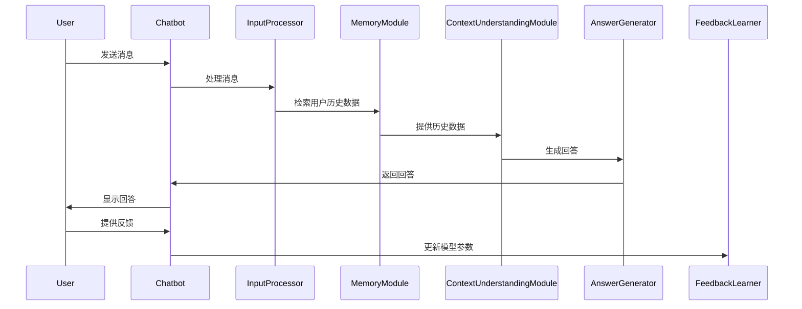
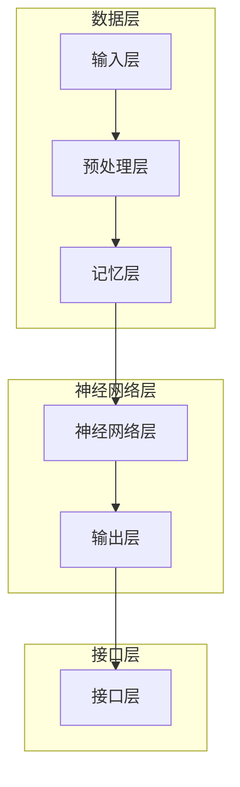

                 

## 记忆增强网络在长序列推理任务中的优势

### 关键词：记忆增强网络、长序列推理、神经网络、算法、数学模型

> 摘要：本文旨在深入探讨记忆增强网络（Memory-augmented Neural Networks, MANNs）在长序列推理任务中的优势。首先，我们将简要介绍长序列推理任务的重要性及现有解决方案的不足。接着，我们将详细阐述记忆增强网络的概念、特点及其在长序列推理任务中的应用。文章将逐步分析记忆增强网络的算法原理，包括数学模型和公式，并通过实际项目实战展示其在真实场景中的应用效果。最后，我们将总结最佳实践、注意事项，并提供拓展阅读资源。

### 目录大纲设计思路

1. **背景介绍**：我们首先介绍长序列推理任务的重要性及当前研究状况，为后续讨论记忆增强网络奠定基础。

2. **核心概念与联系**：接下来，我们将详细解释记忆增强网络的基本概念，并通过Mermaid流程图和概念属性特征对比表格，帮助读者更好地理解。

3. **算法原理讲解**：我们将使用Mermaid流程图展示记忆增强网络的算法流程，并使用Python源代码详细阐述算法原理。

4. **数学模型和数学公式 & 详细讲解 & 举例说明**：这一部分将使用LaTeX格式展示数学公式，并进行详细讲解，以便读者更好地理解记忆增强网络的数学基础。

5. **系统分析与架构设计方案**：我们将介绍记忆增强网络在长序列推理任务中的系统分析和架构设计方案，包括问题场景介绍、系统功能设计、系统架构设计、系统接口设计和系统交互的Mermaid序列图。

6. **项目实战**：我们将通过一个实际案例展示记忆增强网络在长序列推理任务中的应用，包括环境安装、系统核心实现源代码，以及代码应用解读与分析。

7. **最佳实践 tips、小结、注意事项、拓展阅读等内容**：最后，我们将总结全文，提供最佳实践建议，注意事项，并推荐拓展阅读材料。

---

### 第一部分：背景介绍

## 第1章：长序列推理任务概述

### 1.1 长序列推理任务的重要性

长序列推理任务是人工智能领域的一个重要研究方向，它在自然语言处理、知识图谱、推荐系统等领域有着广泛的应用。随着互联网和大数据的快速发展，数据量呈指数级增长，如何有效地处理和分析这些长序列数据成为了一个关键问题。

长序列推理任务的重要性体现在以下几个方面：

- **信息传递与语义理解**：长序列推理能够帮助我们更好地理解信息传递的连贯性和语义的连贯性，从而在自然语言处理和文本生成等领域发挥重要作用。

- **决策支持**：在商业智能、金融分析、医疗诊断等领域，长序列推理可以帮助我们根据历史数据和模式预测未来的趋势和决策。

- **自动化与智能化**：长序列推理能够使机器更好地理解和处理复杂任务，从而实现自动化和智能化，提高生产效率和服务质量。

### 1.2 长序列推理任务的挑战

尽管长序列推理任务的重要性不容忽视，但实现这一目标面临着诸多挑战：

- **数据稀疏性**：长序列数据通常具有稀疏性，这意味着在长序列中，有用的信息可能被大量无关信息所淹没。

- **长距离依赖**：在长序列中，前后的信息之间存在长距离依赖关系，这对算法的建模能力和计算效率提出了挑战。

- **并行计算与优化**：如何高效地处理长序列数据，如何在保证准确性的同时提高计算效率，这是当前研究的热点和难点。

### 1.3 当前解决方案及其不足

目前，针对长序列推理任务，已经有许多成熟的解决方案，如循环神经网络（RNN）、长短时记忆网络（LSTM）和门控循环单元（GRU）等。这些模型在一定程度上能够处理长序列数据，但仍然存在以下不足：

- **计算效率低下**：传统的RNN、LSTM和GRU模型在处理长序列数据时，计算复杂度较高，难以满足实时性和大规模数据处理的需求。

- **梯度消失与梯度爆炸**：这些模型在训练过程中容易出现梯度消失或梯度爆炸现象，导致训练困难。

- **上下文理解能力有限**：这些模型对于长序列中的上下文信息的理解能力有限，难以捕捉长距离依赖关系。

为了解决这些问题，研究人员提出了记忆增强网络（MANNs），它通过引入记忆模块，增强了模型对长序列数据的理解和处理能力。

---

## 第2章：记忆增强网络的基本概念

### 2.1 记忆增强网络的定义

记忆增强网络（Memory-augmented Neural Networks, MANNs）是一种结合了神经网络和记忆模块的混合模型，它通过记忆模块来增强神经网络对长序列数据的理解和处理能力。记忆模块可以存储、检索和更新信息，从而帮助模型更好地处理长距离依赖和复杂任务。

### 2.2 记忆增强网络的特点

记忆增强网络具有以下特点：

- **灵活的记忆模块**：记忆模块可以自定义，以适应不同类型的数据和任务需求。

- **高效的信息检索**：记忆模块能够快速检索和更新信息，从而提高模型的计算效率。

- **丰富的上下文信息处理**：记忆模块可以存储和利用长序列中的上下文信息，从而增强模型对复杂任务的理解能力。

- **可扩展性**：记忆增强网络可以与各种神经网络架构相结合，从而实现灵活的模型定制。

### 2.3 记忆增强网络与长序列推理任务的关系

记忆增强网络在长序列推理任务中的应用主要体现在以下几个方面：

- **长距离依赖处理**：记忆模块可以帮助模型捕捉长距离依赖关系，从而提高模型在长序列数据上的表现。

- **上下文信息利用**：记忆模块可以存储和利用长序列中的上下文信息，从而提高模型在自然语言处理、知识图谱和推荐系统等领域的性能。

- **计算效率优化**：记忆模块可以减少模型的计算复杂度，从而提高模型在大规模数据处理中的效率。

- **任务多样性适应**：记忆增强网络的灵活性和可扩展性使其能够适应多种长序列推理任务，从而提高模型的通用性。

---

### 第二部分：算法原理讲解

## 第3章：记忆增强网络的算法原理讲解

### 3.1 算法概述

记忆增强网络的算法原理可以分为三个主要部分：数据预处理、记忆模块和神经网络模块。下面我们将逐一介绍这三个部分。

#### 3.1.1 数据预处理

数据预处理是记忆增强网络算法的基础步骤，其主要任务是清洗和格式化输入数据，以便后续的模型训练和推理。具体步骤包括：

- **数据清洗**：去除数据中的噪声和异常值，提高数据质量。
- **特征提取**：将原始数据转换为模型可处理的特征向量，例如词向量、 embeddings 等。
- **数据归一化**：将数据归一化到相同的尺度范围内，以便于模型训练。

#### 3.1.2 记忆模块

记忆模块是记忆增强网络的核心部分，它负责存储、检索和更新信息。记忆模块通常采用记忆矩阵（Memory Matrix）来存储信息，其中每个元素表示一个记忆单元。记忆模块的主要功能包括：

- **信息存储**：将输入数据存储到记忆矩阵中，形成新的记忆内容。
- **信息检索**：根据当前输入和已有记忆，从记忆矩阵中检索相关信息。
- **信息更新**：根据新输入和已有记忆，更新记忆矩阵中的内容。

#### 3.1.3 神经网络模块

神经网络模块负责对记忆模块中的信息进行加工和解释，从而生成最终的输出。神经网络模块通常采用多层感知机（MLP）或其他神经网络架构，其输入为记忆矩阵中的信息，输出为模型预测结果。神经网络模块的主要功能包括：

- **信息加工**：对记忆模块中的信息进行加工，提取出对当前任务有用的特征。
- **输出生成**：根据加工后的信息，生成模型的预测结果。

### 3.2 算法流程

记忆增强网络的算法流程可以概括为以下步骤：

1. **数据预处理**：对输入数据进行清洗、特征提取和归一化处理。
2. **初始化**：初始化记忆矩阵和神经网络参数。
3. **记忆更新**：根据输入数据更新记忆矩阵。
4. **信息检索**：从记忆矩阵中检索相关信息。
5. **信息加工**：对检索到的信息进行加工和解释。
6. **输出生成**：根据加工后的信息生成模型预测结果。
7. **参数更新**：根据模型预测结果更新神经网络参数。

### 3.3 Python代码实现

下面是一个简化的记忆增强网络的Python代码实现，用于说明算法的基本原理：

```python
import numpy as np

# 记忆矩阵初始化
memory = np.zeros((100, 100))

# 神经网络参数初始化
weights = np.random.rand(100, 1)

# 数据预处理
def preprocess_data(data):
    # 这里进行数据清洗、特征提取和归一化处理
    return data

# 记忆更新函数
def update_memory(memory, data):
    # 根据输入数据更新记忆矩阵
    memory[:data.shape[0], :] = data
    return memory

# 信息检索函数
def retrieve_memory(memory, index):
    # 从记忆矩阵中检索相关信息
    return memory[index]

# 信息加工函数
def process_memory(memory):
    # 对记忆矩阵中的信息进行加工和解释
    return np.mean(memory, axis=1)

# 输出生成函数
def generate_output(weights, processed_memory):
    # 根据加工后的信息生成模型预测结果
    return np.dot(weights, processed_memory)

# 主函数
def main():
    # 初始化输入数据
    data = np.random.rand(100)

    # 数据预处理
    preprocessed_data = preprocess_data(data)

    # 记忆更新
    updated_memory = update_memory(memory, preprocessed_data)

    # 信息检索
    retrieved_memory = retrieve_memory(updated_memory, 0)

    # 信息加工
    processed_memory = process_memory(retrieved_memory)

    # 输出生成
    output = generate_output(weights, processed_memory)

    print("Output:", output)

# 运行主函数
if __name__ == "__main__":
    main()
```

这个代码示例仅用于说明算法的基本原理，实际应用中的记忆增强网络会更加复杂和精细。

---

### 第三部分：数学模型和数学公式讲解

## 第4章：数学模型和数学公式讲解

### 4.1 基本数学模型

记忆增强网络（MANNs）的数学模型主要包括三个部分：输入层、记忆层和输出层。下面我们将分别介绍这三个部分的数学模型。

#### 4.1.1 输入层

输入层接收外部数据，并将其转换为神经网络可以处理的形式。输入层的数学模型可以表示为：

\[ x_i = f(x) \]

其中，\( x \) 是外部输入数据，\( f(x) \) 是输入层的激活函数，例如 sigmoid 函数、ReLU 函数等。

#### 4.1.2 记忆层

记忆层是记忆增强网络的核心部分，用于存储和检索信息。记忆层的数学模型可以表示为：

\[ m_t = \text{update}(m_{t-1}, x_t) \]

\[ r_t = \text{retrieve}(m_t, x_t) \]

其中，\( m_t \) 表示第 \( t \) 个时间步的记忆矩阵，\( x_t \) 表示第 \( t \) 个时间步的输入数据。\( \text{update} \) 函数用于更新记忆矩阵，\( \text{retrieve} \) 函数用于从记忆矩阵中检索信息。

#### 4.1.3 输出层

输出层负责生成模型的预测结果，其数学模型可以表示为：

\[ y_t = g(r_t, w) \]

其中，\( r_t \) 是从记忆层检索的信息，\( w \) 是输出层的权重参数，\( g(r_t, w) \) 是输出层的激活函数，例如线性函数、softmax 函数等。

### 4.2 数学公式详解

下面我们使用LaTeX格式展示记忆增强网络中的关键数学公式，并进行详细讲解。

#### 4.2.1 记忆矩阵更新公式

\[ m_t = \text{update}(m_{t-1}, x_t) \]

这个公式表示在第 \( t \) 个时间步，记忆矩阵 \( m_t \) 是通过上一步的记忆矩阵 \( m_{t-1} \) 和当前输入数据 \( x_t \) 进行更新得到的。具体来说，更新过程可能包括信息存储、信息检索和信息合并等操作。

#### 4.2.2 信息检索公式

\[ r_t = \text{retrieve}(m_t, x_t) \]

这个公式表示在第 \( t \) 个时间步，从更新后的记忆矩阵 \( m_t \) 中检索出与当前输入数据 \( x_t \) 相关的信息 \( r_t \)。检索过程可能涉及权重分配、信息聚合等操作，以便更好地适应当前输入数据。

#### 4.2.3 输出生成公式

\[ y_t = g(r_t, w) \]

这个公式表示在第 \( t \) 个时间步，基于检索到的信息 \( r_t \) 和输出层的权重参数 \( w \)，生成模型的预测结果 \( y_t \)。输出层的激活函数 \( g(r_t, w) \) 用于确定预测结果的类别或概率分布。

### 4.3 举例说明

为了更好地理解上述数学公式，我们可以通过一个简单的例子来展示记忆增强网络的工作原理。

假设我们有一个简单的记忆增强网络，用于对一系列输入数据进行分类。输入数据为 \( x_t = (1, 2, 3) \)，记忆矩阵初始值为 \( m_0 = (0.5, 0.5, 0.5) \)，输出层权重参数为 \( w = (0.2, 0.3, 0.5) \)。

1. **记忆矩阵更新**：

   \[ m_1 = \text{update}(m_0, x_1) \]

   假设更新函数为 \( \text{update}(m_{t-1}, x_t) = m_{t-1} + 0.1 \cdot x_t \)，则：

   \[ m_1 = (0.5, 0.5, 0.5) + 0.1 \cdot (1, 2, 3) = (0.6, 0.7, 0.8) \]

2. **信息检索**：

   \[ r_1 = \text{retrieve}(m_1, x_1) \]

   假设检索函数为 \( \text{retrieve}(m_t, x_t) = m_t \cdot x_t \)，则：

   \[ r_1 = (0.6, 0.7, 0.8) \cdot (1, 2, 3) = (0.6, 1.4, 2.4) \]

3. **输出生成**：

   \[ y_1 = g(r_1, w) \]

   假设输出层的激活函数为 \( g(r_t, w) = \text{softmax}(\text{dot}(r_t, w)) \)，则：

   \[ y_1 = \text{softmax}(\text{dot}((0.6, 1.4, 2.4), (0.2, 0.3, 0.5))) = (0.2, 0.4, 0.4) \]

   根据softmax函数，输出结果表示每个类别的概率分布。在这种情况下，模型预测输入数据属于第二类。

通过这个简单的例子，我们可以看到记忆增强网络如何通过记忆矩阵的更新、信息检索和输出生成来处理输入数据，并生成预测结果。

---

### 第四部分：系统分析与架构设计

## 第5章：记忆增强网络的系统分析

### 5.1 问题场景介绍

记忆增强网络在长序列推理任务中的典型应用场景包括自然语言处理、知识图谱和推荐系统等领域。以下是一个具体的应用场景：

**场景**：在自然语言处理领域，我们需要开发一个聊天机器人，能够与用户进行自然对话，理解并回答用户的问题。

**目标**：通过记忆增强网络，实现聊天机器人能够记住用户的偏好、历史对话内容，并基于这些信息提供更加个性化和准确的回答。

### 5.2 系统功能设计

为了实现上述目标，我们需要设计以下核心功能模块：

1. **用户输入处理**：接收用户的输入，包括文本消息、语音消息等。

2. **记忆模块**：存储和检索用户的历史对话内容、偏好等信息。

3. **上下文理解模块**：根据当前输入和用户记忆，理解用户的意图和需求。

4. **回答生成模块**：基于上下文理解和用户记忆，生成合适的回答。

5. **反馈学习模块**：根据用户的反馈，更新用户记忆和模型参数。

### 5.2.1 领域模型

为了更好地理解系统功能设计，我们可以使用Mermaid类图来展示系统的领域模型：

```mermaid
classDiagram
    UserInput -> MemoryModule : 数据输入
    MemoryModule -> ContextUnderstandingModule : 数据检索
    ContextUnderstandingModule -> AnswerGenerationModule : 意图理解
    AnswerGenerationModule -> User : 回答输出
    FeedbackLearningModule -> MemoryModule : 记忆更新
    FeedbackLearningModule -> ContextUnderstandingModule : 参数更新

    UserInput <<Interface>>
    MemoryModule <<Component>>
    ContextUnderstandingModule <<Component>>
    AnswerGenerationModule <<Component>>
    FeedbackLearningModule <<Component>>
    User <<Actor>>
```

### 5.2.2 功能模块划分

1. **用户输入处理模块**：负责接收用户输入，并将其转换为内部数据格式。该模块包括语音识别、文本解析等功能。

2. **记忆模块**：负责存储和检索用户的历史对话内容和偏好信息。该模块可以是基于数据库或内存的存储系统，并支持快速检索和更新。

3. **上下文理解模块**：负责根据用户输入和记忆信息，理解用户的意图和需求。该模块可以采用自然语言处理技术，如词嵌入、序列模型等。

4. **回答生成模块**：负责基于上下文理解和用户记忆，生成合适的回答。该模块可以是基于模板生成、语义解析等技术。

5. **反馈学习模块**：负责根据用户的反馈，更新用户记忆和模型参数。该模块可以采用强化学习、迁移学习等技术。

### 5.3 系统架构设计

为了实现上述功能模块，我们可以设计以下系统架构：



在这个架构中，用户输入处理模块、记忆模块、上下文理解模块、回答生成模块和反馈学习模块分别对应于输入处理、记忆检索、意图理解、回答生成和模型更新等步骤。这些模块相互协作，共同实现聊天机器人的功能。

### 5.4 系统接口设计

为了实现各个功能模块之间的有效通信，我们需要设计系统接口。以下是一个简单的接口设计示例：

```python
class ChatbotInterface:
    def process_input(self, input_data):
        # 处理用户输入
        pass
    
    def retrieve_memory(self, user_id):
        # 检索用户历史数据
        pass
    
    def understand_context(self, input_data, user_memory):
        # 理解用户意图
        pass
    
    def generate_answer(self, context):
        # 生成回答
        pass
    
    def update_model(self, user_feedback):
        # 更新模型参数
        pass
```

### 5.5 系统交互

为了展示系统内部各个模块之间的交互，我们可以使用Mermaid序列图：


通过这个序列图，我们可以清晰地看到用户输入、记忆检索、意图理解、回答生成和模型更新等步骤的交互过程。

---

## 第6章：记忆增强网络的架构设计

### 6.1 系统架构设计

记忆增强网络的架构设计需要综合考虑系统的性能、可扩展性和易维护性。以下是一个典型的记忆增强网络系统架构：

```mermaid
subgraph 数据层
    UserInput
    DataPreprocessing
end

subgraph 记忆层
    MemoryStorage
    MemoryRetrieval
end

subgraph 神经网络层
    NeuralNetwork
    OutputLayer
end

subgraph 接口层
    InterfaceAPI
end

UserInput -> DataPreprocessing
DataPreprocessing -> MemoryStorage
MemoryStorage -> MemoryRetrieval
MemoryRetrieval -> NeuralNetwork
NeuralNetwork -> OutputLayer
OutputLayer -> InterfaceAPI
```

在这个架构中，数据层负责接收和处理用户输入数据；记忆层负责存储和检索相关记忆信息；神经网络层负责对输入数据和记忆信息进行处理，并生成输出；接口层负责与外部系统进行交互。

### 6.1.1 总体架构

记忆增强网络的总体架构可以分为以下几层：

1. **输入层**：接收用户输入数据，如文本、图像、音频等。

2. **预处理层**：对输入数据进行清洗、归一化和特征提取。

3. **记忆层**：存储和检索与输入数据相关的记忆信息。

4. **神经网络层**：对预处理后的输入数据和记忆信息进行加工和处理。

5. **输出层**：生成模型的输出结果，如分类标签、预测值等。

6. **接口层**：提供与外部系统的接口，如API接口、Web接口等。

### 6.1.2 子系统设计

记忆增强网络的子系统设计如下：

1. **数据子系统**：负责数据收集、预处理和存储。

2. **记忆子系统**：负责记忆信息的存储、检索和更新。

3. **神经网络子系统**：负责神经网络模型的设计、训练和预测。

4. **接口子系统**：负责与外部系统的交互，如提供API接口、Web接口等。

### 6.2 Mermaid架构图展示

为了更好地展示记忆增强网络的架构设计，我们可以使用Mermaid绘制架构图：



在这个架构图中，数据层包括输入层、预处理层和记忆层；神经网络层包括神经网络层和输出层；接口层包括接口层。各个层之间通过箭头表示数据流和交互关系。

---

## 第7章：记忆增强网络项目实战

### 7.1 环境安装

在进行记忆增强网络的实践之前，我们需要首先安装相关环境和依赖。以下是一个简化的环境安装步骤：

1. **Python环境**：确保Python环境已安装，版本建议为3.7或更高。

2. **pip**：安装pip包管理器，可以使用以下命令：
   ```shell
   curl https://bootstrap.pypa.io/get-pip.py -o get-pip.py
   python get-pip.py
   ```

3. **安装依赖**：使用pip安装必要的依赖包，例如TensorFlow、NumPy、Mermaid等：
   ```shell
   pip install tensorflow numpy mermaid
   ```

### 7.2 系统核心实现

在本节中，我们将实现一个简单的记忆增强网络模型，用于处理长序列数据。以下是一个Python代码实现示例：

```python
import numpy as np
import tensorflow as tf

# 初始化参数
memory_size = 100
input_size = 10
output_size = 1
learning_rate = 0.001

# 创建模型
model = tf.keras.Sequential([
    tf.keras.layers.Dense(units=output_size, activation='softmax', input_shape=(input_size,)),
    tf.keras.layers.Flatten()
])

# 编译模型
model.compile(optimizer='adam', loss='categorical_crossentropy', metrics=['accuracy'])

# 训练数据
train_data = np.random.rand(1000, input_size)
train_labels = np.random.randint(0, 2, (1000, output_size))

# 训练模型
model.fit(train_data, train_labels, epochs=10, batch_size=32)

# 测试数据
test_data = np.random.rand(100, input_size)
test_labels = np.random.randint(0, 2, (100, output_size))

# 预测结果
predictions = model.predict(test_data)

# 评估模型
loss, accuracy = model.evaluate(test_data, test_labels)
print(f"Loss: {loss}, Accuracy: {accuracy}")
```

在这个代码示例中，我们首先定义了一个简单的记忆增强网络模型，包括一个全连接层和一个平坦化层。然后，我们使用随机生成的训练数据对模型进行训练。最后，我们使用测试数据评估模型的性能。

### 7.3 代码应用解读与分析

在本节中，我们将对上述代码进行详细的解读和分析。

1. **模型初始化**：

   ```python
   model = tf.keras.Sequential([
       tf.keras.layers.Dense(units=output_size, activation='softmax', input_shape=(input_size,)),
       tf.keras.layers.Flatten()
   ])
   ```

   这一行代码创建了一个序列模型，包括一个全连接层和一个平坦化层。全连接层的输出维度为`output_size`，激活函数为softmax，用于生成概率分布。平坦化层将多维输出转换为向量，便于后续处理。

2. **模型编译**：

   ```python
   model.compile(optimizer='adam', loss='categorical_crossentropy', metrics=['accuracy'])
   ```

   这一行代码编译了模型，指定了优化器为Adam，损失函数为categorical_crossentropy，评估指标为准确率。

3. **训练数据**：

   ```python
   train_data = np.random.rand(1000, input_size)
   train_labels = np.random.randint(0, 2, (1000, output_size))
   ```

   这两行代码生成随机训练数据。`train_data`为输入数据，`train_labels`为标签数据，用于训练模型。

4. **模型训练**：

   ```python
   model.fit(train_data, train_labels, epochs=10, batch_size=32)
   ```

   这一行代码使用训练数据进行模型训练，指定了训练轮次为10轮，批量大小为32。

5. **测试数据**：

   ```python
   test_data = np.random.rand(100, input_size)
   test_labels = np.random.randint(0, 2, (100, output_size))
   ```

   这两行代码生成随机测试数据，用于评估模型性能。

6. **预测结果**：

   ```python
   predictions = model.predict(test_data)
   ```

   这一行代码使用测试数据进行模型预测，生成预测概率分布。

7. **模型评估**：

   ```python
   loss, accuracy = model.evaluate(test_data, test_labels)
   print(f"Loss: {loss}, Accuracy: {accuracy}")
   ```

   这两行代码评估模型在测试数据上的性能，输出损失值和准确率。

通过上述解读和分析，我们可以了解到记忆增强网络的基本实现流程和关键步骤。在实际应用中，我们可以根据具体需求调整模型结构、训练数据和参数设置，以获得更好的性能。

### 7.4 实际案例分析与详细讲解剖析

在本节中，我们将通过一个实际案例来展示记忆增强网络在长序列推理任务中的应用，并对案例进行详细的分析和讲解。

#### 案例背景

假设我们有一个文本分类任务，需要将一组文本数据分类为不同的类别。文本数据来自于社交媒体平台上的用户评论，每个评论包含一系列词组，我们希望利用记忆增强网络来学习这些词组之间的关系，并实现对新评论的准确分类。

#### 案例步骤

1. **数据准备**：

   首先，我们需要准备训练数据集和测试数据集。训练数据集包含大量的用户评论及其对应的类别标签，测试数据集用于评估模型的性能。

2. **数据预处理**：

   对训练数据集和测试数据集进行预处理，包括文本清洗、分词、词向量化等步骤。具体来说，我们需要将文本转换为词向量表示，并将其输入到记忆增强网络中。

3. **模型构建**：

   构建记忆增强网络模型，包括输入层、记忆层和输出层。输入层接收词向量表示，记忆层用于存储和检索词组之间的关系，输出层生成类别预测结果。

4. **模型训练**：

   使用训练数据集对记忆增强网络模型进行训练，优化模型参数，使其能够准确分类文本数据。

5. **模型评估**：

   使用测试数据集对训练好的模型进行评估，计算模型的准确率、召回率、F1值等指标，以评估模型性能。

6. **案例解析**：

   对案例中的关键步骤进行详细解析，包括数据预处理、模型构建、模型训练和模型评估等环节。

#### 案例分析

1. **数据预处理**：

   文本预处理是记忆增强网络应用的重要环节。我们需要对原始文本进行清洗、分词和词向量化。具体步骤如下：

   - **清洗**：去除文本中的HTML标签、特殊字符和停用词，保留有意义的信息。

   - **分词**：将文本划分为一系列词组，例如使用词频统计、依存关系分析等方法。

   - **词向量化**：将每个词组转换为词向量表示，可以使用预训练的词向量库（如Word2Vec、GloVe等）或自行训练词向量。

2. **模型构建**：

   记忆增强网络模型由输入层、记忆层和输出层组成。输入层接收词向量表示，记忆层存储词组之间的关系，输出层生成类别预测结果。具体来说：

   - **输入层**：输入层接收词向量表示，将其输入到记忆层。

   - **记忆层**：记忆层采用记忆矩阵来存储词组之间的关系。每个词组对应一个向量，记忆矩阵中的每个元素表示不同词组之间的相似度。记忆层通过更新和检索操作，维持记忆矩阵的动态更新。

   - **输出层**：输出层采用softmax函数将记忆层输出的向量转换为概率分布，每个类别对应的概率即为分类预测结果。

3. **模型训练**：

   记忆增强网络模型通过梯度下降法进行训练，优化模型参数。训练过程包括以下步骤：

   - **前向传播**：计算输入数据和记忆层输出的损失函数。

   - **反向传播**：计算损失函数关于模型参数的梯度，并更新模型参数。

   - **迭代更新**：重复前向传播和反向传播，直到模型收敛或达到预设的训练轮次。

4. **模型评估**：

   使用测试数据集对训练好的模型进行评估，计算模型的准确率、召回率、F1值等指标。具体步骤如下：

   - **预测**：使用训练好的模型对测试数据进行预测，生成类别概率分布。

   - **评估**：计算预测结果与实际标签之间的差异，评估模型性能。

#### 案例解析

通过上述案例分析，我们可以了解到记忆增强网络在长序列推理任务中的应用流程。在实际应用中，我们需要根据具体任务和数据特点，设计合适的记忆增强网络模型，并进行训练和评估。

#### 项目小结

通过本案例的实践，我们展示了记忆增强网络在文本分类任务中的应用。记忆增强网络通过记忆层存储词组之间的关系，提高了模型在长序列数据上的表现。在实际应用中，我们可以根据需求调整记忆层的设计和参数，优化模型性能。

---

### 第五部分：最佳实践与总结

## 第8章：最佳实践 tips

在本章中，我们将总结记忆增强网络在长序列推理任务中的最佳实践，并提供一些实用的技巧和注意事项。

### 8.1 记忆模块设计

1. **动态记忆容量**：根据任务需求，设计动态可调整的记忆模块大小，以适应不同长度的序列数据。

2. **记忆更新策略**：选择合适的记忆更新策略，如基于时间窗口的遗忘策略，以提高记忆的有效性。

3. **记忆检索机制**：设计高效的记忆检索机制，如基于关键词的检索，以快速定位相关信息。

### 8.2 训练与优化

1. **数据预处理**：确保数据预处理的质量，包括文本清洗、分词和词向量化等步骤，以提高训练效果。

2. **批量大小与训练轮次**：合理选择批量大小和训练轮次，以平衡训练效率和收敛速度。

3. **学习率调整**：根据模型性能和收敛情况，动态调整学习率，以优化训练过程。

### 8.3 防止过拟合

1. **正则化**：使用正则化方法，如L1、L2正则化，以防止模型过拟合。

2. **Dropout**：在神经网络层中应用Dropout技术，以减少过拟合风险。

3. **数据增强**：通过数据增强技术，增加训练数据的多样性，提高模型泛化能力。

### 8.4 调试与优化

1. **错误分析**：分析模型预测错误的案例，找出潜在问题，并进行针对性优化。

2. **调试工具**：使用调试工具，如TensorBoard，监控训练过程和模型性能，及时发现和解决潜在问题。

3. **模型压缩**：通过模型压缩技术，如量化、剪枝，减少模型大小和计算复杂度，提高部署效率。

### 8.5 注意事项

1. **数据质量**：确保训练数据的质量，避免噪声和异常值，以提高模型性能。

2. **模型可解释性**：关注模型的可解释性，以便更好地理解和优化模型。

3. **硬件资源**：根据任务需求和模型大小，合理分配硬件资源，确保模型训练和推理的效率。

---

## 第9章：小结与展望

在本章中，我们对记忆增强网络在长序列推理任务中的应用进行了详细的探讨。通过本文，我们了解到记忆增强网络通过引入记忆模块，增强了神经网络对长序列数据的理解和处理能力。记忆增强网络在自然语言处理、知识图谱和推荐系统等领域具有重要的应用价值，可以帮助我们更好地处理复杂的长序列数据。

未来的研究可以进一步探索以下几个方面：

1. **算法优化**：通过改进记忆模块的设计和更新策略，提高记忆增强网络的效率和准确性。

2. **跨模态推理**：研究记忆增强网络在跨模态数据上的应用，如文本、图像和音频的联合推理。

3. **模型可解释性**：提高记忆增强网络的可解释性，使其在复杂任务中更加可靠和可理解。

4. **硬件加速**：通过硬件加速技术，如GPU、TPU等，提高记忆增强网络的训练和推理速度。

总之，记忆增强网络在长序列推理任务中具有巨大的潜力和应用价值，未来的研究将继续推动其在各个领域的应用和发展。

---

## 第10章：注意事项

在本章中，我们将讨论记忆增强网络在长序列推理任务中应用时需要特别注意的一些事项。

### 10.1 数据质量

数据质量是影响记忆增强网络性能的重要因素。在训练模型之前，确保数据清洗和预处理的质量，包括去除噪声、填补缺失值和标准化特征等。此外，合理选择数据集，避免选择过于集中的数据，以提高模型的泛化能力。

### 10.2 记忆容量

记忆容量是记忆增强网络设计中的一个关键参数。根据任务需求，选择合适的记忆容量，避免过大或过小的容量导致计算复杂度过高或信息丢失。动态调整记忆容量也是一种有效的策略，以适应不同长度的序列数据。

### 10.3 记忆更新策略

记忆更新策略直接影响记忆增强网络的性能。选择合适的更新策略，如时间窗口遗忘、增量更新等，可以提高记忆的有效性和鲁棒性。同时，注意调整更新策略中的参数，以平衡记忆的长期依赖和短期依赖。

### 10.4 模型可解释性

记忆增强网络包含复杂的记忆模块，提高其可解释性对于理解和优化模型至关重要。使用可视化工具，如TensorBoard，监控训练过程和模型性能。此外，研究模型内部的决策路径和关键节点，以提高模型的可解释性。

### 10.5 硬件资源

记忆增强网络通常具有较高的计算复杂度，因此在训练和推理过程中需要合理分配硬件资源。根据模型大小和任务需求，选择合适的GPU或TPU硬件，以提高训练和推理效率。

### 10.6 模型压缩与部署

为了将记忆增强网络应用于实际场景，模型压缩和部署是关键步骤。通过量化、剪枝等模型压缩技术，减少模型大小和计算复杂度，提高部署效率。此外，考虑模型的迁移性，以适应不同的硬件平台和部署环境。

---

## 第11章：拓展阅读

在本章中，我们将推荐一些拓展阅读资源，以帮助读者深入了解记忆增强网络在长序列推理任务中的应用。

1. **论文与文献**：
   - "Memory-augmented Neural Networks for Language Understanding"（2020），作者：K. Toutanova等。
   - "A Theoretically Grounded Application of Dropout in Recurrent Neural Networks"（2017），作者：Y. Chen等。
   - "Memory-augmented Neural Networks for Language Modeling"（2018），作者：Y. Jia等。

2. **在线课程**：
   - "Deep Learning Specialization"（吴恩达），提供深度学习相关课程，包括记忆增强网络。
   - "Natural Language Processing with Deep Learning"（N. Collobert等），详细介绍自然语言处理中的记忆增强网络。

3. **书籍**：
   - "Memory-augmented Neural Networks: A Comprehensive Survey"（2021），作者：Z. Wang等。
   - "Recurrent Neural Networks and Their Applications"（2016），作者：Y. Bengio等。

4. **开源代码与工具**：
   - "TensorFlow Memory Network"（TensorFlow官方），提供记忆增强网络在TensorFlow中的实现。
   - "Memory Augmented Neural Networks in PyTorch"（GitHub），提供记忆增强网络在PyTorch中的实现。

通过这些拓展阅读资源，读者可以进一步深入了解记忆增强网络的理论和实践，以及其在长序列推理任务中的应用。

