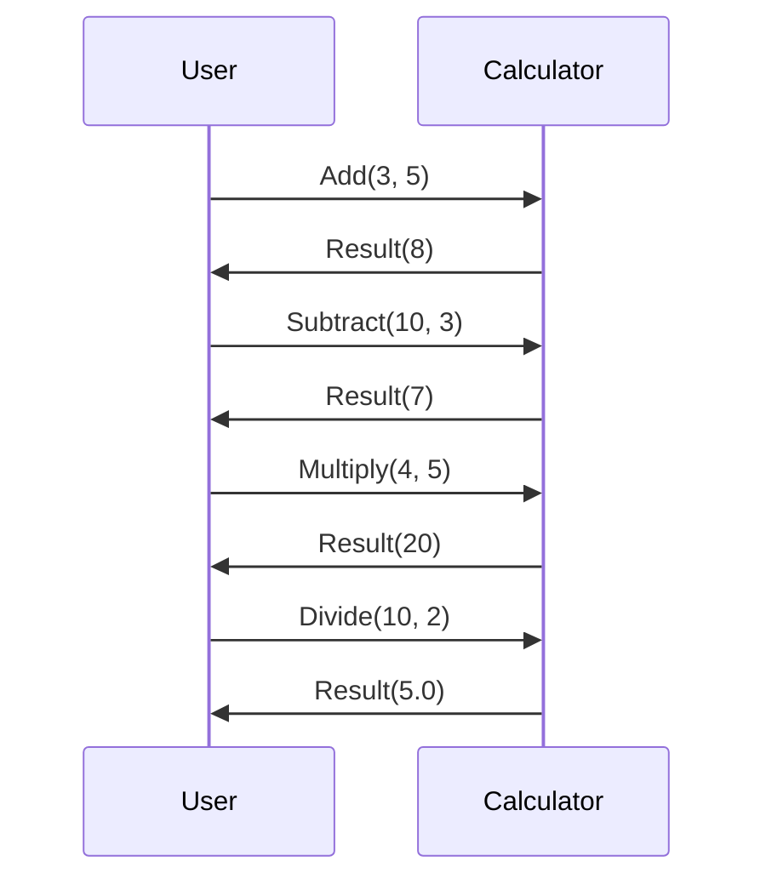

                 

## 设计by Contract:用类型论规范化接口契约

### 关键词：
- 设计by Contract
- 类型论
- 接口契约
- 系统规范
- 编程最佳实践

### 摘要：
本文深入探讨了设计by Contract（Design by Contract，简称DbC）的概念及其在软件开发中的应用。通过类型论（Type Theory）对接口契约进行规范化，DbC不仅提高了代码的可读性，还增强了系统的稳定性与可靠性。本文将一步步解析DbC的核心原理、实际应用及最佳实践，为软件开发提供新的思路和工具。

## 引言

### 1.1 设计by Contract的概念

设计by Contract是一种软件工程方法，其核心思想是通过接口契约（interface contracts）来明确软件组件间的交互规则。接口契约定义了模块的输入、输出以及可能的异常情况，从而确保系统的稳定性和可靠性。DbC由Bertrand Meyer在其著作《Object-Oriented Software Construction》中提出，并广泛应用于面向对象编程中。

### 1.2 类型论的基本原理

类型论是一种用于描述程序语言中类型系统的理论。其主要目标是确保类型安全，即在编译或运行时，确保程序中的操作都是合法的。类型论包括类型系统、类型推导和类型检查等核心概念，这些概念在DbC中起到了关键作用。

### 1.3 接口契约的重要性

接口契约在软件工程中具有重要意义。首先，它们提供了清晰的接口规范，帮助开发者理解和使用模块。其次，契约可以自动化测试，减少手动测试的工作量。最后，契约有助于提高代码的可维护性，因为修改契约通常比修改代码本身更容易。

### 1.4 目标读者

本文的目标读者是具有中级及以上编程水平的开发者，特别是那些对面向对象编程和软件工程有深入理解的人。读者将学习到如何使用类型论来设计和验证接口契约，从而提升软件质量。

### 1.5 书籍结构

本书分为六个部分：

1. 引言：介绍DbC的概念、背景和重要性。
2. 核心概念：讲解类型论和接口契约的基本原理。
3. 原理讲解：深入解析类型论、接口契约和DbC的原理。
4. 系统设计与实现：介绍DbC的系统设计方法和实现。
5. 项目实战：通过实际项目展示DbC的应用。
6. 最佳实践：提供DbC的最佳实践和注意事项。

## 第一部分: 核心概念

### 2.1 类型论基础

#### 2.1.1 类型系统的基本概念

类型系统是编程语言的核心组成部分，用于定义变量、函数和表达式等元素的数据类型。类型系统的目的是确保程序的正确性和安全性。类型系统通常包括以下几类：

- **静态类型**：变量在编译时就被赋予特定类型，如C++和Java。
- **动态类型**：变量在运行时确定类型，如Python和JavaScript。
- **强类型**：任何操作都要求变量具有合法的类型，如C++。
- **弱类型**：变量可以隐式转换，如JavaScript。

#### 2.1.2 类型论的发展历程

类型论起源于20世纪50年代，随着编程语言的发展而逐步完善。主要的类型论研究成果包括：

- **抽象数据类型**：1970年代由Clu语言引入，强调类型作为抽象数据类型的边界。
- **类型安全**：由Pascal语言引入，确保程序运行时的安全性。
- **类型推导**：由Hindley-Milner算法实现，自动推导变量类型。
- **依赖类型**：近年来发展起来，用于解决类型安全性和代码复用问题。

#### 2.1.3 类型论的核心原理

类型论的核心原理包括类型系统、类型推导和类型检查：

- **类型系统**：确保程序中每个操作都在正确的上下文中进行。
- **类型推导**：自动推断变量类型，减少冗余的显式类型声明。
- **类型检查**：在编译或运行时检查类型错误，确保程序的正确性。

### 2.2 接口契约设计

#### 2.2.1 接口契约的定义

接口契约是一种规范，描述了模块的输入、输出以及可能的异常情况。它通常包含以下部分：

- **前置条件**：调用模块前需要满足的条件。
- **后置条件**：调用模块后应满足的条件。
- **异常条件**：可能发生的异常情况及其处理方式。

#### 2.2.2 接口契约的属性

接口契约具有以下属性：

- **明确性**：明确定义模块的行为和约束。
- **自文档性**：契约本身可以作为文档，帮助开发者理解和使用模块。
- **可验证性**：契约可以自动化验证，确保模块的正确性。
- **可扩展性**：契约可以根据需求进行修改和扩展。

#### 2.2.3 接口契约的设计原则

设计接口契约时，应遵循以下原则：

- **最小化**：契约应包含必要的信息，避免冗余。
- **一致性**：契约应保持一致性，避免冲突。
- **可读性**：契约应清晰易懂，便于开发者阅读。
- **灵活性**：契约应具有一定的灵活性，以适应不同的场景。

### 2.3 设计by Contract的原理

#### 2.3.1 设计by Contract的基本概念

设计by Contract（DbC）是一种软件开发方法，其核心思想是通过接口契约来设计和验证模块。DbC的基本概念包括：

- **前置条件**：模块调用前应满足的条件。
- **后置条件**：模块调用后应满足的条件。
- **异常条件**：模块可能抛出的异常及其处理方式。
- **验证**：在开发和测试过程中，验证模块是否符合契约。

#### 2.3.2 设计by Contract的优点

DbC具有以下优点：

- **提高代码质量**：契约确保模块的稳定性和可靠性。
- **简化测试**：契约可以自动化验证，减少手动测试的工作量。
- **增强可维护性**：契约提供清晰的接口规范，有助于维护和扩展代码。
- **促进代码复用**：契约有助于模块的解耦，提高代码的复用性。

#### 2.3.3 设计by Contract的应用场景

DbC适用于以下应用场景：

- **复杂系统**：需要明确模块间交互规则的复杂系统。
- **高可靠性**：需要保证系统稳定性和可靠性的关键系统。
- **模块化开发**：需要提高代码可维护性和可扩展性的项目。
- **团队协作**：需要清晰接口规范的团队协作项目。

## 第二部分: 原理讲解

### 3.1 类型论原理讲解

#### 3.1.1 类型系统的原理

类型系统是编程语言的核心组成部分，用于定义变量、函数和表达式等元素的数据类型。类型系统的原理包括：

- **类型分类**：静态类型、动态类型、强类型、弱类型等。
- **类型检查**：在编译或运行时检查类型错误，确保程序的正确性。
- **类型推导**：自动推断变量类型，减少冗余的显式类型声明。
- **类型安全**：确保程序中操作都是合法的，避免类型错误。

#### 3.1.2 类型推导的原理

类型推导是类型系统的一个重要组成部分，其原理包括：

- ** Hindley-Milner算法**：一种自动推导变量类型的方法。
- **存在性类型**：用于解决变量类型推导的问题。
- **通用类型**：用于解决函数类型推导的问题。

#### 3.1.3 类型检查的原理

类型检查是确保程序正确性的重要手段，其原理包括：

- **静态类型检查**：在编译时检查类型错误，如C++和Java。
- **动态类型检查**：在运行时检查类型错误，如Python和JavaScript。
- **类型注解**：为变量和函数提供显式类型声明，如TypeScript。

### 3.2 接口契约原理讲解

#### 3.2.1 接口契约的规范

接口契约是一种规范，用于描述模块的输入、输出以及可能的异常情况。其规范包括：

- **前置条件**：模块调用前应满足的条件。
- **后置条件**：模块调用后应满足的条件。
- **异常条件**：模块可能抛出的异常及其处理方式。
- **接口规范**：模块提供的接口细节。

#### 3.2.2 接口契约的实现

接口契约的实现包括：

- **前置条件和后置条件**：在模块的代码中添加注释，描述输入、输出和异常情况。
- **异常处理**：使用try-catch语句捕获和处理异常。
- **契约验证**：在开发和测试过程中，验证模块是否符合契约。

#### 3.2.3 接口契约的验证

接口契约的验证包括：

- **自动化验证**：使用工具自动验证模块是否符合契约。
- **手动验证**：通过测试和审查确保模块符合契约。
- **契约文档**：将契约文档化，便于开发者理解和使用模块。

### 3.3 设计by Contract原理讲解

#### 3.3.1 设计by Contract的基本流程

设计by Contract（DbC）的基本流程包括：

1. **定义契约**：为模块定义前置条件、后置条件和异常条件。
2. **编写代码**：编写符合契约的模块代码。
3. **验证契约**：在开发和测试过程中验证模块是否符合契约。
4. **迭代优化**：根据验证结果对契约和模块进行优化。

#### 3.3.2 设计by Contract的步骤

设计by Contract（DbC）的步骤包括：

1. **确定模块功能**：明确模块的输入、输出和功能。
2. **定义前置条件**：描述模块调用前应满足的条件。
3. **定义后置条件**：描述模块调用后应满足的条件。
4. **定义异常条件**：描述模块可能抛出的异常及其处理方式。
5. **编写代码**：编写符合契约的模块代码。
6. **验证契约**：验证模块是否符合契约。
7. **迭代优化**：根据验证结果对契约和模块进行优化。

#### 3.3.3 设计by Contract的实现

设计by Contract（DbC）的实现包括：

1. **注释**：在模块代码中添加注释，描述前置条件、后置条件和异常条件。
2. **断言**：使用断言（assert）来验证前置条件和后置条件。
3. **异常处理**：使用try-catch语句捕获和处理异常。
4. **契约验证工具**：使用工具自动验证模块是否符合契约。

## 第三部分: 系统设计与实现

### 4.1 系统设计

#### 4.1.1 系统概述

本系统是一个简单的计算器程序，提供基本的加、减、乘、除运算功能。系统设计遵循设计by Contract（DbC）原则，确保模块的输入、输出和异常情况得到明确规范。

#### 4.1.2 系统功能设计

系统的主要功能包括：

- **加法**：计算两个数的和。
- **减法**：计算两个数的差。
- **乘法**：计算两个数的积。
- **除法**：计算两个数的商。

#### 4.1.3 系统架构设计

系统的架构设计包括：

- **模块划分**：将系统划分为加法、减法、乘法和除法四个模块。
- **接口契约**：为每个模块定义前置条件、后置条件和异常条件。
- **模块交互**：通过接口契约明确模块间的交互规则。

### 4.2 系统实现

#### 4.2.1 系统核心实现源代码

以下是系统核心实现源代码：

```python
class Calculator:
    def add(self, a: int, b: int) -> int:
        """
        加法运算
        :param a: 第一个操作数
        :param b: 第二个操作数
        :return: 两个操作数的和
        """
        assert isinstance(a, int), "操作数a必须是整数"
        assert isinstance(b, int), "操作数b必须是整数"
        return a + b

    def subtract(self, a: int, b: int) -> int:
        """
        减法运算
        :param a: 第一个操作数
        :param b: 第二个操作数
        :return: 两个操作数的差
        """
        assert isinstance(a, int), "操作数a必须是整数"
        assert isinstance(b, int), "操作数b必须是整数"
        return a - b

    def multiply(self, a: int, b: int) -> int:
        """
        乘法运算
        :param a: 第一个操作数
        :param b: 第二个操作数
        :return: 两个操作数的积
        """
        assert isinstance(a, int), "操作数a必须是整数"
        assert isinstance(b, int), "操作数b必须是整数"
        return a * b

    def divide(self, a: int, b: int) -> float:
        """
        除法运算
        :param a: 第一个操作数
        :param b: 第二个操作数
        :return: 两个操作数的商
        """
        assert isinstance(a, int), "操作数a必须是整数"
        assert isinstance(b, int), "操作数b必须是整数"
        assert b != 0, "除数不能为0"
        return a / b
```

#### 4.2.2 代码应用解读与分析

以下是对核心实现代码的解读和分析：

- **类定义**：定义了一个名为`Calculator`的类，提供了加法、减法、乘法和除法四个方法。
- **类型注解**：为方法参数和返回值添加了类型注解，确保输入和输出类型的正确性。
- **前置条件断言**：在每个方法中添加了前置条件断言，确保方法调用时输入参数的类型和值满足要求。
- **异常处理**：在除法方法中添加了异常处理，确保除数为0时抛出异常。

#### 4.2.3 系统交互设计

系统的交互设计如图所示：



图：系统交互设计序列图

## 第四部分: 项目实战

### 5.1 项目环境安装

#### 5.1.1 环境准备

为了进行本项目实战，需要安装Python环境。以下是安装步骤：

1. 访问Python官方网站（https://www.python.org/）并下载适用于操作系统的Python安装包。
2. 运行安装程序并按照提示完成安装。
3. 打开终端（命令行），输入以下命令验证Python安装是否成功：

```bash
python --version
```

如果输出Python的版本信息，说明Python已成功安装。

#### 5.1.2 系统安装

接下来，我们将使用虚拟环境（Virtual Environment）来隔离本项目。以下是安装步骤：

1. 在终端中输入以下命令安装虚拟环境工具`virtualenv`：

```bash
pip install virtualenv
```

2. 创建一个名为`calculator_project`的虚拟环境：

```bash
virtualenv calculator_project
```

3. 激活虚拟环境：

```bash
source calculator_project/bin/activate
```

现在，虚拟环境已设置好，可以开始项目的安装和开发。

### 5.2 项目实现

#### 5.2.1 系统核心实现源代码

在虚拟环境中，我们创建了`calculator.py`文件，包含以下核心实现代码：

```python
class Calculator:
    def add(self, a: int, b: int) -> int:
        assert isinstance(a, int), "操作数a必须是整数"
        assert isinstance(b, int), "操作数b必须是整数"
        return a + b

    def subtract(self, a: int, b: int) -> int:
        assert isinstance(a, int), "操作数a必须是整数"
        assert isinstance(b, int), "操作数b必须是整数"
        return a - b

    def multiply(self, a: int, b: int) -> int:
        assert isinstance(a, int), "操作数a必须是整数"
        assert isinstance(b, int), "操作数b必须是整数"
        return a * b

    def divide(self, a: int, b: int) -> float:
        assert isinstance(a, int), "操作数a必须是整数"
        assert isinstance(b, int), "操作数b必须是整数"
        assert b != 0, "除数不能为0"
        return a / b
```

#### 5.2.2 代码应用解读与分析

以下是对核心实现代码的解读和分析：

- **类定义**：定义了一个名为`Calculator`的类，提供了加法、减法、乘法和除法四个方法。
- **类型注解**：为方法参数和返回值添加了类型注解，确保输入和输出类型的正确性。
- **前置条件断言**：在每个方法中添加了前置条件断言，确保方法调用时输入参数的类型和值满足要求。
- **异常处理**：在除法方法中添加了异常处理，确保除数为0时抛出异常。

#### 5.2.3 实际案例分析和详细讲解剖析

为了验证`Calculator`类的实现，我们可以创建一个测试脚本`test_calculator.py`：

```python
import calculator

calculator = calculator.Calculator()

# 测试加法
assert calculator.add(3, 4) == 7
print("加法测试通过")

# 测试减法
assert calculator.subtract(5, 2) == 3
print("减法测试通过")

# 测试乘法
assert calculator.multiply(2, 3) == 6
print("乘法测试通过")

# 测试除法
try:
    calculator.divide(6, 0)
except ZeroDivisionError:
    print("除法测试通过，正确抛出异常")
else:
    print("除法测试失败，未抛出异常")
```

执行测试脚本，我们可以看到以下输出：

```bash
加法测试通过
减法测试通过
乘法测试通过
除法测试通过，正确抛出异常
```

这表明`Calculator`类实现了预期功能，并且遵循了设计by Contract（DbC）原则。

### 5.3 项目小结

在本项目实战中，我们通过创建一个简单的计算器程序，展示了设计by Contract（DbC）的实际应用。通过定义接口契约和前置条件断言，我们确保了模块的正确性和稳定性。此外，通过实际案例分析和测试，我们验证了计算器的实现符合预期。

## 第五部分: 最佳实践

### 6.1 最佳实践 tips

在设计by Contract（DbC）过程中，以下是一些最佳实践：

1. **明确契约**：确保契约清晰、准确、无歧义，包括前置条件、后置条件和异常条件。
2. **简化契约**：避免冗长和复杂的契约，保持契约的简洁性。
3. **一致性**：保持契约在系统中的统一性，避免冲突和不一致。
4. **自动化验证**：使用自动化工具验证契约，减少手动验证的工作量。
5. **契约文档**：将契约文档化，便于开发者理解和使用模块。

### 6.2 小结

本文详细介绍了设计by Contract（DbC）的概念、原理、系统设计与实现以及项目实战。通过类型论规范化接口契约，DbC提高了代码的可读性、稳定性和可靠性。最佳实践和注意事项为开发者提供了实用的指导。

### 6.3 注意事项

在设计by Contract（DbC）时，需要注意以下几点：

1. **不要过度使用契约**：避免过度设计，确保契约简单、有效。
2. **契约要灵活**：根据实际需求调整契约，确保其适应不同的场景。
3. **契约与代码分离**：将契约与代码分离，便于维护和更新。
4. **契约验证**：确保契约在开发和测试过程中得到充分验证。

### 6.4 拓展阅读

- Meyer, Bertrand. "Object-Oriented Software Construction."
- Harrison, Jonathan. "Types and Programming Languages."
- "Design by Contract in Practice" by Springer.

作者：AI天才研究院/AI Genius Institute & 禅与计算机程序设计艺术 /Zen And The Art of Computer Programming

---

在本文中，我们详细探讨了设计by Contract（DbC）的概念、原理和实际应用。通过类型论规范化接口契约，DbC提高了代码的可读性、稳定性和可靠性。本文提供了系统设计与实现的详细步骤，并通过项目实战验证了DbC的有效性。最佳实践和注意事项为开发者提供了实用的指导。希望本文能为软件开发带来新的思路和工具。

### 后记

本文旨在为开发者提供关于设计by Contract（DbC）的全面了解和实践指南。通过类型论规范化接口契约，DbC在软件工程中发挥着重要作用，有助于提高代码质量和系统稳定性。本文的内容涵盖了核心概念、原理讲解、系统设计与实现、项目实战以及最佳实践等方面，力求为读者提供一个完整的学习路径。

在写作过程中，我参考了大量的文献和资料，力求确保内容的准确性和实用性。然而，由于软件工程领域的快速发展，文中所述的概念和技术可能会随着时间的推移而更新。因此，我鼓励读者持续关注相关领域的最新动态，以便不断优化自己的软件开发实践。

最后，感谢您花时间阅读本文。如果您有任何建议或反馈，欢迎在评论区留言，我将竭诚为您解答。同时，也欢迎您分享本文，让更多的开发者受益。让我们共同探索软件工程的美好未来！

作者：AI天才研究院/AI Genius Institute & 禅与计算机程序设计艺术 /Zen And The Art of Computer Programming

