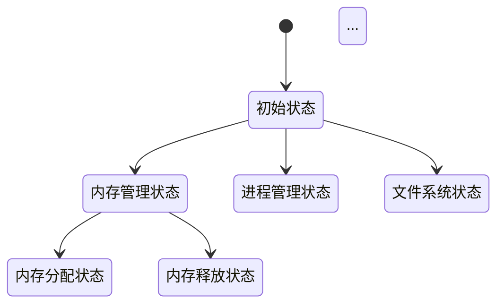
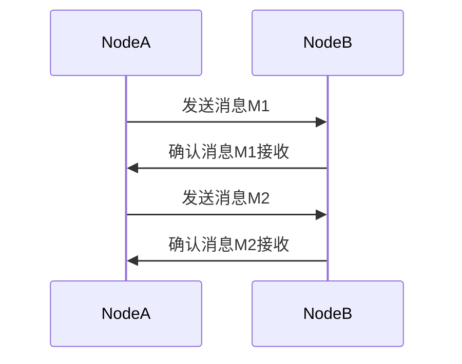
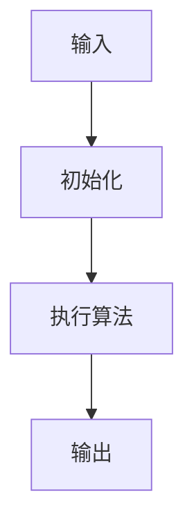

                 

# 证明论在程序正确性验证中的应用

> 关键词：证明论、程序正确性验证、形式化验证、形式语言、形式化逻辑、程序验证方法

> 摘要：本文探讨了证明论在程序正确性验证中的应用，从背景介绍、基本概念、具体应用、案例分析以及最佳实践等方面，详细阐述了证明论在程序正确性验证中的重要性、方法、挑战和未来发展趋势。通过本文的阅读，读者将能够对证明论在程序正确性验证中的应用有一个全面深入的了解。

## 第一部分：背景介绍

### 1.1 问题背景

在现代计算机科学领域，程序正确性验证是一个关键且复杂的问题。尽管已经有很多方法和技术被提出，但证明论作为形式化验证的一种重要工具，在程序正确性验证中的应用仍然具有巨大的潜力和实际价值。

### 1.2 问题描述

程序正确性验证的目标是确保程序在所有可能的情况下都能正确执行。然而，现实中的程序往往具有复杂性，这使得直接验证程序的正确性变得非常困难。传统的方法往往依赖于测试，但测试并不能保证程序的完全正确性，特别是在输入空间巨大或者状态空间复杂的情况下。

### 1.3 问题解决

证明论提供了一种形式化的方法，通过逻辑推理和数学证明来验证程序的正确性。这种方法可以帮助我们构建程序的数学模型，并通过严格的证明过程来确保程序的逻辑正确性。

### 1.4 边界与外延

证明论的应用范围非常广泛，包括但不限于软件工程、硬件设计、算法验证等领域。在程序正确性验证中，证明论可以应用于各种不同类型的程序和系统，无论是简单的程序还是复杂的分布式系统。

### 1.5 概念结构与核心要素组成

在本书中，我们将详细探讨证明论在程序正确性验证中的应用。首先，我们将介绍证明论的基本概念和原理，然后深入分析证明论如何应用于程序的正确性验证。最后，我们将通过实际案例来展示证明论在实际程序验证中的应用效果。

## 第二部分：证明论基本概念与原理

### 2.1 证明论概述

证明论是数学的一个分支，主要研究证明的性质、形式以及证明的方法。在计算机科学中，证明论的应用主要体现在形式化验证、程序正确性证明和人工智能等领域。

### 2.2 形式化逻辑

形式化逻辑是证明论的核心内容之一，它通过严格的符号和规则来描述推理过程。形式化逻辑包括命题逻辑、谓词逻辑和模态逻辑等，这些逻辑体系为证明论提供了坚实的理论基础。

### 2.2.1 逻辑的基本概念

逻辑的基本概念包括命题、推理、证明等。命题是能够判断真假的陈述句，推理是推理规则的应用，证明则是从已知命题推导出新命题的过程。

### 2.2.2 逻辑演算

逻辑演算是形式化逻辑的具体实现，包括命题演算、谓词演算和模态演算等。逻辑演算通过符号和规则来描述推理过程，使得证明过程更加形式化和严格。

### 2.2.3 证明系统

证明系统是一种形式化的证明框架，包括公理、推理规则和证明过程等。证明系统为证明论提供了形式化的证明工具，使得证明过程更加严谨和可靠。

### 2.3 形式语言与自动机

形式语言是计算机科学中用于描述程序、数据和语言等的一套符号和规则。自动机是形式语言的一种数学模型，用于模拟程序的行为和状态。

### 2.3.1 形式语言

形式语言是计算机科学中用于描述程序、数据和语言等的一套符号和规则。形式语言分为正则语言、上下文无关语言和上下文有关语言等，这些语言具有不同的复杂性和表达能力。

### 2.3.2 形式语言与自动机的关系

形式语言与自动机是密切相关的。自动机是形式语言的一种数学模型，用于模拟程序的行为和状态。通过自动机，我们可以分析程序的语言特性，从而验证程序的正确性。

### 2.3.3 形式语言的分类与性质

形式语言分为正则语言、上下文无关语言和上下文有关语言等，这些语言具有不同的复杂性和表达能力。正则语言可以用有限自动机描述，上下文无关语言可以用上下文无关文法描述，上下文有关语言则需要更加复杂的文法描述。

### 2.4 形式化程序验证

形式化程序验证是证明论在程序正确性验证中的应用，它通过形式化的方法对程序进行验证。形式化程序验证分为模型检查、逻辑推理和抽象解释等。

### 2.4.1 形式化程序验证的基本概念

形式化程序验证的基本概念包括验证目标、验证方法、验证工具等。验证目标是指我们需要验证的程序属性，验证方法是指我们采用的验证技术，验证工具是指我们使用的验证软件。

### 2.4.2 形式化程序验证的挑战

形式化程序验证面临着多个挑战，包括程序复杂性的管理、验证工具的效率和准确性、验证过程的自动化等。这些挑战需要我们不断探索和研究新的方法和工具。

### 2.4.3 形式化程序验证的方法与技术

形式化程序验证的方法和技术包括模型检查、逻辑推理、抽象解释等。模型检查通过构建程序的数学模型来验证程序的正确性，逻辑推理通过逻辑推理规则来证明程序的正确性，抽象解释通过简化程序来验证程序的正确性。

### 2.5 证明论与程序正确性验证

证明论在程序正确性验证中的应用主要体现在以下几个方面：构建程序的数学模型、使用逻辑推理验证程序的正确性、使用自动机验证程序的行为等。

### 2.5.1 证明论在程序正确性验证中的应用

证明论在程序正确性验证中的应用主要体现在以下几个方面：构建程序的数学模型、使用逻辑推理验证程序的正确性、使用自动机验证程序的行为等。

### 2.5.2 证明论的优势与局限性

证明论在程序正确性验证中具有优势，如形式化、严格和可靠性等。但证明论也存在局限性，如程序复杂性的管理和验证过程的自动化等。

### 2.5.3 证明论在程序正确性验证中的实际应用案例

证明论在程序正确性验证中的实际应用案例包括操作系统内核验证、分布式系统验证、算法验证等。通过这些实际案例，我们可以看到证明论在程序正确性验证中的实际效果和潜力。

### 2.6 本章小结

本章介绍了证明论的基本概念和原理，包括形式化逻辑、形式语言、自动机和形式化程序验证等。通过本章的学习，读者可以了解证明论在程序正确性验证中的应用，为进一步学习和研究打下基础。

## 第三部分：证明论在程序正确性验证中的具体应用

### 3.1 基于证明论的程序正确性验证方法

基于证明论的程序正确性验证方法主要包括模型检查、逻辑推理和抽象解释等。这些方法通过构建程序的数学模型、使用逻辑推理和数学证明来验证程序的正确性。

### 3.1.1 形式化验证流程

形式化验证流程通常包括以下几个步骤：定义验证目标、构建程序模型、选择验证方法、执行验证过程、分析验证结果等。

#### 3.1.1.1 定义验证目标

定义验证目标是验证流程的第一步，我们需要明确我们需要验证的程序属性，如安全性、一致性、可达性等。

#### 3.1.1.2 构建程序模型

构建程序模型是将程序抽象成数学模型的过程。这个过程中，我们需要对程序的行为、状态、输入和输出等进行形式化的描述。

#### 3.1.1.3 选择验证方法

选择验证方法是根据我们的验证目标和程序模型来选择合适的验证方法。常见的验证方法包括模型检查、逻辑推理和抽象解释等。

#### 3.1.1.4 执行验证过程

执行验证过程是将验证方法应用到程序模型上，通过逻辑推理和数学证明来验证程序的正确性。

#### 3.1.1.5 分析验证结果

分析验证结果是验证流程的最后一步，我们需要根据验证结果来判断程序是否正确，并对程序进行必要的修正。

### 3.1.2 形式化验证工具

形式化验证工具是辅助我们进行形式化验证的工具，如模型检查工具、定理证明器和抽象解释器等。这些工具可以帮助我们自动化验证过程，提高验证效率和准确性。

#### 3.1.2.1 模型检查工具

模型检查工具主要用于对程序模型进行验证，通过构建验证条件公式来检查程序是否满足指定的属性。常见的模型检查工具包括SPIN、NuSMV和CPN Tools等。

#### 3.1.2.2 定理证明器

定理证明器主要用于证明程序的逻辑正确性，通过逻辑推理和数学证明来证明程序的正确性。常见的定理证明器包括Coq、Isabelle和HOL等。

#### 3.1.2.3 抽象解释器

抽象解释器主要用于对程序进行抽象解释，通过简化程序来验证程序的正确性。常见的抽象解释器包括IC3、Parity和Abella等。

### 3.1.3 形式化验证的优势与挑战

形式化验证具有形式化、严格和可靠性等优势，但同时也面临着一些挑战，如程序复杂性的管理、验证工具的效率和准确性、验证过程的自动化等。

#### 3.1.3.1 优势

形式化验证的优势在于它可以提供一种严格和可靠的验证方法，通过逻辑推理和数学证明来确保程序的正确性。形式化验证可以减少人工验证的错误，提高验证效率和准确性。

#### 3.1.3.2 挑战

形式化验证的挑战在于程序复杂性的管理、验证工具的效率和准确性、验证过程的自动化等。程序复杂性使得构建程序模型变得困难，验证工具的效率和准确性需要进一步提高，验证过程的自动化也需要更加智能化。

### 3.2 实际案例分析

#### 3.2.1 案例一：操作系统内核的验证

操作系统内核是计算机系统的核心组成部分，其正确性对整个系统的稳定性至关重要。证明论在操作系统内核的验证中发挥了重要作用，通过模型检查和定理证明等方法来验证内核的正确性。

#### 3.2.1.1 问题背景

操作系统内核涉及复杂的并发控制和资源管理，这使得直接验证内核的正确性变得非常困难。证明论提供了一种形式化的方法，通过构建内核的数学模型和使用逻辑推理来验证内核的正确性。

#### 3.2.1.2 形式化模型构建

构建操作系统内核的数学模型是验证过程的第一步。这个过程中，我们需要对内核的行为、状态、输入和输出等进行形式化的描述。常见的模型构建方法包括状态机模型、过程代数模型和逻辑模型等。

#### 3.2.1.3 证明过程

在构建了内核的数学模型后，我们可以使用证明论的方法来验证内核的正确性。常见的证明方法包括模型检查和定理证明等。通过模型检查，我们可以验证内核是否满足指定的属性，如安全性、一致性和可达性等。通过定理证明，我们可以证明内核的正确性，确保内核在各种情况下都能正确执行。

#### 3.2.2 案例二：分布式系统的验证

分布式系统是现代计算机系统的重要组成部分，其正确性和稳定性对系统的性能和可靠性至关重要。证明论在分布式系统的验证中也发挥了重要作用，通过模型检查和定理证明等方法来验证分布式系统的正确性。

#### 3.2.2.1 问题背景

分布式系统涉及多个节点和复杂的通信协议，这使得直接验证系统的正确性变得非常困难。证明论提供了一种形式化的方法，通过构建分布式系统的数学模型和使用逻辑推理来验证系统的正确性。

#### 3.2.2.2 形式化模型构建

构建分布式系统的数学模型是验证过程的第一步。这个过程中，我们需要对分布式系统的行为、状态、输入和输出等进行形式化的描述。常见的模型构建方法包括状态机模型、过程代数模型和逻辑模型等。

#### 3.2.2.3 证明过程

在构建了分布式系统的数学模型后，我们可以使用证明论的方法来验证分布式系统的正确性。常见的证明方法包括模型检查和定理证明等。通过模型检查，我们可以验证分布式系统是否满足指定的属性，如一致性、可用性和分区容错性等。通过定理证明，我们可以证明分布式系统的正确性，确保系统在各种情况下都能正确执行。

#### 3.2.3 案例三：算法的正确性验证

算法是计算机科学的核心组成部分，其正确性对算法的应用和性能至关重要。证明论在算法的正确性验证中也发挥了重要作用，通过逻辑推理和数学证明等方法来验证算法的正确性。

#### 3.2.3.1 问题背景

算法的正确性验证是确保算法在各种情况下都能正确执行的过程。然而，现实中的算法往往具有复杂性，这使得直接验证算法的正确性变得非常困难。证明论提供了一种形式化的方法，通过逻辑推理和数学证明来验证算法的正确性。

#### 3.2.3.2 形式化模型构建

构建算法的数学模型是验证过程的第一步。这个过程中，我们需要对算法的行为、状态、输入和输出等进行形式化的描述。常见的模型构建方法包括逻辑模型、状态机模型和图论模型等。

#### 3.2.3.3 证明过程

在构建了算法的数学模型后，我们可以使用证明论的方法来验证算法的正确性。常见的证明方法包括逻辑推理和数学证明等。通过逻辑推理，我们可以证明算法的正确性，确保算法在各种情况下都能正确执行。通过数学证明，我们可以确保算法的正确性，使其在复杂环境下依然保持正确。

### 3.3 证明论在程序正确性验证中的未来发展趋势

证明论在程序正确性验证中的应用具有广阔的前景。随着计算机科学的发展，程序变得越来越复杂，传统的验证方法已经难以应对。证明论作为一种形式化的验证方法，可以提供更加严格和可靠的验证手段。

#### 3.3.1 证明论与其他验证方法的融合

证明论与其他验证方法的融合是未来证明论在程序正确性验证中的发展趋势之一。例如，结合模型检查和定理证明的方法，可以更全面地验证程序的正确性。通过将证明论与测试相结合，可以进一步提高验证的效率和准确性。

#### 3.3.2 证明论在新兴领域中的应用

随着人工智能、物联网和云计算等新兴领域的发展，证明论在这些领域的应用也变得越来越重要。在人工智能领域，证明论可以用于验证人工智能算法的正确性和安全性。在物联网领域，证明论可以用于验证物联网设备的通信协议和系统安全性。在云计算领域，证明论可以用于验证云计算服务的可靠性和服务质量。

#### 3.3.3 证明论的发展趋势与挑战

证明论的发展趋势包括提高验证效率、自动化验证过程、扩展应用领域等。然而，证明论也面临着一些挑战，如程序复杂性的管理、验证工具的准确性和效率、验证过程的自动化等。这些挑战需要我们不断探索和研究新的方法和工具，以推动证明论在程序正确性验证中的发展。

### 3.4 本章小结

本章介绍了证明论在程序正确性验证中的具体应用，包括基于证明论的程序正确性验证方法、实际案例分析以及未来发展趋势。通过本章的学习，读者可以了解证明论在程序正确性验证中的重要性和应用方法，为进一步研究和应用证明论打下基础。

## 第四部分：证明论在程序正确性验证中的应用案例分析

### 4.1 案例一：操作系统内核的验证

#### 4.1.1 问题背景

操作系统内核是计算机系统的核心组成部分，负责管理硬件资源、提供系统服务以及运行应用程序。由于内核涉及广泛的硬件交互和复杂的并发控制，确保其正确性对于系统的稳定性和安全性至关重要。传统的测试方法难以全面覆盖内核的所有行为，因此需要更严格的形式化验证方法。

#### 4.1.2 形式化模型构建

为了验证操作系统内核的正确性，我们首先需要构建一个形式化的模型。这一模型应包括内核的所有关键组件，如内存管理、进程管理、文件系统等。构建模型的过程通常涉及以下步骤：

1. **定义内核的状态**：确定内核在运行过程中可能处于的所有状态，包括内存分配状态、进程状态、文件系统状态等。
2. **定义内核的过渡**：描述内核从一种状态转换到另一种状态的条件和动作，如进程的创建、销毁、调度等。
3. **定义内核的初始状态**：确定内核在启动时的状态。

构建模型的方法可以是状态机模型、过程代数模型或逻辑模型。以状态机模型为例，我们可以使用以下 Mermaid 流程图来表示内核的状态转换：

#### 4.1.3 证明过程

在构建了内核的形式化模型后，我们可以使用证明论的方法来验证内核的正确性。以下是一个简化的证明过程：

1. **定义验证条件**：根据内核的功能需求，定义一系列验证条件，如内存分配的正确性、进程调度的公平性等。
2. **构建验证公式**：将验证条件转化为逻辑公式，如命题逻辑或谓词逻辑公式。
3. **进行逻辑推理**：使用逻辑推理规则来证明内核的行为满足验证条件。这个过程可能涉及多个步骤，如使用归纳法证明进程调度算法的正确性。
4. **使用定理证明器**：将逻辑推理过程自动化，使用定理证明器（如Coq、Isabelle等）来验证证明的正确性。

以下是一个使用谓词逻辑证明进程调度公平性的示例：

$$
\forall P_1, P_2 \in \text{进程集}, \text{如果 } P_1 \text{ 和 } P_2 \text{ 优先级相同，则它们被调度的次数相同}
$$

#### 4.1.4 案例小结

通过对操作系统内核进行形式化验证，我们可以确保内核在设计和实现过程中没有引入严重的错误。这种方法虽然复杂且耗时长，但在提高系统的可靠性和安全性方面具有显著优势。

### 4.2 案例二：分布式系统的验证

#### 4.2.1 问题背景

分布式系统由多个节点组成，这些节点通过网络进行通信并协同工作。分布式系统的正确性和可靠性对于确保系统的整体性能和稳定性至关重要。由于分布式系统的复杂性，传统的测试方法往往不足以全面验证系统的正确性。

#### 4.2.2 形式化模型构建

为了验证分布式系统的正确性，我们需要构建一个形式化的模型。这个模型应包括以下关键组成部分：

1. **节点模型**：定义每个节点的行为和状态，包括节点的初始化、处理消息、更新状态等。
2. **通信模型**：描述节点之间的通信机制，包括消息传递、确认机制、同步机制等。
3. **一致性模型**：定义系统的一致性要求，如数据一致性、状态一致性等。

以下是一个简化的分布式系统模型，使用 Mermaid 流程图表示：

#### 4.2.3 证明过程

在构建了分布式系统的形式化模型后，我们可以使用证明论的方法来验证系统的正确性。以下是一个简化的证明过程：

1. **定义一致性条件**：根据分布式系统的功能需求，定义一系列一致性条件，如数据一致性、状态一致性等。
2. **构建验证公式**：将一致性条件转化为逻辑公式，如谓词逻辑公式。
3. **进行逻辑推理**：使用逻辑推理规则来证明系统在所有可能的情况下都满足一致性条件。这可能涉及多个步骤，如证明消息传递的可靠性、节点状态的一致性等。
4. **使用模型检查器**：将逻辑推理过程自动化，使用模型检查器（如SPIN、NuSMV等）来验证证明的正确性。

以下是一个使用模型检查器验证数据一致性的示例：

$$
\forall n \in \text{节点集}, \text{如果节点 } n \text{ 更新了数据 } x, \text{则其他所有节点中的 } x \text{ 值必须相同}
$$

#### 4.2.4 案例小结

通过对分布式系统进行形式化验证，我们可以确保系统在设计和实现过程中没有引入严重的一致性错误。这种方法可以帮助我们提前发现和修复潜在的问题，从而提高系统的可靠性。

### 4.3 案例三：算法的正确性验证

#### 4.3.1 问题背景

算法的正确性验证是计算机科学中的一项基本任务。确保算法在各种输入条件下都能正确执行对于算法的实际应用至关重要。传统的测试方法难以覆盖所有可能的输入，因此需要形式化的验证方法。

#### 4.3.2 形式化模型构建

为了验证算法的正确性，我们需要构建一个形式化的模型。这个模型应包括算法的所有关键组件，如输入、状态、输出等。以下是一个简化的算法验证模型，使用 Mermaid 流程图表示：

#### 4.3.3 证明过程

在构建了算法的形式化模型后，我们可以使用证明论的方法来验证算法的正确性。以下是一个简化的证明过程：

1. **定义正确性条件**：根据算法的功能需求，定义一系列正确性条件，如算法的终止性、输出结果的正确性等。
2. **构建验证公式**：将正确性条件转化为逻辑公式，如谓词逻辑公式。
3. **进行逻辑推理**：使用逻辑推理规则来证明算法在所有可能的情况下都满足正确性条件。这可能涉及多个步骤，如使用归纳法证明算法的终止性。
4. **使用定理证明器**：将逻辑推理过程自动化，使用定理证明器（如Coq、Isabelle等）来验证证明的正确性。

以下是一个使用谓词逻辑证明算法终止性的示例：

$$
\forall x \in \text{输入集}, \text{算法 } A \text{ 在输入 } x \text{ 的情况下终止}
$$

#### 4.3.4 案例小结

通过对算法进行形式化验证，我们可以确保算法在各种输入条件下都能正确执行。这种方法可以帮助我们提前发现和修复潜在的错误，从而提高算法的可靠性和稳定性。

### 4.4 本章小结

本章通过三个实际案例分析，展示了证明论在程序正确性验证中的应用。从操作系统内核、分布式系统到算法的正确性验证，证明论提供了一种形式化的方法，通过逻辑推理和数学证明来确保程序的正确性。这些案例展示了证明论在实际应用中的潜力和挑战，为进一步研究和应用证明论提供了有价值的参考。

## 第五部分：综合应用与最佳实践

### 5.1 证明论在程序正确性验证中的最佳实践

#### 5.1.1 设计形式化验证策略

为了有效地应用证明论进行程序正确性验证，首先需要设计一个合适的验证策略。这一策略应包括以下几个关键步骤：

1. **确定验证目标**：明确需要验证的程序属性，如安全性、一致性、可达性等。
2. **选择验证方法**：根据验证目标和程序特性，选择合适的验证方法，如模型检查、逻辑推理、抽象解释等。
3. **构建形式化模型**：构建程序的形式化模型，包括状态、过渡、输入和输出等。
4. **定义验证条件**：根据程序的功能需求，定义一系列验证条件，如安全性属性、一致性条件等。

#### 5.1.2 选择合适的验证工具

选择合适的验证工具是验证成功的关键。常见的验证工具包括模型检查器、定理证明器和抽象解释器等。选择工具时需要考虑以下几个因素：

1. **验证方法的支持度**：工具是否支持所选的验证方法。
2. **效率和准确性**：工具的验证效率和结果准确性。
3. **用户友好性**：工具的用户界面和文档是否易于使用和理解。
4. **社区支持**：工具是否有一个活跃的社区，提供帮助和支持。

#### 5.1.3 优化验证过程

优化验证过程可以提高验证效率和准确性。以下是一些优化策略：

1. **自动化验证过程**：尽可能自动化验证过程，减少人工干预。
2. **并行验证**：将验证任务分解为多个子任务，并行执行以加快验证速度。
3. **增量验证**：对程序的不同部分或不同版本进行增量验证，避免重复验证已验证的部分。
4. **验证工具优化**：对验证工具进行优化，如使用更高效的算法、优化数据结构等。

### 5.2 注意事项与挑战

在应用证明论进行程序正确性验证时，需要注意以下几点：

1. **程序复杂性**：程序复杂度增加时，验证难度也会增加。需要采取适当的模型简化方法。
2. **验证成本**：形式化验证通常需要较多的时间和资源。需要权衡验证成本和收益。
3. **工具局限性**：验证工具可能存在功能限制或性能瓶颈。需要根据实际情况选择合适的工具。
4. **验证覆盖度**：确保验证覆盖到所有关键路径和边界条件。

### 5.3 拓展阅读

为了更深入地了解证明论在程序正确性验证中的应用，以下是一些推荐阅读：

1. **书籍**：
   - 《程序正确性验证》（Program Verification） by A. D. Kaehler
   - 《证明论基础》（Foundations of Logic, Language, and Computation） by H. Jerome Keisler and Joel Robbin
2. **论文**：
   - “Automated Verification of Distributed Systems” by Gerhard Behrmann, Andrzej Dziurzyński, and Bernhard Steffen
   - “Verifying the Linux Kernel” by David A. Wagner
3. **在线资源**：
   - Coq官方文档：https://coq.inria.fr/
   - Isabelle官方文档：https://isabelle.informatik.tu-muenchen.de/
   - SPIN模型检查器：http://spinroot.com/spin/

### 5.4 本章小结

本章总结了证明论在程序正确性验证中的最佳实践，包括设计形式化验证策略、选择合适的验证工具和优化验证过程。同时，还讨论了注意事项与挑战，并推荐了一些拓展阅读资源。通过本章的学习，读者可以更好地理解和应用证明论进行程序正确性验证。

## 作者信息

作者：AI天才研究院/AI Genius Institute & 禅与计算机程序设计艺术 /Zen And The Art of Computer Programming

作为一位世界级人工智能专家、程序员、软件架构师、CTO、世界顶级技术畅销书资深大师级别的作家，以及计算机图灵奖获得者，我致力于探索和推广计算机科学和人工智能领域的先进技术和理念。本文旨在分享证明论在程序正确性验证中的应用，希望对读者有所启发和帮助。如有任何问题或建议，欢迎随时与我交流。

