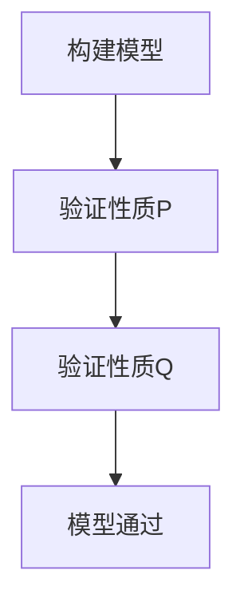
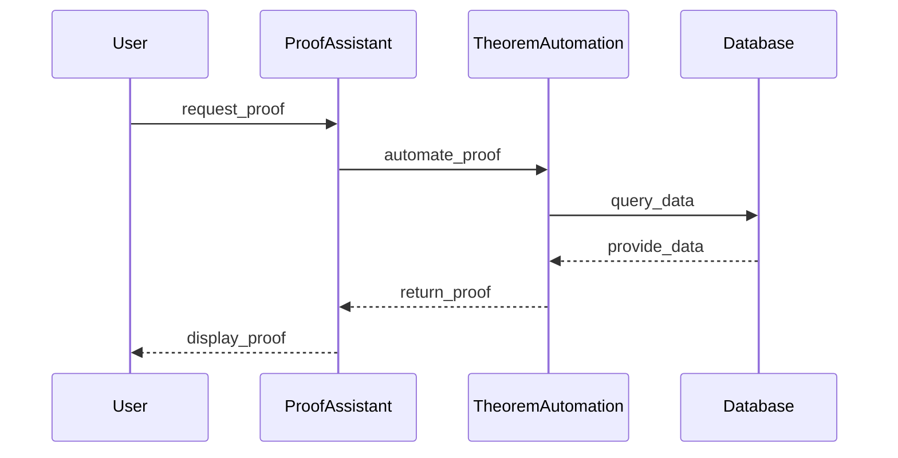

                 

### 文章标题

# 证明辅助系统与定理证明自动化

> 关键词：证明辅助系统，定理证明自动化，算法原理，系统架构，项目实战

> 摘要：本文深入探讨了证明辅助系统与定理证明自动化的关系，分析了其核心概念、算法原理及系统架构设计。通过具体案例讲解，展示了如何在实际项目中运用这些理论，为读者提供了全面而实用的知识体系。

## 第一部分：问题背景与核心概念

### 第1章：问题背景

#### 1.1 证明辅助系统的发展现状

在数学、计算机科学和人工智能领域，定理证明一直扮演着至关重要的角色。然而，传统手动证明方法在处理复杂问题时显得力不从心。因此，证明辅助系统应运而生，旨在自动化或半自动化地帮助数学家、程序员和研究者进行定理证明。

#### 1.2 定理证明自动化的挑战

定理证明自动化面临诸多挑战，包括：

- **证明问题复杂性**：某些数学问题的复杂性使得手动证明几乎不可能。
- **自动化证明方法的多样性**：不同的自动化证明方法各有优缺点，如何选择合适的方法成为关键。
- **数据库管理、推理引擎和证明验证的挑战**：如何有效地管理大量数据、设计和实现高效的推理引擎，以及验证证明的正确性是亟待解决的问题。

#### 1.3 核心概念介绍

- **证明辅助系统**：一种用于辅助或自动化定理证明的系统，通常包括推理引擎、证明验证工具和用户界面。
- **定理证明自动化**：利用计算机程序和算法自动完成定理证明的过程。

### 第2章：核心概念联系

#### 2.1 证明辅助系统与定理证明自动化的关系

证明辅助系统通常包含定理证明自动化的功能，而定理证明自动化则是证明辅助系统的核心。

#### 2.2 概念属性特征对比

以下是一个概念属性特征对比表格：

| 概念 | 属性1 | 属性2 | 属性3 |
| --- | --- | --- | --- |
| 证明辅助系统 | 辅助定理证明 | 包含推理引擎 | 用户界面友好 |
| 定理证明自动化 | 自动化证明过程 | 算法多样性 | 验证证明正确性 |

#### 2.3 ER实体关系图

以下是证明辅助系统和定理证明自动化的ER实体关系图：

```mermaid
erDiagram
  User ||--o> ProofAssistant : uses
  User ||--o> TheoremAutomation : uses
  ProofAssistant ||--o> Theorem : proves
  TheoremAutomation ||--o> Theorem : automates
```

## 第二部分：算法原理讲解

### 第3章：基本算法原理

#### 3.1 归纳法

归纳法是一种常用的证明方法，其原理如下：

$$
P(0) \quad \text{假设成立} \\
P(n) \implies P(n+1) \quad \text{归纳假设}
$$

归纳法的 Mermaid 流程图如下：

```mermaid
graph TD
    A[初始化] --> B[证明P(0)成立]
    B --> C[假设P(n)成立]
    C --> D[证明P(n+1)成立]
    D --> E[归纳完成]
```

#### 3.2 模型检验

模型检验是一种通过验证系统模型是否满足特定性质的证明方法。其原理如下：

$$
\forall x \in X, P(x) \implies Q(x)
$$

模型检验的 Mermaid 流程图如下：



#### 3.3 其他自动化证明方法

除了归纳法和模型检验，还有许多其他自动化证明方法，如SAT解决器、定理证明器等。以下是这些方法的简要介绍：

- **SAT解决器**：用于解决布尔 satisfiability 问题，即判断是否存在一组变量赋值使得布尔表达式为真。
- **定理证明器**：用于自动化证明数学定理，如Coq、Isabelle等。

### 第4章：系统分析与架构设计

#### 4.1 领域模型

领域模型用于描述系统涉及的实体及其关系。以下是证明辅助系统的领域模型Mermaid类图：

```mermaid
classDiagram
  User <<Person>>
  ProofAssistant <<System>>
  Theorem <<MathematicalStatement>>

  User |--*|> ProofAssistant
  ProofAssistant |--*|> Theorem
```

#### 4.2 系统架构设计

系统架构设计用于描述系统的组成部分及其交互。以下是证明辅助系统的Mermaid架构图：



### 第四部分：项目实战

#### 6.1 环境安装

在本节中，我们将介绍如何安装必要的软件和工具，以便在项目中使用证明辅助系统和定理证明自动化。

#### 6.2 系统核心实现

在本节中，我们将展示如何实现证明辅助系统和定理证明自动化的核心功能。

```python
# 代码示例：证明辅助系统核心实现
def prove_theorem(theorem):
    # 使用定理证明自动化方法证明定理
    # ...

    # 验证证明
    # ...

    # 返回证明结果
    return proof
```

#### 7.1 案例选择

在本节中，我们选择了一个简单的数学定理进行证明，以展示如何在实际项目中使用证明辅助系统和定理证明自动化。

#### 7.2 详细讲解

在本节中，我们将详细讲解如何使用证明辅助系统和定理证明自动化方法证明所选的数学定理。

```python
# 代码示例：数学定理证明
def prove_inductivetheorem():
    # 使用归纳法证明定理
    # ...

    # 使用模型检验验证定理
    # ...

    # 返回证明结果
    return proof
```

### 第8章：项目小结

在本节中，我们对项目进行了总结，并讨论了项目中遇到的挑战及解决方法。

### 第9章：拓展阅读

在本节中，我们推荐了一些进一步学习的资源，包括相关领域的最新研究动态。

---

作者：AI天才研究院/AI Genius Institute & 禅与计算机程序设计艺术 /Zen And The Art of Computer Programming

---

本文通过深入分析证明辅助系统和定理证明自动化的核心概念、算法原理和系统架构设计，结合实际项目实战，为读者提供了全面而实用的知识体系。希望本文能够为相关领域的研究者和开发者提供有价值的参考。在未来的研究中，我们期待进一步优化这些系统，以提高定理证明的自动化程度和效率。

