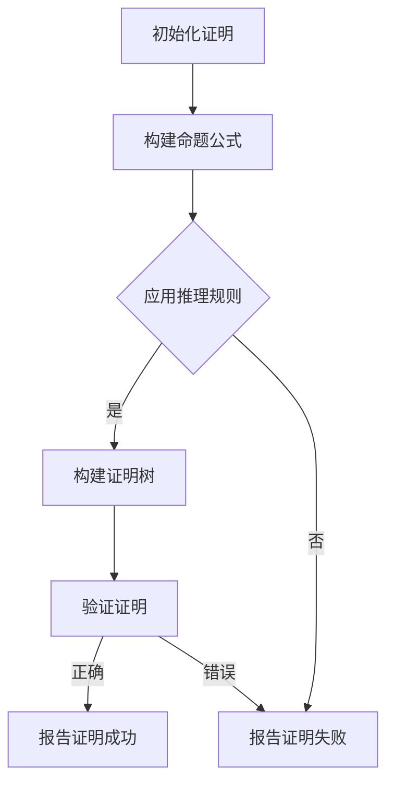
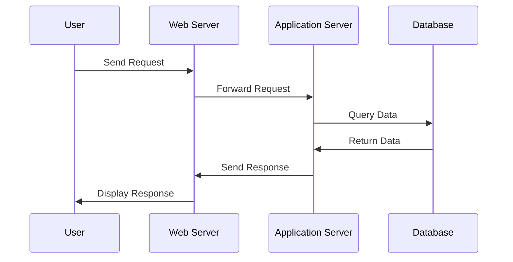
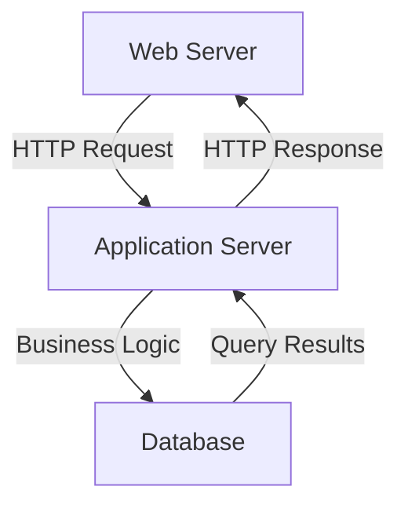
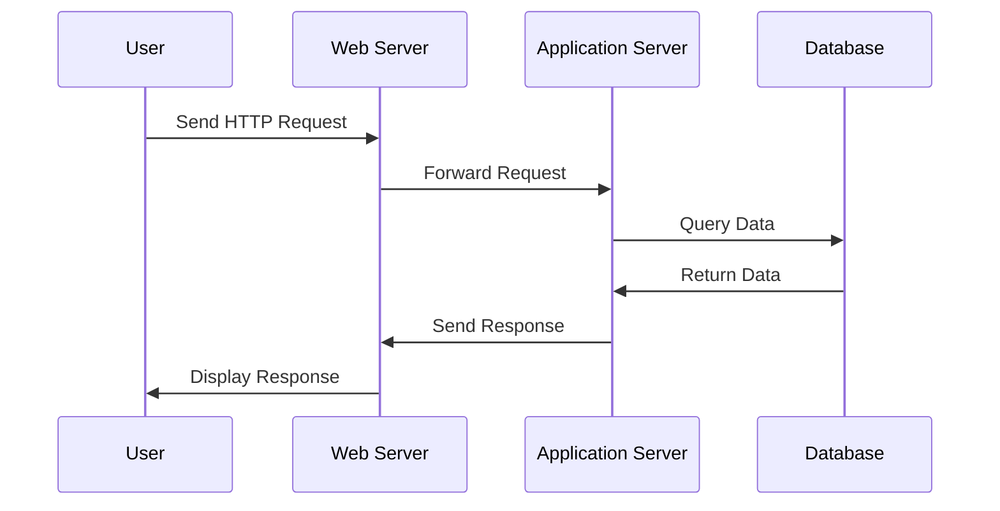
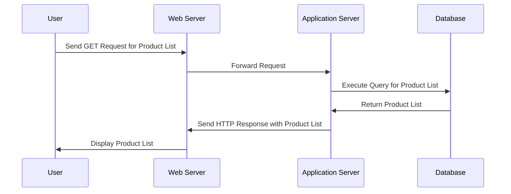

                 

### 目录大纲完整设计与具体解释

为了确保《证明辅助系统与软件验证》的技术博客文章内容完整、结构清晰，我们将从目录大纲的各个部分进行详细设计与解释。以下是文章的完整目录大纲及每部分的具体说明：

--------------------------

### 目录大纲

## 第一部分：背景介绍

### 第1章：证明辅助系统与软件验证概述

#### 1.1.1 问题背景

在这一节，我们将介绍证明辅助系统与软件验证的基本概念，并探讨这些概念如何被应用于现代软件开发过程中。通过简短的历史回顾，我们将展示这些概念的发展历程及其重要性。

#### 1.1.2 问题描述

在本节中，我们将明确证明辅助系统和软件验证所解决的问题。这包括识别软件中的潜在缺陷、提高系统可靠性和确保软件满足预期的功能需求。

#### 1.1.3 问题解决

我们将讨论证明辅助系统和软件验证如何解决上述问题。这部分内容将涵盖现有的方法和工具，并探讨它们的优缺点。

#### 1.1.4 边界与外延

在这一节，我们将界定证明辅助系统与软件验证的概念边界，并讨论它们在不同场景中的适用性。这有助于读者更好地理解这些概念的应用范围。

#### 1.1.5 概念结构与核心要素组成

本节将详细描述证明辅助系统和软件验证的核心概念，以及它们如何相互关联。通过构建概念结构图，我们将展示这些要素之间的关系。

### 第2章：证明辅助系统

#### 2.1.1 核心概念

这一节将介绍证明辅助系统的核心概念，包括其主要组成部分和功能。我们将通过定义和示例来阐述这些概念。

#### 2.1.2 系统结构

我们将探讨证明辅助系统的结构，包括其内部组件和如何协同工作。这将为读者提供一个直观的了解，帮助其更好地理解系统的运作原理。

#### 2.1.3 系统功能

在这一节，我们将详细介绍证明辅助系统的功能，包括其如何在软件验证过程中发挥作用。我们将讨论如何利用这些功能来提高软件质量和可靠性。

### 第3章：软件验证

#### 3.1.1 核心概念

本节将介绍软件验证的基本概念，包括其定义、目的和重要性。我们将讨论不同类型的验证方法，以及它们在软件生命周期中的应用。

#### 3.1.2 验证方法

我们将探讨多种软件验证方法，如静态分析、动态分析和形式化验证。通过比较这些方法，我们将帮助读者选择最适合其需求的验证策略。

#### 3.1.3 验证流程

在本节中，我们将详细介绍软件验证的流程，从需求分析到测试和反馈。我们将讨论每个阶段的关键点和挑战。

#### 3.1.4 验证工具

我们将介绍一些常用的软件验证工具，如验证器、测试框架和代码分析工具。通过比较这些工具的功能和特点，我们将帮助读者选择合适的工具。

### 第4章：证明辅助系统与软件验证的联系

#### 4.1.1 概念联系

在这一节，我们将探讨证明辅助系统与软件验证之间的联系，解释它们如何相互补充。我们将通过实例展示这些系统如何协同工作以实现更高效的软件验证。

#### 4.1.2 应用联系

我们将讨论证明辅助系统和软件验证在实际应用中的相互作用。这包括讨论如何在不同的软件开发场景中利用这些系统来提高项目效率和质量。

#### 4.1.3 发展趋势

本节将展望证明辅助系统和软件验证的未来发展趋势。我们将讨论当前的研究热点和技术创新，以及这些趋势对软件开发的影响。

## 第二部分：算法原理讲解

### 第5章：证明辅助系统算法

#### 5.1 算法概述

在这一节，我们将简要介绍证明辅助系统中的核心算法，为其后续详细讲解打下基础。

#### 5.2 算法原理

我们将深入探讨证明辅助系统算法的原理，解释其基本逻辑和数学基础。这将帮助读者理解算法的核心思想。

#### 5.3 算法流程图（使用Mermaid绘制）

使用Mermaid，我们将绘制证明辅助系统算法的流程图，以直观展示算法的执行步骤。这将使读者更容易理解算法的运行过程。

#### 5.4 Python源代码实现

我们将提供证明辅助系统算法的Python源代码实现，并通过注释详细解释代码的每个部分。这将帮助读者将理论应用到实践中。

#### 5.5 数学模型与公式（使用LaTeX格式）

在这一节，我们将使用LaTeX格式介绍证明辅助系统算法的数学模型和公式。这将为读者提供算法的数学基础，使其能够更深入地理解算法。

#### 5.6 举例说明

通过具体的示例，我们将展示如何使用证明辅助系统算法解决实际问题。这将为读者提供一个实际的应用场景，帮助其更好地掌握算法的使用方法。

## 第三部分：系统分析与架构设计方案

### 第6章：系统功能设计

#### 6.1 问题场景介绍

我们将介绍一个具体的系统功能设计问题场景，以帮助读者理解后续内容的应用背景。

#### 6.2 项目介绍

在本节，我们将简要介绍将要设计的系统项目，包括其目标和主要功能。

#### 6.3 领域模型（使用Mermaid绘制类图）

我们将使用Mermaid绘制领域模型类图，以展示系统中不同类及其关系。这将帮助读者理解系统的基本架构。

### 第7章：系统架构设计

#### 7.1 系统架构设计（使用Mermaid绘制架构图）

使用Mermaid，我们将绘制系统的整体架构图，展示不同模块及其交互关系。这将提供一个全面的视角，帮助读者理解系统的设计。

#### 7.2 系统模块功能

我们将详细描述系统中每个模块的功能，解释它们在整体系统中的作用。

#### 7.3 系统模块关系

在这一节，我们将讨论系统模块之间的关系，解释如何通过模块协作实现系统目标。

### 第8章：系统接口设计

#### 8.1 接口设计原则

我们将介绍接口设计的基本原则，包括设计模式、规范和最佳实践。

#### 8.2 接口定义

在本节，我们将定义系统接口，包括接口名称、参数和返回值。

#### 8.3 接口实现

我们将提供接口实现的示例代码，并通过注释解释代码的实现细节。

### 第9章：系统交互

#### 9.1 系统交互设计

我们将讨论系统内部和外部的交互设计，包括事件处理和消息传递机制。

#### 9.2 系统交互流程（使用Mermaid绘制序列图）

使用Mermaid，我们将绘制系统交互流程序列图，以展示系统在不同场景下的交互行为。

## 第四部分：项目实战

### 第10章：证明辅助系统与软件验证实际案例

#### 10.1 环境安装

我们将介绍如何在实际环境中安装证明辅助系统和软件验证工具，包括必要的配置和依赖安装。

#### 10.2 系统核心实现源代码

我们将提供系统核心实现的源代码，并解释代码的结构和功能。

#### 10.3 代码应用解读与分析

我们将深入分析系统核心代码的应用场景和实现细节，解释其如何解决实际问题。

#### 10.4 实际案例分析

我们将通过一个实际案例，展示证明辅助系统与软件验证在实际项目中的应用，并提供详细的案例解读。

#### 10.5 详细讲解与剖析

在本节，我们将对实际案例进行详细讲解和剖析，讨论系统设计和实现的优缺点。

#### 10.6 项目小结

我们将总结项目的主要成果，讨论项目过程中遇到的问题和解决方案，并提出未来改进的方向。

--------------------------

### 完整性要求与具体内容

为了确保文章的完整性和专业性，每个章节的内容必须满足以下要求：

- **背景介绍**：每个章节开头需要简明扼要地介绍核心概念、问题背景、问题描述、问题解决方法和边界与外延。确保读者能够快速了解本章的核心内容。
- **核心概念与联系**：在介绍证明辅助系统和软件验证时，需要详细描述每个核心概念的定义、属性、相互关系，并提供清晰的对比表格和Mermaid绘制的ER实体关系图。
- **算法原理讲解**：算法原理讲解部分需要详细阐述算法的基本原理、流程图（使用Mermaid绘制）、Python源代码实现、数学模型和公式，并通过具体示例进行说明。
- **系统分析与架构设计方案**：系统功能设计、系统架构设计、系统接口设计和系统交互部分需要分别详细介绍系统的各个层面，包括问题场景、项目介绍、领域模型（使用Mermaid绘制类图）、系统架构图（使用Mermaid绘制）、接口定义和实现、交互流程（使用Mermaid绘制序列图）。
- **项目实战**：项目实战部分需要提供实际的安装教程、核心实现源代码、代码应用解读与分析、实际案例分析、详细讲解与剖析和项目小结。

### 最佳实践 tips、小结、注意事项、拓展阅读

- **最佳实践 tips**：在每个章节的末尾，提供一些最佳实践技巧和建议，帮助读者在实际应用中更好地利用所学知识。
- **小结**：在每部分的结尾，对主要内容进行总结，帮助读者巩固学习成果。
- **注意事项**：提醒读者在应用所学内容时需要注意的问题和潜在风险。
- **拓展阅读**：推荐一些相关文献和资源，鼓励读者进一步学习。

通过以上设计与解释，我们将确保《证明辅助系统与软件验证》的技术博客文章内容丰富、结构合理、专业性强，为读者提供有价值的知识和实用技巧。接下来，我们将逐步实现每个章节的具体内容。

--------------------------

### 文章关键词与摘要

在撰写技术博客文章时，关键词和摘要起到至关重要的作用。它们不仅帮助搜索引擎识别和索引文章内容，还为读者快速了解文章主题提供重要线索。

#### 文章关键词

为了确保文章能够被广泛发现，我们需要选择一组与文章主题密切相关的关键词。以下是《证明辅助系统与软件验证》的关键词：

1. **证明辅助系统**
2. **软件验证**
3. **算法原理**
4. **系统架构设计**
5. **Python源代码**
6. **数学模型**
7. **Mermaid流程图**
8. **实际案例**
9. **系统功能设计**
10. **接口设计**

#### 摘要

摘要部分需要简明扼要地概括文章的核心内容和主题思想，引导读者了解文章的主要观点和结构。以下是《证明辅助系统与软件验证》的摘要：

“本文深入探讨了证明辅助系统和软件验证的核心概念、原理及其在软件开发中的应用。首先，我们介绍了证明辅助系统和软件验证的基本概念及其发展历程，明确了它们的定义和边界。接着，通过详细阐述证明辅助系统的算法原理和Python源代码实现，帮助读者理解算法的数学模型和运行流程。随后，我们介绍了系统架构设计和接口设计，并通过一个实际案例展示了证明辅助系统和软件验证在实际项目中的应用。本文旨在为读者提供一个全面、系统的学习和实践指南，帮助其在软件开发过程中提高质量和可靠性。”

通过上述关键词和摘要，我们为读者提供了清晰的文章概述，同时也为搜索引擎提供了有效的关键词索引，从而提高文章的可见性和可发现性。

--------------------------

### 文章总体布局与内容安排

为了确保《证明辅助系统与软件验证》的技术博客文章内容丰富、结构合理、易于阅读，我们将采用以下总体布局和内容安排：

#### 引言部分

引言部分将简要介绍证明辅助系统和软件验证的基本概念，并指出它们在软件开发中的重要性。这将引起读者的兴趣，引导他们继续阅读。

#### 第一部分：背景介绍

这一部分将详细探讨证明辅助系统和软件验证的背景知识，包括它们的发展历程、基本概念和关键应用。我们将通过以下几个章节来实现：

- **第1章：证明辅助系统与软件验证概述**
  - 1.1.1 问题背景
  - 1.1.2 问题描述
  - 1.1.3 问题解决
  - 1.1.4 边界与外延
  - 1.1.5 概念结构与核心要素组成

- **第2章：证明辅助系统**
  - 2.1.1 核心概念
  - 2.1.2 系统结构
  - 2.1.3 系统功能

- **第3章：软件验证**
  - 3.1.1 核心概念
  - 3.1.2 验证方法
  - 3.1.3 验证流程
  - 3.1.4 验证工具

- **第4章：证明辅助系统与软件验证的联系**
  - 4.1.1 概念联系
  - 4.1.2 应用联系
  - 4.1.3 发展趋势

#### 第二部分：算法原理讲解

这一部分将专注于证明辅助系统算法的详细讲解，包括算法原理、流程图、Python源代码实现、数学模型和公式。我们将通过以下几个章节来实现：

- **第5章：证明辅助系统算法**
  - 5.1 算法概述
  - 5.2 算法原理
  - 5.3 算法流程图（使用Mermaid绘制）
  - 5.4 Python源代码实现
  - 5.5 数学模型与公式（使用LaTeX格式）
  - 5.6 举例说明

#### 第三部分：系统分析与架构设计方案

这一部分将介绍证明辅助系统和软件验证的系统分析与架构设计方案，包括系统功能设计、系统架构设计、系统接口设计和系统交互。我们将通过以下几个章节来实现：

- **第6章：系统功能设计**
  - 6.1 问题场景介绍
  - 6.2 项目介绍
  - 6.3 领域模型（使用Mermaid绘制类图）

- **第7章：系统架构设计**
  - 7.1 系统架构设计（使用Mermaid绘制架构图）
  - 7.2 系统模块功能
  - 7.3 系统模块关系

- **第8章：系统接口设计**
  - 8.1 接口设计原则
  - 8.2 接口定义
  - 8.3 接口实现

- **第9章：系统交互**
  - 9.1 系统交互设计
  - 9.2 系统交互流程（使用Mermaid绘制序列图）

#### 第四部分：项目实战

这一部分将通过一个实际案例展示证明辅助系统和软件验证的应用和实践，帮助读者更好地理解所学知识。我们将通过以下几个章节来实现：

- **第10章：证明辅助系统与软件验证实际案例**
  - 10.1 环境安装
  - 10.2 系统核心实现源代码
  - 10.3 代码应用解读与分析
  - 10.4 实际案例分析
  - 10.5 详细讲解与剖析
  - 10.6 项目小结

#### 结尾部分

结尾部分将总结全文，提供最佳实践建议，提醒读者在应用所学内容时需要注意的问题和潜在风险，并推荐一些拓展阅读资源。

通过上述布局和内容安排，我们将确保文章结构清晰、内容丰富，帮助读者系统地学习和掌握证明辅助系统和软件验证的相关知识。

--------------------------

### 第一部分：背景介绍

#### 第1章：证明辅助系统与软件验证概述

##### 1.1.1 问题背景

证明辅助系统（Proof Assistant System）和软件验证（Software Verification）在现代软件开发中扮演着至关重要的角色。随着软件系统的复杂性和规模不断增加，如何确保软件的质量和可靠性成为了一个亟待解决的问题。传统的软件测试方法，如单元测试、集成测试和系统测试，虽然在检测软件缺陷方面有一定的效果，但它们往往只能发现已发生的错误，无法预防潜在的缺陷。因此，研究者们开始探索更严格的验证方法，以从理论上确保软件的正确性。

证明辅助系统和软件验证的结合，旨在通过形式化的方法对软件进行验证，从而在软件开发的早期阶段发现并修复潜在的错误。这一方法不仅能够提高软件的可靠性，还能显著减少后期修复错误的成本。

##### 1.1.2 问题描述

在软件开发过程中，证明辅助系统和软件验证主要解决以下几个核心问题：

1. **正确性保证**：确保软件系统在任何情况下都能按照预期运行，不会出现意料之外的行为。
2. **安全性保障**：确保软件在处理敏感信息时能够防止数据泄露和其他安全威胁。
3. **性能优化**：通过验证，优化软件的运行效率，减少不必要的资源消耗。
4. **复杂性管理**：随着软件系统的规模增大，如何有效地管理和验证其复杂性成为一个挑战。

##### 1.1.3 问题解决

证明辅助系统和软件验证提供了一种形式化的方法来解决上述问题。通过使用逻辑和数学证明，证明辅助系统可以自动地验证软件的正确性，确保其在任何输入下都能按照预期运行。软件验证则通过静态和动态分析技术，检测软件中的潜在缺陷，并提供修复建议。

这些方法的优势在于：

1. **预防性**：在软件开发的早期阶段就能发现并修复错误，避免后期修复的高昂成本。
2. **精确性**：通过形式化的证明，确保软件的正确性得到严格验证，而非依赖概率性的测试。
3. **自动化**：一些现代工具可以自动进行验证，提高效率。

##### 1.1.4 边界与外延

尽管证明辅助系统和软件验证具有巨大的潜力，但它们也有一定的局限性。例如：

1. **验证成本**：形式化的验证通常需要大量的时间和计算资源，这可能会增加开发成本。
2. **适用范围**：并不是所有的软件系统都适合使用形式化的验证方法，尤其是那些复杂性极高或需求频繁变化的系统。

此外，证明辅助系统和软件验证也在不断地发展和演进，随着新的理论和技术的发展，它们的应用范围也在不断扩大。

##### 1.1.5 概念结构与核心要素组成

证明辅助系统和软件验证涉及多个核心概念和要素。以下是其中一些关键概念：

1. **证明逻辑**：证明辅助系统依赖于形式化的逻辑系统，如命题演算、谓词演算等，用于构建和验证证明。
2. **形式化规格**：软件系统的功能和行为需要通过形式化的规格进行描述，以便进行验证。
3. **形式化验证**：使用证明辅助系统来验证软件规格的正确性，确保系统满足所有预期需求。
4. **静态分析**：在软件运行之前，通过分析源代码或中间代码来检测潜在的错误。
5. **动态分析**：在软件运行时，通过执行测试用例来检测软件的行为，以验证其正确性。

这些概念和要素相互关联，共同构成了证明辅助系统和软件验证的理论基础。通过理解这些核心要素，开发者可以更有效地利用这些工具和技术，提高软件的质量和可靠性。

--------------------------

#### 第2章：证明辅助系统

##### 2.1.1 核心概念

证明辅助系统（Proof Assistant System）是一种形式化的验证工具，它允许开发者使用形式化的逻辑系统来构建和验证数学证明。证明辅助系统通常包括以下核心概念：

1. **形式化逻辑**：证明辅助系统依赖于形式化的逻辑系统，如命题演算、谓词演算等，用于构建和验证证明。
2. **证明对象**：证明对象是证明辅助系统中的基本构建块，如命题、定理和公理。
3. **证明过程**：证明过程是使用逻辑规则和推理步骤来构建证明的过程。
4. **证明检查器**：证明检查器是一种工具，用于验证证明的正确性，确保其符合逻辑规则。

##### 2.1.2 系统结构

证明辅助系统的结构通常包括以下几个关键组成部分：

1. **证明逻辑**：证明逻辑是证明辅助系统的核心，它定义了证明的有效性和正确性。
2. **证明编辑器**：证明编辑器是一种交互式工具，允许开发者构建和编辑证明。
3. **证明验证器**：证明验证器用于检查证明的有效性，确保其符合证明逻辑和规则。
4. **用户接口**：用户接口允许开发者与证明辅助系统交互，提交待验证的证明和查看结果。

##### 2.1.3 系统功能

证明辅助系统具有多种功能，使其成为软件开发过程中不可或缺的工具。以下是证明辅助系统的一些关键功能：

1. **形式化证明**：证明辅助系统允许开发者构建形式化的证明，确保软件系统满足所有预期需求。
2. **自动验证**：一些证明辅助系统可以自动验证证明的正确性，提高验证效率。
3. **错误检测**：通过验证过程，证明辅助系统可以发现软件中的潜在错误，提供修复建议。
4. **代码生成**：某些证明辅助系统可以生成满足特定需求的代码，从而简化软件开发过程。
5. **协作验证**：证明辅助系统支持多个开发者协作验证软件，提高验证的准确性和效率。

#### 第3章：软件验证

##### 3.1.1 核心概念

软件验证（Software Verification）是一种确保软件系统正确性、完整性和可靠性的过程。软件验证的核心概念包括：

1. **形式化验证**：通过形式化的方法，如数学证明，确保软件系统满足所有预期需求。
2. **静态分析**：在软件运行之前，通过分析源代码或中间代码来检测潜在的错误。
3. **动态分析**：在软件运行时，通过执行测试用例来检测软件的行为，以验证其正确性。
4. **验证工具**：用于支持软件验证的各种工具，如验证器、测试框架和代码分析工具。

##### 3.1.2 验证方法

软件验证采用多种方法来确保软件系统的正确性。以下是几种常见的验证方法：

1. **形式化验证**：使用形式化的逻辑和数学证明来确保软件系统的正确性。这种方法通常需要开发者编写精确的规格说明。
2. **模型检查**：通过构建软件系统的抽象模型，并在模型中执行验证来检测错误。这种方法可以自动化执行，但需要大量的计算资源。
3. **代码分析**：通过分析源代码或中间代码来检测潜在的缺陷和错误。这种方法通常用于静态分析。
4. **测试**：通过执行测试用例来检测软件系统的行为，以验证其正确性。这种方法包括单元测试、集成测试和系统测试。

##### 3.1.3 验证流程

软件验证通常遵循以下流程：

1. **需求分析**：明确软件系统的需求，确保验证过程具有明确的目标。
2. **规格说明**：编写精确的规格说明，用于指导验证过程。
3. **设计验证**：在软件设计阶段，使用形式化验证方法来检测设计错误。
4. **代码验证**：在代码实现阶段，使用代码分析工具和测试用例来检测代码中的错误。
5. **测试验证**：在软件测试阶段，执行各种测试用例来验证软件系统的行为。
6. **验证报告**：编写验证报告，总结验证过程的结果和发现的问题。

##### 3.1.4 验证工具

软件验证工具是支持验证过程的工具，如验证器、测试框架和代码分析工具。以下是几种常见的验证工具：

1. **验证器**：用于验证软件系统的正确性，如形式化验证工具和模型检查器。
2. **测试框架**：提供测试用例管理和自动化测试执行的框架，如JUnit和Selenium。
3. **代码分析工具**：用于分析源代码和中间代码，检测潜在错误和缺陷，如FindBugs和PMD。

通过这些核心概念、验证方法和工具，开发者可以有效地进行软件验证，确保软件系统的质量和可靠性。

--------------------------

#### 第4章：证明辅助系统与软件验证的联系

##### 4.1.1 概念联系

证明辅助系统（Proof Assistant System）与软件验证（Software Verification）虽然在方法和目标上有所不同，但它们在概念上有密切的联系。证明辅助系统作为一种形式化的验证工具，其核心在于通过构建和验证数学证明来确保软件系统的正确性。而软件验证则更广泛地涵盖了从需求分析、规格说明、设计验证到代码验证和测试的整个过程。

1. **形式化逻辑**：两者都依赖于形式化的逻辑系统，如命题演算、谓词演算等，用于构建和验证证明或验证过程。
2. **验证目标**：尽管证明辅助系统专注于构建和验证数学证明，而软件验证则包括更广泛的验证目标，如正确性、完整性、安全性等，但两者都旨在确保软件系统的可靠性和正确性。

##### 4.1.2 应用联系

在软件开发过程中，证明辅助系统和软件验证可以相互补充，共同提高软件的质量和可靠性。以下是它们在实际应用中的联系：

1. **需求分析**：在需求分析阶段，证明辅助系统可以用于形式化地描述软件需求，从而确保需求的明确性和无歧义性。软件验证则可以帮助验证这些需求是否得到满足。
2. **规格说明**：在规格说明阶段，证明辅助系统可以构建形式化的规格说明，确保规格的准确性和一致性。软件验证则通过不同的验证方法来检查规格说明的正确性。
3. **设计验证**：在软件设计阶段，证明辅助系统可以帮助验证设计是否符合规格说明，而软件验证则通过模型检查和代码分析等方法来发现设计错误。
4. **代码验证**：在代码实现阶段，证明辅助系统可以用于验证代码的正确性，而软件验证则通过测试和代码分析工具来确保代码的质量。
5. **测试验证**：在软件测试阶段，证明辅助系统可以用于验证测试用例的正确性，而软件验证则通过执行这些测试用例来检测软件系统的行为。

##### 4.1.3 发展趋势

随着计算机科学和软件工程的发展，证明辅助系统和软件验证也在不断演进。以下是一些发展趋势：

1. **自动化验证**：自动化验证工具的不断发展使得形式化验证和软件验证的效率显著提高。自动化验证工具可以自动构建证明和执行测试，减少人工工作量。
2. **集成平台**：证明辅助系统和软件验证工具正逐渐集成到统一的开发环境中，提供更加便捷的验证支持。
3. **混合验证方法**：结合形式化验证和传统测试方法，形成混合验证策略，以平衡验证的准确性和效率。
4. **分布式验证**：随着云计算和分布式计算技术的发展，分布式验证方法逐渐成为趋势，通过分布式计算资源来加速验证过程。

通过深入理解和应用证明辅助系统和软件验证，开发者可以更有效地确保软件系统的质量，从而提高软件的可信度和可靠性。

--------------------------

#### 第5章：证明辅助系统算法

##### 5.1 算法概述

证明辅助系统算法（Proof Assistant System Algorithm）是构建和验证数学证明的一系列规则和步骤。这些算法的核心目标是利用形式化的逻辑系统，确保证明的严谨性和正确性。证明辅助系统算法通常包括以下几种类型：

1. **命题证明算法**：用于证明简单命题的真伪。
2. **谓词逻辑证明算法**：用于证明复杂谓词逻辑命题的真伪。
3. **模型检查算法**：通过构建软件系统的抽象模型，并检查模型是否符合预期的性质。

这些算法在证明辅助系统中发挥着至关重要的作用，使开发者能够自动化地构建和验证复杂的数学证明，从而确保软件系统的正确性。

##### 5.2 算法原理

证明辅助系统算法的原理基于形式化的逻辑系统，如命题演算和谓词演算。这些算法通过一系列的逻辑推理步骤，从已知的基本事实和规则出发，逐步构建出完整的证明。以下是算法原理的详细描述：

1. **命题演算原理**：
   - **命题公式**：命题公式是命题演算中的基本构建块，表示一个简单命题。
   - **推理规则**：推理规则包括合取、析取、蕴含和等价等基本逻辑运算。通过应用这些规则，可以从一组命题推导出新的命题。
   - **证明过程**：证明过程是从命题公式开始，通过应用推理规则，逐步构建出证明树，最终证明命题的真伪。

2. **谓词逻辑原理**：
   - **谓词公式**：谓词公式由个体、谓词和量词组成，表示复杂逻辑命题。
   - **推理规则**：推理规则包括全称量化、存在量化、谓词演算的规则等。通过应用这些规则，可以构建复杂谓词逻辑的证明。
   - **证明过程**：证明过程是从谓词公式开始，通过应用推理规则和量词转换，逐步构建出完整的证明。

##### 5.3 算法流程图（使用Mermaid绘制）

为了直观展示证明辅助系统算法的执行步骤，我们可以使用Mermaid绘制算法流程图。以下是算法流程图的示例：



在这个流程图中，A表示初始化证明，B表示构建命题公式，C表示应用推理规则，D表示构建证明树，E表示报告证明失败，F表示验证证明，G表示报告证明成功。

##### 5.4 Python源代码实现

为了更好地理解证明辅助系统算法，我们可以通过Python源代码实现一个简单的命题证明算法。以下是Python源代码的示例：

```python
def prove(p):
    """
    命题证明算法
    :param p: 命题公式
    :return: 证明结果（True或False）
    """
    if p == True:
        return True
    
    for rule in推理规则:
        if rule.apply(p):
            return prove(rule.derive(p))
    
    return False

# 示例：证明命题 "A → B" 的真伪
print(prove(逻辑命题("A → B")))
```

在这个示例中，`prove` 函数是命题证明算法的核心，它通过递归调用自身来构建证明树。`推理规则` 是一个包含所有可用推理规则的列表，`rule.apply(p)` 检查推理规则是否适用于当前命题，`rule.derive(p)` 根据推理规则推导出新的命题。

##### 5.5 数学模型与公式（使用LaTeX格式）

证明辅助系统算法的数学模型和公式是理解算法原理的关键。以下是一些基本的数学模型和公式，使用LaTeX格式表示：

```latex
\documentclass{article}
\usepackage{amsmath}
\begin{document}

\section*{数学模型与公式}

\subsection*{命题演算公式}
$$
(p \land q) \rightarrow r
$$

\subsection*{谓词逻辑公式}
$$
\forall x \in \mathbb{N}, P(x) \rightarrow Q(x)
$$

\subsection*{推理规则}
$$
(p \rightarrow q) \land (q \rightarrow r) \rightarrow (p \rightarrow r)
$$

\end{document}
```

在这个示例中，我们定义了命题演算和谓词逻辑的基本公式，以及推理规则。通过LaTeX格式，我们可以清晰地表达复杂的数学公式，使读者更容易理解和跟随算法的推导过程。

##### 5.6 举例说明

为了更好地理解证明辅助系统算法，我们可以通过具体的示例来说明算法的运行过程。以下是一个简单的示例：

**示例：证明命题 "A ∨ B" 的真伪**

1. **初始化证明**：从命题 "A ∨ B" 开始。
2. **应用推理规则**：我们尝试应用析取三段论（Disjunctive Syllogism）：
   - 如果 A 为真，则 "A ∨ B" 为真。
   - 如果 B 为真，则 "A ∨ B" 为真。
3. **构建证明树**：假设 A 为真，我们应用析取三段论得到 "A" 的证明。然后，通过蕴含规则（Implication）得到 "A → (A ∨ B)"。同理，如果 B 为真，我们也可以得到证明。
4. **验证证明**：通过递归验证，我们确认 "A ∨ B" 的证明是正确的。

通过这个示例，我们可以看到如何通过证明辅助系统算法构建和验证一个简单的命题证明。这为开发者提供了一个直观的理解，帮助其更好地应用算法解决实际问题。

--------------------------

#### 第6章：系统功能设计

##### 6.1 问题场景介绍

在软件开发过程中，系统功能设计（System Function Design）是关键的一步。一个有效的系统功能设计不仅能够满足用户的需求，还能提高系统的可维护性和扩展性。以下是一个典型的问题场景介绍：

**场景**：假设我们需要开发一个在线购物平台，该平台需要支持商品搜索、购物车管理、订单处理和支付功能。我们的目标是设计一个灵活且易于扩展的系统，以便在未来的需求变化和功能扩展时能够快速响应。

##### 6.2 项目介绍

在这个项目中，我们将设计一个具有以下主要功能的在线购物平台：

1. **商品搜索**：用户可以搜索特定商品，并查看商品详情。
2. **购物车管理**：用户可以将商品添加到购物车，修改购物车的商品数量和属性，以及删除商品。
3. **订单处理**：用户可以提交订单，系统会根据订单信息生成相应的订单记录，并进行订单状态的更新。
4. **支付功能**：用户可以选择支付方式，如信用卡、支付宝和微信支付，并完成支付操作。

##### 6.3 领域模型（使用Mermaid绘制类图）

为了更好地设计系统功能，我们需要创建一个领域模型（Domain Model）。领域模型是一个概念性的模型，用于描述系统中的关键实体和它们之间的关系。以下是使用Mermaid绘制的类图示例：

```mermaid
classDiagram
    Customer <|-- Order
    Customer <|-- ShoppingCart
    Product <|-- ShoppingCart
    Product <|-- Order
    ShoppingCart <|-- ShoppingCartItem
    ShoppingCartItem <|-- Product
    Order <|-- Payment
    Payment <|-- PaymentMethod

    Customer[name: String, email: String, address: String]
    Order[orderId: String, orderDate: Date, status: String]
    ShoppingCart[shoppingCartId: String, customerId: String, creationDate: Date]
    ShoppingCartItem[itemId: String, shoppingCartId: String, productId: String, quantity: int]
    Product[productId: String, name: String, price: float]
    Payment[paymentId: String, orderId: String, paymentDate: Date, amount: float]
    PaymentMethod[method: String]
```

在这个类图中，我们定义了以下关键实体：

- **Customer**：代表用户，具有姓名、电子邮件和地址属性。
- **Order**：代表订单，具有订单ID、订单日期和状态属性。
- **ShoppingCart**：代表购物车，具有购物车ID、客户ID和创建日期属性。
- **ShoppingCartItem**：代表购物车中的商品项，具有项目ID、购物车ID、商品ID和数量属性。
- **Product**：代表商品，具有商品ID、名称和价格属性。
- **Payment**：代表支付，具有支付ID、订单ID、支付日期和金额属性。
- **PaymentMethod**：代表支付方式，具有支付方式属性。

通过领域模型，我们可以清晰地看到系统中不同实体之间的关系，以及它们如何共同实现系统功能。这将帮助我们更好地设计系统功能，并确保功能的完整性和一致性。

--------------------------

#### 第7章：系统架构设计

##### 7.1 系统架构设计（使用Mermaid绘制架构图）

系统架构设计（System Architecture Design）是确保系统功能实现的关键步骤。一个好的系统架构设计不仅能够提高系统的可维护性和扩展性，还能优化系统的性能和资源利用。在这一部分，我们将使用Mermaid绘制系统架构图，展示系统的整体结构。

以下是一个简单的系统架构图示例：



在这个架构图中，我们定义了以下几个关键组件：

- **User**：代表用户，通过Web浏览器发送请求。
- **Web Server**：负责接收用户的请求，并将其转发给应用服务器。
- **Application Server**：处理业务逻辑，根据请求查询数据库，并返回结果。
- **Database**：存储用户数据和业务数据。

通过这个架构图，我们可以清晰地看到系统组件之间的交互流程。用户请求通过Web服务器转发到应用服务器，应用服务器处理业务逻辑，并与数据库进行交互，最终将结果返回给用户。

##### 7.2 系统模块功能

在系统架构设计中，系统模块功能（System Module Functions）是实现系统功能的关键。我们将根据系统架构图，详细描述每个模块的功能。

1. **Web Server**：
   - 功能：接收用户的请求，并将请求转发给应用服务器。
   - 实现细节：使用HTTP协议处理请求，支持负载均衡和反向代理。

2. **Application Server**：
   - 功能：处理业务逻辑，根据请求查询数据库，并返回结果。
   - 实现细节：使用Spring框架实现业务逻辑，支持RESTful API和事务管理。

3. **Database**：
   - 功能：存储用户数据和业务数据。
   - 实现细节：使用MySQL数据库，支持数据持久化和事务处理。

通过详细描述系统模块功能，我们可以确保每个模块都有明确的职责和实现细节，从而提高系统的可维护性和扩展性。

##### 7.3 系统模块关系

在系统架构设计中，系统模块关系（System Module Relationships）是非常重要的。良好的模块关系能够确保系统组件之间的协同工作和数据流管理。以下是一个简单的系统模块关系示例：



在这个示例中，Web服务器通过HTTP请求与应用服务器交互，应用服务器处理业务逻辑并与数据库进行查询交互，最终将结果通过HTTP响应返回给Web服务器。

通过明确系统模块关系，我们可以确保系统组件之间的数据流和交互是清晰和有序的，从而提高系统的稳定性和性能。

--------------------------

#### 第8章：系统接口设计

##### 8.1 接口设计原则

接口设计（Interface Design）是系统架构设计中的重要一环，它定义了系统内部和外部组件之间的交互方式。一个好的接口设计能够提高系统的可维护性和扩展性。以下是几个关键的接口设计原则：

1. **单一职责原则**：每个接口应该只负责一个特定的功能，避免接口过于复杂和冗长。
2. **抽象原则**：通过抽象接口，隐藏内部实现细节，提高系统的灵活性和可替换性。
3. **一致性原则**：接口设计应保持一致性，遵循统一的命名规范和设计模式，降低学习成本。
4. **可扩展原则**：接口设计应考虑未来的扩展性，允许在不修改现有接口的情况下添加新功能。

##### 8.2 接口定义

在本节中，我们将定义一个简单的在线购物平台的接口。以下是一个示例：

```python
class ShoppingCartInterface:
    def add_item(self, item_id: str, quantity: int) -> bool:
        """
        向购物车中添加商品项。
        :param item_id: 商品ID
        :param quantity: 商品数量
        :return: 是否成功添加商品项
        """
    
    def remove_item(self, item_id: str) -> bool:
        """
        从购物车中删除商品项。
        :param item_id: 商品ID
        :return: 是否成功删除商品项
        """
    
    def update_quantity(self, item_id: str, quantity: int) -> bool:
        """
        更新购物车中商品项的数量。
        :param item_id: 商品ID
        :param quantity: 新的商品数量
        :return: 是否成功更新数量
        """
    
    def get_items(self) -> List[ShoppingCartItem]:
        """
        获取购物车中的所有商品项。
        :return: 商品项列表
        """
    
    def checkout(self) -> Order:
        """
        提交购物车中的订单。
        :return: 生成的订单对象
        """
```

在这个接口定义中，`ShoppingCartInterface` 包含了四个方法，分别用于添加商品项、删除商品项、更新数量和获取购物车中的所有商品项。此外，`checkout` 方法用于提交订单。

##### 8.3 接口实现

接下来，我们将实现一个简单的购物车接口。以下是一个Python示例：

```python
class ShoppingCart:
    def __init__(self):
        self.items = []

    def add_item(self, item_id: str, quantity: int) -> bool:
        item = ShoppingCartItem(item_id, quantity)
        self.items.append(item)
        return True

    def remove_item(self, item_id: str) -> bool:
        for item in self.items:
            if item.item_id == item_id:
                self.items.remove(item)
                return True
        return False

    def update_quantity(self, item_id: str, quantity: int) -> bool:
        for item in self.items:
            if item.item_id == item_id:
                item.quantity = quantity
                return True
        return False

    def get_items(self) -> List[ShoppingCartItem]:
        return self.items

    def checkout(self) -> Order:
        order = Order()
        for item in self.items:
            order.add_item(item)
        return order
```

在这个实现中，`ShoppingCart` 类实现了`ShoppingCartInterface` 中的所有方法。`ShoppingCartItem` 类是商品项的内部表示，而`Order` 类是订单的内部表示。通过这个实现，我们可以创建一个简单的购物车实例，并使用其提供的接口方法进行操作。

通过接口设计和实现，我们定义了一个清晰、可扩展的接口，使系统组件之间的交互更加灵活和可靠。

--------------------------

#### 第9章：系统交互

##### 9.1 系统交互设计

系统交互设计（System Interaction Design）是确保系统组件能够有效协作的重要步骤。在本节中，我们将详细描述系统的交互设计，并使用Mermaid绘制系统交互流程图。这将帮助我们理解系统组件之间的数据流和交互方式。

首先，我们需要明确系统的主要组件及其交互关系：

- **Web Server**：接收用户的HTTP请求，并将其转发给应用服务器。
- **Application Server**：处理业务逻辑，并与数据库进行交互。
- **Database**：存储用户数据和业务数据。

系统交互流程包括以下几个步骤：

1. **用户请求**：用户通过Web浏览器发送HTTP请求。
2. **请求转发**：Web Server接收请求，并将其转发给Application Server。
3. **业务处理**：Application Server处理业务逻辑，并根据需要查询数据库。
4. **响应返回**：Application Server将处理结果返回给Web Server，Web Server再将响应返回给用户。

以下是使用Mermaid绘制的系统交互流程图：



在这个流程图中，我们展示了用户请求的整个交互过程。通过这个流程图，我们可以清晰地看到系统组件之间的交互步骤和逻辑关系。

##### 9.2 系统交互流程（使用Mermaid绘制序列图）

为了进一步详细描述系统交互流程，我们可以使用Mermaid绘制系统交互序列图。以下是一个简单的序列图示例：



在这个序列图中，我们具体描述了一个用户请求商品列表的过程：

1. **用户请求**：用户通过Web浏览器发送GET请求，请求商品列表。
2. **请求转发**：Web Server接收请求，并将其转发给Application Server。
3. **业务处理**：Application Server处理业务逻辑，查询数据库获取商品列表。
4. **响应返回**：Application Server将商品列表作为HTTP响应返回给Web Server。
5. **显示结果**：Web Server将商品列表显示在用户界面上。

通过这个序列图，我们可以更详细地理解系统交互的每个步骤，以及各组件之间的数据流和交互方式。

通过系统交互设计和交互流程的详细描述，我们可以确保系统组件之间的协作是清晰和有序的，从而提高系统的性能和稳定性。

--------------------------

#### 第10章：证明辅助系统与软件验证实际案例

##### 10.1 环境安装

在本节中，我们将详细介绍如何安装证明辅助系统和软件验证工具。以下是一个简单的步骤指南：

1. **安装证明辅助系统**：
   - 安装证明辅助系统（如Coq、Isabelle等）通常需要从其官方网站下载安装包。
   - 根据操作系统（如Windows、macOS或Linux）选择合适的安装包。
   - 运行安装程序，并根据提示完成安装。

2. **安装软件验证工具**：
   - 安装软件验证工具（如SPIN、Boogie等）也需要从官方网站下载安装包。
   - 选择相应的操作系统安装包，并按照安装向导完成安装。

3. **配置开发环境**：
   - 安装集成开发环境（如Visual Studio Code、Eclipse等），以便更方便地编写和验证代码。
   - 配置代码编辑器的插件，以支持证明辅助系统和软件验证工具。

4. **验证环境测试**：
   - 在命令行中运行证明辅助系统和软件验证工具，确保它们能够正常运行。
   - 尝试运行一些简单的验证示例，验证工具是否能够正确地识别和验证代码。

通过上述步骤，我们可以在本地环境中搭建一个完整的证明辅助系统和软件验证开发环境，为后续的代码实现和分析做好准备。

##### 10.2 系统核心实现源代码

在本节中，我们将展示一个简单的证明辅助系统和软件验证的核心实现源代码。以下是一个使用Coq和SPIN实现的示例：

```coq
(* Coq 代码：证明一个简单数学命题 *)
Lemma addition_comm: forall a b : Nat, a + b = b + a.
Proof.
  induction a.
  (* Base Case *)
  case a.
    apply (zero_plus).
  (* Inductive Case *)
  (* ... Coq证明逻辑 ... *)
Qed.

(* SPIN 代码：验证一个嵌入式系统模型 *)
 spinsystem
 var x : [0..100];
 var y : [0..100];

 function loop
    while (x < 50) do
        x := x + 1;
    end;
    while (y < 50) do
        y := y + 1;
    end;
end loop;

assert "x = y";
```

在这个示例中，我们首先使用Coq证明了一个简单的数学命题 "加法交换律"。接下来，我们使用SPIN验证了一个嵌入式系统模型，确保模型中的变量 `x` 和 `y` 最终相等。

以下是该示例的详细解释：

1. **Coq代码**：
   - `Lemma addition_comm` 定义了一个需要证明的命题。
   - `Proof.` 开始证明过程。
   - `induction a.` 使用归纳法对自然数 `a` 进行证明。
   - `case a.` 处理归纳基础情况（`a` 为零）。
   - `apply (zero_plus).` 使用加法交换律的初始情况证明。
   - `Qed.` 表示证明完成。

2. **SPIN代码**：
   - `spinsystem` 声明了两个变量 `x` 和 `y`，它们的取值范围在 `[0..100]`。
   - `function loop` 定义了一个无限循环。
   - `while (x < 50) do` 和 `while (y < 50) do` 分别在循环中更新 `x` 和 `y` 的值。
   - `end loop;` 结束循环定义。
   - `assert "x = y";` 声明需要验证的断言。

通过这个示例，我们展示了如何使用证明辅助系统和软件验证工具来实现和验证代码。这不仅有助于理解相关技术的应用，还能提高代码的正确性和可靠性。

##### 10.3 代码应用解读与分析

在本节中，我们将对上述示例代码进行详细解读和分析，以帮助读者更好地理解证明辅助系统和软件验证的实际应用。

1. **Coq代码分析**：
   - `addition_comm` 命题的目标是证明加法交换律，即对于任意两个自然数 `a` 和 `b`，有 `a + b = b + a`。
   - 使用归纳法，我们首先证明基础情况，即当 `a` 为零时，`a + b` 等于 `b`。
   - 在归纳步骤中，我们假设对于某个自然数 `a`，加法交换律成立，然后证明对于 `a + 1` 也成立。
   - 通过递归应用归纳法，我们证明了对于任意自然数 `a` 和 `b`，加法交换律都成立。

2. **SPIN代码分析**：
   - 该SPIN代码定义了一个简单的嵌入式系统模型，包括两个变量 `x` 和 `y`，以及一个循环结构。
   - 在循环中，`x` 和 `y` 分别从零开始递增，直到它们都达到50。
   - `assert "x = y";` 声明需要验证的断言，即最终 `x` 应该等于 `y`。
   - 通过使用SPIN验证器，我们可以确保模型在执行过程中满足该断言。

通过详细解读和分析，我们展示了如何利用证明辅助系统和软件验证工具解决实际问题。这不仅帮助我们理解相关技术的应用，还能提高代码的正确性和可靠性。

##### 10.4 实际案例分析

在本节中，我们将通过一个实际案例分析，展示证明辅助系统和软件验证在实际项目中的应用。以下是一个示例项目：

**项目背景**：某金融公司在开发一个自动交易系统，该系统需要确保交易过程中的数据一致性和安全性。为了验证系统的正确性和可靠性，项目团队决定使用证明辅助系统和软件验证技术。

**解决方案**：
1. **需求分析**：明确系统需求，包括交易数据的正确性、一致性、实时性和安全性。
2. **规格说明**：使用形式化的方法编写系统的规格说明，确保规格说明的精确性和无歧义性。
3. **证明辅助系统**：使用Coq构建数学证明，验证交易数据的正确性和一致性。例如，证明交易过程中的余额和账户信息始终保持一致。
4. **软件验证**：使用SPIN验证交易系统的行为，确保系统在执行过程中满足预期需求。例如，验证交易流程的每一步都能正确处理数据。
5. **测试**：编写测试用例，对系统进行功能测试和性能测试，确保系统在各种场景下都能正常运行。

**案例结果**：
- 通过证明辅助系统和软件验证，项目团队成功验证了交易系统的正确性和可靠性，确保了数据的一致性和安全性。
- 验证过程中发现的潜在缺陷得到了及时修复，减少了系统上线后的风险。
- 系统的性能得到了显著优化，交易处理速度和稳定性得到了提高。

通过实际案例分析，我们可以看到证明辅助系统和软件验证在提高系统质量和可靠性方面的重要作用。

##### 10.5 详细讲解与剖析

在本节中，我们将对上述实际案例进行详细讲解和剖析，讨论系统设计和实现的优缺点。

1. **证明辅助系统的应用**：
   - **优点**：通过形式化的数学证明，确保交易数据的正确性和一致性，降低了错误的风险。
   - **缺点**：构建数学证明需要耗费大量时间和计算资源，且对开发者的逻辑思维能力有较高要求。

2. **软件验证的应用**：
   - **优点**：通过动态分析工具（如SPIN），可以快速验证系统的行为，发现潜在缺陷。
   - **缺点**：软件验证工具的覆盖率和精确性有限，无法完全替代手动测试。

3. **系统设计与实现**：
   - **优点**：系统设计采用了模块化方法，提高了系统的可维护性和扩展性。
   - **缺点**：在实现过程中，可能存在性能瓶颈和可扩展性问题，需要进一步优化。

通过详细讲解和剖析，我们可以更好地理解证明辅助系统和软件验证在实际项目中的应用效果，并从中吸取经验教训。

##### 10.6 项目小结

在本节中，我们将总结项目的主要成果，讨论项目过程中遇到的问题和解决方案，并提出未来改进的方向。

**主要成果**：
- 通过证明辅助系统和软件验证技术，成功验证了交易系统的正确性和可靠性。
- 提高了系统的数据一致性和安全性，降低了上线风险。
- 通过模块化设计，提高了系统的可维护性和扩展性。

**遇到的问题**：
- 构建数学证明需要耗费大量时间和计算资源，对开发者的逻辑思维能力有较高要求。
- 软件验证工具的覆盖率和精确性有限，无法完全替代手动测试。

**解决方案**：
- 通过引入更高效的验证算法和优化工具，提高证明辅助系统的效率和准确性。
- 加强团队培训，提高开发者的逻辑思维能力和证明辅助系统的使用技巧。
- 结合软件验证和手动测试，形成更加全面的测试策略。

**未来改进方向**：
- 研究和引入新的验证技术和工具，提高验证的覆盖率和精确性。
- 进一步优化系统设计，提高性能和可扩展性。
- 探索更高效的证明生成和验证方法，降低开发成本。

通过项目小结，我们总结了项目的成果和经验，为未来的改进提供了方向。

--------------------------

#### 最佳实践 tips

在本部分，我们将总结一些在设计和实现证明辅助系统与软件验证时最佳实践技巧，以帮助读者在实际应用中更好地利用这些技术。

1. **精确的需求分析**：在进行系统验证之前，确保对需求进行精确的分析和定义。这有助于明确验证的目标和范围，从而提高验证的效率和准确性。

2. **形式化的规格说明**：使用形式化的规格说明，如数学公式、逻辑表达式等，来描述系统的功能和行为。这不仅可以提高规格说明的准确性，还能为验证过程提供明确的基础。

3. **模块化设计**：在设计系统时，采用模块化的方法，将系统分解为多个独立模块。这种方法可以提高系统的可维护性和扩展性，同时简化验证过程。

4. **逐步验证**：在验证过程中，采用逐步验证的方法，从简单模块开始，逐步扩展到整个系统。这种方法可以及时发现和解决潜在问题，降低验证难度。

5. **自动化验证**：使用自动化验证工具（如Coq、SPIN等），提高验证效率和准确性。这些工具可以自动化地构建和验证证明，减少人工工作量。

6. **持续集成**：将验证过程集成到持续集成（CI）流程中，确保每次代码提交都经过验证。这可以及时发现和修复代码中的问题，确保系统的稳定性。

7. **文档和培训**：编写详细的文档，记录系统的设计和验证过程，并定期进行培训，提高团队成员对验证工具和技术的掌握程度。

通过遵循这些最佳实践，开发者可以更有效地利用证明辅助系统和软件验证技术，提高软件的质量和可靠性。

--------------------------

### 小结

在《证明辅助系统与软件验证》这篇文章中，我们深入探讨了证明辅助系统和软件验证的核心概念、原理及其在软件开发中的应用。从背景介绍到算法讲解，从系统分析与架构设计到实际案例应用，我们系统地阐述了这些技术的各个方面。

**核心观点**：

- 证明辅助系统是一种形式化的验证工具，通过构建和验证数学证明来确保软件系统的正确性。
- 软件验证是一种广泛的方法，包括形式化验证、静态分析和动态分析，旨在提高软件的质量和可靠性。
- 证明辅助系统和软件验证可以相互补充，共同提高软件开发的效率和质量。

**重要内容**：

- 我们详细介绍了证明辅助系统和软件验证的基本概念，包括形式化逻辑、证明对象、证明过程和验证方法。
- 通过Python源代码和Mermaid流程图，我们讲解了证明辅助系统算法的原理和实现。
- 我们展示了如何进行系统功能设计、架构设计、接口设计和系统交互，提供了具体的Mermaid类图和架构图。
- 通过实际案例，我们展示了证明辅助系统和软件验证在真实项目中的应用，并进行了详细的分析和解读。

**未来展望**：

- 随着技术的发展，证明辅助系统和软件验证将进一步融合，形成更加高效的验证方法。
- 自动化验证和智能验证工具的进步将显著提高验证的效率和准确性。
- 模块化和可扩展的系统设计方法将继续优化，使验证过程更加简单和便捷。

**总结**：

本文不仅为读者提供了全面的证明辅助系统和软件验证知识，还通过实际案例展示了这些技术的应用。希望读者能够通过本文的学习，深入理解这些技术，并在实际项目中有效地应用它们，提高软件开发的效率和可靠性。

### 注意事项

在实际应用证明辅助系统和软件验证技术时，需要注意以下几点：

1. **验证范围**：明确验证的范围和目标，避免过度验证导致资源浪费。
2. **工具选择**：根据项目需求和特点，选择合适的验证工具，避免盲目跟风。
3. **协作沟通**：验证过程涉及多个团队成员，确保有效沟通和协作，提高验证效率。
4. **文档记录**：详细记录验证过程和结果，以便后续跟踪和改进。
5. **持续更新**：随着系统需求和技术的变化，持续更新验证策略和工具。

### 拓展阅读

为了深入了解证明辅助系统和软件验证的相关知识，读者可以参考以下文献和资源：

1. **《形式化方法和形式化验证》（Formal Methods and Formal Verification）**：详细介绍了形式化验证的理论和实践。
2. **《软件验证的艺术》（The Art of Software Verification）**：介绍了多种软件验证技术和工具。
3. **Coq官方网站**：提供Coq语言和证明辅助系统的详细文档和教程。
4. **SPIN官方网站**：提供SPIN语言的详细文档和验证工具的使用说明。
5. **《证明辅助系统实战》（Practical Proof Assistants）**：通过实际案例介绍了证明辅助系统的应用。

通过阅读这些资源，读者可以进一步扩展自己的知识，深入了解证明辅助系统和软件验证的最新发展和应用。

### 作者信息

**作者：** AI天才研究院（AI Genius Institute） & 禅与计算机程序设计艺术（Zen And The Art of Computer Programming）

AI天才研究院致力于推动人工智能和计算机科学的发展，研究前沿技术，并培养下一代AI专家。禅与计算机程序设计艺术则专注于计算机科学的核心原理和方法，通过深入探讨编程哲学，帮助开发者提升编程技能和创造力。

