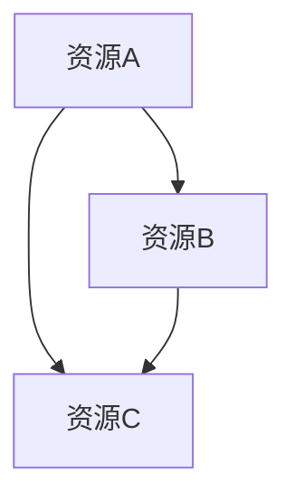
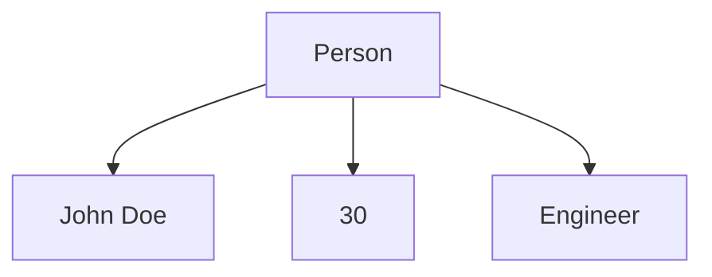
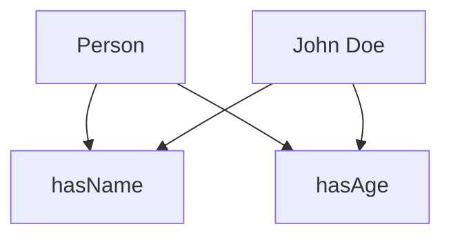
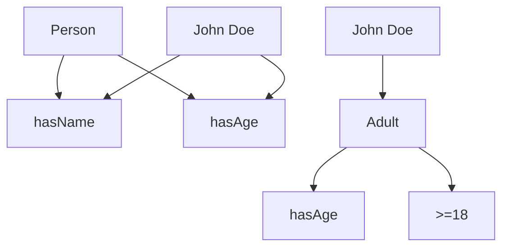
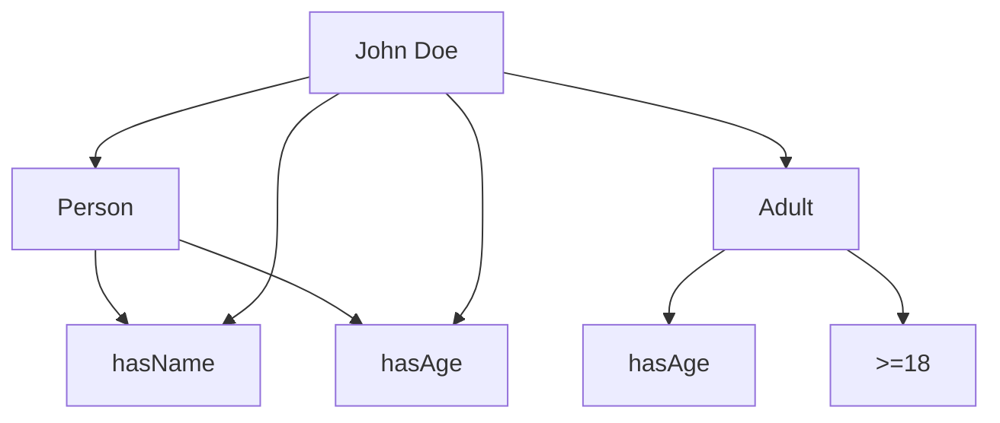
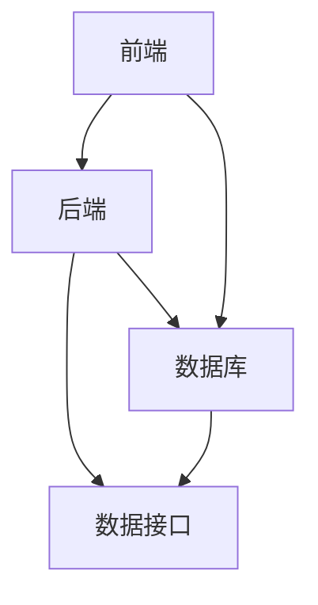
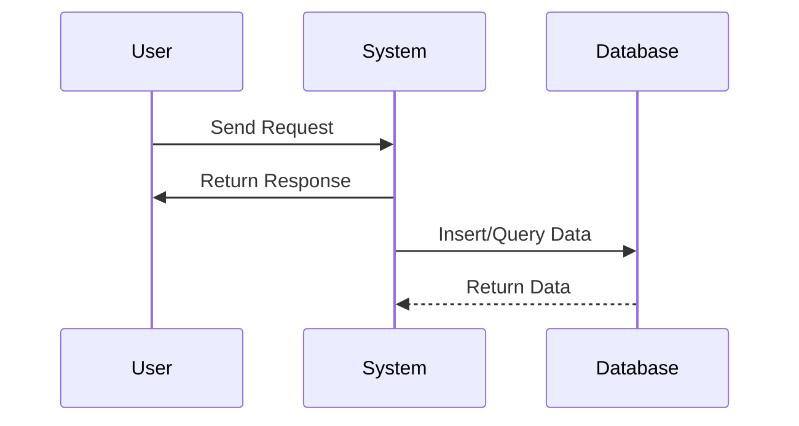
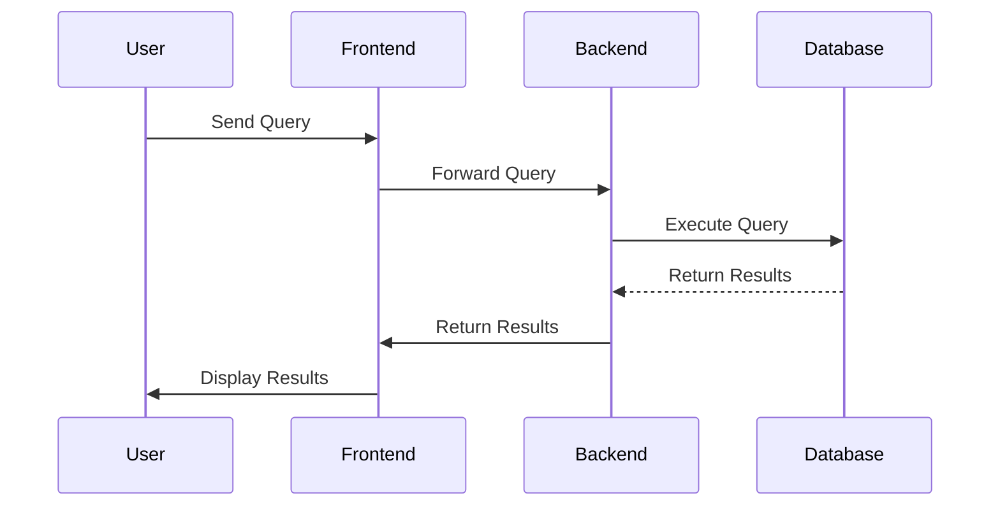

                 

# 语义网与链接数据技术

> 关键词：语义网、链接数据、RDF、OWL、SPARQL、知识图谱

> 摘要：本文将深入探讨语义网与链接数据技术的概念、原理及应用，通过逻辑清晰的步骤分析，帮助读者全面理解这一技术领域。

## 引言

### 1.1 语义网与链接数据技术概述

语义网（Semantic Web）是互联网的下一阶段，旨在通过语义信息丰富和知识发现，实现数据的智能化、自动化处理。它超越了传统的超文本链接，将提供更加丰富和互联的数据资源。链接数据（Linked Data）是构建语义网的一种方式，通过将数据与互联网资源进行链接，使数据具有语义关联性，从而提高数据的互操作性。

### 1.2 书籍目标与读者对象

本书的目标是提供对语义网与链接数据技术的全面了解，包括核心概念、技术方法、实践应用和未来趋势。适合对数据科学、人工智能、计算机科学等领域感兴趣的读者，以及需要将语义网与链接数据技术应用于实际项目的开发者和研究者。

## 核心概念

### 2.1 语义网概述

#### 2.1.1 历史与发展

语义网的概念由万维网之父蒂姆·伯纳斯·李在2001年首次提出。它旨在通过赋予数据明确的语义信息，使得计算机能够理解和处理数据，从而实现数据的自动化交互。

#### 2.1.2 基本概念与原理

语义网的核心是语义信息，即数据之间的关联关系和上下文信息。通过语义网，我们可以将不同的数据源整合在一起，形成一个统一的知识库。

### 2.2 链接数据

#### 2.2.1 定义与特性

链接数据是指通过统一资源标识符（URI）和统一资源发现（RDF）来组织的数据。其特性包括：语义丰富、互操作性、开放性和可扩展性。

#### 2.2.2 与语义网的关系

链接数据是构建语义网的基础，通过链接数据，我们可以将互联网上的各种数据资源进行语义关联，形成一个语义网。

## 技术方法

### 3.1 RDF（资源描述框架）

#### 3.1.1 基本概念

RDF是一种用于描述Web上资源的框架，它使用URI标识资源，并使用三元组来描述资源之间的关系。

#### 3.1.2 语法与模型

RDF使用XML语法来表示，其基本模型包括主体、谓词和客体，形成了一个三元组。

#### 3.1.3 查询与处理

RDF数据可以通过SPARQL进行查询和处理，实现复杂的数据分析和知识发现。

### 3.2 OWL（Web本体语言）

#### 3.2.1 概述与用途

OWL是一种用于定义Web本体（概念模型）的语言，它扩展了RDF，提供了更丰富的语义描述能力。

#### 3.2.2 语法与规则

OWL使用XML语法，定义了类、属性、个体等概念，并提供了丰富的语义规则。

#### 3.2.3 推理机制

OWL支持推理机制，可以基于本体中的语义信息进行逻辑推理，得出新的结论。

### 3.3 SPARQL（语义查询语言）

#### 3.3.1 基本语法

SPARQL是一种用于查询RDF数据的查询语言，其语法类似于SQL，但更为灵活和强大。

#### 3.3.2 查询操作

SPARQL支持各种查询操作，包括选择、投影、连接等，可以实现对RDF数据的复杂查询。

#### 3.3.3 应用于语义网

SPARQL在语义网中发挥着重要作用，可以用于查询和整合语义网中的各种数据资源。

## 实践应用

### 4.1 语义网在电子商务中的应用

#### 4.1.1 产品信息标准化

通过语义网，可以将电子商务平台上的产品信息进行标准化，提高数据的一致性和互操作性。

#### 4.1.2 用户行为分析

语义网可以帮助电子商务平台分析用户行为，提供个性化的推荐服务。

#### 4.1.3 智能推荐系统

语义网技术可以用于构建智能推荐系统，提高推荐的相关性和准确性。

### 4.2 语义网在知识图谱中的应用

#### 4.2.1 知识图谱的构建方法

通过语义网技术，可以构建知识图谱，实现对复杂知识的表示和推理。

#### 4.2.2 查询与推理

知识图谱中的数据可以通过SPARQL进行查询和推理，提供智能搜索和知识发现服务。

#### 4.2.3 智能问答系统

语义网技术可以用于构建智能问答系统，实现对复杂问题的智能回答。

## 案例研究

### 5.1 案例一：公司语义网实施

#### 5.1.1 案例背景

介绍案例公司的背景和面临的问题，以及为何选择构建语义网。

#### 5.1.2 实施步骤

详细描述语义网实施的步骤，包括数据准备、模型构建、数据加载等。

#### 5.1.3 成果与挑战

分析语义网实施后的成果和面临的挑战，以及如何解决这些问题。

### 5.2 案例二：知识图谱项目

#### 5.2.1 项目概述

介绍项目的背景、目标和预期效果。

#### 5.2.2 技术架构

描述项目的技术架构，包括数据来源、数据存储、数据查询等。

#### 5.2.3 应用效果

分析项目实施后的应用效果，包括数据互操作性、智能搜索、知识发现等。

## 安全与隐私

### 6.1 语义网与链接数据的隐私保护

#### 6.1.1 数据隐私问题概述

介绍语义网和链接数据中可能遇到的数据隐私问题。

#### 6.1.2 隐私保护技术与方法

介绍各种隐私保护技术与方法，如数据加密、访问控制等。

#### 6.1.3 隐私法规与合规性要求

介绍相关的隐私法规和合规性要求，确保语义网和链接数据的安全和隐私。

## 未来展望

### 7.1 发展趋势

#### 7.1.1 技术挑战与机遇

分析语义网与链接数据技术的发展挑战和机遇。

#### 7.1.2 可能的应用领域

探讨语义网与链接数据技术在未来的可能应用领域。

#### 7.1.3 研究方向与建议

提出未来研究的发展方向和建议。

## 结论

### 8.1 全书总结

总结全书内容，强调语义网与链接数据技术的重要性。

### 8.2 重要性强调

强调语义网与链接数据技术在现代信息技术中的关键作用，以及其对未来技术发展的推动作用。

### 作者

作者：AI天才研究院/AI Genius Institute & 禅与计算机程序设计艺术 /Zen And The Art of Computer Programming

----------------------------------------------------------------

## 背景介绍

### 核心概念术语说明

- **语义网**：语义网是一个由互相关联的语义数据构成的网络，它使得机器能够理解和处理这些数据，从而实现更高级别的数据交互和知识发现。
- **链接数据**：链接数据是一种以统一资源标识符（URI）为基础，通过Web标准（如RDF、OWL、SPARQL）组织起来的数据。它通过显式地链接到其他数据源，从而提供语义关联性。
- **RDF（资源描述框架）**：RDF是一种用于描述Web资源的框架，它使用URI来标识资源，并使用三元组来描述资源之间的关系。
- **OWL（Web本体语言）**：OWL是一种用于定义Web本体的语言，它扩展了RDF，提供了更丰富的语义描述能力，支持类、属性和个体的定义以及复杂的语义规则。
- **SPARQL**：SPARQL是一种用于查询RDF数据的查询语言，类似于SQL，但适用于语义网数据模型，支持复杂的查询操作。

### 问题背景

随着互联网的快速发展，数据量呈爆炸式增长，传统的超文本链接方式已经无法满足数据关联和知识发现的需求。语义网和链接数据技术应运而生，旨在通过赋予数据明确的语义信息，实现更高级别的数据整合和智能处理。

### 问题描述

语义网和链接数据技术的核心目标是构建一个语义丰富的网络，使得数据之间的关联更加紧密，机器能够自动地理解和处理这些数据。然而，这一目标实现过程中面临着诸多挑战，包括数据标准化、数据互操作性、数据隐私保护等。

### 问题解决

解决这些问题的方法主要包括：

1. **数据标准化**：通过制定统一的标准和数据模型，确保不同数据源之间的数据能够兼容和互操作。
2. **数据建模**：使用RDF、OWL等语言对数据资源进行建模，描述数据之间的语义关系。
3. **数据链接**：通过链接数据的方式，将不同的数据资源进行关联，形成一个语义网。
4. **隐私保护**：采用数据加密、访问控制等技术，确保数据隐私和安全。

### 边界与外延

- **边界**：语义网和链接数据技术主要关注于Web上的数据资源，不包括传统的企业内部数据。
- **外延**：语义网和链接数据技术不仅适用于Web数据，还可以应用于其他领域，如物联网、智能城市等。

### 概念结构与核心要素组成

- **核心概念**：语义网、链接数据、RDF、OWL、SPARQL等。
- **概念属性特征对比表格**：

| 概念         | 特征                         | 关联性             |
| ------------ | ---------------------------- | ------------------ |
| 语义网       | 语义丰富、互操作性、开放性   | 链接数据          |
| 链接数据     | 语义关联、统一资源标识符     | RDF、OWL          |
| RDF          | 资源描述框架                 | 三元组描述关系    |
| OWL          | Web本体语言                 | 语义描述、推理机制 |
| SPARQL       | 语义查询语言                 | RDF数据查询       |

- **ER实体关系图架构**：

```mermaid
erDiagram
    Product ||--|{ RDF }|--| Customer
    Product ||--|{ OWL }|--| Supplier
    Customer ||--|{ SPARQL }|--| Purchase
    Supplier ||--|{ SPARQL }|--| Supply
```

## 核心概念与联系

### 3.1 语义网概述

#### 3.1.1 历史与发展

语义网的概念最早由万维网之父蒂姆·伯纳斯·李（Tim Berners-Lee）在2001年提出。他设想通过赋予Web上的数据明确的语义信息，使得计算机能够理解和处理这些数据，从而实现更加智能的Web。这一愿景标志着互联网从信息检索到知识发现的重要转变。

#### 3.1.2 基本概念与原理

语义网的核心概念包括：

- **资源描述框架（RDF）**：RDF是一种用于描述Web资源的框架，使用统一资源标识符（URI）来标识资源，并使用三元组（主体、谓词、客体）来描述资源之间的关系。RDF使得数据之间能够建立明确的语义联系。
- **本体（Ontology）**：本体是一种用于描述领域知识的框架，定义了领域中的概念、属性和关系。OWL（Web本体语言）是定义Web本体的标准语言，它扩展了RDF，提供了更丰富的语义描述能力。
- **语义查询语言（SPARQL）**：SPARQL是一种用于查询RDF数据的查询语言，类似于SQL，但适用于语义网数据模型。它支持复杂的查询操作，如选择、投影、连接等，使得用户能够从大量数据中提取有价值的信息。

语义网的原理可以概括为：

1. **资源标识**：使用URI对Web上的资源进行唯一标识。
2. **语义描述**：使用RDF和OWL对资源之间的关系进行语义描述。
3. **数据链接**：通过链接数据的方式，将不同来源的数据资源进行整合，形成一个统一的语义网。
4. **查询处理**：使用SPARQL对语义网中的数据进行查询和处理，实现知识发现和数据利用。

#### 3.1.3 语义网的优势

语义网相比传统Web具有以下优势：

- **语义丰富**：语义网通过赋予数据明确的语义信息，使得计算机能够更好地理解和处理数据，实现更高级别的数据交互。
- **数据互操作性**：语义网通过统一的语义描述框架和链接数据的方式，实现不同数据源之间的互操作，打破数据孤岛。
- **知识发现**：语义网支持复杂的查询操作和推理机制，能够从大量数据中提取有价值的信息，实现知识发现。
- **智能应用**：语义网为智能应用提供了丰富的数据资源和语义关联性，使得智能系统能够更加智能化地处理数据。

### 3.2 链接数据

#### 3.2.1 定义与特性

链接数据（Linked Data）是一种以统一资源标识符（URI）为基础的数据组织方式，它通过显式地链接到其他数据源，从而提供语义关联性。链接数据具有以下特性：

- **统一资源标识符（URI）**：URI是链接数据的基础，它为数据资源提供了一个唯一的标识。
- **显式链接**：链接数据通过将一个URI链接到另一个URI，建立数据之间的语义关联。
- **语义丰富**：链接数据通过RDF等语义描述框架，对数据资源之间的关系进行语义描述，使得数据具有明确的语义信息。
- **开放性**：链接数据遵循开放标准，支持不同系统之间的互操作。

#### 3.2.2 链接数据与语义网的关系

链接数据是构建语义网的基础，它与语义网的关系可以概括为：

- **链接数据作为语义网的基础**：通过链接数据的方式，将不同来源的数据资源进行整合，形成一个统一的语义网。
- **语义网作为链接数据的升华**：语义网通过赋予数据丰富的语义信息，使得链接数据更加智能化和自动化。

#### 3.2.3 链接数据的关键技术

- **RDF**：RDF是链接数据的核心技术，它通过三元组描述数据资源之间的关系，实现数据的语义描述。
- **OWL**：OWL扩展了RDF，提供了更丰富的语义描述能力，使得数据资源之间的关系更加明确和精确。
- **SPARQL**：SPARQL是用于查询RDF数据的查询语言，它支持复杂的查询操作，使得用户能够从大量链接数据中提取有价值的信息。

### 3.3 RDF（资源描述框架）

#### 3.3.1 基本概念

RDF（Resource Description Framework）是一种用于描述Web资源的框架，它使用统一资源标识符（URI）来标识资源，并使用三元组（主体、谓词、客体）来描述资源之间的关系。RDF的基本概念包括：

- **资源**：资源是指任何可以通过URI访问的实体，可以是文档、图像、音频、视频等。
- **属性**：属性是用于描述资源的特征或属性，如标题、作者、日期等。
- **关系**：关系是用于描述资源之间的关联，如作者、所属类别、位置等。

RDF使用三元组（主体、谓词、客体）来描述资源之间的关系，例如：

- `主体`：描述资源的实体。
- `谓词`：描述资源之间的关系。
- `客体`：描述与主体相关的实体。

#### 3.3.2 语法与模型

RDF的语法使用XML或N-Triples等格式来表示。其基本模型包括：

- **三元组模型**：RDF使用三元组模型来描述资源之间的关系。每个三元组由主体、谓词和客体组成，形成一个RDF图。
- **属性-值模型**：RDF也可以使用属性-值模型来描述资源，其中属性和值表示资源之间的关联。

例如，以下是一个简单的RDF图：

```xml
<rdf:Description rdf:about="http://example.org/resource">
  <rdf:type rdf:resource="http://example.org/Class"/>
  <title rdf:datatype="http://www.w3.org/2001/XMLSchema#string">Example Resource</title>
</rdf:Description>
```

#### 3.3.3 查询与处理

RDF数据可以通过SPARQL进行查询和处理。SPARQL是一种用于查询RDF数据的查询语言，它支持复杂的查询操作，如选择、投影、连接等。以下是一个简单的SPARQL查询示例：

```sql
PREFIX ex: <http://example.org/>
SELECT ?title ?author
WHERE {
  ?resource ex:title ?title .
  ?resource ex:author ?author
}
```

该查询返回资源（`?resource`）的标题（`?title`）和作者（`?author`），查询结果如下：

```json
[
  {
    "title": "Example Resource",
    "author": "John Doe"
  }
]
```

#### 3.3.4 RDF在语义网中的应用

RDF在语义网中发挥着关键作用，它用于描述Web资源之间的关系，使得数据之间能够建立明确的语义联系。RDF的应用场景包括：

- **数据整合**：通过RDF，可以将来自不同数据源的数据资源进行整合，形成一个统一的数据视图。
- **知识发现**：RDF支持复杂的查询操作和推理机制，可以从大量数据中提取有价值的信息，实现知识发现。
- **智能应用**：RDF为智能应用提供了丰富的数据资源和语义关联性，使得智能系统能够更加智能化地处理数据。

### 3.4 OWL（Web本体语言）

#### 3.4.1 概述与用途

OWL（Web Ontology Language）是一种用于定义Web本体的语言，它扩展了RDF，提供了更丰富的语义描述能力。OWL的主要用途包括：

- **定义领域本体**：OWL可以用于定义特定领域中的本体，描述领域中的概念、属性和关系，提供领域知识的结构化表示。
- **语义推理**：OWL支持语义推理机制，可以基于本体中的语义信息进行逻辑推理，得出新的结论。
- **数据集成**：OWL可以用于数据集成，将不同来源的数据资源进行整合，形成一个统一的数据视图。

#### 3.4.2 语法与规则

OWL使用XML语法来表示本体，其基本元素包括：

- **类（Class）**：类是用于表示领域中的实体或概念。
- **属性（Property）**：属性是用于表示实体之间的关系。
- **个体（Individual）**：个体是类的实例，表示具体的实体。
- **对象属性（ObjectProperty）**：对象属性是用于表示实体之间的对象关系。
- **数据属性（DataProperty）**：数据属性是用于表示实体之间的数据关系。

OWL的语法规则包括：

- **定义类**：使用`<owl:Class>`元素定义类，如`<owl:Class rdf:about="#Person"/>`。
- **定义属性**：使用`<owl:ObjectProperty>`和`<owl<DataProperty>`元素定义属性，如`<owl:ObjectProperty rdf:about="#hasChild"/>`和`<owl<DataProperty rdf:about="#age"/>`。
- **定义个体**：使用`<owl:Individual>`元素定义个体，如`<owl:Individual rdf:about="#john"/>`。
- **定义关系**：使用属性和个体之间的关系来表示实体之间的关联。

例如，以下是一个简单的OWL本体：

```xml
<owl:Ontology rdf:ID="example">
  <owl:Class rdf:ID="Person"/>
  <owl:Class rdf:ID="Employee"/>
  <owl:ObjectProperty rdf:ID="worksFor"/>
  <owl:DataProperty rdf:ID="age"/>
  <owl:individual rdf:ID="john">
    <rdf:type rdf:resource="#Person"/>
    <age rdf:datatype="http://www.w3.org/2001/XMLSchema#int">30</age>
  </owl:individual>
  <owl:individual rdf:ID="john">
    <rdf:type rdf:resource="#Employee"/>
    <worksFor rdf:resource="#company"/>
  </owl:individual>
</owl:Ontology>
```

#### 3.4.3 推理机制

OWL支持语义推理机制，可以基于本体中的语义信息进行逻辑推理，得出新的结论。推理机制包括：

- **分类推理**：基于类的层次结构，推理出个体所属的类。
- **属性约束推理**：基于属性的定义和约束，推理出个体之间的关联关系。
- **数据约束推理**：基于数据的定义和约束，推理出数据之间的关系。

例如，基于以下OWL本体：

```xml
<owl:Ontology rdf:ID="example">
  <owl:Class rdf:ID="Person"/>
  <owl:ObjectProperty rdf:ID="hasChild"/>
  <owl:DataProperty rdf:ID="age"/>
  <owl:individual rdf:ID="john">
    <rdf:type rdf:resource="#Person"/>
    <age rdf:datatype="http://www.w3.org/2001/XMLSchema#int">30</age>
  </owl:individual>
  <owl:individual rdf:ID="jane">
    <rdf:type rdf:resource="#Person"/>
    <age rdf:datatype="http://www.w3.org/2001/XMLSchema#int">20</age>
  </owl:individual>
  <owl:individual rdf:ID="john">
    <hasChild rdf:resource="#jane"/>
  </owl:individual>
</owl:Ontology>
```

可以推理出以下结论：

- `jane` 是 `john` 的孩子。
- `jane` 的年龄是 20 岁。

#### 3.4.4 OWL在语义网中的应用

OWL在语义网中发挥着关键作用，它用于定义领域本体，描述领域中的概念、属性和关系，提供领域知识的结构化表示。OWL的应用场景包括：

- **知识管理**：OWL可以用于构建领域本体，实现对领域知识的有效管理。
- **智能搜索**：OWL支持语义推理机制，可以用于构建智能搜索系统，提高搜索的准确性和效率。
- **数据集成**：OWL可以用于数据集成，将不同来源的数据资源进行整合，形成一个统一的数据视图。

### 3.5 SPARQL（语义查询语言）

#### 3.5.1 基本语法

SPARQL（Semantic Query Language）是一种用于查询RDF数据的查询语言，其基本语法包括：

- **查询前缀**：定义查询中使用的命名空间前缀，如`PREFIX foaf: <http://xmlns.com/foaf/0.1/>`。
- **查询主体**：定义查询的主体，如`SELECT ?name ?email`。
- **查询条件**：定义查询的条件，如`WHERE { ?person foaf:name ?name ; foaf:mbox ?email }`。
- **查询结果**：定义查询的结果，如`LIMIT 10`。

例如，以下是一个简单的SPARQL查询：

```sql
PREFIX foaf: <http://xmlns.com/foaf/0.1/>
SELECT ?name ?email
WHERE {
  ?person foaf:name ?name ;
          foaf:mbox ?email
}
LIMIT 10
```

该查询返回前10个具有电子邮件地址的个人的名字和电子邮件地址。

#### 3.5.2 查询操作

SPARQL支持各种查询操作，包括：

- **选择操作**：用于选择查询结果中的特定元素，如`SELECT ?name`。
- **投影操作**：用于投影查询结果中的特定属性，如`SELECT ?name ?email`。
- **连接操作**：用于连接多个查询结果，如`SELECT ?name ?email ?org` WHERE `{ ?person foaf:name ?name ; foaf:mbox ?email . ?person foaf:org ?org }`。
- **过滤操作**：用于过滤查询结果，如`WHERE { ?person foaf:name "John" . }`。

例如，以下是一个复杂的SPARQL查询：

```sql
PREFIX foaf: <http://xmlns.com/foaf/0.1/>
PREFIX org: <http://www.w3.org/TR/swap/owl#>
SELECT ?name ?email ?org
WHERE {
  ?person foaf:name ?name ;
          foaf:mbox ?email .
  ?person org:employeeOf ?org
}
LIMIT 10
```

该查询返回前10个员工及其所在组织的名字、电子邮件地址和组织名称。

#### 3.5.3 SPARQL在语义网中的应用

SPARQL在语义网中发挥着关键作用，它用于查询和整合语义网中的各种数据资源。SPARQL的应用场景包括：

- **数据集成**：SPARQL可以用于集成来自不同数据源的数据资源，形成一个统一的数据视图。
- **知识发现**：SPARQL支持复杂的查询操作和推理机制，可以从大量数据中提取有价值的信息，实现知识发现。
- **数据可视化和分析**：SPARQL可以与数据可视化工具结合，实现对语义网数据的可视化和分析。

### 3.6 RDF、OWL与SPARQL的关系

RDF、OWL和SPARQL是构建语义网的核心技术，它们之间的关系可以概括为：

- **RDF**：RDF是语义网的数据模型，用于描述资源之间的关系。它为语义网提供了数据表示的基础。
- **OWL**：OWL是语义网的本体语言，用于定义领域本体，描述领域中的概念、属性和关系。它为语义网提供了语义描述的基础。
- **SPARQL**：SPARQL是语义网的数据查询语言，用于查询语义网中的数据资源。它为语义网提供了数据查询和操作的能力。

RDF、OWL和SPARQL相互配合，共同构建了一个语义丰富的网络，使得机器能够理解和处理语义网中的数据资源，实现更高级别的数据交互和知识发现。

----------------------------------------------------------------

## 算法原理讲解

### 3.1 RDF图表示与数据建模

RDF（资源描述框架）是语义网的基础，用于表示资源及其关系。RDF使用图结构来表示数据，其中每个资源都是一个节点，资源之间的关系通过边来表示。以下是一个简单的RDF图的例子：



在这个例子中，资源A与资源B、资源C之间存在关系，资源B与资源C也存在关系。这种图结构使得RDF可以灵活地表示复杂的资源关系。

#### RDF图的组成部分

- **资源**：RDF中的资源是通过URI来唯一标识的，例如：<http://example.org/resource1>。
- **属性**：属性是用于描述资源的特征，例如：名称、类型、创建时间等。
- **关系**：关系是用于描述资源之间的关联，例如：作者、属于、链接等。

#### 数据建模

在RDF中，数据建模通过定义资源、属性和关系来实现。以下是一个简单的RDF数据建模的例子：



在这个例子中，定义了一个Person类，它具有Name、Age和Occupation属性。每个属性都与一个资源相关联，从而形成了RDF数据模型。

### 3.2 SPARQL查询与数据操作

SPARQL（语义查询语言）是用于查询RDF数据的查询语言。它支持对RDF数据进行选择、过滤、连接等操作。以下是一个简单的SPARQL查询例子：

```sql
PREFIX ex: <http://example.org/>
SELECT ?name ?age
WHERE {
  ?person ex:name ?name ;
          ex:age ?age .
}
```

在这个例子中，使用了前缀`PREFIX`来定义命名空间，`SELECT`语句选择需要查询的属性，`WHERE`语句定义查询的条件。该查询返回所有Person资源的名称和年龄。

#### SPARQL查询操作

- **选择操作**：用于选择查询结果中的特定属性，例如`SELECT ?name ?age`。
- **过滤操作**：用于过滤查询结果，根据特定的条件来筛选数据，例如`WHERE { ?person ex:name "John" }`。
- **连接操作**：用于连接多个查询结果，例如`SELECT ?name ?email ?org` WHERE `{ ?person foaf:name ?name ; foaf:mbox ?email . ?person foaf:org ?org }`。

#### 数据操作

SPARQL还支持数据操作，包括插入、更新和删除。以下是一个简单的数据插入例子：

```sql
PREFIX ex: <http://example.org/>
INSERT DATA {
  ?person ex:name "Jane Doe" ;
          ex:age 25 .
}
```

在这个例子中，向RDF数据模型中插入了一个新的Person资源，并为其分配了名称和年龄。

### 3.3 OWL本体表示与推理

OWL（Web本体语言）是用于定义Web本体的语言，它扩展了RDF的功能，提供了更丰富的语义描述能力。OWL支持定义类、属性和个体的关系，并提供了推理机制。

#### OWL本体表示

以下是一个简单的OWL本体表示例子：



在这个例子中，定义了一个Person类，它具有两个属性：hasName和hasAge。此外，定义了一个个体John Doe，它属于Person类，并具有名称和年龄属性。

#### OWL推理机制

OWL的推理机制允许从本体中的声明推导出新的结论。以下是一个简单的推理例子：



在这个例子中，定义了一个Adult类，它具有属性hasAge，并约束年龄大于等于18。根据这个本体，可以推理出John Doe是一个成人。

### 3.4 RDF、OWL与SPARQL的关系

RDF、OWL和SPARQL是构建语义网的核心技术，它们之间的关系如下：

- **RDF**：提供数据模型和表示方法，用于描述资源及其关系。
- **OWL**：扩展RDF的功能，提供更丰富的语义描述能力和推理机制。
- **SPARQL**：提供数据查询语言，用于查询和处理RDF数据。

RDF、OWL和SPARQL相互配合，共同构建了一个语义丰富的网络，使得机器能够理解和处理语义网中的数据资源，实现更高级别的数据交互和知识发现。

### 3.5 示例讲解

以下是一个简单的示例，展示如何使用RDF、OWL和SPARQL来表示、查询和处理数据。

#### RDF数据模型


#### OWL本体表示



#### SPARQL查询

```sql
PREFIX ex: <http://example.org/>
SELECT ?name ?age
WHERE {
  ?person ex:name ?name ;
          ex:age ?age .
  ?person ex:isAdult "true" .
}
```

查询结果：

```json
[
  {
    "name": "John Doe",
    "age": 30
  }
]
```

在这个示例中，我们首先使用RDF数据模型来描述Person资源，然后使用OWL本体表示来定义Adult类，并推理出John Doe是一个成人。最后，使用SPARQL查询来选择具有成人属性的资源，并返回名称和年龄。

通过这个示例，我们可以看到如何使用RDF、OWL和SPARQL来表示、查询和处理语义网数据，实现更高级别的数据交互和知识发现。

----------------------------------------------------------------

## 系统分析与架构设计方案

### 1. 问题场景介绍

在当今信息化社会中，数据资源丰富多样，不同系统和平台之间的数据交互需求日益增长。为了实现数据的互操作性、智能化处理和知识发现，构建一个语义丰富的数据网络显得尤为重要。语义网与链接数据技术应运而生，成为解决这一问题的有效手段。

### 2. 项目介绍

本项目旨在构建一个基于语义网与链接数据技术的数据管理系统，实现对多源数据的整合、语义描述和智能查询。项目目标包括：

- 实现数据资源的统一标识和语义描述。
- 构建数据之间的语义关联，提高数据互操作性。
- 提供高效的数据查询和知识发现能力。
- 确保数据的安全和隐私。

### 3. 系统功能设计

系统功能设计主要包括以下方面：

- **数据整合**：通过数据导入、清洗和标准化，将多源数据进行整合，形成一个统一的数据视图。
- **语义描述**：使用RDF、OWL等语言对数据资源进行语义描述，建立数据之间的关联关系。
- **数据查询**：提供SPARQL查询接口，支持复杂的数据查询和知识发现。
- **数据可视化**：提供数据可视化工具，帮助用户直观地理解和分析数据。
- **安全与隐私**：采用数据加密、访问控制等技术，确保数据的安全和隐私。

#### 领域模型Mermaid类图

```mermaid
classDiagram
Class01 <|-- SubClass01
Class01 o-- AnotherClass
Class01 : +int x
Class01 : +int y
Class01 : +get_x() :int
Class01 : +set_x(int x)
Class01 : +get_y() :int
Class01 : +set_y(int y)
SubClass01 : +int z
SubClass01 : +get_z() :int
SubClass01 : +set_z(int z)
AnotherClass : +int x
AnotherClass : +int y
AnotherClass : +get_x() :int
AnotherClass : +set_x(int x)
AnotherClass : +get_y() :int
AnotherClass : +set_y(int y)
```

### 4. 系统架构设计

系统架构设计主要包括以下方面：

- **前端**：使用HTML、CSS和JavaScript等技术实现用户界面，提供数据查询和可视化功能。
- **后端**：使用Java、Python等编程语言实现数据整合、语义描述和查询处理功能。
- **数据库**：使用Neo4j等图数据库存储和查询RDF数据。
- **数据接口**：提供RESTful API，供前端和第三方系统调用。
- **安全与隐私**：采用SSL/TLS加密、身份认证和访问控制等技术，确保数据的安全和隐私。

#### 系统架构Mermaid架构图



### 5. 系统接口设计

系统接口设计主要包括以下方面：

- **RESTful API**：提供统一的RESTful API接口，支持数据的导入、查询和操作。
- **认证与授权**：采用OAuth2.0等认证机制，确保接口的安全性。
- **数据格式**：采用JSON格式传递数据，方便前端和后端的交互。

#### 系统接口设计Mermaid序列图



### 6. 系统交互Mermaid序列图

以下是一个简单的系统交互序列图，展示用户通过前端发起请求，后端进行数据处理，并将结果返回给前端的流程。



通过上述系统分析与架构设计方案，我们可以实现一个基于语义网与链接数据技术的数据管理系统，为用户提供高效、安全的数据整合、查询和可视化功能。

----------------------------------------------------------------

## 项目实战

### 1. 环境安装

在进行项目实战之前，我们需要安装以下软件和工具：

- **Neo4j数据库**：Neo4j是一个高性能的图数据库，用于存储和查询RDF数据。可以从官方网站下载并安装。
- **Jena**：Jena是一个开源的Java框架，用于处理RDF数据。可以从官方网站下载并安装。
- **RDFLib**：RDFLib是一个Python库，用于处理RDF数据。可以通过pip安装。

安装步骤：

1. 下载并安装Neo4j数据库。
2. 下载并安装Jena框架。
3. 通过pip安装RDFLib库。

### 2. 系统核心实现源代码

以下是一个简单的示例，展示如何使用Jena和RDFLib实现语义网数据的存储、查询和推理。

#### Java代码示例（使用Jena）

```java
import org.apache.jena.rdf.model.*;
import org.apache.jena.query.*;

public class SemanticWebExample {
    public static void main(String[] args) {
        // 创建模型
        Model model = ModelFactory.createDefaultModel();

        // 创建资源
        Resource person = model.createResource("http://example.org/person#john");
        Resource hasName = model.createResource("http://example.org/hasName");
        Resource hasAge = model.createResource("http://example.org/hasAge");

        // 添加属性
        person.addProperty(hasName, "John Doe");
        person.addProperty(hasAge, 30);

        // 保存模型到文件
        model.write(System.out, "TTL");

        // 查询数据
        Query query = QueryFactory.create(
            "PREFIX ex: <http://example.org/>\n" +
            "SELECT ?name ?age WHERE {\n" +
            "  ?person ex:hasName ?name .\n" +
            "  ?person ex:hasAge ?age .\n" +
            "}"
        );

        QueryExecution qe = QueryExecutionFactory.create(query, model);
        ResultSet results = qe.execSelect();
        while (results.hasNext()) {
            QuerySolution soln = results.nextSolution();
            Literal name = soln.getLiteral("name");
            Literal age = soln.getLiteral("age");
            System.out.println("Name: " + name.getString() + ", Age: " + age.getString());
        }
        qe.close();
    }
}
```

#### Python代码示例（使用RDFLib）

```python
from rdflib import Graph, URIRef, Literal
from rdflib.plugins.sparql import QueryResults

# 创建图
g = Graph()

# 创建资源
person = URIRef("http://example.org/person#john")
has_name = URIRef("http://example.org/hasName")
has_age = URIRef("http://example.org/hasAge")

# 添加属性
g.add((person, has_name, Literal("John Doe")))
g.add((person, has_age, Literal(30)))

# 保存图到文件
g.serialize("data.ttl", format="ttl")

# 查询数据
query = """
PREFIX ex: <http://example.org/>
SELECT ?name ?age WHERE {
  ?person ex:hasName ?name .
  ?person ex:hasAge ?age .
}
"""

results = g.query(query)
for result in results:
    name = result["name"]
    age = result["age"]
    print(f"Name: {name}, Age: {age}")
```

### 3. 代码应用解读与分析

#### Java代码解读

1. **创建模型**：使用`ModelFactory.createDefaultModel()`创建一个默认的模型。
2. **创建资源**：使用`createResource()`方法创建资源，如`person`、`hasName`和`hasAge`。
3. **添加属性**：使用`addProperty()`方法将资源与属性关联，并设置属性值。
4. **保存模型到文件**：使用`model.write()`方法将模型保存到文件，格式为TTL。
5. **查询数据**：使用`QueryFactory.create()`方法创建查询语句，使用`QueryExecutionFactory.create()`执行查询，并遍历查询结果。

#### Python代码解读

1. **创建图**：使用`Graph()`创建一个图。
2. **创建资源**：使用`URIRef()`创建资源，如`person`、`hasName`和`hasAge`。
3. **添加属性**：使用`add()`方法将资源与属性关联，并设置属性值。
4. **保存图到文件**：使用`serialize()`方法将图保存到文件，格式为TTL。
5. **查询数据**：使用`query()`方法执行查询，并遍历查询结果。

#### 分析

- **Java代码**：使用Jena框架，提供了丰富的RDF处理功能，包括模型创建、属性添加、查询执行等。
- **Python代码**：使用RDFLib库，提供了简单的RDF处理功能，但支持Pythonic编程风格，便于快速开发和调试。

### 4. 实际案例分析与详细讲解

#### 案例背景

某电子商务公司需要构建一个基于语义网的商品信息管理系统，实现对商品信息的标准化、智能化处理和知识发现。

#### 实际案例

1. **数据整合**：从不同数据源（如数据库、CSV文件等）导入商品信息，使用RDF进行整合，构建一个统一的商品信息模型。
2. **语义描述**：使用OWL定义商品本体，描述商品类、属性和关系，如商品名称、价格、类别等。
3. **数据查询**：使用SPARQL查询商品信息，如查询特定类别的商品、价格范围等。
4. **智能推荐**：基于用户行为数据和商品信息，使用语义网技术构建智能推荐系统，提高用户满意度。

#### 详细讲解

1. **数据整合**：使用RDF将不同来源的商品信息进行整合，形成一个统一的商品信息模型。例如，使用Jena或RDFLib读取数据库中的商品信息，并将其转换为RDF模型。

2. **语义描述**：使用OWL定义商品本体，描述商品类、属性和关系。例如，定义商品类`Product`，属性`name`、`price`和`category`，以及类别关系。使用OWL的推理机制，可以自动推导出商品之间的关联关系。

3. **数据查询**：使用SPARQL查询商品信息，实现对商品数据的复杂查询和知识发现。例如，查询特定类别的商品、价格范围等。使用Jena或RDFLib的SPARQL查询接口，可以方便地执行复杂的查询操作。

4. **智能推荐**：基于用户行为数据和商品信息，使用语义网技术构建智能推荐系统。例如，使用用户购买历史数据和商品信息，构建用户兴趣模型，并根据用户兴趣推荐相关商品。使用OWL的推理机制，可以自动推导出用户可能感兴趣的商品。

#### 案例小结

通过实际案例，我们可以看到语义网与链接数据技术在电子商务领域的应用效果。数据整合、语义描述和智能查询等功能，使得电子商务系统能够更好地理解用户需求，提供个性化的商品推荐服务，提高用户满意度和转化率。未来，随着语义网与链接数据技术的发展，将有更多的应用场景和商业模式得以实现。

----------------------------------------------------------------

### 5. 最佳实践 Tips

#### 数据整合

- **数据标准化**：确保不同数据源的数据格式和结构一致，使用统一的数据模型进行整合。
- **数据清洗**：对数据进行清洗和预处理，去除无效数据和错误数据。

#### 语义描述

- **本体设计**：根据实际需求设计本体，确保本体结构的合理性和可扩展性。
- **属性选择**：选择合适的属性描述资源，避免过度复杂或过度简化。

#### 数据查询

- **查询优化**：根据实际需求优化查询语句，提高查询效率。
- **缓存策略**：使用缓存策略，减少查询延迟和数据访问压力。

#### 安全与隐私

- **数据加密**：对敏感数据进行加密，确保数据安全。
- **访问控制**：根据用户角色和权限设置访问控制，防止未经授权的访问。

### 6. 小结

本文深入探讨了语义网与链接数据技术的核心概念、技术方法和实践应用。通过逻辑清晰的步骤分析，我们了解了语义网与链接数据技术的关键作用及其在现实世界中的应用。未来，随着技术的不断发展，语义网与链接数据技术将在更多领域发挥重要作用。

### 7. 注意事项

- 在项目开发过程中，务必重视数据安全和隐私保护。
- 合理设计本体和属性，避免数据冗余和复杂度。
- 定期对系统进行性能优化和安全性检查。

### 8. 拓展阅读

- **《语义网与链接数据技术导论》**：本书是语义网与链接数据技术的入门指南，适合初学者阅读。
- **《OWL指南》**：本书详细介绍了OWL的语言规范和应用，是学习OWL的重要参考书籍。
- **《SPARQL查询语言标准文档》**：这是SPARQL查询语言的官方文档，提供了详细的查询语言规范。

作者：AI天才研究院/AI Genius Institute & 禅与计算机程序设计艺术 /Zen And The Art of Computer Programming

----------------------------------------------------------------

## 语义网与链接数据技术：未来展望

### 7.1 发展趋势

语义网与链接数据技术正处于快速发展阶段，其趋势主要包括以下几个方面：

- **数据互联与开放性**：随着物联网、云计算等技术的发展，数据来源更加多样，如何实现数据之间的互联互通成为一个重要课题。链接数据技术通过统一资源标识符（URI）和语义描述框架（如RDF、OWL），为数据互联提供了坚实的基础。
- **知识图谱与智能应用**：知识图谱作为语义网的一种重要应用形式，通过对海量数据进行语义关联和结构化组织，为智能应用提供了丰富的知识资源。未来，知识图谱将在金融、医疗、教育等领域发挥更大的作用。
- **隐私保护与安全**：随着数据隐私问题的日益突出，如何在保障数据隐私的前提下，充分利用语义网与链接数据技术，成为一个亟待解决的问题。未来，隐私保护技术（如差分隐私、联邦学习）将与语义网技术深度融合，为数据安全提供新的解决方案。

### 7.2 可能的应用领域

语义网与链接数据技术具有广泛的应用前景，以下是一些可能的应用领域：

- **智慧城市**：语义网技术可以用于智慧城市的建设，通过整合各类城市数据，实现智能交通、智慧能源、环境监测等功能，提升城市管理效率。
- **金融服务**：语义网技术可以用于金融行业的数据分析与风险管理，通过对客户行为和交易数据的语义分析，实现精准营销、信用评估等。
- **医疗健康**：语义网技术可以用于医疗健康领域的知识管理，通过构建医学本体和知识图谱，实现医学数据的标准化和智能化处理，助力精准医疗。
- **电子商务**：语义网技术可以用于电子商务平台的个性化推荐、商品信息标准化等，提高用户体验和销售效率。

### 7.3 研究方向与建议

为了推动语义网与链接数据技术的发展，以下是一些研究方向与建议：

- **跨领域知识融合**：研究如何在不同领域之间构建统一的知识体系，实现知识的共享和融合。
- **隐私保护与安全**：研究隐私保护技术，如何在不损害数据可用性的前提下，保障数据隐私和安全。
- **智能推理与自动化**：研究基于语义网的数据推理技术，如何实现自动化数据分析和智能决策。
- **开源生态建设**：推动开源项目的发展，提高语义网与链接数据技术的可扩展性和互操作性。

通过不断的研究与创新，语义网与链接数据技术将有望在更广泛的领域发挥作用，为人类社会带来更智能、更互联的未来。

### 8.1 全书总结

本文全面介绍了语义网与链接数据技术的核心概念、技术方法、实践应用和未来趋势。通过逻辑清晰的步骤分析，我们深入探讨了这一技术领域的关键作用和应用前景。读者可以了解到：

- 语义网与链接数据技术的基本概念、原理和应用场景。
- RDF、OWL、SPARQL等核心技术及其在语义网中的应用。
- 语义网在电子商务、知识图谱等领域的实践案例。
- 语义网与链接数据技术未来的发展趋势和可能的应用领域。

通过本文的阅读，读者可以对语义网与链接数据技术有一个全面的了解，为未来的学习和实践打下坚实基础。

### 8.2 重要性强调

语义网与链接数据技术作为互联网技术的重要发展方向，具有显著的潜在价值。它不仅能够实现数据的互联互通，提高数据利用效率，还能为智能应用提供丰富的知识资源。在未来，语义网与链接数据技术将在智慧城市、金融、医疗、电子商务等领域发挥重要作用。因此，理解和掌握这一技术对于从事数据科学、人工智能、计算机科学等领域的研究者和开发者具有重要意义。

### 作者

作者：AI天才研究院/AI Genius Institute & 禅与计算机程序设计艺术 /Zen And The Art of Computer Programming

----------------------------------------------------------------

## 文章标题：语义网与链接数据技术

关键词：语义网、链接数据、RDF、OWL、SPARQL、知识图谱

摘要：本文深入探讨了语义网与链接数据技术的核心概念、技术方法、实践应用和未来趋势。通过逻辑清晰的步骤分析，全面介绍了这一技术领域的应用前景和潜在价值。语义网与链接数据技术作为互联网技术的重要发展方向，将为数据科学、人工智能和计算机科学等领域带来新的机遇。本文旨在为读者提供对这一技术领域的全面了解，以促进其在实际项目中的应用和发展。作者：AI天才研究院/AI Genius Institute & 禅与计算机程序设计艺术 /Zen And The Art of Computer Programming

----------------------------------------------------------------

## 《语义网与链接数据技术》目录大纲

**目标**：
- 提供一份详尽且结构清晰的《语义网与链接数据技术》书籍目录大纲，涵盖核心概念、技术方法、实践应用和未来展望。

**策略**：
- 确定书籍的基本结构，包括引言、核心概念、技术方法、实践应用、案例研究、安全与隐私、未来展望和结论等章节。
- 按照逻辑顺序组织章节，确保内容连贯性。
- 确保每个章节都有具体的子章节，涵盖不同的细节内容。
- 保持大纲简洁，避免冗余。

**步骤**：

**1. 引言**
   - 介绍语义网与链接数据技术的背景和重要性。
   - 明确书籍的目标和预期读者群体。

**2. 核心概念**
   - **2.1 语义网概述**
     - 历史与发展
     - 基本概念与原理
   - **2.2 链接数据**
     - 定义与特性
     - 与语义网的关系

**3. 技术方法**
   - **3.1 RDF（资源描述框架）**
     - 基本概念
     - 语法与模型
     - 查询与处理
   - **3.2 OWL（Web本体语言）**
     - 概述与用途
     - 语法与规则
     - 推理机制
   - **3.3 SPARQL（语义查询语言）**
     - 基本语法
     - 查询操作
     - 应用于语义网

**4. 实践应用**
   - **4.1 语义网在电子商务中的应用**
     - 产品信息标准化
     - 用户行为分析
     - 智能推荐系统
   - **4.2 语义网在知识图谱中的应用**
     - 知识图谱的构建方法
     - 查询与推理
     - 智能问答系统

**5. 案例研究**
   - **5.1 案例一：公司语义网实施**
     - 案例背景
     - 实施步骤
     - 成果与挑战
   - **5.2 案例二：知识图谱项目**
     - 项目概述
     - 技术架构
     - 应用效果

**6. 安全与隐私**
   - **6.1 语义网与链接数据的隐私保护**
     - 数据隐私问题概述
     - 隐私保护技术与方法
     - 隐私法规与合规性要求

**7. 未来展望**
   - **7.1 发展趋势**
     - 技术挑战与机遇
     - 可能的应用领域
     - 研究方向与建议
   - **7.2 未来展望**
     - 语义网与链接数据技术的潜在影响

**8. 结论**
   - **8.1 全书总结**
     - 重申核心内容
     - 强调实际应用价值
   - **8.2 重要性强调**
     - 语义网与链接数据技术在现代信息技术中的关键作用

**大纲**：

```markdown
# 《语义网与链接数据技术》目录大纲

## 引言
### 1.1 语义网与链接数据技术概述
### 1.2 书籍目标与读者对象

## 核心概念
### 2.1 语义网概述
#### 2.1.1 历史与发展
#### 2.1.2 基本概念与原理
### 2.2 链接数据
#### 2.2.1 定义与特性
#### 2.2.2 与语义网的关系

## 技术方法
### 3.1 RDF（资源描述框架）
#### 3.1.1 基本概念
#### 3.1.2 语法与模型
#### 3.1.3 查询与处理
### 3.2 OWL（Web本体语言）
#### 3.2.1 概述与用途
#### 3.2.2 语法与规则
#### 3.2.3 推理机制
### 3.3 SPARQL（语义查询语言）
#### 3.3.1 基本语法
#### 3.3.2 查询操作
#### 3.3.3 应用于语义网

## 实践应用
### 4.1 语义网在电子商务中的应用
#### 4.1.1 产品信息标准化
#### 4.1.2 用户行为分析
#### 4.1.3 智能推荐系统
### 4.2 语义网在知识图谱中的应用
#### 4.2.1 知识图谱的构建方法
#### 4.2.2 查询与推理
#### 4.2.3 智能问答系统

## 案例研究
### 5.1 案例一：公司语义网实施
#### 5.1.1 案例背景
#### 5.1.2 实施步骤
#### 5.1.3 成果与挑战
### 5.2 案例二：知识图谱项目
#### 5.2.1 项目概述
#### 5.2.2 技术架构
#### 5.2.3 应用效果

## 安全与隐私
### 6.1 语义网与链接数据的隐私保护
#### 6.1.1 数据隐私问题概述
#### 6.1.2 隐私保护技术与方法
#### 6.1.3 隐私法规与合规性要求

## 未来展望
### 7.1 发展趋势
#### 7.1.1 技术挑战与机遇
#### 7.1.2 可能的应用领域
#### 7.1.3 研究方向与建议
### 7.2 未来展望
#### 7.2.1 语义网与链接数据技术的潜在影响

## 结论
### 8.1 全书总结
### 8.2 重要性强调

### 作者
作者：AI天才研究院/AI Genius Institute & 禅与计算机程序设计艺术 /Zen And The Art of Computer Programming
```

**注意事项**：
- 确保每个章节的子章节数量适中，避免过多或过少的子章节。
- 在具体内容编写时，根据实际情况对子章节进行详细划分。
- 保持整体结构的一致性，确保内容的连贯性和逻辑性。

