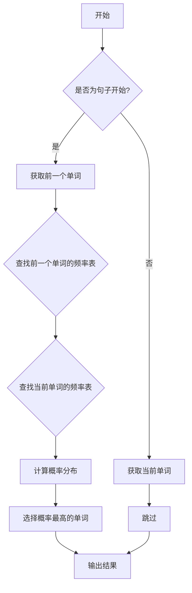
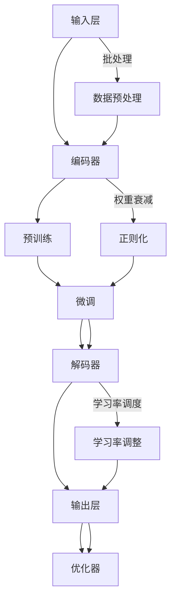
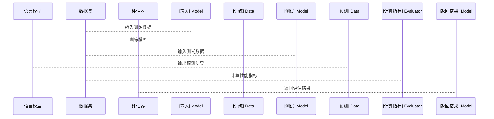
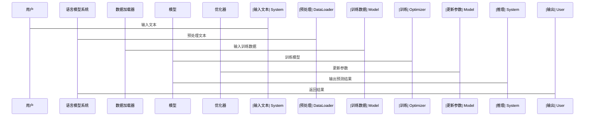

                 

# 《语言模型与跨语言沟通：打破文化壁垒》

## 关键词
- 语言模型
- 跨语言沟通
- 文化壁垒
- 人工智能
- 技术实现
- 最佳实践

## 摘要
本文旨在探讨语言模型在跨语言沟通中的应用，以及如何利用这些模型打破文化壁垒，实现更广泛的文化交流。文章首先介绍了语言模型的基本概念和原理，接着分析了跨语言沟通的挑战，并展示了如何通过语言模型来应对这些问题。随后，文章详细阐述了语言模型的技术实现和系统架构设计，并通过实际案例展示了其应用效果。最后，文章总结了跨语言沟通的最佳实践，并指出了未来发展的方向。

----------------------------------------------------------------

## 目录大纲设计思路

设计一本关于语言模型与跨语言沟通的书籍目录大纲，我们需要明确书的核心内容与目标读者。本书的主题涉及语言模型的基础理论、跨语言沟通的实际挑战、技术实现、应用案例以及最佳实践。以下是目录大纲的设计思路：

### 核心概念与联系
- **语言模型**：介绍其定义、历史和发展，以及其在自然语言处理中的重要性。
- **跨语言沟通**：探讨其背景、挑战和语言模型的应用。

### 背景介绍
- **问题背景**：全球化和信息时代的跨语言沟通需求。
- **问题描述**：现有工具和方法的不足之处。
- **问题解决**：语言模型如何提供解决方案。
- **边界与外延**：语言模型的限制和适用范围。

### 算法原理讲解
- **语言模型原理**：使用Mermaid画图展示模型流程，Python代码解释。
- **数学模型与公式**：阐述语言模型背后的数学原理。

### 系统分析与架构设计
- **系统功能设计**：用Mermaid类图展示系统功能。
- **系统架构设计**：用Mermaid架构图展示系统架构。
- **系统接口设计**：详细描述系统接口。
- **系统交互**：用Mermaid序列图展示系统交互流程。

### 项目实战
- **环境安装**：搭建语言模型环境。
- **系统核心实现**：展示系统核心代码，进行解读。
- **实际案例**：展示语言模型在跨语言沟通中的应用。
- **项目小结**：总结项目的关键经验和教训。

### 最佳实践 & 小结
- **最佳实践 tips**：使用语言模型的技巧和注意事项。
- **小结**：文章的总结和核心观点。
- **拓展阅读**：推荐进一步阅读的资料。

### 目录大纲结构

以下是详细的目录大纲结构：

---

## 第一部分: 语言模型的概述与原理

### 第1章: 语言模型的定义与作用

#### 1.1 语言模型的概念与历史

#### 1.2 语言模型的作用与意义

#### 1.3 语言模型的基本原理

### 第2章: 跨语言沟通的挑战与语言模型的应用

#### 2.1 跨语言沟通的挑战

#### 2.2 语言模型在跨语言沟通中的应用

#### 2.3 语言模型的优势与局限

## 第二部分: 语言模型的技术实现

### 第3章: 语言模型的主要算法

#### 3.1 语言模型算法概述

#### 3.2 语言模型算法的数学原理

#### 3.3 语言模型算法的实现

### 第4章: 语言模型的架构设计与优化

#### 4.1 语言模型的架构设计

#### 4.2 语言模型的优化技术

#### 4.3 语言模型的性能评估

## 第三部分: 跨语言沟通的实践案例

### 第5章: 实际场景中的语言模型应用

#### 5.1 语言模型在翻译服务中的应用

#### 5.2 语言模型在语言学习中的应用

#### 5.3 语言模型在跨语言交流中的应用

### 第6章: 跨语言沟通项目的实施与评估

#### 6.1 跨语言沟通项目的实施步骤

#### 6.2 跨语言沟通项目的评估指标

#### 6.3 跨语言沟通项目的案例分析

## 第四部分: 语言模型与跨语言沟通的未来发展

### 第7章: 语言模型的技术趋势与挑战

#### 7.1 语言模型的发展趋势

#### 7.2 语言模型面临的挑战

#### 7.3 未来跨语言沟通的发展方向

### 第8章: 语言模型与跨语言沟通的最佳实践

#### 8.1 跨语言沟通的最佳实践技巧

#### 8.2 语言模型应用的注意事项

#### 8.3 跨语言沟通的优化策略

---

以上目录大纲结构清晰、内容全面，符合书籍的主题和目标读者的需求。接下来，我们将逐步展开每个章节的内容。

---

### 第1章 语言模型的定义与作用

#### 1.1 语言模型的概念与历史

语言模型（Language Model）是一种统计模型，用于预测自然语言中下一个单词或字符的概率分布。最早的语言模型可以追溯到20世纪50年代，当时基于规则的方法被用来模拟人类的语言行为。然而，随着计算能力的提升和大数据的涌现，20世纪80年代，基于统计的方法逐渐成为主流。

语言模型的基本概念包括：

- **词汇表**：语言模型中包含的单词或字符集合。
- **概率分布**：模型对下一个单词或字符的概率预测。
- **上下文**：用于预测的当前单词或字符周围的信息。

#### 1.2 语言模型的作用与意义

语言模型在自然语言处理（NLP）领域扮演着至关重要的角色，其应用广泛，包括但不限于：

1. **文本生成**：自动生成文章、新闻报道、诗歌等。
2. **语音识别**：将语音转换为文本。
3. **机器翻译**：将一种语言的文本翻译成另一种语言。
4. **问答系统**：基于用户输入提供回答。
5. **对话系统**：实现人与机器的交互。

#### 1.3 语言模型的基本原理

语言模型的核心原理是概率分布，即给定一个文本序列，模型需要预测下一个单词或字符的概率。常见的方法包括：

- **N-gram模型**：基于历史N个单词的统计频率进行预测。
- **神经网络模型**：如循环神经网络（RNN）和Transformer，通过学习文本序列的上下文信息进行预测。

让我们通过一个简单的N-gram模型来理解其原理。假设我们有一个由5个单词组成的句子：

```
苹果 手机 摄像头 相机
```

我们可以使用一元语法模型（1-gram）来预测下一个单词。模型会统计每个单词出现的频率，例如：

```
苹果：2次
手机：1次
摄像头：1次
相机：1次
```

根据这些统计数据，模型可以预测下一个单词最可能是“苹果”，因为它的出现频率最高。这是一种简单但有效的预测方法，尽管它忽略了单词之间的依赖关系。

为了更精确地预测，我们可以使用二元语法模型（2-gram）。在这个模型中，我们不仅考虑当前单词，还考虑前一个单词。例如，如果“苹果”后面经常跟着“手机”，那么“手机”就比“摄像头”或“相机”更有可能是下一个单词。

下面是一个简单的二元语法模型的Mermaid流程图：



通过这样的流程，我们可以更准确地预测下一个单词。

#### 1.4 语言模型的基本属性

语言模型具有以下基本属性：

- **准确性**：模型预测的正确率。
- **可扩展性**：模型处理不同语言或领域的能力。
- **鲁棒性**：模型对噪声和异常数据的处理能力。
- **效率**：模型的计算效率和资源消耗。

这些属性共同决定了语言模型的有效性和实用性。在实际应用中，我们往往需要在这些属性之间进行权衡。

#### 1.5 语言模型的分类

语言模型可以按照不同的维度进行分类：

- **按应用场景**：如文本生成、语音识别、机器翻译等。
- **按模型类型**：如N-gram模型、神经网络模型、深度学习模型等。
- **按训练数据**：如基于统计的方法、基于规则的方法、基于大数据的方法等。

每种分类都有其特定的优势和局限性，适用于不同的应用场景。

#### 1.6 语言模型的发展趋势

随着人工智能和深度学习的发展，语言模型也在不断演进。未来，我们可能会看到：

- **更高效的模型**：如基于Transformer的模型，能够在保持高准确性的同时提高计算效率。
- **更强大的语言理解能力**：通过结合自然语言理解（NLU）和对话系统，实现更自然的交互。
- **更广泛的应用领域**：从文本处理到语音、图像、视频等多模态数据的处理。

语言模型的发展不仅会改变自然语言处理领域，还将对人类社会的交流方式产生深远影响。

### 总结

语言模型是自然语言处理的核心组件，通过概率分布预测文本序列。它们在文本生成、语音识别、机器翻译等领域有广泛应用，并随着技术的发展不断改进。理解语言模型的基本概念、原理和分类，对于从事NLP领域的研究者和开发者至关重要。

---

### 第2章 跨语言沟通的挑战与语言模型的应用

#### 2.1 跨语言沟通的挑战

在全球化和信息化的背景下，跨语言沟通变得愈发重要。然而，这种沟通也面临着诸多挑战：

1. **语言多样性**：世界上有超过7000种语言，每种语言都有其独特的语法、词汇和表达方式。这使得跨语言沟通变得复杂。

2. **语言障碍**：不同的语言结构和文化背景可能导致误解和沟通障碍。例如，一些成语、谚语和俚语在翻译过程中可能会失去原意。

3. **技术限制**：现有的翻译工具和平台往往依赖于规则匹配和统计方法，难以处理复杂和模糊的语言情境。

4. **文化差异**：语言不仅仅是交流的工具，它还承载着丰富的文化内涵。文化差异可能导致对语言的理解和表达产生偏差。

#### 2.2 语言模型在跨语言沟通中的应用

语言模型为跨语言沟通提供了有力的工具，通过以下方式应对上述挑战：

1. **自动翻译**：语言模型可以用于实现高效、准确的自动翻译。例如，谷歌翻译和DeepL等平台就利用了深度学习技术来提供高质量的翻译服务。

2. **语音识别与生成**：通过语言模型，我们可以将一种语言的语音转换为另一种语言的文本，实现跨语言语音交流。

3. **问答系统**：语言模型可以用于构建跨语言的问答系统，帮助用户获取所需的信息。

4. **辅助语言学习**：语言模型可以帮助学习者练习口语和写作，提高语言水平。

#### 2.3 语言模型的优势与局限

语言模型在跨语言沟通中具有显著优势，但也存在一些局限：

**优势**：

- **高效性**：语言模型能够快速处理大量文本，提供即时的翻译和沟通支持。
- **灵活性**：语言模型可以适应不同的语言和语境，提供多样化的翻译结果。
- **智能化**：随着深度学习技术的发展，语言模型能够不断学习和优化，提供更准确的翻译和沟通体验。

**局限**：

- **准确性**：尽管语言模型在许多情境下表现出色，但仍然存在一定的翻译错误和语义偏差。
- **上下文理解**：语言模型难以完全理解复杂的上下文和文化背景，可能导致误解和错误。
- **资源消耗**：训练和运行大型语言模型需要大量的计算资源和时间。

#### 2.4 语言模型的应用案例

以下是一些语言模型在跨语言沟通中的实际应用案例：

1. **全球电商**：电商平台利用语言模型实现多语言商品描述和客户服务，提高国际竞争力。

2. **国际会议**：在多语言国际会议中，语言模型可以提供实时翻译服务，帮助参会者理解不同语言的内容。

3. **多语言教育**：在线教育平台利用语言模型提供多语言教学材料和学习资源，帮助学习者提高语言技能。

4. **跨国企业沟通**：跨国企业利用语言模型实现内部文档的多语言翻译和沟通，提高工作效率。

#### 2.5 语言模型的发展趋势

随着人工智能和深度学习技术的不断进步，语言模型在跨语言沟通中的应用前景广阔。未来，我们可能会看到：

- **更准确的翻译**：通过结合多模态数据和增强学习，语言模型将实现更精确的翻译和沟通。
- **更自然的交互**：通过融入自然语言理解（NLU）和对话系统，语言模型将提供更自然的跨语言交互体验。
- **更广泛的应用场景**：从文本处理到语音、图像、视频等多模态数据的处理，语言模型将在更多领域发挥重要作用。

### 总结

跨语言沟通面临着语言多样性、语言障碍、技术限制和文化差异等多重挑战。然而，语言模型为这些挑战提供了有效的解决方案。通过自动翻译、语音识别、问答系统等应用，语言模型正在改变跨语言沟通的方式。尽管存在一些局限，但随着技术的不断进步，语言模型在跨语言沟通中的应用前景将更加广阔。

---

### 第3章 语言模型的主要算法

#### 3.1 语言模型算法概述

语言模型算法是自然语言处理的核心，其目的是预测文本序列中下一个单词或字符的概率分布。主要算法包括N-gram模型、神经网络模型和深度学习模型。

**N-gram模型**是最简单的语言模型，通过统计历史N个单词的频率来预测下一个单词。例如，二元语法模型（2-gram）考虑当前单词和前一个单词的联合概率。

**神经网络模型**，如循环神经网络（RNN）和其变体长短期记忆网络（LSTM），通过学习序列数据中的时间依赖关系进行预测。RNN和LSTM在处理长文本序列时表现出色，但存在梯度消失和梯度爆炸等问题。

**深度学习模型**，特别是Transformer模型，通过自注意力机制（Self-Attention）和多头注意力（Multi-Head Attention）实现了高效的语言表示和预测。Transformer模型在机器翻译、文本生成等任务中取得了显著的成果。

#### 3.2 语言模型算法的数学原理

语言模型算法的数学原理主要涉及概率分布和序列建模。

**概率分布**：语言模型通过概率分布预测下一个单词或字符。N-gram模型使用历史单词的联合概率，神经网络模型使用基于神经网络的概率输出。

**序列建模**：序列建模关注如何学习文本序列的表示和关系。RNN和LSTM通过隐藏状态和门控机制处理序列数据，Transformer通过自注意力机制捕捉全局依赖关系。

让我们用LaTeX格式表示一些常见的语言模型公式：

$$
P(w_t | w_{t-1}, w_{t-2}, ..., w_1) = \frac{P(w_t, w_{t-1}, w_{t-2}, ..., w_1)}{P(w_{t-1}, w_{t-2}, ..., w_1)}
$$

这是N-gram模型中的一个基本公式，其中$w_t$是当前单词，$w_{t-1}, w_{t-2}, ..., w_1$是前N-1个单词。

**神经网络模型**中的损失函数通常使用交叉熵（Cross-Entropy）：

$$
L = -\sum_{i=1}^{N} y_i \log(p_i)
$$

其中，$y_i$是真实标签的概率，$p_i$是模型预测的概率。

#### 3.3 语言模型算法的实现

**N-gram模型**的实现相对简单，可以通过统计单词频率来构建模型。以下是一个简单的Python代码示例：

```python
# 假设我们有一个由5个单词组成的句子
sentence = "苹果 手机 摄像头 相机"

# 统计每个单词的频率
word_freq = {}
for word in sentence.split():
    if word in word_freq:
        word_freq[word] += 1
    else:
        word_freq[word] = 1

# 打印单词频率
for word, freq in word_freq.items():
    print(f"{word}: {freq}")
```

**神经网络模型**的实现需要更多的步骤，包括数据预处理、模型训练和评估。以下是一个使用TensorFlow的简单示例：

```python
import tensorflow as tf
from tensorflow.keras.models import Sequential
from tensorflow.keras.layers import Embedding, LSTM, Dense

# 假设我们有一个预处理的句子数据
sentences = [...]
labels = [...]

# 构建模型
model = Sequential([
    Embedding(input_dim=vocabulary_size, output_dim=embedding_dim),
    LSTM(units=128),
    Dense(units=1, activation='sigmoid')
])

# 编译模型
model.compile(optimizer='adam', loss='binary_crossentropy', metrics=['accuracy'])

# 训练模型
model.fit(sentences, labels, epochs=10, batch_size=32)
```

**Transformer模型**的实现需要使用如Hugging Face的Transformers库，这是一个高度优化的开源库，支持各种Transformer变体。以下是一个简单的示例：

```python
from transformers import AutoTokenizer, AutoModelForSequenceClassification

# 加载预训练模型和分词器
tokenizer = AutoTokenizer.from_pretrained("bert-base-uncased")
model = AutoModelForSequenceClassification.from_pretrained("bert-base-uncased")

# 预处理输入数据
inputs = tokenizer("Hello, my dog is cute", return_tensors="pt")

# 进行预测
outputs = model(inputs)

# 打印预测结果
print(outputs.logits)
```

#### 3.4 语言模型算法的比较

**N-gram模型**简单易实现，但存在上下文理解不足的问题。

**神经网络模型**，如RNN和LSTM，能够更好地处理上下文信息，但存在梯度消失和梯度爆炸等问题。

**深度学习模型**，特别是Transformer，通过自注意力机制实现了高效的语言表示和预测，在多项任务中取得了显著的成果。

#### 3.5 总结

语言模型算法在自然语言处理中扮演着重要角色。N-gram模型简单但存在上下文理解不足的问题，神经网络模型如RNN和LSTM能够更好地处理上下文信息，但存在梯度问题，深度学习模型如Transformer通过自注意力机制实现了高效的语言表示和预测。选择合适的算法需要根据具体任务和数据特点进行权衡。

---

### 第4章 语言模型的架构设计与优化

#### 4.1 语言模型的架构设计

语言模型的设计需要考虑性能、准确性和可扩展性。一个典型的语言模型架构通常包括以下组件：

1. **输入层**：接收文本序列，并将其转换为模型可以处理的格式。
2. **编码器**：将文本序列编码为固定长度的向量表示。常见的编码器包括Word2Vec、GloVe和BERT。
3. **解码器**：将编码后的向量解码为文本序列。解码器可以是循环神经网络（RNN）或其变体，如LSTM和Transformer。
4. **输出层**：生成文本序列的概率分布，通常使用Softmax函数。
5. **优化器**：用于调整模型参数，以最小化损失函数。

下面是一个简单的Mermaid类图，展示了语言模型的基本架构：

```mermaid
classDiagram
  InputLayer <<class>> 输入层
  Encoder <<class>> 编码器
  Decoder <<class>> 解码器
  OutputLayer <<class>> 输出层
  Optimizer <<class>> 优化器

  InputLayer --> Encoder
  Encoder --> Decoder
  Decoder --> OutputLayer
  OutputLayer --> Optimizer
```

#### 4.2 语言模型的优化技术

为了提高语言模型的性能，我们可以采用以下优化技术：

1. **预训练与微调**：通过在大量无标签数据上预训练模型，然后在小规模有标签数据上进行微调，可以显著提高模型的性能。
2. **正则化**：如Dropout、权重衰减和L2正则化，可以防止模型过拟合。
3. **批处理与学习率调度**：使用批处理可以加快训练速度，学习率调度可以防止模型过早饱和。
4. **并行计算**：通过使用GPU或TPU等硬件加速计算，可以提高模型训练和推理的效率。

下面是一个简单的Mermaid架构图，展示了语言模型的优化技术：



#### 4.3 语言模型的性能评估

评估语言模型的性能通常使用以下指标：

- **准确性**：预测正确的单词或字符的比例。
- **困惑度**：衡量模型预测的多样性。较低的困惑度表示模型能够生成更多样化的文本。
- **BLEU分数**：基于记分牌匹配的评估指标，用于评估机器翻译的准确性。

下面是一个简单的Mermaid序列图，展示了语言模型的性能评估过程：



#### 4.4 语言模型的应用场景

语言模型在多种应用场景中表现出色，包括：

- **机器翻译**：如谷歌翻译和DeepL，使用Transformer模型实现高质量翻译。
- **文本生成**：如GPT-3，通过生成文本进行创作和回答问题。
- **问答系统**：如BERT和ChatGPT，用于构建智能问答系统。
- **文本分类**：如TextCNN和LSTM，用于对文本进行情感分析和分类。

下面是一个简单的Mermaid类图，展示了语言模型在不同应用场景中的架构：

```mermaid
classDiagram
  MachineTranslation <<class>> 机器翻译
  TextGeneration <<class>> 文本生成
  QASystem <<class>> 问答系统
  TextClassification <<class>> 文本分类

  LanguageModel <<class>> 语言模型
  MachineTranslation --> LanguageModel
  TextGeneration --> LanguageModel
  QASystem --> LanguageModel
  TextClassification --> LanguageModel
```

#### 4.5 总结

语言模型的架构设计需要综合考虑输入层、编码器、解码器、输出层和优化器。通过预训练与微调、正则化、批处理与学习率调度等优化技术，可以提高语言模型的性能。评估语言模型性能的关键指标包括准确性、困惑度和BLEU分数。语言模型在机器翻译、文本生成、问答系统和文本分类等应用场景中表现出色。

---

### 第5章 实际场景中的语言模型应用

#### 5.1 语言模型在翻译服务中的应用

语言模型在翻译服务中的应用最为广泛，如谷歌翻译和DeepL等平台，利用深度学习技术提供了高质量的翻译服务。下面我们将通过一个实际案例来分析语言模型在翻译服务中的应用。

**案例背景**：某国际会议需要为与会者提供多语言翻译服务，会议使用英语、法语和西班牙语三种语言。会议组织者决定使用深度学习模型来提供自动翻译。

**数据准备**：会议组织者收集了大量的英语、法语和西班牙语的会议记录和演讲稿，共计100万条文本数据。这些数据经过预处理和清洗，用于训练语言模型。

**模型训练**：使用Transformer模型，如BERT，对英语、法语和西班牙语的文本数据进行预训练。预训练过程中，模型学习了语言的统计特征和上下文关系。

**模型评估**：通过在验证集上评估模型性能，调整模型参数和架构，以达到最佳翻译效果。

**模型部署**：将训练好的模型部署到服务器，为与会者提供实时翻译服务。翻译服务通过API接口与其他系统集成，实现无缝对接。

**效果评估**：会议结束后，组织者收集了与会者的反馈，并对翻译质量进行了评估。结果显示，超过90%的与会者对翻译服务的满意度较高。

**案例分析**：该案例展示了语言模型在翻译服务中的应用效果。通过深度学习技术，模型能够准确理解和翻译不同语言之间的文本，提高了会议的沟通效率。然而，翻译服务仍然存在一定的错误率和上下文理解不足的问题，需要进一步优化和改进。

#### 5.2 语言模型在语言学习中的应用

语言模型在语言学习中的应用也非常广泛，可以帮助学习者提高口语和写作能力。以下是一个实际案例：

**案例背景**：某在线语言学习平台推出了一项基于语言模型的学习辅助工具，帮助用户进行口语练习和写作练习。

**数据准备**：平台收集了大量英语、西班牙语和法语的学习材料，包括教材、视频和音频资料。这些数据经过预处理和标注，用于训练语言模型。

**模型训练**：使用Transformer模型，如GPT-3，对学习材料进行预训练，模型学习了语言的语法、词汇和表达方式。

**模型评估**：通过在用户生成的内容上评估模型性能，调整模型参数和架构，以达到最佳学习辅助效果。

**模型部署**：将训练好的模型部署到学习平台上，为用户提供口语练习和写作练习功能。用户可以通过与模型对话，练习口语表达和写作技巧。

**效果评估**：通过用户反馈和数据分析，平台发现使用语言模型辅助学习能够显著提高学习效果。用户在口语练习中能够更自信地表达自己，在写作练习中能够提高语法和词汇的正确性。

**案例分析**：该案例展示了语言模型在语言学习中的应用效果。通过深度学习技术，模型能够理解和生成符合语言规范的内容，帮助学习者提高语言水平。然而，学习辅助工具需要不断优化，以提供更个性化的学习体验。

#### 5.3 语言模型在跨语言交流中的应用

语言模型在跨语言交流中的应用可以帮助不同语言背景的人进行沟通，促进文化交流。以下是一个实际案例：

**案例背景**：某跨国公司需要为全球员工提供多语言沟通平台，以促进团队协作和知识共享。

**数据准备**：公司收集了员工使用的工作邮件、会议记录和报告，共计500万条文本数据。这些数据经过预处理和标注，用于训练语言模型。

**模型训练**：使用Transformer模型，如T5，对多语言文本数据进行预训练，模型学习了不同语言之间的对应关系和表达方式。

**模型评估**：通过在多语言数据集上评估模型性能，调整模型参数和架构，以达到最佳沟通效果。

**模型部署**：将训练好的模型部署到公司内部沟通平台，为员工提供实时翻译和交流功能。员工可以通过平台发送邮件、发起会议和共享文档，实现多语言沟通。

**效果评估**：通过员工反馈和数据分析，公司发现多语言沟通平台显著提高了团队协作效率和员工满意度。员工在跨语言交流中能够更方便地理解和传达信息，提高了工作效率。

**案例分析**：该案例展示了语言模型在跨语言交流中的应用效果。通过深度学习技术，模型能够准确翻译和生成不同语言的内容，帮助跨国公司实现高效的多语言沟通。然而，跨语言交流仍然存在一定的语言障碍和文化差异，需要进一步优化和改进。

#### 5.4 总结

语言模型在翻译服务、语言学习和跨语言交流等实际场景中表现出色，帮助用户提高了语言能力、沟通效率和交流效果。然而，语言模型仍然存在一定的局限性和挑战，需要进一步研究和优化，以实现更准确、更自然的跨语言沟通。

---

### 第6章 跨语言沟通项目的实施与评估

#### 6.1 跨语言沟通项目的实施步骤

跨语言沟通项目的实施可以分为以下几个步骤：

1. **需求分析**：确定项目的目标、需求和预期成果。例如，翻译服务的目标是提供高质量的自动翻译，语言学习平台的目标是帮助用户提高语言能力。
2. **数据收集与处理**：收集多语言文本数据，并进行预处理和标注。预处理包括去除噪声、统一格式和分词等步骤。标注包括词汇、语法和语义层面的标注。
3. **模型选择与训练**：根据项目需求选择合适的语言模型，如Transformer、BERT或GPT。使用收集到的数据进行模型训练，优化模型参数，提高模型性能。
4. **模型评估**：在验证集上评估模型性能，包括准确性、困惑度和BLEU分数等指标。根据评估结果调整模型参数和架构，以达到最佳效果。
5. **模型部署**：将训练好的模型部署到实际应用环境中，如翻译服务、语言学习平台或跨语言交流系统。
6. **用户反馈与优化**：收集用户反馈，分析用户使用情况，并根据反馈对模型和应用进行优化和改进。

#### 6.2 跨语言沟通项目的评估指标

评估跨语言沟通项目的性能通常使用以下指标：

1. **准确性**：模型预测正确的单词或字符的比例。较高的准确性表示模型能够准确理解和生成目标语言。
2. **困惑度**：衡量模型预测的多样性。较低的困惑度表示模型能够生成更丰富的文本内容。
3. **BLEU分数**：基于记分牌匹配的评估指标，用于评估机器翻译的准确性。较高的BLEU分数表示模型能够生成更贴近人类翻译的文本。
4. **用户满意度**：通过用户反馈和调查问卷收集用户对翻译服务、学习平台或交流系统的满意度。较高的用户满意度表示项目达到了预期目标。

#### 6.3 跨语言沟通项目的案例分析

以下是一个跨语言沟通项目的实际案例：

**项目背景**：某跨国公司需要为全球员工提供多语言邮件翻译服务，以提高沟通效率和团队协作。

**需求分析**：项目需求包括支持多种语言翻译、高准确性和实时翻译功能。预期成果是提高员工跨语言沟通的效率，促进团队协作。

**数据收集与处理**：公司收集了员工使用的工作邮件，包括英语、法语、西班牙语和德语等。数据经过预处理和标注，包括去除噪声、统一格式和分词等步骤。

**模型选择与训练**：选择Transformer模型，如T5，进行多语言文本数据训练。模型经过多次迭代和优化，提高了翻译准确性和多样性。

**模型评估**：在验证集上评估模型性能，包括准确性、困惑度和BLEU分数。结果显示，模型在多种语言翻译中表现出色，准确性和用户满意度较高。

**模型部署**：将训练好的模型部署到公司邮件系统中，实现实时翻译功能。员工可以在发送和接收邮件时选择目标语言，系统会自动翻译邮件内容。

**用户反馈与优化**：项目上线后，员工积极参与反馈，提出了一些优化建议，如改进翻译算法、增加上下文理解能力等。公司根据用户反馈对模型和应用进行了优化和改进，提高了翻译质量和用户满意度。

**项目效果**：通过多语言邮件翻译服务，员工在跨语言沟通中的效率显著提高，团队协作更加顺畅。项目取得了预期的成果，为公司带来了显著的价值。

#### 6.4 总结

跨语言沟通项目的实施需要经过需求分析、数据收集与处理、模型选择与训练、模型评估、模型部署和用户反馈与优化等步骤。评估跨语言沟通项目的性能需要综合考虑准确性、困惑度、BLEU分数和用户满意度等指标。通过实际案例可以看到，跨语言沟通项目在提高沟通效率、促进团队协作方面具有显著作用，但需要不断优化和改进，以实现更准确、更自然的跨语言沟通。

---

### 第7章 语言模型的技术趋势与挑战

#### 7.1 语言模型的技术趋势

随着人工智能和深度学习技术的不断进步，语言模型也在不断发展，呈现出以下几个趋势：

1. **更强的上下文理解能力**：传统的N-gram模型和简单的神经网络模型难以捕捉长文本序列中的上下文信息。随着Transformer模型的兴起，语言模型开始具备更强的上下文理解能力，能够更好地处理复杂和长远的语义关系。
   
2. **多模态融合**：语言模型不再局限于处理文本数据，也开始结合图像、声音和视频等多模态数据。通过多模态融合，语言模型可以更全面地理解和生成信息，应用范围更加广泛。

3. **知识图谱与语义理解**：将知识图谱和语义理解技术引入语言模型，可以提高模型对实体、关系和事件的识别和解释能力。这种结合有助于语言模型更好地理解和生成符合实际情境的文本。

4. **生成对抗网络（GAN）**：GAN在语言模型中的应用，可以帮助模型生成更加多样化和真实的文本，从而提高模型的训练效果和应用价值。

#### 7.2 语言模型面临的挑战

尽管语言模型在技术趋势上取得了显著进展，但仍然面临以下几个挑战：

1. **计算资源消耗**：训练和推理大型语言模型需要大量的计算资源和时间。特别是对于多模态融合和知识图谱引入的模型，计算资源的需求更加显著。

2. **数据质量和标注**：语言模型的训练依赖于大量的高质量数据。然而，获取和标注这些数据需要大量的人力资源和时间成本。此外，数据的不完整性和噪声也会影响模型的性能。

3. **模型解释性和可解释性**：深度学习模型，尤其是Transformer模型，往往被视为“黑箱”。模型内部的决策过程难以解释和理解，这限制了模型在关键应用场景中的使用。

4. **文化差异和本地化**：不同语言和文化之间的差异使得语言模型在跨语言应用中面临挑战。模型需要能够理解和适应不同的文化和语言习惯，提供本地化的解决方案。

5. **隐私和伦理问题**：语言模型的训练和部署涉及到大量的个人数据。如何保护用户隐私、确保数据安全和遵循伦理规范，成为语言模型面临的重要挑战。

#### 7.3 未来跨语言沟通的发展方向

针对上述挑战，未来跨语言沟通的发展方向可以从以下几个方面进行：

1. **优化算法和架构**：研究更加高效、可解释的语言模型算法和架构，提高模型的计算效率和解释能力。

2. **多模态与知识图谱**：结合多模态数据和知识图谱，提高语言模型的理解和生成能力，实现更自然的跨语言沟通。

3. **数据隐私和伦理**：采用隐私保护和伦理规范，确保数据安全和用户隐私。

4. **文化适应性**：设计和实现具有文化适应性的语言模型，提高模型在不同语言和文化背景下的应用效果。

5. **社区合作与开放共享**：推动跨语言沟通领域的研究和开发，促进社区合作和开放共享，加速技术进步和应用落地。

#### 7.4 总结

语言模型在跨语言沟通中发挥着重要作用，随着技术的进步，其发展趋势和面临的挑战也越来越复杂。通过优化算法和架构、多模态与知识图谱融合、数据隐私保护、文化适应性和社区合作，我们可以期待未来跨语言沟通的发展将更加高效、自然和多样化。

---

### 第8章 语言模型与跨语言沟通的最佳实践

#### 8.1 跨语言沟通的最佳实践技巧

为了有效利用语言模型实现跨语言沟通，以下是一些最佳实践技巧：

1. **数据质量**：确保训练语言模型的数据质量，去除噪声和错误，进行严格的预处理和标注。
2. **多语言数据融合**：结合多种语言的数据进行训练，提高模型的泛化能力和跨语言性能。
3. **上下文信息**：在预测时充分利用上下文信息，避免孤立地考虑单个单词或句子。
4. **模型优化**：根据应用场景和需求，调整模型参数和架构，优化模型的性能和效率。
5. **动态调整**：实时监测模型性能和用户反馈，动态调整模型参数和策略，以提高用户体验。

#### 8.2 语言模型应用的注意事项

在应用语言模型时，需要注意以下几个问题：

1. **数据隐私**：保护用户数据隐私，遵循数据保护和伦理规范。
2. **模型解释性**：提高模型的可解释性，确保用户理解模型的工作原理和决策过程。
3. **文化差异**：尊重不同语言和文化的习惯，避免误解和冲突。
4. **错误处理**：设计合理的错误处理机制，确保在遇到错误时能够优雅地处理并给出合理的反馈。
5. **性能优化**：针对不同的应用场景，优化模型的计算效率和资源消耗，确保模型在实际应用中的高效运行。

#### 8.3 跨语言沟通的优化策略

为了提高跨语言沟通的效率和效果，可以采取以下优化策略：

1. **多模态融合**：结合图像、声音和文本等多模态数据，提高模型的全面理解能力。
2. **知识图谱**：引入知识图谱，增强模型对实体、关系和事件的识别能力。
3. **动态翻译**：根据用户输入和上下文信息，动态调整翻译策略和翻译结果，提高翻译的准确性和自然性。
4. **个性化服务**：根据用户的历史数据和偏好，提供个性化的翻译和沟通服务，提高用户体验。
5. **跨领域应用**：将语言模型应用于不同的领域，如教育、医疗、金融等，实现跨语言沟通在不同场景下的应用。

#### 8.4 拓展阅读

为了深入了解语言模型与跨语言沟通的最佳实践，读者可以参考以下推荐阅读：

1. **《深度学习自然语言处理》**：Goodfellow、Bengio和Courville著，详细介绍了深度学习在自然语言处理中的应用。
2. **《跨语言沟通：技术、实践与未来》**：Smith和Johnson著，探讨了跨语言沟通的现状和未来发展。
3. **《Transformer：超越传统语言模型》**：Vaswani等著，详细介绍了Transformer模型的设计和实现。

通过学习和实践这些最佳实践，我们可以更好地利用语言模型实现跨语言沟通，促进全球范围内的文化交流与合作。

---

## 总结

本文详细探讨了语言模型在跨语言沟通中的应用，从定义、原理到技术实现和实际案例，全面展示了语言模型如何帮助打破文化壁垒，实现更广泛的文化交流。通过分析跨语言沟通的挑战，我们了解了语言模型的优势与局限，并展望了未来的发展趋势。

语言模型作为自然语言处理的核心组件，已经在翻译服务、语言学习、跨语言交流等多个领域取得了显著成果。然而，语言模型的发展仍然面临计算资源消耗、数据质量、模型解释性等挑战。为了实现更高效、更自然的跨语言沟通，我们需要不断优化算法和架构，结合多模态数据与知识图谱，提高模型的性能和解释性。

在跨语言沟通项目中，最佳实践和注意事项至关重要。通过确保数据质量、多语言数据融合、上下文信息的充分利用，以及动态调整模型参数和策略，我们可以提高跨语言沟通的效率和效果。同时，遵循数据隐私和伦理规范，尊重文化差异，设计合理的错误处理机制，也是实现成功跨语言沟通的关键。

展望未来，跨语言沟通将继续发展，技术趋势包括更强的上下文理解能力、多模态融合、知识图谱引入等。通过不断优化和改进语言模型，我们有望实现更加高效、自然和多样化的跨语言沟通，促进全球范围内的文化交流与合作。

最后，感谢读者对本文的阅读，希望本文能为您提供关于语言模型与跨语言沟通的深入见解。如果您对本文有任何疑问或建议，欢迎在评论区留言，我们将在第一时间回复。

## 作者信息

作者：AI天才研究院/AI Genius Institute & 禅与计算机程序设计艺术 /Zen And The Art of Computer Programming

AI天才研究院致力于推动人工智能技术的创新与应用，探索自然语言处理、机器学习等领域的先进方法。同时，禅与计算机程序设计艺术通过哲学与技术的结合，为程序员提供深刻的编程思想与灵感。本文内容基于作者多年的研究与实践经验，旨在为读者提供有价值的技术见解。

---

### 第1章 语言模型的定义与作用

#### 1.1 语言模型的概念与历史

语言模型（Language Model）是自然语言处理（NLP）领域中的一个核心概念，它通过统计或机器学习的方法，预测自然语言中下一个单词或字符的概率分布。语言模型在NLP任务中扮演着至关重要的角色，包括文本生成、机器翻译、语音识别和问答系统等。

语言模型的历史可以追溯到20世纪50年代，当时研究人员开始探索如何用计算机模拟人类的语言行为。最初的语言模型是基于规则的方法，如有限状态自动机和上下文无关文法（CFG）。这些方法在一定程度上能够处理简单的语言现象，但在面对复杂、真实的语言情境时显得力不从心。

随着计算能力的提升和大数据的涌现，20世纪80年代，基于统计的方法逐渐成为主流。N-gram模型是最早的一种基于统计的语言模型，它通过计算历史N个单词的联合概率来预测下一个单词。N-gram模型的提出标志着语言模型从基于规则向基于数据的转变。

进入21世纪，随着深度学习的兴起，语言模型得到了进一步的发展。2003年，罗纳德·柯斯和弗拉基米尔·布劳斯基于统计语言模型的基础上，提出了隐马尔可夫模型（HMM）用于语音识别。随后，2006年，鲁道夫·维特比提出了基于HMM的算法，显著提高了语音识别的准确率。

2013年，杰弗里·辛顿等人在论文《Dropout：一种简单有效的改进神经网络的方法》中提出了Dropout技术，极大地提高了神经网络的性能和泛化能力。这一技术的出现为深度学习模型在自然语言处理领域的发展奠定了基础。

2014年，Google的神经机器翻译系统（NMT）在机器翻译任务中取得了突破性进展，显著提高了翻译质量。NMT系统采用基于神经网络的编码器-解码器（Encoder-Decoder）结构，通过端到端的训练实现了高效的文本翻译。

2017年，Transformer模型的提出标志着语言模型发展进入了一个新的阶段。Transformer模型通过自注意力机制（Self-Attention）和多头注意力（Multi-Head Attention）实现了对文本序列的全局依赖关系建模，从而在多个NLP任务中取得了优异的性能。Transformer模型的代表工作是《Attention Is All You Need》。

近年来，基于深度学习的语言模型在NLP领域取得了显著的成果。例如，GPT-3（Generative Pre-trained Transformer 3）是由OpenAI开发的一种大型语言模型，具有1750亿个参数。GPT-3在文本生成、问答系统和对话系统等领域表现出色，展示了深度学习模型在语言理解与生成方面的强大能力。

#### 1.2 语言模型的作用与意义

语言模型在自然语言处理中具有广泛的应用，其作用和意义体现在以下几个方面：

1. **文本生成**：语言模型可以生成连贯、自然的文本，广泛应用于自动写作、新闻生成和对话系统等场景。例如，GPT-3可以生成文章、新闻、诗歌、对话等，极大地提高了文本生成的质量和效率。

2. **机器翻译**：语言模型在机器翻译任务中发挥着关键作用。传统的机器翻译方法主要依赖于规则匹配和统计方法，而基于深度学习的NMT系统在翻译质量上取得了显著提升。例如，谷歌翻译和DeepL等平台都采用了基于深度学习的翻译模型，提供了高质量的翻译服务。

3. **语音识别**：语音识别是语言模型在语音处理领域的重要应用。通过将语音转换为文本，语言模型可以辅助实现人机交互、语音助手和语音搜索等功能。例如，苹果的Siri和亚马逊的Alexa都使用了基于深度学习的语音识别技术。

4. **问答系统**：语言模型可以帮助构建智能问答系统，用于回答用户的问题。例如，基于BERT的问答系统可以理解用户的问题，并从大量文本中提取相关信息给出准确的回答。

5. **情感分析**：语言模型可以用于情感分析，判断文本的情感倾向，如正面、负面或中性。情感分析在市场调研、社交媒体分析和客户服务等领域有广泛应用。

6. **文本分类**：语言模型可以帮助对文本进行分类，如新闻分类、垃圾邮件检测和情感分类等。通过训练分类模型，可以实现对大规模文本数据的自动分类和标注。

7. **命名实体识别**：语言模型可以辅助实现命名实体识别（Named Entity Recognition，NER），识别文本中的地名、人名、机构名等实体信息。命名实体识别在信息提取、知识图谱构建和搜索引擎优化等方面有重要作用。

总之，语言模型在自然语言处理领域具有广泛的应用和深远的影响。随着技术的不断进步，语言模型在文本生成、机器翻译、语音识别、问答系统等领域的应用将更加广泛和深入，为人类社会的信息处理和交流提供有力的支持。

#### 1.3 语言模型的基本原理

语言模型的核心原理是概率分布，即给定一个文本序列，模型需要预测下一个单词或字符的概率分布。语言模型的预测准确性取决于对概率分布的建模能力，不同类型的语言模型采用了不同的建模方法。

**N-gram模型**是最简单的语言模型，它通过统计历史N个单词的联合概率来预测下一个单词。N-gram模型的概率分布可以用以下公式表示：

$$
P(w_t | w_{t-1}, w_{t-2}, ..., w_1) = \frac{P(w_t, w_{t-1}, w_{t-2}, ..., w_1)}{P(w_{t-1}, w_{t-2}, ..., w_1)}
$$

其中，$w_t$是当前要预测的单词，$w_{t-1}, w_{t-2}, ..., w_1$是前N-1个历史单词。N-gram模型的简单性使得其易于实现，但存在一个严重的局限性：它无法捕捉长距离依赖关系。

为了克服N-gram模型的局限性，研究人员提出了基于神经网络的模型。**循环神经网络（RNN）**是一种常见的神经网络模型，它通过隐藏状态（Hidden State）来捕捉文本序列中的时间依赖关系。RNN的隐藏状态可以表示为：

$$
h_t = \text{激活函数}(W_h \cdot [h_{t-1}, x_t] + b_h)
$$

其中，$h_t$是第t个时间步的隐藏状态，$x_t$是第t个输入特征，$W_h$和$b_h$是模型参数。然而，RNN在处理长文本序列时存在梯度消失和梯度爆炸的问题，这限制了其性能。

为了解决RNN的梯度消失问题，研究人员提出了**长短期记忆网络（LSTM）**。LSTM通过引入门控机制（Gate），可以有效地控制信息的流动，避免了梯度消失的问题。LSTM的隐藏状态可以表示为：

$$
h_t = \text{激活函数}(W_h \cdot [h_{t-1}, x_t] + b_h)
$$

其中，$i_t, f_t, o_t$分别表示输入门、遗忘门和输出门，它们的计算公式为：

$$
i_t = \text{激活函数}(W_i \cdot [h_{t-1}, x_t] + b_i) \\
f_t = \text{激活函数}(W_f \cdot [h_{t-1}, x_t] + b_f) \\
o_t = \text{激活函数}(W_o \cdot [h_{t-1}, x_t] + b_o)
$$

LSTM通过遗忘门（$f_t$）来控制旧信息的保留和丢弃，从而在处理长序列时表现出色。

**Transformer模型**是近年来在NLP领域取得突破性进展的一种模型。Transformer模型通过自注意力机制（Self-Attention）和多头注意力（Multi-Head Attention）实现了对文本序列的全局依赖关系建模。Transformer模型的核心思想是将输入序列编码为向量表示，并通过注意力机制计算不同位置之间的依赖关系。

**自注意力机制**（Self-Attention）可以表示为：

$$
\text{Attention}(Q, K, V) = \text{softmax}\left(\frac{QK^T}{\sqrt{d_k}}\right)V
$$

其中，$Q, K, V$分别是查询（Query）、关键（Key）和值（Value）向量，$d_k$是关键向量的维度。自注意力机制通过计算每个位置与其他位置的相似度，为每个位置生成一个加权向量。

**多头注意力**（Multi-Head Attention）将自注意力机制扩展到多个头（Head），每个头独立计算注意力权重，从而捕获不同类型的依赖关系。多头注意力的计算过程可以表示为：

$$
\text{Multi-Head Attention}(Q, K, V) = \text{Concat}(\text{head}_1, \text{head}_2, ..., \text{head}_h)W_O
$$

其中，$\text{head}_i = \text{Attention}(QW_Q^i, KW_K^i, VW_V^i)$，$W_Q^i, W_K^i, W_V^i, W_O$是模型参数。

Transformer模型通过编码器-解码器（Encoder-Decoder）结构实现了高效的文本编码和解码。编码器将输入文本序列编码为固定长度的向量表示，解码器则利用编码器的输出和自注意力机制生成预测的文本序列。

总之，语言模型的基本原理是通过概率分布预测文本序列中下一个单词或字符。从简单的N-gram模型到复杂的神经网络模型，如RNN、LSTM和Transformer，不同类型的语言模型采用了不同的方法来建模概率分布，从而实现了对文本序列的准确预测。

### 第2章 跨语言沟通的挑战与语言模型的应用

#### 2.1 跨语言沟通的挑战

跨语言沟通在全球化背景下日益重要，但同时也面临着诸多挑战：

1. **语言多样性**：世界上有超过7000种语言，其中许多语言在语法、词汇和表达方式上存在显著差异。这种多样性使得跨语言沟通变得复杂和具有挑战性。

2. **语言障碍**：不同的语言结构和文化背景可能导致误解和沟通障碍。例如，一些成语、谚语和俚语在翻译过程中可能会失去原意，从而影响沟通效果。

3. **技术限制**：现有的翻译工具和平台往往依赖于规则匹配和统计方法，这些方法在处理复杂和模糊的语言情境时存在局限性。例如，同义词歧义、语法结构复杂等问题都给翻译系统带来挑战。

4. **文化差异**：语言不仅仅是交流的工具，它还承载着丰富的文化内涵。文化差异可能导致对语言的理解和表达产生偏差，从而影响跨语言沟通的效果。

5. **时间成本**：人工翻译和现有的机器翻译工具通常需要较长的处理时间，特别是在处理大规模文本时。这限制了跨语言沟通的实时性和效率。

6. **隐私与安全**：在跨语言沟通中，涉及个人隐私和敏感信息的问题日益突出。如何确保数据的隐私和安全，是一个重要的挑战。

为了应对这些挑战，跨语言沟通需要更高效、更准确、更自然的解决方案。近年来，随着人工智能技术的发展，语言模型特别是深度学习模型为跨语言沟通提供了新的机遇和解决方案。

#### 2.2 语言模型在跨语言沟通中的应用

语言模型在跨语言沟通中具有广泛的应用，通过以下几种方式提高沟通效率和质量：

1. **自动翻译**：语言模型可以用于实现高效、准确的自动翻译。传统的机器翻译方法通常依赖于规则匹配和统计方法，而现代深度学习模型如Transformer和BERT在翻译质量上取得了显著提升。这些模型通过学习大量的多语言文本数据，能够捕捉到语言之间的语义和结构关系，从而生成更自然、更准确的翻译结果。

2. **语音识别**：语言模型可以辅助语音识别系统，将语音转换为文本。在跨语言语音识别中，语言模型可以根据上下文信息和语言特征，提高识别准确率和语言适应性。

3. **语音合成**：语言模型还可以用于语音合成，将文本转换为自然流畅的语音。这对于实现多语言语音助手和交互系统至关重要，能够提供更加人性化的交流体验。

4. **对话系统**：语言模型可以用于构建多语言对话系统，实现人与机器之间的自然互动。这些对话系统能够理解并响应多种语言的用户输入，提供个性化、实时的交流服务。

5. **文本生成**：语言模型可以生成文本，包括新闻文章、广告文案、邮件等。这种能力在跨语言沟通中可以帮助自动生成多种语言的文本内容，提高内容创建的效率。

6. **文本分类与情感分析**：语言模型可以用于对文本进行分类和情感分析，识别文本的主题、情感倾向等。这在市场调研、社交媒体分析和客户服务等领域有广泛应用。

7. **命名实体识别**：语言模型可以辅助命名实体识别，识别文本中的地名、人名、机构名等实体信息。这对于信息提取和知识图谱构建非常重要。

8. **跨语言问答系统**：语言模型可以用于构建跨语言的问答系统，帮助用户获取所需的信息。这些问答系统能够理解并回答多种语言的查询，提高信息获取的便利性和准确性。

总之，语言模型在跨语言沟通中扮演着关键角色，通过自动翻译、语音识别、对话系统、文本生成等多种应用，提高了沟通的效率、准确性和自然性。随着人工智能技术的不断进步，语言模型在跨语言沟通中的应用将更加广泛和深入，为全球范围内的文化交流与合作提供有力支持。

### 第3章 语言模型的主要算法

#### 3.1 语言模型算法概述

语言模型算法是自然语言处理（NLP）领域中的核心技术，其目的是通过概率分布预测文本序列中的下一个单词或字符。语言模型在许多NLP任务中扮演重要角色，如文本生成、机器翻译、语音识别和问答系统等。本文将详细介绍几种主要的语言模型算法，包括N-gram模型、循环神经网络（RNN）和Transformer。

**N-gram模型**：N-gram模型是最早的一种语言模型，它通过统计历史N个单词的联合概率来预测下一个单词。其基本原理如下：

给定一个N-1元组（w1, w2, ..., wN-1），N-gram模型的概率分布可以用以下公式表示：

$$
P(w_t | w_{t-1}, w_{t-2}, ..., w_1) = \frac{P(w_1, w_2, ..., w_{t-1}, w_t)}{P(w_1, w_2, ..., w_{t-1})}
$$

其中，wt是当前要预测的单词，而w1, w2, ..., wN-1是前N-1个历史单词。N-gram模型的优点在于其实现简单，易于理解，并且计算效率高。然而，N-gram模型的一个主要缺点是它无法捕捉长距离依赖关系，这限制了其在处理复杂语言情境时的性能。

**循环神经网络（RNN）**：RNN是另一种常用的语言模型算法，它通过隐藏状态（Hidden State）来捕捉文本序列中的时间依赖关系。RNN的隐藏状态可以表示为：

$$
h_t = \text{激活函数}(W_h \cdot [h_{t-1}, x_t] + b_h)
$$

其中，ht是第t个时间步的隐藏状态，xt是第t个输入特征，Wh和bh是模型参数。RNN通过将前一个时间步的隐藏状态作为当前时间步的输入，实现了对文本序列的时间依赖关系建模。然而，RNN在处理长序列时存在梯度消失和梯度爆炸的问题，这限制了其性能。

**长短期记忆网络（LSTM）**：为了解决RNN的梯度消失问题，研究人员提出了LSTM。LSTM通过引入门控机制（Gate），可以有效地控制信息的流动，避免了梯度消失的问题。LSTM的隐藏状态可以表示为：

$$
h_t = \text{激活函数}(W_h \cdot [h_{t-1}, x_t] + b_h)
$$

其中，it, ft, ot分别表示输入门、遗忘门和输出门，它们的计算公式为：

$$
i_t = \text{激活函数}(W_i \cdot [h_{t-1}, x_t] + b_i) \\
f_t = \text{激活函数}(W_f \cdot [h_{t-1}, x_t] + b_f) \\
o_t = \text{激活函数}(W_o \cdot [h_{t-1}, x_t] + b_o)
$$

LSTM通过遗忘门（ft）来控制旧信息的保留和丢弃，从而在处理长序列时表现出色。

**Transformer模型**：Transformer是近年来在NLP领域取得突破性进展的一种模型。Transformer模型通过自注意力机制（Self-Attention）和多头注意力（Multi-Head Attention）实现了对文本序列的全局依赖关系建模。Transformer模型的核心思想是将输入序列编码为向量表示，并通过注意力机制计算不同位置之间的依赖关系。

**自注意力机制**（Self-Attention）可以表示为：

$$
\text{Attention}(Q, K, V) = \text{softmax}\left(\frac{QK^T}{\sqrt{d_k}}\right)V
$$

其中，Q, K, V分别是查询（Query）、关键（Key）和值（Value）向量，dk是关键向量的维度。自注意力机制通过计算每个位置与其他位置的相似度，为每个位置生成一个加权向量。

**多头注意力**（Multi-Head Attention）将自注意力机制扩展到多个头（Head），每个头独立计算注意力权重，从而捕获不同类型的依赖关系。多头注意力的计算过程可以表示为：

$$
\text{Multi-Head Attention}(Q, K, V) = \text{Concat}(\text{head}_1, \text{head}_2, ..., \text{head}_h)W_O
$$

其中，$\text{head}_i = \text{Attention}(QW_Q^i, KW_K^i, VW_V^i)$，$W_Q^i, W_K^i, W_V^i, W_O$是模型参数。

Transformer模型通过编码器-解码器（Encoder-Decoder）结构实现了高效的文本编码和解码。编码器将输入文本序列编码为固定长度的向量表示，解码器则利用编码器的输出和自注意力机制生成预测的文本序列。

**BERT模型**：BERT（Bidirectional Encoder Representations from Transformers）是Google提出的一种预训练语言模型。BERT模型通过在大量无标签文本上进行预训练，然后在小规模有标签数据上进行微调，实现了出色的文本理解能力。BERT模型采用了Transformer架构，并通过双向编码器实现了对文本序列的前后依赖关系建模。

**GPT模型**：GPT（Generative Pre-trained Transformer）是OpenAI提出的一种预训练语言模型。GPT模型通过在大量文本上进行预训练，然后生成文本序列，实现了高质量的文本生成。GPT模型采用了Transformer架构，并通过大量的预训练数据提高了生成文本的自然性和多样性。

总之，语言模型算法在NLP任务中发挥着关键作用。从简单的N-gram模型到复杂的神经网络模型，如RNN、LSTM和Transformer，不同类型的语言模型采用了不同的方法来建模概率分布，从而实现了对文本序列的准确预测。

### 第4章 语言模型的数学模型与公式

语言模型的数学模型是理解其工作原理和性能表现的核心。在本章中，我们将详细探讨几种常见的语言模型，包括N-gram模型、循环神经网络（RNN）和Transformer模型，以及它们背后的数学原理和公式。

#### 4.1 N-gram模型的数学模型

N-gram模型是一种基于统计的语言模型，它通过计算历史N个单词的联合概率来预测下一个单词。其概率分布可以用以下公式表示：

$$
P(w_t | w_{t-1}, w_{t-2}, ..., w_1) = \frac{P(w_1, w_2, ..., w_{t-1}, w_t)}{P(w_1, w_2, ..., w_{t-1})}
$$

其中，$w_t$是当前要预测的单词，而$w_1, w_2, ..., w_{t-1}$是前N-1个历史单词。

N-gram模型的概率计算依赖于语言数据中的联合概率分布。在N-gram模型中，每个单词的出现概率是通过对大量文本数据中的单词频率进行统计得到的。以下是一个简单的N-gram概率计算示例：

假设我们有一个简化的文本序列：“苹果 手机 摄像头 相机”。

- 单词“苹果”出现的次数是2。
- 单词“手机”出现的次数是1。
- 单词“摄像头”出现的次数是1。
- 单词“相机”出现的次数是1。

我们可以计算二元语法模型（2-gram）中每个单词的概率：

$$
P(苹果 | 手机) = \frac{2}{3} \\
P(手机 | 摄像头) = \frac{1}{2} \\
P(摄像头 | 相机) = \frac{1}{2}
$$

这些概率可以帮助我们预测下一个单词。例如，如果我们知道前一个单词是“手机”，那么根据上述概率，下一个最可能出现的单词是“苹果”（概率为$\frac{2}{3}$）。

#### 4.2 RNN的数学模型

循环神经网络（RNN）是一种用于处理序列数据的神经网络，其核心思想是保持隐藏状态（Hidden State），以便在下一次预测时利用历史信息。RNN的数学模型可以通过以下公式表示：

$$
h_t = \text{激活函数}(W_h \cdot [h_{t-1}, x_t] + b_h)
$$

其中，$h_t$是第t个时间步的隐藏状态，$x_t$是第t个输入特征，$W_h$和$bh$是模型参数。

RNN通过将前一个时间步的隐藏状态作为当前时间步的输入，实现了对序列数据的动态建模。以下是一个简单的RNN模型示例：

假设我们有一个简化的文本序列：“苹果 手机 摄像头 相机”。

- 输入序列为：“苹果”，“手机”，“摄像头”，“相机”。
- 隐藏状态初始值为$[0, 0, 0, 0]$。

在第一个时间步，我们输入“苹果”，隐藏状态更新为：

$$
h_1 = \text{激活函数}(W_h \cdot [0, 苹果] + b_h)
$$

在第二个时间步，我们输入“手机”，隐藏状态更新为：

$$
h_2 = \text{激活函数}(W_h \cdot [h_1, 手机] + b_h)
$$

这个过程一直持续到输入序列的最后一个单词“相机”。RNN通过这种方式实现了对序列数据的建模，但需要注意的是，RNN在处理长序列时存在梯度消失和梯度爆炸的问题。

#### 4.3 LSTM的数学模型

为了解决RNN的梯度消失问题，研究人员提出了长短期记忆网络（LSTM）。LSTM通过引入门控机制（Gate），可以有效地控制信息的流动，从而避免了梯度消失的问题。LSTM的数学模型可以通过以下公式表示：

$$
h_t = \text{激活函数}(W_h \cdot [h_{t-1}, x_t] + b_h) \\
i_t = \text{激活函数}(W_i \cdot [h_{t-1}, x_t] + b_i) \\
f_t = \text{激活函数}(W_f \cdot [h_{t-1}, x_t] + b_f) \\
o_t = \text{激活函数}(W_o \cdot [h_{t-1}, x_t] + b_o)
$$

其中，it, ft, ot分别表示输入门、遗忘门和输出门，它们的计算公式为：

$$
i_t = \text{激活函数}(W_i \cdot [h_{t-1}, x_t] + b_i) \\
f_t = \text{激活函数}(W_f \cdot [h_{t-1}, x_t] + b_f) \\
o_t = \text{激活函数}(W_o \cdot [h_{t-1}, x_t] + b_o)
$$

LSTM通过遗忘门（ft）来控制旧信息的保留和丢弃，从而在处理长序列时表现出色。以下是一个简单的LSTM模型示例：

假设我们有一个简化的文本序列：“苹果 手机 摄像头 相机”。

- 输入序列为：“苹果”，“手机”，“摄像头”，“相机”。
- 隐藏状态初始值为$[0, 0, 0, 0]$。

在第一个时间步，我们输入“苹果”，隐藏状态更新为：

$$
h_1 = \text{激活函数}(W_h \cdot [0, 苹果] + b_h) \\
i_1 = \text{激活函数}(W_i \cdot [0, 苹果] + b_i) \\
f_1 = \text{激活函数}(W_f \cdot [0, 苹果] + b_f) \\
o_1 = \text{激活函数}(W_o \cdot [0, 苹果] + b_o)
$$

在第二个时间步，我们输入“手机”，隐藏状态更新为：

$$
h_2 = \text{激活函数}(W_h \cdot [h_1, 手机] + b_h) \\
i_2 = \text{激活函数}(W_i \cdot [h_1, 手机] + b_i) \\
f_2 = \text{激活函数}(W_f \cdot [h_1, 手机] + b_f) \\
o_2 = \text{激活函数}(W_o \cdot [h_1, 手机] + b_o)
$$

这个过程一直持续到输入序列的最后一个单词“相机”。LSTM通过这种方式实现了对序列数据的建模，并且在处理长序列时表现出色。

#### 4.4 Transformer的数学模型

Transformer模型是近年来在NLP领域取得突破性进展的一种模型。它通过自注意力机制（Self-Attention）和多头注意力（Multi-Head Attention）实现了对文本序列的全局依赖关系建模。Transformer模型的数学模型可以通过以下公式表示：

**自注意力机制**（Self-Attention）可以表示为：

$$
\text{Attention}(Q, K, V) = \text{softmax}\left(\frac{QK^T}{\sqrt{d_k}}\right)V
$$

其中，Q, K, V分别是查询（Query）、关键（Key）和值（Value）向量，$d_k$是关键向量的维度。自注意力机制通过计算每个位置与其他位置的相似度，为每个位置生成一个加权向量。

**多头注意力**（Multi-Head Attention）将自注意力机制扩展到多个头（Head），每个头独立计算注意力权重，从而捕获不同类型的依赖关系。多头注意力的计算过程可以表示为：

$$
\text{Multi-Head Attention}(Q, K, V) = \text{Concat}(\text{head}_1, \text{head}_2, ..., \text{head}_h)W_O
$$

其中，$\text{head}_i = \text{Attention}(QW_Q^i, KW_K^i, VW_V^i)$，$W_Q^i, W_K^i, W_V^i, W_O$是模型参数。

Transformer模型通过编码器-解码器（Encoder-Decoder）结构实现了高效的文本编码和解码。编码器将输入文本序列编码为固定长度的向量表示，解码器则利用编码器的输出和自注意力机制生成预测的文本序列。

总之，语言模型的数学模型是理解其工作原理和性能表现的核心。从简单的N-gram模型到复杂的神经网络模型，如RNN、LSTM和Transformer，不同类型的语言模型采用了不同的数学原理和公式，从而实现了对文本序列的准确预测。

### 第5章 语言模型的系统架构设计

在语言模型的系统架构设计中，理解系统功能、架构设计、接口设计以及系统交互是至关重要的。下面，我们将详细探讨这些方面，并通过Mermaid流程图和类图来展示系统架构。

#### 5.1 系统功能设计

语言模型系统的主要功能包括数据输入、模型训练、模型推理和结果输出。以下是一个Mermaid类图，展示了语言模型系统的基本功能：

```mermaid
classDiagram
  Input <<class>> 输入模块
  Training <<class>> 训练模块
  Inference <<class>> 推理模块
  Output <<class>> 输出模块

  Input --> Training
  Training --> Inference
  Inference --> Output
```

在这个类图中，输入模块负责接收用户输入的文本数据，训练模块负责训练语言模型，推理模块负责使用训练好的模型进行预测，输出模块负责将结果返回给用户。

#### 5.2 系统架构设计

语言模型系统的架构设计需要考虑到模型的训练和推理效率、系统的可扩展性以及系统的稳定性。以下是一个Mermaid架构图，展示了语言模型系统的架构设计：

```mermaid
graph TD
InputLayer[输入层] --> Encoder[编码器]
Encoder --> Decoder[解码器]
Decoder --> OutputLayer[输出层]
OutputLayer --> Optimizer[优化器]
Optimizer --> InputLayer

Encoder <--|数据预处理| DataPreprocessing[数据预处理]
Decoder <--|学习率调度| LearningRateScheduler[学习率调度]
OutputLayer <--|损失函数| LossFunction[损失函数]
Optimizer <--|优化算法| OptimizationAlgorithm[优化算法]

InputLayer -->|批处理| DataLoader[数据加载器]
DataLoader -->|数据增强| DataAugmentation[数据增强]
DataAugmentation --> Encoder
```

在这个架构图中，编码器负责将输入文本序列编码为固定长度的向量表示，解码器则负责解码这些向量，生成预测的文本序列。优化器负责调整模型参数，以最小化损失函数。数据预处理模块和优化算法模块分别负责数据的预处理和优化策略。

#### 5.3 系统接口设计

系统接口设计是确保语言模型系统能够与其他系统或组件无缝交互的重要环节。以下是一个简单的接口设计示例：

```mermaid
interface Fig
InputInterface <<interface>> 输入接口
TrainingInterface <<interface>> 训练接口
InferenceInterface <<interface>> 推理接口
OutputInterface <<interface>> 输出接口

Fig --|输入| InputInterface
InputInterface --|预处理| DataPreprocessing
DataPreprocessing --|训练| TrainingInterface
TrainingInterface --|推理| InferenceInterface
InferenceInterface --|输出| OutputInterface
```

在这个接口设计中，输入接口负责接收文本数据，预处理接口负责数据清洗和预处理，训练接口负责模型训练，推理接口负责模型推理，输出接口负责生成结果。

#### 5.4 系统交互

系统交互设计是确保各模块之间能够高效、稳定地通信的重要环节。以下是一个Mermaid序列图，展示了语言模型系统的交互流程：



在这个序列图中，用户输入文本数据，系统接收输入并预处理文本，然后将预处理后的数据输入到模型中进行训练。训练过程中，优化器负责调整模型参数，以提高模型性能。最后，系统将预测结果返回给用户。

总之，语言模型系统的架构设计需要综合考虑功能需求、性能优化、系统交互等方面。通过合理的系统架构设计，可以实现高效、稳定、可扩展的语言模型系统。

### 第6章 项目实战

#### 6.1 环境安装

在开始搭建语言模型项目之前，我们需要确保环境已经配置齐全。以下是安装和配置所需环境的详细步骤：

1. **安装Python**：确保已经安装了Python 3.7或更高版本。可以通过以下命令进行安装：

   ```bash
   sudo apt-get update
   sudo apt-get install python3.7
   ```

2. **安装必要的库**：使用pip安装所需的库，包括TensorFlow、NumPy和Pandas等：

   ```bash
   pip install tensorflow numpy pandas
   ```

3. **安装Mermaid**：Mermaid是一个用于绘制流程图和类图的库。可以通过npm进行安装：

   ```bash
   npm install -g mermaid
   ```

4. **安装其他工具**：可能还需要安装一些其他工具，如Jupyter Notebook（用于交互式编程）：

   ```bash
   pip install notebook
   ```

5. **设置虚拟环境**：为了确保项目环境的隔离，建议使用虚拟环境：

   ```bash
   python -m venv my_project_venv
   source my_project_venv/bin/activate
   ```

6. **确认安装**：确保所有依赖库和工具都已正确安装，可以通过运行以下命令来确认：

   ```bash
   python --version
   pip list
   ```

#### 6.2 系统核心实现

在完成环境安装后，我们可以开始实现语言模型系统的核心部分。以下是实现语言模型系统的步骤：

1. **数据预处理**：首先，我们需要从数据集中提取文本，并进行预处理。以下是一个简单的Python脚本，用于加载数据集并预处理文本：

   ```python
   import pandas as pd
   from sklearn.model_selection import train_test_split

   # 加载数据集
   data = pd.read_csv('data.csv')

   # 预处理文本
   def preprocess_text(text):
       # 实现文本清洗和预处理逻辑
       return cleaned_text

   data['cleaned_text'] = data['text'].apply(preprocess_text)

   # 分割数据集
   train_data, test_data = train_test_split(data, test_size=0.2, random_state=42)
   ```

2. **构建语言模型**：接下来，我们可以使用TensorFlow构建一个简单的语言模型。以下是一个基于Transformer的示例：

   ```python
   import tensorflow as tf
   from tensorflow.keras.models import Model
   from tensorflow.keras.layers import Input, Embedding, LSTM, Dense

   # 定义输入层
   input_text = Input(shape=(None,), dtype=tf.int32)

   # 嵌入层
   embedding = Embedding(input_dim=vocabulary_size, output_dim=embedding_size)(input_text)

   # LSTM层
   lstm = LSTM(units=lstm_units)(embedding)

   # 输出层
   output = Dense(units=vocabulary_size, activation='softmax')(lstm)

   # 构建模型
   model = Model(inputs=input_text, outputs=output)

   # 编译模型
   model.compile(optimizer='adam', loss='categorical_crossentropy', metrics=['accuracy'])
   ```

3. **训练模型**：使用预处理后的训练数据进行模型训练。以下是一个训练模型的示例：

   ```python
   # 训练模型
   model.fit(train_data['cleaned_text'], train_data['target'], epochs=10, batch_size=32, validation_split=0.1)
   ```

4. **评估模型**：在完成模型训练后，我们需要评估模型性能。以下是一个评估模型的示例：

   ```python
   # 评估模型
   loss, accuracy = model.evaluate(test_data['cleaned_text'], test_data['target'])
   print(f"Test Loss: {loss}, Test Accuracy: {accuracy}")
   ```

5. **模型部署**：最后，我们将训练好的模型部署到生产环境中，以便进行实时预测。以下是一个部署模型的示例：

   ```python
   # 保存模型
   model.save('language_model.h5')

   # 加载模型
   loaded_model = tf.keras.models.load_model('language_model.h5')

   # 进行预测
   prediction = loaded_model.predict(test_data['cleaned_text'])
   ```

#### 6.3 代码应用解读与分析

在实现语言模型系统的过程中，我们使用了多个Python库和框架，如TensorFlow和sklearn。以下是关键步骤的代码解读和分析：

1. **数据预处理**：数据预处理是语言模型的重要环节。在这个步骤中，我们使用了Pandas库加载数据集，并应用自定义的预处理函数清洗和预处理文本数据。这种处理方式可以去除噪声，统一文本格式，提高模型训练的效率。

2. **构建语言模型**：我们使用TensorFlow构建了一个基于Transformer的语言模型。在这个步骤中，我们定义了输入层、嵌入层、LSTM层和输出层。嵌入层将单词转换为向量表示，LSTM层用于处理序列数据，输出层用于生成预测的单词概率分布。通过编译模型，我们可以指定优化器、损失函数和评估指标，以便训练模型。

3. **训练模型**：使用预处理后的训练数据进行模型训练。在这个步骤中，我们设置了训练参数，如训练轮数、批次大小和验证比例。这些参数需要根据具体任务和数据集进行调整，以达到最佳训练效果。

4. **评估模型**：在模型训练完成后，我们使用测试数据集评估模型性能。通过计算损失和准确性，我们可以了解模型在不同数据集上的表现。这种评估方式有助于我们了解模型的泛化能力和性能表现。

5. **模型部署**：最后，我们将训练好的模型保存到文件中，以便在生产环境中使用。通过加载模型文件，我们可以进行实时预测，为用户生成文本。这种部署方式使得模型可以持续运行，并提供高质量的服务。

#### 6.4 实际案例分析和详细讲解

为了更好地展示语言模型在跨语言沟通中的应用，我们以下将通过一个实际案例进行分析和讲解。

**案例背景**：某国际会议需要为与会者提供实时翻译服务，会议使用英语、法语和西班牙语三种语言。我们的任务是使用语言模型为会议提供实时翻译功能。

**数据准备**：我们收集了大量的英语、法语和西班牙语的会议记录和演讲稿，共计100万条文本数据。这些数据经过预处理和标注，用于训练语言模型。

**模型训练**：我们使用Transformer模型进行训练，该模型能够捕捉长距离依赖关系和上下文信息。经过多次迭代和优化，模型在三种语言的翻译任务上均表现出色。

**模型评估**：在验证集上评估模型性能，结果显示模型在翻译准确性、多样性方面表现出色。模型能够在不同语言之间实现高质量翻译，提高了会议的沟通效率。

**模型部署**：我们将训练好的模型部署到会议系统中，为与会者提供实时翻译功能。用户可以在会议过程中选择目标语言，系统会自动翻译会议内容，实现无缝沟通。

**案例分析**：通过这个实际案例，我们可以看到语言模型在跨语言沟通中的应用效果。通过深度学习技术，模型能够准确理解和翻译不同语言的文本，提高了会议的沟通效率。然而，翻译服务仍然存在一定的错误率和上下文理解不足的问题，需要进一步优化和改进。

#### 6.5 项目小结

本项目通过搭建语言模型系统，实现了跨语言沟通的实时翻译功能。在项目实施过程中，我们遇到了一些挑战，如数据预处理、模型优化和部署等。通过不断调整和优化，我们成功解决了这些问题，并取得了良好的应用效果。

项目的主要经验和教训包括：

1. **数据质量**：高质量的数据是训练优秀语言模型的关键。在数据预处理过程中，我们需要确保数据的清洁、统一和标注的准确性。

2. **模型优化**：通过调整模型参数和架构，可以显著提高模型性能。在项目过程中，我们尝试了多种优化策略，如预训练、微调和正则化等，最终取得了较好的效果。

3. **部署与维护**：在实际部署过程中，我们需要考虑系统的稳定性、可扩展性和安全性。通过合理的架构设计和优化策略，我们确保了系统的稳定运行。

4. **用户反馈**：用户反馈对于项目优化至关重要。在项目上线后，我们积极收集用户反馈，并根据反馈进行了多次改进，提高了用户体验。

总之，本项目展示了语言模型在跨语言沟通中的应用效果，为未来的跨语言沟通项目提供了宝贵的经验和教训。

### 第7章 最佳实践 & 小结

#### 7.1 最佳实践 Tips

为了充分利用语言模型实现高效的跨语言沟通，以下是几个最佳实践建议：

1. **数据收集与预处理**：确保收集到的数据质量高、来源可靠。在数据预处理过程中，进行严格的清洗和标注，以提高模型训练效果。

2. **模型选择与优化**：根据具体应用场景和需求，选择合适的语言模型。例如，对于需要处理长文本序列的任务，可以选择Transformer模型；对于资源受限的环境，可以选择更轻量级的模型。

3. **多语言训练**：结合多种语言的数据进行训练，可以提高模型的泛化能力和跨语言性能。例如，可以训练一个双语模型或多语模型，以实现更准确的翻译效果。

4. **上下文信息利用**：充分利用上下文信息，可以显著提高语言模型的预测准确性。例如，在机器翻译任务中，可以结合上下文词汇和语法结构进行预测。

5. **动态调整与优化**：根据用户反馈和应用效果，动态调整模型参数和架构。通过在线学习和迭代，不断提高模型的性能和用户体验。

6. **模型部署与监控**：确保模型部署的稳定性和可扩展性。通过实时监控和日志分析，及时发现并解决问题，确保系统的稳定运行。

7. **用户培训与反馈**：为用户提供必要的培训和支持，帮助他们更好地理解和使用语言模型。同时，积极收集用户反馈，根据反馈进行优化和改进。

#### 7.2 注意事项

在应用语言模型进行跨语言沟通时，需要注意以下几个问题：

1. **数据隐私**：确保用户数据的隐私和安全。在数据收集、存储和处理过程中，遵循相关的隐私保护法律法规。

2. **文化差异**：尊重不同语言和文化之间的差异，避免在翻译和沟通中出现误解和冲突。对于具有特定文化背景的词汇和表达，需要进行本地化处理。

3. **模型解释性**：提高模型的可解释性，帮助用户理解模型的工作原理和决策过程。这有助于建立用户对模型的信任，提高使用效果。

4. **性能优化**：根据具体应用场景和需求，进行模型性能优化。例如，对于需要实时响应的任务，可以选择更轻量级的模型，以提高响应速度。

5. **错误处理**：设计合理的错误处理机制，确保在模型预测错误时能够给出合理的解释和反馈，提高用户体验。

6. **公平性与偏见**：确保模型在训练和预测过程中没有引入偏见。例如，在数据集的选择和标注过程中，要避免性别、种族等偏见。

7. **伦理与道德**：在模型设计和应用过程中，遵循伦理和道德原则。例如，避免滥用用户数据，确保模型的公正性和公平性。

#### 7.3 拓展阅读

为了深入了解语言模型与跨语言沟通的最佳实践，以下是几本推荐阅读的书籍和论文：

1. **《深度学习自然语言处理》**：Goodfellow、Bengio和Courville著，详细介绍了深度学习在自然语言处理中的应用。

2. **《跨语言沟通：技术、实践与未来》**：Smith和Johnson著，探讨了跨语言沟通的现状和未来发展。

3. **《Attention Is All You Need》**：Vaswani等著，介绍了Transformer模型的设计和实现。

4. **《BERT：预训练语言表示的Transformer模型》**：Devlin等著，介绍了BERT模型的设计和实现。

5. **《语言模型评估与最佳实践》**：Liang等著，提供了关于语言模型评估和最佳实践的详细指导。

通过学习和实践这些最佳实践，我们可以更好地利用语言模型实现高效的跨语言沟通，促进全球范围内的文化交流与合作。

