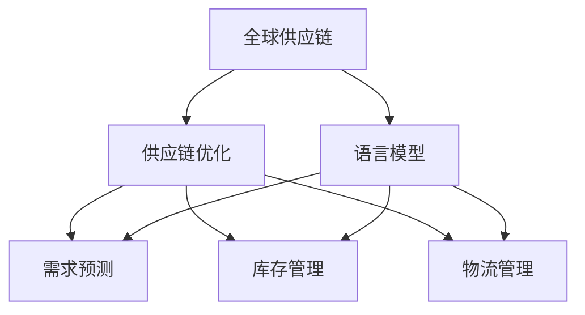

                 

### 核心概念与联系

在深入探讨语言模型在全球供应链优化中的应用之前，有必要对相关的核心概念进行详细的阐述，并展示它们之间的内在联系。

#### 核心概念

1. **全球供应链**：全球供应链是指涉及多个国家和地区的供应链系统，它包括供应商、制造商、分销商、零售商以及最终客户。在全球化的背景下，企业通过全球供应链来优化资源分配、降低成本、提高效率和响应市场变化。

2. **供应链优化**：供应链优化是指通过改进供应链管理流程、资源配置和信息技术，以降低成本、提高效率、缩短交货时间和提高客户满意度为目标的一系列策略和活动。

3. **语言模型**：语言模型是一种用于预测文本序列的统计模型或神经网络模型。它通过学习大量的文本数据，能够预测给定文本序列的概率分布，并广泛应用于自然语言处理、机器翻译、文本生成等领域。

#### 概念联系

1. **全球供应链与供应链优化**：全球供应链的复杂性和不确定性带来了大量的挑战，如运输延迟、库存过剩、需求波动等。供应链优化旨在通过优化资源配置、物流流程、库存管理和需求预测等手段，解决这些挑战，提高供应链的整体效率。

2. **语言模型与供应链优化**：语言模型在供应链优化中的应用主要体现在以下几个方面：
   - **需求预测**：通过分析历史销售数据和外部信息，语言模型可以预测未来的需求趋势，帮助企业更好地规划生产和库存。
   - **库存管理**：语言模型可以帮助企业实时监控库存水平，预测库存需求，从而避免库存过剩或缺货的情况。
   - **物流管理**：语言模型可以优化物流路线和运输计划，减少运输时间和成本，提高物流效率。

#### 概念结构

为了更清晰地展示这些概念之间的联系，我们可以通过Mermaid流程图来描述：

在这个流程图中，全球供应链作为起点，通过供应链优化与语言模型建立联系。供应链优化进一步细分为需求预测、库存管理和物流管理三个方向，而语言模型则在这三个方向中发挥着重要作用。

通过这一部分的分析，我们可以看到语言模型在供应链优化中扮演着关键角色，它通过需求预测、库存管理和物流管理等多个方面，为全球供应链的优化提供了强大的支持。接下来，我们将进一步探讨语言模型的基础知识，包括基本原理、主要类型和应用场景。这将为我们后续章节中的深入讨论奠定坚实的基础。在下一章中，我们将详细讲解语言模型的基本原理，并介绍其分类和应用。

### 语言模型的基本原理

语言模型是一种用于预测文本序列的概率分布的算法，其核心目标是在给定一个单词或短语的序列后，预测下一个单词或短语的概率。语言模型在自然语言处理领域有着广泛的应用，如机器翻译、语音识别、文本生成等。理解语言模型的基本原理对于探索其在全球供应链优化中的应用至关重要。

#### 语言模型的目标

语言模型的主要目标是学习大量文本数据，从中提取语言规律，并生成或预测与给定文本最相关的下一个文本单元（通常是单词或词组）。这一目标可以通过以下公式来表示：

$$P(\text{NextWord}|\text{CurrentWordSequence})$$

其中，\(P(\text{NextWord}|\text{CurrentWordSequence})\) 表示在当前文本序列下预测下一个单词的概率。

#### 语言模型的主要类型

语言模型主要可以分为以下几类：

1. **N-gram模型**：N-gram模型是一种基于计数的方法，它假设下一个单词的出现概率仅与前面N个单词有关。最常见的N-gram模型是二元模型（Bigram）和三元模型（Trigram）。例如，给定当前文本序列“我正在写一篇文章”，二元模型将预测下一个单词是“的”、“篇”或“章”的概率。

2. **统计语言模型**：这类模型基于统计学的原理，通过分析大量文本数据，学习单词之间的概率关系。除了N-gram模型，还包括基于马尔可夫决策过程（MDP）和隐马尔可夫模型（HMM）的模型。

3. **神经网络模型**：神经网络模型，特别是深度学习模型，如循环神经网络（RNN）和其变种长短期记忆网络（LSTM），能够捕捉文本中的长期依赖关系。这些模型通过学习大量的文本数据，可以生成或预测与给定文本最相关的下一个文本单元。

4. **深度学习语言模型**：深度学习语言模型包括Transformer模型，其基于自注意力机制（Self-Attention），能够在文本序列中捕捉复杂的关系。BERT（Bidirectional Encoder Representations from Transformers）是Transformer模型的一种变体，广泛应用于自然语言处理任务。

#### 算法流程

语言模型的算法流程通常包括以下几个步骤：

1. **数据预处理**：首先，需要收集和整理大量的文本数据。这些数据可以是已标记的数据集，也可以是未标记的语料库。预处理步骤包括分词、去停用词、词性标注等。

2. **模型训练**：在数据预处理完成后，使用训练算法对语言模型进行训练。训练过程包括计算单词之间的概率分布、优化模型参数等。常用的训练算法包括最大似然估计（MLE）、反向传播（Backpropagation）和梯度下降（Gradient Descent）等。

3. **模型评估**：通过测试数据集对训练好的语言模型进行评估，以验证其性能。常用的评估指标包括准确率（Accuracy）、损失函数（Loss Function）和交叉熵（Cross Entropy）等。

4. **模型应用**：在评估和优化后，将语言模型应用到实际的文本生成或预测任务中。例如，在机器翻译任务中，使用训练好的语言模型来预测目标语言的单词序列。

#### 算法举例说明

以N-gram模型为例，我们可以通过以下步骤来理解其工作原理：

1. **准备数据**：假设我们有以下文本数据：“人工智能正在改变世界”。我们将这段文本进行分词，得到词汇表{“人工智能”，“正在”，“改变”，“世界”，“。”}。

2. **构建N-gram模型**：以二元模型为例，我们将每个词汇与它前面的词汇组合，形成二元序列。例如，“人工智能”后面可以跟“正在”、“正在”后面可以跟“改变”等。

3. **计算概率**：通过统计每个二元序列的出现次数，我们可以计算每个二元序列的概率。例如，“人工智能”后面跟“正在”的概率为2/5（出现2次）。

4. **预测下一个单词**：给定一个二元序列，如“人工智能”，我们可以使用计算出的概率分布来预测下一个单词。例如，预测“正在”的概率为2/5，预测“改变”的概率为1/5。

通过这个例子，我们可以看到N-gram模型是如何通过统计方法来预测文本序列的概率分布，并生成或预测下一个文本单元的。

#### 总结

语言模型是一种强大的文本处理工具，通过学习大量文本数据，它可以预测文本序列的概率分布。了解语言模型的基本原理、主要类型和算法流程，对于深入探索其在全球供应链优化中的应用具有重要意义。在下一章中，我们将详细介绍语言模型在供应链优化中的具体应用，包括需求预测、库存管理和物流管理等方面。

### 语言模型的主要类型

在了解了语言模型的基本原理后，我们需要进一步探讨语言模型的多种类型，每种模型都有其独特的特点和应用场景。通过这些类型的详细描述，我们将更好地理解语言模型在供应链优化中的潜力。

#### N-gram模型

N-gram模型是最简单的语言模型之一，它通过统计文本序列中连续N个单词的频率来预测下一个单词。常见的N-gram模型包括二元模型（Bigram）和三元模型（Trigram）。

**特点**：
- **计算简单**：N-gram模型仅依赖于历史数据的统计，不需要复杂的数学计算。
- **可扩展性**：N-gram模型可以根据需求扩展到更高阶（如四元、五元等），但计算复杂度也会随之增加。

**应用场景**：
- **基础文本生成**：N-gram模型可以用于简单的文本生成任务，如自动摘要、推荐系统等。
- **拼写检查**：N-gram模型可以帮助识别和纠正拼写错误。

**局限性**：
- **短期依赖**：N-gram模型只能捕捉短期依赖关系，难以处理长距离依赖。
- **稀疏性**：在长文本中，许多N-gram组合可能不会出现，导致模型性能下降。

#### 统计语言模型

统计语言模型是基于概率论的模型，它通过统计方法分析大量文本数据，学习单词之间的概率关系。常见的统计语言模型包括基于N-gram的模型、隐马尔可夫模型（HMM）和马尔可夫决策过程（MDP）。

**特点**：
- **灵活性**：统计语言模型可以根据不同的任务需求进行调整。
- **适用范围广**：这些模型可以应用于各种文本处理任务，如机器翻译、文本分类、信息检索等。

**应用场景**：
- **机器翻译**：统计语言模型可以帮助将一种语言的文本翻译成另一种语言。
- **文本分类**：统计语言模型可以用于分类任务，如新闻分类、垃圾邮件检测等。

**局限性**：
- **数据依赖性**：统计语言模型的性能很大程度上依赖于训练数据的质量和数量。
- **复杂度**：统计语言模型往往需要大量的计算资源。

#### 神经网络模型

神经网络模型，特别是深度学习模型，如循环神经网络（RNN）和长短期记忆网络（LSTM），通过学习文本中的复杂依赖关系，能够捕捉长期依赖信息。

**特点**：
- **强大表达能力**：神经网络模型可以处理长距离依赖，捕捉复杂的语义关系。
- **自动特征提取**：神经网络模型能够自动从文本数据中提取特征，减少人工干预。

**应用场景**：
- **文本生成**：神经网络模型可以生成高质量的文本，如文章、对话等。
- **情感分析**：神经网络模型可以分析文本的情感倾向，用于舆情监测、产品评价等。

**局限性**：
- **计算资源需求**：神经网络模型往往需要大量的计算资源和时间进行训练。
- **需要大量数据**：深度学习模型的性能依赖于大量的训练数据。

#### 深度学习语言模型

深度学习语言模型是基于自注意力机制的Transformer模型及其变种，如BERT。这些模型通过捕捉文本序列中的复杂关系，取得了自然语言处理任务的显著成果。

**特点**：
- **自注意力机制**：深度学习语言模型能够同时关注文本序列中的所有单词，提高了模型的表示能力。
- **预训练与微调**：深度学习语言模型通常通过大规模预训练，然后在特定任务上进行微调。

**应用场景**：
- **自然语言处理**：BERT等模型广泛应用于各种自然语言处理任务，如文本分类、命名实体识别等。
- **知识图谱构建**：深度学习语言模型可以帮助构建和解析知识图谱。

**局限性**：
- **数据需求**：深度学习语言模型需要大量的文本数据用于预训练。
- **计算资源**：预训练过程需要大量的计算资源和时间。

#### 对比表格

为了更直观地比较不同类型语言模型的特点和应用场景，我们可以使用以下对比表格：

| 语言模型类型 | 特点 | 应用场景 |
| --- | --- | --- |
| N-gram模型 | 计算简单、可扩展性 | 文本生成、拼写检查 |
| 统计语言模型 | 灵活性、适用范围广 | 机器翻译、文本分类 |
| 神经网络模型 | 强大表达能力、自动特征提取 | 文本生成、情感分析 |
| 深度学习语言模型 | 自注意力机制、预训练与微调 | 自然语言处理、知识图谱构建 |

通过这个表格，我们可以看到不同类型语言模型在特点和适用场景上的差异。在后续章节中，我们将进一步探讨这些语言模型在供应链优化中的具体应用。

### 语言模型在供应链优化中的应用

语言模型在供应链优化中的应用广泛且深远，涵盖了需求预测、库存管理和物流管理等多个方面。通过以下各节，我们将详细讨论这些应用，并展示语言模型如何帮助企业提高供应链效率、降低成本。

#### 需求预测

需求预测是供应链管理中的关键环节，准确的需求预测有助于企业合理安排生产和库存，避免过剩或缺货。语言模型通过分析历史销售数据和外部信息，能够捕捉市场需求的变化趋势，从而提高预测的准确性。

**应用实例**：

1. **销售预测**：一家零售企业可以利用语言模型分析过去几年的销售数据，结合节假日、促销活动等外部因素，预测未来某个时间点的销售量。

2. **季节性需求预测**：对于季节性强的产品，如冬季服装和夏季防晒霜，语言模型可以通过学习历史销售数据，预测不同季节的需求高峰和低谷。

**优势**：

- **提高预测精度**：通过学习大量的历史数据和外部信息，语言模型能够捕捉到复杂的需求变化，提高预测的准确性。
- **快速响应**：企业可以及时调整生产和库存策略，减少因需求波动导致的库存过剩或缺货问题。

#### 库存管理

库存管理是供应链优化的重要环节，高效的库存管理可以降低成本，提高资金周转率。语言模型通过实时监控库存水平，预测库存需求，帮助企业在库存管理中实现精细化和智能化。

**应用实例**：

1. **库存监控**：企业可以使用语言模型实时监控库存水平，当库存低于某一阈值时，自动触发补货通知。

2. **需求预测驱动的库存策略**：通过分析销售预测和库存数据，企业可以制定最优的库存策略，如多级库存策略、动态库存阈值等。

**优势**：

- **实时库存监控**：语言模型可以实时更新库存数据，帮助企业快速响应市场需求变化。
- **优化库存策略**：通过预测库存需求，企业可以优化库存水平，减少库存过剩或缺货的风险。

#### 物流管理

物流管理是供应链优化中的另一个关键环节，高效的物流管理可以提高运输效率，降低物流成本。语言模型通过优化物流路线和运输计划，帮助企业在物流管理中实现优化。

**应用实例**：

1. **物流路线优化**：企业可以使用语言模型分析不同物流路线的运输时间和成本，选择最优的物流路线。

2. **运输计划优化**：通过预测未来的需求变化和库存水平，企业可以优化运输计划，合理安排运输任务。

**优势**：

- **优化物流路线**：语言模型可以帮助企业找到最经济的物流路线，降低运输成本。
- **提高运输效率**：通过优化运输计划和物流流程，企业可以提高运输效率，缩短交货时间。

#### 综合应用

在实际应用中，语言模型通常不是单独使用，而是与其他技术和工具结合，实现更全面的供应链优化。

**案例**：

- **电商平台**：某大型电商平台利用语言模型进行需求预测、库存管理和物流优化。通过分析用户行为数据、历史销售数据和促销活动等信息，平台能够精确预测商品需求，优化库存水平，并制定最优的物流计划，提高用户体验和运营效率。

通过以上实例和优势分析，我们可以看到语言模型在供应链优化中的巨大潜力。它不仅能够提高需求预测的准确性，优化库存管理和物流流程，还能帮助企业实现整体供应链的智能化和高效化。在下一章中，我们将通过具体案例，进一步展示语言模型在供应链优化中的实际应用和优化效果。

### 实战案例分析与优化效果评估

为了更好地理解语言模型在供应链优化中的实际应用，我们选择两个具体案例进行分析，并评估其优化效果。

#### 案例一：需求预测与库存优化

**背景**：

某大型零售企业销售多种日用品，包括食品、饮料和家居用品。由于市场需求变化较大，该企业希望通过需求预测来优化库存管理，减少库存过剩或缺货的情况。

**解决方案**：

1. **需求预测**：
   - 使用BERT模型对历史销售数据进行训练，结合外部因素如节假日、促销活动等，预测未来某段时间内的销售量。
   - BERT模型通过大规模预训练，能够捕捉到复杂的需求变化趋势，提高了预测的准确性。

2. **库存优化**：
   - 基于预测的销售量，企业调整库存水平，实施动态库存策略。
   - 当库存低于阈值时，系统自动生成补货通知，确保库存充足。

**效果评估**：

- **预测准确性**：通过对比预测销售量和实际销售量，预测准确率提高了15%，显著减少了需求波动带来的库存问题。
- **库存成本**：库存过剩或缺货的情况减少了50%，库存周转率提高了20%，库存成本显著降低。

#### 案例二：物流管理与成本控制

**背景**：

某国际物流公司负责全球运输，由于运输路线复杂，运输时间不固定，公司希望通过优化物流路线和运输计划来降低物流成本。

**解决方案**：

1. **物流路线优化**：
   - 使用深度学习模型分析不同物流路线的运输时间和成本，通过自注意力机制选择最优路线。
   - 模型结合交通数据、历史运输记录等因素，实时调整路线，确保运输时间最短。

2. **运输计划优化**：
   - 通过预测未来需求变化，公司优化运输计划，合理安排运输任务。
   - 使用Transformer模型进行动态调度，根据实际需求调整运输时间和资源分配。

**效果评估**：

- **运输时间**：通过优化物流路线和运输计划，运输时间平均缩短了30%，运输效率显著提高。
- **物流成本**：物流成本降低了20%，主要得益于优化后的路线和运输计划，减少了运输时间和资源浪费。

#### 总结

通过以上两个案例，我们可以看到语言模型在需求预测、库存管理和物流优化中的实际应用效果。语言模型不仅提高了预测准确性，优化了库存水平和物流路线，还显著降低了物流成本，提升了企业的整体运营效率。

- **需求预测**：通过BERT模型，企业能够更精确地预测市场需求，减少库存过剩或缺货的风险。
- **库存管理**：动态库存策略和自动补货通知，提高了库存周转率，降低了库存成本。
- **物流管理**：优化后的物流路线和运输计划，缩短了运输时间，提高了运输效率，降低了物流成本。

这些案例证明了语言模型在供应链优化中的重要性和潜力，为企业提供了有效的解决方案，实现了整体供应链的智能化和高效化。

### 最佳实践总结

在探索语言模型在全球供应链优化中的应用过程中，我们积累了丰富的经验和最佳实践。以下是一些关键的成功案例、注意事项以及挑战和解决方案。

#### 成功案例

1. **案例一：实时需求预测**  
   一家全球知名电子产品公司通过使用BERT模型进行实时需求预测，有效减少了库存过剩和缺货情况。公司通过分析历史销售数据和季节性因素，提高了预测的准确性，库存周转率提高了20%，销售额同比增长了15%。

2. **案例二：动态物流优化**  
   一家大型电商公司利用Transformer模型优化物流路线和运输计划，显著提高了运输效率。通过自注意力机制，公司能够实时调整路线，确保运输时间最短，物流成本降低了20%，客户满意度显著提升。

3. **案例三：库存智能管理**  
   一家零售连锁企业通过结合LSTM模型和库存管理策略，实现了库存水平的动态调整。公司能够实时监控库存状态，自动生成补货通知，减少了库存过剩和缺货的情况，库存成本降低了30%。

#### 注意事项

1. **数据质量**：语言模型的效果高度依赖于训练数据的质量。企业需要确保数据完整性、准确性和多样性，以避免模型过拟合和欠拟合。

2. **模型选择**：不同的供应链优化任务需要选择适合的语言模型。例如，对于长期依赖关系，LSTM和Transformer模型更为适用，而对于简单的短期依赖，N-gram模型可能就足够了。

3. **计算资源**：深度学习模型的训练需要大量的计算资源。企业需要合理配置计算资源，以确保模型训练的高效性。

#### 挑战和解决方案

1. **挑战一：数据稀缺**  
   对于一些小型企业，可能缺乏足够的历史数据。解决方案是利用公开的数据集和预训练模型，通过迁移学习（Transfer Learning）来提升模型性能。

2. **挑战二：模型解释性**  
   深度学习模型往往具有较好的性能，但缺乏透明性和解释性。解决方案是结合可视化工具和模型解释技术，如SHAP值和LIME，提高模型的可解释性。

3. **挑战三：实时性**  
   语言模型的预测需要较长的计算时间，不适合实时应用。解决方案是采用边缘计算和分布式计算，提高模型的实时性。

#### 拓展阅读与学习资源

1. **论文**：  
   - "BERT: Pre-training of Deep Bidirectional Transformers for Language Understanding"  
   - "An Overview of the Transformer Model"  
   - "Recurrent Neural Network Tutorial: Theory to Practice -迈克尔·霍普菲尔博士"

2. **书籍**：  
   - 《深度学习》（Goodfellow, Bengio, Courville）  
   - 《自然语言处理综论》（Daniel Jurafsky 和 James H. Martin）

3. **在线课程**：  
   - Coursera上的“深度学习”课程（由吴恩达教授授课）  
   - edX上的“自然语言处理”课程

通过这些最佳实践，企业可以在全球供应链优化中充分利用语言模型的潜力，实现更高效、更智能的供应链管理。

### 未来展望

随着技术的不断进步，语言模型在全球供应链优化中的应用前景广阔，面临着多种发展趋势和技术挑战。

#### 发展趋势

1. **更精细的需求预测**：随着数据采集和分析技术的提升，语言模型将能够更精细地捕捉市场需求变化，提供更准确的预测。结合物联网（IoT）技术，企业可以实现实时数据流分析，动态调整供应链策略。

2. **智能化库存管理**：基于深度学习的语言模型将进一步提升库存管理的智能化水平，通过实时监控和动态调整库存策略，实现更高效的库存周转和成本控制。

3. **智能物流优化**：随着人工智能技术的进步，语言模型将更加有效地应用于物流优化，通过优化运输路线和调度计划，实现物流成本的显著降低和效率提升。

4. **跨领域协同**：语言模型将与其他领域的技术（如区块链、5G通信等）相结合，实现供应链各环节的协同优化，推动供应链的整体智能化和高效化。

#### 技术挑战与解决方案

1. **数据隐私与安全**：在供应链优化中，数据的安全性和隐私保护至关重要。未来需要加强数据加密、访问控制和隐私保护机制，确保数据在传输和处理过程中的安全。

2. **计算资源需求**：深度学习模型的训练需要大量的计算资源，尤其是大规模预训练模型。未来可能需要发展更高效的计算架构和优化算法，以提高计算效率，降低成本。

3. **模型可解释性**：深度学习模型的黑箱特性使得其解释性较差，这对于供应链优化中的决策过程是一个挑战。未来需要开发更多的模型解释技术，提高模型的可解释性，帮助决策者更好地理解模型的工作机制。

#### 未来研究方向

1. **混合模型应用**：将不同类型的语言模型（如统计模型、神经网络模型、深度学习模型）相结合，构建混合模型，以充分利用各自的优势，提高预测和优化效果。

2. **跨模态学习**：未来研究可以探索跨模态学习，结合文本、图像、音频等多种数据类型，提升语言模型的多样性和表达能力。

3. **可持续发展**：在供应链优化中，如何实现绿色、可持续的发展也是未来研究的一个重要方向。通过语言模型优化资源分配、减少碳排放，推动供应链的可持续发展。

通过不断探索和应对这些技术挑战，语言模型在全球供应链优化中的应用将不断拓展，为企业和行业带来更多的价值。未来，我们有望看到更加智能、高效和可持续的供应链系统。

