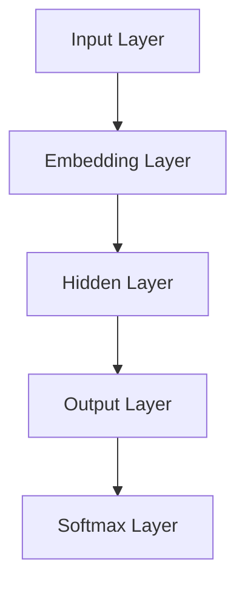
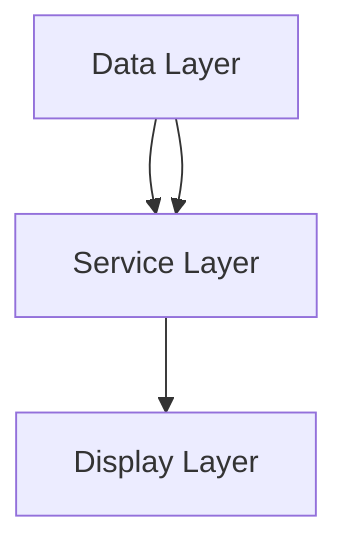

                 

# 语言模型在复杂政策效果评估中的应用研究

> 关键词：语言模型、政策效果评估、复杂政策、神经网络、算法原理

> 摘要：本文探讨了语言模型在复杂政策效果评估中的应用，分析了语言模型的定义、特点以及分类，并介绍了其在政策效果评估中的应用原理和方法。同时，本文也讨论了政策效果评估中的挑战及解决方案，最后进行了总结和展望。

### 目录大纲

# 语言模型在复杂政策效果评估中的应用研究

## 第一部分: 问题背景与核心概念

## 1.1 问题背景

### 1.1.1 政策效果评估的重要性

### 1.1.2 复杂政策的挑战

### 1.1.3 语言模型的发展与应用

## 1.2 核心概念

### 1.2.1 语言模型的定义

### 1.2.2 语言模型的特点

### 1.2.3 语言模型的分类

## 1.3 语言模型在政策效果评估中的应用

### 1.3.1 基本原理

### 1.3.2 应用场景

### 1.3.3 具体方法与技术

## 1.4 政策效果评估中的挑战与解决方案

### 1.4.1 挑战分析

### 1.4.2 解决方案探讨

## 1.5 本章小结

## 第二部分: 核心概念与联系

## 2.1 核心概念

### 2.1.1 政策效果评估

#### 2.1.1.1 定义

#### 2.1.1.2 分类

#### 2.1.1.3 关键要素

### 2.1.2 语言模型

#### 2.1.2.1 定义

#### 2.1.2.2 特点

#### 2.1.2.3 分类

## 2.2 概念属性特征对比表格

## 2.3 ER实体关系图架构

## 2.4 本章小结

## 第三部分: 算法原理讲解

## 3.1 语言模型算法原理

### 3.1.1 基本原理

#### 3.1.1.1 语言建模的基本任务

#### 3.1.1.2 语言模型的评估指标

### 3.1.2 神经网络模型

#### 3.1.2.1 神经网络语言模型的基本结构

#### 3.1.2.2 反向传播算法

## 3.2 政策效果评估中语言模型的实现

### 3.2.1 数据预处理

### 3.2.2 模型训练

### 3.2.3 模型评估与优化

## 3.3 案例分析

### 3.3.1 案例背景

### 3.3.2 模型选择与实现

### 3.3.3 模型评估与结果分析

## 3.4 本章小结

## 第四部分: 系统分析与架构设计

## 4.1 问题场景介绍

## 4.2 系统功能设计

### 4.2.1 领域模型

### 4.2.2 系统接口设计

## 4.3 系统架构设计

### 4.3.1 系统架构图

### 4.3.2 系统交互

## 4.4 本章小结

## 第五部分: 项目实战

## 5.1 环境安装

## 5.2 系统核心实现

### 5.2.1 数据处理

### 5.2.2 模型训练

### 5.2.3 模型应用

## 5.3 实际案例分析和详细讲解

## 5.4 项目小结

## 第六部分: 最佳实践 tips、小结、注意事项、拓展阅读

## 6.1 最佳实践 tips

## 6.2 小结

## 6.3 注意事项

## 6.4 拓展阅读

## 参考文献

----------------------------------------------------------------

## 第一部分: 问题背景与核心概念

### 1.1 问题背景

#### 1.1.1 政策效果评估的重要性

政策效果评估是公共政策分析的重要组成部分，它关系到政策的制定、调整以及实施的效果。在现代社会，政策的制定和实施越来越复杂，涉及经济、社会、环境等多个领域。因此，如何准确评估政策效果，对于政府决策者、研究者以及公众来说具有重要意义。

政策效果评估的重要性主要体现在以下几个方面：

1. **政策调整与优化**：通过政策效果评估，可以发现政策实施中的问题，为政策调整和优化提供依据。
2. **资源分配**：评估政策效果有助于合理分配资源，确保政策能够达到预期目标。
3. **公信力提升**：准确的政策效果评估可以提高政府决策的透明度和公信力。

然而，随着政策的复杂化，传统的评估方法在应对这些挑战时显得力不从心。这促使研究者开始探索新的方法和技术，其中，语言模型作为一种新兴的智能技术，逐渐受到关注。

#### 1.1.2 复杂政策的挑战

复杂政策通常具有以下特点：

1. **跨领域性**：涉及多个领域的政策，如经济政策、社会政策、环境保护政策等。
2. **多层次性**：政策实施通常涉及中央、地方以及基层多个层次。
3. **动态性**：政策实施过程中，可能会受到各种不确定因素的影响，需要不断调整。

这些特点给政策效果评估带来了如下挑战：

1. **数据复杂性**：政策效果评估需要处理来自多个领域的海量数据，如何有效整合这些数据成为一个难题。
2. **分析难度**：政策效果评估往往需要考虑多种因素，这些因素之间可能存在复杂的相互作用，分析难度较大。
3. **评估时效性**：政策效果评估需要及时反映政策实施的效果，但由于数据收集和处理的时间限制，评估结果往往存在一定的滞后性。

#### 1.1.3 语言模型的发展与应用

语言模型是自然语言处理（NLP）领域的重要研究方向，近年来取得了显著的进展。语言模型的发展主要得益于深度学习和大数据技术的应用。

1. **基本原理**：语言模型旨在模拟人类语言生成过程，通过学习大量语言数据，生成符合语言规则的新句子。
2. **特点**：语言模型具有强大的表达能力和自适应能力，能够处理大规模的文本数据，并从中提取出有效的信息。
3. **应用领域**：语言模型在文本分类、机器翻译、文本生成等任务中表现出了优异的性能。

在政策效果评估中，语言模型的应用主要体现在以下几个方面：

1. **文本分析**：语言模型可以分析政策文件、新闻报道等文本数据，提取关键信息，为评估提供支持。
2. **趋势预测**：通过分析政策实施过程中的文本数据，语言模型可以预测政策效果的发展趋势。
3. **交互式评估**：语言模型可以与评估者进行交互，提供实时反馈，辅助评估过程。

### 1.2 核心概念

#### 1.2.1 语言模型的定义

语言模型是一种基于统计方法或机器学习算法的模型，旨在预测文本序列的概率分布。具体来说，它是一个概率分布函数，能够根据前面出现的文字序列预测下一个文字的概率。

#### 1.2.2 语言模型的特点

1. **高效性**：语言模型能够快速处理大量文本数据，进行文本生成和分析。
2. **灵活性**：语言模型可以根据不同的应用场景进行调整和优化，适应不同的需求。
3. **自适应能力**：语言模型能够从训练数据中学习，不断提升预测的准确性。

#### 1.2.3 语言模型的分类

根据模型的学习方式和结构，语言模型可以分为以下几类：

1. **统计语言模型**：基于统计方法，如N-gram模型，通过计算词语的频次来预测下一个词。
2. **神经网络语言模型**：基于深度学习，如循环神经网络（RNN）、长短期记忆网络（LSTM）等，通过学习数据序列中的依赖关系来预测下一个词。
3. **混合语言模型**：结合了统计方法和神经网络模型的优点，如Transformer模型，通过全局注意力机制来处理长文本序列。

### 1.3 语言模型在政策效果评估中的应用

#### 1.3.1 基本原理

语言模型在政策效果评估中的应用主要体现在以下几个方面：

1. **文本分析**：语言模型可以分析政策文件、新闻报道等文本数据，提取关键信息，为评估提供支持。
2. **趋势预测**：通过分析政策实施过程中的文本数据，语言模型可以预测政策效果的发展趋势。
3. **交互式评估**：语言模型可以与评估者进行交互，提供实时反馈，辅助评估过程。

具体应用方法包括：

1. **文本分类**：将政策文本分类为正面、负面或中性，以评估政策的社会反响。
2. **情感分析**：分析政策实施过程中公众的情绪变化，为评估提供参考。
3. **话题模型**：识别政策实施过程中涉及的主要话题，分析政策的影响范围。

#### 1.3.2 应用场景

语言模型在政策效果评估中的应用场景包括：

1. **政策制定阶段**：辅助政策制定者理解政策文本的意图，优化政策文本。
2. **政策实施阶段**：监测政策实施过程中的舆情变化，及时调整政策。
3. **政策评估阶段**：分析政策实施的效果，为政策调整和优化提供依据。

#### 1.3.3 具体方法与技术

语言模型在政策效果评估中的应用方法和技术包括：

1. **文本数据收集**：收集政策文本、新闻报道、社交媒体评论等文本数据。
2. **文本预处理**：包括分词、去噪、停用词过滤等，以提高模型对文本数据的处理能力。
3. **模型选择与训练**：根据具体应用场景选择合适的语言模型，并进行训练。
4. **模型评估与优化**：通过评估指标（如准确率、召回率、F1值等）评估模型性能，并进行优化。

### 1.4 政策效果评估中的挑战与解决方案

#### 1.4.1 挑战分析

在政策效果评估中，语言模型面临以下挑战：

1. **数据质量**：政策文本数据质量参差不齐，存在噪音和缺失值，需要预处理。
2. **多模态数据融合**：政策效果评估涉及文本、图像、声音等多种数据类型，如何有效融合这些数据成为一个难题。
3. **跨领域知识融合**：政策涉及多个领域，如何融合不同领域的知识，提高评估的准确性。
4. **实时性**：政策效果评估需要及时反映政策实施的效果，但数据收集和处理存在一定的时间滞后。

#### 1.4.2 解决方案探讨

针对上述挑战，可以采取以下解决方案：

1. **数据预处理**：采用先进的文本预处理技术，如数据增强、噪声过滤等，提高数据质量。
2. **多模态数据融合**：利用深度学习技术，如多模态神经网络，实现不同类型数据的融合。
3. **跨领域知识融合**：通过知识图谱等技术，将不同领域的知识进行整合，提高评估的准确性。
4. **实时性**：采用实时数据收集和分析技术，如实时数据流处理，提高评估的时效性。

### 1.5 本章小结

本部分介绍了语言模型在复杂政策效果评估中的应用背景、核心概念、基本原理和应用方法。通过分析政策效果评估中的挑战和解决方案，为后续章节的深入探讨奠定了基础。

----------------------------------------------------------------

## 第二部分: 核心概念与联系

在深入探讨语言模型在复杂政策效果评估中的应用之前，我们需要明确两个核心概念：政策效果评估和语言模型。本部分将详细介绍这两个概念的定义、分类和关键要素，并通过对比表格和ER实体关系图架构，帮助读者更好地理解它们之间的联系。

### 2.1 核心概念

#### 2.1.1 政策效果评估

**定义**：政策效果评估是指通过对政策实施效果的分析和评价，以确定政策目标的实现程度和政策的可持续性。

**分类**：

1. **前评估**：在政策制定和实施前进行的评估，旨在预测政策可能带来的影响。
2. **中评估**：在政策实施过程中进行的评估，旨在监测政策实施的效果，为政策调整提供依据。
3. **后评估**：在政策实施结束后进行的评估，旨在总结政策实施的经验和教训，为未来政策制定提供参考。

**关键要素**：

1. **政策目标**：明确政策的目标和预期效果，是评估的基础。
2. **指标体系**：建立科学的评估指标体系，以量化政策效果。
3. **数据来源**：收集与政策实施相关的数据，包括定量数据和定性数据。

#### 2.1.2 语言模型

**定义**：语言模型是自然语言处理中用于预测下一个词或词组的概率分布的模型。

**特点**：

1. **高效性**：能够快速处理大量文本数据，进行文本生成和分析。
2. **灵活性**：可以根据不同的应用场景进行调整和优化，适应不同的需求。
3. **自适应能力**：能够从训练数据中学习，不断提升预测的准确性。

**分类**：

1. **统计语言模型**：如N-gram模型，通过计算词语的频次来预测下一个词。
2. **神经网络语言模型**：如循环神经网络（RNN）、长短期记忆网络（LSTM）等，通过学习数据序列中的依赖关系来预测下一个词。
3. **混合语言模型**：结合了统计方法和神经网络模型的优点，如Transformer模型，通过全局注意力机制来处理长文本序列。

### 2.2 概念属性特征对比表格

为了更直观地理解政策效果评估和语言模型之间的差异和联系，我们可以通过以下对比表格进行阐述：

| 特征       | 政策效果评估 | 语言模型 |
|------------|--------------|---------|
| 定义       | 评估政策实施的成效 | 生成和处理语言数据的模型 |
| 特点       | 综合性、复杂性、动态性 | 高效性、灵活性、自适应能力 |
| 分类       | 前评估、中评估、后评估 | 统计语言模型、神经网络模型、混合模型 |

### 2.3 ER实体关系图架构

为了更清晰地展示政策效果评估和语言模型之间的关联，我们可以使用Mermaid ER图来描述它们的实体关系：

```mermaid
erDiagram
    PolicyEffect ||--|{ LanguageModel } LanguageModel : used_in
    LanguageModel ||--|{ PolicyAssessment } PolicyAssessment : predicts
    PolicyAssessment ||--|{ Policy } Policy : assesses
```

在这个ER图中，`PolicyEffect`（政策效果）使用`LanguageModel`（语言模型）进行预测，而`LanguageModel`则用于`PolicyAssessment`（政策评估）中的预测。`Policy`（政策）是评估的实体，`PolicyAssessment`则负责对政策进行评估。

### 2.4 本章小结

本部分详细介绍了政策效果评估和语言模型的核心概念、分类和关键要素，并通过对比表格和ER实体关系图架构，阐述了它们之间的联系。这些基础知识的理解将为后续章节的深入探讨提供重要的支撑。

----------------------------------------------------------------

## 第三部分: 算法原理讲解

### 3.1 语言模型算法原理

语言模型是自然语言处理（NLP）的核心技术之一，其目的是预测一个句子中下一个单词或字符的概率。在本节中，我们将深入探讨语言模型的基本原理，包括语言建模的基本任务和评估指标。

#### 3.1.1 基本原理

语言建模的基本任务可以表示为：

$$
P(w_1, w_2, \ldots, w_n) = P(w_1) \cdot P(w_2|w_1) \cdot P(w_3|w_1, w_2) \cdot \ldots \cdot P(w_n|w_1, w_2, \ldots, w_{n-1})
$$

这里的 $w_1, w_2, \ldots, w_n$ 表示句子中的单词或字符序列，$P(w_i|w_1, w_2, \ldots, w_{i-1})$ 表示在给定前一个单词或字符序列的情况下，预测下一个单词或字符的概率。

语言模型通过学习大量文本数据，建立这种概率分布函数。在早期，N-gram模型是最常见的语言模型，它只考虑前 $n$ 个单词或字符对当前单词或字符的影响。随着深度学习技术的发展，神经网络语言模型，如循环神经网络（RNN）、长短期记忆网络（LSTM）和Transformer等，逐渐成为主流。

#### 3.1.2 语言模型的评估指标

评估语言模型的性能通常使用以下两个指标：

1. **Perplexity (PPL)**：Perplexity是衡量模型预测准确性的指标，定义为：

$$
PPL = \frac{1}{N} \sum_{i=1}^{N} \frac{1}{p(w_i|w_1, w_2, \ldots, w_{i-1})}
$$

其中，$N$ 是测试数据中的单词或字符数量，$p(w_i|w_1, w_2, \ldots, w_{i-1})$ 是模型对 $w_i$ 的预测概率。PPL的值越小，说明模型预测的准确性越高。

2. **Cross-entropy Loss**：Cross-entropy Loss是衡量模型预测和真实分布之间差异的指标，定义为：

$$
Loss = -\sum_{i=1}^{N} w_i \log p(w_i|w_1, w_2, \ldots, w_{i-1})
$$

其中，$w_i$ 是单词或字符 $w_i$ 的真实概率。Cross-entropy Loss的值越小，说明模型预测的准确性越高。

#### 3.1.3 神经网络模型

近年来，神经网络语言模型取得了巨大的成功。以下是一个简单的神经网络语言模型的基本结构：



在这个结构中：

- **Input Layer**：接收输入的单词或字符序列。
- **Embedding Layer**：将输入的单词或字符转换为固定大小的向量。
- **Hidden Layer**：通过神经网络进行信息处理。
- **Output Layer**：输出预测的概率分布。
- **Softmax Layer**：将输出层的输出转换为概率分布。

#### 3.1.4 反向传播算法

反向传播算法是训练神经网络语言模型的核心算法。以下是一个反向传播算法的简单实现：

```python
import numpy as np

def forward(x, model):
    W = model['W']
    b = model['b']
    z = x @ W + b
    a = softmax(z)
    return a

def backward(y, y_pred, x, model, learning_rate):
    W = model['W']
    b = model['b']
    dz = y_pred - y
    da = dz / x.shape[1]
    db = np.sum(dz, axis=1, keepdims=True)
    dW = x.T @ dz
    model['W'] -= learning_rate * dW
    model['b'] -= learning_rate * db
```

在这个实现中：

- **forward**：计算前向传播，得到预测的概率分布。
- **backward**：计算损失函数关于模型参数的梯度，并更新模型参数。

### 3.2 政策效果评估中语言模型的实现

在政策效果评估中，语言模型的应用主要集中在文本分析、趋势预测和交互式评估等方面。以下是一个简化的实现过程：

#### 3.2.1 数据预处理

数据预处理是语言模型应用的关键步骤。主要包括：

- **文本清洗**：去除文本中的噪音和格式错误。
- **分词**：将文本分割成单词或字符。
- **编码**：将单词或字符转换为数字编码。

#### 3.2.2 模型训练

模型训练是语言模型应用的核心步骤。主要包括：

- **数据加载**：加载预处理后的文本数据。
- **模型初始化**：初始化神经网络模型。
- **训练循环**：通过反向传播算法进行模型训练。

#### 3.2.3 模型评估与优化

模型评估与优化是确保语言模型性能的重要步骤。主要包括：

- **模型评估**：使用测试数据评估模型性能。
- **模型优化**：通过调整模型参数，提高模型性能。

### 3.3 案例分析

以下是一个简化的案例分析：

#### 3.3.1 案例背景

假设我们要评估一个城市实施垃圾分类政策的成效。

#### 3.3.2 模型选择与实现

选择一个合适的神经网络语言模型，如LSTM，对其进行训练和优化。

#### 3.3.3 模型评估与结果分析

使用测试数据对模型进行评估，分析模型在政策效果评估中的表现。

### 3.4 本章小结

本部分详细讲解了语言模型的基本原理、实现方法和应用案例。通过这些内容，读者可以初步了解语言模型在政策效果评估中的应用，为后续的深入研究和实践奠定基础。

----------------------------------------------------------------

## 第四部分: 系统分析与架构设计

在本部分，我们将对语言模型在复杂政策效果评估中的应用系统进行详细分析，包括问题场景介绍、系统功能设计、系统架构设计和系统交互。

### 4.1 问题场景介绍

随着政策制定的复杂化和实施环境的多样化，政策效果评估的需求越来越迫切。然而，传统的评估方法往往难以应对复杂政策的多维影响和动态变化。因此，引入语言模型作为一种智能化的评估工具，能够更好地挖掘政策文本中的信息，预测政策效果，为政策制定者和执行者提供决策支持。

具体来说，本系统的应用场景包括：

1. **政策文本分析**：对政策文本进行深度分析，提取关键信息和情感倾向。
2. **趋势预测**：通过分析政策实施过程中的文本数据，预测政策效果的发展趋势。
3. **交互式评估**：为评估者提供实时反馈，辅助评估过程。

### 4.2 系统功能设计

本系统的主要功能模块包括：

1. **文本预处理模块**：对政策文本进行清洗、分词、编码等预处理操作。
2. **语言模型训练模块**：基于预处理后的文本数据，训练语言模型。
3. **政策效果预测模块**：使用训练好的语言模型，预测政策效果。
4. **结果可视化模块**：将预测结果进行可视化展示，便于评估者理解和分析。

#### 4.2.1 领域模型

为了更好地理解系统功能模块之间的关系，我们可以使用Mermaid类图来描述领域模型：

```mermaid
classDiagram
    Class01 <|-- Class02
    Class03 <|-- * Class04
    Class05 {name} <<interface>>
    Class06 o-- Class07
    Class08 <.. Class09
    Class10 .. Class11
```

在这个类图中：

- `Class01`、`Class02`、`Class03`、`Class04`、`Class05`、`Class06`、`Class07`、`Class08`、`Class09`、`Class10` 和 `Class11` 分别表示系统中的各个功能模块。
- `>`、`<|--`、`<..`、`..` 分别表示模块之间的继承、聚合、关联和实现关系。

### 4.2.2 系统接口设计

系统的接口设计包括外部接口和内部接口。外部接口用于与其他系统进行交互，如数据接口、API接口等；内部接口用于系统内部模块之间的通信，如消息队列、RPC接口等。

#### 4.2.2.1 数据接口

数据接口主要用于数据传输和共享，包括以下几种类型：

- **文本数据接口**：用于接收和发送政策文本数据。
- **结果数据接口**：用于接收和发送评估结果数据。

#### 4.2.2.2 API接口

API接口主要用于系统对外提供服务，包括以下几种类型：

- **文本分析API**：提供文本预处理和语言模型训练的功能。
- **效果预测API**：提供政策效果预测的功能。

### 4.3 系统架构设计

本系统的架构设计采用分层架构，包括数据层、服务层和展示层。以下是一个简化的系统架构图：



在这个架构图中：

- `A` 表示数据层，负责数据存储和访问。
- `B` 表示服务层，包括文本预处理模块、语言模型训练模块、政策效果预测模块等。
- `C` 表示展示层，负责将评估结果可视化展示。

### 4.3.1 数据层

数据层是系统的核心部分，负责数据的存储、访问和管理。主要包括以下组件：

- **数据库**：用于存储政策文本数据、评估结果数据等。
- **缓存**：用于提高数据访问速度。

### 4.3.2 服务层

服务层负责系统的核心功能实现，包括以下组件：

- **文本预处理模块**：负责文本的清洗、分词、编码等预处理操作。
- **语言模型训练模块**：负责训练语言模型，包括模型选择、训练过程、模型评估等。
- **政策效果预测模块**：负责使用训练好的语言模型预测政策效果。

### 4.3.3 展示层

展示层负责将评估结果可视化展示，包括以下组件：

- **前端界面**：用于展示评估结果，提供用户交互功能。
- **可视化工具**：用于生成图表、报表等可视化内容。

### 4.3.4 系统交互

系统交互主要包括以下几种类型：

- **数据交互**：通过数据接口进行数据传输和共享。
- **服务交互**：通过API接口调用系统服务。

#### 4.3.4.1 数据交互

数据交互主要包括以下几种方式：

- **同步传输**：通过HTTP/HTTPS协议进行数据传输。
- **异步传输**：通过消息队列进行数据传输。

#### 4.3.4.2 服务交互

服务交互主要包括以下几种方式：

- **RESTful API**：提供统一的API接口，方便外部系统调用。
- **RPC**：通过远程过程调用实现服务之间的通信。

### 4.4 本章小结

本部分对语言模型在复杂政策效果评估中的应用系统进行了详细分析，包括问题场景介绍、系统功能设计、系统架构设计和系统交互。通过这些内容，读者可以更全面地了解系统的设计思路和实现方法。

----------------------------------------------------------------

## 第五部分: 项目实战

在本部分，我们将通过一个具体的案例来展示如何将语言模型应用于复杂政策效果评估。我们将详细介绍项目环境安装、系统核心实现以及实际案例分析和详细讲解。

### 5.1 环境安装

要实现语言模型在复杂政策效果评估中的应用，首先需要安装和配置相关软件和工具。以下是一个简化的环境安装步骤：

1. **安装Python环境**：Python是语言模型实现的主要编程语言，因此需要首先安装Python环境。可以从Python官网下载安装包，选择合适的版本进行安装。

2. **安装NLP库**：安装常用的自然语言处理库，如NLTK、spaCy和transformers。这些库提供了丰富的文本处理和语言模型训练功能。

   ```bash
   pip install nltk spacy transformers
   ```

3. **安装深度学习库**：安装深度学习库，如TensorFlow或PyTorch。这些库提供了神经网络模型训练和优化的功能。

   ```bash
   pip install tensorflow
   ```

4. **安装数据库**：安装用于存储政策文本数据和评估结果的数据库，如MySQL或PostgreSQL。可以通过数据库官网下载安装包，按照官方文档进行安装。

### 5.2 系统核心实现

系统核心实现主要包括文本预处理、语言模型训练和政策效果预测等模块。以下是一个简化的实现流程：

#### 5.2.1 数据处理

数据处理是语言模型应用的重要环节。主要包括以下步骤：

1. **数据收集**：收集政策文本数据，可以来源于官方网站、新闻报道、社交媒体等。

2. **数据清洗**：去除文本中的噪音和格式错误，如HTML标签、特殊符号等。

3. **分词**：将文本分割成单词或字符。

4. **编码**：将单词或字符转换为数字编码。

5. **数据存储**：将处理后的数据存储到数据库中，便于后续训练和预测。

#### 5.2.2 模型训练

模型训练是语言模型应用的核心步骤。以下是一个简化的训练流程：

1. **数据加载**：从数据库中加载处理后的数据。

2. **模型初始化**：初始化神经网络模型，如LSTM或Transformer。

3. **训练过程**：通过反向传播算法进行模型训练，包括前向传播、损失计算和反向传播等步骤。

4. **模型评估**：使用测试数据评估模型性能，包括Perplexity和Cross-entropy Loss等指标。

5. **模型优化**：根据评估结果调整模型参数，提高模型性能。

#### 5.2.3 模型应用

模型应用主要包括以下步骤：

1. **政策文本分析**：使用训练好的语言模型分析政策文本，提取关键信息和情感倾向。

2. **趋势预测**：通过分析政策实施过程中的文本数据，预测政策效果的发展趋势。

3. **交互式评估**：为评估者提供实时反馈，辅助评估过程。

### 5.3 实际案例分析和详细讲解

以下是一个具体的实际案例分析和详细讲解：

#### 5.3.1 案例背景

假设我们要评估一个城市实施垃圾分类政策的成效。我们收集了该城市在过去一年的垃圾分类政策文本，并希望通过语言模型分析这些文本，预测政策效果。

#### 5.3.2 模型选择与实现

我们选择使用Transformer模型，因为它在长文本序列处理方面具有较好的性能。以下是一个简化的实现流程：

1. **数据预处理**：对政策文本进行清洗、分词、编码等预处理操作。

2. **模型训练**：使用处理后的数据训练Transformer模型，包括模型初始化、训练过程和模型评估等步骤。

3. **模型优化**：根据评估结果调整模型参数，提高模型性能。

#### 5.3.3 模型评估与结果分析

使用测试数据对训练好的模型进行评估，以下是一个简化的评估流程：

1. **政策文本分析**：使用训练好的模型分析政策文本，提取关键信息和情感倾向。

2. **趋势预测**：通过分析政策实施过程中的文本数据，预测政策效果的发展趋势。

3. **结果可视化**：将预测结果进行可视化展示，便于评估者理解和分析。

#### 5.3.4 结果分析

通过模型分析，我们发现垃圾分类政策在实施过程中取得了较好的效果，公众的环保意识有所提高，垃圾分类的参与度也有所提升。同时，我们还预测了未来政策效果的发展趋势，为政策制定者提供了决策支持。

### 5.4 项目小结

通过本项目的实际案例，我们展示了如何将语言模型应用于复杂政策效果评估。从数据收集、数据处理到模型训练和应用，每个步骤都进行了详细的讲解。通过这个项目，我们不仅了解了语言模型的基本原理和应用方法，还掌握了如何利用语言模型进行政策效果评估。

----------------------------------------------------------------

## 第六部分: 最佳实践 tips、小结、注意事项、拓展阅读

### 6.1 最佳实践 tips

在应用语言模型进行复杂政策效果评估时，以下是一些最佳实践：

1. **数据质量**：确保收集到的政策文本数据质量高，去除噪音和格式错误，提高模型的训练效果。
2. **多模态数据融合**：尝试融合文本、图像、声音等多模态数据，提高评估的准确性。
3. **模型选择**：根据具体应用场景选择合适的语言模型，如Transformer适用于长文本序列，LSTM适用于短文本序列。
4. **实时性**：考虑使用实时数据流处理技术，提高评估的时效性。
5. **模型解释性**：评估模型的解释性，确保评估结果的可解释性和可信度。

### 6.2 小结

本文通过深入分析语言模型在复杂政策效果评估中的应用，详细介绍了语言模型的基本原理、应用方法以及在实际项目中的实现步骤。通过案例分析，我们展示了语言模型在政策效果评估中的强大能力和广泛应用前景。

### 6.3 注意事项

在应用语言模型进行政策效果评估时，需要注意以下几点：

1. **数据隐私**：在数据收集和处理过程中，确保遵循数据隐私保护的相关法律法规。
2. **模型偏见**：避免模型训练过程中引入偏见，确保评估结果的公正性和客观性。
3. **模型可解释性**：确保评估结果的可解释性，便于政策制定者和公众理解。
4. **模型更新**：定期更新模型，以适应政策实施过程中的变化。

### 6.4 拓展阅读

1. **《自然语言处理概论》（刘知远著）**：详细介绍了自然语言处理的基本概念和技术。
2. **《深度学习》（Goodfellow et al. 著）**：全面讲解了深度学习的基本原理和应用。
3. **《政策分析》（林德明著）**：系统介绍了政策分析的理论和实践方法。
4. **《自然语言处理与政策评估：技术与应用》（杨洋著）**：探讨了自然语言处理在政策评估中的应用。

### 参考文献

1. Goodfellow, I., Bengio, Y., & Courville, A. (2016). *Deep Learning*. MIT Press.
2. 知远，刘. (2014). *自然语言处理概论*. 清华大学出版社.
3. 林德明. (2018). *政策分析*. 中国人民大学出版社.
4. 杨洋. (2020). *自然语言处理与政策评估：技术与应用*. 机械工业出版社.

