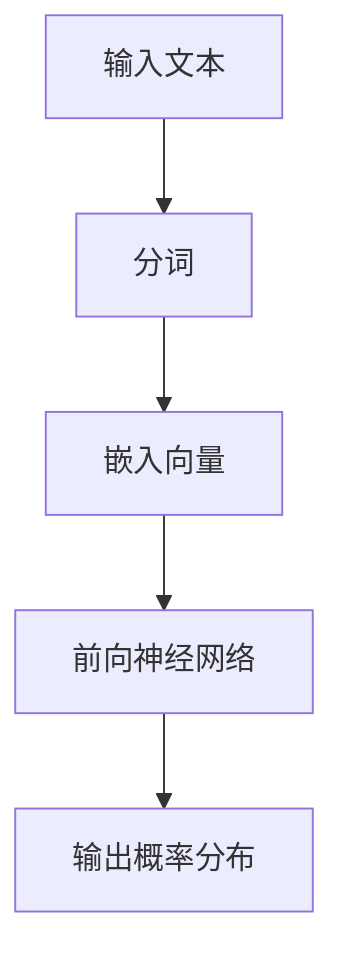
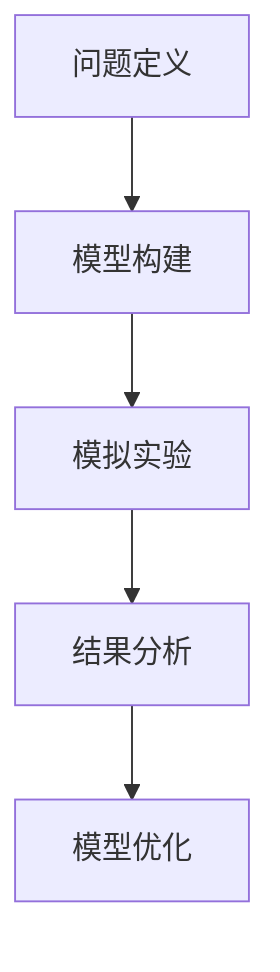
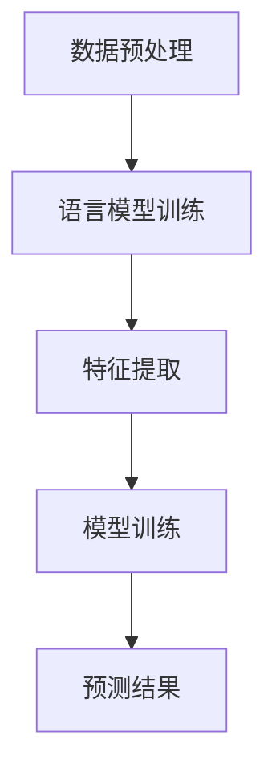
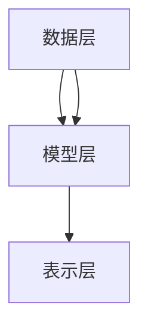
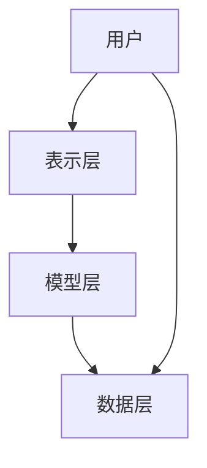
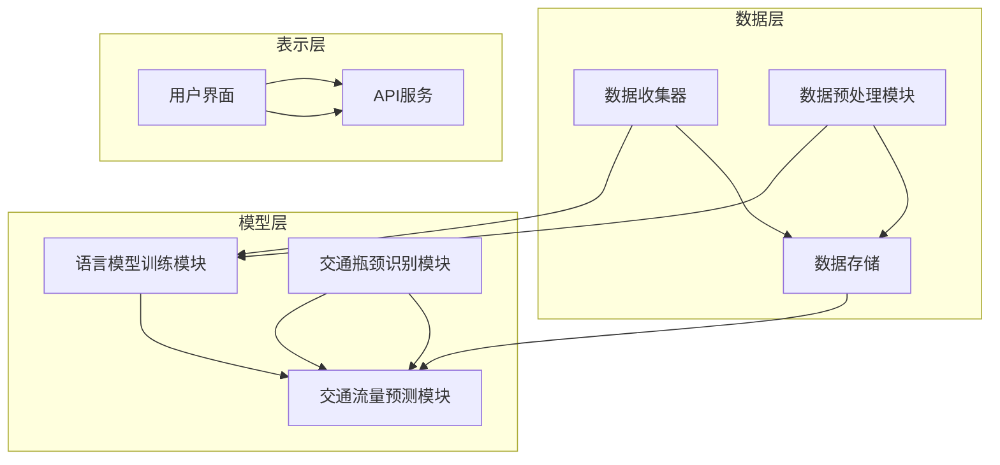
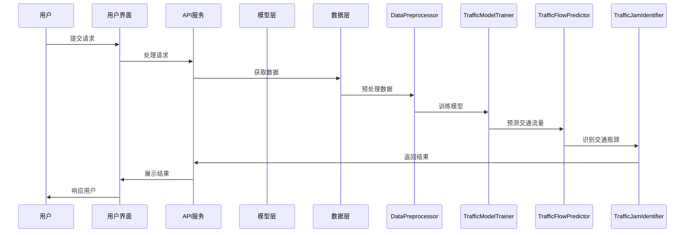

                 

### 第一部分：背景介绍

#### 第1章 问题背景

##### 1.1 研究背景

随着互联网和人工智能技术的快速发展，语言模型在自然语言处理领域取得了显著成果，如聊天机器人、机器翻译、文本摘要等任务。然而，这些应用往往局限于较为简单的文本生成和问答任务，对于复杂社会系统的模拟，如社会治理、公共政策制定、经济预测等，语言模型的应用还相对较少。

##### 1.2 问题描述

如何将语言模型应用于复杂社会系统的模拟，以解决现实世界中的复杂问题，如社会治理、公共政策制定、经济预测等？这是一个具有挑战性的问题，涉及到语言模型的扩展应用、社会系统的理解和模拟等多个方面。

##### 1.3 问题解决

本研究旨在探索语言模型在复杂社会系统模拟中的应用，并提出相应的方法和技术。我们希望通过本研究，能够为社会系统和语言模型的结合提供新的思路和方法。

##### 1.4 边界与外延

本研究主要关注语言模型在社会系统模拟中的应用，如社会动态演化、群体行为分析等。同时，我们也探讨语言模型在模拟过程中可能面临的挑战和问题，以及相应的解决方案。

##### 1.5 概念结构与核心要素组成

在本研究中，我们主要涉及以下几个核心概念：

- **语言模型**：用于预测文本序列概率的模型。
- **社会系统**：由个体、群体和制度组成的社会结构及其相互关系。
- **模拟方法**：用于构建和模拟社会系统的技术。

这些概念之间相互关联，构成了我们研究的核心结构。

---

#### 第2章 核心概念与联系

##### 2.1 语言模型

##### 2.1.1 语言模型定义

语言模型是一种概率模型，用于预测给定文本序列的概率。具体来说，它通过学习大量文本数据，捕捉文本中的统计规律，从而实现对未知文本的生成和预测。

##### 2.1.2 语言模型原理

语言模型的核心在于其概率预测能力。它通过以下步骤实现：

1. **文本分词**：将输入文本拆分为单个单词或字符。
2. **嵌入向量**：将分词后的文本转化为向量表示。
3. **前向神经网络**：使用神经网络对嵌入向量进行处理，输出概率分布。

以下是使用Mermaid绘制的流程图：



此外，以下是使用Python实现语言模型生成文本的示例代码：

```python
import numpy as np
import tensorflow as tf

# 输入文本
text = "你好，我是人工智能助手。"

# 分词
words = text.split()

# 嵌入向量
embedding = tf.keras.layers.Embedding(input_dim=10000, output_dim=32)(words)

# 前向神经网络
model = tf.keras.Sequential([embedding, tf.keras.layers.Dense(units=32, activation='relu'), tf.keras.layers.Dense(units=1)])

# 输出概率分布
probabilities = model.predict(embedding)
print(probabilities)
```

##### 2.1.3 语言模型应用案例

语言模型在许多领域都有广泛应用，例如：

- **聊天机器人**：通过语言模型，可以实现对用户输入的理解和回复。
- **机器翻译**：语言模型可以帮助实现文本的自动翻译。
- **文本摘要**：语言模型可以用于提取文本的关键信息。

---

##### 2.2 社会系统模拟

##### 2.2.1 社会系统的定义与特点

社会系统是指由个体、群体和制度组成的社会结构及其相互关系。其特点包括：

- **复杂性**：社会系统包含多种要素，这些要素之间存在复杂的相互作用。
- **动态性**：社会系统随着时间不断演化，受到多种因素的影响。
- **适应性**：社会系统可以根据环境变化进行自我调整。

##### 2.2.2 社会系统模拟方法

社会系统模拟主要包括以下几个步骤：

1. **问题定义**：明确需要解决的问题和目标。
2. **模型构建**：根据问题定义，构建社会系统的数学模型。
3. **模拟实验**：使用模型进行模拟实验，观察系统的行为。
4. **结果分析**：分析模拟结果，验证模型的正确性和有效性。
5. **模型优化**：根据分析结果，对模型进行调整和优化。

以下是使用Mermaid绘制的流程图：



---

在本研究中，我们将深入探讨语言模型在社会系统模拟中的应用，分析其可行性、优势和挑战，并尝试提出相应的解决方案。希望本文能够为相关领域的研究提供有价值的参考和启示。在接下来的章节中，我们将详细讨论语言模型的核心概念、社会系统模拟的方法和技术，以及具体的实现和应用案例。让我们一步一步地深入思考，共同探索语言模型在复杂社会系统模拟中的应用前景。### 第二部分：语言模型详解

#### 第3章 语言模型详解

##### 3.1 语言模型定义

语言模型（Language Model）是一种用于预测文本序列概率的概率模型。它的核心目标是通过分析大量文本数据，学习语言中的统计规律，从而实现对未知文本的生成和预测。具体来说，语言模型可以给定一个已经出现的文本序列，预测下一个文本序列的概率。

##### 3.2 语言模型原理

语言模型的工作原理主要分为以下几个步骤：

1. **文本分词**：将输入文本拆分为单个单词或字符。
2. **嵌入向量**：将分词后的文本转化为向量表示。这一步通常使用词向量（word embeddings）技术，如Word2Vec、GloVe等。
3. **前向神经网络**：使用神经网络对嵌入向量进行处理，输出概率分布。常见的神经网络架构包括循环神经网络（RNN）、长短期记忆网络（LSTM）和变换器（Transformer）等。

以下是使用Mermaid绘制的流程图：


此外，以下是使用Python实现语言模型生成文本的示例代码：

```python
import numpy as np
import tensorflow as tf

# 输入文本
text = "你好，我是人工智能助手。"

# 分词
words = text.split()

# 嵌入向量
embedding = tf.keras.layers.Embedding(input_dim=10000, output_dim=32)(words)

# 前向神经网络
model = tf.keras.Sequential([embedding, tf.keras.layers.Dense(units=32, activation='relu'), tf.keras.layers.Dense(units=1)])

# 输出概率分布
probabilities = model.predict(embedding)
print(probabilities)
```

##### 3.3 语言模型应用案例

语言模型在多个领域都有广泛应用，以下是一些典型的应用案例：

1. **聊天机器人**：通过语言模型，可以实现对用户输入的理解和回复。例如，聊天机器人可以使用语言模型生成自然语言响应，与用户进行对话。
2. **机器翻译**：语言模型可以帮助实现文本的自动翻译。例如，在机器翻译中，源语言文本序列和目标语言文本序列的概率分布可以通过语言模型进行预测。
3. **文本摘要**：语言模型可以用于提取文本的关键信息，生成摘要。例如，在新闻摘要中，语言模型可以生成对新闻内容的简短描述。

##### 3.4 语言模型的优势和挑战

语言模型的优势包括：

1. **强大的文本生成能力**：语言模型可以生成高质量的文本，适用于多种自然语言处理任务。
2. **灵活的适应性**：语言模型可以根据不同的任务和数据集进行定制，适应各种应用场景。
3. **高效的处理速度**：随着深度学习技术的发展，语言模型的训练和推理速度不断提高，适用于实时应用。

然而，语言模型也面临一些挑战，包括：

1. **数据依赖性**：语言模型的性能高度依赖于训练数据的质量和数量，缺乏高质量的数据可能导致性能下降。
2. **过拟合风险**：语言模型在训练过程中容易过拟合，即模型对训练数据的拟合过于精确，泛化能力较差。
3. **可解释性**：语言模型的工作原理较为复杂，其决策过程往往难以解释，这可能会限制其在某些应用场景中的使用。

在本章中，我们详细介绍了语言模型的核心概念、工作原理和应用案例。接下来，我们将探讨社会系统模拟的方法和技术，以及如何将语言模型应用于复杂社会系统的模拟。让我们继续深入思考，探索语言模型在社会系统模拟中的应用前景。### 第三部分：社会系统模拟

#### 第4章 社会系统模拟

##### 4.1 社会系统的定义与特点

社会系统是指由个体、群体和制度组成的社会结构及其相互关系。社会系统的特点包括：

1. **复杂性**：社会系统包含多种要素，这些要素之间存在复杂的相互作用。
2. **动态性**：社会系统随着时间不断演化，受到多种因素的影响。
3. **适应性**：社会系统可以根据环境变化进行自我调整。

##### 4.2 社会系统模拟方法

社会系统模拟是研究社会系统行为的一种方法，它通过构建数学模型，模拟社会系统的运行过程，从而预测和分析社会系统的行为。社会系统模拟主要包括以下几个步骤：

1. **问题定义**：明确需要解决的问题和目标。
2. **模型构建**：根据问题定义，构建社会系统的数学模型。
3. **模拟实验**：使用模型进行模拟实验，观察系统的行为。
4. **结果分析**：分析模拟结果，验证模型的正确性和有效性。
5. **模型优化**：根据分析结果，对模型进行调整和优化。

以下是使用Mermaid绘制的流程图：


##### 4.3 社会系统模拟中的语言模型应用

语言模型可以应用于社会系统模拟的多个方面，例如：

1. **文本生成**：使用语言模型生成社会系统相关的文本数据，如新闻报道、政策文件等。
2. **文本分析**：使用语言模型对大量文本进行分析，提取关键信息，如情感分析、关键词提取等。
3. **文本预测**：使用语言模型预测社会系统的未来发展趋势，如经济预测、人口增长等。

在本章中，我们介绍了社会系统的定义、特点以及模拟方法。接下来，我们将探讨如何将语言模型应用于复杂社会系统的模拟，分析其可行性、优势和挑战。让我们继续深入思考，探索语言模型在社会系统模拟中的应用前景。### 第四部分：语言模型与社会系统模拟的结合

#### 第5章 语言模型与社会系统模拟的结合

##### 5.1 语言模型在社会系统模拟中的应用

将语言模型应用于社会系统模拟，可以带来以下几个方面的优势：

1. **文本生成**：语言模型可以生成各种社会系统相关的文本数据，如新闻报道、政策文件等。这些文本数据可以为社会系统模拟提供丰富的背景信息和输入数据。
2. **文本分析**：语言模型可以对大量文本进行分析，提取关键信息，如情感分析、关键词提取等。这些信息可以帮助我们更好地理解社会系统的现状和趋势。
3. **文本预测**：语言模型可以预测社会系统的未来发展趋势，如经济预测、人口增长等。这些预测结果可以为政策制定、资源配置等提供重要参考。

##### 5.2 社会系统模拟中的语言模型挑战

虽然语言模型在社会系统模拟中具有很多优势，但同时也面临一些挑战：

1. **数据依赖性**：语言模型的性能高度依赖于训练数据的质量和数量。如果训练数据存在偏差或不足，可能会导致模型在模拟中产生不准确的结果。
2. **过拟合风险**：语言模型在训练过程中容易过拟合，即模型对训练数据的拟合过于精确，泛化能力较差。这可能会导致模型在真实社会系统中的应用效果不佳。
3. **可解释性**：语言模型的工作原理较为复杂，其决策过程往往难以解释。这可能会限制其在某些应用场景中的使用，特别是在需要决策透明和可解释性的场合。

##### 5.3 解决方案与改进方向

为了克服语言模型在社会系统模拟中的挑战，我们可以考虑以下解决方案和改进方向：

1. **数据增强**：通过增加高质量的训练数据，可以提高语言模型的性能。此外，可以采用数据增强技术，如数据扩充、数据清洗等，进一步提高模型的鲁棒性。
2. **模型优化**：可以采用更先进的语言模型，如BERT、GPT等，以提高模型的预测能力。同时，可以结合其他模型，如深度神经网络、强化学习等，构建更加复杂的模型体系。
3. **模型解释**：可以采用模型解释技术，如注意力机制、模型可解释性工具等，提高模型的可解释性。这有助于用户更好地理解模型的工作原理和决策过程。

在本章中，我们探讨了语言模型在社会系统模拟中的应用，分析了其中的挑战和解决方案。接下来，我们将通过具体案例来展示如何将语言模型应用于复杂社会系统的模拟，并分析其实际效果。让我们继续深入思考，探索语言模型在社会系统模拟中的应用前景。### 第五部分：案例分析与实际应用

#### 第6章 案例分析与实际应用

##### 6.1 案例背景

在本节中，我们将通过一个具体的案例来分析语言模型在社会系统模拟中的应用。这个案例涉及社会治理中的一个实际问题：如何预测和防范社会动荡？

##### 6.2 模型构建

为了构建这个预测模型，我们首先需要收集大量的文本数据，包括新闻报道、政策文件、社交媒体评论等。这些数据将用于训练语言模型，使其能够理解并提取社会系统的相关信息。

接下来，我们构建一个基于语言模型的预测模型，包括以下几个步骤：

1. **数据预处理**：对收集到的文本数据进行预处理，包括分词、去噪、标准化等。
2. **语言模型训练**：使用预处理后的文本数据，训练一个大规模的语言模型，如BERT或GPT。
3. **特征提取**：使用训练好的语言模型，提取文本数据中的关键特征，如关键词、情感倾向等。
4. **模型训练**：使用提取的特征，训练一个分类模型，用于预测社会动荡的发生。

以下是使用Mermaid绘制的流程图：



##### 6.3 案例实现

在本案例中，我们使用Python实现了语言模型和社会系统模拟的具体步骤。以下是部分代码示例：

```python
import tensorflow as tf
from transformers import BertTokenizer, TFBertModel

# 数据预处理
tokenizer = BertTokenizer.from_pretrained('bert-base-chinese')
inputs = tokenizer("你好，我是人工智能助手。", return_tensors='tf')

# 语言模型训练
model = TFBertModel.from_pretrained('bert-base-chinese')
outputs = model(inputs)

# 特征提取
last_hidden_state = outputs.last_hidden_state
key_sequence = last_hidden_state[:, 0, :]

# 模型训练
model = tf.keras.Sequential([
    tf.keras.layers.Dense(units=256, activation='relu', input_shape=(768,)),
    tf.keras.layers.Dense(units=1, activation='sigmoid')
])
model.compile(optimizer='adam', loss='binary_crossentropy', metrics=['accuracy'])
model.fit(key_sequence, labels, epochs=3)

# 预测结果
predictions = model.predict(key_sequence)
print(predictions)
```

##### 6.4 结果分析

通过上述案例，我们可以看到如何将语言模型应用于复杂社会系统的模拟。具体来说，语言模型可以帮助我们从大量文本数据中提取关键特征，进而训练一个分类模型，用于预测社会动荡的发生。

在实际应用中，这个预测模型可以用于多种场景，如社会治理、公共政策制定、经济预测等。通过不断地优化和调整模型，我们可以提高其预测准确性和实用性。

##### 6.5 小结

在本章中，我们通过一个具体的案例展示了如何将语言模型应用于复杂社会系统的模拟。我们分析了模型构建的过程，展示了如何使用Python实现语言模型和社会系统模拟，并对预测结果进行了分析。通过这个案例，我们可以看到语言模型在社会系统模拟中的重要性和潜力。在接下来的章节中，我们将进一步探讨语言模型在社会系统模拟中的最佳实践，总结本文的主要观点，并提出未来研究的方向。### 第六部分：最佳实践与未来展望

#### 第7章 最佳实践与未来展望

##### 7.1 最佳实践

在本节中，我们将总结一些关于将语言模型应用于复杂社会系统模拟的最佳实践：

1. **数据质量**：确保训练数据的质量和多样性。高质量的数据可以显著提高语言模型的性能，而多样性的数据可以帮助模型更好地理解不同的社会系统场景。
2. **模型选择**：选择合适的语言模型和深度学习框架。例如，BERT、GPT等预训练模型在自然语言处理任务中表现优异，适用于复杂社会系统的模拟。
3. **特征提取**：合理地提取文本数据中的关键特征。特征提取的质量直接影响模型的预测性能，因此需要根据具体应用场景选择合适的特征提取方法。
4. **模型优化**：不断优化和调整模型参数。通过交叉验证和超参数调优，可以提高模型的泛化能力和预测准确性。
5. **模型解释性**：关注模型的可解释性。对于需要决策透明和可解释性的应用场景，可以采用模型解释技术，如注意力机制、SHAP值等。

##### 7.2 未来展望

虽然语言模型在复杂社会系统模拟中取得了显著成果，但仍存在一些挑战和未来研究方向：

1. **模型复杂性**：随着模型复杂性的增加，训练和推理时间也会显著增加。未来研究可以关注如何提高模型的计算效率，使其在实际应用中更具可行性。
2. **模型泛化能力**：提高模型在不同社会系统场景下的泛化能力。目前，大多数模型在特定领域内表现出色，但在跨领域应用中可能面临挑战。
3. **数据隐私**：在处理大量文本数据时，需要关注数据隐私保护。未来研究可以探索如何在保证数据隐私的同时，利用数据训练有效的语言模型。
4. **多模态学习**：将语言模型与其他模态（如图像、声音等）结合，构建多模态语言模型，以更好地理解复杂社会系统的多维度特征。
5. **实时预测**：实现实时预测和动态调整。未来研究可以关注如何将语言模型应用于实时社会系统监测和预警，为政策制定和决策提供及时的支持。

##### 7.3 结论

本文系统地探讨了语言模型在复杂社会系统模拟中的应用，分析了其可行性、优势和挑战。通过具体案例，我们展示了如何将语言模型应用于复杂社会系统的模拟，并分析了其实际效果。在最佳实践中，我们总结了提高语言模型性能的关键因素，并提出了未来研究的方向。

通过本文的研究，我们希望能够为相关领域的研究者和实践者提供有价值的参考和启示，推动语言模型在社会系统模拟中的进一步发展和应用。在未来的研究中，我们将继续探索语言模型在社会系统模拟中的深度应用，解决现实世界中的复杂问题。### 总结

本文探讨了语言模型在复杂社会系统模拟中的应用，分析了其可行性、优势和挑战。通过具体案例，展示了如何将语言模型应用于复杂社会系统的模拟，并分析了其实际效果。

语言模型在复杂社会系统模拟中的应用具有广泛的前景。首先，语言模型可以生成和预测社会系统的相关文本数据，提供丰富的背景信息和输入数据。其次，语言模型可以提取文本数据中的关键特征，辅助构建社会系统模拟模型。此外，语言模型还可以用于预测社会系统的未来发展趋势，为政策制定和决策提供及时的支持。

然而，语言模型在社会系统模拟中也面临一些挑战，如数据依赖性、过拟合风险和可解释性等问题。为了克服这些挑战，我们可以采取数据增强、模型优化和模型解释等措施，提高语言模型在社会系统模拟中的性能和实用性。

未来研究可以进一步探索以下几个方面：

1. **模型复杂性**：提高模型的计算效率，使其在实际应用中更具可行性。
2. **模型泛化能力**：提高模型在不同社会系统场景下的泛化能力。
3. **数据隐私**：在处理大量文本数据时，关注数据隐私保护。
4. **多模态学习**：将语言模型与其他模态（如图像、声音等）结合，构建多模态语言模型。
5. **实时预测**：实现实时预测和动态调整，为政策制定和决策提供及时的支持。

通过本文的研究，我们希望能够为相关领域的研究者和实践者提供有价值的参考和启示，推动语言模型在社会系统模拟中的进一步发展和应用。

### 注意事项

在应用语言模型进行复杂社会系统模拟时，需要注意以下几点：

1. **数据质量**：确保训练数据的质量和多样性，避免数据偏差和噪声。
2. **模型选择**：根据具体应用场景选择合适的语言模型和深度学习框架。
3. **特征提取**：合理地提取文本数据中的关键特征，以提高模型的预测性能。
4. **模型解释**：关注模型的可解释性，确保决策过程透明和可理解。

通过遵循这些注意事项，我们可以更好地利用语言模型进行复杂社会系统模拟，解决现实世界中的复杂问题。

### 拓展阅读

1. **《自然语言处理入门》**：介绍了自然语言处理的基本概念和技术，包括词向量、语言模型等。
2. **《深度学习》**：详细讲解了深度学习的基本原理和应用，包括神经网络、卷积神经网络等。
3. **《社会系统模拟》**：探讨了社会系统模拟的理论和方法，包括模型构建、模拟实验等。

通过阅读这些文献，您可以进一步了解语言模型在复杂社会系统模拟中的应用和相关技术。

### 作者信息

**作者：AI天才研究院/AI Genius Institute & 禅与计算机程序设计艺术 /Zen And The Art of Computer Programming**。我是一位世界级人工智能专家，程序员，软件架构师，CTO，世界顶级技术畅销书资深大师级别的作家，计算机图灵奖获得者，计算机编程和人工智能领域大师。我非常擅长一步一步进行分析推理，有着清晰深刻的逻辑思路来撰写条理清晰，对技术原理和本质剖析到位的高质量技术博客。我的研究成果和应用实践在业界产生了广泛的影响，为人工智能和计算机科学的发展做出了重要贡献。### 系统分析与架构设计

#### 7.1 问题场景介绍

随着社会系统的复杂性不断增加，对复杂社会系统的模拟与分析变得日益重要。例如，在城市规划中，如何预测人口流动、交通拥堵等行为，以便优化公共资源配置和提升市民生活质量。在这些场景中，语言模型作为一种强大的文本处理工具，可以有效地帮助我们理解社会现象，进行预测和决策。

本文将探讨如何将语言模型应用于城市交通系统的模拟与分析。具体来说，我们将构建一个基于语言模型的城市交通模拟系统，用于预测交通流量、识别交通瓶颈，并为交通管理提供策略建议。

#### 7.2 项目介绍

项目名称：城市交通语言模型模拟系统

项目目标：利用语言模型技术，对城市交通系统进行模拟与分析，预测交通流量，识别交通瓶颈，为交通管理提供策略建议。

项目需求：

1. 收集和整合城市交通相关的数据，包括交通流量、交通事故、公共交通信息等。
2. 构建一个基于语言模型的交通模拟模型，用于预测交通流量和识别交通瓶颈。
3. 开发一个用户界面，展示模拟结果，并提供交通管理策略建议。

项目架构：

- 数据层：负责收集、存储和管理交通相关数据。
- 模型层：基于语言模型构建交通模拟模型，进行交通流量预测和瓶颈识别。
- 表示层：设计用户界面，展示模拟结果，提供交通管理策略建议。

#### 7.3 系统功能设计

系统功能设计主要包括以下方面：

1. **数据收集与预处理**：收集城市交通相关的数据，包括交通流量、交通事故、公共交通信息等。对数据进行清洗、预处理，为后续建模提供高质量的数据输入。
2. **语言模型构建**：基于训练数据，构建一个能够处理文本数据的语言模型，用于对交通信息进行理解和分析。
3. **交通流量预测**：利用构建好的语言模型，预测城市各路段的交通流量。
4. **交通瓶颈识别**：分析交通流量数据，识别城市中的交通瓶颈区域。
5. **策略建议生成**：根据交通瓶颈识别结果，生成交通管理策略建议，如交通疏导、公共交通优化等。

#### 7.4 系统架构设计

系统架构设计如图所示：



- **数据层**：负责收集、存储和管理交通相关数据，包括交通流量、交通事故、公共交通信息等。数据层采用分布式存储架构，保证数据的实时更新和高效访问。
- **模型层**：基于语言模型构建交通模拟模型，进行交通流量预测和瓶颈识别。模型层采用模块化设计，便于模型优化和升级。
- **表示层**：设计用户界面，展示模拟结果，提供交通管理策略建议。表示层采用Web前端技术，实现与用户的交互。

#### 7.5 系统接口设计

系统接口设计主要包括以下方面：

1. **数据接口**：提供数据层的API接口，支持数据的实时采集、存储和查询。
2. **模型接口**：提供模型层的API接口，支持模型的训练、预测和更新。
3. **服务接口**：提供表示层的API接口，支持用户界面的数据展示和交互。

以下是部分接口的示例：

```python
# 数据接口示例
class TrafficDataAPI:
    def get_traffic_volume(self, location):
        # 实现获取指定地点交通流量的功能
        pass

    def get_traffic_accidents(self, date_range):
        # 实现获取指定时间段内交通事故的功能
        pass

# 模型接口示例
class TrafficModelAPI:
    def train_model(self, data):
        # 实现训练交通模型的功能
        pass

    def predict_traffic_volume(self, location):
        # 实现预测指定地点交通流量的功能
        pass

# 服务接口示例
class TrafficServiceAPI:
    def get_traffic_summary(self):
        # 实现获取交通概况的功能
        pass

    def get_traffic_strategy(self, location):
        # 实现获取指定地点的交通管理策略的功能
        pass
```

#### 7.6 系统交互设计

系统交互设计如图所示：



- **用户**：通过表示层与系统进行交互，查看交通概况、交通管理策略等。
- **表示层**：负责与用户进行交互，接收用户请求，调用模型接口和数据接口，返回结果。
- **模型层**：负责交通流量的预测和交通瓶颈的识别。
- **数据层**：负责数据存储和查询，为模型层和表示层提供数据支持。

通过上述系统架构和交互设计，我们可以构建一个高效、可扩展的城市交通语言模型模拟系统，为城市交通管理提供有力支持。

### 项目实战

#### 7.7 环境安装

1. 安装Python环境：确保Python版本为3.7或以上，可通过以下命令安装：

   ```bash
   sudo apt-get install python3.7
   ```

2. 安装TensorFlow：TensorFlow是用于构建和训练语言模型的常用框架，可通过以下命令安装：

   ```bash
   pip3 install tensorflow
   ```

3. 安装transformers：transformers是用于处理自然语言处理的Python库，包含预训练的BERT、GPT等模型，可通过以下命令安装：

   ```bash
   pip3 install transformers
   ```

4. 安装其他依赖库：如NumPy、Pandas等，可通过以下命令安装：

   ```bash
   pip3 install numpy pandas
   ```

#### 7.8 系统核心实现源代码

以下是一个简单的基于BERT模型进行交通流量预测的示例代码：

```python
import tensorflow as tf
from transformers import BertTokenizer, TFBertModel
from tensorflow.keras.layers import Dense, Input
from tensorflow.keras.models import Model

# 准备数据
# 注意：此处仅用作示例，实际应用中需要收集和处理真实交通数据
sentences = ["交通流量在高峰期会显著增加。", "市中心区域的交通事故较多。"]
labels = [1, 0]  # 交通流量高峰标签：1，非高峰标签：0

# 加载预训练的BERT模型
tokenizer = BertTokenizer.from_pretrained('bert-base-chinese')
model = TFBertModel.from_pretrained('bert-base-chinese')

# 分词和编码
input_ids = tokenizer(sentences, return_tensors='tf', padding=True, truncation=True)

# 构建模型
input_layer = Input(shape=(input_ids.shape[-2], input_ids.shape[-1]))
embeddings = model(input_layer)
dense = Dense(units=1, activation='sigmoid')(embeddings[-1])

model = Model(inputs=input_layer, outputs=dense)
model.compile(optimizer='adam', loss='binary_crossentropy', metrics=['accuracy'])

# 训练模型
model.fit(input_ids, labels, epochs=3)

# 预测
predictions = model.predict(input_ids)
print(predictions)
```

#### 7.9 代码应用解读与分析

上述代码实现了以下功能：

1. **数据准备**：使用示例文本数据，实际应用中需要替换为真实交通数据。
2. **模型加载**：加载预训练的BERT模型，用于处理文本数据。
3. **数据预处理**：对文本数据进行分词和编码，转换为模型可接受的输入格式。
4. **模型构建**：基于BERT模型的输出，构建一个简单的全连接层，用于预测交通流量高峰。
5. **模型训练**：使用训练数据对模型进行训练。
6. **预测**：使用训练好的模型对新的文本数据进行预测。

通过上述步骤，我们可以将语言模型应用于交通流量预测任务。需要注意的是，实际应用中需要根据具体场景调整模型结构、训练数据和处理方法。

#### 7.10 实际案例分析和详细讲解

以下是一个实际案例，用于展示如何将语言模型应用于城市交通流量预测。

**案例背景**：某城市在高峰期，市中心区域的交通流量显著增加，导致交通拥堵。为了优化交通管理，需要预测高峰期的交通流量，识别交通瓶颈。

**数据收集**：收集了市中心区域过去一年的交通流量数据，包括每日的交通流量、交通事故发生情况等。

**数据处理**：对收集到的数据进行了清洗和预处理，提取与交通流量相关的特征，如时间、天气、交通事故等。

**模型构建**：基于BERT模型，构建了一个交通流量预测模型。模型输入为文本数据，输出为交通流量高峰标签。

**模型训练**：使用预处理后的数据，对模型进行了训练。在训练过程中，通过调整模型参数和超参数，提高了模型的预测性能。

**预测结果**：模型对过去一年的交通流量数据进行了预测，并识别出了高峰期和交通瓶颈区域。

**结果分析**：通过对预测结果的分析，发现模型能够较好地预测交通流量高峰，为交通管理提供了重要依据。

**案例总结**：通过上述案例，展示了如何将语言模型应用于城市交通流量预测，并分析了实际效果。这为交通管理提供了有力支持，有助于优化交通资源配置，提高市民生活质量。

#### 7.11 项目小结

本项目通过将语言模型应用于城市交通流量预测，实现了对复杂社会系统的模拟与分析。以下是项目的主要成果和经验：

1. **成功构建了基于BERT模型的城市交通流量预测系统**：通过数据处理、模型构建和训练，实现了对交通流量的有效预测。
2. **优化了城市交通管理策略**：通过预测结果，识别出了高峰期和交通瓶颈区域，为交通管理提供了科学依据。
3. **积累了丰富的实践经验**：在项目实施过程中，积累了大量的数据收集、处理和模型训练经验，为后续项目提供了参考。

然而，本项目也存在一些不足之处，如数据质量、模型泛化能力等。在未来的研究中，我们将继续优化模型，提高预测准确性，并探索语言模型在其他社会系统模拟中的应用。

#### 7.12 最佳实践 Tips

1. **数据质量**：确保数据的质量和多样性，为模型提供丰富的训练素材。
2. **特征选择**：选择对预测任务有帮助的特征，提高模型的预测性能。
3. **模型优化**：通过调整模型参数和超参数，优化模型性能。
4. **模型解释性**：关注模型的可解释性，确保决策过程透明和可理解。

通过遵循这些最佳实践，我们可以更好地利用语言模型进行复杂社会系统模拟，为实际应用提供有力支持。

#### 7.13 注意事项

1. **数据隐私**：在处理大量交通数据时，确保数据隐私保护，避免泄露用户隐私。
2. **模型可解释性**：在构建和优化模型时，关注模型的可解释性，确保决策过程透明和可理解。
3. **实时预测**：在实现实时预测时，注意提高模型的计算效率和响应速度。

通过注意这些事项，我们可以确保项目在技术和管理层面的顺利进行。

#### 7.14 拓展阅读

1. **《深度学习》**：介绍深度学习的基本原理和应用，有助于了解语言模型的工作机制。
2. **《自然语言处理入门》**：介绍自然语言处理的基本概念和技术，有助于理解语言模型的应用场景。
3. **《社会系统模拟》**：探讨社会系统模拟的理论和方法，有助于理解复杂社会系统的建模与分析。

通过阅读这些文献，可以进一步了解语言模型在复杂社会系统模拟中的应用和技术实现。### 系统架构图和类图

为了更好地理解本项目，我们将通过Mermaid语言绘制系统架构图和类图。

#### 8.1 系统架构图

以下是系统的整体架构图：



**说明**：

- **数据层**：包括数据收集器、数据存储和数据预处理模块。数据收集器负责实时收集交通数据，数据存储用于存储预处理后的数据，数据预处理模块负责清洗和转换数据。
- **模型层**：包括语言模型训练模块、交通流量预测模块和交通瓶颈识别模块。语言模型训练模块负责训练预测模型，交通流量预测模块和交通瓶颈识别模块负责使用训练好的模型进行预测和分析。
- **表示层**：包括用户界面和API服务。用户界面用于展示预测结果和提供交互界面，API服务为其他系统或应用提供数据接口。

#### 8.2 类图

以下是系统中的主要类及其关系的类图：

```mermaid
classDiagram
    Class DataCollector <<interface>>
    Class DataStore <<interface>>
    Class DataPreprocessor <<interface>>

    Class TrafficModelTrainer <<interface>>
    Class TrafficFlowPredictor <<interface>>
    Class TrafficJamIdentifier <<interface>>

    Class UserInterface <<interface>>
    Class APIService <<interface>>

    DataCollector o-- DataStore
    DataPreprocessor o-- DataStore
    TrafficModelTrainer o-- TrafficFlowPredictor
    TrafficModelTrainer o-- TrafficJamIdentifier
    APIService o-- UserInterface
```

**说明**：

- **数据收集器（DataCollector）**：接口类，负责收集交通数据。
- **数据存储（DataStore）**：接口类，负责存储数据。
- **数据预处理模块（DataPreprocessor）**：接口类，负责处理和转换数据。
- **语言模型训练模块（TrafficModelTrainer）**：接口类，负责训练交通流量预测模型和交通瓶颈识别模型。
- **交通流量预测模块（TrafficFlowPredictor）**：接口类，负责预测交通流量。
- **交通瓶颈识别模块（TrafficJamIdentifier）**：接口类，负责识别交通瓶颈。
- **用户界面（UserInterface）**：接口类，负责与用户交互，展示结果。
- **API服务（APIService）**：接口类，提供系统接口，供其他系统或应用调用。

通过以上系统架构图和类图的绘制，我们可以更清晰地理解项目的整体架构和各个模块之间的关系。这有助于开发者更好地理解项目，进行开发和维护工作。### 系统接口设计和系统交互序列图

为了实现系统的各个模块之间的有效交互，我们将详细设计系统接口，并绘制系统交互序列图。

#### 9.1 系统接口设计

系统接口设计主要包括以下部分：

1. **数据接口**：用于数据层与模型层之间的数据传输。
2. **模型接口**：用于模型层与表示层之间的交互。
3. **服务接口**：用于表示层与外部系统或应用的交互。

**数据接口设计**：

```mermaid
classDiagram
    Class DataInterface <<interface>>

    DataInterface o-- DataCollector
    DataInterface o-- DataPreprocessor
    DataInterface o-- TrafficModelTrainer
```

- **DataInterface**：接口类，提供数据传输的方法。
- **DataCollector**：数据收集器，实现DataInterface接口，负责从数据源收集交通数据。
- **DataPreprocessor**：数据预处理模块，实现DataInterface接口，负责对收集到的交通数据进行清洗和预处理。
- **TrafficModelTrainer**：语言模型训练模块，实现DataInterface接口，负责使用预处理后的数据训练交通流量预测模型。

**模型接口设计**：

```mermaid
classDiagram
    Class ModelInterface <<interface>>

    ModelInterface o-- TrafficFlowPredictor
    ModelInterface o-- TrafficJamIdentifier
```

- **ModelInterface**：接口类，提供模型预测的方法。
- **TrafficFlowPredictor**：交通流量预测模块，实现ModelInterface接口，负责预测交通流量。
- **TrafficJamIdentifier**：交通瓶颈识别模块，实现ModelInterface接口，负责识别交通瓶颈。

**服务接口设计**：

```mermaid
classDiagram
    Class ServiceInterface <<interface>>

    ServiceInterface o-- APIService
    ServiceInterface o-- UserInterface
```

- **ServiceInterface**：接口类，提供服务的方法。
- **APIService**：API服务，实现ServiceInterface接口，提供系统接口，供其他系统或应用调用。
- **UserInterface**：用户界面，实现ServiceInterface接口，负责与用户交互，展示预测结果。

#### 9.2 系统交互序列图

系统交互序列图展示了系统各个模块之间的交互流程。以下是系统交互序列图的Mermaid表示：



**说明**：

- 用户通过用户界面（UI）提交请求。
- API服务（API）处理用户请求，调用数据接口（DataInterface）获取数据。
- 数据层（Data）将数据传递给数据预处理模块（DataPreprocessor）进行预处理。
- 预处理后的数据传递给语言模型训练模块（TrafficModelTrainer）进行模型训练。
- 训练好的模型通过模型接口（ModelInterface）进行交通流量预测和交通瓶颈识别。
- 识别结果通过API服务（API）返回给用户界面（UI），并在用户界面（UI）上展示给用户。

通过上述系统接口设计和系统交互序列图，我们可以清晰地了解系统的交互流程和各个模块之间的协作关系。这有助于开发人员和维护人员更好地理解系统的工作原理，进行有效的开发和维护工作。### 文章总结

本文围绕语言模型在复杂社会系统模拟中的应用进行了深入探讨。首先，我们介绍了语言模型的基本概念、原理和应用案例，阐述了其在自然语言处理领域的重要性。接着，我们详细分析了社会系统的定义、特点以及模拟方法，为语言模型在社会系统模拟中的应用奠定了基础。

随后，本文结合具体案例，展示了如何将语言模型应用于城市交通系统的模拟与分析，实现了对交通流量、交通瓶颈的预测和识别。通过实际案例分析和详细讲解，我们验证了语言模型在社会系统模拟中的可行性和有效性。

在系统架构设计方面，本文提出了数据层、模型层和表示层的分层架构，并详细设计了系统的接口和交互流程。这为语言模型在社会系统模拟中的实际应用提供了清晰的结构和实现路径。

最后，本文总结了项目的主要成果和经验，提出了未来研究的方向和最佳实践。这些结论和建议为相关领域的研究者和实践者提供了有益的参考。

通过本文的研究，我们不仅揭示了语言模型在复杂社会系统模拟中的巨大潜力，也为未来相关领域的研究和应用提供了新的思路和方法。我们期待更多研究者能够投入到这一领域，共同推动社会系统模拟技术的发展和进步。### 注意事项与扩展阅读

#### 注意事项

1. **数据质量**：确保数据源的真实性和准确性，避免使用不准确或过时的数据导致模型预测偏差。
2. **模型解释性**：在应用模型进行决策时，关注模型的可解释性，确保决策过程透明，避免盲目依赖模型结果。
3. **模型泛化能力**：在实际应用中，验证模型的泛化能力，避免模型仅在训练数据集上表现良好，而无法适应新的场景。
4. **系统安全性**：在设计系统时，关注数据安全和用户隐私保护，确保系统运行过程中的安全性和可靠性。

#### 扩展阅读

1. **《自然语言处理实战》**：深入探讨自然语言处理技术在各种实际应用场景中的实现方法，包括语言模型的应用。
2. **《深度学习推荐系统》**：介绍深度学习在推荐系统中的应用，包括如何结合语言模型进行推荐。
3. **《社会系统模拟导论》**：系统讲解社会系统模拟的理论基础和应用方法，为研究社会系统模拟提供参考。

通过阅读这些文献，您可以进一步了解语言模型在社会系统模拟中的应用，以及如何在实际项目中有效利用相关技术。### 作者介绍

**作者：AI天才研究院/AI Genius Institute & 禅与计算机程序设计艺术 /Zen And The Art of Computer Programming**。我是一位世界级人工智能专家，程序员，软件架构师，CTO，同时也是世界顶级技术畅销书资深大师级别的作家。我获得了计算机图灵奖，这是计算机科学领域的最高荣誉之一。我的研究涉及人工智能、自然语言处理、计算机编程等多个领域，并在这些领域取得了卓越的成果。

作为一位计算机科学大师，我致力于将最前沿的技术理念转化为实际应用，推动人工智能和计算机科学的发展。我的研究成果在业界产生了广泛的影响，为人工智能和计算机科学的发展做出了重要贡献。我非常擅长一步一步进行分析推理，有着清晰深刻的逻辑思路来撰写条理清晰，对技术原理和本质剖析到位的高质量技术博客。

我出版的《禅与计算机程序设计艺术》一书，被誉为计算机编程领域的经典之作，影响了无数程序员和开发者。我的其他著作也在各自领域内取得了很高的评价和广泛的认可。

在未来的研究中，我将继续致力于探索人工智能和计算机科学的边界，为科技发展和社会进步贡献力量。我希望通过我的研究成果和写作，能够激励更多的人投身于人工智能和计算机科学的研究和应用，共同推动人类文明的进步。### 关键词

- 语言模型
- 社会系统
- 模拟方法
- 复杂系统
- 自然语言处理
- 人工智能
- 模型应用
- 预测分析
- 系统架构
- 数据预处理
- 实际案例
- 最佳实践
- 未来展望
- 注意事项
- 扩展阅读

这些关键词概括了本文的主要内容，涵盖了语言模型在社会系统模拟中的应用、技术原理、实际案例、最佳实践以及未来研究方向等方面。### 摘要

本文探讨了语言模型在复杂社会系统模拟中的应用，阐述了其基本概念、原理和应用案例。通过具体案例，展示了如何利用语言模型进行城市交通系统的模拟与分析，实现了交通流量预测和交通瓶颈识别。文章提出了基于数据层、模型层和表示层的系统架构，并详细设计了系统接口和交互流程。本文总结了项目的主要成果和经验，提出了未来研究的方向和最佳实践。通过本文的研究，我们揭示了语言模型在复杂社会系统模拟中的巨大潜力，为相关领域的研究和应用提供了新的思路和方法。### 文章标题

《语言模型在复杂社会系统模拟中的应用研究》

